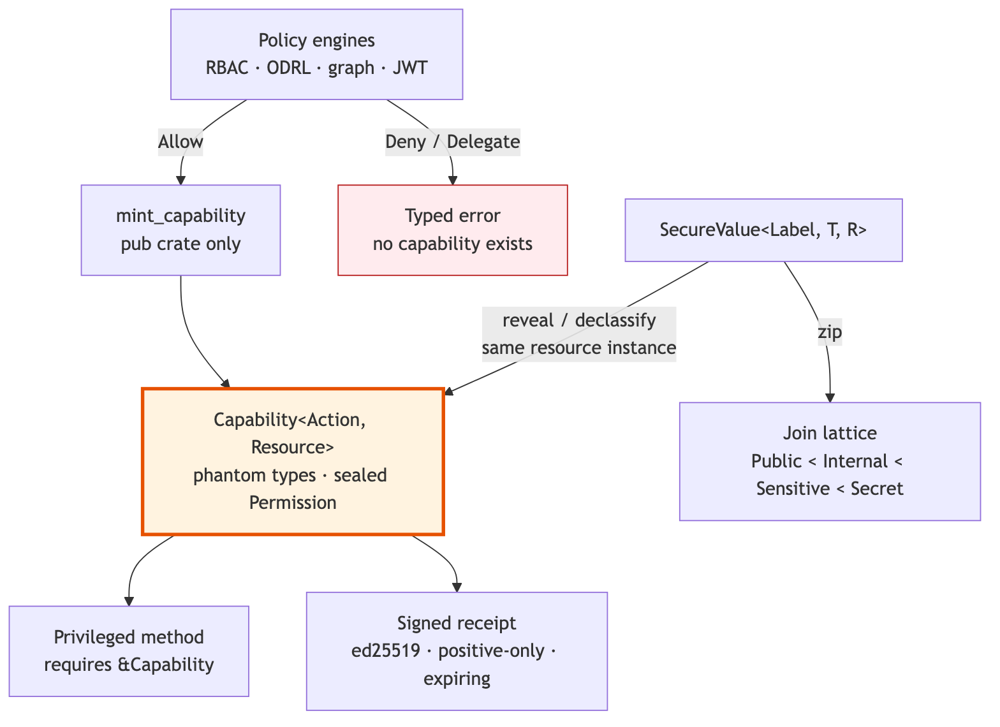
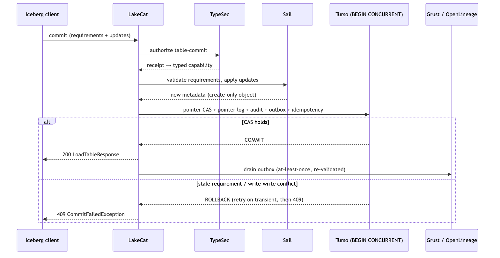

# Getting Out of the Way: the LakeCat paper on engine truth and typed governance

A lakehouse catalog sits between every engine and every table. That makes it the natural place to put governance — and the worst place to put a second query engine. Most catalogs resolve the tension by growing: they parse manifests, evaluate policies in a language of their own, keep a graph store, and vend broad storage credentials while hoping the client honors a restriction the catalog cannot enforce.

The new LakeCat paper, **"Getting Out of the Way: Engine Truth, Typed Governance, and the Thin Catalog"**, argues for the opposite discipline and reports the system we built on it. It is a companion to the earlier systems paper, and it goes back to first principles: where catalogs came from, where governance came from, and why composing a few old ideas *at the catalog* changes what a catalog can promise.

Read it on First Pair: [firstpair.org/read/lakecat-engine-truth](https://firstpair.org/read/lakecat-engine-truth/) (PDF and EPUB are linked from the reader page). The source lives in the LakeCat repository under `docs/papers/lakecat-engine-truth/`.

## Engine truth

The paper's first principle is one the LakeCat book already states: **Sail engine truth**. An Iceberg table is not a set of easy strings. "Only these columns" means nothing until it has been mapped through field ids, nested schema evolution, and projection rules. "Only these rows" means nothing until the predicate has been bound by the same expression system that will plan the scan. "These files" means nothing until manifest metrics, partition transforms, delete files, and snapshot context have been interpreted. The only component that does all of that *and is exercised by real execution* is the engine. So the interpretation of table state is authoritative only in the engine that plans and executes, and anything the catalog says about table content is a *binding* to that interpretation — never a substitute for it.

From that principle the paper derives what it calls the **engine contract**, four obligations a catalog accepts once it stops pretending to be an engine:

1. The catalog owns the transaction; the engine owns the table.
2. Governance restrictions are compiled into the plan, not checked beside it — and no later stateless step may widen them.
3. Data is brought closer to the engine: Rust to Rust, in one process, with reusable read-path machinery like the object-store cache living in the engine where every engine user benefits.
4. When engine truth is unavailable, the catalog fails closed rather than accepting work it cannot interpret.

"Getting out of the way" does not mean doing less. It means the catalog stands *beside* the request rather than *in front of* the data: it admits the request, obtains a typed decision, binds it to the current pointer and identity, asks the engine to turn the restriction into engine work, records the result, and steps aside. A stock Spark or PyIceberg client sees ordinary Iceberg REST. A governed agent receives bounded, Sail-planned tasks instead of broad credentials.

## Governance as a property of types

The second half of the argument is about what survives a policy check. A boolean has to be remembered and trusted by every downstream step. TypeSec returns something else: a `Capability<Action, Resource>` that only the policy engine can construct — crate-private constructor, phantom type parameters, sealed permission trait — so a privileged method that takes the capability as an argument simply cannot be called from an unauthorized path. The "forgotten check" of guard-based security becomes a missing argument the compiler reports.

The paper traces that idea back through SecLib and Andrzejewski's type-level privacy work to Denning's lattice model, and shows the rest of the chain: labeled `SecureValue`s whose join is a type, so derived data cannot fall below the label of its sources; ed25519-signed, positive-only receipts that carry a decision across process boundaries; and LakeCat's own typed capability, minted only from an allowed receipt and persisted in the same transaction as the catalog transition it authorized. Grust gets the same treatment as the derived-graph substrate, and QueryGraph as the Responsible Semantic Layer whose Apache Ossie models are compare-and-swap published through the catalog and bound to seven independently hashed proof bases.

## Adversarial by construction

The design was developed under pressure and the paper says how. Three successive multi-agent adversarial reviews — the first of which concluded that LakeCat "is not yet a catalog" — had their findings handed to a refutation pass before any were accepted, and every accepted finding was tracked to closure in the next review. The neutral, source-pinned, *unranked* `catalog-bench` harness then ran the system against Apache Polaris, Apache Gravitino, Lakekeeper, and Apache Nessie with stock Spark, Flink, Trino, DuckDB, and PyIceberg: eight-writer same-table contention (147.5 accepted commits/s with an 85.9% conflict rate that is the *expected* arithmetic of eight writers racing one pointer, and zero request errors), deterministic stale-requirement rejection, a fault proxy that distinguishes a request lost before the object store from a response lost after it, mid-request restart, cold restore, four-direction pointer migration, and six-way semantic drift injection against a pinned Ossie TPC-DS model.

The performance figures come with their asterisks attached — the 26× warm-scan win belongs to a cache that lives in Sail, not to Rust, and the honest engine edge over warm Spark is 1.63×. And the paper closes with the ledger's open rows: the governance findings the last review confirmed and the current release has not yet closed, including context-blind policy invocation and the header-trusted principal. A paper about actual governance has to carry its own ledger.

## Where to go from here

- Read the paper: [firstpair.org/read/lakecat-engine-truth](https://firstpair.org/read/lakecat-engine-truth/)
- The earlier systems paper, *LakeCat: A Thin, Governed, Replayable Catalog Foundation*: [firstpair.org/read/lakecat-catalog-foundation](https://firstpair.org/read/lakecat-catalog-foundation/)
- LakeCat, TypeSec, Grust, and the neutral harness: [github.com/querygraph](https://github.com/querygraph)

If you maintain a catalog, an engine, or a policy engine and think a claim in the paper is wrong, the evidence bundles are immutable and the review issues are open. Corrections become a new version of the feedback backlog; the historical evidence is never rewritten.
