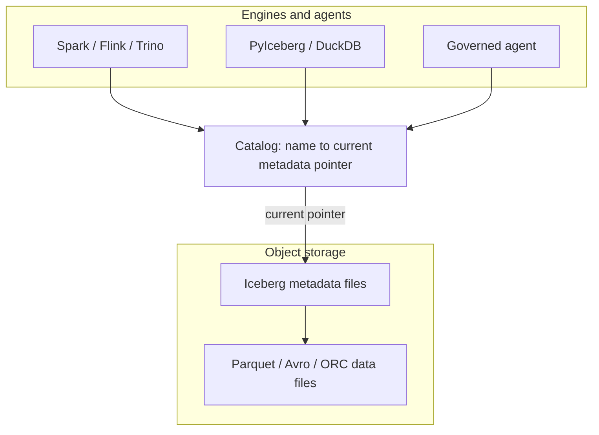
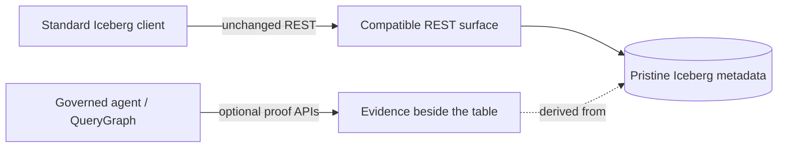
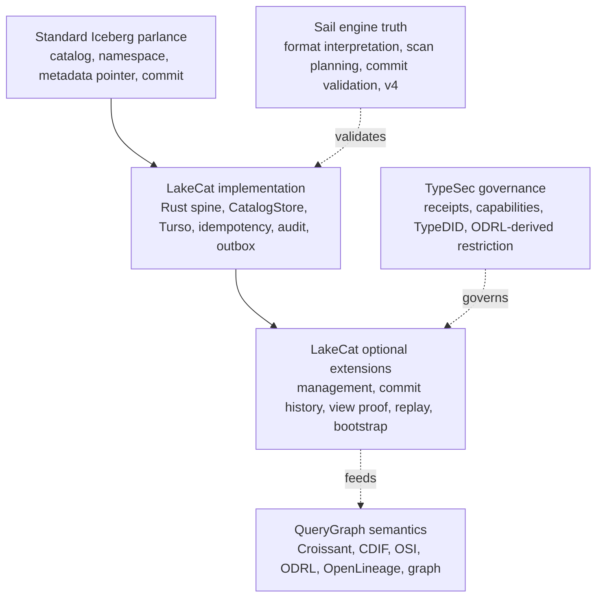
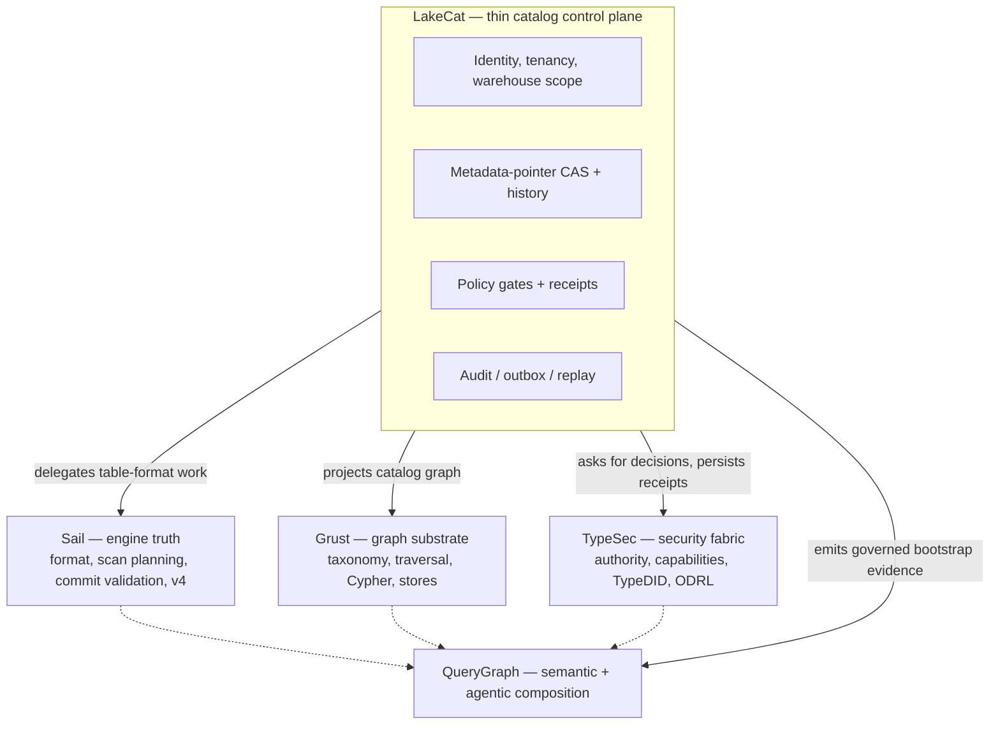
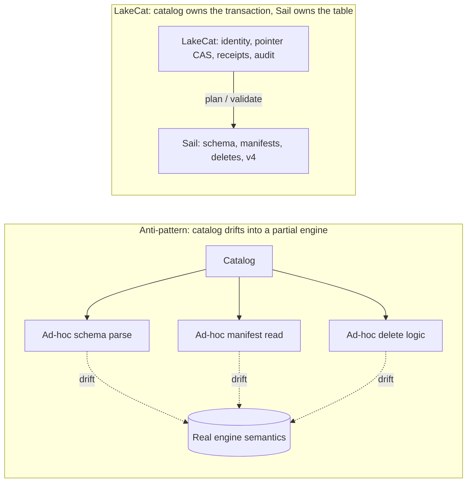
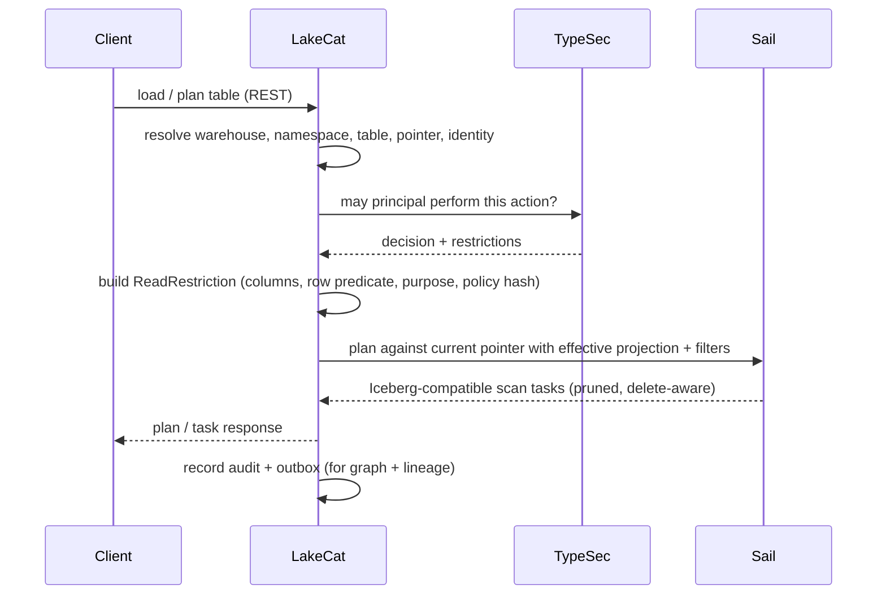
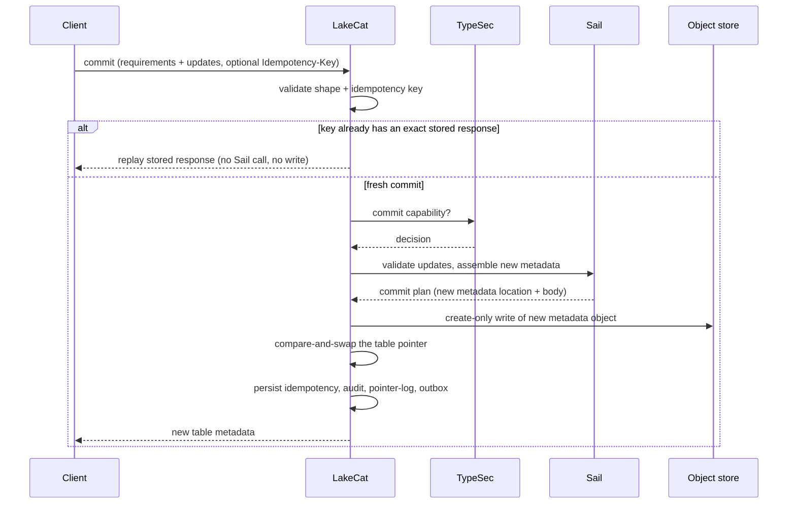
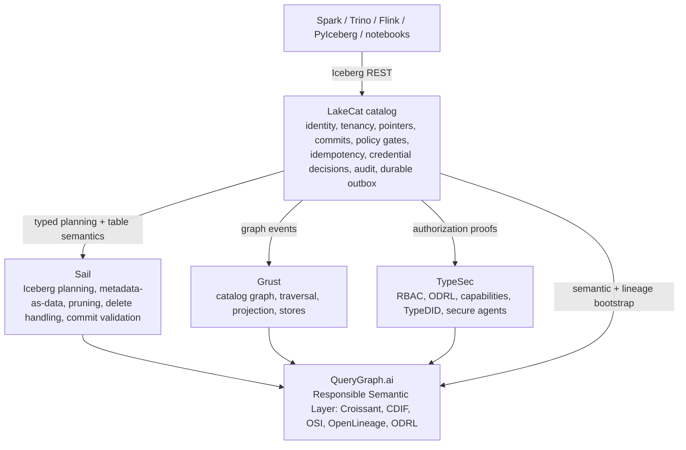

# Preface

LakeCat is a Rust-native, Iceberg-compatible catalog foundation for QueryGraph.
It begins from one conservative claim and one ambitious one. The conservative
claim: an ordinary Iceberg REST catalog must keep working for ordinary engines —
Spark, Flink, Trino, DuckDB, PyIceberg, Sail — with no new protocol to learn.
The ambitious claim: the *next* catalog also has to be a governed control plane
for Rust-first planning, semantic graph handoff, lineage, and agent access.

LakeCat holds both at once by drawing a sharp line. It keeps Iceberg
compatibility at the boundary and moves the work that needs deep table-format
knowledge to the engine that can reason about it. In this repository the catalog
is **LakeCat** and the engine-side lakehouse implementation is **Sail**. Graph
behavior belongs to **Grust**; governance and capability proof belong to
**TypeSec**; the end-to-end integration target is **QueryGraph**.

This book builds from first principles. Chapter 2 explains what a catalog is,
what Iceberg makes the catalog responsible for, and what LakeCat adds without
changing the table format. Chapter 3 fixes the vocabulary — the single hardest
thing in a layered system — so every later term has an owner. Chapter 4 draws
the boundary model: which repository owns which concept, and which ideas might
someday become neutral, standardizable profiles. The middle chapters walk the
live architecture: the service spine, the read path, the commit path, and the
durable store. The final chapters cover the engine boundary and the v3→v4 path,
the graph/security/lineage handoffs, the QueryGraph/QGLake acceptance flow,
worked examples, and the first-release scope.

Each concept is defined once and then used. Where a later chapter needs a term,
it links back rather than restating it.

# Catalogs, Iceberg, and What LakeCat Adds

## What a catalog is

A data catalog is often described as a place that lists datasets. That is true
but too small. A real catalog is the control plane between names, storage,
metadata, identity, and intent. At minimum it answers four questions:

1. What table does this name mean?
2. Where is its current metadata?
3. Who may read, write, plan, or administer it?
4. What changed, when, and under whose authority?

In a traditional database the catalog is embedded in the engine: one system owns
table definitions, statistics, permissions, and the transaction log. A lakehouse
pulls that apart. Data files live in object storage, metadata files live beside
them, and several engines read and write the same tables. The catalog becomes
the agreement point — it maps a logical table name to the current metadata
pointer and arbitrates updates to that pointer.



That pointer is deceptively important. If the catalog points at metadata version
17, the table *is* version 17. If a writer prepares version 18 and wins the
compare-and-swap, the table becomes 18; if it loses, nothing partially changes.
The catalog is not the table format, but it is where table history becomes
visible and durable. For human analytics this sounds like bookkeeping. For
agentic systems it is a trust boundary: a catalog can know the principal,
warehouse, namespace, table, snapshot, requested columns, row restriction,
storage profile, and policy receipt — and if it captures that before planning
and commits it after state changes, it becomes a governed control plane rather
than a passive address book.

## What Iceberg makes the catalog responsible for

Apache Iceberg is a table format for large analytic tables. Its core idea is to
put the table's truth in explicit metadata files so engines can plan reads and
validate writes without directory listing or fragile storage conventions. A
current metadata file names schemas, partition specs, sort orders, snapshots,
and properties; snapshots point to manifest lists; manifest lists point to
manifests; manifests describe data and delete files.

The catalog's role in Iceberg is intentionally narrow. Standard clients must be
able to load table metadata, create namespaces and tables, commit changes, and
sometimes receive credentials or scan tasks — over a documented REST shape:

```text
GET  /v1/config
GET  /v1/{prefix}/namespaces
POST /v1/{prefix}/namespaces/{ns}/tables
GET  /v1/{prefix}/namespaces/{ns}/tables/{table}
POST /v1/{prefix}/namespaces/{ns}/tables/{table}   # commit: requirements + updates
```

The rule that governs everything else in this book: **a normal client must never
have to call a non-standard endpoint to read an ordinary table.** If it does,
compatibility is already broken.

## What LakeCat adds without changing Iceberg

LakeCat's promise is *compatibility first, evidence second, semantics above the
catalog.* A Spark or PyIceberg client sees an Iceberg REST catalog. A QueryGraph
or governed-agent client may ask for richer proof. Both share the same table
because the portable truth stays in Iceberg metadata and the extra evidence
sits beside it — never inside the table format.



Iceberg metadata stays pristine. Policy, graph, lineage, and agent state are
*derived* control-plane or graph data. The table remains an Iceberg table.

# The Vocabulary

A layered system fails the moment its words blur. The most common mistake is to
call every useful LakeCat feature an "Iceberg extension," which makes the
standard boundary too large. The test is simple: **ask what breaks if a client
knows nothing about LakeCat.** If a PySpark job cannot load, commit, or drop a
table without the concept, it belongs to standard compatibility. If PySpark
keeps working but operators, governed agents, or QueryGraph gain stronger
evidence, the concept is an additive surface.

Every term in this book falls into one of six categories.



**Standard Iceberg parlance** — the words Iceberg already owns: catalog,
namespace, table identifier, current metadata location, snapshot, manifest list,
manifest, data file, delete file, schema and partition evolution, optimistic
commit, REST compatibility. LakeCat must implement these faithfully. Changing
their meaning means losing compatibility.

**LakeCat implementation** — how this Rust catalog satisfies the contract
reliably: the service spine, the `CatalogStore` trait, the Turso-backed durable
store, normalized idempotency rows, pointer logs, audit rows, outbox rows,
redaction rules, and replay validators. These make ordinary Iceberg behavior
atomic, inspectable, and replayable. They are not extensions; they are good
engineering behind a standard surface.

**LakeCat optional extensions** — additive APIs beside the standard path:
management inventory, commit-history inspection, view proof, credential-root
posture, replay verification, OpenLineage projection, and QueryGraph/QGLake
bootstrap bundles. They help operators, agents, and QueryGraph without becoming
hidden requirements for ordinary table access.

**TypeSec governance** — authority and receipt semantics: who may act, capability
proof, TypeDID envelopes, ODRL-derived restrictions, and agent posture. TypeSec
*decides*; LakeCat *carries and records* the decision.

**QueryGraph semantics** — composition above the catalog: Croissant, CDIF, OSI,
ODRL, OpenLineage, and Grust graph projections built from the governed source of
truth.

**Sail engine truth** — table-format interpretation, metadata-as-data, scan
planning, commit validation, and typed v4 behavior. The catalog binds its proof
to engine truth rather than reimplementing the format.

The single reference below replaces the per-claim restatements that earlier
drafts repeated; read each LakeCat claim through its category.

| Claim | Standard reading | Category | Portable idea (if any) |
| --- | --- | --- | --- |
| Rust service / catalog spine | Iceberg needs a catalog authority, not a language | LakeCat implementation | "A catalog can prove what it committed, planned, vended, and emitted" |
| Turso-backed durable store | Iceberg needs durable state + atomic pointer movement, not a named DB | LakeCat implementation | CAS, exact-retry, row/content binding, pointer-history proof |
| REST namespace/table routes + commit CAS | Standard compatibility | Standard Iceberg | — (must stay ordinary) |
| Idempotency, pointer logs, audit/outbox, replay validation | Mostly outside the table contract | LakeCat implementation / extension | Stable catalog-event identity; scoped replay admission |
| Governed scan with policy receipt | Iceberg gives scan inputs, not receipts | TypeSec governance | Engine-proved effective projection + predicate |
| Credential vending posture | Catalog-adjacent, not ordinary table semantics | TypeSec governance | Bounded, redacted, engine-neutral credential profile |
| QueryGraph / QGLake / OpenLineage handoff | Not required for table access | QueryGraph semantics | Redacted, replayable lineage/view/commit evidence |
| Typed Iceberg v4 behavior | Belongs to the format as it evolves | Sail engine truth | Engine-owned v4 interpretation, not catalog JSON parsing |

# The Boundary Model

The vocabulary tells you which category a word lives in. The boundary model says
which *repository* owns the work and why. LakeCat is deliberately thin: it keeps
identity, tenancy, metadata-pointer state, policy gates, idempotent commits, and
integration events — and delegates everything reusable.



The ownership rule, stated once:

| Concern | Owner | LakeCat keeps only |
| --- | --- | --- |
| Iceberg format, manifests, scan planning, pruning, delete handling, v4 | Sail | The call into Sail and the proof binding its result |
| Graph schema, taxonomy, traversal, stores, Cypher | Grust | The catalog-facing sink/projection boundary |
| Authorization, policy composition, capabilities, TypeDID, credential decisions | TypeSec | The request for a decision and the persisted receipt |
| Croissant/CDIF/OSI/ODRL/OpenLineage composition, agent workflows | QueryGraph | The governed bootstrap bundle it emits |
| Identity, tenancy, pointer CAS, idempotency, audit, outbox, replay | LakeCat | All of it — this is the thin catalog |

This is also the answer to the recurring "is it an extension or a standard?"
question. LakeCat is opinionated in code and modest in standardization. "Use
Rust," "use Turso," "use TypeSec," "import QGLake," "project into Grust" are
project choices, not proposals. The portable ideas are narrower and stated
without product names: *reject idempotency drift; record redacted pointer
history; emit transactional catalog-event identity; admit only scoped replay
evidence; prove a governed scan was narrowed by an engine.* A proposal that
forced every Iceberg catalog to understand QueryGraph, TypeSec, Grust, or Turso
would narrow the ecosystem; a proposal that says "a catalog may publish redacted,
replayable commit evidence" leaves room for many implementations. Prove the
stronger shape locally, then extract only the database-neutral, policy-neutral,
engine-neutral part.


# Where LakeCat Stands Today

LakeCat is not only a design. The implementation already has a Rust
service/catalog spine, a Turso-backed durable store, Iceberg REST-compatible
namespace and table paths, hardened commit and replay evidence, governed scan
and credential proof, and QueryGraph/QGLake handoff surfaces. Read each of those
through its category (Chapter 3) rather than flattening them into "Iceberg
extensions": some are ordinary catalog implementation, some are optional LakeCat
APIs, some are TypeSec governance proof, and only a few are plausible future
standardization candidates.

The most important word is **beside**. New capability sits beside the Iceberg
REST path, never in front of it. A standard client never has to present a
TypeDID, parse a QueryGraph bundle, read a Grust edge, or inspect an OpenLineage
receipt to load a normal table. So the same catalog shows a different face to
each caller:

| Caller | What they see |
| --- | --- |
| PySpark / PyIceberg user | Ordinary Iceberg REST. Configure a catalog, create a namespace, write and load tables. Pointer-log, audit, and outbox rows exist but are invisible to table semantics. |
| Platform operator | A hardened catalog transaction log: idempotency outcomes, pointer movement, redacted conflict proof, storage-profile and credential posture, pending outbox, replay-validation failures. |
| Governed agent | A narrowed access path: TypeSec decides the capability, LakeCat binds the receipt to the catalog action, Sail plans the effective scan, the agent gets bounded work instead of broad credentials. |
| QueryGraph importer | A proof-bearing bootstrap: table, view, management, credential, scan, commit-history, OpenLineage, and graph-import anchors that must line up before the semantic layer is accepted. |

That separation also keeps standardization honest. The interesting portable
shapes are never "LakeCat uses Turso" or "QueryGraph imports a bundle"; they are
smaller behaviors — idempotent commit replay, catalog pointer history, governed
credential vending, proof-carrying scan planning, redacted conflict evidence,
lineage receipt binding. The posture, in five rules:

1. Keep base Iceberg REST behavior strict and boring.
2. Keep LakeCat proof surfaces optional for the clients that need them.
3. Keep TypeSec and QueryGraph semantics out of Iceberg metadata.
4. Use Sail for reusable table-format and planning semantics.
5. Promote only small, interoperable proof profiles once real workflows prove
   multiple engines and catalogs need them.

# Why the Catalog Stays Thin

The most dangerous failure mode for a "smart" catalog is becoming a partial
engine. It starts innocently — validate a schema here, expand a manifest list
there, peek at a `format-version` field, check a delete file. Each small parser
looks cheaper than an engine call. Over time the catalog grows a second Iceberg
implementation with weaker tests, fewer real execution users, and quiet drift
from how the planner actually behaves.



LakeCat takes the opposite path: **the catalog owns the transaction; Sail owns
the table semantics.** Sail is the right home because it is Rust-native and
already holds the structures this needs — generated Iceberg REST models, table
providers, manifest pruning, metadata-as-data paths, commit plumbing, and
format-version handling. Anything that needs field-id binding, schema/partition
evolution, manifest metrics, delete association, row lineage, v4 metadata trees,
or snapshot/branch selection moves toward Sail.

This matters because intermediation, left passive, *loses* information. A
pass-through catalog sees only the table name, the pointer, the caller, and
maybe a credential request; the engine sees schema, manifests, statistics,
deletes, and filters; governance sees policy; lineage sees an after-the-fact
event. Each system gets a shard of the truth, and the operational cost is
concrete:

- policy can be checked before access but not carried *into* scan planning;
- credentials can be vended without proving why a raw-credential exception was
  allowed;
- lineage can say something happened but cannot bind to the exact governed plan,
  snapshot, policy, and metadata.

The next generation of callers — agents, notebooks, services, model pipelines —
needs stronger guarantees that live precisely between catalog state and engine
planning: a policy enforced before a scan is planned; column restrictions that
narrow the projection before file tasks exist; policy-derived row predicates
that become mandatory filters; a stateless `fetchScanTasks` that cannot widen a
prior governed plan; short-lived, scoped, audited credentials; idempotent commit
retries; and graph/lineage side effects that reflect committed state rather than
best-effort handler work. A catalog too far from the engine can only check a
policy and hand back a pointer, hoping the client preserves the restriction.
LakeCat keeps the catalog boundary thin and binds its proof to Sail's plan so
the restriction is real.


# The Architecture

Thin does not mean trivial. LakeCat owns the durable catalog state that must be
correct even when external sinks are down, and nothing more. Its
responsibilities are exactly:

- serve the Iceberg REST Catalog API for standard clients;
- model projects, warehouses, namespaces, tables, views, and storage profiles;
- persist metadata pointers and compare-and-swap commit history;
- validate idempotency keys and replay only matching commit bodies;
- resolve request identity from headers, bearer tokens, agents, and TypeDID
  envelopes;
- ask TypeSec for authorization decisions and persist the receipts;
- route scan planning and commit preparation through Sail;
- record audit and outbox events inside the catalog transaction;
- drain committed events to Grust and OpenLineage sinks;
- publish a QueryGraph bootstrap bundle.

Everything else is deliberately excluded — LakeCat does not invent a table
format, fork manifest pruning, own graph traversal, decide security semantics,
or author QueryGraph's business model. Those belong to Sail, Grust, TypeSec, and
QueryGraph respectively (Chapter 4).

## The CatalogStore seam

All durable state sits behind one trait, so the memory store (for tests and
embedded use) and the Turso store (for durable local deployments) are
interchangeable. The interesting methods are the table lifecycle and the
idempotent replay hook:

```rust
#[async_trait]
pub trait CatalogStore: Send + Sync + 'static {
    async fn create_namespace(&self, warehouse: &WarehouseName, namespace: Namespace)
        -> LakeCatResult<()>;
    async fn list_tables(&self, warehouse: &WarehouseName) -> LakeCatResult<Vec<TableRecord>>;
    async fn create_table(&self, table: TableRecord) -> LakeCatResult<TableRecord>;
    async fn load_table(&self, ident: &TableIdent) -> LakeCatResult<TableRecord>;

    // Optimistic pointer advancement: the catalog transaction.
    async fn commit_table(&self, ident: &TableIdent, commit: TableCommit)
        -> LakeCatResult<TableRecord>;

    // Exact idempotent replay: same key + same request hash -> stored response.
    async fn replay_table_commit(
        &self,
        ident: &TableIdent,
        idempotency_key: &str,
        idempotency_request_hash: &str,
    ) -> LakeCatResult<Option<TableRecord>>;

    // Compact pointer-log history for operators and QueryGraph.
    async fn table_commit_records(&self, ident: &TableIdent, start: u64, end: Option<u64>)
        -> LakeCatResult<Vec<TableCommitRecord>>;
}
```

## The read path

A read begins like a standard catalog request and ends with a *governed* Sail
plan. The policy restriction becomes part of planning, not a note beside it.



The governing rule is **narrow, never widen**. An empty client projection under
a column restriction means *the allowed columns*; a client projection may narrow
further but cannot widen. LakeCat records both the requested and the effective
projection (and stats fields) as replay evidence, and recomputes the restriction
on every stateless `fetchScanTasks` so a stale token cannot expand back to all
columns. Outbox admission enforces that the governed scan replay carries the
same `read-restriction` at the top level and inside
`authorization-receipt.context`, a nonblank `purpose`, and a positive
`max-credential-ttl-seconds`, and rejects unknown fields — so graph, lineage,
and QGLake evidence can never inherit a claim the receipt did not capture.

## The commit path

The write path follows the same principle: LakeCat owns the transaction, Sail
owns Iceberg validation and metadata assembly.



Three invariant groups make this safe, each enforced once:

- **Metadata-write safety.** The new object must be a concrete child of the
  table's matched storage-profile prefix — never the current pointer, never the
  profile root, never a path with literal or percent-encoded dot segments, query
  strings, fragments, userinfo, or credential markers. Writes are create-only;
  if the store CAS loses after a write, LakeCat makes a bounded retry to delete
  the orphaned object and otherwise preserves the original conflict.
- **Idempotency.** Keys are 1–128 ASCII chars (`Idempotency-Key` /
  `x-lakecat-idempotency-key`, matching if both present). The same key + same
  body replays the stored response before any Sail call or write; the same key +
  a different body conflicts. Only audit-safe hashes are stored — never raw keys
  or secrets. Ordinary clients may commit without a key; they simply get no
  replay proof.
- **Redaction.** Every commit error — pointer conflict, overwrite, prefix
  mismatch, cleanup failure, backend error — reports `sha256:` hashes of the
  metadata location and failure detail, never raw object paths, storage roots,
  profile ids, or backend text. A conflict still looks like an ordinary Iceberg
  conflict to the client.

Commit records carry compact evidence — Iceberg format version, current snapshot
id, request/response/idempotency/policy hashes, principal — so operators and
QueryGraph can answer audit questions from the pointer log without parsing full
metadata. Operators read it through a governed endpoint:

```sh
curl -s -H 'x-lakecat-principal: operator@example.com' \
  http://127.0.0.1:3000/management/v1/warehouses/local/namespaces/default/tables/events/commits
```

That read itself enters the outbox as `table.commits-listed` and drains as
lineage plus `Commit` graph anchors keyed by table and sequence — an auditable
trail without giving anyone direct database access or turning LakeCat into a
graph query engine.

## The durable spine

The durable local store uses the Rust `turso` crate behind the `turso-local`
feature. Object storage remains the source of Iceberg metadata files; Turso
holds the atomic pointer and the control-plane memory: projects and warehouses,
storage profiles, namespaces and tables, the metadata pointer log, idempotency
records, soft deletes, policy bindings, audit events, and outbox events. This
mirrors the Iceberg contract — metadata files describe the table; catalog state
decides which file is current.

Two disciplines keep the spine trustworthy:

- **Decoded-row binding.** Every read reconciles the decoded JSON against the
  row's own key columns before returning it — a warehouse against its project
  and storage root, a namespace against its path, a policy binding against its
  table and enforced flag, a storage profile against its prefix/provider/mode, a
  table body against its identity. A corrupted row index can therefore never
  point a valid-looking record at the wrong tenant, path, or policy.
- **Strict outbox draining.** LakeCat projects a batch to graph and lineage
  *first*, then acknowledges the whole batch; if projection fails, nothing is
  acknowledged, and an under-count acknowledgement is a hard error rather than a
  quiet partial success. The drain refuses unknown event types (they stay
  pending rather than vanish), rejects event-id/payload-hash drift, and
  validates governed-read and commit evidence — policy-hash arrays must be
  non-empty full digests, top-level and receipt `read-restriction` must match,
  purpose and TTL must be present — before any sink sees the event. Malformed
  source evidence stays available for retry instead of being promoted into a
  QGLake handoff.


# The Benchmark Suite

A catalog lives on more than one path, so LakeCat is measured on more than one. The
suite covers four axes a catalog and its engine actually exercise — committing under
contention, scanning cold and warm through an object-store cache, competing against a
JVM engine on identical files, and carrying a *stock* Iceberg client through a full
write-and-read. The commit benchmark lives in `querygraph/catalog-commit-bench`; the
cache-scan, rust-versus-jvm, and read-write benchmarks live in the broader
`querygraph/catalog-bench` suite. All of them run behind the same impartial
Docker/MinIO harness, so every number compares systems doing identical work against
identical storage. This chapter walks them in turn, beginning with the commit path
the rest of the catalog is built to serve.

The commit path is where a catalog earns its keep, and it is exactly the part the
usual benchmarks ignore. TPC-DS and TPC-H measure query engines; they touch the
catalog only incidentally. To measure the catalog itself, LakeCat is exercised by
`catalog-commit-bench` — a small, catalog-agnostic driver that issues
`set-properties` commits with no data files, so each request runs the commit
machinery and nothing else: validate the update, write a fresh `metadata.json`,
advance the metadata pointer under compare-and-swap, and persist durably. It reports
two numbers — sequential per-commit latency, and concurrent throughput under eight
writers contending on one table.

## Measuring catalogs, not object stores

A commit-path comparison is only honest if every catalog does the same work to the
same storage. The harness puts LakeCat, Apache Nessie, Apache Gravitino, and Apache
Polaris on one Docker network behind one MinIO, and every catalog writes its Iceberg
`metadata.json` to the same `s3://warehouse` bucket. Each catalog's own state store
— Turso for LakeCat, the version store for Nessie, the metastore for
Polaris/Gravitino — is its private metadata-pointer bookkeeping, the analogue across
all of them; the Iceberg metadata object itself lands in the shared object store for
everyone. Without that discipline the benchmark would be comparing S3 clients, not
catalogs.

## Where LakeCat lands

One impartial sweep, 1000 sequential commits then eight concurrent writers for six
seconds, every catalog writing to the same MinIO:

| Catalog | Sequential | p50 | Concurrent (8 writers) |
| --- | --- | --- | --- |
| Nessie 0.107.5 | 228.6 /s | 4.04 ms | 164.0 /s |
| LakeCat 0.2.0 | 198.2 /s | 4.52 ms | 311.6 /s |
| Gravitino | 163.9 /s | 5.74 ms | 340.2 /s |
| Polaris 1.5.0 | 97.6 /s | 9.81 ms | 91.5 /s |

LakeCat's per-commit latency sits second of the four — its median is within a hair
of Nessie's and ahead of Gravitino and Polaris — and on concurrent throughput it is
second only to Gravitino, well ahead of Nessie. Polaris is the heaviest per commit;
its RBAC checks and credential subscoping are real governance cost, not inefficiency.

## What it took to get there

The first honest LakeCat numbers were not competitive — its commit median was nearly
twice the Java catalogs'. The cause was neither Rust nor the catalog's own logic,
which runs in well under a millisecond; it was two missing connection-reuse habits
the JVM data ecosystem standardized decades ago. LakeCat rebuilt its S3 client —
credential chain, HTTP client, a fresh connection with no keep-alive — on every
commit; a request trace showed about one `PutObject` per commit at roughly 1.7 ms
server-side, so most of the latency was per-commit client setup, not the write.
Caching one client per bucket cut the median almost in half. Separately, the write
transaction opened a new Turso connection and re-applied its MVCC pragmas on every
commit; pooling pragma-warmed connections — still a distinct one per concurrent
writer, so MVCC concurrency is unchanged — cut the median again. Together these took
the median commit from about 12.6 ms to about 4.5 ms, moving LakeCat from the
slowest of the field to the front of it.

## Audit and idempotency: the durable cost of features

The small remaining gap to Nessie is not speed; it is work LakeCat does that the
others do not. Every LakeCat commit performs several writes inside one transaction:
the metadata-pointer compare-and-swap, a pointer-log row, an audit event, a
transactional-outbox row staged atomically with the commit — so lineage and graph
events can never be lost or emitted without it — and an idempotency record, so a
retried commit replays its prior result rather than double-applying. That is a
durable audit trail, an atomic outbox, and idempotency, fsynced per commit —
guarantees the leaner version stores do not provide in the same transaction. LakeCat
is paying for the spine described in *The Architecture*, by design; the gap closes
by relaxing those guarantees, not by changing languages.

This is also why Rust did not, by itself, win the benchmark. The commit path is
I/O-bound, so runtime CPU speed is nearly irrelevant against a network PUT and an
fsynced transaction, and a warm, long-running server running a tight commit loop is
the JVM's best case — JIT-compiled hot paths and warm connection pools, with its
real weaknesses of cold start and memory footprint nowhere in frame. Where the Rust
implementation keeps its edge is exactly what a warm steady-state benchmark hides:
no GC pauses and so steadier tail latency, a far smaller resident footprint, and
instant cold start — properties that matter for serverless, edge, and
many-tenant-per-host deployments rather than for a single warm server in a loop.

The driver, the impartial Docker/MinIO harness, and the full results live in
`querygraph/catalog-commit-bench`.

## The object-store cache and the scan benchmark

Where the commit benchmark holds the object store constant to isolate the catalog,
the cache-scan benchmark does the opposite: it puts the read path under test and asks
what a warm cache is worth. The answer is large, because the work a warm cache removes
is a network round-trip. The benchmark plans a scan, reads it once cold straight from
MinIO, then reads it again with Sail's object-store cache warm, over the same 87 MB
dataset.

The cache is a per-worker, read-through *page* cache in Sail's `sail-object-store`
crate — `CachingObjectStore` over a `CacheConfig` — added to answer Sail issue #1015.
It is ported from lancedb/ocra, attributed in the crate, with the original Moka
backing store swapped for Foyer. It is opt-in: `SAIL_OBJECT_STORE_CACHE` turns it on,
and `SAIL_OBJECT_STORE_CACHE_PAGE_SIZE`, `_MEMORY`, and `_METADATA` tune it — by
default 1 MiB pages, 1 GiB of value memory, and 64 MiB of metadata. Because
`object_store` exposes its read methods as a non-overridable blanket trait, the cache
cannot wrap them directly; it intercepts the two range entry points the engine
actually reads through — `get_opts` and `get_ranges` — and serves whole pages from
memory. The current tier is in-memory only; Foyer's hybrid disk tiering is a follow-up
the same seam already anticipates.

On the same files the difference is roughly twenty-six fold: the per-file scan median
falls from about 47.5 ms cold and uncached to 1.81 ms warm. None of this lives in
LakeCat. A read-through object-store cache is a reusable engine concern, so it belongs
in Sail; LakeCat consumes it through the same dependency seam it uses for planning and
benefits without owning a line of cache code. How that seam is wired — and which Sail
commits carry the cache — is the subject of `LAKECAT-SAIL.md`.

## Rust versus the JVM

The commit chapter was careful about what Rust did and did not buy: on an I/O-bound,
fsynced commit loop against a warm JVM, runtime CPU speed barely registers. The
rust-versus-jvm benchmark asks the same question honestly on the read path, where a
vectorized engine has more room to move. It runs Sail/DataFusion and Spark 3.5.3 over
the identical query and the identical files.

The honest engine edge is modest: about 1.63× — a 446 ms Rust median against 729 ms
for warm Spark. That is the real, like-for-like number, and it is the one to quote,
because the JVM here is in its best case: warm, JIT-compiled, hot pools, doing exactly
the same scan. The figure that looks spectacular — about 57.5× — is the *cached*
comparison, and it earns an asterisk: the warm Foyer cache is doing most of that work,
not the language. The lesson is the commit benchmark's, mirrored: the large win comes
from a system-design choice — a cache living in the engine — not from Rust itself.
What Rust keeps independently is what a warm steady-state benchmark hides — steadier
tail latency with no GC pauses, a smaller resident footprint, and instant cold start.

## The read-write benchmark and the stock-client round-trip

The most demanding test in the suite is also the simplest to state: can an
*unmodified* Iceberg client create a table, write real data, and read it back through
LakeCat? The read-write benchmark drives stock PyIceberg with no LakeCat-aware shim —
a plain `RestCatalog` pointed at the service. When the suite first ran this probe the
answer was no; an early phase had recorded the full stock round-trip as impossible.
The value of the benchmark was that it named *why*, gap by gap, and each gap turned
out to be small and closable.

Five fixes, four in LakeCat and one in Sail, turned impossible into routine:

- **Map fields became objects.** LakeCat had been serializing Iceberg's map-typed
  fields — `defaults`, `overrides`, `config`, `properties` — as arrays of
  `{key, value}` pairs, which a stock client cannot parse. A `config_map` serde
  adapter now emits them as JSON objects, so a plain `RestCatalog` reads `/config`
  and proceeds.
- **`/config` advertises canonical routes.** The endpoint now lists spec-canonical
  `<METHOD> /v1/{prefix}/...` forms — keeping the legacy strings alongside — so a
  stock client routes its calls where the spec says they live.
- **`listTables` exists.** A `GET …/namespaces/{namespace}/tables` endpoint was
  added, which stock clients call as a matter of course.
- **The default build refuses what it cannot keep.** Without `sail-local`, a commit
  can validate but not truly apply table-metadata updates; it used to accept them and
  silently drop the change. It now *rejects* updates it cannot apply, the same
  fail-closed posture the deferred scan seam already takes. Real persistence is the
  `sail-local` build, which applies updates through Sail's `apply_table_updates`.
- **Sail learned the append.** `apply_table_updates` now handles `add-snapshot` and
  `set-snapshot-ref`, the two updates a data append produces — so a real snapshot
  commit lands as new table metadata rather than being refused.

The split is the boundary doing its job: compatibility shape — object-typed maps,
canonical routes, the missing endpoint, the honest default-build refusal — is
LakeCat's to fix, while table-format evolution, applying a snapshot append, is Sail's.
With all five in place the round-trip is real and reproducible: stock PyIceberg 0.11.1,
no shim, initializes a `RestCatalog`, creates a table, calls `table.append` and gets a
genuine snapshot (`snapshots_after = 1`), then scans 1000 rows back, all against a
`sail-local` LakeCat. With the Foyer cache warm the read side of that loop runs about
150× faster than cold. What had been declared impossible is now a benchmark that
passes on every run.

The cache-scan, rust-versus-jvm, and read-write drivers, the MinIO harness, and the
stock-client round-trip live in `querygraph/catalog-bench`; the integration seam they
exercise — how LakeCat consumes Sail, and which Sail commits the round-trip depends on
— is documented in `LAKECAT-SAIL.md`.


# The Siblings and the Engine Path

Chapter 4 named the four sibling repositories. This chapter shows how LakeCat
talks to each — what it hands off, and what it deliberately refuses to own.

## Grust: the graph boundary

Catalog events naturally form a graph: a server contains projects, a project
contains warehouses, a warehouse contains namespaces and credential-rooted
storage profiles, a namespace contains tables, and a table has columns,
snapshots, commits, policies, scan plans, principals, and lineage runs.
QueryGraph wants that graph — but LakeCat must not become a graph database.

LakeCat emits a bounded envelope of stable catalog facts through a
catalog-facing sink; Grust owns the taxonomy, stores, traversal, and Cypher:

```text
Server CONTAINS Project          Warehouse HAS_STORAGE_PROFILE StorageProfile
Project CONTAINS Warehouse       Table GOVERNED_BY Policy
Warehouse CONTAINS Namespace     Principal CAN_PLAN ScanPlan
Namespace CONTAINS Table         Commit DERIVED_FROM Snapshot
Table HAS_COLUMN Column          LineageRun USED_BY QueryGraphModel
```

High-cardinality file and manifest facts stay queryable through Sail's
metadata-as-data rather than being smuggled into the event sink. Storage-profile
and credential-vend events replay with redacted evidence only —
`secret-ref-present`, the provider, never the secret URI — so QueryGraph can see
*that* a principal attempted credential-root access without seeing the
credential. The `grust-turso-local` feature proves the boundary end to end:
LakeCat writes catalog events into a Grust-owned Turso graph store and Grust
Cypher reads them back, with LakeCat never parsing Cypher or executing traversal.

## TypeSec: the authorization boundary

LakeCat is a policy *enforcement* point, not the author of security semantics.
Every externally meaningful action — config reads; namespace and table
lifecycle; scan planning; commit; credential vending; policy management; graph
and lineage reads — passes through TypeSec. LakeCat gathers context (principal
and agent DID, bearer subject, warehouse/namespace/table, columns, snapshot,
requested credential duration, purpose, active bindings), asks TypeSec for a
decision, persists the receipt with audit-safe hashes, and applies the
restriction *before* Sail plans.

This is where ODRL becomes operational. A policy may say a principal reads only
certain columns, only for a purpose, or only under a row predicate. LakeCat
parses the minimal enforceable subset — accepting camel-case, kebab-case, and
JSON-LD operand forms — and **fails closed**: missing or deny-shaped operators,
blank allowed-column lists, blank purposes, or disagreeing purpose sources are
rejected rather than guessed. Composition and reasoning stay in TypeSec; LakeCat
does not grow a parallel security language.

Credential vending is the audited exception, not the default. Governed
Sail-planned reads are the norm. When credentials must issue, TypeSec checks the
`credentials.issue` capability for the exact secret reference and LakeCat returns
only scoped, short-lived configuration — capping TTL to the tightest
`max-credential-ttl-seconds` across all policy locations, replacing any
issuer-supplied `lakecat.*` evidence with catalog-derived values, and recording
only hashed prefixes in audit. The replay-admission rules from Chapter 5 (matching
top-level and receipt restrictions, full digests, closed field sets) apply
identically here, so a credential or raw-exception event cannot drift before it
reaches graph, lineage, or QGLake proof.

## Sail and the v3→v4 path

Sail is a Rust-native engine — Arrow, DataFusion, generated Iceberg REST models,
catalog-provider seams, manifest pruning, metadata-as-data — so LakeCat can *ask*
for typed Iceberg behavior instead of parsing just enough JSON to survive. The
questions LakeCat sends to Sail are the ones that require table-format knowledge:

- which field ids satisfy this projection?
- which filters are enforceable at planning time?
- which manifests and files survive pruning?
- which delete files must accompany the selected data files?
- which scan tasks are children of a governed parent plan?
- which v4 fields are known, preserved as passthrough, or not yet safe to read?

LakeCat evolves under three rules: conform to Iceberg v3 for ordinary clients;
preserve unknown/emerging v4 metadata without claiming settled semantics; prefer
typed Sail support the moment it exists, using JSON passthrough only as a bridge.
Today the v4 bridge is deliberately narrow — when LakeCat sees
`format-version: 4`, `lakecat-sail` extracts the stable envelope (table UUID,
location, schema id, snapshot id, sequence number, manifest-list path, default
spec, field names), can plan a governed manifest-list scan task from it, and
re-validates the signed plan task on `fetchScanTasks` so a stateless fetch can
neither drift to a different manifest list nor widen the governed projection.
Pruning and typed metadata-tree semantics wait for Sail-owned v4 support.

The handoff between LakeCat and Sail should therefore be compact and typed:

| Work item | LakeCat responsibility | Sail responsibility | Durable proof LakeCat should keep |
| --- | --- | --- | --- |
| Table load | Resolve warehouse, namespace, table, principal, and current metadata pointer. | Interpret table metadata and expose table status using reusable Iceberg types. | Table identity, pointer hash, format version, principal, and receipt/action context. |
| Governed scan | Ask TypeSec for the effective restriction and bind it to the request. | Bind projection and predicates to field ids, prune manifests and files, attach deletes, and produce scan tasks. | Requested and effective projection hashes, predicate hash, snapshot, task count, delete posture, plan hash, and receipt hash. |
| Fetch scan task | Check that a stateless task fetch belongs to the prior governed plan. | Reapply task interpretation without widening the plan. | Prior plan hash, task token hash, effective stats-field evidence, and receipt hash. |
| Commit | Own CAS, idempotency, pointer-log, audit, and outbox state. | Validate table metadata, commit requirements, format-version behavior, and future v4 typed semantics. | Expected and new pointer hashes, format version, snapshot evidence, idempotency hash, audit id, and outbox id. |
| Metadata-as-data | Authorize the request and record who asked. | Expose snapshots, manifests, files, deletes, partitions, and history as engine-shaped metadata views. | Metadata view name, pointer hash, result-shape hash, principal, and receipt hash. |

## The semantic handoff: Croissant, CDIF, OSI, OpenLineage

QueryGraph needs a semantic picture, not just physical access. LakeCat publishes
one without pretending to be QueryGraph. The bootstrap bundle carries Semantic
Croissant and CDIF projections (dataset/field discovery), an OSI handoff of
stable anchors, ODRL artifacts and TypeSec policy context, OpenLineage events
for catalog changes and plans, a Grust-ready graph envelope, and a manifest that
hashes every artifact. The boundary is careful: LakeCat publishes stable anchors
and governed source metadata; QueryGraph authors the business model. Because
OpenLineage events drain from the durable outbox in `created_at,event_id` order
*after* the catalog transaction, lineage reflects committed state rather than a
handler's best-effort side effect.

## The full stack

When LakeCat is done, a standard engine still loads and commits tables without
knowing QueryGraph exists, while governed callers get the richer path:



## Implementation shape

The workspace expresses the architecture directly:

```text
crates/
  lakecat-core        stable IDs, errors, time, config, content hashes
  lakecat-api         Iceberg REST request/response adapters
  lakecat-store       catalog state traits + Turso-backed implementation
  lakecat-sail        Sail provider bridge and privileged planning client
  lakecat-graph       catalog-facing Grust sink/adapters
  lakecat-security    TypeSec integration and authorization receipts
  lakecat-lineage     OpenLineage projection and event receipts
  lakecat-querygraph  Croissant/CDIF/OSI/ODRL/OpenLineage bootstrap projection
  lakecat-service     axum service, middleware, auth, routing
  lakecat-cli         admin, local demo, conformance, bootstrap export
```

Feature gates keep integrations honest, and embedded defaults stay safe for
tests so a memory-store test never accidentally depends on a sibling repo:

```text
sail-local         local Sail APIs for planning and provider integration
typesec-local      local TypeSec APIs for governance and TypeDID verification
grust-local        local Grust APIs for catalog graph projection
grust-turso-local  Grust's Turso backend for durable catalog graph projection
turso-local        the Turso-backed durable store
```

The runtime honors the same line: without `sail-local`, the deferred Sail seam
*rejects* scan planning rather than fabricating an empty plan, so any real read
reflects the engine that interprets Iceberg metadata, never a catalog-shaped
placeholder. Standard compatibility lives at `/catalog/v1`; management APIs,
`/querygraph/v1/bootstrap`, and feature-gated Sail planning sit beside it, never
in front of it. (The first-release gate and dependency contract that hold this
together are covered in the release chapter.)


# Workflow Examples

The catalog is easiest to understand by watching it participate in ordinary work.
LakeCat should not ask users to think about graph, lineage, security, and Sail
every time they read a table. Those systems should appear when they matter: at
the boundary where a name is resolved, a policy is enforced, a plan is created,
credentials are withheld or issued, and a durable event is replayed.

The examples below use one table, `local.default.events`, but the pattern is the
same for larger warehouses. The important point is not the exact sample data. It
is the catalog role in each workflow. The dense replay and handoff checks are in
the appendices so the examples can stay human-readable.

## Starting The Catalog

A local operator starts LakeCat as an Iceberg REST catalog plus management
surface:

```sh
cargo run -p lakecat-service --features sail-local,turso-local,typesec-local,grust-local
```

The standard catalog path is still `/catalog/v1`. The management and QueryGraph
surfaces sit beside it:

```text
/catalog/v1
/management/v1
/querygraph/v1/bootstrap
```

A simple configuration read shows the split. Standard engines care about the
Iceberg endpoints. Operators and QueryGraph care about management and bootstrap
surfaces.

```sh
curl -s http://127.0.0.1:3000/catalog/v1/config
```

The defaults intentionally separate compatibility from future capability:

```json
{
  "defaults": {
    "lakecat.compatibility": "iceberg-rest",
    "lakecat.format.baseline": "iceberg-v1-v3",
    "lakecat.format.v4": "extension-ready",
    "lakecat.format.v4.bridge": "json-passthrough",
    "lakecat.format.v4.typed-sail": "unavailable"
  }
}
```

The Iceberg REST map-typed fields (`defaults`, `overrides`, table/credential
`config`, and namespace `properties`) are JSON objects on the wire so that stock
clients (pyiceberg/Spark/Trino) parse them directly; the advertised `endpoints`
include the spec-canonical `<METHOD> /v1/{prefix}/...` forms alongside LakeCat's
legacy strings.

That means LakeCat can preserve and replay emerging v4 metadata through the Sail
JSON bridge, but it is not claiming typed Sail v4 semantics yet. The same
posture is captured in replay evidence: config defaults and overrides stay
ordinary duplicate-free key/value entries, advertised endpoints prove that the
standard REST and additive governed surfaces were present, and QueryGraph sees
compact config proof only after service replay accepts it.

## Registering The Warehouse Shape

An operator usually starts with management objects. A server groups projects. A
project groups warehouses. A warehouse owns namespaces, tables, views, storage
profiles, policy bindings, and the metadata pointer state that standard engines
see through Iceberg REST.

```sh
curl -s -X PUT http://127.0.0.1:3000/management/v1/servers/prod \
  -H 'content-type: application/json' \
  -d '{
    "display-name": "Production LakeCat",
    "endpoint-url": "https://lakecat.example.com",
    "properties": {"owner": "platform"}
  }'

curl -s -X PUT http://127.0.0.1:3000/management/v1/projects/resilience \
  -H 'content-type: application/json' \
  -d '{
    "display-name": "Resilience Desk",
    "server-id": "prod",
    "properties": {"environment": "demo"}
  }'

curl -s -X PUT http://127.0.0.1:3000/management/v1/projects/resilience/warehouses/local \
  -H 'content-type: application/json' \
  -d '{
    "display-name": "Local QGLake Warehouse",
    "storage-root": "file:///tmp/lakecat/qglake",
    "properties": {"querygraph": "enabled"}
  }'
```

These writes are not Iceberg table metadata. They are catalog control-plane
state. LakeCat persists them durably, records authorization receipts, and writes
outbox events. When the outbox drains, server, project, warehouse,
storage-profile, and policy-binding changes become catalog graph events and
OpenLineage receipts. QueryGraph can later learn the management shape without
requiring every Iceberg client to understand it.

The replay rule is simple: management evidence is closed, attributable, scoped,
and redacted. Tenant-root records bind decoded IDs back to their route scope,
policy-binding replay carries the ODRL content hash, namespace/table/view
lifecycle replay carries the matching action receipt, and raw endpoint or
storage-root material is replaced by full hash evidence before graph,
OpenLineage, QGLake, or QueryGraph sees it.

## Storage Profiles And Credential Roots

Storage profiles bind a warehouse to physical storage roots and credential
issuance policy. A local profile can return scoped local file configuration. A
remote profile should usually reference a secret store and require TypeSec to
authorize issuance before any resolver sees the secret reference.

```sh
curl -s -X PUT \
  http://127.0.0.1:3000/management/v1/warehouses/local/storage-profiles/local-events \
  -H 'content-type: application/json' \
  -d '{
    "location-prefix": "file:///tmp/lakecat/qglake/events",
    "provider": "file",
    "issuance-mode": "local-file-no-secret",
    "public-config": {"lakecat.purpose": "developer-loop"}
  }'

curl -s -X PUT \
  http://127.0.0.1:3000/management/v1/warehouses/local/storage-profiles/s3-events \
  -H 'content-type: application/json' \
  -d '{
    "location-prefix": "s3://lakecat/events",
    "provider": "s3",
    "issuance-mode": "short-lived-secret-ref",
    "secret-ref": "vault://kv/lakecat/events",
    "public-config": {
      "lakecat.region": "us-west-2",
      "lakecat.purpose": "production-events"
    }
  }'
```

The store accepts only plainly addressed roots: no query strings, fragments,
URI userinfo, literal or percent-encoded dot segments, provider/location
mismatches, ambiguous longest-prefix ties, secret-looking `public-config`, or
decorated `secret-ref` values. Operator-facing errors and replay evidence use
hashes such as `storage-profile-prefix-hash`, `location-prefix-hash`,
`secret-ref-hash`, and `public-config-key-hash` rather than echoing submitted
paths or secret-like strings.

The catalog row stores the public profile and secret reference, not raw cloud
keys. A later credential request is checked against TypeSec and against the
effective read restriction for the target table. Agents with fine-grained table
restrictions are steered to governed Sail-planned reads instead of raw
credentials. Trusted humans can receive audited standard credentials only when
policy allows the exception.

For production-shaped secret managers, LakeCat keeps a provider-dispatch seam
instead of embedding credentials in catalog state. `vault://` can use the built-in
Vault HTTP backend. `aws-sm://`, `gcp-sm://`, and `azure-kv://` can dispatch to
configured provider backends after TypeSec authorizes the exact secret-ref
resource, and local file-backed roots let the same dispatch shape run in a
single-node loop. Returned credentials must stay inside the selected storage
profile prefix, carry the policy-derived TTL cap, and preserve LakeCat-owned
profile/provider/mode/principal evidence. Replay records redacted prefix and
issuer hashes, not credential material.

## A PySpark User Reads Iceberg

A PySpark user should not need to know about QueryGraph. They configure Spark's
Iceberg REST catalog and point it at LakeCat:

```python
from pyspark.sql import SparkSession

spark = (
    SparkSession.builder
    .appName("lakecat-events")
    .config("spark.sql.catalog.lakecat", "org.apache.iceberg.spark.SparkCatalog")
    .config("spark.sql.catalog.lakecat.type", "rest")
    .config("spark.sql.catalog.lakecat.uri", "http://127.0.0.1:3000/catalog/v1")
    .config("spark.sql.defaultCatalog", "lakecat")
    .getOrCreate()
)

events = spark.table("default.events")
events.select("event_id", "severity").where("severity = 'critical'").show()
```

For an unrestricted principal, the flow looks like a normal Iceberg read:

1. Spark asks LakeCat to resolve `default.events`.
2. LakeCat checks the principal and table capability.
3. LakeCat returns an Iceberg-compatible table response.
4. Spark plans the read using Iceberg metadata.

For a governed principal, the more interesting path is server-side planning.
The user request still looks ordinary, but LakeCat derives the mandatory
restriction before Sail sees the plan:

```text
client asks:     event_id, severity, raw_payload
policy allows:   event_id, severity
Sail receives:   event_id, severity
```

The catalog does not trust the client to remember that. The restriction is
re-applied when scan tasks are fetched, and the audit payload records the policy
hash, narrowed columns, row predicate, storage location, metadata location,
principal, requested stats fields, and effective stats fields. QGLake handoff
proof compares planned and fetched evidence so a saved artifact cannot widen the
server-derived purpose, TTL cap, allowed columns, row predicate, stats fields,
or policy hashes.

## A Notebook Requests Credentials

Credential vending is deliberately different from scan planning. Returning
storage credentials gives the client broader power than returning a governed
task list, so LakeCat treats it as an exception path.

```sh
curl -s \
  -H 'x-lakecat-principal: agent:triage' \
  http://127.0.0.1:3000/catalog/v1/local/namespaces/default/tables/events/credentials
```

For an agent bound by a fine-grained restriction, LakeCat should fail closed:

```json
{
  "credentials": [],
  "lakecat:credential-block-reason": "fine-grained read restriction requires Sail-planned reads"
}
```

That empty credential response is not a missing feature. It is the intended
agentic posture. The agent should ask LakeCat to plan the read through Sail, not
receive raw storage reach. For a trusted human principal, policy can allow an
audited raw credential exception, but the audit and replay evidence still carry
the principal, table, decision, reason, TTL cap, storage-profile anchor, and
redacted returned-prefix hashes.

## A View Becomes Part Of The Catalog Story

Views are catalog objects too. LakeCat stores durable view records with SQL,
dialect, schema version, typed columns, properties, creator, and warehouse
scope. They can be managed through the management API or through
warehouse-prefixed catalog routes.

```sh
curl -s -X PUT \
  http://127.0.0.1:3000/management/v1/warehouses/local/namespaces/default/views/events_view \
  -H 'content-type: application/json' \
  -d '{
    "sql": "select event_id, severity from default.events where severity = '\''critical'\''",
    "dialect": "spark-sql",
    "schema-version": 1,
    "columns": [
      {"name": "event_id", "data-type": {"type": "long"}, "nullable": false},
      {"name": "severity", "data-type": {"type": "string"}, "nullable": false}
    ],
    "properties": {"owner": "resilience-desk"}
  }'
```

This is not Iceberg business metadata glued onto a table. It is catalog state
about a view object. LakeCat records `view.listed`, `view.upserted`, `view.loaded`, and
`view.dropped` audit events. Outbox replay projects listing reads to
namespace-scoped graph and OpenLineage evidence, and projects single-view
changes and reads to catalog-facing View graph events plus LakeCat OpenLineage
view dataset receipts. QueryGraph bootstrap can then include views with OSI
hashes, store-assigned view versions, view-aware graph edges, and OpenLineage
view counts.

A caller that wants optimistic view behavior includes the version it believes is
current:

```sh
curl -s -X PUT \
  http://127.0.0.1:3000/management/v1/warehouses/local/namespaces/default/views/events_view \
  -H 'content-type: application/json' \
  -d '{
    "sql": "select event_id from default.events where severity = '\''critical'\''",
    "dialect": "spark-sql",
    "schema-version": 2,
    "expected-view-version": 1
  }'
```

If another writer has already advanced the view, LakeCat returns a conflict
before it replaces the current view or appends a receipt. Drop can use the same
guard:

```sh
curl -s -X DELETE \
  'http://127.0.0.1:3000/management/v1/warehouses/local/namespaces/default/views/events_view?expected-view-version=2'
```

LakeCat also writes a compact view-version receipt in the durable store. The
receipt records the stable view id, assigned version, previous version, previous
receipt hash, content hash, principal, operation, and timestamp. A create, drop,
and recreate sequence therefore looks like version 1 upsert, version 1 drop
tombstone, version 2 upsert linked to the tombstone receipt, not two unrelated
version-1 chains for the same stable view id.

QueryGraph and operators can read the compact receipt chain directly from the
governed management surface:

```sh
curl -s \
  http://127.0.0.1:3000/management/v1/warehouses/local/namespaces/default/views/events_view/version-receipts \
  -H 'x-lakecat-agent-did: did:example:resilience-agent'
```

The response is catalog evidence, not Iceberg table metadata. It lets QueryGraph
verify the version chain, including tombstones after the current view row is
gone, while keeping the richer view history model available for a future
Sail-owned implementation. Appendix C captures the exact receipt-chain rules.

## QueryGraph Bootstrap

QueryGraph should import LakeCat facts through a verified handoff, not by
scraping service internals. The bootstrap endpoint publishes a bundle with
catalog tables, views, policy bindings, graph artifacts, OpenLineage artifacts,
Croissant/CDIF/OSI/ODRL projections, and a manifest that hashes what was
emitted:

```sh
curl -s \
  -H 'x-lakecat-principal: agent:querygraph-importer' \
  http://127.0.0.1:3000/querygraph/v1/bootstrap \
  -o target/qglake/lakecat-bootstrap.json
```

The exported graph includes the tenant spine:

```text
Catalog HAS_SERVER Server
Server HAS_PROJECT Project
Project HAS_WAREHOUSE Warehouse
Warehouse HAS_NAMESPACE Namespace
Namespace HAS_TABLE Table
```

When LakeCat has durable management rows, those graph nodes come from the stored
`ServerRecord`, `ProjectRecord`, and `WarehouseRecord`. Replay evidence redacts storage
roots and server endpoint URLs into hashes, so QueryGraph can prove which
management state was observed without inheriting local paths, bucket roots,
query tokens, URI fragments, or userinfo. The tenant anchors and
warehouse-to-namespace edges are manifest-covered, so an importer can reject a
bundle whose namespace is detached from the warehouse or rebound to a different
durable tenant chain.

The QueryGraph side verifies the bundle before importing it:

```sh
cd /Users/alexy/src/querygraph/qg-rust

cargo run -- lakecat-verify \
  --bundle /Users/alexy/src/lakecat/target/qglake/lakecat-bootstrap.json

cargo run -- lakecat-import \
  --bundle /Users/alexy/src/lakecat/target/qglake/lakecat-bootstrap.json \
  --output .querygraph/lakecat/import-plan.json
```

The importer checks the outer bundle hash, manifest hashes, QueryGraph-import
compatibility hash, graph hash, OpenLineage hash, view receipt evidence, and the
accepted receipt-chain hash for each exported view. Graph validation belongs on
the QueryGraph/Grust side; LakeCat is responsible for producing the clean
catalog-facing graph projection and the replayable anchors.

For the full local handoff, LakeCat carries a script that runs both sides
without writing generated artifacts into the QueryGraph checkout:

```sh
scripts/qglake-handoff-local.sh
```

The script starts LakeCat on `127.0.0.1:18181`, uses a Turso-backed local store,
generates the paired QGLake bootstrap bundle and lineage-drain response, runs
`qglake-verify-replay`, then runs QueryGraph's `lakecat-verify` and
`lakecat-import` against the same bundle. The compact
`handoff-summary.json` records the catalog URL, principal, table scope,
LakeCat replay status, QueryGraph-verified table/view counts, and semantic
bundle/graph/OpenLineage/import hashes plus accepted standards. Appendix D is
the detailed handoff proof map.

## Draining The Outbox

LakeCat records side effects as durable outbox events. Draining the outbox is
what turns committed catalog facts into graph and lineage receipts:

```sh
curl -s -X POST \
  -H 'x-lakecat-principal: agent:lineage-drainer' \
  http://127.0.0.1:3000/management/v1/lineage/drain \
  -o target/qglake/lineage-drain.json
```

A useful drain response includes delivered event types, graph projection counts,
lineage projection counts, receipt hashes, and the authorization proof for the
drain request itself. Reading the replay stream is privileged, so LakeCat
records that the drainer was allowed to read lineage evidence.

The end-to-end result is a chain:

```text
catalog write
  -> audit event
  -> outbox event
  -> graph projection
  -> OpenLineage projection
  -> QueryGraph import evidence
```

If graph or lineage sinks are down, catalog state should not be lost or rolled
back accidentally. The outbox lets LakeCat retry projection from committed
state. A drain acknowledges delivery only after every projection in the batch
succeeds. Replay order is part of that contract: LakeCat selects undelivered
outbox events by `created_at,event_id` in both embedded memory tests and the durable
Turso store, and duplicate or malformed pending records fail with hash-only
evidence before graph emission, lineage emission, or acknowledgement.

## An Agentic QGLake Flow

The agentic path is the reason LakeCat has to be more than a passive catalog.
Imagine a resilience supervisor agent investigating incidents:

1. The supervisor delegates table triage to a specialist agent.
2. The specialist asks LakeCat to plan a scan over `local.default.events`.
3. LakeCat resolves the agent identity and TypeDID context.
4. TypeSec authorizes the table scan and returns a restricted capability.
5. LakeCat narrows the projection and appends the required row predicate.
6. Sail plans against the current Iceberg metadata and delete manifests.
7. LakeCat returns governed plan and fetch-task responses.
8. The specialist summarizes only the allowed result shape.
9. LakeCat records scan and credential decisions into audit/outbox.
10. QueryGraph imports graph, policy, lineage, and bootstrap evidence.

The key point is the absence of raw storage reach. The specialist agent does not
need broad cloud credentials to do its job. It needs a governed plan, a bounded
task set, and a receipt trail.

The local fixture compresses this story into a short artifact-producing
sequence:

```sh
cargo run -p lakecat-cli --features qglake-fixture -- qglake-fixture \
  --output target/qglake/lakecat-bootstrap.json \
  --drain-output target/qglake/lineage-drain.json \
  --principal did:example:agent
cargo run -p lakecat-cli -- qglake-verify-replay \
  --bundle target/qglake/lakecat-bootstrap.json \
  --drain target/qglake/lineage-drain.json \
  --principal did:example:agent
scripts/qglake-handoff-local.sh
cargo run -p lakecat-cli -- qglake-verify-handoff \
  --summary target/qglake-handoff/handoff-summary.json \
  --json
```

The fixture creates the sample table shape, installs a restricted policy,
verifies governed scan planning, verifies fetch-scan-task reapplication,
exercises delete manifest handling, probes credential-vend behavior for agents
and trusted humans, verifies compact table commit-history evidence, exports
QueryGraph bootstrap artifacts, drains the outbox, and proves the resulting
bundle through QueryGraph's Rust verifier/importer. It is small, but it is not
decorative. It is the acceptance story for a catalog that participates in the
user workflow from notebook to agent.

# Operating The Book's Example System

The local development posture is intentionally small:

```sh
cargo run -p lakecat-cli -- config
cargo run -p lakecat-cli -- storage-profile-list
cargo run -p lakecat-cli -- policy-list
cargo run -p lakecat-cli --features qglake-fixture -- qglake-fixture \
  --output target/qglake/lakecat-bootstrap.json \
  --drain-output target/qglake/lineage-drain.json \
  --principal did:example:agent
cargo run -p lakecat-cli -- qglake-verify-replay \
  --bundle target/qglake/lakecat-bootstrap.json \
  --drain target/qglake/lineage-drain.json \
  --principal did:example:agent
scripts/qglake-handoff-local.sh
cargo run -p lakecat-cli -- qglake-verify-handoff \
  --summary target/qglake-handoff/handoff-summary.json \
  --json
cargo run -p lakecat-cli -- bootstrap-export \
  --output lakecat-bootstrap.json
```

The important thing is what these commands exercise. They are not a separate
product surface. They touch the same catalog, policy, bootstrap, and QueryGraph
export contracts that the service uses.

# Standards And Engine Boundary Decision Record

This chapter is the release decision record for the current catalog concepts.
It answers three questions that come up whenever LakeCat vocabulary gets close
to Iceberg vocabulary:

1. Which terms are standard Iceberg parlance?
2. Which terms are LakeCat, QueryGraph, TypeSec, Grust, or Sail extensions?
3. Which ideas are plausible future Iceberg-adjacent optional profiles?

The distinction matters because LakeCat should be ambitious without making
ordinary Iceberg clients pay for that ambition. A PySpark job should be able to
load and commit a table through normal REST catalog behavior. A governed agent
should be able to receive a TypeSec-backed, Sail-planned, replayable proof of
bounded work. QueryGraph should be able to import QGLake evidence, OpenLineage
anchors, view receipt chains, credential posture, management proof, and commit
proof. Those are three different audiences using one catalog foundation.

The implementation can be pictured as four concentric contracts:

```text
standard Iceberg client contract
  namespace, table, metadata location, optimistic commit

LakeCat catalog-control contract
  identity, tenancy, Turso rows, CAS, idempotency, audit, outbox, replay

TypeSec and Sail governed-work contract
  capability decision, restriction, receipt, projection, predicate, scan plan

QueryGraph semantic contract
  QGLake handoff, OpenLineage, Croissant, CDIF, OSI, ODRL, graph, agents
```

The outer layers are additive. They can observe, prove, and compose catalog
state, but they must not redefine the inner standard table contract.

## Catalog Concepts In Plain Terms

This section names the catalog concepts directly, because the words can sound
similar even when they live at different layers. The simplest way to read the
architecture is this:

- Iceberg defines the portable table contract.
- LakeCat defines the durable catalog-control contract around that table.
- TypeSec defines the policy and capability evidence used by governed work.
- Sail defines the engine-grade interpretation of Iceberg table state.
- QueryGraph defines the semantic workflow built from accepted catalog proof.

The Rust service/catalog spine is a LakeCat implementation choice, not an
Iceberg concept. Iceberg does not care whether a catalog is written in Rust,
Java, Go, or Python. Iceberg cares that a client can ask for catalog config,
list namespaces, load a table, and commit a new metadata pointer under ordinary
REST catalog rules. LakeCat chooses Rust because the proof path should be
short, typed, and close to the engine. In one process, LakeCat can parse the
request, resolve identity, check tenancy, call TypeSec-style authorization,
ask Sail for table interpretation, update the `CatalogStore`, append audit and
outbox rows, and return the standard response. The portable idea is not "Rust
catalogs are standard." The portable idea is that a catalog state transition
can be deterministic, auditable, replayable, and bound to engine facts without
extra indirection.

The Turso-backed local store is also a LakeCat implementation choice, not an
Iceberg term. Iceberg needs durable catalog state and atomic metadata-pointer
movement; it does not name Turso, SQLite, PostgreSQL, FoundationDB, or any
other storage engine. LakeCat uses the Rust `turso` crate for the local durable
spine because it gives the project a fast embeddable store while keeping the
store contract explicit. The important abstraction is `CatalogStore`: tables,
views, namespaces, policies, storage profiles, idempotency records, pointer
logs, audit rows, outbox rows, and replay markers must be read and written in
ways that bind decoded data back to the requested tenant, warehouse, namespace,
and table. Turso is the current local vehicle. The future portable concept is
stronger than a database choice: exact catalog retry, atomic pointer movement,
row-binding checks, transactional event identity, and replayable durable proof.

The Iceberg REST namespace and table paths are the compatibility floor. These
are standard Iceberg parlance: catalog config, namespace, table identifier,
metadata location, table metadata, requirements, optimistic commit, snapshot,
manifest list, manifest, data file, delete file, partition spec, sort order,
and schema. A PySpark client should be able to use LakeCat as an Iceberg REST
catalog without knowing what QGLake, TypeSec, Grust, or QueryGraph are. That is
the line LakeCat must not cross. If normal table load or commit requires a
non-standard QueryGraph endpoint, then LakeCat has stopped being an
Iceberg-compatible catalog and has become a private application protocol. The
LakeCat proof work should happen behind the route or beside the route, not in
place of the route.

Commit CAS straddles standard language and LakeCat hardening. In Iceberg, a
commit is optimistic: the client presents requirements that describe the table
state it believes it is changing, and the catalog accepts the new metadata
location only if the requirements still hold. LakeCat implements that as
metadata-pointer compare-and-swap, which is standard in spirit: move from the
previous metadata location to the new one only if the current state matches
the expected state. LakeCat then adds proof around it: the idempotency record,
metadata-object create-only posture, pointer log, audit row, outbox event,
redacted conflict evidence, and replay admission verdict. CAS itself belongs
to Iceberg-compatible commit correctness. The proof envelope is LakeCat's
catalog reliability layer, and a stripped-down form of it could become a
future optional catalog reliability profile.

Idempotency, pointer logs, audit/outbox, and replay validation are not the
normal vocabulary a PySpark user brings to Iceberg. They are LakeCat's
control-plane vocabulary. Idempotency means a retried commit with the same key
must return the same accepted response or fail if the request drifted. Pointer
logs mean operators and QueryGraph can reconstruct which metadata location was
current after each accepted transition. Audit rows mean the catalog can explain
who did what, under which principal and tenant, without exposing credentials
or raw secrets. Outbox rows mean graph and lineage side effects are durable
catalog facts that can be drained later rather than fragile request-path side
effects. Replay validation means the drained event is checked again against a
closed schema before Grust, OpenLineage, QGLake, or QueryGraph can inherit it.
Those are extensions today. They are also among the best future proposal
candidates because they can be described without adopting LakeCat's product
names: "catalog event admission," "exact retry," "pointer history," and
"transactional lineage outbox" are useful neutral ideas.

Governed scan and credential paths are LakeCat plus TypeSec plus Sail. Iceberg
itself says an engine can use table metadata to plan a scan. It does not say
that a catalog must return a TypeSec receipt, a purpose string, a policy hash,
an allowed-column list, a mandatory predicate, a credential TTL cap, or a
redacted proof of storage scope. LakeCat introduces those as additive governed
surfaces because agents and untrusted principals should not default to broad
object-store credentials. In the governed scan path, TypeSec-style policy
logic decides the capability and restriction; LakeCat binds that receipt to
the current pointer, request identity, tenant, and audit context; Sail turns
the restriction into engine work. In the governed credential path, raw
credential vending is intentionally narrower: it is an audited exception for a
principal that is allowed to read directly, and its response must leave
redacted prefix hashes, storage-profile hashes, TTL evidence, and secret-ref
posture rather than leaking credential material. This is an extension today.
The future proposal candidate is not "TypeSec in Iceberg"; it is a
policy-engine-neutral governed access profile with proof-carrying scan and
credential posture.

QueryGraph and QGLake handoff surfaces are product integration surfaces, not
standard Iceberg semantics. QueryGraph needs bootstrap evidence, management
inventory, table and view manifests, OpenLineage event hashes, graph import
hashes, view receipt chains, credential posture, storage-profile posture,
commit-history proof, replay verdicts, and artifact hashes. LakeCat should
emit those anchors because QueryGraph needs a trustworthy substrate. But
ordinary Iceberg clients should not need to produce or consume them. The
standardization candidate is narrower than the QueryGraph feature set:
event identity, lineage binding, replay-admissible payloads, view lifecycle
proof, and commit proof could be phrased neutrally. Croissant, CDIF, OSI,
ODRL, TypeDID workflow composition, QGLake artifact layout, Grust graph import
shape, and agent workflow reasoning should remain QueryGraph, TypeSec, and
Grust architecture unless and until a narrower neutral profile emerges.

Typed Iceberg v4 support is different again. If Iceberg v4 introduces or
solidifies table-format semantics, those semantics are Iceberg work and engine
work, not LakeCat product invention. LakeCat can preserve unknown JSON fields
as a compatibility bridge, but passthrough is not interpretation. The durable
direction is for Sail to own typed support: metadata structures, manifest and
delete semantics, scan planning, metadata-as-data, commit validation, and
view/table behavior. LakeCat can then advertise an honest state: standard REST
compatibility now, JSON preservation where necessary, and typed Sail-backed
proof as those engine APIs mature.

That is the extension answer. LakeCat has extensions in the product sense,
because it extends what a catalog can prove. Most of those extensions should
not be proposed as mandatory Iceberg behavior. The ones worth considering for
Iceberg-adjacent discussion are the parts that can be stated without proper
nouns: exact retry, pointer history, redacted conflict proof, transactional
catalog events, replay-admissible lineage, governed scan proof, governed
credential posture, and view lifecycle proof. The proper nouns are where the
implementation is being proven. The neutral concepts are what might someday
be shared.

## Decision Matrix

| Concept | Iceberg meaning | LakeCat or QueryGraph meaning | Decision |
| --- | --- | --- | --- |
| Rust service/catalog spine | Iceberg does not specify an implementation language. | LakeCat keeps route handling, identity, tenancy, store transactions, Sail calls, TypeSec receipts, CAS, idempotency, audit, outbox, and replay close together in Rust. | Project implementation. The portable behavior is deterministic and replay-safe catalog state transition proof. |
| Turso-backed local store | Iceberg needs durable catalog state and atomic metadata-pointer movement, not a named database. | LakeCat uses the Rust `turso` crate as the durable local `CatalogStore` spine for tables, views, policies, storage profiles, idempotency, pointer logs, audit, outbox, and replay markers. | Project implementation. Generalize CAS, exact retry, pointer history, row binding, and transactional event identity, not Turso. |
| Iceberg REST namespace and table paths | Standard catalog compatibility: config, namespace operations, table load/create/drop, metadata locations, requirements, and optimistic commit. | LakeCat serves these paths while attaching server-side audit, outbox, and replay evidence. | Standard floor. Do not make normal clients depend on QueryGraph, TypeSec, Grust, QGLake, or LakeCat proof schemas. |
| Commit CAS | Optimistic metadata-pointer movement under commit requirements. | LakeCat binds the accepted transition to idempotency, pointer logs, audit, outbox, redacted conflict proof, and replay admission. | CAS is standard. The proof envelope is a future optional reliability-profile candidate. |
| Idempotency, pointer logs, audit/outbox, replay validation | Not generally standard table semantics, except insofar as they protect commit correctness. | LakeCat makes retries exact, pointer history inspectable, side effects recoverable, and downstream proof admission fail-closed. | LakeCat extension today. Strong candidate for neutral catalog reliability and event-admission profiles. |
| Governed scan receipts | Iceberg provides table metadata that engines can plan; it does not define TypeSec authorization receipts. | TypeSec decides capability and restriction, LakeCat binds the receipt to catalog state, and Sail produces bounded table work. | Extension today. Plausible future proof-carrying scan profile if policy-engine-neutral and engine-neutral. |
| Governed credential receipts | Credential vending is catalog-adjacent, but broad governance proof is outside ordinary table semantics. | Raw credential vending is a deliberate audited exception; governed Sail-planned work is the default for agents. | Extension today. Possible governed credential-posture profile if redacted and policy-neutral. |
| QueryGraph/QGLake/OpenLineage/bootstrap/management/view/commit proof | Not required for standard table access. | QueryGraph consumes catalog anchors, OpenLineage hashes, view receipt chains, credential posture, graph/import hashes, and replay verdicts. | Product integration. Extract only narrow neutral shapes, such as event identity, lineage binding, view lifecycle proof, and commit proof. |
| Typed Iceberg v4 behavior | Belongs to Iceberg table semantics as the format evolves. | LakeCat should preserve compatibility while Sail grows typed support for table and view metadata, deletes, planning, metadata-as-data, and commit validation. | Engine and Iceberg work. JSON passthrough is a bridge, not a final LakeCat-owned semantics layer. |

The standards answer is therefore not a blanket yes or no. LakeCat implements
many extensions in the practical sense, because it extends what a catalog can
prove. Only the parts that survive without LakeCat-specific names should be
considered future Iceberg-adjacent proposals.

## The Proper-Noun Test

The proper-noun test is the simplest review tool:

- If the concept requires the words LakeCat, QueryGraph, QGLake, TypeSec,
  Grust, Sail, or Turso to be meaningful, keep it as project architecture.
- If the concept can be described as behavior any Iceberg-compatible catalog or
  engine could implement, consider it a future optional-profile candidate.
- If the concept changes what a standard client must send or understand for an
  ordinary table load or commit, treat it as suspect until compatibility is
  proven.

That test keeps the proposal set small. Rust and Turso are excellent LakeCat
choices, but they are not standards work. TypeSec receipts and QueryGraph import
plans are essential product interfaces, but they should not become Iceberg
requirements. Exact retry, pointer-history proof, redacted conflict proof,
transactional event identity, replay-admissible evidence, governed scan proof,
credential posture proof, view receipt chains, and lineage receipt binding are
more plausible because they can be expressed without adopting the LakeCat stack.

## Why The Engine Owns The Truth

The strongest technical reason to push work into Sail is that Iceberg table
truth is not a set of easy strings. A governed proof that says "only these
columns" is not reliable until it is mapped through Iceberg field ids, nested
schema evolution, aliases, and projection rules. A proof that says "only these
rows" is not reliable until the predicate has been interpreted by the same
expression system that will plan the scan. A proof that says "these files" is
not reliable until manifest metrics, residual predicates, partition transforms,
delete files, sequence numbers, and snapshot context have been interpreted by
the engine.

LakeCat can prove authority:

```text
principal -> tenant -> warehouse -> namespace -> table
request -> TypeSec receipt -> current pointer -> CAS/idempotency
accepted state -> audit row -> outbox row -> replay admission
```

Sail should prove table work:

```text
metadata -> schema field ids -> projection
metadata -> snapshots/manifests/statistics -> pruning
metadata -> equality/position deletes -> row visibility posture
metadata -> scan tasks / metadata-as-data / commit validation
```

When those two proofs are bound together, QueryGraph gets evidence that is both
authorized and data-close. When LakeCat tries to do both jobs itself, it becomes
a shadow engine: slower, less correct, and less reusable. Manifest metric
decoding, delete planning, metadata-as-data, scan tasks, and typed v4 support
should benefit Sail users, LakeCat governed reads, QueryGraph import, and the
wider Rust lakehouse stack at the same time.

Sail is a particularly good engine boundary because it keeps the proof-heavy
path Rust-to-Rust. LakeCat can receive a REST request, bind identity and
tenancy, call TypeSec-style governance, ask Sail for typed table interpretation
or a plan, commit through the Turso-backed `CatalogStore`, and persist replay
proof without crossing a JVM sidecar, Python shim, or remote plugin boundary in
the hot path. The public compatibility boundary remains Iceberg REST. The
internal correctness boundary stays close to the Rust engine.

## Workflow Consequences

For a PySpark user, the catalog remains ordinary. The user configures an
Iceberg REST catalog, lists namespaces, loads a table, reads metadata, and
commits with optimistic requirements. LakeCat's proof work stays server-side.
The PySpark job does not need to understand TypeSec receipts, QGLake artifacts,
Grust graph imports, or QueryGraph bootstrap.

For an operator, the catalog becomes inspectable. The operator can ask which
principal moved a pointer, whether an idempotent retry drifted, which durable
row was accepted, which outbox event is pending, which replay validator admitted
the evidence, and whether downstream graph or OpenLineage projection came from
accepted catalog state.

For a governed service, the catalog becomes enforceable. TypeSec narrows the
request by purpose, capability, policy hash, allowed columns, mandatory
predicate, TTL cap, and credential posture. LakeCat binds that decision to the
current pointer and request identity. Sail turns the restriction into field-id
projection, predicate binding, manifest/file pruning, delete posture, scan
tasks, and plan evidence.

For an agent, the safest default becomes bounded work. Raw credentials are
still possible for deliberately authorized principals, but they are audited
exceptions. A restricted agent should usually receive Sail-planned tasks or a
proof-backed fetch path whose scope, TTL, projection, predicate, and credential
posture are already bound.

For QueryGraph, the catalog becomes a foundation rather than an application.
LakeCat emits stable anchors: bootstrap hashes, management inventory hashes,
policy-binding hashes, storage-profile hashes, commit-history hashes, view
receipt-chain hashes, credential posture hashes, OpenLineage event hashes,
graph/import hashes, artifact hashes, and replay verdicts. QueryGraph composes
those anchors with Croissant, CDIF, OSI, ODRL, TypeDID, Grust graph state, and
agent workflow state. LakeCat does not import QueryGraph. QueryGraph consumes
LakeCat proof.

That separation is the release discipline. Standard clients get standard
Iceberg behavior. Operators get durable Rust and Turso proof. Governed callers
get TypeSec decisions bound to Sail engine work. QueryGraph gets a semantic
handoff that is broad enough to build on and narrow enough not to fork Iceberg.

# First Release Readiness

The first LakeCat release should not try to finish every idea in this book. It
should release the catalog substrate that can already be proven locally. The
right question is not "does LakeCat contain the whole future QueryGraph stack?"
It is "does LakeCat provide a compatible, durable, governed catalog foundation
that QueryGraph can trust?"

For the first release, the release-blocking behavior is the catalog spine:
standard Iceberg REST config, namespace, table-load, table-create, and
table-commit paths; warehouse-prefixed routing; Rust service identity handling;
the `CatalogStore` seam; the Turso-backed local store; memory-store parity for
embedded tests; metadata-pointer CAS; idempotent commit replay; pointer logs;
audit rows; outbox rows; and replay admission that rejects malformed durable
evidence before graph or OpenLineage projection.

The governed path is also release-blocking because it is the reason LakeCat
exists for agents. A restricted agent should be able to ask for a governed
read, receive a TypeSec-style receipt, get Sail-planned work instead of broad
storage authority, and leave behind replayable scan, fetch, credential,
management, view, and commit-history evidence. Trusted raw credential vending
can exist only as an audited exception with redacted storage-scope proof.
Fetched scan replay treats the returned `plan-task` as evidence rather than
arbitrary text: if it is present, it must be a non-empty LakeCat-issued token
and it must not contain decorated location, query/fragment, or credential
material before graph, OpenLineage, QGLake, or QueryGraph import can inherit
the fetch proof. That keeps governed plan/fetch receipts about Sail-planned
work, not a carrier for raw path or token claims.
The same fetched replay path treats `stats-fields` as checked evidence when it
is present: the array must be non-empty, duplicate-free, and bound to the
effective stats fields before downstream proof can use it. The compact QGLake
handoff proof now preserves that fetched side as its own
`fetchedRequestedStatsFields` and `fetchedEffectiveStatsFields` evidence, so a
handoff cannot prove only the planned stats narrowing while silently dropping
what the fetch path actually returned. The local handoff script applies the
same nonblank, duplicate-free array rule to projection, stats-field, and
read-restriction allowed-column evidence before it writes that compact proof
into the summary.

The QueryGraph handoff is release-blocking as an acceptance proof, not as a
requirement for ordinary Iceberg clients. The local QGLake workflow must keep
creating a bootstrap bundle, draining LakeCat lineage/outbox evidence, verifying
replay, running QueryGraph verification/import, and saving a handoff summary
whose artifact hashes, table/view counts, standards, OpenLineage receipts,
graph hashes, policy anchors, credential proof, view receipt chains, and commit
history agree. If that handoff cannot be reproduced locally, LakeCat may still
serve an Iceberg endpoint, but it has not proven the QueryGraph foundation.
The saved handoff verifier output must also repeat the lineage-drain
`catalogConfigProof`; omission is treated as proof failure, not as an
unspecified optional field. Extra fields inside that repeated proof are also
rejected, so an archived verifier sidecar cannot append a new endpoint or
compatibility claim beside the validated catalog configuration evidence.
Archived handoff file paths are part of that proof. LakeCat resolves artifact
paths under the handoff summary directory before hashing or parsing them, and
the verifier rejects relative traversal outside that bundle for both hash
verification and captured-output semantic reads. A matching hash from another
directory is not accepted as QGLake evidence. The artifact manifest itself is
also closed: the primary `artifacts` object, nested `capturedOutputs` object,
and individual bundle, lineage-drain, QueryGraph import-plan, and captured
output artifact objects may carry only the path and SHA-256 evidence LakeCat
checks. A saved summary cannot add an alternate hash, mirror artifact, or
unverified capture beside an otherwise valid handoff bundle.
The captured files themselves are closed at the root as well. Saved LakeCat
replay output and QueryGraph verify/import output may carry only the fields
LakeCat compares to the compact summary; a matching hash does not make an
extra replay, QueryGraph, import, or application claim part of the proof.
The same release gate treats raw view-lineage proof hashes as real digests,
not placeholders: view replay receipts, tombstone view receipts, namespace
receipt-chain hashes, and receipt-chain replay/OpenLineage hashes must be full
SHA-256-shaped values before QGLake can archive them as accepted view proof.

The first release should explicitly defer work that belongs elsewhere or is not
yet ready to claim. Typed Iceberg v4 semantics belong in Sail; LakeCat should
advertise only the current JSON passthrough bridge with
`typed-sail=unavailable` until Sail exposes stable typed support. Reusable graph
taxonomy, traversal, Cypher, graph stores, and algorithms belong in Grust.
Capability composition, TypeDID envelopes, secure-agent proof, and richer
policy semantics belong in TypeSec. Croissant, CDIF, OSI, ODRL application
composition, and agent-facing reasoning belong in QueryGraph. Cloud SDK secret
managers beyond the current Vault and file-backed provider roots are future
credential backends, not blockers for the catalog substrate.

As a working estimate, the first-release LakeCat catalog substrate is roughly
90 percent complete. That number is not a promise about the whole future
QueryGraph architecture. It means the release-blocking LakeCat pieces are
mostly present and locally proven: standard Iceberg REST namespace and table
paths, the Rust service spine, the Turso-backed local store direction,
metadata-pointer CAS, idempotency, pointer logs, audit and outbox rows, replay
admission, governed scan and fetch proof, credential-vending receipt proof,
management proof, view receipt chains, QueryGraph bootstrap, OpenLineage
replay, and QGLake handoff/import evidence.

The remaining 5-10 percent is concentrated in release engineering and
dependency-boundary cleanup rather than a new conceptual layer. The broad local
gate has already been recorded from the current handoff path, including
QueryGraph verification and import under `--locked`; the release task is to
keep that gate green after each dependency-boundary change and rerun it from
the final release commit. The Sail dependency is release-explicit: LakeCat builds
Sail from a Cargo git dependency on the `lakecat` branch of
`github.com/querygraph/sail` until the required Sail APIs are published. The Grust
contract is likewise explicit:
LakeCat and QueryGraph follow the active local Grust 0.10 path checkout, and
LakeCat binds Turso-backed graph projection to the dedicated `grust-turso`
crate. `grust-local` keeps fast memory-backed projection tests, while
`grust-turso-local` proves durable graph projection through a bootstrapped
`grust_turso::TursoGraphStore`. QueryGraph's `qg-rust` checkout uses the same
local Grust path for `lakecat-verify` and `lakecat-import`, keeping the
end-to-end graph import path aligned with the catalog graph sink. LakeCat's
own graph responsibility stops at the catalog-facing envelope: graph sinks
reject blank projection identity, non-object properties, and table-scoped
labels without table identity before handing anything to Grust. Persistence,
traversal, Cypher, and graph mutation semantics stay in Grust. The service
also redacts Grust Turso graph-sink connect/bootstrap failures to
`graph-store-path-hash` and `backend-error-hash` evidence so release logs do not
capture raw graph database paths.

README, status, changelog, book artifacts, and version notes must be refreshed
from the same clean proof commit. The already-published `v0.1.0` tag should not
move; current post-tag hardening stays under `Unreleased` while the workspace
version remains `0.1.0`. For a future version-bump release, tag only after the
broad local gate, QGLake handoff, QueryGraph locked verify/import,
dependency-contract check, and book validation all pass together. Tracked book
artifacts are refreshed deliberately with `docs/book/build.sh`; the
release-candidate gate validates a fresh EPUB/PDF/MOBI build in a temporary
`LAKECAT_BOOK_DIST_DIR` and gives Calibre a temporary
`CALIBRE_CONFIG_DIRECTORY`, so neither binary artifact metadata nor converter
preference state can dirty the candidate commit or operator profile.

Manual GitHub Actions is deliberately narrower than the local release proof.
When an operator triggers it, the workflow runs the local dependency contract,
the workflow-trigger self-test, and the release-version contract before the
Rust matrix. It does not own release-proof freshness. That check belongs to the
clean local release-candidate gate, because ordinary post-proof code hardening
should report "the old proof is stale" locally rather than create a surprising
failing cloud run. In practice: use manual CI as a second environment after the
local gates are green, not as the source of release truth.

That leaves important work after the first release, but it should stay out of
the first-release blocker list unless the scope changes. Typed Iceberg v4
semantics belong in Sail. Cloud SDK-backed secret resolvers belong behind the
existing TypeSec-gated provider seam. Reusable graph taxonomy, traversal,
stores, and Cypher behavior belong in Grust. Full Croissant, CDIF, OSI, ODRL
application composition and agentic workflow semantics belong in QueryGraph
and TypeSec above LakeCat. The first release should prove the catalog
foundation, not absorb every future system.

The release evidence is concrete:

```sh
scripts/check-release-readiness.sh --release-candidate
scripts/qglake-handoff-local.sh
docs/book/build.sh
scripts/check-book-artifact-contract.sh docs/book/dist
scripts/check-local-dependency-contract.sh
```

The current full local release-candidate proof was refreshed on June 26, 2026
from clean head `b6ade047`. It passed with tracked book artifact validation,
the checked-in release-proof contract in clean candidate mode, the strengthened
post-tag release-posture contract for the published `v0.1.0` baseline,
the querygraph/sail `lakecat` git-dependency source assertions, temporary
book build, executable book artifact contract, QueryGraph locked verify/import,
Grust Turso graph projection proof, bundle hash
`sha256:88e38f620068d13cb14cb3ad3f102558b694482a87b45f09c08419ed93cf17cb`,
graph hash
`sha256:7c6aa85c544d67953edf7bd168a85d8cfaa87a2f48f2732b77cf443031db01a7`,
OpenLineage hash
`sha256:c86ce5e6a82ad241a67a99301e802b42c9f07b020869b3893103e9b780561aab`,
QueryGraph import hash
`sha256:8c662182623d7c51bc1397ffffd8228c1c73c82130c4bb42f5ca9d1e08b4e220`,
and the final clean-tree check.

LakeCat also carries a smaller proof-freshness contract for the release docs
themselves:

```sh
scripts/check-release-proof-contract.sh
```

That command verifies the active docs agree on the latest full
release-candidate proof commit, that the proof commit is an ancestor of the
current tree, and that any commits after it are limited to documentation and
checked-in book artifact refresh. This avoids an infinite proof-update loop:
the heavy gate proves the candidate, then a narrow documentation commit records
the proof. If Rust code, manifests, workflows, dependency bridges, release
scripts, or other executable behavior changes after the cited proof commit,
the old proof is no longer enough and the full release-candidate gate must run
again.
The quick and ordinary full release-readiness gates surface that distinction
without becoming release proof themselves. They print a non-failing freshness
note when executable changes exist after the recorded proof commit, so a narrow
development slice can still finish while the operator sees that final release
proof requires a new `scripts/check-release-readiness.sh --release-candidate`
run.

The contract requires a clean tree by default. While editing the proof contract
or release docs, maintainers can run:

```sh
LAKECAT_RELEASE_PROOF_ALLOW_DIRTY=1 scripts/check-release-proof-contract.sh
```

That is only a local self-test mode. It still checks unstaged, staged, and
untracked paths against the same post-proof allowlist, so a dirty Rust source
file or manifest does not masquerade as documentation-only release evidence.

The full release-candidate gate runs the same contract in candidate mode:

```sh
LAKECAT_RELEASE_PROOF_CANDIDATE=1 scripts/check-release-proof-contract.sh
```

That mode is intentionally narrow. It still requires a clean tree and coherent
active proof references, but it allows the current clean `HEAD` to become the
next proof commit. After the heavy gate passes, the follow-up documentation and
book artifact refresh records that new proof commit.

The already-published `v0.1.0` tag is a baseline, not something to move.
The already-published `v0.2.1` tag is a baseline, not something to move either.
While
the workspace version remains `0.1.0` and `HEAD` is past `v0.1.0`, post-tag
hardening stays under `Unreleased`. The release version contract checks that
shape directly so a follow-up proof commit cannot accidentally look like a
second same-version release. It also requires the release checklist to scope
tagging chores to a future version-bump release, not the already-published
baseline. Finally, it derives the expected versioned changelog heading date
from the existing tag, not the current day, so the published `0.1.0 -
2026-06-23` release heading remains stable while hardening continues under
`Unreleased`.

The quick check is acceptable while landing a narrow slice:

```sh
scripts/check-release-readiness.sh --quick
```

The quick check is not a release claim, but it does validate the tracked
`docs/book/dist` artifact contract so stale EPUB/PDF/MOBI deliverables are
caught before a full release-candidate build regenerates temporary artifacts.
The full gate is the first-release claim. It runs local dependency-contract
checks, workflow-trigger checks, formatting, default workspace tests, feature
matrix tests, Turso rows, Sail/TypeSec/Grust integration rows, all-features
workspace tests, an out-of-tree book build with artifact validators, and the
QGLake handoff proof. Cloud CI remains manual-only until that local proof is
boring. A release should be cut from the state those commands prove, not from a
hope that a remote runner will discover the truth later.

The handoff portion must stay locked in QueryGraph as well as in LakeCat. The
local gate intentionally runs QueryGraph verification and import with Cargo's
`--locked` mode so a stale QueryGraph dependency graph is a local failure, not
a cloud surprise. When Grust or TypeSec publish new crates, the right sequence
is to refresh the QueryGraph lockfile locally, prove `lakecat-verify`,
`lakecat-import`, and QueryGraph tests under `--locked`, then rerun LakeCat's
full release gate. That makes the QueryGraph import contract part of the
release artifact instead of a best-effort downstream hope.

The current gate also proves a subtle QGLake contract that is easy to miss.
The handoff readiness probe reads `GET /catalog/v1/config`, and that read is a
catalog event. It must therefore carry the same QGLake agent identity as the
rest of the handoff, otherwise a harmless-looking readiness curl becomes an
anonymous `catalog.config-read` proof in the drained evidence. The handoff
script binds that config-read proof to the agent, writes a canonical
handoff-verifier output artifact, hashes it into the summary before strict
verification, and keeps management list proof, policy-upsert proof, and
storage-profile upsert proof in the distinct sections the verifier compares.
That is the local substitute for cloud hope: the artifact graph is checked
before the summary is accepted.

For this release, replay admission is part of the local proof rather than a
best-effort projection filter. The service closes event payloads before graph,
OpenLineage, QGLake, or QueryGraph import can inherit them; the compact handoff
verifier then repeats the same checks against saved artifacts. Appendix A lists
the replay-admission contract, Appendix B captures credential redaction,
Appendix C captures view receipt chains, and Appendix D maps the QGLake handoff
proof.

# Appendix A: Replay Admission Matrix

Replay admission is the line between durable catalog fact and downstream proof.
An outbox row may be stored, but it is not allowed to become graph, OpenLineage,
QGLake, or QueryGraph evidence until LakeCat has checked its shape, scope,
authority, and redaction posture. The matrix below keeps the best review version
of those checks in one place.

| Event family | Must prove | Rejects | Why it matters |
| --- | --- | --- | --- |
| `catalog.config-read` | Warehouse scope, v4 bridge defaults, overrides, advertised standard REST endpoints, governed plan/fetch/credential endpoints, bootstrap and lineage-drain endpoints, authorization receipt | Duplicate config keys, unsupported `lakecat.format.v4*` claims, missing standard or governed endpoints, extra unverified config fields | QueryGraph imports the same compatibility contract LakeCat advertised, without turning config into a free-form claims bag |
| Namespace lifecycle | Warehouse, namespace path or components, matching lifecycle action, valid principal | Malformed namespace paths, count drift, action drift, unclosed wrapper fields | Standard catalog discovery stays attributable and replayable |
| Table lifecycle | Root table identity, warehouse/namespace/table hints matching that identity, action receipt, soft-delete format evidence when present | Scope drift, action drift, conflicting `format-version`/`format_version` aliases, undecorated-location violations | Table proof follows the Iceberg object it claims to describe |
| Table commit | Table scope, authorization receipt, pointer transition, principal, idempotency/request/response/policy hashes, format, snapshot, timestamp | Credential-bearing or decorated metadata-location evidence, unclosed nested commit fields, forged event type | Commit proof stays tied to the accepted pointer movement without leaking object paths |
| Governed scan and fetch | Principal, `table-plan-scan` action, requested/effective projections, requested/effective stats fields, required filters, matching top-level and receipt read restrictions, non-empty full policy hashes, positive TTL cap | Actorless scan proof, action drift, missing or widening projection/filter evidence, placeholder policy hashes, non-LakeCat or credential-bearing plan-task values | A saved scan proof shows the same TypeSec restriction Sail planned and LakeCat replayed |
| Management upserts | Valid server/project/warehouse/profile/policy IDs, parent scope, ODRL hash for policies, valid principal/action/engine/time | Unknown wrapper fields, actorless mutations, endpoint/storage-root hash drift, malformed IDs, ODRL hash drift | QueryGraph sees tenant and policy state as accepted catalog control-plane facts |
| Management lists | Count-aligned duplicate-free ID arrays, valid warehouse/project scope, event-matching read action, principal evidence | Count inflation, duplicate IDs, project/warehouse detachment, missing receipt hashes | Inventory proof cannot turn a list response into anonymous or inflated management state |
| View lifecycle | Warehouse, namespace, view name, store-assigned positive version, expected-version guard when present, action-specific receipt | Versionless lifecycle facts, non-positive guards, action drift, nested view scope drift | View bootstrap evidence is tied to the catalog view object that produced it |
| QueryGraph bootstrap | Warehouse, table/view counts, verified stable IDs, artifact hashes, standards, bundle/graph/OpenLineage/import hashes, request identity, authorization receipt | Missing standards, malformed artifact arrays, duplicate stable IDs, short hashes, extra unverified bootstrap fields | The semantic bundle can be imported only if it matches accepted catalog state |
| Credential vend attempt | Table scope, selected storage profile, credential count, prefix hashes, issuer-config hashes, principal, `credentials-vend` action, read restriction and TTL posture | Raw credential material, count drift, broadened prefix, malformed issuer proof, missing principal on zero-credential attempts | Credential evidence stays useful without becoming a credential leak |
| Outbox envelope | Outer event type, inner `event-type`, event id, payload hash, created order | Event-type mismatch, duplicate event IDs in one batch, malformed pending payloads, unsupported event types | Graph and lineage drains cannot reinterpret one event family as another |

The pattern is deliberately repetitive in code but not in the narrative: every
event must be scoped, actor-bound, action-bound, closed over the fields LakeCat
actually verifies, and redacted before it becomes downstream evidence.

# Appendix B: Credential And Redaction Contract

Credential handling is where catalog convenience can become security risk.
LakeCat's posture is therefore narrow: governed Sail-planned reads are the
default for agents, while raw credentials are explicit audited exceptions.

| Surface | Accepted shape | Redaction rule | Failure posture |
| --- | --- | --- | --- |
| Warehouse storage root | Plain URI rooted in the warehouse; no query, fragment, userinfo, or dot traversal | Return `warehouse-storage-root-hash` rather than raw root on errors | Reject before memory or Turso persistence |
| Storage-profile prefix | Provider-compatible URI prefix, longest-prefix match, no ambiguous tie | Return `storage-profile-prefix-hash` or `location-prefix-hash` | Fail closed rather than guessing a credential root |
| Public config | Non-secret string hints such as region, endpoint labels, or purpose | Return `public-config-key-hash` for rejected keys/values | Reject secret-looking keys, values, and LakeCat-reserved proof keys |
| Secret reference | Clean external locator such as `vault://`, `aws-sm://`, `gcp-sm://`, or `azure-kv://` | Store and replay `secret-ref-present`, provider, and full `secret-ref-hash` | Reject decorated URIs, unsupported schemes, traversal, userinfo, query, fragment |
| Resolver dispatch | TypeSec authorizes the exact secret-ref resource before lookup | Resolver failures report provider plus secret/error hashes | Denied decisions do not call the resolver |
| Returned credentials | Prefix remains inside the selected profile; TTL honors policy cap; LakeCat-owned evidence is canonical | Replay prefix hashes and issuer-config hashes, never raw secret material | Reject widened prefixes before recording `credentials.vend-attempted` |
| Restricted agent branch | Zero credentials, explicit block reason, raw exception false, TTL cap present | Empty credential-response evidence is explicit proof, not absence | Agent is steered to governed Sail-planned reads |
| Trusted human branch | Positive credential count only when policy allows raw exception | Returned prefixes are full hashes; exception reason is recorded | Raw credentials remain auditable exceptions, not the default path |

The important distinction is that storage-profile management proves a credential
root exists, while credential vending proves whether a caller received raw
storage reach. QueryGraph can reason over both without seeing the raw root,
secret URI, backend error, token, or returned credential material.

# Appendix C: View Receipt-Chain Rules

LakeCat's first release does not claim full Iceberg view-history semantics. It
keeps a compact, catalog-owned receipt chain so QueryGraph can prove which view
version was exported, updated, dropped, or tombstoned. Richer view semantics
remain a Sail-aligned future target.

| Rule | Required evidence | Rejects |
| --- | --- | --- |
| Stable identity | `lakecat:view:<warehouse>:<namespace>:<name>` plus matching component fields | Stable IDs that do not match warehouse/namespace/name |
| First receipt | Version 1 `upsert`, no previous version, no previous receipt hash | Zero-version chains, first tombstones, forged first previous-link fields |
| Later upsert | Previous receipt hash points at the prior receipt; version advances by exactly one | Skipped versions, unsupported operations, broken previous links |
| Drop tombstone | Operation `drop`, previous receipt hash set, `view-version` remains the deleted version | Drops that advance the version or omit the previous receipt |
| Recreate | New upsert links after the tombstone and advances to the next version | A second unrelated version-1 chain for the same stable view id |
| Chain header | `receipt-count`, latest version, latest operation, and tombstone flag agree with the last receipt | Headers that shed receipts or present a forged head |
| Hash coverage | `receipt-hashes`, `drop-receipt-hashes`, and `chain-hashes` exactly cover the nested receipt bodies and chains | Convenient full-looking hashes that do not match the embedded chain |
| Durable row binding | Turso row warehouse/namespace/view columns agree with decoded receipt JSON | A valid-looking receipt body riding a corrupted row index into another view |
| QueryGraph handoff | Accepted view receipt hashes match bootstrap view artifacts and compact handoff proof | Spliced receipt arrays from another view or another run |

The receipt chain is intentionally compact: it proves catalog state changes and
tombstones, not full SQL engine view semantics. That is enough for QueryGraph to
reject a bootstrap that lost or borrowed view proof while LakeCat keeps richer
view interpretation out of the catalog.

# Appendix D: QGLake Handoff Proof Map

The QGLake handoff is a compact acceptance artifact over several raw artifacts:
the LakeCat bootstrap bundle, lineage-drain response, QueryGraph import plan,
captured verifier output, captured replay output, and service log. The summary
is useful only because every compact field can be traced back to a parsed raw
artifact and a replay-admitted catalog event.

| Proof section | Binds | Compared against |
| --- | --- | --- |
| `requestIdentityProof` | Principal subject/kind, identity source/state, lineage-drain receipt, TypeDID hash slots | Captured LakeCat replay request identity and saved handoff-verifier output |
| `queryGraphBootstrapProof` | Bundle hash, graph hash, OpenLineage hash, QueryGraph import hash, standards, artifact counts, policy count, view receipt hashes | Bootstrap replay event, bundle manifest, QueryGraph verify/import output |
| `governedScanProof` | Planned/fetched task counts, projections, stats fields, filters, read restrictions, policy hashes, TTL cap | Scan replay sections and operator replay text |
| `tableCommitHistoryProof` | Commit count, positive increasing sequence numbers, duplicate-free commit hashes, replay/OpenLineage hashes | Pointer-log read replay and compact summary |
| `viewReceiptChainProof` | Accepted view versions, receipt hashes, receipt-chain hashes, tombstone receipts, verified-chain counts | View replay sections, bootstrap view artifacts, receipt-chain reads |
| `managementProof` | Server/project/warehouse/policy/storage-profile counts, ID arrays, graph event counts, replay/OpenLineage hashes | Management-list replay sections and QueryGraph bootstrap policy count |
| `policyUpsertProof` | Policy id, ODRL hash, principal/action, graph events, replay/OpenLineage hashes | Policy upsert replay and policy-list proof |
| `storageProfileUpsertProof` | Profile id, provider, issuance mode, location-prefix hash, secret-ref posture, principal/action | Storage-profile upsert replay and credential branches |
| `credentialVendingProof` | Restricted-agent block, trusted-human exception, credential counts, prefix hashes, TTL caps, storage-profile anchor | Credential replay sections and operator replay text |
| Artifact manifest | Bundle, lineage drain, import plan, captured outputs, service log, saved handoff verifier output | Recomputed file hashes under the handoff summary directory |

The verifier enforces three global rules. First, artifact paths resolve under the
handoff summary directory before hashing or parsing, so a summary cannot splice
matching bytes from outside the bundle. Second, all integrity anchors are full
`sha256:`-prefixed 64-hex digests, not readable placeholders. Third, saved
sidecars are closed over the schema LakeCat compares; a hash match does not make
extra unverified fields part of the proof.

This is why the handoff is a release acceptance artifact instead of a convenient
log bundle. It proves that LakeCat replay, graph projection, OpenLineage,
QueryGraph verification, and QueryGraph import all agreed on the same catalog
state.

# Future Work

LakeCat is a direction more than a single release. The next stage should keep
the architecture more true without pushing engine, graph, or security semantics
back into the catalog.

1. Point the Sail git dependency at upstream (or a published crate) only after
   the required helpers land there, then retire the querygraph/sail `lakecat`
   branch and its dependency-contract assertions.
2. Keep pushing reusable table-status, planning, metadata-as-data, manifest,
   delete, and commit helpers into Sail.
3. Treat typed Iceberg v4 as a Sail project after formal specification adoption.
   The active v4 draft includes relative metadata locations, but LakeCat should
   not turn a moving draft into catalog behavior; its bridge remains explicit
   and JSON-only until Sail can model and plan the adopted semantics.
4. Make the transactional outbox the only path for graph and lineage side
   effects, while keeping graph persistence, traversal, and Cypher in Grust.
5. Expand TypeSec-backed capability checks until every privileged path is
   unbypassable, with raw credentials remaining an explicit audited exception.
6. Keep OSI, Croissant, CDIF, ODRL composition, and agent workflows in
   QueryGraph. Before the next public release, refresh QueryGraph's older
   dependency-guide examples to match its live Grust `0.10.0` and TypeSec
   `0.8.0` runtime manifest; its LakeCat importer already validates the current
   receipt-chain and Grust graph handoff contract.
7. Prove the bootstrap bundle through QueryGraph import on every meaningful
   public-surface change, and keep local release evidence ahead of cloud CI.

The payoff is a catalog foundation that feels ordinary to Iceberg clients and
rich to QueryGraph. Tables remain portable. Policies become enforceable. Graph
and lineage become replayable. Sail plans close to the data. QueryGraph gets a
trustworthy substrate for the next version of its lakehouse intelligence.
