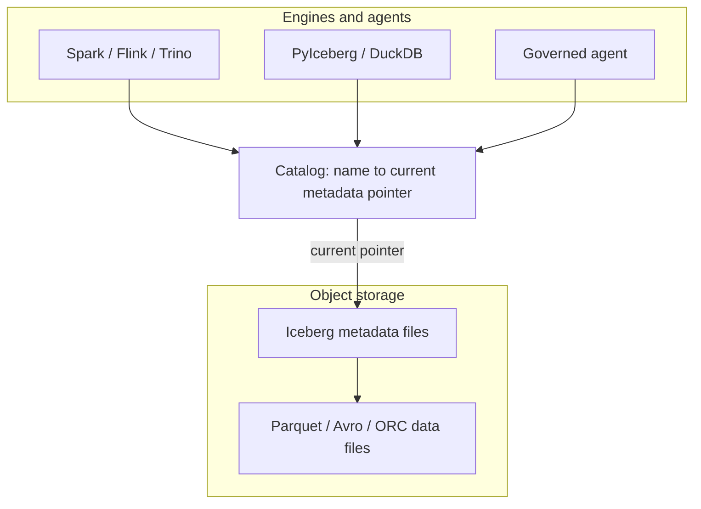
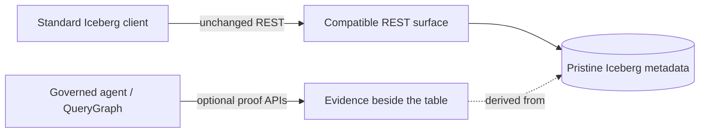
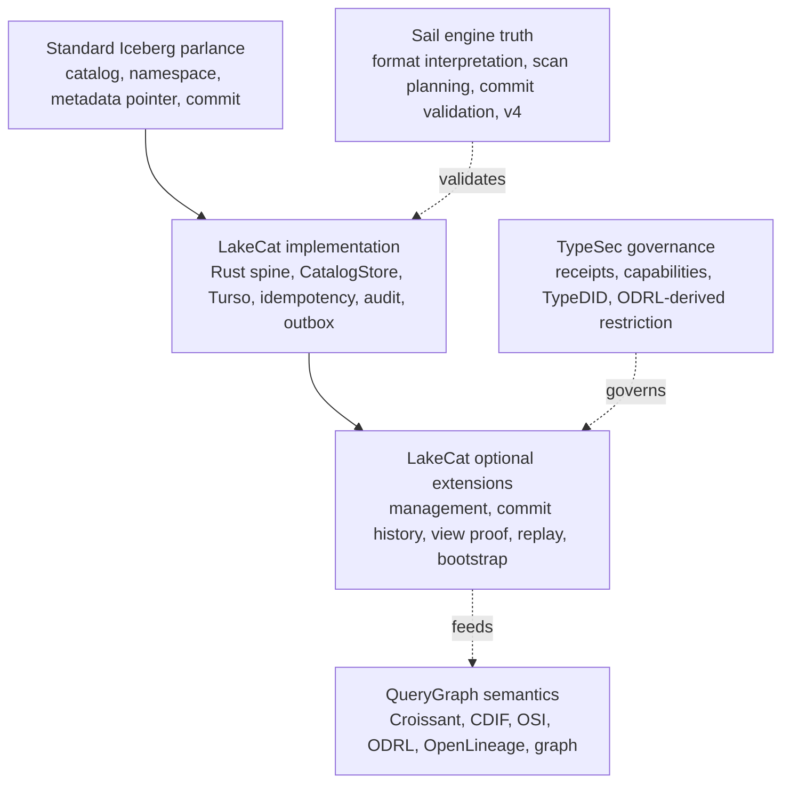
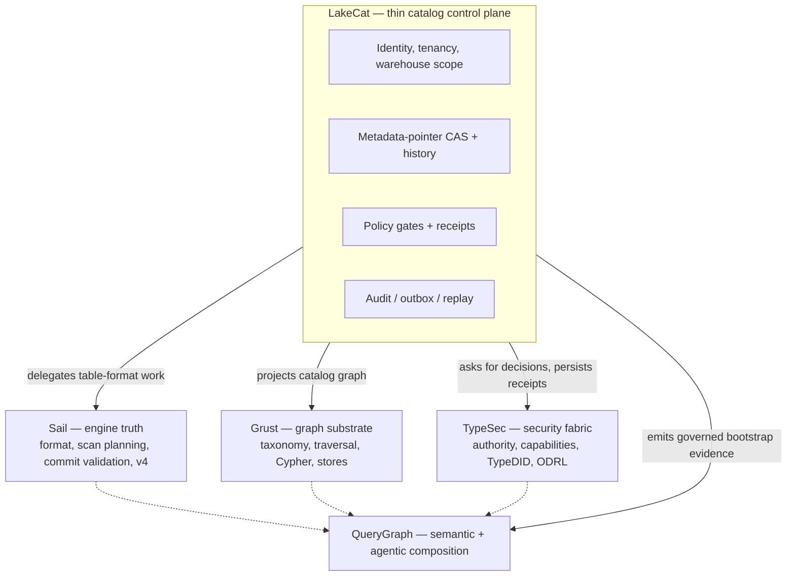
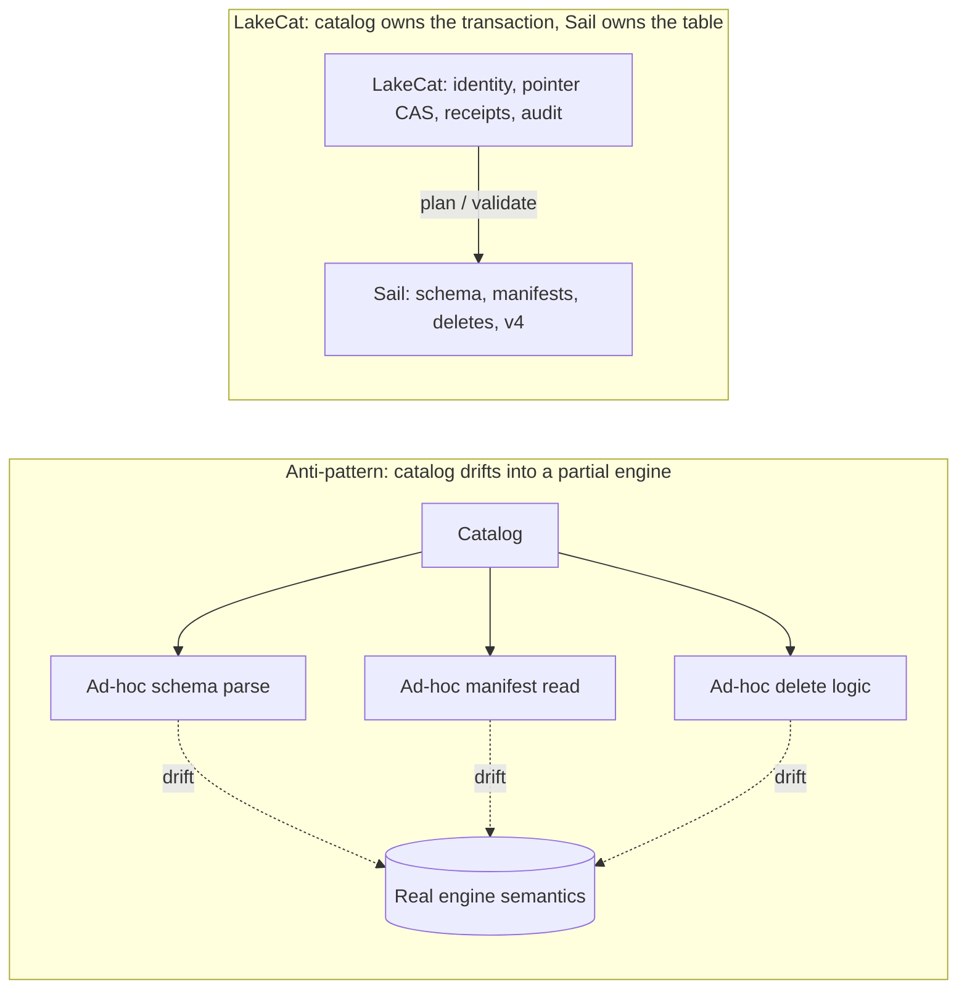

# LakeCat

## Preface

LakeCat is a Rust-native, Iceberg-compatible catalog foundation for QueryGraph.
It begins from one conservative claim and one ambitious one. The conservative
claim: an ordinary Iceberg REST catalog must keep working for ordinary engines —
Spark, Flink, Trino, DuckDB, PyIceberg, Sail — with no new protocol to learn.
The ambitious claim: the *next* catalog also has to be a governed control plane
for Rust-first planning, semantic graph handoff, lineage, and agent access.

LakeCat holds both at once by drawing a sharp line. It keeps Iceberg
compatibility at the boundary and moves the work that needs deep table-format
knowledge to the engine that can reason about it. In this repository the catalog
is **LakeCat** and the engine-side lakehouse implementation is **Sail**. Graph
behavior belongs to **Grust**; governance and capability proof belong to
**TypeSec**; the end-to-end integration target is **QueryGraph**.

This book builds from first principles. Chapter 2 explains what a catalog is,
what Iceberg makes the catalog responsible for, and what LakeCat adds without
changing the table format. Chapter 3 fixes the vocabulary — the single hardest
thing in a layered system — so every later term has an owner. Chapter 4 draws
the boundary model: which repository owns which concept, and which ideas might
someday become neutral, standardizable profiles. The middle chapters walk the
live architecture: the service spine, the read path, the commit path, and the
durable store. The final chapters cover the engine boundary and the v3→v4 path,
the graph/security/lineage handoffs, the QueryGraph/QGLake acceptance flow,
worked examples, and the first-release scope.

Each concept is defined once and then used. Where a later chapter needs a term,
it links back rather than restating it.

## Catalogs, Iceberg, and What LakeCat Adds

### What a catalog is

A data catalog is often described as a place that lists datasets. That is true
but too small. A real catalog is the control plane between names, storage,
metadata, identity, and intent. At minimum it answers four questions:

1. What table does this name mean?
2. Where is its current metadata?
3. Who may read, write, plan, or administer it?
4. What changed, when, and under whose authority?

In a traditional database the catalog is embedded in the engine: one system owns
table definitions, statistics, permissions, and the transaction log. A lakehouse
pulls that apart. Data files live in object storage, metadata files live beside
them, and several engines read and write the same tables. The catalog becomes
the agreement point — it maps a logical table name to the current metadata
pointer and arbitrates updates to that pointer.



That pointer is deceptively important. If the catalog points at metadata version
17, the table *is* version 17. If a writer prepares version 18 and wins the
compare-and-swap, the table becomes 18; if it loses, nothing partially changes.
The catalog is not the table format, but it is where table history becomes
visible and durable. For human analytics this sounds like bookkeeping. For
agentic systems it is a trust boundary: a catalog can know the principal,
warehouse, namespace, table, snapshot, requested columns, row restriction,
storage profile, and policy receipt — and if it captures that before planning
and commits it after state changes, it becomes a governed control plane rather
than a passive address book.

### What Iceberg makes the catalog responsible for

Apache Iceberg is a table format for large analytic tables. Its core idea is to
put the table's truth in explicit metadata files so engines can plan reads and
validate writes without directory listing or fragile storage conventions. A
current metadata file names schemas, partition specs, sort orders, snapshots,
and properties; snapshots point to manifest lists; manifest lists point to
manifests; manifests describe data and delete files.

The catalog's role in Iceberg is intentionally narrow. Standard clients must be
able to load table metadata, create namespaces and tables, commit changes, and
sometimes receive credentials or scan tasks — over a documented REST shape:

```text
GET  /v1/config
GET  /v1/{prefix}/namespaces
POST /v1/{prefix}/namespaces/{ns}/tables
GET  /v1/{prefix}/namespaces/{ns}/tables/{table}
POST /v1/{prefix}/namespaces/{ns}/tables/{table}   # commit: requirements + updates
```

The rule that governs everything else in this book: **a normal client must never
have to call a non-standard endpoint to read an ordinary table.** If it does,
compatibility is already broken.

### What LakeCat adds without changing Iceberg

LakeCat's promise is *compatibility first, evidence second, semantics above the
catalog.* A Spark or PyIceberg client sees an Iceberg REST catalog. A QueryGraph
or governed-agent client may ask for richer proof. Both share the same table
because the portable truth stays in Iceberg metadata and the extra evidence
sits beside it — never inside the table format.



Iceberg metadata stays pristine. Policy, graph, lineage, and agent state are
*derived* control-plane or graph data. The table remains an Iceberg table.

## The Vocabulary

A layered system fails the moment its words blur. The most common mistake is to
call every useful LakeCat feature an "Iceberg extension," which makes the
standard boundary too large. The test is simple: **ask what breaks if a client
knows nothing about LakeCat.** If a PySpark job cannot load, commit, or drop a
table without the concept, it belongs to standard compatibility. If PySpark
keeps working but operators, governed agents, or QueryGraph gain stronger
evidence, the concept is an additive surface.

Every term in this book falls into one of six categories.



**Standard Iceberg parlance** — the words Iceberg already owns: catalog,
namespace, table identifier, current metadata location, snapshot, manifest list,
manifest, data file, delete file, schema and partition evolution, optimistic
commit, REST compatibility. LakeCat must implement these faithfully. Changing
their meaning means losing compatibility.

**LakeCat implementation** — how this Rust catalog satisfies the contract
reliably: the service spine, the `CatalogStore` trait, the Turso-backed durable
store, normalized idempotency rows, pointer logs, audit rows, outbox rows,
redaction rules, and replay validators. These make ordinary Iceberg behavior
atomic, inspectable, and replayable. They are not extensions; they are good
engineering behind a standard surface.

**LakeCat optional extensions** — additive APIs beside the standard path:
management inventory, commit-history inspection, view proof, credential-root
posture, replay verification, OpenLineage projection, and QueryGraph/QGLake
bootstrap bundles. They help operators, agents, and QueryGraph without becoming
hidden requirements for ordinary table access.

**TypeSec governance** — authority and receipt semantics: who may act, capability
proof, TypeDID envelopes, ODRL-derived restrictions, and agent posture. TypeSec
*decides*; LakeCat *carries and records* the decision.

**QueryGraph semantics** — composition above the catalog: Croissant, CDIF, OSI,
ODRL, OpenLineage, and Grust graph projections built from the governed source of
truth.

**Sail engine truth** — table-format interpretation, metadata-as-data, scan
planning, commit validation, and typed v4 behavior. The catalog binds its proof
to engine truth rather than reimplementing the format.

The single reference below replaces the per-claim restatements that earlier
drafts repeated; read each LakeCat claim through its category.

| Claim | Standard reading | Category | Portable idea (if any) |
| --- | --- | --- | --- |
| Rust service / catalog spine | Iceberg needs a catalog authority, not a language | LakeCat implementation | "A catalog can prove what it committed, planned, vended, and emitted" |
| Turso-backed durable store | Iceberg needs durable state + atomic pointer movement, not a named DB | LakeCat implementation | CAS, exact-retry, row/content binding, pointer-history proof |
| REST namespace/table routes + commit CAS | Standard compatibility | Standard Iceberg | — (must stay ordinary) |
| Idempotency, pointer logs, audit/outbox, replay validation | Mostly outside the table contract | LakeCat implementation / extension | Stable catalog-event identity; scoped replay admission |
| Governed scan with policy receipt | Iceberg gives scan inputs, not receipts | TypeSec governance | Engine-proved effective projection + predicate |
| Credential vending posture | Catalog-adjacent, not ordinary table semantics | TypeSec governance | Bounded, redacted, engine-neutral credential profile |
| QueryGraph / QGLake / OpenLineage handoff | Not required for table access | QueryGraph semantics | Redacted, replayable lineage/view/commit evidence |
| Typed Iceberg v4 behavior | Belongs to the format as it evolves | Sail engine truth | Engine-owned v4 interpretation, not catalog JSON parsing |

## The Boundary Model

The vocabulary tells you which category a word lives in. The boundary model says
which *repository* owns the work and why. LakeCat is deliberately thin: it keeps
identity, tenancy, metadata-pointer state, policy gates, idempotent commits, and
integration events — and delegates everything reusable.



The ownership rule, stated once:

| Concern | Owner | LakeCat keeps only |
| --- | --- | --- |
| Iceberg format, manifests, scan planning, pruning, delete handling, v4 | Sail | The call into Sail and the proof binding its result |
| Graph schema, taxonomy, traversal, stores, Cypher | Grust | The catalog-facing sink/projection boundary |
| Authorization, policy composition, capabilities, TypeDID, credential decisions | TypeSec | The request for a decision and the persisted receipt |
| Croissant/CDIF/OSI/ODRL/OpenLineage composition, agent workflows | QueryGraph | The governed bootstrap bundle it emits |
| Identity, tenancy, pointer CAS, idempotency, audit, outbox, replay | LakeCat | All of it — this is the thin catalog |

This is also the answer to the recurring "is it an extension or a standard?"
question. LakeCat is opinionated in code and modest in standardization. "Use
Rust," "use Turso," "use TypeSec," "import QGLake," "project into Grust" are
project choices, not proposals. The portable ideas are narrower and stated
without product names: *reject idempotency drift; record redacted pointer
history; emit transactional catalog-event identity; admit only scoped replay
evidence; prove a governed scan was narrowed by an engine.* A proposal that
forced every Iceberg catalog to understand QueryGraph, TypeSec, Grust, or Turso
would narrow the ecosystem; a proposal that says "a catalog may publish redacted,
replayable commit evidence" leaves room for many implementations. Prove the
stronger shape locally, then extract only the database-neutral, policy-neutral,
engine-neutral part.


## Where LakeCat Stands Today

LakeCat is not only a design. The implementation already has a Rust
service/catalog spine, a Turso-backed durable store, Iceberg REST-compatible
namespace and table paths, hardened commit and replay evidence, governed scan
and credential proof, and QueryGraph/QGLake handoff surfaces. Read each of those
through its category (Chapter 3) rather than flattening them into "Iceberg
extensions": some are ordinary catalog implementation, some are optional LakeCat
APIs, some are TypeSec governance proof, and only a few are plausible future
standardization candidates.

The most important word is **beside**. New capability sits beside the Iceberg
REST path, never in front of it. A standard client never has to present a
TypeDID, parse a QueryGraph bundle, read a Grust edge, or inspect an OpenLineage
receipt to load a normal table. So the same catalog shows a different face to
each caller:

| Caller | What they see |
| --- | --- |
| PySpark / PyIceberg user | Ordinary Iceberg REST. Configure a catalog, create a namespace, write and load tables. Pointer-log, audit, and outbox rows exist but are invisible to table semantics. |
| Platform operator | A hardened catalog transaction log: idempotency outcomes, pointer movement, redacted conflict proof, storage-profile and credential posture, pending outbox, replay-validation failures. |
| Governed agent | A narrowed access path: TypeSec decides the capability, LakeCat binds the receipt to the catalog action, Sail plans the effective scan, the agent gets bounded work instead of broad credentials. |
| QueryGraph importer | A proof-bearing bootstrap: table, view, management, credential, scan, commit-history, OpenLineage, and graph-import anchors that must line up before the semantic layer is accepted. |

That separation also keeps standardization honest. The interesting portable
shapes are never "LakeCat uses Turso" or "QueryGraph imports a bundle"; they are
smaller behaviors — idempotent commit replay, catalog pointer history, governed
credential vending, proof-carrying scan planning, redacted conflict evidence,
lineage receipt binding. The posture, in five rules:

1. Keep base Iceberg REST behavior strict and boring.
2. Keep LakeCat proof surfaces optional for the clients that need them.
3. Keep TypeSec and QueryGraph semantics out of Iceberg metadata.
4. Use Sail for reusable table-format and planning semantics.
5. Promote only small, interoperable proof profiles once real workflows prove
   multiple engines and catalogs need them.

## Why the Catalog Stays Thin

The most dangerous failure mode for a "smart" catalog is becoming a partial
engine. It starts innocently — validate a schema here, expand a manifest list
there, peek at a `format-version` field, check a delete file. Each small parser
looks cheaper than an engine call. Over time the catalog grows a second Iceberg
implementation with weaker tests, fewer real execution users, and quiet drift
from how the planner actually behaves.



LakeCat takes the opposite path: **the catalog owns the transaction; Sail owns
the table semantics.** Sail is the right home because it is Rust-native and
already holds the structures this needs — generated Iceberg REST models, table
providers, manifest pruning, metadata-as-data paths, commit plumbing, and
format-version handling. Anything that needs field-id binding, schema/partition
evolution, manifest metrics, delete association, row lineage, v4 metadata trees,
or snapshot/branch selection moves toward Sail.

This matters because intermediation, left passive, *loses* information. A
pass-through catalog sees only the table name, the pointer, the caller, and
maybe a credential request; the engine sees schema, manifests, statistics,
deletes, and filters; governance sees policy; lineage sees an after-the-fact
event. Each system gets a shard of the truth, and the operational cost is
concrete:

- policy can be checked before access but not carried *into* scan planning;
- credentials can be vended without proving why a raw-credential exception was
  allowed;
- lineage can say something happened but cannot bind to the exact governed plan,
  snapshot, policy, and metadata.

The next generation of callers — agents, notebooks, services, model pipelines —
needs stronger guarantees that live precisely between catalog state and engine
planning: a policy enforced before a scan is planned; column restrictions that
narrow the projection before file tasks exist; policy-derived row predicates
that become mandatory filters; a stateless `fetchScanTasks` that cannot widen a
prior governed plan; short-lived, scoped, audited credentials; idempotent commit
retries; and graph/lineage side effects that reflect committed state rather than
best-effort handler work. A catalog too far from the engine can only check a
policy and hand back a pointer, hoping the client preserves the restriction.
LakeCat keeps the catalog boundary thin and binds its proof to Sail's plan so
the restriction is real.


## LakeCat's Thin Boundary

LakeCat should be thin, but thin does not mean trivial. It owns the durable
catalog state that must be correct even when external sinks are unavailable.

The core LakeCat responsibilities are:

- Serve the Iceberg REST Catalog API for standard clients.
- Model projects, warehouses, namespaces, tables, views, and storage profiles.
- Persist metadata pointers and compare-and-swap commit history.
- Validate idempotency keys and replay only matching commit bodies.
- Resolve request identity from headers, bearer tokens, agents, and TypeDID
  envelopes.
- Ask TypeSec for authorization decisions and persist receipts.
- Route scan planning and commit preparation through Sail.
- Record audit and outbox events inside the catalog transaction.
- Drain committed events to Grust and OpenLineage sinks.
- Publish a QueryGraph bootstrap bundle.

The deliberately excluded responsibilities are just as important:

- LakeCat does not invent a table format.
- LakeCat does not fork Iceberg manifest pruning.
- LakeCat does not own graph traversal or graph query behavior.
- LakeCat does not own security semantics or agent trust semantics.
- LakeCat does not author QueryGraph's final business semantic model.

That boundary gives each sibling project a clear job. Sail owns reusable
Iceberg and planning behavior. Grust owns graph schema, storage, and query
mechanics. TypeSec owns policy, capabilities, TypeDID envelopes, secure agents,
and authorization semantics. QueryGraph owns the semantic application built on
top.

## The Read Path

The LakeCat read path begins like a standard catalog request and ends with a
governed Sail plan.

1. A client asks to load or plan a table through the Iceberg REST surface.
2. LakeCat resolves the warehouse, namespace, table, and current metadata
   pointer.
3. LakeCat resolves the request identity.
4. LakeCat asks TypeSec whether the principal can perform the requested action.
5. TypeSec returns a decision and any enforced restrictions.
6. LakeCat turns those restrictions into a `ReadRestriction`: allowed columns,
   required row predicate, purpose, policy hash, and audit context.
7. LakeCat asks Sail to plan against the current metadata pointer with the
   effective projection and filters.
8. Sail validates Iceberg expressions against generated REST models and table
   schema, expands manifests, applies conservative file-bound pruning when
   metrics are present, and carries delete-file references into file scan tasks.
9. LakeCat returns Iceberg-compatible plan and task responses.
10. LakeCat records audit and outbox events that can later be projected into
    graph and lineage.

The important detail is that the policy restriction becomes part of planning,
not a note beside it. An empty client projection under a column restriction
means the allowed columns. A client projection can narrow further, but cannot
widen. LakeCat records both the client's requested projection and the effective
projection that survived the server-derived column restriction in the durable
scan-planned replay evidence. The same rule applies to stats-field requests:
LakeCat records both the client's requested stats fields and the effective
stats fields that survived the restriction, while the compatibility
`stats-fields` extension remains the narrowed effective set. The default REST
path is tested at the Sail boundary: Sail receives only the effective
projection and mandatory policy filters, while LakeCat keeps the broader
request and narrowed result as replay evidence. During `fetchScanTasks`,
LakeCat recomputes the current restriction and sends Sail the required
projection and mandatory filters again;
the response extension and audit outbox record the same proof. A stale or
legacy token cannot silently expand back to all columns. Outbox admission also
checks that governed planned/fetched scan replay carries the same
`read-restriction` in the top-level payload and in
`authorization-receipt.context.read-restriction`, so replay cannot claim policy
narrowing that the durable receipt did not capture. The same admission boundary
requires governed scan replay to keep a nonblank `purpose` and a positive
`max-credential-ttl-seconds` value before graph or OpenLineage projection, so a
QGLake handoff cannot learn task evidence whose purpose or credential TTL cap
was lost before replay. Optional `plan-task` values in planned and fetched scan
replay are treated as evidence too: they must be non-empty LakeCat-issued tokens
and cannot carry decorated location material, query or fragment material, or
credential strings before the event can be acknowledged. The service now also
rejects unexpected fields inside top-level and receipt `read-restriction`
objects, and inside nested `row-predicate` objects, before outbox
acknowledgement. That keeps graph, OpenLineage, and QGLake evidence from
inheriting extra unverified claims beside the known governed restriction fields.
The scan replay payloads themselves are closed over the fields LakeCat producers
emit for `table.scan-planned` and `table.scan-tasks-fetched`, so an archived
governed read cannot attach unverified scan, lineage, graph, QueryGraph, or
application claims beside the checked restriction, projection, stats, filter,
plan-token, task-count, and authorization evidence.

## The Commit Path

The write path follows the same principle: LakeCat owns the catalog transaction,
Sail owns reusable Iceberg validation and metadata preparation.

1. A client sends an Iceberg commit request, optionally with an idempotency key.
2. LakeCat validates the request shape and the idempotency key.
3. LakeCat resolves identity and asks TypeSec for the commit capability.
4. If the idempotency key already has an exact stored response, LakeCat returns
   that response before Sail validation or metadata-object writes.
5. LakeCat loads the current metadata pointer from the store.
6. LakeCat delegates Iceberg update validation and metadata assembly to Sail.
7. LakeCat rejects metadata-object writes that target the table's current
   metadata pointer, so the current metadata file cannot be overwritten before
   the store commit has won.
8. LakeCat rejects metadata-write plans that do not carry a concrete new
   metadata location.
9. LakeCat rejects metadata-object locations outside the table's matched
   storage profile prefix, and also rejects the storage-profile root itself
   because metadata commits must create a child object.
10. LakeCat rejects literal or percent-encoded dot path segments in metadata
    object locations, so commit plans cannot rely on traversal-like spelling to
    address anything other than a plain child object.
11. LakeCat writes the new metadata object through the warehouse storage
    profile with create-only object-store semantics.
12. LakeCat advances the table pointer with compare-and-swap.
13. LakeCat persists idempotency, audit, pointer-log, and outbox records.
14. If the store rejects the commit after a local metadata write, LakeCat cleans
   up the uncommitted metadata object when it can do so safely.
15. Outbox draining projects the committed event to graph and lineage sinks.

The Turso-backed store binds decoded table JSON back to the selected table
identity on this path. A row selected for `local.default.events` cannot return
or replay `record_json` or idempotency `response_json` that claims another
table. LakeCat rejects that drift before loading a table, listing standard
catalog tables, replaying an idempotent commit response, committing over the
row, soft-deleting it, or restoring it. That is not an Iceberg extension; it is
durable-store hygiene around standard Iceberg table access.
The idempotency row is part of that hygiene, and the embedded memory store
follows the same invariant: the stored request hash must still be full SHA-256
evidence and the stored response must still bind to the requested table before
an exact retry can observe the stored response.

The cleanup path is deliberately secondary to the commit result. LakeCat makes
a small bounded retry of the idempotent delete for an uncommitted create-only
metadata object, then preserves the original store or compare-and-swap error if
cleanup still fails. If metadata cleanup fails after the store rejects a commit, LakeCat preserves the original
store or compare-and-swap error class and appends cleanup context. A stale
pointer conflict still looks like a conflict to an Iceberg client, but the
message carries SHA-256 hashes of the expected and actual metadata locations so
operators can diagnose the race without exposing raw object paths. The
service-level regression for this path checks the API response and the
filesystem side effect together: the rejected metadata object is gone, while
the conflict body contains only hashed pointer evidence. True cleanup
failures use the same redaction discipline: the cleanup context identifies the
uncommitted metadata object by `metadata-location-hash=sha256:...`, not by the
raw object path. When that cleanup failure is appended to the preserved commit
conflict, LakeCat keeps only `error-detail-hash=sha256:...` evidence for the
cleanup detail, so raw backend text cannot leak through the combined conflict
message. If cleanup discovers the uncommitted object is already absent, LakeCat
treats that as successful cleanup rather than turning a resolved orphan into an
internal error. Cleanup also refuses to delete the previous committed metadata
pointer if a future plan accidentally reports it as the staged write; the
committed metadata object remains the table's current state, not an orphan.
The combined-error path now covers cleanup setup failures as well as delete
failures: if LakeCat cannot open the staged metadata object's object-store
location while cleaning up a rejected commit, the original commit conflict
remains the visible error class and the cleanup detail is represented only by
hash evidence.
The same audit-safe shape applies before the write:
current-pointer overwrite, existing-object overwrite, unsupported object-store
configuration, and storage-profile-prefix failures report metadata-location
hashes, and prefix mismatches also report a storage-profile-prefix hash rather
than raw object paths. LakeCat also keeps the storage-profile id out of this
error text, so tenant or profile naming conventions do not leak when a planned
metadata object falls outside the selected root. A root-targeted metadata write
uses the same redacted error shape: the operator sees that the plan did not
name a child metadata object without receiving the raw table or storage root.
Dot-segment failures use the same style: literal `..` and percent-encoded
`%2e%2e` paths fail before object-store writes and expose only the
metadata-location hash. Decorated metadata object locations with URI query
strings, fragments, URI userinfo, or raw and percent-encoded credential-marker
path material are rejected at the same pre-write boundary, so a commit plan
cannot smuggle version selectors, backend hints, fragment markers, or embedded
credential material into what should be a plain metadata object address.

Idempotency is part of correctness. Reusing the same key for the same commit can
return the stored response even after the table has advanced beyond the
original commit requirements. Reusing the same key for a different body must
conflict. LakeCat persists a normalized request hash and stores only audit-safe
evidence, not raw secrets or raw idempotency keys. REST idempotency keys are
intentionally narrow: `Idempotency-Key` and `x-lakecat-idempotency-key` must be
1 to 128 ASCII characters and may use only letters, digits, `-`, `_`, `.`, or
`:`. If both headers are present they must match exactly. Invalid, duplicate,
or conflicting keys, including non-ASCII or invalid header bytes, fail before
LakeCat performs authorization, Sail validation, table loading, or
metadata-object writes.
When a reused key is attached to a different commit body, the conflict response
also stays redacted: it does not echo the raw key or the mismatched metadata
object location. The Turso spine pins the same redaction for both commit-time
reused-key conflicts and explicit idempotency replay probes: the raw key,
mismatched request hash, and mismatched metadata object location are not
operator-facing error text.
The service regression for this path proves the replay happens before
metadata-object writes: an exact retry returns the stored response without
touching the already committed metadata object. The same regression pins the
outbox side effect: exact replay and mismatched reused-key conflicts leave only
the original `table.commit` outbox event, so QueryGraph and OpenLineage replay
do not see duplicate commit work from retry traffic.
Another regression sends a commit whose requested metadata location is the
table's current pointer and verifies that LakeCat returns a bad request without
touching the existing metadata file.
Another sends a commit to a different metadata location that already exists and
verifies that LakeCat returns a conflict without overwriting that non-current
object.
The same guard fails closed if a future Sail plan asks LakeCat to write metadata
but does not provide a new object location, or if it tries to use the storage
profile root as the new metadata object. A companion regression rejects both
literal and percent-encoded dot path segments in a planned metadata location.
When a backend object store fails setup, create-only write, or cleanup, LakeCat
keeps the metadata location hash and adds hash evidence instead of returning
raw backend text. Invalid metadata URI parsing and unsupported backend setup
failures use `backend-error-hash=sha256:...`, making the setup-admission
boundary explicit. Create-only write and cleanup failures keep
`error-detail-hash=sha256:...` because those happen after setup. In every case,
the response names the hashed metadata location and hashed failure detail, not
the submitted path, object name, scheme, or parser/backend diagnostic. That
route-level promise is pinned by a commit regression for decorated metadata
locations with raw query-token material. It matters for local files, cloud
bucket keys, and credential-provider diagnostics:
operators can correlate a failure without copying sensitive storage topology
into API responses or logs.

The embedded in-memory store follows the same commit evidence contract as the
Turso path. A successful commit emits one `table.commit` audit/outbox event
with the compact commit record, authorization receipt, response hash, and
redacted idempotency-key hash. An idempotent replay returns the stored response
without adding a second outbox event, so tests and local embedded deployments
exercise the same outbox invariant as the durable spine.

Commit records also carry a response hash over the stored table response. That
pair matters: the request hash proves which commit body won or replayed, while
the response hash proves which metadata pointer and table body LakeCat returned
to clients and later projected through graph and lineage replay.

The same commit record includes compact summary evidence: Iceberg format
version, current snapshot id, and the policy hash from the authorization
receipt when one exists. Memory and Turso commit producers now require positive
Iceberg `format-version` evidence before table or commit metadata can produce a
durable commit record. If the table metadata has no current snapshot, the
producer emits explicit `snapshot_id: 0` evidence instead of omitting the
field, preserving no-snapshot Iceberg states without creating an undrainable
`table.commit` event. QueryGraph can inspect those fields from the
pointer-log/outbox stream without parsing full table metadata for every
catalog audit question. Before a `table.commit` outbox event is projected or
acknowledged, LakeCat now checks that it carries a commit object, an unsigned
sequence number, a decodable root table identity, matching nested commit-table
identity when present, both the commit principal and authorization receipt
principal with matching values, positive format-version evidence, non-negative
snapshot-id evidence, and full `sha256:`-prefixed 64-hex request, response,
idempotency-key, and present policy hashes. A prefix-shaped placeholder,
contradictory commit identity, missing receipt principal, missing
table-format evidence, or drifted principal cannot become delivered commit
replay evidence. LakeCat also closes the nested `commit` object over those
verified fields before projection, so an outbox event cannot attach an
unverified pointer-transition, policy, storage, or graph claim beside an
otherwise valid table commit.
Older saved sidecars may spell the same commit evidence with snake_case or
kebab-case field names. LakeCat accepts either spelling for the verified
`table.commit` envelope, but it rejects an event that carries both aliases for
one semantic field before acknowledgement, graph projection, or OpenLineage
projection. That keeps a replay sidecar from hiding a conflicting pointer,
hash, timestamp, format, or snapshot claim beside the field LakeCat verifies.
Replay admission also applies the same credential-shape guard as the
metadata-object write path: metadata-location proof fields must not carry query
strings, fragments, obvious credential markers, or URI userinfo. A forged or
stale outbox row therefore cannot smuggle `access:secret@` style authority
material into Grust projection, OpenLineage replay, or QGLake/QueryGraph commit
proof after the original request validator has already learned to reject it.

Operators and QueryGraph can read that pointer-log evidence through a governed
management endpoint:

```sh
curl -s \
  -H 'x-lakecat-principal: operator@example.com' \
  http://127.0.0.1:3000/management/v1/warehouses/local/namespaces/default/tables/events/commits
```

The response contains compact commit records: sequence number, previous and new
metadata locations, request hash, response hash, idempotency-key hash, Iceberg
format version, current snapshot id, policy hash, principal, and a commit hash.
The read itself enters the durable outbox as `table.commits-listed` and drains
as lineage evidence plus catalog-facing `Commit` graph anchors keyed by table
and sequence number. That gives audit tools and QueryGraph a Grust-visible
pointer-log inspection trail without requiring direct access to the Turso
catalog database or making LakeCat a graph query engine. The outbox payload
also carries `principal-subject` and `principal-kind`, and service replay
admission requires those fields to match the authorization receipt principal
before graph or OpenLineage projection. QGLake acceptance now
exercises this path directly: the fixture issues an idempotent no-op commit
probe, reads the compact commit-history endpoint, verifies that the record
preserves the table's Iceberg format-version and current snapshot summary,
requires the compact request, response, idempotency-key, commit, and optional
policy hashes to be full `sha256:`-prefixed 64-hex digests, and then requires
the lineage drain to replay `table.commits-listed` receipt hashes
plus compact commit count, sequence-number, and commit-hash summary fields
before the QueryGraph handoff is accepted.

## The Durable Spine

LakeCat's durable local spine uses the Rust `turso` crate behind the
`turso-local` feature. The store contract remains portable, but the local
foundation is not SQLx. The important tables are not an application afterthought;
they define the catalog's control-plane memory:

- projects and warehouses;
- storage profiles;
- namespaces and tables;
- metadata pointer log;
- idempotency records;
- soft deletes;
- policy bindings;
- audit events;
- outbox events.

Object storage remains the source of Iceberg metadata files. Turso stores the
atomic pointer, management state, idempotency evidence, and event record. This
mirrors the Iceberg catalog contract: metadata files describe the table;
catalog state decides which metadata file is current.
Warehouse reads bind decoded records to the Turso row's warehouse, project id,
and storage-root columns before returning tenant-root inventory. That keeps
management and QueryGraph bootstrap proof from inheriting a row index that
points a valid JSON warehouse at a different project or storage root.
Child management writes use the same evidence rule. A project upsert that
names a parent server validates the decoded server record before accepting the
project, and a warehouse upsert validates the decoded parent project before
accepting the warehouse. A tenant tree is therefore not allowed to grow from a
corrupted parent row merely because the row key still exists.
Namespace reads use the same decoded-row binding. A namespace list, load, or
drop operation must reconcile the decoded namespace with the selected warehouse
and durable `namespaces.namespace_path` row column before standard namespace
state can be returned or removed. That prevents a corrupted local catalog row
from moving a standard Iceberg namespace into another path before management,
outbox replay, or QueryGraph bootstrap consumes it.
For governed policy evidence, Turso policy-binding reads bind the decoded JSON
back to the row's warehouse, policy id, namespace path, table name, and enforced
flag before a binding can be returned or matched to a table. That keeps a
corrupted row index from silently changing which TypeSec-style policy anchors
apply to a governed read.
Storage-profile reads follow the same rule for credential-root evidence: the
decoded profile must match the memory map key or Turso row's warehouse,
profile id, location prefix, provider, and issuance mode before LakeCat can
return it or match it to a table. That prevents durable row-column drift from
changing the storage scope used by credential vending or QGLake management
proof.

Outbox draining is intentionally strict. LakeCat projects a batch to graph and
lineage sinks first, then acknowledges the whole projected batch in the store.
Embedded and Turso stores select the same pending prefix by sorting on
`created_at,event_id` before applying the drain limit, so a small batch means
the same replay set in either durable backend. The drain response and delivery
acknowledgement follow that ordered prefix, leaving later pending events for a
future drain. If projection fails, nothing is
acknowledged. If the store reports that fewer events were acknowledged than
LakeCat projected, the drain fails with an acknowledgement mismatch instead of
returning a quiet partial success. That keeps retry and operator evidence
honest when a concurrent drain or backend anomaly interferes with delivery
accounting. The regression suite covers the uncomfortable middle case too: if
the first event in a multi-event batch already projected to graph and lineage
but a later event fails during lineage projection, LakeCat still acknowledges
none of the events. Recovery starts from the committed outbox batch instead of
from a half-delivered response.
The same suite now pins Turso's durable row guard for event-id drift: a pending
row whose stored `event_id` no longer matches the payload hash fails with
hash-only event-id, event-type, and payload evidence before graph or lineage
projection can see it. Turso corrupt-payload drift follows the same rule: the
operator-facing error is allowed to carry event-id, event-type, payload-event
type, and payload hashes, but not the raw event id, event type, payload field
names, or payload values. Embedded and Turso validation also reject pending
rows whose payload omits `event-type` entirely; a durable row cannot keep a
plausible payload hash while dropping the replay type that graph and lineage
projection use to choose the admission path.
The drain also refuses unknown event types before any projection happens. A
future or custom event stays pending until LakeCat knows how to project it,
instead of disappearing behind an empty graph/lineage receipt.
The drain also validates governed-read evidence before projection. If a pending
event contains a `read-restriction.policy-hashes` array, it must be non-empty
and each entry must already be a full `sha256:`-prefixed 64-hex digest. A
readable placeholder such as `sha256:policy-name`, or an empty policy anchor
array, fails the drain before graph or lineage sinks run and before the store
can mark the event delivered, keeping malformed source evidence available for
retry or operator repair instead of promoting it into a QGLake handoff. LakeCat
now applies that same admission rule to
`authorization-receipt.context.read-restriction.policy-hashes`, so the receipt
kept for later proof cannot preserve an empty or placeholder policy anchor
while the top-level scan event looks valid. LakeCat also rejects both planned
and fetched scan replay when the top-level `read-restriction` differs from
`authorization-receipt.context.read-restriction`, so graph and OpenLineage
evidence cannot drift from the TypeSec receipt that authorized the narrowed
read. Planned and fetched scan replay must also carry nonblank purpose evidence
and a positive policy-derived credential TTL cap before the outbox event can be
acknowledged or projected. Table
commit events receive the same treatment for compact
commit receipt evidence: `request_hash` and `response_hash` must be full
digests, `idempotency_key_sha256` must be a full digest when a retry key was
present, and any present `policy_hash` must be a full digest before the event
can be projected or acknowledged. Ordinary Iceberg clients can still commit
without LakeCat's idempotency header; they just do not produce idempotent
replay proof for that commit.

## Grust For Graph Concepts

Catalog events naturally form a graph. A server contains projects. A project
contains warehouses. A warehouse contains namespaces and storage profiles that
define credential roots. A namespace contains tables. A table has columns,
snapshots, manifests, files, policies, commits, scan plans, principals, and
lineage runs. QueryGraph needs that graph, but LakeCat should not become a
graph database.

Grust owns the graph layer. It is the place for reusable graph taxonomy,
projection builders, graph stores, traversal indexes, Cypher support, and typed
or untyped graph operations. LakeCat's responsibility is narrower: translate
committed catalog events into a bounded envelope and pass it through a
catalog-facing sink.

In practice this means LakeCat can emit graph events for stable catalog facts:

```text
Server CONTAINS Project
Project CONTAINS Warehouse
Warehouse CONTAINS Namespace
Namespace CONTAINS Table
Table HAS_COLUMN Column
Table GOVERNED_BY Policy
Warehouse HAS_STORAGE_PROFILE StorageProfile
Principal CAN_PLAN ScanPlan
Commit DERIVED_FROM Snapshot
LineageRun USED_BY QueryGraphModel
```

High-cardinality file and manifest facts should stay queryable through
Iceberg/Sail metadata-as-data unless Grust provides a reusable taxonomy and
storage strategy for them. The graph should be powerful, but the catalog must
not smuggle a second lakehouse engine into its event sink.

The current local direction already proves the boundary: LakeCat's
`grust-local` sink calls Grust-owned LakeCat projection helpers, and the Grust
Cypher boundary test verifies catalog graph projection without making LakeCat
own Cypher parsing, traversal, or graph execution. The current boundary test
writes table-adjacent `Column`, `Snapshot`, and `Commit` events plus
`Principal`, `ScanPlan`, tenant-root `Server`, and credential-root
`StorageProfile` catalog events through Grust, then matches catalog-event
labels through Grust Cypher. Storage profile replay uses redacted evidence such
as `secret-ref-present` and the secret-reference provider, never the full
secret-store URI. Credential-vend attempts replay through that same thin
boundary as `StorageProfile` graph events keyed by the redacted credential-root
anchor, so QueryGraph can see a principal attempted credential-root access
without seeing a secret reference or raw credential material. That proves
QueryGraph can discover the semantic anchors LakeCat emits while the richer
node/edge materialization remains reusable Grust work.

## TypeSec For Security

LakeCat is a policy enforcement point, not the author of security semantics.
TypeSec owns the semantics: RBAC, ODRL-style policy composition, typed
capabilities, TypeDID envelopes, secure agents, credential issuance decisions,
and authorization proofs.

Every externally meaningful action should pass through TypeSec:

- catalog configuration reads;
- namespace creation, listing, loading, and dropping;
- table creation, load, scan planning, commit, drop, and restore;
- credential vending;
- policy management;
- graph and lineage reads.

LakeCat gathers the request context and asks TypeSec for a decision. The context
can include principal DID, agent DID, bearer-derived subject, warehouse,
namespace, table, columns, snapshot, requested credential duration, purpose, and
active policy bindings. TypeSec returns a decision and receipt. LakeCat persists
the receipt with audit-safe hashes and applies the resulting restrictions before
Sail plans.

This is where ODRL becomes operational. An ODRL-style policy can say that a
principal may read only certain columns, only for a purpose, or only with an
enforced row predicate. LakeCat parses the minimal enforceable subset it needs
to narrow the plan, but policy composition and authorization semantics belong to
TypeSec. LakeCat should ask TypeSec, not grow a parallel security language.
When that subset is expressed through ODRL constraints, LakeCat accepts only
operators that actually mean "use this as the allowed or narrowing value";
missing or deny-shaped operators fail closed instead of being treated as
governed read permission. The bounded parser accepts camel-case, kebab-case,
and prefixed JSON-LD operand keys such as `odrl:leftOperand` and
`odrl:rightOperand`. It also accepts compact JSON-LD term objects such as
`{"@id":"odrl:eq"}` for constraint operands and operators, plus JSON-LD
`@value` and `@list` right operands for bounded allowed-column, purpose, and
credential-TTL values. Malformed JSON-LD lists still fail closed, and the parser
does not turn LakeCat into a full ODRL reasoner.

Namespace events follow the same receipt discipline as table, view, and
management events. A namespace list proves `namespace-list`; creation proves
`namespace-create`; loading proves `namespace-load`; dropping proves
`namespace-drop`. Replay admission rejects action drift before graph or
OpenLineage projection, so standard Iceberg namespace behavior cannot become
QueryGraph evidence under the wrong TypeSec-style authority.
Service-level TypeSec configuration follows the same redaction posture. When
the `typesec-local` service binary is pointed at `LAKECAT_TYPESEC_RBAC_POLICY`
and the policy file cannot be read, LakeCat reports only
`policy-path-hash=sha256:...` evidence rather than the raw local path. The
path is operational configuration, not governance semantics, so the hash-only
diagnostic belongs in LakeCat while RBAC interpretation remains in TypeSec.
Recognized constraint operands must also include a right operand; otherwise
LakeCat rejects the policy material instead of silently dropping an
allowed-column, row-predicate, purpose, or credential-TTL restriction. The
derived restriction also rejects empty or blank allowed-column lists and blank
purposes before they can reach credential issuance or governed Sail planning and
fetch paths. The service route pins this behavior too: a table scan with a
malformed active ODRL
restriction, including malformed JSON-LD allowed-column lists, fails before
Sail planning and before `table.scan-planned` replay evidence is emitted. A
`fetchScanTasks` call with the same malformed JSON-LD active policy fails
before Sail fetch execution and before `table.scan-tasks-fetched` replay
evidence is emitted, and a credential request with the same malformed JSON-LD
active policy fails before issuer dispatch and before
`credentials.vend-attempted` replay evidence is emitted. Purpose is composed the
same way: every purpose source in the active policy material must agree. If
one binding says a read is for
`resilience-demo` and another says `training`, LakeCat rejects the restriction
instead of guessing which purpose should follow the agent into Sail planning,
credential TTL proof, and QueryGraph handoff evidence.

Credential vending follows the same rule. Raw credential vending is an audited
exception. Governed Sail-planned reads are the default path for agents and
untrusted principals. When credentials must be issued, TypeSec checks the
`credentials.issue` capability for the exact secret reference and LakeCat
returns only scoped, short-lived credential configuration. If policy carries a
`max-credential-ttl-seconds` restriction, LakeCat passes that cap to the
credential issuer and annotates each returned credential with
`lakecat.max-credential-ttl-seconds`, so the exception path has an auditable
duration bound. If the cap appears in multiple supported ODRL locations in the
same policy document, or across multiple active policy bindings, LakeCat keeps
the tightest value before asking the credential issuer. If an issuer returns
that LakeCat TTL key itself, LakeCat normalizes the response to one TTL entry
per credential and keeps the stricter valid TTL, so duplicate backend-supplied
entries cannot widen or confuse the policy cap. The same response boundary owns
the rest of the LakeCat evidence:
issuer-supplied values for `lakecat.storage-profile-id`,
`lakecat.storage-provider`, `lakecat.credential-mode`,
`lakecat.authorization-principal`, `lakecat.governed-read-required`, and
`lakecat.secret-ref-provider` are removed and replaced with catalog-derived
values before the response is returned. The REST credential-vending regressions
exercise this at the public response boundary: a backend can return multiple
TTL entries or forged catalog evidence, but `loadCredentials` exposes one
canonical proof while preserving issuer-owned credential details such as
credential kind and provider session tokens. LakeCat records the same decision
shape in audit/outbox evidence without copying raw credentials: each vended
credential gets a hashed prefix, canonical LakeCat evidence values, and a hash
of issuer-owned config. Replay can prove
the response posture, but it does not inherit cloud session tokens. If the
credential event carries a governed read restriction, outbox admission requires
the top-level `read-restriction` to match
`authorization-receipt.context.read-restriction`, keeping TTL and blocked-read
evidence inside the durable receipt. Raw credential exceptions follow the same
rule: the top-level `lakecat:raw-credential-exception` object must match
`authorization-receipt.context.lakecat:raw-credential-exception` exactly, so
trusted-human exceptions and blocked-agent denials cannot drift during replay.
Replay admission and raw lineage-drain summary construction both enforce this
binding; a compact QGLake proof cannot accept a top-level-only exception, a
receipt-context-only exception, or two raw-credential exception objects that
disagree. Replay admission also closes both raw-credential exception objects
over the fields LakeCat actually verifies: requested posture, allowed/blocked
posture, and reason. Extra raw-credential claims are rejected before
acknowledgement, graph projection, OpenLineage projection, or QGLake credential
proof.

## Rust-First Engines And The V3 To V4 Path

The new Rust-first engine path matters because it changes where catalog
intelligence can live. Sail is not a Java service with Rust bindings bolted on
the side. It is a Rust engine path built around Arrow, DataFusion, generated
Iceberg REST models, catalog provider traits, manifest pruning, metadata-as-data
scans, and table-status conversion.

That shape gives LakeCat a better option than reimplementation. LakeCat can ask
Sail for typed Iceberg behavior instead of parsing just enough JSON to survive a
request. That matters for Iceberg v3 and the emerging v4 work. Format v3 already
pushes catalogs and engines toward richer metadata, row lineage, deletion
semantics, and better interoperability around advanced table state. Format v4 is
still settling, but it is plainly moving the lakehouse toward more adaptive and
structured metadata rather than less.

LakeCat should evolve under three rules:

1. Conform to Iceberg v3 for ordinary clients.
2. Preserve unknown and emerging v4 metadata without claiming settled semantics.
3. Prefer typed Sail support as soon as Sail exposes it, using JSON passthrough
   only as a compatibility bridge.

That gives LakeCat room to support v4-ready capability flags, round-trip tests,
metadata extension preservation, and future metadata-tree planning without
forking Iceberg. The catalog can become more intelligent while the table remains
portable. The standard path stays boring. The governed Sail path becomes richer.

The reason to push work into the engine is not architectural tidiness. It is
correctness. Iceberg semantics are field-id semantics, snapshot semantics,
manifest semantics, delete semantics, and metrics semantics. A catalog can
guard the pointer, but it cannot safely become a second planner without
reimplementing the engine. The moment LakeCat starts doing its own file pruning,
delete application, partition tuple decoding, field-id projection, residual
filter evaluation, or v4 metadata interpretation, it risks drifting from the
engine that will actually read the files.

Sail is a strong engine choice because it is already close to the representation
LakeCat needs to trust. It is Rust-native, it speaks Arrow and DataFusion, it
has Iceberg REST model generation and catalog-provider seams, and it can expose
metadata-as-data without routing everything through a JVM adapter. That means
LakeCat can keep the catalog transaction small and ask Sail questions that
belong to an engine:

- Which Iceberg field ids satisfy this requested projection?
- Which required filters are enforceable at planning time?
- Which manifests and files survive partition and statistics pruning?
- Which delete files must accompany the selected data files?
- Which manifest metrics are trustworthy enough for stats-field proof?
- Which scan tasks are children of a governed parent plan?
- Which v4 fields are known, which are preserved as passthrough, and which are
  not yet safe to interpret?

Those answers should come from Sail because they require table-format knowledge
and execution-plan discipline. LakeCat should persist the request, the TypeSec
decision, the effective restriction, the plan/fetch receipts, and the replay
evidence. Sail should own the reusable mechanics that turn current Iceberg
metadata into tasks and validation. QueryGraph should consume the proof and
project it into graph, lineage, and agent workflows.

This division also makes standards work easier. A future optional Iceberg
profile for proof-carrying scan planning should be engine-shaped: field ids,
snapshot ids, manifest-list anchors, projection evidence, filter evidence,
delete-file evidence, and task lineage. If LakeCat proves that profile by
calling Sail, another Rust engine can reuse the same semantics. If LakeCat
hand-rolls it, the proof becomes a LakeCat-specific story.

The current v4 bridge is intentionally narrow and tested as such. When LakeCat
sees `format-version: 4`, it does not pretend that Sail already has a settled
typed v4 model. Instead, `lakecat-sail` extracts the stable JSON envelope
fields that remain useful across versions: table UUID, location, schema id,
snapshot id, sequence number, manifest-list path, default spec, and field
names. It can plan a governed manifest-list scan task from that envelope and
validate the signed plan task again during `fetchScanTasks` so a stateless fetch
cannot drift to a different manifest list or widen the governed projection and
filters. It also validates stable commit requirements such as table UUID,
current schema id, main snapshot id, last assigned field id, and default spec
id. Pruning and typed metadata-tree semantics wait for Sail-owned v4 support.

## OSI, OpenLineage, And Responsible Semantic Handoff

QueryGraph needs more than physical table access. It needs a semantic picture:
datasets, fields, policies, lineage, graph relationships, and anchors that can
survive import. LakeCat should publish that picture without pretending to be
QueryGraph.

The LakeCat bootstrap bundle contains:

- Semantic Croissant and CDIF projections for dataset and field discovery.
- An OSI handoff with stable dataset and field anchors.
- ODRL policy artifacts and TypeSec policy context.
- OpenLineage events for catalog changes, scan plans, commits, and maintenance.
- A Grust-ready graph envelope.
- A manifest that hashes each emitted artifact.

The OSI boundary is deliberately careful. LakeCat should not author rich
business metrics, dimensions, joins, ontology claims, or authoritative semantic
names. It can publish stable anchors and governed source metadata. QueryGraph
owns the final semantic model.

This is the Responsible Semantic Layer boundary. Semantic Croissant and CDIF
make datasets and fields discoverable and exchangeable. OSI gives QueryGraph a
stable handoff for semantic anchors without forcing LakeCat to own business
meaning. OpenLineage records how catalog and planning events happened. Together
they let the semantic layer be responsible because it can be traced back to
catalog state, policy, and lineage, not just to a hand-authored model file.

OpenLineage fits the catalog outbox. A committed table create, scan plan,
commit, soft delete, restore, or maintenance action can become a lineage event.
Because the event is drained from a durable outbox after the catalog transaction,
lineage reflects committed state rather than a handler's best-effort side
effect. Drains process pending events in `created_at,event_id` order before
projection, response summarization, and delivery acknowledgement. That stable
order is part of the replay contract QueryGraph and OpenLineage consume, and it
holds even when a custom store implementation returns a pending batch in another
order.

## QueryGraph.ai When LakeCat Is Done

QueryGraph.ai is the enterprise lakehouse this work is pointing toward.
QueryGraph needs the catalog to be more than a storage address book. It wants to
answer questions over data, metadata, semantics, policy, and lineage as one
governed graph. That requires a catalog foundation that can speak to ordinary
Iceberg clients and also publish trustworthy control-plane facts.

LakeCat supports that foundation by exposing a QueryGraph bootstrap endpoint:

```text
/querygraph/v1/bootstrap
```

The bundle gives QueryGraph an import contract. QueryGraph can verify hashes,
load catalog graph envelopes through Grust, inspect policy artifacts through
TypeSec, and attach semantic modeling work to stable dataset and field anchors.
The import path should prove that LakeCat is the substrate, not a standalone
demo.

When LakeCat is done, the QueryGraph.ai architecture looks like this:

```text
Standard engines and tools
  Spark, Trino, Flink, PyIceberg, notebooks
    |
    | Iceberg REST
    v
LakeCat catalog
  identity, tenancy, metadata pointers, commits, policy gates,
  idempotency, credential-vending decisions, audit, durable outbox
    |
    | typed planning and table semantics
    v
Sail
  Rust-native Iceberg planning, metadata-as-data, scan pruning,
  delete handling, commit validation, table maintenance
    |
    | graph events                  | authorization proofs
    v                               v
Grust                           TypeSec
  catalog graph, traversal,        RBAC, ODRL, capabilities,
  projection, graph stores         TypeDID, secure agents
    |
    | semantic and lineage bootstrap
    v
QueryGraph.ai
  Responsible Semantic Layer over Croissant, CDIF, OSI,
  OpenLineage, ODRL, graph, and governed table access
```

Basic catalog use remains optional and standard. A normal Iceberg engine can
load and commit tables without knowing QueryGraph exists. The enhanced path is
there for enterprises that want more: governed Sail-planned reads, TypeSec
authorization receipts, ODRL rights, TypeDID agent identity, OpenLineage replay,
Semantic Croissant/CDIF publication, OSI handoff, and Grust graph loading.

That is the core motivation for LakeCat. The next QueryGraph.ai should not bolt
governance, graph, and lineage onto tables after the fact. It should begin from
a catalog that already records governed state transitions and exposes standard,
engine-close planning.

## Implementation Shape

The current workspace shape expresses the architecture directly:

```text
crates/
  lakecat-core        stable IDs, errors, time, config, content hashes
  lakecat-api         Iceberg REST request/response adapters
  lakecat-store       catalog state traits and Turso-backed implementation
  lakecat-sail        Sail provider bridge and privileged planning client
  lakecat-graph       catalog-facing Grust sink/adapters
  lakecat-security    TypeSec integration and authorization receipts
  lakecat-lineage     OpenLineage projection and event receipts
  lakecat-querygraph  Croissant/CDIF/OSI/ODRL/OpenLineage bootstrap projection
  lakecat-service     axum service, middleware, auth, routing
  lakecat-cli         admin, local demo, conformance, bootstrap export
```

Feature gates keep integrations honest:

```text
sail-local    use local Sail APIs for planning and provider integration
typesec-local use local TypeSec APIs for governance and TypeDID verification
grust-local   use local Grust APIs for catalog graph projection
grust-turso-local use Grust's Turso graph backend for durable catalog graph projection
turso-local   use the Turso-backed durable store
```

Embedded defaults stay safe for tests. Real integrations are explicit. That
matters because LakeCat is a foundation, not a pile of optional demos. A test
that only uses memory stores should not accidentally depend on a sibling repo.
A test that claims to validate TypeSec should enable `typesec-local` and call
TypeSec.

The same distinction is visible at runtime. The embedded deferred Sail seam
does not fabricate a successful empty scan plan: a service without
`sail-local` rejects scan planning and task fetch. A real read workflow must
enable Sail, so any plan task or manifest work reflects the engine that
interprets Iceberg metadata rather than a catalog-shaped placeholder.

The dependency contract is executable because LakeCat has active sibling
bridges. Grust now follows the local 0.10 path checkout so LakeCat can use the
dedicated `grust-turso` crate for durable catalog graph projection. The graph
boundary is still Grust-owned: LakeCat emits catalog graph events,
`grust-local` keeps a memory-backed Grust sink for fast tests, and
`grust-turso-local` bootstraps `grust_turso::TursoGraphStore` when durable
graph persistence is being exercised.
Focused graph regressions now write LakeCat catalog events into that Turso
store, traverse the resulting catalog graph, and run Grust Cypher mutation/query
over the same Turso-backed projection. The live QGLake handoff harness uses that
Turso-backed sink with an explicit `LAKECAT_GRUST_TURSO_PATH`, so the same
end-to-end QueryGraph acceptance flow that validates replay and import also
proves LakeCat is not doing graph storage or graph-query work locally. The
handoff summary records this as hash-only
`graphProjectionProof` evidence: the backend, feature, and configured
`lakecat_graph` table prefix are named, but the local graph database path is
represented by a digest. The Rust verifier rejects missing, malformed, or
drifted graph-backend proof before accepting saved artifacts, and it treats
extra graph-backend claims as invalid rather than letting a saved handoff attach
unverified Turso or Grust behavior to the compact proof. TypeSec still
resolves from the published `typesec` 0.8.0 crate.
The same closure rule applies one level higher: the compact
`querygraphVerification`, `querygraphImportVerification`, and
`lakecatReplayVerification` roots accept only the fields LakeCat validates.
That keeps a saved handoff from hiding a new QueryGraph, import, or replay claim
beside otherwise checked hashes, counts, scopes, and receipt evidence.

Sail is different today: LakeCat still uses local Sail paths plus a checked-in
patch bridge for helper APIs that are not yet published. Before pushing a slice
that touches integration features, run:

```sh
scripts/check-local-dependency-contract.sh
```

The script checks the manual-only CI trigger, scans every GitHub workflow file
for forbidden automatic cloud triggers, verifies the local Grust 0.10/Turso
graph feature surface, verifies the published TypeSec version, checks the local
Sail path bridge, checks the Sail patch files manual CI applies, verifies those
patches against the corresponding local Sail helper commits with stable
`git patch-id` evidence, and checks the concrete Sail helper API surface
LakeCat uses:
generated Iceberg REST models, typed metadata inputs, planning result helpers,
fetchScanTasks result helpers, and table-status conversion. It also checks the
local QueryGraph Rust importer for the LakeCat view receipt-chain contract:
`receipt-chain-hash` must be preserved in view receipt evidence and missing
receipt-chain evidence must fail closed. Manual-only means no automatic push,
pull-request, pull-request-target, merge-queue, repository-dispatch, scheduled,
workflow-run, or reusable-workflow cloud runs; the local audit fails if any of
those triggers appear before the local gates are proven stable, including
compact scalar triggers, inline lists and maps, block lists and maps, quoted
YAML forms such as `"on": ["push"]`, and quoted event names in trigger blocks.
The guard looks specifically at the workflow `on:` declaration, so a harmless
job id such as `jobs.push` is allowed. The focused workflow-trigger self-test
exists so this guard can be checked without running the full dependency audit.
It is not a
substitute for upstreaming the Sail helper APIs or re-enabling automatic CI; it
is a guard that makes drift visible while LakeCat still depends on unpublished
Sail helper work and a local QueryGraph acceptance target.

While LakeCat is still changing quickly, the book source is the active editing
surface. Development slices should update `docs/book/lakecat.md` when workflow
or architecture behavior changes, but checked-in `docs/book/dist` artifacts
should wait for an explicit finishing or release-proof step. That keeps the
reader-facing explanation current without turning every source edit into a
binary artifact refresh.

For the first release, LakeCat has one local release gate:

```sh
scripts/check-release-readiness.sh
```

The full gate runs the dependency contract, the workspace formatting matrix,
default workspace tests, QGLake fixture coverage, Turso store tests, Sail,
TypeSec, and Grust integration feature tests, an explicit all-features CLI
test, the all-features workspace library test, the book build, and the QGLake
handoff proof. The current full proof also exercises `grust-turso-local` graph
projection rows and the live QGLake handoff summary must include
`graphProjectionProof.backend = grust-turso` before replay verification is
accepted. The handoff also runs QueryGraph `lakecat-verify` and
`lakecat-import` with `cargo run --locked` against the local `qg-rust` manifest
and persists both outputs in the handoff summary before LakeCat accepts the
saved artifacts. The default workspace test still covers ordinary doc-tests; the
feature matrix targets package unit tests so an empty rustdoc phase cannot hang
after the actual Turso/Sail/TypeSec/Grust coverage has passed. The `--quick`
mode keeps script syntax, dependency-contract, formatting, and diff checks
cheap enough to run inside narrow implementation slices. Cloud CI remains
manual-only until this local gate is boringly green.

The QGLake handoff proof is intentionally stricter than a hash inventory. View
receipt-chain evidence is checked as ordered structure: a chain must begin with
a version-1 upsert without previous links, every later receipt must point to
the previous receipt hash, upserts must advance the version, drops must keep the
same durable version, unsupported operations fail closed, and tombstone
receipts must be covered by verified chains. The group-level chain and receipt
hash arrays must also exactly match the nested structural chains and receipts,
so a handoff cannot carry extra digest claims that are not backed by ordered
view-history objects. That lets QueryGraph trust view history as replayed
catalog evidence instead of treating it as an opaque bag of digests.

The same hash-only discipline applies before a handoff can even start. When
LakeCat is configured with the `grust-turso-local` feature, the service opens a
Grust-owned Turso graph store for catalog projection. If graph-store
configuration or bootstrap fails, the operator-facing error carries only
`graph-store-path-hash` and `backend-error-hash`. The raw graph database path
and raw backend error text stay out of the message, so a failed local or
agentic run still leaves replayable evidence without leaking filesystem
layout, secret-bearing paths, or backend diagnostics.

As of the current local reconciliation, the Sail helper work is not an
anonymous dirty tree. `/Users/alexy/src/sail` has scoped local commits on
`codex/graph` for exposing Iceberg REST models to LakeCat, preserving Iceberg
manifest lower and upper bounds in Avro, and adding Sail's Cypher graph query
extension. That Cypher extension is a Sail SQL/analyzer/planning surface; the
catalog graph taxonomy, projection helpers, traversal, and stores remain Grust
responsibilities. The only remaining Sail working-tree entries are untracked
artifact/book directories, and pushing the Sail branch upstream is blocked by
HTTPS GitHub authentication rather than by local test failures.

## Standard Compatibility And Extensions

LakeCat must be boring where standards require boring behavior. Standard
Iceberg clients should be able to use the catalog without knowing QueryGraph
exists. Business semantics and agent state must not be required custom Iceberg
metadata.

Extensions belong beside the standard path:

- `/catalog/v1` serves Iceberg REST compatibility.
- management APIs handle warehouses, policies, profiles, and operational state.
- `/querygraph/v1/bootstrap` publishes QueryGraph import artifacts.
- feature-gated Sail paths provide governed scan planning and local provider
  integration.

Format v4 work should follow the same rule. Prefer typed Sail support when
available. JSON passthrough can bridge compatibility, but it is not the desired
long-term implementation. Round-trip tests should prove LakeCat preserves
unknown or evolving metadata without claiming settled semantics too early.

## Workflow Examples

The catalog is easiest to understand by watching it participate in ordinary
work. LakeCat should not ask users to think about graph, lineage, security, and
Sail every time they read a table. Those systems should appear when they matter:
at the boundary where a name is resolved, a policy is enforced, a plan is
created, credentials are withheld or issued, and a durable event is replayed.

The examples below use one table, `local.default.events`, but the pattern is the
same for larger warehouses. The important point is not the exact sample data.
It is the catalog role in each workflow.

### Starting The Catalog

A local operator starts LakeCat as an Iceberg REST catalog plus management
surface:

```sh
cargo run -p lakecat-service --features sail-local,turso-local,typesec-local,grust-local
```

The standard catalog path is still `/catalog/v1`. The management and
QueryGraph surfaces sit beside it:

```text
/catalog/v1
/management/v1
/querygraph/v1/bootstrap
```

A simple health-oriented configuration read shows the split. Standard engines
care about the Iceberg endpoints. Operators and QueryGraph care about the
management and bootstrap endpoints.

```sh
curl -s http://127.0.0.1:3000/catalog/v1/config
```

The defaults intentionally separate compatibility from future capability:

```json
{
  "defaults": [
    {"key": "lakecat.compatibility", "value": "iceberg-rest"},
    {"key": "lakecat.format.baseline", "value": "iceberg-v1-v3"},
    {"key": "lakecat.format.v4", "value": "extension-ready"},
    {"key": "lakecat.format.v4.bridge", "value": "json-passthrough"},
    {"key": "lakecat.format.v4.typed-sail", "value": "unavailable"}
  ]
}
```

That means LakeCat can preserve and replay emerging v4 metadata through the
Sail JSON bridge, but it is not claiming typed Sail v4 semantics yet. The same
defaults are stored in catalog config-read replay evidence, and malformed
replay that omits the v4 bridge posture is rejected before graph or OpenLineage
projection. The replay defaults must also be ordinary string key/value entries
with duplicate-free keys, so a saved outbox event cannot say both
`lakecat.format.v4.typed-sail=unavailable` and
`lakecat.format.v4.typed-sail=available`.
Those key/value entries are closed over just `key` and `value` before replay is
acknowledged. A saved config-read event cannot hide an extra compatibility, v4,
integration, or application claim inside a default or override entry and have
that claim travel into graph, OpenLineage, or QGLake config proof beside the
checked catalog contract.
LakeCat also rejects unsupported extra `lakecat.format.v4*` defaults, such as
preview typed-Sail keys, because those would make the bridge posture sound more
settled than the current Sail-owned typed v4 surface proves. Config overrides
are held to the same honesty rule for v4 posture: until typed Sail v4 support is
available, replay evidence cannot use an override to claim
`lakecat.format.v4.typed-sail=available` or introduce another v4 bridge key.
Catalog config replay now also preserves the advertised endpoint list. That is
not a new protocol requirement for standard clients; it is proof that the
configuration LakeCat projected to graph and OpenLineage still contained the
ordinary Iceberg REST surface. Replay validation requires the config endpoint,
namespace list/create endpoints, table create endpoint, table load endpoint,
and table commit endpoint for both the default and warehouse-prefixed catalog
routes before the config read can become compatibility evidence.
Replay validation also requires LakeCat's governed access endpoints: plan,
fetch-scan-tasks, and credentials. Those routes are not a new table format and
not a QueryGraph dependency for ordinary reads. They are additive catalog APIs
that let governed clients ask LakeCat, TypeSec, and Sail for proof-carrying
plans, task fetches, or audited credential decisions over the same standard
Iceberg tables.
Replay validation also preserves the additive integration surfaces that make
LakeCat useful as the QueryGraph foundation: `/querygraph/v1/bootstrap` and
`/management/v1/lineage/drain`. These are not standard Iceberg REST table
operations and they are not required for PySpark or another ordinary Iceberg
client to load a table. They are LakeCat/QueryGraph/OpenLineage control-plane
endpoints. Their presence in config evidence proves that a QGLake import,
OpenLineage replay, or agentic management workflow saw the same integration
contract that LakeCat later projects into graph and lineage systems.

That proof now survives into saved lineage-drain artifacts and compact QGLake
handoff summaries, not only service admission. A `catalog.config-read` drain
summary carries three compact fields: the advertised config defaults, config
overrides, and endpoint list. The compact handoff summary then promotes the
same evidence into `lakecatReplayVerification.catalogConfigProof`, alongside
the principal, authorization action, graph count, replay hashes, and
OpenLineage hashes for the config-read event. QGLake verification checks those
fields again when reading the saved drain, when reading the compact summary,
and when comparing captured LakeCat replay sidecars. A handoff cannot keep the
`catalog.config-read` event while dropping
`lakecat.format.v4.typed-sail=unavailable`, adding a preview
`lakecat.format.v4*` key, using an override to rewrite v4 posture, omitting the
standard REST, governed access, bootstrap, or lineage-drain endpoints, or
archiving a captured replay file whose config proof differs from the summary.
Raw lineage-drain summary construction now applies the same fail-closed shape
checks before that compact proof is returned: config defaults and overrides
must remain `ConfigEntry` arrays with duplicate-free string keys and string
values, and endpoint evidence must remain a duplicate-free nonblank string
array containing the required standard REST, governed plan/fetch, bootstrap,
and lineage-drain routes LakeCat advertised at service replay.
That makes the config proof replayable outside the service process. QueryGraph
can trust that the compatibility and integration contract it imports is the
same contract LakeCat admitted before graph and OpenLineage projection.
The same rule now applies to raw `querygraph.bootstrap` summaries. Bootstrap
itself is not standard Iceberg parlance: it is LakeCat/QueryGraph handoff
evidence built beside the Iceberg REST path. Its source facts still describe
standard catalog state such as warehouse identity, table count, view count, and
accepted table/view stable ids, but its bundle hash, Grust graph hash,
OpenLineage hash, Croissant/CDIF/OSI/ODRL artifact hashes, standards list,
authorization receipt, and TypeSec-style request-identity hashes are additive
LakeCat/QueryGraph/TypeSec proof. Raw summary construction now runs the same
service replay validator over that bootstrap envelope before compact QGLake
proof can inherit any of it. A saved drain cannot keep a `querygraph.bootstrap`
event while shrinking the standards list, replacing artifact arrays with
objects, drifting table/view counts away from verified manifests, inventing a
malformed principal, or attaching short TypeDID/agent hashes to an otherwise
valid-looking bootstrap proof.
When config evidence carries optional tenant-root records, the same admission
rule applies to sensitive roots: a raw `server-record.endpoint-url` must carry
the matching full `endpoint-url-hash`, and a raw
`warehouse-record.storage-root` must carry the matching full
`storage-root-hash` before config discovery can be projected or archived as
QGLake proof.

The bridge is intentionally conservative, but it should not reject Iceberg
metadata that Sail has already decoded. Manifest expansion now emits null
partition slots as JSON `null` and recursively encodes nested Sail partition
literals into JSON objects, arrays, and explicit key/value map entries. That
keeps standard Iceberg REST fetch responses usable for richer partition tuples
without pretending LakeCat owns a full typed v4 implementation.

At this point the catalog is already doing more than route HTTP. It has a
warehouse identity, a store, a governance engine, a Sail planning seam, a graph
sink, and a lineage sink. Embedded defaults keep the local loop small, but the
same trait boundaries can point to Turso, TypeSec, Grust, and Sail.

### Registering The Warehouse Shape

An operator usually starts with management objects. A server groups projects. A
project groups warehouses. A warehouse owns namespaces, tables, views, storage
profiles, policy bindings, and the metadata pointer state that standard engines
see through Iceberg REST.

```sh
curl -s -X PUT http://127.0.0.1:3000/management/v1/servers/prod \
  -H 'content-type: application/json' \
  -d '{
    "display-name": "Production LakeCat",
    "endpoint-url": "https://lakecat.example.com",
    "properties": {
      "owner": "platform"
    }
  }'

curl -s -X PUT http://127.0.0.1:3000/management/v1/projects/resilience \
  -H 'content-type: application/json' \
  -d '{
    "display-name": "Resilience Desk",
    "server-id": "prod",
    "properties": {
      "environment": "demo"
    }
  }'

curl -s -X PUT http://127.0.0.1:3000/management/v1/projects/resilience/warehouses/local \
  -H 'content-type: application/json' \
  -d '{
    "display-name": "Local QGLake Warehouse",
    "storage-root": "file:///tmp/lakecat/qglake",
    "properties": {
      "querygraph": "enabled"
    }
  }'
```

These writes are not Iceberg table metadata. They are catalog control-plane
state. LakeCat persists them durably, records authorization receipts, and writes
outbox events. When the outbox drains, server, project, warehouse, and
storage-profile and policy-binding changes become catalog graph events; the
same management changes also become OpenLineage receipts. QueryGraph can later
learn the management shape without requiring every Iceberg client to understand
it. Project, server, and warehouse tenant-root replay is checked before
projection: project evidence must carry a matching project id, optional valid
server scope, and string-map public properties; server evidence must carry a
valid server id, optional valid endpoint URL or full `endpoint-url-hash`, and
string-map properties; warehouse evidence must carry a valid warehouse, project
id, optional valid storage root or full `storage-root-hash`, and string-map
properties. Service admission also closes those nested project, server, and
warehouse record objects over their route-produced fields, so unexpected
tenant-root, endpoint, or storage-root claims fail before acknowledgement,
graph projection, OpenLineage projection, or QGLake proof can inherit them.
LakeCat also closes the top-level management upsert payloads for
`project.upserted`, `server.upserted`, and `warehouse.upserted`, so a replay
sidecar cannot append unverified endpoint, storage-root, project-scope,
lineage, graph, QueryGraph, or application claims beside checked route
identity, nested record evidence, optional project scope, and authorization
receipt evidence. The wrapped outbox envelopes for `project.upserted`,
`server.upserted`, and `warehouse.upserted` are closed as well: only the audit
event id, event type, and checked inner payload are accepted, which keeps
tenant-root replay evidence from gaining extra management claims outside the
schema LakeCat actually verifies.
Policy-binding upsert replay is checked before projection too: the
evidence must carry a valid policy id, warehouse, optional namespace/table
scope, an enforcement flag, the captured ODRL material, and an `odrl-hash`
that matches that material. The hash must be a full SHA-256-shaped digest
before LakeCat compares it to the ODRL body. LakeCat does not reason over that
ODRL during replay, but malformed binding shape or drifted ODRL content proof
fails closed before the policy anchor can be delivered to graph or lineage
sinks. Service admission also closes the nested `policy` object over the
route-produced fields, so unexpected ODRL, governance, scope, or enforcement
claims fail before acknowledgement, graph projection, OpenLineage projection,
or QGLake proof can inherit them. It also closes the top-level
`policy-binding.upserted` payload, so a replay sidecar cannot append unverified
ODRL, governance, scope, lineage, graph, QueryGraph, or application claims
beside checked warehouse, policy object, ODRL content hash, enforcement state,
and authorization evidence. The wrapped `policy-binding.upserted` envelope is
closed too, so ODRL or governance claims cannot be smuggled beside an otherwise
valid inner policy-binding replay payload. Raw lineage-drain summaries now use
the same service replay validators for `policy-binding.upserted`,
`project.upserted`, `server.upserted`, and `warehouse.upserted` before compact
QGLake management proof inherits them. That keeps compact replay proof from
becoming a looser path for malformed management ids, endpoint or storage-root
hashes, ODRL hashes, wrapper fields, or authorization receipts. Those
management upserts must also carry a valid authorization receipt principal, so
the catalog graph and OpenLineage stream never accept actorless tenant-root,
storage-profile, or policy mutations.
Namespace lifecycle replay is checked before projection as well: create, load,
and drop events must carry a valid warehouse and either a valid namespace path
or non-empty namespace component array. A malformed namespace lifecycle event
stays pending and reaches neither the Grust-facing graph sink nor OpenLineage.
Service replay closes those namespace lifecycle payloads over `event-type`,
`authorization-receipt`, `warehouse`, and `namespace`, so an archived create,
load, or drop cannot attach unverified namespace, scope, replay, OpenLineage,
or QueryGraph claims beside valid standard catalog evidence. It also closes
the wrapped outbox envelope for namespace lifecycle events, so those claims
cannot be placed beside an otherwise valid checked inner namespace payload. Raw
lineage-drain summaries now reuse those same validators for `namespace.listed`,
`namespace.created`, `namespace.loaded`, and `namespace.dropped`: namespace
inventory counts must match the listed namespace paths and remain
duplicate-free, lifecycle namespaces must be valid paths or component arrays,
receipt actions must match the event type, and closed wrappers cannot carry
unverified QueryGraph or lineage sidecars before compact QGLake standard
catalog proof inherits the evidence.
Catalog read replay has the same fail-closed shape: `catalog.config-read`
events must carry a valid warehouse, and `namespace.listed` events must carry
both a valid warehouse and an unsigned namespace count before the read evidence
can be projected. These standard catalog reads and namespace lifecycle events
must also carry a valid authorization receipt principal before delivery, so
Iceberg-compatible control-plane replay remains attributable.
Management-list replay is checked before delivery too: policy-binding,
project, server, storage-profile, and warehouse list events must carry unsigned
counts, warehouse-scoped lists must carry a valid warehouse, and optional
project scope on warehouse-list replay must be a non-empty, syntactically valid
project identifier before those reads can become replay evidence.
Raw management-list summaries now use that same service replay validator before
compact QGLake proof inherits the inventory. This keeps management proof as a
LakeCat/QueryGraph control-plane extension around catalog state, not a loose
JSON appendix: list events must still carry the event-matching management
action, valid authorization receipt, closed wrapper schema, valid warehouse or
project scope where applicable, required count-aligned ID arrays, and
duplicate-free valid identifiers before QueryGraph can treat server, project,
warehouse, policy-binding, or storage-profile inventory as accepted proof.
Malformed management identifiers are reported with hash evidence rather than
raw tenant-root text.
Raw summaries enforce the same closed payload schema, actor evidence, action
match, and allowed decision before compact proof is built. They also require a
nonblank receipt engine and RFC3339 `checked_at` timestamp, so a `server.listed`
replay cannot be accepted under an unrelated table action, with unverified
QueryGraph or OpenLineage claims, with missing or denied authorization, with an
untraceable decision engine, with malformed decision time, or without a valid
authorization principal.
View replay is checked at the same boundary: view list events must carry valid
warehouse, namespace, and count evidence, and the count must match the listed
view names before graph or OpenLineage projection. View create/load/drop
evidence must carry a valid warehouse, namespace, and non-empty view name before
projection too. View list and lifecycle replay must also carry a valid
authorization receipt principal before delivery, preserving actor evidence for
QueryGraph view proofs. A view list is read-side catalog evidence, so the
service requires its authorization receipt action to be `view-load`; a
`view-manage` receipt is valid for mutations but not for replaying
`view.listed`. Raw lineage-drain summaries enforce the same count binding and
read-side action before compact QGLake proof is built, so an archived view
inventory cannot inflate discovery counts or be accepted under mutation
authority. View lifecycle replay is action-bound too: `view.upserted` requires
`view-manage`, `view.loaded` requires `view-load`, and `view.dropped` requires
`view-drop` before LakeCat emits graph or OpenLineage evidence. The
nested `view` evidence is closed over the catalog route's view shape too:
warehouse, namespace, name, store-assigned `view-version`, SQL, dialect, schema
version, columns, and properties. If a sidecar also carries top-level
warehouse or namespace evidence, it must match the nested view object before
delivery. A replay sidecar cannot drift the view scope, add an extra
QueryGraph, lineage, governance, or application claim inside that view object,
and have it acknowledged as catalog evidence. Raw lineage-drain summaries now
use the same service replay validators for `view.listed`, `view.upserted`,
`view.loaded`, and `view.dropped`, so compact QGLake view proof cannot inherit
a looser view list, action-drifted receipt, malformed version guard, or
sidecar-modified lifecycle payload than full replay would accept. Table
lifecycle replay now follows the same rule:

Active view state is protected before replay as well. A Turso row selected as
warehouse `local`, namespace `default`, and view `active_customers` must decode
to that same view before LakeCat returns it, lists it, updates it, or drops it.
The memory store applies the same check to keyed active-view reads. This is not
an Iceberg view extension; it is LakeCat's durable row/content guard around the
control-plane view state that later produces view receipt chains and QGLake
proof.
create, load, delete, and restore events must carry a valid root table identity,
and any payload warehouse, namespace, table-name, or soft-delete table evidence
must agree with that identity before the event can be acknowledged. Their
authorization receipts must also carry the matching lifecycle action:
`table-create`, `table-load`, `table-drop`, or `table-restore`, along with an
allow decision, engine, and checked-at timestamp. Delete replay preserves the
table-format generation through nested soft-delete `format-version` evidence.
Older sidecars may spell that field as `format_version`, but LakeCat rejects a
soft-delete object that carries both aliases before acknowledgement, graph
projection, or OpenLineage projection. That keeps archived delete proof from
hiding conflicting table-format evidence behind the spelling LakeCat happens
to read first.
Server endpoint URLs are operator-visible management metadata, so LakeCat keeps
them deliberately plain: they must be absolute `http` or `https` URLs, and they
cannot include query strings, fragments, or URI userinfo. Rejected submissions
return `server-endpoint-url-hash=sha256:...` evidence rather than echoing the
submitted endpoint.
Warehouse replay does not forward the raw storage root to graph or lineage
consumers. The drained payload replaces `storage-root` with
`storage-root-hash`, so QueryGraph can bind tenant evidence to a configured
root without receiving the local filesystem path or bucket URI.

### Storage Profiles And Credential Roots

Storage profiles bind a warehouse to physical storage roots and credential
issuance policy. A local profile can return scoped local file configuration. A
remote profile should usually reference a secret store and require TypeSec to
authorize issuance before any resolver sees the secret reference.
Warehouse storage roots are validated before memory or Turso persistence:
query strings, fragments, URI userinfo, and literal or percent-encoded dot path
segments fail with `warehouse-storage-root-hash=sha256:...` evidence rather
than echoing the submitted root.
LakeCat rejects profiles whose declared provider conflicts with the URI scheme
of the location prefix, so a credential root cannot claim to be local while
pointing at an S3 prefix. Those provider/location mismatch errors follow the
same redaction rule as replay: they name provider labels and a
`storage-profile-prefix-hash=sha256:...`, not the raw storage root.
When multiple profiles in the same warehouse could match a table, LakeCat uses
the longest matching location prefix. If two profiles tie on that longest
prefix, LakeCat fails closed rather than guessing which credential root or
metadata-object boundary should apply. The ambiguity error reports the
competing profile ids and `location-prefix-hash=sha256:...` evidence, not the
raw storage root.
The location prefix itself must be plainly addressed: LakeCat rejects literal
and percent-encoded dot path segments, query strings, fragments, and URI
userinfo before the profile can reach memory or Turso persistence.
Traversal-shaped or decorated storage-profile prefixes fail with
`storage-profile-prefix-hash=sha256:...` evidence rather than echoing the raw
prefix, token-like query value, or embedded userinfo. The management route pins
the same operator-facing behavior, so a rejected storage-profile upsert does
not leak the submitted decorated prefix.
It also rejects unsafe issuance-mode combinations: `local-file-no-secret` is
for file storage only, while `short-lived-secret-ref` is for configured remote
providers such as S3, GCS, and Azure. Those mismatches fail with the same
`storage-profile-prefix-hash=sha256:...` anchor and without echoing the raw
storage prefix or submitted `secret-ref`, so operators can correlate the
credential-root error without turning the management API into a credential
leak.
The `public-config` map is only for non-secret routing hints such as region,
endpoint labels, and operational purpose. LakeCat rejects secret-looking
public keys and values, so raw tokens, passwords, access keys, and credential
query parameters must move behind `secret-ref` and the TypeSec-authorized
resolver path. That rule is enforced both when a profile is built from a
management request and when a storage profile is revalidated before memory or
Turso persistence, so deserialized control-plane records cannot bypass the
public-config guard. Public-config validation failures also use
`public-config-key-hash=sha256:...` evidence rather than echoing the submitted
key or value, because even a rejected key name may contain a secret-looking
identifier. LakeCat also reserves credential-evidence keys such as
`lakecat.storage-profile-id`, `lakecat.storage-provider`,
`lakecat.credential-mode`, and `lakecat.max-credential-ttl-seconds`; operators
may still publish non-secret hints such as `lakecat.endpoint`, but they cannot
shadow catalog-owned proof in the eventual credential response. Replay
admission re-checks the same public-config shape for `storage-profile.upserted`
and `credentials.vend-attempted`, so archived storage-profile or credential
sidecars cannot smuggle reserved LakeCat proof keys or secret-like public hints
after the management/store guards have already run. The
`secret-ref` field itself must remain a clean external
secret-store locator: LakeCat rejects query strings, URI fragments, and
userinfo before persisting a storage profile, so token-like material cannot hide
inside a decorated secret URI. It also rejects literal and percent-encoded dot
path segments, so a credential root cannot rely on traversal-like spelling
before a resolver sees it. Unsupported credential-root schemes and malformed
secret-root paths are rejected with `secret-ref-hash=sha256:...` evidence
instead of echoing the submitted secret reference. The same hash-only rule
applies to invalid secret-ref URI syntax, decorated URI forms, and embedded
secret-like material such as password or token assignments.
Management upsert and list responses follow the same redaction rule. They do
not echo the raw `secret-ref`; they return `secret-ref-present`,
`secret-ref-provider`, and `secret-ref-hash` so operators and QueryGraph can
verify that a credential root exists and correlate it without learning the
secret-store path.
When LakeCat selects the storage profile for a table, the location prefix is
also matched on a storage-root boundary. A profile for
`s3://lakecat/events` applies to that exact root and to children such as
`s3://lakecat/events/tenant-a/table`, but it does not apply to a sibling path
such as `s3://lakecat/events-shadow/table`. That keeps credential roots from
accidentally governing more storage than their configured prefix describes; if
no stored profile matches, LakeCat falls back to an inferred governed-read
profile for the table location. The same check runs after the credential
issuer returns: `loadCredentials` rejects any returned prefix broader than the
selected profile before LakeCat attaches canonical response evidence, so a
custom issuer cannot widen catalog-owned storage scope. The rejection exposes
only `credential-prefix-hash` and `storage-profile-prefix-hash` evidence, and
LakeCat records no `credentials.vend-attempted` replay event for that failed
issuer response.
Public configuration on the selected storage profile remains non-secret
evidence. Service replay and raw lineage-drain credential summaries both
re-check that public-config keys are non-secret, values are strings, and
LakeCat-reserved credential-evidence keys do not appear there. Rejections carry
`public-config-key-hash=sha256:...` rather than the raw key or value, so compact
credential proof cannot smuggle token-shaped hints or structured secret blobs
beside an otherwise valid credential-vend event.

```sh
curl -s -X PUT \
  http://127.0.0.1:3000/management/v1/warehouses/local/storage-profiles/local-events \
  -H 'content-type: application/json' \
  -d '{
    "location-prefix": "file:///tmp/lakecat/qglake/events",
    "provider": "file",
    "issuance-mode": "local-file-no-secret",
    "public-config": {
      "lakecat.purpose": "developer-loop"
    }
  }'

curl -s -X PUT \
  http://127.0.0.1:3000/management/v1/warehouses/local/storage-profiles/s3-events \
  -H 'content-type: application/json' \
  -d '{
    "location-prefix": "s3://lakecat/events",
    "provider": "s3",
    "issuance-mode": "short-lived-secret-ref",
    "secret-ref": "vault://kv/lakecat/events",
    "public-config": {
      "lakecat.region": "us-west-2",
      "lakecat.purpose": "production-events"
    }
  }'
```

The catalog row stores the public profile and secret reference, not raw cloud
keys. A later credential request is checked against TypeSec and against the
effective read restriction for the target table. Agents with fine-grained table
restrictions are steered to governed Sail-planned reads instead of raw
credentials. Trusted humans can receive audited standard credentials only when
policy allows the exception.
For production secret managers, LakeCat keeps a provider-dispatch seam rather
than hard-coding credentials into catalog state. `vault://` can resolve through
the built-in Vault HTTP backend when Vault environment configuration is present.
`aws-sm://`, `gcp-sm://`, and `azure-kv://` can dispatch to explicitly
configured provider backends after TypeSec authorizes the exact secret-ref
resource. They can also use LakeCat's built-in file-backed provider roots for
local or single-node deployments:
`LAKECAT_AWS_SECRETS_MANAGER_FILE_DIR`,
`LAKECAT_GCP_SECRET_MANAGER_FILE_DIR`, and
`LAKECAT_AZURE_KEY_VAULT_FILE_DIR`. Each directory contains JSON credential
config files named as the full SHA-256 digest of the exact secret reference,
without the `sha256:` prefix, plus `.json`. For example,
`gcp-sm://lakecat/events` is authorized as that exact TypeSec resource and then
resolved from a hash-named JSON file under the configured GCP root. If no
backend is configured, those providers fail closed with an operator-readable
not-configured error, and denied TypeSec decisions do not call the backend or
read the file at all. Configured provider backends receive the same
policy-derived `max-credential-ttl-seconds` cap that LakeCat records in the
read restriction, and returned credentials must preserve that cap in
`lakecat.max-credential-ttl-seconds`. LakeCat rewrites duplicate TTL config
entries into one effective value before returning credentials, preserving a
stricter issuer TTL when it is valid and otherwise falling back to the policy
cap. It also rewrites LakeCat-owned profile, provider, mode, principal, and
governed-read-required evidence after issuance. For secret-ref-backed profiles
it also derives `lakecat.secret-ref-provider` and `lakecat.secret-ref-hash`
from the selected storage profile, so a cloud secret backend cannot make the
response look like a different catalog decision, secret-provider path, or
secret-reference anchor. Replay admission treats that evidence as structural
too: secret-ref providers and hashes must be nonblank when
`secret-ref-present` is true, and provider/hash fields must be absent when
`secret-ref-present` is false, no matter how a corrupted pending event encodes
them. The service tests for the REST
credential endpoint prove this response shape directly, not just through helper
functions. LakeCat also rejects any credential whose returned
prefix is outside the storage profile's `location-prefix`, so a misconfigured
cloud secret backend cannot widen a table's storage scope after TypeSec has
authorized the secret reference.
That failure remains hash-only and stops before credential-vend replay evidence
is recorded.
The audit event for the credential attempt records redacted
`credential-response-evidence`: the response prefix is hashed, LakeCat-owned
proof fields are kept as canonical values, and issuer-owned config is hashed
rather than copied. That keeps OpenLineage and QueryGraph replay useful without
turning lineage into a credential leak. For secret-ref-backed profiles the
redacted response evidence includes the catalog-derived
`lakecat.secret-ref-provider` and `lakecat.secret-ref-hash`, while the
storage-profile replay evidence includes `secret-ref-provider` and a full
`secret-ref-hash`; outbox admission rejects any credential response whose
provider or hash proof drifts from the selected profile before graph or
OpenLineage projection. The nested storage-profile proof is still checked even
when no credentials are returned: provider and issuance mode must be
compatible, and secret-reference presence must match the mode. That keeps
blocked credential attempts from projecting a weaker credential-root proof than
storage-profile management would accept.
Raw lineage-drain summaries now enforce that same nested storage-profile
posture before returning compact event proof. A summary cannot carry a raw
`secret-ref`, a short `location-prefix-hash`, a short `secret-ref-hash`, a
provider/hash field when `secret-ref-present` is false, a missing provider/hash
when it is true, or a provider/issuance-mode combination that service replay
would reject. That closes the gap between accepted replay and the compact
lineage-drain artifact QueryGraph later imports.
The storage-profile and
credential-vend service tests pin that producer-side `location-prefix-hash`
evidence is already a full SHA-256 digest before QGLake receives the compact
`locationPrefixHash` proof. The trusted-human credential-vending route test
pins that the committed outbox payload contains this redacted proof for the
audited raw-credential exception path. The blocked-agent route pins the other
side of the same contract: when Sail-planned reads are required and no raw
credentials are returned, the outbox records an explicit empty
`credential-response-evidence` array rather than leaving replay to infer why no
credential proof exists.
A not-configured resolver error reports the provider label and a
`secret-ref-hash=sha256:...` value, not the raw secret URI, so the operator can
correlate configuration without leaking the credential root. Resolver validation
errors for malformed Vault and TypeSec
environment references follow the same rule: wrong schemes, missing Vault
mounts or paths, and invalid environment-variable names produce hash evidence
instead of echoing the malformed secret reference. Generic provider detection
and resolver URI parsing follow that rule too, including unsupported provider
schemes, so malformed credential-root strings cannot leak through production
resolver diagnostics. Once a configured
resolver is authorized to run, backend lookup and secret payload parse failures
still stay hash-only: LakeCat returns the secret-reference hash and an
error-detail hash instead of the environment variable name, Vault path, token,
namespace, backend exception text, cloud secret-manager ARN or account path, or
malformed secret fields. That rule applies both to the built-in Vault and
environment resolvers and to explicitly configured AWS Secrets Manager, GCP
Secret Manager, and Azure Key Vault style backend seams, including the
file-backed provider roots. The file-backed roots are not a claim that LakeCat
has cloud SDK support for those providers; they are a redacted built-in backend
that lets the same production-shaped secret-ref dispatch run locally while SDK
resolvers are added later.
Secret payload parsing also rejects malformed credential configuration before
issuance, including blank config keys in either object-shaped secrets,
ConfigEntry-array secrets, or Vault's nested data object. That keeps
secret-manager output from turning into ambiguous Iceberg client credential
configuration.
When storage-profile changes replay into lineage/OpenLineage evidence, LakeCat
does not forward the full secret-store URI or raw storage root. The committed
audit/outbox payload keeps `secret-ref-present` and `secret-ref-provider` so
QueryGraph can verify that a production credential root exists without learning
the Vault, cloud secret manager, or TypeSec environment path. It also records a
full `location-prefix-hash` instead of raw `location-prefix`, so replayed
evidence can bind a credential root to a storage scope without exposing the
bucket, path, or local filesystem root to downstream consumers. Warehouse
replay follows the same shape: `storage-root` becomes `storage-root-hash`
before graph and lineage projection, keeping the tenant root replayable without
exposing the raw root itself.
The drain also rejects unsafe storage-profile upsert evidence before delivery:
`storage-profile.upserted` must carry a full `location-prefix-hash` and must not
carry raw `location-prefix` or raw `secret-ref` values. If secret-reference
presence is true, the replay evidence must carry a provider and full
`secret-ref-hash`; if presence is false, provider and hash evidence must be
absent. The same admission check validates the credential-root identity before
projection: profile id must be non-empty, the nested warehouse must be valid
and match any top-level warehouse field, and provider plus issuance mode must
use LakeCat's supported storage-profile vocabulary. Service admission also
closes the nested `storage-profile` object over the redacted producer schema
for both `storage-profile.upserted` and `credentials.vend-attempted` replay.
Unexpected nested storage-profile fields fail before acknowledgement, graph
projection, OpenLineage projection, or QGLake proof can inherit unverified
credential-root or storage-scope claims.
Provider and issuance-mode compatibility is replay-checked as well:
`local-file-no-secret` is only valid for the file provider, and
`short-lived-secret-ref` is only valid for cloud object providers.
Secret-reference presence must also agree with issuance mode: short-lived
secret-ref profiles must carry redacted secret-reference proof, while governed
and no-secret profiles cannot carry secret-reference proof.
The drain summary lifts the same proof into compact fields alongside the
profile id and provider. QGLake replay verification now checks the provider and
issuance-mode pair in both compact handoff summaries and raw lineage-drain
artifacts, so a saved handoff cannot turn a local file credential root into an
S3 root, or claim a secret-reference mode on a file provider, without being
rejected before import. That means a saved handoff can prove the credential
root was configured without handing the next system a secret path.
Raw storage-profile summaries now use the same service replay validator before
the compact proof is built. That matters because `storage-profile.upserted` is
a LakeCat/TypeSec credential-root management event, not an Iceberg metadata
extension. Standard Iceberg clients do not need it to load a table, but agents
and QueryGraph need it to know which redacted storage root and secret-reference
posture were admitted by the catalog. A raw lineage drain can no longer keep a
storage-profile upsert while dropping the authorization receipt, drifting the
top-level warehouse from the nested profile, using a malformed profile id,
turning a file provider into a secret-ref profile, adding a raw
`location-prefix`, or sneaking LakeCat-reserved public-config keys beside an
otherwise hash-shaped credential-root proof.

### A PySpark User Reads Iceberg

A PySpark user should not need to know about QueryGraph. They configure Spark's
Iceberg REST catalog and point it at LakeCat:

```python
from pyspark.sql import SparkSession

spark = (
    SparkSession.builder
    .appName("lakecat-events")
    .config("spark.sql.catalog.lakecat", "org.apache.iceberg.spark.SparkCatalog")
    .config("spark.sql.catalog.lakecat.type", "rest")
    .config("spark.sql.catalog.lakecat.uri", "http://127.0.0.1:3000/catalog/v1")
    .config("spark.sql.defaultCatalog", "lakecat")
    .getOrCreate()
)

events = spark.table("default.events")
events.select("event_id", "severity").where("severity = 'critical'").show()
```

For an unrestricted principal, the flow looks like a normal Iceberg read:

1. Spark asks LakeCat to resolve `default.events`.
2. LakeCat checks the principal and table capability.
3. LakeCat returns an Iceberg-compatible table response.
4. Spark plans the read using Iceberg metadata.

For a governed principal, the more interesting path is server-side planning.
The user request still looks ordinary, but LakeCat derives the mandatory
restriction before Sail sees the plan. If policy allows only `event_id` and
`severity`, then a wider client projection is narrowed:

```text
client asks:     event_id, severity, raw_payload
policy allows:   event_id, severity
Sail receives:   event_id, severity
```

The catalog does not trust the client to remember that. The restriction is
re-applied when scan tasks are fetched, and the audit payload records the
policy hash, narrowed columns, row predicate, storage location, metadata
location, principal, requested stats fields, and effective stats fields. The
fetch response also carries LakeCat extension evidence for the exact
`required-projection` and `required-filters` derived from the authorized
capability. That makes a stateless `fetchScanTasks` replay prove the restriction
was re-applied, not merely that the original policy object was echoed. The
QGLake fixture verifier checks those fields directly when it fetches scan
tasks, so a local acceptance run fails if the response drops either the narrowed
projection or the mandatory row predicate proof. The same verifier now checks
that the exported policy binding, scan planning extension, and fetch extension
all preserve the server-derived purpose and policy-derived
`max-credential-ttl-seconds` cap before compact replay proof can be accepted.
The scan-planned replay proof also carries
`plannedRequestedStatsFields` and `plannedEffectiveStatsFields`, so QGLake can
prove a broader stats request, the server-derived narrowing, and the final
effective stats fields that match the allowed columns. Saved handoff summaries
and captured replay output are rejected if those fields disappear, widen, or
drift apart. Planned and fetched scan replay also reject non-LakeCat,
decorated, or credential-bearing `plan-task` values before graph, OpenLineage,
or QGLake proof can inherit them.
It also cross-checks the embedded ODRL policy projection against the structured
binding so QueryGraph cannot import a stale copy while LakeCat verifies a
different one.

### A Notebook Requests Credentials

Credential vending is deliberately different from scan planning. Returning
storage credentials gives the client broader power than returning a governed
task list, so LakeCat treats it as an exception path.

```sh
curl -s \
  -H 'x-lakecat-principal: agent:triage' \
  http://127.0.0.1:3000/catalog/v1/local/namespaces/default/tables/events/credentials
```

For an agent bound by a fine-grained restriction, LakeCat should fail closed:

```json
{
  "credentials": [],
  "lakecat:credential-block-reason": "fine-grained read restriction requires Sail-planned reads"
}
```

That empty credential response is not a missing feature. It is the intended
agentic posture. The agent should ask LakeCat to plan the read through Sail, not
receive raw storage reach. The audit event records the decision and the lineage
outbox can replay the credential-vend attempt with the same block reason.

For a trusted human principal, policy can allow an audited raw credential
exception. LakeCat still records the same context:

```text
principal: analyst:maya
principal-kind: human
table: local.default.events
decision: raw credential exception allowed
reason: trusted human principal
restriction: present in receipt
lineage: credential vend attempted
```

The contrast matters for operators. They can prove that agents were kept on
the governed path while a human exception was explicit, policy-backed, and
replayable.

### A View Becomes Part Of The Catalog Story

Views are catalog objects too. LakeCat stores durable view records with SQL,
dialect, schema version, typed columns, properties, creator, and warehouse
scope. They can be managed through the management API or through
warehouse-prefixed catalog routes.

```sh
curl -s -X PUT \
  http://127.0.0.1:3000/management/v1/warehouses/local/namespaces/default/views/events_view \
  -H 'content-type: application/json' \
  -d '{
    "sql": "select event_id, severity from default.events where severity = '\''critical'\''",
    "dialect": "spark-sql",
    "schema-version": 1,
    "columns": [
      {
        "name": "event_id",
        "data-type": {"type": "long"},
        "nullable": false,
        "comment": "Stable event identifier"
      },
      {
        "name": "severity",
        "data-type": {"type": "string"},
        "nullable": false,
        "comment": "Operational severity"
      }
    ],
    "properties": {
      "owner": "resilience-desk"
    }
  }'
```

This is not Iceberg business metadata glued onto a table. It is catalog state
about a view object. LakeCat records `view.listed`, `view.upserted`,
`view.loaded`, and `view.dropped` audit events. Outbox replay projects listing
reads to namespace-scoped graph and OpenLineage evidence, and projects
single-view changes and reads to catalog-facing View graph events plus
LakeCat OpenLineage view dataset receipts. QueryGraph bootstrap can then
include views with OSI hashes, store-assigned view versions, view-aware graph
edges, and OpenLineage view counts. Before any view lifecycle event is
acknowledged from replay, LakeCat closes the top-level lifecycle payload over
the fields current producers emit and checks that the nested `view` object
contains only the catalog's view fields: warehouse, namespace, name,
`view-version`, SQL, dialect, schema version, columns, and properties. That
same replay gate rejects top-level warehouse or namespace evidence that drifts
from the nested view object. That keeps a replay bundle from smuggling
unverified graph, lineage, policy, QueryGraph, or application facts beside or
inside view lifecycle evidence, and it prevents a view event from being
projected under a different catalog scope than the view record itself.
LakeCat applies the same posture one layer lower in the Turso local store:
active-view load, namespace list, guarded mutation, and drop paths decode the
view record and bind it back to the durable `views` row columns. A corrupted
row cannot silently remap an active view into another namespace or name before
that view becomes replay, graph, OpenLineage, or QueryGraph bootstrap
evidence. The
lineage-drain summary also carries compact view replay identity:

```json
{
  "name": "events_view",
  "view-version": 1,
  "schema-version": 1,
  "dialect": "sql"
}
```

That `view-version` is assigned by the durable store on each upsert, not by the
caller. It is the first compatibility bridge toward Iceberg view commit history:
QueryGraph can compare a bootstrap view artifact with the catalog's current
view version today. A caller that wants optimistic commit behavior can include
`expected-view-version` on the next upsert:

```sh
curl -s -X PUT \
  http://127.0.0.1:3000/management/v1/warehouses/local/namespaces/default/views/events_view \
  -H 'content-type: application/json' \
  -d '{
    "sql": "select event_id from default.events where severity = '\''critical'\''",
    "dialect": "spark-sql",
    "schema-version": 2,
    "expected-view-version": 1
  }'
```

If another writer has already advanced the view, LakeCat returns a conflict
before it replaces the current view or appends a receipt. Omitting the field
keeps the compatibility behavior: the store assigns the next version. The guard
must be a positive store-assigned version. `expected-view-version=0` is rejected
as a bad request before LakeCat changes the active view or appends any
view-version receipt. The same guard can protect deletion:

```sh
curl -s -X DELETE \
  'http://127.0.0.1:3000/management/v1/warehouses/local/namespaces/default/views/events_view?expected-view-version=2'
```

If the current view is no longer version 2, LakeCat returns a conflict before
it removes the view or appends a tombstone receipt. Accepted guarded mutations
also carry their `expected-view-version` into the audit/outbox payload. During
lineage drain, LakeCat turns that into compact replay evidence, so QueryGraph
can distinguish "the replacement happened at version 2" from "the replacement
was guarded by version 1 and then produced version 2." Replay admission rejects
view lifecycle evidence that omits the positive store-assigned `view-version`
or carries a non-positive guarded `expected-view-version`, so graph and
OpenLineage sinks never observe a versionless view lifecycle fact. Replay
admission also checks the authorization receipt action: upsert uses
`view-manage`, load uses `view-load`, and drop uses `view-drop`, so a valid
view artifact cannot be replayed under a weaker or unrelated catalog action.

LakeCat also writes a compact view-version receipt in the durable store. The
receipt records the stable view id, assigned version, previous version,
previous receipt hash, content hash, principal, operation, and timestamp. That
makes the compact receipt list a hash chain: version 2 points at the version 1
receipt hash, and a later tombstone points at the last upsert receipt hash.
Fuller version-log semantics remain a Sail-aligned implementation target. When
a view is dropped, LakeCat appends a compact tombstone receipt instead of
inventing a new view version: the receipt keeps `view-version` at the last
durable version, sets `operation` to `drop`, links to the previous receipt, and
preserves the last content hash so QueryGraph or an operator can prove which
catalog view state was removed. If the same view name is later recreated, the
new upsert continues after the latest receipt in that durable chain. A create,
drop, and recreate sequence therefore looks like version 1 upsert, version 1
drop tombstone, version 2 upsert linked to the tombstone receipt, not two
unrelated version-1 chains for the same stable view id.

```json
{
  "event-type": "view.upserted",
  "view-warehouse": "local",
  "view-namespace": ["default"],
  "view-name": "events_view",
  "view-stable-id": "lakecat:view:local:default:events_view",
  "view-version": 2,
  "expected-view-version": 1,
  "graph-events": 2,
  "lineage-events": 1,
  "replay-event-hashes": ["sha256:..."],
  "replay-open-lineage-hashes": ["sha256:..."]
}
```

A `view.listed` replay is intentionally namespace-scoped. It records the
warehouse, namespace, view count, graph and lineage projection counts, and
receipt hashes for the list read without fabricating a single
`view-stable-id`.

QGLake acceptance compares both that `view-stable-id` and `view-version` with
the accepted QueryGraph bootstrap view artifacts. That closes a small but
important gap: the bootstrap bundle may say a view was exported, and the drain
evidence can now prove the corresponding view catalog event was replayed at the
same durable catalog version with graph and lineage receipts. When the event
was guarded, QGLake replay JSON also includes `expectedViewVersion`, preserving
the optimistic version that LakeCat checked before accepting the mutation.
The live QGLake fixture uses that path for deletion: after QueryGraph accepts
the transient view in the bootstrap bundle, the fixture drops it with
`expected-view-version` equal to the accepted durable view version.

When QueryGraph bootstrap is replayed through the outbox, LakeCat includes only
compact receipt hashes:

```json
{
  "event-type": "querygraph.bootstrap",
  "view-artifact-count": 1,
  "view-version-receipt-hashes": ["sha256:..."]
}
```

QGLake acceptance requires one non-empty receipt hash for each accepted view
artifact. That keeps normal Iceberg view access standard, but gives the
QueryGraph handoff a durable proof that the exported view version came from
LakeCat's catalog spine. Compact handoff verification also binds those
bootstrap receipt hashes to `viewReceiptChainProof.views[].acceptedReceiptHash`
exactly, so a saved summary cannot splice a valid-looking QueryGraph bootstrap
receipt array from another accepted view proof. Raw lineage-drain summary
construction now also rejects malformed `table-artifacts` or `view-artifacts`
fields instead of counting them as zero, so a corrupted bootstrap artifact
claim cannot vanish from the handoff evidence before QueryGraph import.
The fixture also exercises the
deletion side of the same workflow: it creates a transient view, accepts a
QueryGraph bootstrap that contains that view, drops the view, reads the receipt
chain through the governed management endpoints by view name and namespace, and
then requires lineage-drain replay to include `view.dropped`,
`view.version-receipts-listed`, and `view.version-receipt-chains-listed`
evidence with non-empty tombstone receipt hashes and namespace chain hashes.
The service route tests pin those produced `receipt-hash`, `view-hash`, and
`chain-hash` fields as full SHA-256 digest evidence before the QGLake verifier
consumes them.
LakeCat also validates the ordered `previous-receipt-hash` links before marking
a namespace chain as `chain-verified`, so QueryGraph can reject a replay that
contains hashes but not a coherent chain.
The lower store layer now applies the same structural guard when view receipts
are read: both memory and Turso-backed receipt reads reject forged
`previous-receipt-hash` links before service replay, OpenLineage projection, or
QGLake handoff can consume the chain.
The mutation path uses that same guard before extending history. A guarded or
unguarded view upsert/drop first validates the existing durable receipt chain,
then computes the latest receipt hash, and only then appends the next receipt.
If a stored receipt has a forged `previous-receipt-hash`, LakeCat rejects the
new mutation before changing the active view record or writing another receipt.
For the Turso-backed store, LakeCat also compares the decoded receipt JSON to
the row/query scope. A receipt row selected for one warehouse, namespace, and
view cannot carry JSON that claims another view and still be returned, grouped
into a namespace chain, or used as the latest receipt for the next mutation.
That comparison now includes the durable receipt row columns themselves:
`view_version_receipts.warehouse`, `namespace_path`, and `view_name` must agree
with the decoded receipt before LakeCat returns receipt history or appends the
next receipt. A valid-looking receipt body cannot ride a corrupted row index
into another namespace or view.

The verifier is fail-closed on version progression too. The first receipt must
be a version-1 upsert with no previous version or receipt hash; zero-version
chains, first-receipt tombstones, and first receipts with forged previous-link
fields fail before the chain can be marked verified. Later upserts must point at
the previous receipt hash and advance exactly one durable view version. Drop
tombstones must point at the previous receipt hash, cite the previous view
version, and keep `view-version` equal to the accepted version that was deleted.
Unsupported operations and forged `previous-receipt-hash` links fail the same
check. That lets QueryGraph reject a chain that is cryptographically linked but
lies about how the catalog view advanced.
Replay admission also binds the chain header back to the receipt body. A
verified chain cannot claim a larger `receipt-count`, a different
`latest-view-version`, a different `latest-operation`, or a tombstone flag that
does not agree with the last receipt. That prevents namespace-level
receipt-chain evidence from shedding receipts or presenting a forged head while
keeping individually plausible receipt links.
The top-level hash arrays are bound to the same structure: `chain-hashes`,
`receipt-hashes`, and `drop-receipt-hashes` must exactly cover the nested
verified chains, receipt bodies, and tombstone receipts. A replay event cannot
declare a convenient hash set that is merely SHA-256-shaped while the embedded
chain tells a different story.

QueryGraph and operators can also read the compact receipt chain directly from
the governed management surface:

```sh
curl -s \
  http://127.0.0.1:3000/management/v1/warehouses/local/namespaces/default/views/events_view/version-receipts \
  -H 'x-lakecat-agent-did: did:example:resilience-agent'
```

```json
{
  "receipts": [
    {
      "stable-id": "lakecat:view:local:default:events_view",
      "view-version": 1,
      "previous-view-version": null,
      "operation": "upsert",
      "view-hash": "sha256:...",
      "receipt-hash": "sha256:..."
    },
    {
      "stable-id": "lakecat:view:local:default:events_view",
      "view-version": 1,
      "previous-view-version": 1,
      "previous-receipt-hash": "sha256:...",
      "operation": "drop",
      "view-hash": "sha256:...",
      "receipt-hash": "sha256:..."
    },
    {
      "stable-id": "lakecat:view:local:default:events_view",
      "view-version": 2,
      "previous-view-version": 1,
      "previous-receipt-hash": "sha256:...",
      "operation": "upsert",
      "view-hash": "sha256:...",
      "receipt-hash": "sha256:..."
    }
  ]
}
```

The response is catalog evidence, not Iceberg table metadata. It lets
QueryGraph verify the version chain, including tombstones after the current
view row is gone, while keeping the richer view history model available for a
future Sail-owned implementation.

When the caller needs discovery rather than a known view name, the management
surface can return all view receipt chains in a namespace, including chains for
views that no longer appear in the active view list:

```sh
curl -s \
  http://127.0.0.1:3000/management/v1/warehouses/local/namespaces/default/view-version-receipt-chains \
  -H 'x-lakecat-agent-did: did:example:resilience-agent'
```

```json
{
  "chains": [
    {
      "stable-id": "lakecat:view:local:default:events_view",
      "chain-hash": "sha256:...",
      "chain-verified": true,
      "latest-view-version": 1,
      "latest-operation": "drop",
      "tombstoned": true,
      "receipt-count": 2,
      "receipts": ["..."]
    }
  ]
}
```

That tombstone read is replayable too. LakeCat projects
`view.version-receipts-listed` and `view.version-receipt-chains-listed` as
lineage evidence, not as graph topology. The graph taxonomy stays in Grust;
LakeCat only proves that the governed read saw the tombstone receipt needed to
explain why a previously accepted view is now deleted. The namespace response
also carries a deterministic `chain-hash` over the chain identity and ordered
receipt hashes, and lineage-drain summaries replay that value as
`view-version-receipt-chain-hashes` together with a verified-chain count. The
QGLake fixture now fails if the namespace-level receipt-chain read, its chain
hash, or its verified-chain evidence is absent from lineage-drain replay, so
QueryGraph acceptance can depend on compact chain evidence without scraping
store internals.

### QueryGraph Bootstrap

QueryGraph should import LakeCat facts through a verified handoff, not by
scraping service internals. The bootstrap endpoint publishes a bundle with
artifact hashes:

The exported graph includes a tenant spine:

```text
Catalog HAS_SERVER Server
Server HAS_PROJECT Project
Project HAS_WAREHOUSE Warehouse
Warehouse HAS_NAMESPACE Namespace
```

When LakeCat has durable management rows, those graph nodes come from the
stored `ServerRecord`, `ProjectRecord`, and `WarehouseRecord`. That means a
QueryGraph import can see the real server id, project id, warehouse id, display
names, and tenant relationships that operators manage through LakeCat's
management API. Replay evidence deliberately redacts storage roots and server
endpoint URLs into hashes, so QueryGraph can prove which management state was
observed without inheriting local paths, bucket roots, query tokens, URI
fragments, or userinfo. In the bootstrap graph, `Server` nodes carry
`endpointUrlHash` and `Warehouse` nodes carry `storageRootHash`; they do not
carry the raw endpoint URL or storage root. The projection code and service
route tests both pin those emitted fields as full SHA-256 digest evidence, so
the producer and verifier agree on the shape before QueryGraph import.
Authorized management responses can still show the configured endpoint URL or
storage root to an operator; graph and lineage replay receive hash-only
evidence. When those records do not exist yet, LakeCat falls back to the old
deterministic default anchors so bootstrap remains compatible with minimal
embedded tests and older import flows.

LakeCat also keeps the older `Catalog HAS_NAMESPACE Namespace` edge in the
bundle so existing QueryGraph importers can keep working while newer flows read
the tenant path. The tenant anchors and warehouse-to-namespace edges are part
of the manifest-covered graph hash, so an importer or handoff verifier can
reject a bundle whose namespace is silently detached from the warehouse or
rebound to a different durable tenant chain.
The local QGLake verifier enforces that shape: an accepted bootstrap must prove
`Catalog -> Server -> Project -> Warehouse -> Namespace -> Table`, not merely
that a table node exists somewhere in the graph. It also rejects bundles whose
tenant graph nodes expose raw `endpointUrl` or `storageRoot` properties, even
if the graph hash and bundle hash have been recomputed around those raw values.
Accepted handoffs must use hash-only `endpointUrlHash` and `storageRootHash`
evidence for those roots. Those fields are not merely labels with a
`sha256:` prefix: the QGLake verifier requires a full 64-hex SHA-256 digest,
so an importer cannot accept a rewritten bundle that replaces raw roots with
placeholder hash text after the fact.
The saved handoff verifier repeats that check against the archived
`lakecat-bootstrap.json` artifact, so a later replay cannot pass with a compact
summary whose bundle file has lost the tenant path or drifted from the summary
hashes.

```sh
curl -s \
  -H 'x-lakecat-principal: agent:querygraph-importer' \
  http://127.0.0.1:3000/querygraph/v1/bootstrap \
  -o target/qglake/lakecat-bootstrap.json
```

The bundle contains catalog tables, views, policy bindings, graph artifacts,
OpenLineage artifacts, Croissant/CDIF/OSI/ODRL projections, and a manifest that
hashes what was emitted. The manifest is the import contract. QueryGraph can
refuse a bundle whose graph hash, OpenLineage hash, table artifact hash, view
artifact hash, or QueryGraph import-compatibility hash does not match. For
view-bearing bundles, the import contract also carries compact receipt evidence
for each exported view version:

```json
{
  "querygraph-import": {
    "schema-version": "lakecat.querygraph.import-compat.v1",
    "view-count": 1,
    "view-receipt-evidence": [
      {
        "stable-id": "lakecat:view:local:default:events_view",
        "view-version": 1,
        "receipt-hash": "sha256:...",
        "receipt-chain-hash": "sha256:..."
      }
    ],
    "view-receipt-evidence-hash": "sha256:..."
  }
}
```

That gives QueryGraph a manifest-covered way to reject a view bootstrap that
lost the accepted catalog receipt or detached the ordered receipt chain before
the richer graph import begins.

LakeCat also enforces the same binding when a `querygraph.bootstrap` outbox
event is replayed. The authorization receipt must carry a valid principal and
the `graph-read` action, table artifact stable IDs must match the
`verified-tables` manifest exactly, view artifact stable IDs must match
`verified-views`, and view-version receipt stable IDs must match
`verified-views`. A saved replay event that keeps valid-looking hashes while
dropping actor proof, drifting to a lineage-read action, swapping in another table
artifact, or borrowing another view's receipt evidence fails before graph or
OpenLineage projection.

The QueryGraph side should verify the same bundle before importing it:

```sh
cd /Users/alexy/src/querygraph/qg-rust

cargo run -- lakecat-verify \
  --bundle /Users/alexy/src/lakecat/target/qglake/lakecat-bootstrap.json

cargo run -- lakecat-import \
  --bundle /Users/alexy/src/lakecat/target/qglake/lakecat-bootstrap.json \
  --output .querygraph/lakecat/import-plan.json
```

The importer checks the outer bundle hash, the manifest hashes, the
QueryGraph-import compatibility hash, the graph hash, and view receipt
evidence, including the accepted receipt hash and receipt-chain hash for each
exported view. The graph envelope must be valid as a graph, not just valid JSON:
for example, a table and a view in the same namespace must share one namespace
node, not emit duplicate vertex ids. That validation belongs on the
QueryGraph/Grust side, while LakeCat is responsible for producing a clean
catalog-facing graph projection.

For the full local handoff, LakeCat carries a script that runs both sides
without writing generated artifacts into the QueryGraph checkout:

```sh
scripts/qglake-handoff-local.sh
```

The script starts LakeCat on `127.0.0.1:18181`, uses a Turso-backed local store
under `target/qglake-handoff/`, generates the paired QGLake bootstrap bundle
and lineage-drain response, runs `qglake-verify-replay`, then runs
QueryGraph's `lakecat-verify` and `lakecat-import` against the same bundle. The
resulting import plan is written to
`target/qglake-handoff/querygraph-import-plan.json`. The same run also writes
`target/qglake-handoff/handoff-summary.json`, a compact machine-readable record
under the `lakecat.qglake.handoff-summary.v1` schema. It records the catalog
URL, principal, table scope, LakeCat replay status from
`lakecat.qglake.replay-verification.v1`, QueryGraph-verified table/view
counts, and semantic bundle/graph/OpenLineage/import hashes plus standards
accepted only after LakeCat replay, `lakecat-verify`, and `lakecat-import`
agree. Before writing that compact summary, the harness also requires the
governed scan replay evidence to include planned requested/effective projection,
planned requested/effective stats fields, fetched required/effective projection,
and fetched filters, with effective projection matching the server-derived read
restriction. The compact verifier requires the catalog URL to be an absolute HTTP(S)
endpoint and requires warehouse, namespace, and table scope to be present before
accepting the summary. It rejects captured QueryGraph verify/import output
whose warehouse no longer matches the summary.
The compact handoff also carries `catalogConfigProof`, so the compatibility
contract advertised by `/catalog/v1/config` remains present beside bootstrap,
scan, management, credential, view, and commit-history proof. That object must
preserve the same v4 bridge defaults, endpoint list, `catalog-config`
authorization action, graph count, replay hashes, and OpenLineage hashes as the
captured LakeCat replay output. A saved handoff therefore cannot pass raw drain
verification and then silently drop or rewrite the config-read contract in the
summary or sidecar. Both the compact `catalogConfigProof` object and the
captured LakeCat replay `catalogConfig` object are closed over those compared
fields, so neither can append an extra unverified v4 bridge, endpoint,
authorization, graph, replay, or OpenLineage claim beside the accepted
config-read proof. The saved LakeCat handoff verifier output repeats that same
object under `lineageDrainArtifactSemantics.catalogConfigProof`, binding the
verifier's statement about the raw drain artifact to the config proof actually
carried by that artifact. Both the compact summary verifier and the saved
lineage-drain verifier reject a config proof that drops required routes,
including the standard Iceberg REST plan endpoint and the QueryGraph bootstrap
endpoint. The same check covers the warehouse-prefixed plan route, so a saved
handoff cannot keep default catalog discovery while silently weakening
warehouse-scoped Iceberg planning. It also covers default and
warehouse-prefixed `fetch-scan-tasks`, preserving the governed task-fetch
surface that follows a Sail-planned scan, and default and warehouse-prefixed
credential endpoints, preserving the audited credential-decision surface.
The lineage-drain replay summaries are bound back to the drain-level
`eventTypes` manifest as well. A saved handoff cannot add a compact replay
summary for `storage-profile.upserted`, `querygraph.bootstrap`, or any other
catalog event type unless the drain itself declared that event type as
delivered. LakeCat checks this as a multiset rather than a simple set: repeated
event types such as credential vending or scan-task fetching must appear in the
same multiplicity in `eventTypes` and in the replay summary array. It also
checks order: `eventTypes[i]` must name the same event type as replay summary
`events[i]`. That makes the manifest a compact replay sequence proof instead
of a loose inventory that could be reordered after the fact.
The service applies the same discipline to replay summary identities before
returning the drain response: every summary event id must be nonblank and
duplicate-free. That keeps later QGLake proof from inheriting an ambiguous
event sequence even when counts and event types still add up.
The standalone QGLake lineage-drain verifier checks the same identity rule for
saved artifacts, so archived handoff bundles cannot bypass the live service
manifest guard by editing only the replay summary event ids.
It also embeds `querygraphVerification.verifiedTables` and `verifiedViews`
directly in the compact summary. `verifiedTables` must include the stable LakeCat
table id derived from that scope, such as `lakecat:table:local:default:events`;
`verifiedViews` must include every accepted stable view id from LakeCat replay,
such as `lakecat:view:local:default:active_customers_view`; and both arrays must
match the QueryGraph table/view counts. LakeCat rejects duplicate entries in
those manifests at outbox admission before graph or OpenLineage projection, and
the compact handoff verifier repeats the check for archived summaries. Captured
QueryGraph verify/import output must match those compact arrays exactly, which
keeps a verified artifact set from being replayed against the wrong catalog
tenant, table, or view. The
`querygraphImportVerification` object is also a compact proof, not only a
boolean: it repeats the QueryGraph import table/view ids, counts, bundle hash,
graph hash, OpenLineage hash, QueryGraph import hash, and standards, and LakeCat
rejects a summary unless those fields are SHA-256-shaped and match both
`querygraphVerification` and the captured `lakecat-import` output. It also
records structured
request-identity, scan, management,
credential, table-commit, and view replay evidence, plus compact
`requestIdentityProof`, `queryGraphBootstrapProof`, `governedScanProof`,
`tableCommitHistoryProof`, `viewReceiptChainProof`,
`managementProof`, `storageProfileUpsertProof`, and `credentialVendingProof`
objects that lift the replay principal proof, QueryGraph bootstrap/import
proof, governed scan counts, pointer-log read proof, view version and
receipt-chain proof, management-list counts, redacted credential-root proof,
and credential-vending decision out of the full replay tree. The identity proof
shows the principal subject and kind used for the
replay, the request-identity source and state, the authorization receipt hash,
and sanitized TypeDID envelope/proof hashes when a TypeDID envelope is present.
The local QGLake fixture currently records the agent-header source with null
TypeDID hash slots; a future TypeDID-envelope run can fill those slots without
changing the handoff schema. The QueryGraph bootstrap proof shows the accepted
bundle, graph, OpenLineage, and QueryGraph import hashes, the table and view
artifact counts, standards, policy-binding count, agent delegation and summary
signature hashes, view-version receipt hashes, and replay/OpenLineage sink
hashes. Those core bootstrap hash anchors must also be SHA-256-shaped before
the verifier compares them with QueryGraph's verify/import proof. In the
compact handoff verifier, the QueryGraph bundle, graph, OpenLineage, import,
bootstrap replay, and bootstrap OpenLineage anchors must be full
`sha256:`-prefixed 64-hex digests, so saved summaries cannot use prefix-shaped
placeholders as QueryGraph acceptance evidence. The scan
proof shows LakeCat planned and fetched scan tasks through the
governed path, including file, delete-file, and child plan-task counts with
replay and OpenLineage hashes. Planned and fetched scan replay admission
validates any carried `plan-task` as LakeCat-issued evidence, not as arbitrary
client text. The
commit-history proof shows the catalog
pointer log was read back with commit count, sequence numbers, commit hashes,
positive graph event evidence, and replay/OpenLineage hashes. The view
receipt-chain proof shows QueryGraph's
accepted view versions together with accepted receipt hashes, accepted
`expectedViewVersion` guard evidence when a mutation was guarded, tombstone
receipt hashes, namespace chain hashes, verified-chain counts, positive graph
event evidence for accepted view replay, and replay/OpenLineage hashes. The
credential proof shows the restricted agent was
blocked onto Sail-planned reads while the trusted human path used the audited
raw-credential exception. The summary also records artifact paths, raw file
hashes, captured LakeCat replay output, captured LakeCat handoff-summary
verification output,
captured QueryGraph verification output, captured QueryGraph import output,
captured-output hashes for the LakeCat replay and QueryGraph verify/import
JSON files, and service log path. The handoff verifier does not stop at byte
hashes: it parses the saved LakeCat replay JSON and QueryGraph verify/import
JSON captures and checks their replay schema/status, table and view counts,
warehouse, verified table ids, bundle hash, graph hash, OpenLineage hash,
QueryGraph import hash, and standards against the compact summary. It compares
those standards across sections and independently requires the full QGLake
standards set, so a compact handoff cannot omit ODRL or another required
contract simply by making every section omit it consistently. It compares
the captured LakeCat
`replay-evidence.requestIdentity` and `replay-evidence.queryGraphBootstrap`
objects with the compact request-identity and bootstrap proofs, including the
principal, authorization hash, TypeDID hash slots, delegation and summary
signature hashes, artifact counts, standards, replay hashes, and the accepted
bundle, graph, OpenLineage, and QueryGraph import hashes. The compact verifier
depends on the bootstrap manifest verifier having already rejected duplicate
stable IDs across table projections, table artifact manifests, view
projections, and view artifact manifests. That duplicate-free rule is not an
Iceberg REST requirement for ordinary table reads; it is LakeCat/QGLake import
proof. It prevents a semantic bundle from satisfying table or view counts by
repeating the same stable ID, then letting QueryGraph believe it verified more
catalog objects than the manifest uniquely proved.
The compact verifier
also requires the bootstrap proof to carry the same request-identity source and
verification state as `requestIdentityProof`. The authorization receipt hashes
are intentionally distinct proof slots: `requestIdentityProof` records the
lineage-drain read receipt, while `queryGraphBootstrapProof` records the
original bootstrap event receipt. The verifier requires both hashes to be
full `sha256:`-prefixed 64-hex digests and requires their actions to keep the
correct meaning: compact `requestIdentityProof` must be `lineage-read`, and
compact `queryGraphBootstrapProof` must be `graph-read`. Those values are then
bound back to their captured replay sections rather than forcing the receipt
hashes to be equal. The same full-digest rule applies to the required agent
delegation and agent summary-signature hashes in the bootstrap proof, so a
saved handoff cannot replace those proof anchors with short readable
placeholders. The compact `requestIdentityProof` object and the captured
LakeCat replay `requestIdentity` object are also closed over their compared
fields. A saved summary or replay sidecar cannot append an extra unverified
actor, identity-source, TypeDID, authorization, or drain-read action claim
beside the accepted request-identity proof.
The compact `queryGraphBootstrapProof` object and captured LakeCat replay
`queryGraphBootstrap` object are closed the same way. A saved summary or
replay sidecar cannot append extra unverified bundle/import, artifact-count,
standards, identity, TypeDID, authorization, delegation, view-receipt, replay,
or OpenLineage claims beside the accepted bootstrap proof.
The compact verifier
also validates the TypeDID hash-slot shape directly: envelope and proof slots
must be null or full `sha256:`-prefixed 64-hex digests, and a TypeDID proof
hash cannot appear without the paired envelope hash. As with authorization
receipts, the request and bootstrap TypeDID hash slots are independently shaped
replay evidence because they may come from different requests in the captured
workflow. That keeps the compact handoff self-describing without moving TypeDID
trust semantics out of TypeSec. Live request parsing now enforces the same
boundary earlier: a caller that sends `x-lakecat-typedid-proof` without
`x-lakecat-typedid-envelope`
receives a hash-only `typedid-proof-hash` rejection, and a caller that sends
agent delegation or agent summary proof headers without an agent-shaped
identity receives only the matching proof hash. Those failures happen before
governance or capability receipt creation, so raw proof material cannot become
either policy context or operator-facing diagnostics. TypeDID verifier failures
follow the same rule: malformed or rejected envelopes report only the envelope
hash and error-detail hash, and a verified-subject mismatch reports only hashes
of the verified and supplied principals before governance dispatch. LakeCat
applies that redaction at the verifier trait boundary, so a custom TypeDID
verifier can choose the error class without leaking raw envelope, DID, gateway,
or payload text into the catalog response. The JSON output from
`lakecat-cli qglake-verify-handoff` also carries
the accepted lineage-drain identity source, identity state, and TypeDID
envelope/proof hash slots in `lineageDrainArtifactSemantics`, so QueryGraph can
index the verified drain boundary without reparsing the raw drain artifact.
Before that boundary is accepted, the verifier reconciles the drain artifact's
top-level delivered count, `eventTypes` list, graph event count, and lineage
event count against the replay summary array. If
a saved `lakecatHandoffVerifyOutput` artifact is named, LakeCat first requires
its full `lakecatHandoffVerifyOutputHash`, then binds those saved drain
identity semantics back to the compact `requestIdentityProof`, so a rehash
cannot disguise drift in principal, authorization receipt, source/state, or
TypeDID hash-slot evidence. The same self-verification pass compares the saved
verifier output's delivered count, `eventTypes`, graph event count, and lineage
event count with the archived lineage-drain artifact, so a rehashed verifier
output cannot rewrite the drain manifest while keeping the artifact
hash set intact. It compares captured
`replay-evidence.scan` with `governedScanProof`, requiring positive plan task,
scan-plan graph event, file task, delete file, and child plan task counts plus
the planned and fetched read-restriction objects and the fetch-side required
projection/filter evidence.
The verifier rejects a summary if the fetched restriction drifts from the
planned restriction, so the compact handoff proves the narrowed allowed
columns, row predicate, and policy hashes alongside the planned/fetched replay
and OpenLineage hashes that prove the Sail-planned read path. The compact Rust
verifier requires both planned and fetched replay/OpenLineage arrays to contain
full `sha256:`-prefixed 64-hex digests, so automation can reject incomplete or
placeholder scan lineage without falling back to the shell harness. The compact
`governedScanProof` object and the captured LakeCat replay
`replay-evidence.scan` object are also closed over the fields LakeCat compares:
counts, principal and authorization receipt evidence, read restrictions,
requested and effective projection, stats-field evidence, fetch filters,
replay hashes, and OpenLineage hashes. A handoff therefore cannot attach an
extra unverified scan claim beside the checked proof and ask QueryGraph to
index it as if it were part of the Sail-planned read. The planned/fetched
read-restriction objects are closed too, as are their row-predicate children,
so an archived proof cannot smuggle an unverified purpose, policy, predicate,
projection, or credential-scope claim inside a restriction object whose core
fields happen to match. The service outbox admission path enforces the same
closed schema before graph or OpenLineage projection, so the handoff verifier is
confirming evidence that was already constrained at the catalog boundary rather
than cleaning it up after delivery. Captured
scan replay-line recomputation also reuses the governed read-restriction guard,
so an archived replay artifact cannot make empty planned or fetched
`allowed-columns` look like a readable operator summary. It also compares the captured
`replay-evidence.tableCommitHistory` object with
`tableCommitHistoryProof`, including the commit count, sequence numbers, commit
hashes, replay principal subject/kind, authorization receipt hash/action, graph
event count, replay hashes, and OpenLineage hashes that prove the pointer-log
commit history was not rewritten between replay and summary and that the
commit-history replay projected catalog graph evidence for the accepted actor.
The compact verifier also requires the commit-history principal subject and
kind to match the accepted QGLake handoff principal, requires the authorization
receipt hash to be a full SHA-256 digest, requires the authorization action to
be the read-side `table-load` action for `table.commits-listed`, requires the
commit count to match the sequence-number and commit-hash arrays, requires
every sequence number to be positive and strictly increasing, requires commit
hashes to be duplicate-free, and requires positive graph event evidence plus
replay and OpenLineage receipt hashes. Captured
raw lineage-drain regressions cover both missing and drifted commit-history
principal subject, principal kind, and authorization action, and raw summaries
also re-check receipt principal, action, allowed decision, engine, and RFC3339
`checked_at` evidence when receipt evidence is present, so actor, action, and
decision provenance must survive before the compact handoff proof exists. The service admission layer now rejects
`table.commits-listed` source replay whose authorization receipt principal is
missing or malformed, whose top-level `principal-subject` or `principal-kind`
is missing, or whose top-level actor summary drifts from the receipt before
acknowledgement, catalog graph projection, or OpenLineage projection, so the
raw lineage-drain summary is never built from an actorless pointer-log read.
It also binds the replayed warehouse, namespace, and table evidence to the
durable outbox table identity before projection, so a source replay cannot
project one table's pointer log as another table's history. Captured
LakeCat replay-line recomputation enforces the same sequence invariant even
when the captured replay JSON and compact summary agree on malformed sequence
evidence, so operator-readable `table-commit-history-replay` text cannot
launder zero, duplicated, or reordered pointer-log proof. It compares the captured
`replay-evidence.views` object with `viewReceiptChainProof`, including accepted
view receipts, accepted-view graph event counts, expected-version guard
evidence, tombstone receipts, namespace receipt-chain hashes, and their
replay/OpenLineage hashes, so durable view history stays tied to the saved
LakeCat replay artifact. It also compares the
tombstone branch's `expectedViewVersion` with the accepted view version, so a
handoff cannot claim a governed deletion unless the saved LakeCat replay proves
that deletion used the catalog's optimistic version guard; the standalone
`qglake-verify-handoff` command enforces this match even when a summary is
checked outside the local shell harness. The same standalone verifier now
requires the compact view proof to keep `viewCount` consistent with the accepted
view list, carry stable warehouse/namespace/name identity, prove
`viewVersion == acceptedViewVersion`, and carry accepted receipt hashes,
accepted receipt-chain hashes, positive accepted-view graph event evidence,
tombstone receipt hashes, positive verified-chain counts, receipt-chain
warehouse/namespace identity, namespace chain hashes, and replay/OpenLineage
hashes. It also derives the expected `lakecat:view:<warehouse>:<namespace>:<name>`
stable ID from each accepted view's warehouse, namespace, and view name, so a
saved handoff cannot keep a verified stable ID while drifting the visible
component fields. Tombstone receipt entries use the same component binding
before their `expectedViewVersion` guard evidence is accepted, so deletion proof
cannot drift from the stable view identity either. The verifier also checks that
each namespace receipt-chain summary's `verifiedChainCount` equals the number
of structural `chains[]` entries and that every chain entry is covered by
`chainHashes`. The compact proof and captured LakeCat replay sidecar are also
closed over their verified view schema: top-level `viewReceiptChainProof`, each
accepted-view entry, each tombstone entry, each receipt-chain group, each
structural chain, and each receipt may carry only the fields LakeCat compares or
uses in the structural digests. A saved handoff therefore cannot append
unverified view lifecycle, tombstone, receipt-chain, principal, replay, or
OpenLineage claims beside the checked view proof. The compact proof carries
`chains[]` entries inside each
namespace receipt-chain summary.
Each chain entry keeps only catalog-facing evidence: stable view identity, the
chain hash, the verified flag, latest view version, latest operation, tombstone
state, receipt count, and per-receipt version, operation, view hash, principal
subject, principal kind, recorded timestamp, receipt hash, and previous-link
fields.
The chain warehouse and namespace must match the enclosing namespace
receipt-chain summary, and every receipt's stable ID, warehouse, namespace, and
view name must match the chain identity. Each structural chain stable ID is
also checked against its own warehouse, namespace, and view-name components, so
compact evidence cannot splice receipts across views or namespaces while
preserving hash-shaped fields. LakeCat now applies the same scope rule at raw
service replay time: a `view.version-receipt-chains-listed` outbox event is
rejected if any nested chain or receipt warehouse/namespace drifts from the
top-level payload, if a chain stable ID does not match its warehouse,
namespace, and view name, or if a receipt stable ID or view name does not match
the chain identity before acknowledgement, graph projection, or OpenLineage
projection. Structural chain bodies cannot repeat a `chainHash`. The enclosing
namespace `chainHashes` and `receiptHashes` arrays are duplicate-free summaries
of those same structural chains, and
`receiptHashes` must match the structural per-receipt hashes exactly, so a
compact proof cannot hide extra receipt hashes or omit receipts from the
ordered chain bodies. Each structural `chainHash` is also recomputed from the
same content-derived digest LakeCat service uses for view receipt chains: stable
view identity, latest version, latest operation, tombstone state, and the
ordered receipt hashes. A compact proof therefore cannot pair an accepted
receipt-chain hash with a different ordered receipt body.
LakeCat enforces the duplicate-free part before compact proof generation as
well: outbox replay rejects duplicate `receipt-hashes`,
`drop-receipt-hashes`, or `chain-hashes` in view receipt-list and receipt-chain
events before graph or OpenLineage projection. For verified receipt chains, raw
service replay also recomputes each structural `chain-hash` from the chain
identity, latest state, tombstone posture, and ordered receipt hashes before
projection, so an archived outbox event cannot simply invent a full SHA and
repeat it in `chain-hashes`.
Each structural `receiptHash` is recomputed too, using the same
content-derived view-version receipt digest LakeCat service emits over stable
view identity, version, previous-link fields, operation, view hash, principal,
and recorded timestamp. That closes the gap between a valid-looking chain over
opaque receipt hashes and a chain whose individual receipt bodies are
themselves durable catalog facts.
`qglake-verify-handoff` rejects a chain whose first receipt is not version 1
`upsert`, whose previous links do not point to the prior receipt, whose upsert
skips a version, whose drop advances the durable version, whose operation is
unsupported, or whose latest receipt does not match the chain head. In the
compact verifier, accepted-view receipt hashes, accepted receipt-chain hashes,
tombstone receipts, namespace receipt/chain hashes, per-receipt hashes, and
view replay/OpenLineage hashes must all be full `sha256:`-prefixed 64-hex
digests, so a saved handoff cannot use readable placeholder strings as view
acceptance evidence. It also requires
`queryGraphBootstrapProof.viewVersionReceiptHashes` to match the accepted view
receipt hashes exactly, so the compact summary cannot combine bootstrap view
receipt evidence from one run with accepted-view proof from another. Accepted
receipt-chain hashes and tombstone receipt hashes must be covered by structural
`chains[]` evidence for the same stable view, not merely by another chain in
the same namespace receipt-chain summary. A tombstoned view therefore carries
both the accepted pre-drop chain and a structural drop chain whose final receipt
is the tombstone. Tombstoned views must also include tombstone receipt evidence
whose `expectedViewVersion` preserves the accepted view version. A consumer can
reject a handoff whose view history claim lacks identity, accepted-version,
count-aligned hash-chain evidence, duplicate-free exact structural receipt-hash
coverage, content-derived chain-hash agreement, same-view accepted-chain
coverage, tombstone guard evidence, same-view tombstone receipt coverage, or
replay evidence before
parsing the full replay tree. It compares captured LakeCat replay
`replay-evidence.management` list counts with compact
`lakecatReplayVerification.managementProof`, requiring positive server,
project, warehouse, and storage-profile counts, positive graph event counts for
server, project, warehouse, policy-binding, and storage-profile list replay,
and a policy-binding count that matches the QueryGraph bootstrap proof. Those
management-list counts are receipt-backed: the compact proof and captured
replay must also agree on replay and OpenLineage hash arrays for
`server.listed`, `project.listed`, `warehouse.listed`, `policy-binding.listed`,
and `storage-profile.listed`.
The same admission rule applies to the outbox event envelope itself. The store
requires the top-level pending outbox payload to name the event type, and the
service projection path now also requires a hash-bound durable row's inner
replay payload to carry the same `event-type` before Grust, OpenLineage,
QGLake, or QueryGraph sees it. A forged row cannot say "this is a table event"
in the outer envelope while projecting an unbound inner payload into the graph
or lineage stream.
It also compares the captured LakeCat replay
`replay-evidence.management.storageProfileUpsert` object with the compact
`lakecatReplayVerification.storageProfileUpsertProof`, including the
profile id, provider, issuance mode, location-prefix hash, secret-reference
presence/provider/hash, replay hashes, and OpenLineage hashes. The compact
verifier also requires those replay and OpenLineage arrays to contain full
`sha256:`-prefixed 64-hex digests. It requires that location-prefix value to be
a full `sha256:`-prefixed 64-hex digest and requires a redacted
secret-reference provider plus full-digest `secretRefHash` whenever the proof
says a secret reference is present. If the proof says no secret reference is
present, the provider and hash may be omitted or null, but any other
provider/hash value is rejected. The saved LakeCat replay must normalize the
same way as the compact summary: omitted absent secret-reference provider/hash
fields are accepted only when both the compact proof and captured replay omit
them under `secretRefPresent=false`. The local QGLake handoff script applies the
same nonblank provider rule to compact credential storage-profile proof, so
credential proof cannot claim secret-reference presence while omitting the
provider anchor. Source replay enforces the same full-digest
secret-reference rule before compact proof generation, so the saved summary
cannot launder short placeholder credential-root hashes through the
lineage-drain artifact. The positive QGLake acceptance fixture covers the
production-shaped case too: when the storage profile uses a secret reference,
the compact handoff accepts the proof only when the storage-profile branch and
both credential branches agree on the redacted provider and full
`secretRefHash`, and the operator replay line carries
`secret_ref_hash=sha256:...` rather than a raw secret URI. Those
operator-facing management and credential replay lines also fail closed when
secret-backed evidence has only a prefix-shaped or placeholder hash, so the
human-readable proof cannot be weaker than the structured verifier. The
storage-profile proof objects themselves are closed over the compared schema:
`storageProfileUpsertProof` and captured
`replay-evidence.management.storageProfileUpsert` may carry only the profile
identity, provider, issuance mode, redacted location and secret-reference
posture, principal and authorization receipt evidence, graph count, replay
hashes, and OpenLineage hashes that LakeCat verifies. QueryGraph should treat
any extra credential-root claim as untrusted until it is promoted into that
closed proof contract and backed by replay evidence. This is a LakeCat/TypeSec
governance extension around Iceberg access, not an Iceberg table-metadata
extension. Raw lineage-drain summaries also apply the same storage-profile
redaction and secret-reference posture before compact proof generation:
nested storage-profile evidence must use the closed producer schema, full
location and secret-reference hashes, coherent secret-ref presence/provider/hash
fields, and a valid provider/issuance-mode pairing. A saved lineage-drain
artifact therefore cannot hide a raw secret reference or launder a malformed
credential root by silently dropping the bad fields. Raw lineage-drain
management summaries now apply the same
inventory posture to control-plane ID arrays: project ids, server ids,
warehouse names, policy ids, and storage-profile ids must be string-shaped,
nonblank, and duplicate-free before QGLake proof can inherit them. It also
compares
the captured `replay-evidence.credentials` restricted-agent and trusted-human
branches with the compact `credentialVendingProof`, so a saved handoff cannot
claim that agents were blocked onto Sail-planned reads or that humans used an
audited exception unless the captured LakeCat replay proves the same decision.
That equality includes `credentialPrefixHashes`, `authorizationReceiptHash`,
and `authorizationReceiptAction`, which closes the gap where a captured replay
artifact could report a different redacted returned-credential set or
authorization action while the compact summary still looked valid.
The credential proof envelope is closed at three levels: the top-level
`credentialVendingProof` object may only contain the restricted-agent and
trusted-human branches; each branch may only contain the principal, credential
count, redacted prefix hashes, raw-exception decision, TTL cap, storage-profile
anchor, authorization receipt, replay hashes, and OpenLineage hashes LakeCat
checks; and each nested storage-profile anchor may only contain the redacted
profile identity, provider, issuance mode, storage-scope hash, secret-reference
posture, and graph count. Extra raw credential or storage-scope claims are not
Iceberg metadata, and QueryGraph should not treat them as catalog truth unless
LakeCat promotes them into this checked proof contract.
The raw-exception decision itself is also closed in raw replay before compact
handoff proof can inherit it: both the top-level and authorization receipt
context `lakecat:raw-credential-exception` objects may carry only the requested
posture, allowed/blocked posture, and reason that LakeCat compares. A captured
replay artifact cannot smuggle an additional raw-credential entitlement beside
an otherwise valid blocked-agent or trusted-human branch.
Both credential branches must carry a full authorization receipt hash, the
`credentials-vend` authorization action, and replay/OpenLineage arrays whose
entries are full `sha256:`-prefixed 64-hex digests, so the compact proof cannot
replace credential receipt evidence with prefix-shaped placeholders or a
different catalog action. They also carry `credentialPrefixHashes`: the
restricted-agent branch must prove the array is empty when zero credentials
were returned, while the trusted-human branch must prove the array length
matches `credentialCount`, every entry is a full SHA-256 digest, and no prefix
hash is repeated.
The verifier also binds the operator-facing replay text back to the same
proof fields. The captured top-level `scan-replay` line is recomputed from
`governedScanProof`, including plan/fetch task counts, the policy-derived
purpose, and the TTL cap. The captured top-level `credential-replay` line is
recomputed from `credentialVendingProof`, including the restricted-agent block,
trusted-human exception, TTL caps, and redacted storage-profile anchors. The
captured `management-replay` line is also recomputed from `managementProof` and
`storageProfileUpsertProof`, while `table-commit-history-replay` is recomputed
from `tableCommitHistoryProof`. A saved artifact therefore cannot keep valid
structured proof while presenting a different terminal transcript or
principal-attribution story to an operator.
Each credential branch carries the same redacted storage-scope anchor as the
storage-profile upsert proof: `locationPrefixHash` binds the credential-vend
attempt to the configured storage root without replaying the raw prefix. That
anchor must be a full `sha256:`-prefixed 64-hex digest in both the
storage-profile proof and each credential branch. LakeCat checks the
storage-scope hash at lineage-drain replay time before the compact handoff
summary is accepted, and the operator-readable credential replay line prints
the same hash so captured terminal output cannot look complete while omitting
the credential-root boundary.
Source replay validates secret-reference shape on the credential branches
themselves: if a credential-root proof says a secret reference is present, it
must carry a non-empty provider and full `sha256:`-prefixed 64-hex
`secretRefHash`; if it says no secret reference is present, provider and hash
evidence must be absent.
LakeCat now applies the same discipline before the outbox event is delivered:
`credentials.vend-attempted` must carry a `credential-count` that matches its
credential-response evidence, full SHA-256 prefix and issuer-config hashes for
each returned credential, a full storage-profile `location-prefix-hash`, and
non-contradictory secret-reference state. The event must also carry a valid
authorization receipt principal before delivery, including blocked
zero-credential attempts where no returned credential entry exists to repeat
actor evidence. The top-level `storage-profile-id`
must match the nested `storage-profile.profile-id`, even when no raw
credentials were returned, and the nested `storage-profile.warehouse` must
match the event table warehouse. The replay payload's `table` hint must also
match the durable outbox table identity before acknowledgement, graph
projection, or OpenLineage projection, so a credential decision for one table
cannot be replayed as another table's credential-root evidence. If the
top-level `secret-ref-present` field is missing, non-boolean, or different
from `storage-profile.secret-ref-present`, the replay event is rejected before
delivery. Raw lineage-drain summaries enforce the same binding before compact
QGLake proof is built. That duplicate field is small, but it keeps compact
credential proof from omitting whether the selected credential root depends on
an external secret reference.
Each returned credential entry must also agree with the catalog-derived
storage-profile id, catalog profile id, storage provider, credential mode,
authorization principal, receipt principal, governed-read marker, and any
policy-derived TTL cap. Returned credential entries must be duplicate-free by
`prefix-hash`, and service replay now rejects unexpected fields inside each
credential-response entry, so a replay event cannot count the same redacted
credential twice or attach an unverified credential-scope claim beside the
catalog-derived proof. The issuer config stays redacted, but its proof is still
internally checked: when `issuer-config-entry-count` is zero,
`issuer-config-hash` must match LakeCat's canonical hash of the empty issuer
config array. Non-zero issuer config remains represented by count plus full
digest evidence, without storing or replaying raw credential config. LakeCat
carries those redacted prefix hashes into the raw lineage-drain summary as
`credentialPrefixHashes`, and the QGLake verifier rejects the drain before
compact proof generation if the prefix hashes are missing, count-drifted, short,
or duplicated. A malformed credential replay event therefore remains pending
instead of becoming graph or OpenLineage evidence. The raw service summary
builder now applies the same fail-closed
posture before the verifier runs: non-array credential response evidence,
missing prefix hashes, malformed prefix hashes, duplicate prefix hashes,
malformed issuer-config hashes, unsigned issuer-config entry counts, or a zero
issuer-config entry count paired with a non-canonical empty issuer hash reject
the raw lineage-drain summary instead of silently omitting redacted
credential proof. It also reuses the service credential-response binding, so a
raw summary cannot drift the returned credential away from the catalog
storage-profile id, storage provider, issuance mode, receipt principal,
governed-read posture, secret-ref posture, or authorized TTL while preserving a
valid-looking redacted prefix hash.
Credential replay also rejects a governed `read-restriction` that is missing
from, or different from, the authorization receipt context, so credential TTL
and blocked-agent evidence cannot drift away from the receipt that authorized
the decision. The credential replay boundary now also treats a governed
restriction without a nonblank purpose or a positive
`max-credential-ttl-seconds` cap as malformed before acknowledgement, graph
projection, or OpenLineage projection. That keeps a blocked zero-credential
agent decision from becoming QGLake evidence unless it still proves the policy
purpose and TTL cap that made raw credential vending inappropriate.
Source replay and compact handoff verification both reserve
`rawCredentialExceptionReason` for the audited trusted-human path; a restricted
agent proof must be blocked with `blockReason` and cannot carry a raw
exception reason. The local handoff harness now preserves the lineage-drain
artifact before replay verification, so if any of these proof checks fail the
operator still has the exact failed drain JSON for diagnosis.
The compact handoff verifier also validates that credential proof directly:
the restricted branch must name the accepted agent principal, carry the
Sail-planned-read block reason, prove zero credentials, carry the
policy-derived `maxCredentialTtlSeconds` cap, explicitly set
`rawCredentialExceptionAllowed` to false, reject any non-null
`rawCredentialExceptionReason`, and include replay/OpenLineage hashes;
the trusted-human branch must name a human principal, prove a positive
credential count, carry the same policy-derived TTL cap, carry the exact
audited raw-credential exception reason, prove `blockReason` is null, and
include replay/OpenLineage hashes. Both branches must also carry
count-aligned, duplicate-free `credentialPrefixHashes`, with an empty array for
the blocked branch and full SHA-256 returned-prefix hashes for any issued
credential.
The compact verifier has direct negative coverage for the credential-branch
secret-reference rules too: blank providers are rejected when a secret ref is
present, and non-null provider/hash evidence is rejected when no secret ref is
present. That way a handoff cannot hide malformed provider or hash evidence
behind an otherwise matching storage-profile upsert proof.
The local handoff harness now preserves those replay fields while building the
compact summary, rather than relying on the nested raw replay blob alone: scan
graph events and fetch-side projection/filter requirements, management graph
events, storage-profile graph events, credential block/exception fields, and
table commit-history graph events all move into the verifier-facing proof
sections before `qglake-verify-handoff` runs.
That makes the handoff repeatable from the LakeCat repo while keeping
QueryGraph responsible for graph validation and import semantics.
The handoff script refuses to write the summary unless LakeCat replay JSON
contains request-identity evidence for the expected agent principal, an
explicit identity source/state, an authorization receipt hash, and explicit
TypeDID envelope/proof hash slots that are either null or full
`sha256:`-prefixed 64-hex digests. A proof hash is valid only when the matching
envelope hash is present. It also
refuses to write the summary unless LakeCat replay JSON
contains redacted `storageProfileUpsert` evidence with replay and OpenLineage
hashes, and the accepted summary repeats that evidence as
`lakecatReplayVerification.storageProfileUpsertProof`. QueryGraph gets proof
that the credential root was configured, including the provider, issuance mode,
the configured location-prefix hash, and a full `sha256:`-prefixed 64-hex
digest of the secret reference, without receiving the underlying secret-store
URI or full storage prefix in the compact proof. That compact proof must also
name the principal subject and kind, carry a full authorization receipt hash,
and prove the receipt action was `storage-profile-manage`. Captured LakeCat
replay and the compact QGLake summary are compared field by field, so a saved
handoff cannot turn an authorized storage-profile management action into an
actorless credential-root fact or replay it under a weaker catalog action. The
operator-readable management replay line now prints the same storage-scope hash
and redacted secret-reference state, so a captured transcript cannot describe
the credential root only by provider while omitting its redacted storage scope or
secret-reference boundary. The saved handoff verifier recomputes that
management line from compact proof fields before accepting captured output. The
script also
refuses to write a summary unless LakeCat
replay proves both sides of credential vending: untrusted agents get no raw
credentials, trusted humans receive only the audited standard exception, and
both branches preserve the `max-credential-ttl-seconds` restriction as
`maxCredentialTtlSeconds` in compact evidence.
For reads, the summary similarly refuses to omit proof that scan planning and
scan-task fetch both replayed with full digest-shaped sink receipt hashes. The
compact scan proof must preserve the server-derived read restriction as a full
restriction, not only as columns and filters: allowed columns, row predicate,
purpose, full `sha256:`-prefixed policy-hash evidence, and
`max-credential-ttl-seconds` must be present, and the planned and fetched
restrictions must agree. Short readable policy anchors such as
`sha256:policy-name` are rejected before QueryGraph receives the compact
handoff proof. The fetched
required filters must also be exactly the mandatory row predicate evidence, not
a prefix with extra unverified filters appended. For catalog state, it refuses to omit proof
that the table commit-history read replayed with sequence-number and
commit-hash evidence. For views, it refuses to omit proof that accepted
view versions line up with their receipt hashes and that the namespace-level
tombstone and receipt-chain reads replayed with chain hashes and verified-chain
counts. The service-side lineage-drain summary preserves the full receipt hash
set from receipt-list reads and nested namespace receipt-chain payloads, so the
QGLake verifier can prove that both upsert and tombstone receipts are covered
by the replayed namespace chain.

This gives the semantic layer a responsible starting point. LakeCat says:

```text
Here are the governed catalog objects.
Here are the policies that shaped planning.
Here are stable dataset and field anchors.
Here is the graph envelope.
Here is the OpenLineage replay evidence.
Here are the hashes that bind the handoff.
```

QueryGraph then owns the richer semantic work: metrics, dimensions, joins,
business names, multi-dataset reasoning, and agent-facing synthesis.

### Draining The Outbox

LakeCat records side effects as durable outbox events. Draining the outbox is
what turns committed catalog facts into graph and lineage receipts:

```sh
curl -s -X POST \
  -H 'x-lakecat-principal: agent:lineage-drainer' \
  http://127.0.0.1:3000/management/v1/lineage/drain \
  -o target/qglake/lineage-drain.json
```

A useful drain response includes delivered event types, graph projection counts,
lineage projection counts, receipt hashes, and the authorization proof for the
drain request itself. That last part is easy to overlook. Reading the replay
stream is also privileged, so LakeCat records that the drainer was allowed to
read lineage evidence. Before LakeCat returns that raw lineage-drain summary or
acknowledges delivery, it also checks the projection receipt arrays produced by
the graph/lineage sink boundary: replay hashes and OpenLineage hashes must be
count-aligned with lineage events, full SHA-256-shaped, and duplicate-free. That
keeps a malformed sink receipt from inflating the proof QGLake later archives.
Standard catalog reads replay too:
`catalog.config-read` records a warehouse-scoped graph/OpenLineage fact for the
Iceberg REST configuration entrypoint; `namespace.listed` records the namespace
listing at the warehouse; and `namespace.loaded` records the specific namespace
resolved through the standard catalog route. For view events, the response
includes the warehouse, namespace, view name, and QueryGraph-compatible stable
id, so downstream acceptance can check replay identity without parsing the full
audit payload. Table restores replay as table graph evidence plus a restore
OpenLineage receipt, so a soft-deleted table returning to service is visible to
QueryGraph without forcing LakeCat to invent restore-specific graph taxonomy.
Management list reads for policy bindings, projects, servers, storage profiles,
and warehouses replay as OpenLineage receipts too. They intentionally do not
create list-specific graph nodes in LakeCat; Grust owns the reusable hierarchy
and traversal model. The durable audit/outbox payload carries only the redacted
stable ID arrays beside the counts: policy ids, project ids, server ids,
storage-profile ids, and warehouse names. Before projection, LakeCat rejects a
management-list event when the required ID array is missing, malformed,
contains an invalid identifier, repeats an identifier, or no longer matches the
recorded count. LakeCat also requires the authorization receipt to carry a
valid principal, the event-matching catalog action, an affirmative allow
decision, a non-empty engine, and an RFC3339 checked-at timestamp before
acknowledging the event, so QueryGraph never has to accept actorless or
action-drifted management inventory replay. Service replay also closes the
top-level payload schema for `namespace.listed`, `view.listed`, and management
list events, so an archived inventory read cannot attach unverified namespace,
view, management, replay, OpenLineage, or QueryGraph claims beside the checked
count and ID/name/path evidence. The drain response lifts their
counts, ID arrays, and management scope into compact fields, so QueryGraph can
verify the control-plane read evidence without opening the raw lineage payload.
It also carries replay and OpenLineage hash arrays for those management-list
reads, so a compact handoff cannot prove only that the right number of
management records existed while losing the identities or receipt evidence for
the reads. The lineage-drain verifier rejects those source replay events when
the ID arrays
are missing, empty, duplicate-inflated, count-drifted, or when the receipt
arrays are empty or not full SHA-256-shaped, or when the event no longer
preserves nonblank principal subject/kind evidence and a full authorization
receipt hash, so the compact `managementProof` starts from verified replay
evidence rather than untrusted text. This is deliberately LakeCat/QGLake/TypeSec
control-plane proof: the underlying namespace, table, warehouse, policy, and
storage-profile inventory remains standard catalog state, while the actor,
authorization, replay, and OpenLineage receipts prove how that state was read
and projected for QueryGraph. The compact handoff
verifier repeats that check with the stricter full `sha256:`-prefixed 64-hex
digest shape for every management replay and OpenLineage array, and it verifies
that `serverIds`, `projectIds`, `warehouseNames`, `policyIds`, and
`storageProfileIds` match their recorded counts and are duplicate-free. When
`warehouseProjectId` is present, it must be a non-empty listed project id.
Saved summaries therefore cannot preserve only prefix-shaped placeholders for
control-plane read receipts, inflate a count with repeated valid identities,
detach a project-filtered warehouse inventory from the project list, or
normalize malformed management identities later. Captured replay agreement
checks the same ID arrays against the saved compact `managementProof`, so a
handoff cannot keep valid artifact hashes while swapping the server, project,
warehouse, policy, or storage-profile identities between source replay and the
summary. When an operator preserves the verifier output as
`lakecat-handoff-verify.json`, LakeCat re-checks the saved
`capturedOutputSemantics.lakecatReplay` proof against the compact summary for
every replay section, including management IDs, governed scans, commit history,
view receipt chains, storage-profile evidence, and credential-vending proof.
That makes the verifier output a replayable audit artifact instead of a second
place where compact proof drift can hide. It also rejects management-list source
replay without catalog graph projection evidence, keeping the durable
server/project/warehouse, policy, and storage-profile facts visible to
QueryGraph through Grust-facing graph events. Compact `managementProof` carries
those graph event counts too, and captured replay agreement checks them, so the
graph evidence cannot disappear between source replay and handoff verification.
Policy binding upserts add a content anchor to that management proof. A policy
list can prove that `agent-columns` was listed; it cannot prove which ODRL
document `agent-columns` meant. LakeCat now carries a compact
`policyUpsertProof` with `policyId`, `odrlHash`, graph event count, replay
hashes, OpenLineage hashes, principal subject/kind, a full authorization
receipt hash, and the `policy-manage` action. The raw lineage-drain verifier
requires a matching `policy-binding.upserted` replay event, requires the policy
id to be present in the policy list, requires the ODRL hash to be a full
SHA-256 digest, and rejects action drift away from `policy-manage`. Captured
replay agreement compares the same object against the saved summary. That keeps
QueryGraph from accepting a management proof that preserved the policy name but
lost or swapped the policy document anchor or the authority under which it was
recorded.
Tenant-root upserts get the same hash-binding treatment. When a server replay
event carries an `endpoint-url`, LakeCat recomputes `endpoint-url-hash` from
that value before projection. When a warehouse replay event carries a
`storage-root`, LakeCat recomputes `storage-root-hash` from that value before
projection. This is not an Iceberg table-access rule; it is LakeCat/QGLake
management proof. It keeps a replay event from pairing one raw endpoint or
storage root with a valid-looking hash for another value, then asking Grust,
OpenLineage, or QueryGraph to trust the mismatched tenant-root evidence. Raw
lineage-drain summaries apply the same redaction-hash check before compact
handoff proof is built, so the archived summary path cannot become weaker than
delivery replay.
The write side also checks ancestry before extending the tenant tree. Project
upserts validate their parent server record, and warehouse upserts validate
their parent project record. In proof terms, the child record does not inherit
authority from a mere key lookup; it inherits from a decoded, scoped, valid
parent management record.
The QGLake acceptance workflow now
establishes its server/project/warehouse tenant spine, performs governed
server, project, warehouse, policy-list, policy-upsert, storage-profile-list,
scan-planning, scan-task-fetch, and table commit-history reads before bootstrap,
and rejects a
drain that does not replay matching `server.listed`, `project.listed`,
`warehouse.listed`, `policy-binding.listed`, `policy-binding.upserted`,
`storage-profile.listed`, `table.scan-planned`, `table.scan-tasks-fetched`, and
`table.commits-listed` evidence. Request-identity and bootstrap replay are
checked before any compact
handoff proof is built: the drain authorization, bootstrap authorization,
QueryGraph bundle/import hashes, agent delegation hash, agent summary signature
hash, and TypeDID envelope/proof hashes must be full `sha256:`-prefixed 64-hex
digests, and a TypeDID proof hash cannot appear without its paired envelope
hash. For scan replay, the typed drain summary carries scan-plan task counts,
scan-plan graph event
evidence, fetched file-scan, delete-file, and child-plan task counts, along with
planned and fetched OpenLineage receipt hashes. Source replay validation now
also requires planned/fetched replay and OpenLineage receipt arrays to be full
SHA-256 digests, and the compact handoff verifier repeats that full-digest
check for the saved `governedScanProof` arrays. The scan read restriction
itself is part of that proof: both source replay and compact
`plannedReadRestriction`/`fetchedReadRestriction` evidence require
`policy-hashes` to be non-empty full `sha256:`-prefixed 64-hex digests, so a
self-consistent handoff cannot smuggle placeholder policy names or empty policy
anchors through a field that later readers treat as integrity evidence. The
outbox drain checks the same digest shape and non-empty requirement before
acknowledging any pending event that carries
`read-restriction.policy-hashes`, including the copy embedded in the
authorization receipt context, so malformed source evidence is stopped before
it becomes delivered replay material. Scan replay also requires the top-level
read restriction to match the authorization receipt context exactly before
delivery, so policy narrowing cannot be asserted in one replay field and absent
from the durable receipt. Scan replay also requires the authorization receipt
itself to be complete before delivery: a valid principal, the event-matching
`table-plan-scan` catalog action, an affirmative allowed decision, a non-empty
receipt engine, and an RFC3339 `checked_at` timestamp. Valid-but-wrong actions
such as table load or commit actions are rejected before governed scan proof
reaches graph or lineage sinks. This is LakeCat replay admission, not Sail
planning logic; Sail remains responsible for producing reusable table-format
and scan-planning behavior, while LakeCat refuses to turn actorless or
action-drifted scan evidence into graph or lineage proof. QGLake preserves the
same actor and action evidence in compact handoff proof: planned and fetched
scan proof carry principal subject/kind, full authorization receipt hashes, and
`table-plan-scan` actions, and captured LakeCat replay must match those fields.
That keeps archived handoffs from retaining only the restriction and task counts
while dropping who was authorized to perform the governed scan. Scan replay now
gets the same
drain-side admission check before Grust or OpenLineage projection:
planned-scan events must carry
matching table identity, unsigned task counts,
requested/effective projection arrays, and requested/effective stats-field
arrays; fetched-task events must carry matching table identity, fetched
file/delete/child-plan counts, required filters, and required/effective
projection arrays. Those scan proof arrays must be non-empty, non-blank, and
duplicate-free; present-but-empty projection or stats evidence is malformed,
not an implicit unrestricted read. Planned and fetched governed
`required-filters` evidence must be present and must exactly preserve the
governed row predicate at service admission, so an event with missing, empty, or
drifted filter proof is rejected before graph or OpenLineage projection. When
there is no read-restriction row predicate, replay must keep
`required-filters` empty; a non-empty array without that governing predicate is
an unsourced filter claim, not evidence. When a governed read restriction is
present, the effective projection and effective stats fields must remain inside
the allowed columns, empty allowed-column arrays fail closed for both planned
and fetched replay, and explicit effective projection or stats evidence cannot
widen beyond the caller-requested or server-required evidence it claims to
preserve.
QueryGraph bootstrap replay is
also checked at the drain boundary before it becomes accepted handoff material:
the event must carry a valid warehouse, table/view counts matching the verified
ids and artifact arrays, full SHA-256 bundle/graph/OpenLineage/import hashes,
full table/view artifact hashes, view receipt and receipt-chain hashes for
accepted views, the expected standards list, and full optional TypeDID or agent
proof hashes when those slots are present. The nested table artifact, view
artifact, and view-version receipt entries are closed over their verified
fields as well: a replay sidecar cannot attach an extra semantic artifact,
standards, graph, lineage, or view receipt claim beside the stable id and hash
evidence that LakeCat actually checked. View receipt replay follows the
same fail-closed rule at the drain boundary. A
`view.version-receipts-listed` event is not acknowledged unless its
warehouse, namespace, view, and authorization receipt principal are valid, its
authorization receipt action is `view-load`, its `receipt-count` matches full
SHA-256 receipt hashes, and every drop receipt hash is included in the listed
receipts. The receipt-list payload is also closed over the fields current
producers emit, so an archived read cannot attach unverified view-history,
lineage, graph, QueryGraph, or application claims beside checked receipt hashes
and authorization evidence. LakeCat also closes the wrapped receipt-read
outbox envelope for `view.version-receipts-listed` and
`view.version-receipt-chains-listed`, so those claims cannot ride beside an
otherwise valid checked receipt-list or receipt-chain payload. A verified
`view.version-receipt-chains-listed` event is not acknowledged unless its
warehouse, namespace, authorization receipt principal, read-side `view-load`
authorization action, chain count, receipt count, and tombstone count are valid
and count-aligned, each verified chain and receipt carries full SHA-256 digest
evidence, the first receipt is a version 1 upsert without previous links, and
every later upsert or drop links to the previous receipt with the expected
view-version transition. The receipt-chain summary payload plus the nested
receipt-chain and receipt objects are closed over the fields LakeCat verifies,
so a replay sidecar cannot attach extra view-history, principal, lifecycle,
graph, lineage, QueryGraph, or application claims beside a valid chain hash or
receipt hash. Raw lineage-drain summary construction also decodes the archived
receipt-chain objects and requires `chain-verified-count` to match the decoded
verified chains, so compact QGLake proof cannot inflate verified view-history
by changing a count beside otherwise valid structural chain evidence. That
keeps malformed or drifted view-history evidence out of both graph projection
and OpenLineage replay before QueryGraph ever sees a compact handoff. The
verifier also requires
table-commit replay to be internally consistent before delivery:
`table.commit` must carry a commit object, unsigned sequence number, stable
table identity, matching nested commit-table identity, a valid commit principal
and a valid authorization receipt principal with matching values, an
authorization receipt whose action is a known LakeCat catalog action matching
the `table.commit` event, whose `allowed` decision is true, whose engine is
non-empty, whose `checked_at` timestamp is RFC3339, an RFC3339 commit
`committed_at` timestamp, and commit hash evidence that is full SHA-256 before
graph or OpenLineage projection can start.
Raw lineage-drain summary construction uses the same table-commit admission
shape: duplicate snake-case/kebab-case aliases for the same pointer or proof
field fail closed, and nested `commit`, top-level payload, and wrapper objects
are closed over the fields LakeCat actually verifies. A compact QGLake commit
summary therefore cannot smuggle an extra graph, lineage, storage, policy, or
application claim beside otherwise valid request/response hashes and pointer
evidence.
The action, decision, engine, and timestamp fields are deliberately small but
important: replay evidence must prove which catalog action was authorized,
prove the catalog acted under an affirmative authorization decision, say which
engine made that decision, preserve when the authorization check happened, and
preserve when the catalog accepted the pointer transition. Local/default
receipts identify the local allow-all
compatibility engine, while real TypeSec-backed receipts identify TypeSec. That
keeps replay evidence from becoming actorful but action-less, decision-less,
engine-less, or timeless proof.
The compact QGLake handoff now preserves the same action proof instead of
collapsing it into a receipt hash. The lineage-drain response carries
`authorizationReceiptAction` for the drain read itself and for each replayed
event summary. The QGLake verifier requires the drain read to prove
`lineage-read`, requires each replayed event summary to carry a non-empty
action, and rejects valid-but-wrong action drift, such as `table-commit`
attached to `table.commits-listed`. Captured replay agreement checks the same
field in saved handoff artifacts, so an archive cannot keep valid hash-shaped
proof while silently changing what catalog action was authorized. The compact
handoff summary now makes the same requirement before captured-output
comparison: request identity proves `lineage-read`, and QueryGraph bootstrap
proves `graph-read`. The saved self-verifier sidecar carries top-level copies
of both compact proof objects, and artifact verification rejects those copies
if either authorization action drifts from the summary.
The saved self-verifier sidecar repeats that binding for
`lineageDrainArtifactSemantics`: its drain-read `authorizationReceiptAction`
must still match the compact request-identity proof, so a rehashed
`lakecat-handoff-verify.json` cannot describe a different lineage-read action.
Commit-history replay has the same shape:
`table.commits-listed` event must carry a `commit-count` that matches both
full SHA-256 commit hashes and unsigned sequence numbers, plus
`principal-subject` and `principal-kind` fields that match the authorization
receipt principal, a known authorization receipt action matching
`table.commits-listed`, specifically the read-side `table-load` action rather
than a mutation action such as `table-commit`, an affirmative authorization
receipt decision, and a non-empty authorization receipt engine with an RFC3339
`checked_at` timestamp; compact QGLake proof also binds that pointer-log replay
to the accepted principal subject/kind, a full authorization receipt hash, and
the `table-load` action. Service replay closes the top-level
`table.commits-listed` payload over the fields LakeCat producers emit, so an
archived commit-history read cannot attach unverified commit, pointer, lineage,
graph, QueryGraph, or application claims beside checked table scope, count,
sequence, commit hash, principal, and authorization evidence. It also closes
the wrapped `table.commits-listed` outbox envelope over the producer fields,
so those unverified commit-history claims cannot be placed beside an otherwise
valid checked inner pointer-log proof. Raw lineage-drain summary construction
now reuses that same service replay validator before returning compact proof,
so a valid-looking table history summary cannot quietly carry an extra
commit-history, lineage, graph, QueryGraph, or application claim that full
delivery replay would have rejected. The compact
`tableCommitHistoryProof` object and the
captured LakeCat replay `tableCommitHistory` object are closed over those
compared fields, so a saved summary or captured replay sidecar cannot append an
extra unverified pointer-log claim beside accepted commit count, sequence,
hash, principal, authorization, graph, replay, and OpenLineage evidence. The
raw QGLake lineage-drain verifier checks the same accepted-principal, agent
kind, receipt hash, and action before compact handoff proof is generated, so
malformed, denied, actor-drifted, action-drifted, action-less, decision-less,
engine-less, or timeless pointer-log summaries cannot become delivered replay
evidence.
Individual `table.commit` replay is held to the same commit envelope before
graph or OpenLineage delivery: it must include a positive sequence number,
non-empty new metadata pointer evidence, non-blank previous pointer evidence
when present, matching commit and authorization principals, the `table-commit`
receipt action, positive Iceberg format-version evidence, non-negative
snapshot-id evidence, and full SHA-256 request, response, and idempotency-key
hashes. The store path now supplies explicit `snapshot_id: 0` proof for
metadata with no current snapshot, keeping empty-table or schema-only commits
compatible with the replay contract. The policy hash is the only optional hash
in that envelope, because some standard commits do not pass through a policy
binding. The nested `commit` object is also closed over the exact fields
LakeCat verifies, so replay cannot smuggle an extra unverified commit, policy,
storage, graph, or QueryGraph claim into the sidecar before QGLake proof is
generated. The wrapped `table.commit` outbox envelope is closed as well, so
those claims cannot be placed beside an otherwise valid checked inner commit
payload.
The verifier also normalizes the legacy alias boundary: snake_case and
kebab-case commit fields are both accepted, but duplicate aliases for the same
semantic value are rejected before acknowledgement or projection.
Credential-vend replay gets the same treatment: `credentials.vend-attempted`
must carry a
matching credential count, full duplicate-free credential-response prefix
hashes, a full redacted storage-profile location hash, a valid authorization
receipt principal, a full authorization receipt hash, the `credentials-vend`
authorization action that matches the outbox event type, internally consistent
secret-reference presence/provider/hash fields, a top-level storage-profile id
that agrees with nested storage-profile evidence, a nested storage-profile
warehouse that agrees with the event table warehouse, required top-level
secret-reference presence evidence that agrees with nested storage-profile
evidence, and
credential-response metadata that agrees with the selected storage profile and
authorization receipt before delivery.
The top-level `credentials.vend-attempted` payload is also closed over the
fields LakeCat actually emits and verifies. A replay record cannot append
unverified credential, storage-scope, issuer, graph, OpenLineage, QueryGraph,
or application claims beside otherwise valid read-restriction,
raw-credential-exception, storage-profile, response-evidence, and authorization
proof.
Storage-profile upsert replay must likewise reject raw secret references and contradictory
secret-reference-state evidence before delivery. Policy-binding upsert replay
must carry valid catalog scope evidence before delivery, including policy id,
warehouse, optional namespace/table scope, enforcement state, captured ODRL
material, and a matching `odrl-hash`. Namespace lifecycle replay must carry a
valid warehouse and namespace path or component array before create/load/drop
events can be delivered.
Catalog config and namespace-list read replay must likewise carry a valid
warehouse, and namespace listing must preserve both an unsigned namespace count
and count-aligned `namespace-paths` evidence. Those paths are parsed as
namespace identities and must be non-empty and duplicate-free before standard
catalog reads become delivered graph/OpenLineage evidence. Catalog config,
namespace list, namespace lifecycle, view list, and view lifecycle replay must
also carry valid authorization receipt principals, so saved replay cannot turn
standard Iceberg control-plane activity into actorless QueryGraph facts.
Management-list read replay applies the same rule to operational discovery:
policy, project, server, storage-profile, and warehouse list events must carry
unsigned counts, valid warehouse scope when warehouse-scoped, and valid optional
project scope before delivery. The warehouse-list project scope is parsed as a
project identifier, not accepted as an arbitrary string, so compact management
proof cannot smuggle malformed project filters into QueryGraph or OpenLineage.
QGLake preserves that scope as `warehouseProjectId` in compact
`managementProof`, and the verifier requires it to match one of the compact
`projectIds`. A saved handoff therefore cannot pair a project-filtered
warehouse inventory with an unrelated or malformed project identity.
View list and lifecycle replay must carry valid warehouse, namespace, view
name, count, and receipt principal evidence before those view events become
graph/OpenLineage material for QueryGraph. View-list replay also carries
count-aligned `view-names` evidence. Each name must parse as a valid catalog
view/table name and the array must be duplicate-free, so an archived
`view.listed` event cannot inflate view discovery by repeating or forging view
identities. The receipt action must be `view-load`, matching the compact
QGLake action contract; `view-manage` remains mutation proof for
`view.upserted`, while `view.loaded` uses `view-load` and `view.dropped` uses
`view-drop`. View lifecycle replay with a drifted action is rejected before
graph or OpenLineage projection, and top-level view lifecycle payloads are
closed over the checked event type, optional interface, warehouse, namespace,
view, expected-version, and authorization evidence. Top-level warehouse and
namespace evidence must also match the nested view object. QueryGraph cannot
accept a view mutation or read under the wrong catalog permission or scope, nor
can a replay sidecar append unverified view lifecycle, lineage, graph, or
application claims beside otherwise valid view evidence. LakeCat also closes
the wrapped outbox envelope for `view.upserted`, `view.loaded`, and
`view.dropped`, so those claims cannot be placed beside an otherwise valid
checked inner view lifecycle payload.
Table lifecycle replay applies the same identity discipline before delivery:
`table.created`, `table.loaded`, `table.deleted`, and `table.restored` must
carry a decodable table identity, optional payload scope hints must match it,
delete replay must carry soft-delete evidence that points at the same table
with a positive unsigned version, and the authorization receipt must carry a
valid principal plus the matching lifecycle action.
Create, load, and restore replay must also carry the unsigned table `version`
emitted by the catalog producer plus positive Iceberg `format-version`
evidence. Delete replay carries the same generation and table-format evidence
inside the required positive soft-delete record, accepting the durable Rust
record spelling `format_version` and the Iceberg-style proof spelling
`format-version`. Full table identity objects are closed over warehouse,
namespace, and name, and soft-delete evidence is closed over the durable
delete-proof fields LakeCat verifies. A replay sidecar cannot attach extra
table-scope, delete-state, principal, storage, or application claims beside the
checked lifecycle identity or soft-delete record.
LakeCat also closes the top-level table lifecycle payload before delivery.
That means an otherwise valid `table.created`, `table.loaded`,
`table.deleted`, or `table.restored` replay cannot append unverified lifecycle,
storage, lineage, graph, QueryGraph, or application claims beside checked table
identity, version, format-version, location, soft-delete, and authorization
evidence. It also closes the wrapped outbox envelope for those table lifecycle
events, including delete-side `soft-delete` wrapper evidence, so those claims
cannot be placed beside an otherwise valid checked inner lifecycle payload. The
nested `metadata-graph` summary used for graph projection is
closed over its current schema and snapshot summary fields as well; richer
graph taxonomy and query behavior still belong in Grust, not in the catalog
validator.
When those lifecycle events carry table `metadata-location`, table `location`,
or soft-delete `metadata-location` evidence, the values must be non-empty before
the event is acknowledged or projected. The Iceberg table operation remains the
standard catalog action; the stricter non-empty replay evidence is LakeCat's
control-plane proof that QueryGraph and OpenLineage did not accept an empty
pointer, table-format, or storage-location claim from a corrupted outbox record.
Project, server, and warehouse upsert replay must carry valid
tenant-root evidence too: project ids, server scopes, endpoint URLs, storage
roots, identifiers, properties, and pre-redacted hash anchors are checked
before delivery. Policy-binding, project, server, storage-profile, and
warehouse upsert replay must also carry a valid authorization receipt
principal, an event-matching catalog action, an affirmative allow decision, a
non-empty receipt engine, and an RFC3339 checked-at timestamp before delivery,
so compact QueryGraph proof can attribute management mutations to the actor and
TypeSec-style action accepted by LakeCat. It also requires
planned and fetched read restrictions to match before compact proof generation,
requires both requested/effective projection and
requested/effective stats-field evidence, requires effective projection to be a
narrowed subset of the requested projection and to match the planned allowed
columns, and requires effective stats fields to be both inside the planned
allowed columns and a narrowed subset of the requested stats fields in source
replay and compact handoff proof. Empty allowed-column evidence is rejected in
planned and fetched replay instead of being interpreted as unrestricted replay.
It also requires the fetched projection and filter requirements to exactly
preserve the fetched allowed columns and row predicate. A fetched
response that omits required-filter proof is rejected just like one that widens
or changes that proof, and the compact handoff summary applies the same
missing-proof check before accepting governed scan evidence. Credential
replay applies the same policy-proof discipline to the two credential branches:
the restricted-agent denial and trusted-human audited raw-credential exception
must both carry a complete read restriction, and those restrictions must match
before credential proof can feed the compact handoff summary. For
commit-history replay, the
typed drain summary carries the commit count,
committed sequence numbers, commit hashes, replay hashes, and OpenLineage
hashes. The handoff verifier rejects compact scan proofs without those
OpenLineage hashes and compact commit-history proofs whose counts, sequences,
or hash arrays do not align. It also requires the compact commit, replay, and
OpenLineage arrays to contain full `sha256:`-prefixed 64-hex digests, not
prefix-shaped placeholders. Source replay validation applies the same
pointer-history discipline before compact proof generation: the table commit
count must match the sequence-number and commit-hash arrays, commit sequences
must be positive and strictly increasing, and commit hashes must be
full SHA-256-shaped before pointer-history evidence can enter the compact handoff
proof. The store-level source of that proof is also row-bound: decoded commit
records must match durable pointer-log table identity and principal evidence
before those records can be summarized. The graph projection helper applies the
same fail-closed posture to the
commit-history summary it consumes: missing, count-drifted, or non-string
`commit-hashes` fail before commit graph nodes are emitted, so graph evidence
cannot silently carry a null commit hash if a future internal path bypasses the
replay validator. A table with no recorded commit entries is still valid pointer-history
evidence: it drains as an explicit zero-count read, emits lineage proof, and
does not fabricate loaded commit graph nodes. The compact QGLake verifier
accepts that zero-count proof only when the sequence-number and commit-hash
arrays are also empty; once entries exist, they must satisfy the normal
positive-sequence, full-hash, duplicate-free invariants. Service route coverage
pins the producer side too: request hashes,
response hashes, idempotency-key hashes, and commit hashes are full SHA-256
digests across the route response, pointer-log outbox payload, lineage-drain
summary, and graph projection. The QGLake fixture verifier also checks the
management commit-history response itself, so short readable placeholders are
rejected before the later lineage-drain and compact handoff checks run.
QueryGraph can therefore verify the governed
Sail-planned read and pointer-history inspection without parsing the full
lineage payload. The
core QueryGraph bundle, graph, OpenLineage, and import anchors must be
SHA-256-shaped in compact verify/import/bootstrap proof before a matching
summary can pass; matching strings are not enough. The bootstrap, scan,
credential, view, receipt-chain, and commit-history receipt arrays must also
carry full SHA-256 digest evidence before compact proof generation can consume
them. The same full-digest check applies to accepted-view receipt evidence:
bootstrap view-version receipt hashes, tombstone receipt hashes, and namespace
receipt-chain hashes must be full SHA-256 digest evidence before accepted-view
proof feeds the compact handoff summary. Raw lineage-drain verification also
rejects short `sha256:` placeholders for credential replay sink receipts and
table commit-history replay/OpenLineage receipts before those arrays can become
compact QueryGraph proof.
The raw request/bootstrap side follows the same rule: lineage-read
authorization, bootstrap authorization, core QueryGraph
bundle/graph/OpenLineage/import hashes, agent delegation and summary signature
hashes, and TypeDID envelope/proof hashes must all be full SHA-256 digest
evidence before request identity or QueryGraph bootstrap proof can feed the
compact handoff.
Raw lineage-drain summary construction now applies the structural shape rule
too: every `view-version-receipt-chains` entry must decode as a
`ViewVersionReceiptChainResponse`, and a present `chain-verified-count` must be
an unsigned count. A malformed chain object can no longer disappear from the raw
summary just because its `chain-hash` looked valid.
Dropped and active accepted-view source replay also compares the bootstrap
view-version receipt hashes with the accepted QueryGraph verification set, so a
valid-looking receipt array cannot be spliced from another bootstrap proof.
The compact handoff verifier repeats the same binding against
`viewReceiptChainProof.views[].acceptedReceiptHash` and
`viewReceiptChainProof.views[].acceptedReceiptChainHash`, including tombstoned
accepted views, catching drift even when an operator validates only the saved
summary.
Dropped accepted-view source replay also binds the namespace receipt-chain read
back to the accepted view warehouse/namespace and rejects verified-chain count
or receipt-hash coverage drift before compact handoff proof is generated. The
lineage-drain summary now carries the nested chain receipts as full receipt
hash coverage before that check runs. Summary construction also fails closed
when top-level or nested view receipt and receipt-chain hashes are malformed,
or when a nested receipt-chain object or verified-count field is malformed,
instead of omitting bad values from the raw replay summary. Raw
lineage-drain summaries now also reuse the full view receipt-list and
receipt-chain replay validators before returning compact proof, so otherwise
valid view-history summaries cannot append extra lineage, graph, QueryGraph, or
application claims that delivery replay would have rejected. Generated replay
evidence also preserves each accepted view's `acceptedReceiptChainHash` inside
the namespace
`receiptChains[].chainHashes` set, even when the namespace read has its own
chain hash, so the compact summary can prove the accepted chain is covered by
the namespace proof it verifies. The same replay now emits catalog-facing
`Commit` graph events for the listed sequences, leaving traversal and query
semantics to Grust.

For handoff testing, LakeCat can verify a saved bootstrap bundle and a saved
drain response together:

```sh
cargo run -p lakecat-cli -- qglake-verify-replay \
  --bundle target/qglake/lakecat-bootstrap.json \
  --drain target/qglake/lineage-drain.json \
  --principal did:example:agent
```

That offline check replays the same boundary assertions used by the live
QGLake fixture: the bundle manifest must verify, the QueryGraph import
compatibility contract must match, and the lineage drain must carry matching
bootstrap hashes, credential-denial receipts, management-list evidence,
scan/fetch task evidence, and table commit-history receipt evidence, plus view
receipt evidence when views are present. On success, the command prints the
accepted bundle and QueryGraph import hashes, table/view counts, and compact
control-plane lines such as:

```text
scan replay plan_tasks=1 plan_graph_events=1 planned_ttl=300 planned_purpose=qglake-agent-demo file_tasks=1 delete_files=1 child_plan_tasks=1 fetched_ttl=300 fetched_purpose=qglake-agent-demo
management replay servers=1 projects=1 warehouses=1 policies=1 storage_profiles=1 storage_profile_upserts=1 credential_root=events-local:file:local-file-no-secret:location_prefix_hash=sha256:2222222222222222222222222222222222222222222222222222222222222222:secret_ref=none
credential replay restricted=blocked:sail-planned-read-required restricted_count=0 restricted_ttl=300 restricted_profile=events-local:file:local-file-no-secret:location_prefix_hash=sha256:2222222222222222222222222222222222222222222222222222222222222222:secret_ref=none:graph_events=2 human=allowed:trusted-human-audited-raw human_count=1 human_ttl=300 human_profile=events-local:file:local-file-no-secret:location_prefix_hash=sha256:2222222222222222222222222222222222222222222222222222222222222222:secret_ref=none:graph_events=2
table commit history commits=1 sequences=1 hashes=sha256:... graph_events=1
```

Those lines are intentionally small enough for QueryGraph handoff scripts and
operator logs, but they still come from the same typed lineage-drain summaries
that the verifier requires before accepting replay. The saved handoff verifier
recomputes each line from compact proof fields, including the management
credential-root anchor and the table commit-history sequence/hash summary,
before accepting captured LakeCat replay output. LakeCat service replay now
requires table commit-history sequence numbers to be positive and strictly
increasing, and commit hashes to be duplicate-free, before graph or OpenLineage
projection. The compact pointer-log summary therefore cannot inherit duplicated
or reordered catalog evidence.

The scan line keeps the planned and fetched credential TTL caps visible beside
the task counts, while JSON mode carries the full read-restriction evidence
tree. Scan planning records both requested and effective projection evidence;
scan-task fetch records the server-derived required projection and mirrors it
as `effective-projection`, so replay can compare both stages with the same
policy-narrowed vocabulary. QGLake acceptance now rejects handoffs where the
fetched effective projection is missing or drifts away from the fetched read
restriction, which means a compact replay summary cannot quietly widen what
the server actually planned. The live handoff harness performs that projection
check before writing `handoff-summary.json`, so the artifact is born with the
same proof shape the verifier later enforces.

After the full local handoff writes `handoff-summary.json`, LakeCat can also
verify the compact summary itself:

```sh
cargo run -p lakecat-cli -- qglake-verify-handoff \
  --summary target/qglake-handoff/handoff-summary.json \
  --json
```

That command validates the `lakecat.qglake.handoff-summary.v1` schema,
QueryGraph verify/import agreement, LakeCat replay agreement, and the compact
proof objects for request identity, QueryGraph bootstrap, governed scan,
pointer history, view receipt chains, storage-profile upsert, and credential
vending. It also recomputes the raw file hashes for the bundle, lineage-drain
response, and QueryGraph import plan named in the summary, rejecting stale or
tampered artifact files before automation consumes them. Those declared
artifact hashes must be full `sha256:`-prefixed 64-hex digests, so a handoff
cannot present readable placeholder hashes as structurally valid integrity
anchors before the byte comparison runs. It parses the saved
bootstrap bundle and reruns the tenant graph and semantic hash verifier. It
also parses the saved QueryGraph import plan and requires its embedded
verification, table/view stable ids, semantic hashes, standards, and graph
node/edge evidence to match the compact QueryGraph import proof. The saved
import-plan artifact is schema-closed before those values become proof: the
root object, nested `verification` object, table import entries, and view import
entries may carry only the fields QueryGraph's current `lakecat-import` plan
emits and LakeCat verifies. Extra import-plan claims are rejected even when the
declared artifact hash matches the bytes on disk. The verifier requires the
compact `verifiedTables` and `verifiedViews` manifests to be duplicate-free as
well as count-aligned, matching service-side outbox admission, so a saved
handoff cannot inflate the number of accepted tables or views by repeating an
already accepted stable id.
Raw lineage-drain replay summaries and compact handoff proof sections both
keep replay, OpenLineage, credential prefix, view receipt, and view
receipt-chain hash arrays duplicate-free, not only `sha256:` shaped. That
covers the bootstrap, governed scan, management, table commit-history, view
tombstone/receipt-chain, storage-profile upsert, and credential-vending proof
sections, so a source replay or archived handoff cannot make an evidence set
look larger by repeating an already accepted digest. The service applies the
first version of that rule before a drain summary is returned at all:
projection receipt hash arrays must match the lineage-event count and must not
contain malformed or repeated replay or OpenLineage hashes. Commit-history
summary construction now applies the same fail-closed posture to
`commit-count`, `sequence-numbers`, and `commit-hashes`, so malformed or
count-drifted commit-history entries cannot disappear from raw QGLake replay
proof or inflate compact pointer-history evidence. Governed scan summary arrays
for required/requested/effective projection and requested/effective stats
fields also reject malformed, blank, or duplicate strings before raw replay
proof is returned, so a malformed Sail-planned read summary cannot hide missing
projection or stats evidence. Planned and fetched scan summary construction
applies the same second-line check to `required-filters`: when row-predicate
evidence is present, the field must remain array-shaped and exactly preserve
that server-derived predicate rather than widening or omitting the mandatory
filter inside raw QGLake proof. The raw summary regression suite covers both
planned and fetched scan replay, so either half of the governed scan can fail
closed before compact proof is returned.
The verifier
also compares those QueryGraph import-plan graph node and edge counts with the
verified bootstrap bundle graph counts, so an import plan cannot keep the
semantic hashes and table/view ids while silently dropping graph material. It
also parses
the saved lineage-drain response, reruns the typed QGLake replay verifier, and
regenerates the LakeCat replay evidence that proves request identity,
QueryGraph bootstrap replay, governed scan replay, pointer history, view
receipt chains, storage-profile replay, and credential-vending decisions. It
then compares that regenerated replay evidence to the compact
`lakecatReplayVerification` proof. The governed scan proof includes both the
requested and effective stats-field arrays from the scan-planned replay, and the
verifier rejects handoffs where the effective fields no longer match the
allowed columns or no longer prove policy narrowing. Credential-vending proof
is not just a count:
each restricted-agent and trusted-human branch carries the redacted
`storageProfile` graph anchor and `maxCredentialTtlSeconds`, including profile
id, provider, issuance mode, secret-reference presence, and the graph event
count emitted by replay. The storage-profile upsert proof also carries its own
positive `graphEvents` count, and captured LakeCat replay must match it. The
verifier also rejects a handoff when the
credential branches do not bind back to the same storage-profile upsert proof:
profile id, provider, issuance mode, location-prefix hash, and secret-reference
state must all match the replayed management event. A saved handoff is rejected
if the archived lineage drain proves lineage receipt hashes but omits that
credential TTL cap or credential-root graph projection. It also recomputes the
captured LakeCat replay and QueryGraph verify/import output hashes, so terminal
captures cannot drift from the compact summary. It compares the legacy string
path aliases for the LakeCat replay, QueryGraph verify, and QueryGraph import
captures with the hashed `capturedOutputs` paths they duplicate. It also hashes
the service log through a full-digest `serviceLogHash`, so archived operational
logs cannot drift behind a stable path or a short placeholder hash. The final
local summary also binds the first LakeCat handoff-verifier capture with a
required full-digest `lakecatHandoffVerifyOutputHash`. A saved handoff that
names `lakecat-handoff-verify.json` but omits that hash, sets it to `null`, or
uses a short placeholder is rejected. Because that output can only exist after
a successful verifier run, the harness performs a second sidecar self-check:
first it writes
`target/qglake-handoff/lakecat-handoff-verify.json`, then it records the file's
hash in the summary, then it verifies the summary again without overwriting the
declared artifact. The verifier checks that saved JSON is a
`lakecat.qglake.handoff-verification.v1` success for the same principal,
catalog URL, warehouse, namespace, and table, and that its table/view counts,
stable ids, standards, request-identity proof, and QueryGraph bootstrap proof
still match the compact handoff summary. It also checks the saved
self-verifier output's bundle, lineage-drain, QueryGraph import-plan,
captured-output, and service-log hashes against the summary's artifact
manifest. The compact summary's own `artifacts.lineageDrain` and
`artifacts.querygraphImportPlan` objects are also closed over a single
full-digest `sha256` field before the saved self-verifier layer is trusted, so
short placeholders and extra unverified hash mirrors fail at the summary
boundary. The saved sidecar must keep the core `artifactFiles.bundle`,
`artifactFiles.lineageDrain`, and `artifactFiles.querygraphImportPlan` hash
objects present, and it must keep the nested
`artifactFiles.capturedOutputs` manifest present before any captured LakeCat or
QueryGraph output hash is trusted. The lineage-drain and QueryGraph import-plan
artifact hashes must still match the compact handoff summary; an archived
sidecar cannot rewrite either nested artifact digest and then recompute only
the outer verifier-output hash. Their saved hash objects are closed over a
single full-digest `sha256` field as well, so short placeholders or extra
unverified fields fail before those artifacts are trusted. The saved sidecar
must also keep the
`artifactFiles.capturedOutputs.lakecatReplay`,
`artifactFiles.capturedOutputs.querygraphVerify`, and
`artifactFiles.capturedOutputs.querygraphImport` hash objects present before
the captured LakeCat replay or QueryGraph transcripts are trusted. Each capture
hash object is closed over a single full-digest `sha256` field; short
placeholder hashes or extra unverified hash fields fail before the saved
QueryGraph verify/import transcripts can be trusted. Those saved QueryGraph
verify/import hashes must also match the compact handoff summary, so an
archived sidecar cannot rewrite the nested transcript digest and then recompute
only the outer verifier-output hash. The regression suite covers the core
bundle, lineage-drain, QueryGraph import-plan, and captured-output hash objects
as required saved-sidecar entries. The saved output cannot keep a valid
verifier-output hash while
rewriting `artifactFiles.serviceLogHash`; that operational log digest must
still be present, non-null, full-length, and match the compact handoff summary.
The regression suite covers each saved-sidecar shape explicitly: missing,
`null`, short placeholder, and drifted service-log hashes all fail before the
archived handoff proof is accepted.
Artifact paths are checked before hashing as well: every path must
resolve under the handoff summary directory, so an archived summary cannot
splice in an absolute path or `..` traversal to matching bytes outside the
bundle. The semantic readers use the same bundle-local resolver, so parsing the
captured outputs, bootstrap bundle, QueryGraph import plan, and lineage drain
cannot bypass the containment rule that hash verification already enforced. It
also checks the saved self-verifier output's own semantic sections: captured
replay semantics must match the compact LakeCat and QueryGraph proof, bundle
artifact semantics must match QueryGraph verification, import-plan semantics
must match QueryGraph import verification, lineage-drain semantics must match
the accepted replay proof, and saved import-plan graph counts must still match
the saved bundle graph counts. Then it parses the archived lineage-drain
artifact and requires the saved
lineage-drain semantics' delivered count, event type list, graph event count,
lineage event count, and drain authorization action to match before accepting
the verifier-output hash.
The archived drain itself must also reconcile those same top-level counts with
its replay summary array, including repeated event-type multiplicity and the
exact `eventTypes` to replay-summary order. Then it parses those captured JSON
files and checks that the replay schema/status,
table/view counts, semantic hashes, standards, request-identity proof,
QueryGraph bootstrap proof, governed scan proof, storage-profile upsert proof,
and credential-vending proof inside the captures still match the summary. It
also rejects malformed TypeDID hash slots in the request-identity and
QueryGraph bootstrap proofs before a consumer has to interpret those slots. The
local handoff harness runs it automatically and writes the captured verifier
output to `target/qglake-handoff/lakecat-handoff-verify.json`. Before the
harness writes compact proof, it checks the replay and OpenLineage hash arrays
it lifts from LakeCat replay evidence as full SHA-256-shaped and
duplicate-free, so malformed compact proof is rejected before the archived
handoff summary is treated as accepted.

The end-to-end result is a chain:

```text
catalog write
  -> audit event
  -> outbox event
  -> graph projection
  -> OpenLineage projection
  -> QueryGraph import evidence
```

If graph or lineage sinks are down, catalog state should not be lost or rolled
back accidentally. The outbox lets LakeCat retry projection from committed
state. A drain acknowledges delivery only after every projection in the batch
succeeds. If OpenLineage fails after a graph event has already been emitted, the
drain fails and the catalog event remains pending, so recovery starts from the
committed outbox rather than from guesswork. If the graph sink fails first,
LakeCat fails the drain before emitting lineage and still leaves the outbox
event pending, so graph and lineage consumers recover from the same committed
catalog fact instead of diverging.

Replay order is part of that contract. LakeCat selects undelivered outbox events
by `created_at,event_id` in both embedded memory tests and the durable Turso
store, so a QGLake replay does not depend on writer interleaving or database
row-return quirks. Delivery acknowledgement is duplicate-safe as well: if a
drainer accidentally reports the same event id twice, LakeCat marks the event
once and the receipt count remains tied to committed catalog facts. Pending
batch validation happens before projection: if a store returns duplicate event
IDs in the same drain batch, LakeCat fails the drain with only the duplicate
event-id hash and does not emit graph, OpenLineage, or acknowledgement side
effects for that batch. The same redaction rule applies to malformed pending
records. If a custom or corrupted store hands the drain an event whose payload
cannot be projected, LakeCat reports only the outbox event-id hash and stops
before graph emission, lineage emission, or delivery acknowledgement. Malformed
table and principal identity JSON decode failures, as well as unsupported event
types, follow that same pattern: they carry event-hash evidence for correlation
without echoing the raw event identifier into diagnostics.

### An Agentic QGLake Flow

The agentic path is the reason LakeCat has to be more than a passive catalog.
Imagine a resilience supervisor agent investigating incidents:

1. The supervisor delegates table triage to a specialist agent.
2. The specialist asks LakeCat to plan a scan over `local.default.events`.
3. LakeCat resolves the agent identity and TypeDID context.
4. TypeSec authorizes the table scan and returns a restricted capability.
5. LakeCat narrows the projection and appends the required row predicate.
6. Sail plans against the current Iceberg metadata and delete manifests.
7. LakeCat returns governed plan and fetch-task responses.
8. The specialist summarizes only the allowed result shape.
9. LakeCat records scan and credential decisions into audit/outbox.
10. QueryGraph imports graph, policy, lineage, and bootstrap evidence.

The key point is the absence of raw storage reach. The specialist agent does
not need broad cloud credentials to do its job. It needs a governed plan, a
bounded task set, and a receipt trail.

The local fixture compresses this story into a short artifact-producing
sequence:

```sh
cargo run -p lakecat-cli --features qglake-fixture -- qglake-fixture \
  --output target/qglake/lakecat-bootstrap.json \
  --drain-output target/qglake/lineage-drain.json \
  --principal did:example:agent
cargo run -p lakecat-cli -- qglake-verify-replay \
  --bundle target/qglake/lakecat-bootstrap.json \
  --drain target/qglake/lineage-drain.json \
  --principal did:example:agent
```

The fixture generator opts into `lakecat-cli`'s `qglake-fixture` feature because
it writes local Iceberg metadata and manifest files through Sail. Verification
commands stay in the default CLI surface, which keeps ordinary catalog
inspection, replay, and handoff checks available without pulling in the local
fixture writer.

The one-command handoff wraps the same evidence in a live local service run and
then asks QueryGraph to verify and import it:

```sh
scripts/qglake-handoff-local.sh
cargo run -p lakecat-cli -- qglake-verify-handoff \
  --summary target/qglake-handoff/handoff-summary.json \
  --json
cat target/qglake-handoff/handoff-summary.json
```

That fixture creates the sample table shape, installs a restricted policy,
verifies governed scan planning, verifies fetch-scan-task reapplication,
checks requested/effective stats-field narrowing in replay and handoff proof,
exercises delete manifest handling, probes credential-vend behavior for agents
and trusted humans, verifies compact table commit-history evidence, exports
QueryGraph bootstrap artifacts, drains the outbox, and proves the resulting
bundle through QueryGraph's Rust verifier/importer. It then asks LakeCat to
verify its own compact handoff summary and recompute the raw artifact file
hashes, making the summary a first-class acceptance artifact rather than an
unchecked convenience file. The compact handoff summary root is closed over its
known fields before any artifact is accepted, so an archived summary cannot add
an unverified top-level proof claim beside a valid LakeCat replay and
QueryGraph import result. The saved self-verifier output is checked too: its
internal `artifactFiles` entries for the bootstrap bundle, lineage drain,
QueryGraph import plan, captured LakeCat and QueryGraph outputs, and service
log must carry full SHA-256 digests before they are compared with the compact
summary. The saved sidecar also has to stay closed over that known manifest:
extra top-level artifact claims and extra nested captured-output claims are
rejected instead of being carried as unverified evidence beside the accepted
hashes. Each nested artifact and captured-output hash object is also closed
over `sha256` only, so an otherwise accepted hash cannot carry an alternate
unverified hash claim beside it. The sidecar root and `capturedOutputSemantics`
object are closed over their known schema keys for the same reason: a saved
verifier output should not append proof sections that no verifier compares. The
individual LakeCat, QueryGraph, bundle, import-plan, and lineage-drain semantic
sections are closed the same way; a saved `querygraphImportPlanSemantics` block
cannot append an extra import-plan proof beside matched graph counts and hashes.
The import-plan artifact itself now follows the same rule: extra root fields,
verification fields, table-entry fields, or view-entry fields fail before the
artifact's semantic hashes, standards, stable ids, and graph counts can be
accepted.
It is small, but it is not decorative. It is
the acceptance story for a catalog that participates in the user workflow from
notebook to agent. The summary file gives automation a single stable place to
find the accepted table/view counts, semantic hashes, bundle, lineage drain,
import plan, captured verifier outputs, and raw artifact hashes without
scraping terminal text.

## Operating The Book's Example System

The local development posture is intentionally small:

```sh
cargo run -p lakecat-cli -- config
cargo run -p lakecat-cli -- storage-profile-list
cargo run -p lakecat-cli -- policy-list
cargo run -p lakecat-cli --features qglake-fixture -- qglake-fixture \
  --output target/qglake/lakecat-bootstrap.json \
  --drain-output target/qglake/lineage-drain.json \
  --principal did:example:agent
cargo run -p lakecat-cli -- qglake-verify-replay \
  --bundle target/qglake/lakecat-bootstrap.json \
  --drain target/qglake/lineage-drain.json \
  --principal did:example:agent
scripts/qglake-handoff-local.sh
cargo run -p lakecat-cli -- qglake-verify-handoff \
  --summary target/qglake-handoff/handoff-summary.json \
  --json
cargo run -p lakecat-cli -- bootstrap-export \
  --output lakecat-bootstrap.json
```

The important thing is what these commands exercise. They are not a separate
product surface. They touch the same catalog, policy, bootstrap, and QueryGraph
export contracts that the service uses.

## Catalog Concepts In Practice

The previous chapters name the layers. This chapter follows those names through
the workflows a user will actually run. The goal is to make the standard
Iceberg story and the LakeCat/QueryGraph/TypeSec story visible at the same
time.

### Current Catalog Surface: Standard, LakeCat, Or Proposal

The current LakeCat surface should be read as a layered contract, not as one
large proposed Iceberg extension. That distinction matters because the project
has two jobs that can otherwise pull against each other. LakeCat must remain a
normal Iceberg REST catalog for normal engines, and it must also become the
proof-bearing foundation for QueryGraph, TypeSec-governed agents, OpenLineage,
and Grust-backed graph import. The way to satisfy both is to keep Iceberg
semantics pristine and make every additional surface additive, replayable, and
clearly named.

The Rust service/catalog spine exists. In standard Iceberg parlance, that is
not a table-format feature. Iceberg names catalog behavior: resolve a
namespace and table identifier, return the current metadata location, expose
table metadata, and advance the metadata pointer only when optimistic commit
requirements still hold. LakeCat's Rust spine is the implementation that makes
that behavior dense enough for QueryGraph. A request can carry route identity,
tenant and warehouse scope, principal identity, expected metadata pointer,
idempotency evidence, TypeSec authorization receipt, Sail planning or
validation result, audit row, outbox row, redaction, and replay admission.
Rust is valuable because the boundary is systems-heavy and benefits from
typed, in-process integration with Sail, Grust, and TypeSec. Rust itself is
not an Iceberg extension. The portable lesson is that catalogs should be able
to prove what they accepted, rejected, replayed, vended, and emitted.

The Turso-backed local store direction is in place. This is also LakeCat
implementation, not Iceberg terminology. Iceberg requires durable catalog
state and atomic metadata-pointer movement; it does not require a particular
database. LakeCat uses the Rust `turso` crate behind the `CatalogStore` trait
for the durable local spine because it keeps local development and embedded
deployment on a real persistent store without leaving the Rust stack. Turso
stores the rows that make the catalog replayable: projects, warehouses,
namespaces, tables, views, storage profiles, policy bindings, idempotency
records, pointer logs, audit rows, outbox rows, and soft-delete state. The
possible future Iceberg-adjacent material is not "use Turso." It is the
portable behavior LakeCat proves with Turso: exact retry, atomic CAS, pointer
history, row/content drift rejection, redacted conflict proof, and durable
catalog event identity.

The Iceberg REST-compatible table and namespace paths are standard Iceberg
compatibility. A PySpark, Spark, Flink, Trino, DuckDB, PyIceberg, or Sail user
should be able to configure LakeCat as an Iceberg REST catalog, create and
list namespaces, create and load tables, and commit metadata updates through
the normal route. Those clients should not need to know QGLake, TypeSec,
Grust, Croissant, CDIF, OSI, ODRL, OpenLineage, or QueryGraph in order to use
an ordinary table. LakeCat may record policy, audit, pointer-log, and outbox
evidence behind the standard response, but that evidence must stay behind or
beside the standard path. A richer proof surface is only compatible when
standard clients can ignore it.

Commit compare-and-swap is standard Iceberg catalog behavior. The writer
prepares a new metadata file and asks the catalog to move the current metadata
location only if the expected table requirements still hold. LakeCat does not
replace that optimistic model. It hardens the envelope around it. Create-only
metadata writes avoid accidental overwrite. Store-level CAS makes pointer
movement atomic. Idempotency rows make retries exact or reject them as drift.
Pointer logs make the accepted transition inspectable. Audit rows bind the
action to a principal, receipt, and redacted context. Outbox rows make graph
and OpenLineage delivery recoverable from committed state. Replay validators
reject malformed durable evidence before acknowledgement, Grust projection,
OpenLineage projection, or QGLake import. CAS is the standard term. The
LakeCat terms are idempotency, pointer log, audit, outbox, redaction, and
replay validation. The possible future profile is a narrow optional catalog
reliability profile for retry semantics, pointer-history inspection, conflict
proof, and event identity.

Governed scan and credential paths are LakeCat/TypeSec governance extensions
around ordinary Iceberg tables. The table metadata remains standard Iceberg:
schemas, field ids, partition specs, snapshots, manifest lists, manifests,
data files, delete files, metrics, sequence numbers, and format-version
behavior. TypeSec supplies authorization meaning: principal, action, purpose,
capability, ODRL-derived restriction, allowed columns, mandatory predicates,
policy hashes, credential TTL caps, raw-credential posture, TypeDID context,
and receipt evidence. LakeCat binds that receipt to the catalog action and
asks Sail to plan or validate the effective request. Raw object-store
credentials are deliberate audited exceptions for trusted principals. The
default path for restricted agents is governed Sail-planned work. If this
becomes an Iceberg-adjacent discussion, the proposal should be optional
proof-carrying scan planning or governed credential vending, not a requirement
to adopt TypeSec or QueryGraph.

QueryGraph and QGLake handoff, OpenLineage, bootstrap, management, view,
credential, and commit proof surfaces are intentionally broad because
QueryGraph is an application and reasoning layer above the portable table
contract. QueryGraph wants stable catalog anchors for warehouses, namespaces,
tables, views, current pointers, pointer transitions, view receipt chains,
storage profiles, policy bindings, credential posture, governed scans,
OpenLineage receipt hashes, graph/import hashes, and replay-validation
evidence. LakeCat should expose those as additive proof. Grust should own
graph schema, taxonomy, projection, traversal, graph stores, and Cypher-facing
behavior. TypeSec should own capabilities, TypeDID envelopes, secure-agent
semantics, ODRL interpretation, and authorization receipts. QueryGraph should
compose Croissant, CDIF, OSI, ODRL, OpenLineage, QGLake acceptance, and agent
workflow meaning from the proof LakeCat exports. The possible standards work
is smaller than QueryGraph: catalog event identity, lineage receipt binding,
pointer-history inspection, governed credential proof, proof-carrying scan
planning, and view lifecycle proof.

The extension question therefore has a conservative answer:

| Surface | Standard Iceberg? | LakeCat/QueryGraph/TypeSec role | Future proposal posture |
| --- | --- | --- | --- |
| Rust service/catalog spine | No. Iceberg specifies behavior, not implementation language. | LakeCat implementation for typed routing, identity, store transactions, Sail calls, TypeSec receipts, audit, outbox, and replay admission. | Not a proposal; deterministic proof behavior may generalize. |
| Turso-backed local store | No. Iceberg requires durable state, not a specific database. | LakeCat's Rust-native local `CatalogStore` implementation for durable catalog rows and replay invariants. | Not a database proposal; exact retry, CAS, pointer history, and event identity may generalize. |
| REST namespace/table paths | Yes. | LakeCat's compatibility floor for standard clients. | Follow Iceberg; keep extra proof routes additive. |
| Metadata-pointer CAS | Yes. | LakeCat implements and hardens optimistic pointer movement. | Standard behavior; proof and retry envelope may become an optional profile. |
| Idempotency, pointer logs, audit/outbox, replay validation | Not as table metadata. | LakeCat reliability and integration proof around standard catalog actions. | Strong optional catalog reliability and event-profile candidates. |
| Governed scan receipts | No. | TypeSec decides, LakeCat binds, Sail plans against current Iceberg metadata. | Possible optional proof-carrying scan profile, without mandating TypeSec. |
| Credential proof | Credential vending is catalog-adjacent; LakeCat proof is additive. | Raw credentials are audited exceptions; restricted agents get Sail-planned work. | Possible optional governed credential-vending profile. |
| QueryGraph/QGLake handoff | No. | Application integration and acceptance proof for semantic workflows. | Not a table-format proposal; extract only catalog-neutral proof shapes. |
| OpenLineage, Croissant, CDIF, OSI, ODRL, TypeDID | No as Iceberg metadata. | QueryGraph and TypeSec semantic, lineage, identity, and rights vocabularies. | External or adjacent standards; LakeCat may bind receipt hashes. |

This classification is deliberately cautious. LakeCat should prove rich
catalog behavior in a concrete Rust system first, then extract only small,
optional, interoperable shapes for broader Iceberg discussion. The project
should never propose "adopt LakeCat's whole stack" as an Iceberg feature. It
should propose narrow behaviors only when independent catalogs and engines can
benefit from them without adopting LakeCat, QueryGraph, TypeSec, Grust, or
Turso.

The naming is easiest to keep honest with four labels. Standard Iceberg means
the behavior a normal Iceberg client already expects. A LakeCat extension means
an additive catalog-control surface that can sit beside standard access without
changing table metadata. A QueryGraph or TypeSec integration means application,
security, graph, lineage, or agent workflow meaning above the table contract. A
future Iceberg-adjacent profile means a smaller behavior LakeCat has proven
locally and can describe without requiring LakeCat, Turso, TypeSec, Grust,
QueryGraph, or Sail. Most of LakeCat's current innovation is not yet in the
fourth category. It becomes a candidate only after the proper nouns can be
removed and the remaining behavior is useful to independent engines and
catalogs.

LakeCat is easiest to understand if every concept is placed on one of four
ledgers:

| Concept ledger | What belongs there | What does not belong there |
| --- | --- | --- |
| Standard Iceberg | Catalog config, namespace and table identifiers, table metadata, snapshots, manifests, delete files, current metadata location, optimistic commit requirements, and REST-compatible table/namespace routes. | QueryGraph graph state, TypeSec receipts, Turso rows, LakeCat pointer-log rows, agent workflow proof, and OpenLineage correlation. |
| LakeCat catalog control plane | Rust service/catalog spine, tenancy, warehouse routing, `CatalogStore`, Turso-backed local durability, metadata-pointer CAS enforcement, idempotency, pointer logs, audit rows, outbox rows, replay admission, management inventory, and redacted proof envelopes. | Reimplementing manifest pruning, delete planning, v4 table interpretation, graph traversal, or policy language semantics. |
| Sail engine interpretation | Iceberg table-format semantics, schema and field-id handling, projection, predicate and residual planning, manifest metrics, delete handling, scan tasks, metadata-as-data, commit validation, and typed future v4 behavior. | Principal identity, tenant routing, TypeSec authorization decisions, durable audit storage, or QueryGraph workflow composition. |
| QueryGraph/TypeSec/Grust integration | TypeDID identity, capability and ODRL interpretation, secure-agent posture, governed credential decisions, Croissant/CDIF/OSI/OpenLineage composition, Grust graph projection/traversal, QGLake bootstrap, and handoff acceptance. | Required Iceberg table metadata or required behavior for a standard engine to load or commit a table. |

This ledger prevents a subtle but important mistake. It is tempting to call
everything that improves a catalog an Iceberg extension. Some of it is, or
could become one. Most of it is not. A Rust service spine and Turso-backed
local store are implementation choices. They make LakeCat fast to develop,
easy to run locally, and rigorous under retry, but they are not portable
Iceberg concepts. Iceberg REST-compatible namespace and table paths are the
compatibility contract. Commit compare-and-swap is standard Iceberg catalog
behavior. Commit idempotency, pointer logs, audit/outbox rows, redacted replay
validation, and QueryGraph handoff proof are LakeCat control-plane guarantees
around that behavior.

The useful future standards candidates are therefore small and optional:
portable idempotency semantics, redacted conflict evidence, pointer-history
inspection, replay-admissible catalog events, proof-carrying scan planning, and
governed credential-vending receipts. Those profiles would not require a
catalog to use Turso, TypeSec, Grust, QueryGraph, or LakeCat. They would
describe interoperable behavior that LakeCat has proven first in a concrete
system.

The same discipline applies to Iceberg v4. If the concept changes table-format
interpretation, it belongs in Iceberg and in Sail's typed engine support.
LakeCat may preserve unknown JSON as a compatibility bridge, but it should not
become the place where v4 semantics are interpreted by hand. A catalog can
record that a typed engine validated a v4 feature. It should not invent a
parallel partial v4 engine.

The practical rule is that "extension" should not mean "anything LakeCat can
do." LakeCat has implementation extensions, governance extensions, and
integration extensions, but only a small subset should ever be discussed as
Iceberg-adjacent proposals. A feature belongs in a future Iceberg proposal only
when it can be described without naming LakeCat, QueryGraph, TypeSec, Grust,
Turso, or Sail, and when a different catalog and a different engine could
implement it while preserving normal Iceberg behavior. That filter excludes
the Rust service spine, the Turso store, QGLake handoff files, TypeSec receipt
schemas, and QueryGraph graph import. It may include exact idempotent retry,
redacted conflict proof, pointer-history inspection, replay-admissible catalog
events, proof-carrying scan planning, governed credential-vending evidence, or
typed v4 table interpretation. The first group is LakeCat's product and
implementation work. The second group is the small standards-shaped material
LakeCat can prove in production before proposing.

This matters because LakeCat is intentionally trying to do two things at once.
For the Iceberg community, it should be conservative: normal clients get
normal namespace and table behavior, metadata stays pristine, and commits keep
Iceberg's optimistic pointer model. For QueryGraph, it should be ambitious:
every meaningful catalog action becomes a replayable, redacted, policy-bound,
lineage-ready proof. Those two goals are compatible only if the proof remains
beside the table contract rather than inside it. The book should therefore use
precise phrases: "standard Iceberg" for the portable table/catalog behavior,
"LakeCat control-plane extension" for additive proof around catalog actions,
"TypeSec governance extension" for policy and secure-agent semantics,
"QueryGraph integration surface" for semantic workflow handoff, and "possible
Iceberg-adjacent profile" only for narrow optional behavior that has survived
the proper-noun test.

The current implementation claims line up with that vocabulary:

| Claim | The phrase to use | Why |
| --- | --- | --- |
| Rust service/catalog spine exists. | LakeCat implementation spine. | It is how LakeCat implements catalog authority, not an Iceberg feature. |
| Turso-backed local store direction is in place. | LakeCat durable local store. | It proves persistence and replay invariants through `CatalogStore`, but Iceberg does not care which database backs the catalog. |
| Iceberg REST table and namespace paths exist. | Standard Iceberg compatibility. | These are the routes ordinary clients should use without knowing LakeCat-specific proof surfaces. |
| Commit CAS is hardened. | Standard Iceberg behavior plus LakeCat reliability proof. | The pointer update model is standard; the conflict, retry, pointer-log, audit, and replay envelope is LakeCat hardening. |
| Idempotency, pointer logs, audit/outbox, and replay validation are hardened. | LakeCat control-plane extensions; possible optional reliability/event profiles. | They are not required Iceberg metadata, but they may become portable catalog reliability ideas. |
| Governed scan and credential paths have TypeSec-style receipt evidence. | LakeCat/TypeSec governance extension. | The table remains Iceberg; the receipt, purpose, restriction, TTL, and raw-credential posture are governance proof. |
| QueryGraph/QGLake handoff is broad. | QueryGraph integration surface. | Bootstrap, OpenLineage, management, view, credential, commit, and graph/import proof are application workflow evidence, not table-format semantics. |
| Typed v4 interpretation is needed. | Iceberg/Sail engine work. | v4 changes how table metadata should be interpreted, so LakeCat should consume Sail support rather than hand-roll it. |

### A PySpark User Sees Iceberg

For a PySpark user, LakeCat should feel uneventful. The user configures an
Iceberg REST catalog, creates a namespace, writes a table, and reads it back.
The visible concepts are standard Iceberg concepts: catalog, namespace, table
identifier, current metadata location, table metadata, snapshot, manifest list,
manifest, data file, delete file, and optimistic commit.

```python
spark = (
    SparkSession.builder
    .config("spark.sql.catalog.lakecat", "org.apache.iceberg.spark.SparkCatalog")
    .config("spark.sql.catalog.lakecat.type", "rest")
    .config("spark.sql.catalog.lakecat.uri", "http://127.0.0.1:8181/catalog/v1")
    .config("spark.sql.catalog.lakecat.warehouse", "local")
    .getOrCreate()
)

spark.sql("CREATE NAMESPACE IF NOT EXISTS lakecat.demo")
spark.sql("""
CREATE TABLE IF NOT EXISTS lakecat.demo.events (
  event_id STRING,
  event_ts TIMESTAMP,
  customer_id STRING,
  amount DOUBLE
) USING iceberg
""")
spark.sql("""
INSERT INTO lakecat.demo.events VALUES
  ('evt-1', timestamp '2026-06-22 10:00:00', 'cust-1', 42.0)
""")
spark.table("lakecat.demo.events").select("event_id", "amount").show()
```

Nothing in that workflow should require the user to know Turso, QGLake,
OpenLineage, TypeSec, Grust, Croissant, CDIF, OSI, or ODRL. LakeCat's job is
to make the ordinary path stronger without changing the ordinary path. Behind
the REST response, LakeCat can resolve identity, choose the warehouse, validate
the namespace, perform metadata-pointer CAS, store an idempotency record, write
a pointer log, emit an audit row, enqueue an outbox event, and preserve replay
evidence. The PySpark user still sees an Iceberg catalog.

This distinction is important for compatibility. If a PySpark user must call a
QueryGraph bootstrap endpoint before reading `lakecat.demo.events`, LakeCat has
failed the standard-client contract. If LakeCat records a proof-bearing outbox
event after the same PySpark commit succeeds, LakeCat has improved the catalog
without changing the table format.

### A Commit Is Standard, The Proof Envelope Is LakeCat

An Iceberg commit is an optimistic metadata-pointer update. The writer prepares
new table metadata and asks the catalog to advance the current metadata
location only if the expected requirements still hold. That is standard
Iceberg parlance.

LakeCat adds the proof envelope around that standard commit. A successful
commit has several layers:

| Layer | Meaning | Standard or LakeCat? |
| --- | --- | --- |
| Expected metadata location | The pointer the writer believes is current. | Standard Iceberg commit requirement. |
| New metadata location | The new table metadata file the writer wants to publish. | Standard Iceberg table metadata. |
| Compare-and-swap | Advance only if the current state still matches the requirement. | Standard Iceberg catalog behavior. |
| Idempotency key hash | Make a client retry exact, or reject it as drift. | LakeCat catalog hardening. |
| Pointer log | Record the accepted pointer transition. | LakeCat proof and inspection surface. |
| Audit row | Bind the commit to principal, action, receipt, and redacted context. | LakeCat and TypeSec evidence. |
| Outbox event | Make graph and lineage delivery replayable from committed state. | LakeCat/QueryGraph integration surface. |
| Replay validator | Refuse malformed durable evidence before downstream projection. | LakeCat safety gate. |

The current metadata pointer is the Iceberg table truth. The pointer log,
audit row, and outbox event are not custom table metadata. They are catalog
proof beside the table. That is why they can be useful to QueryGraph without
making ordinary engines depend on QueryGraph.

A simplified commit proof can be thought of like this:

```json
{
  "event-type": "table.commit",
  "warehouse": "local",
  "namespace": ["demo"],
  "table": "events",
  "expected-metadata-location": "s3://lake/demo/events/metadata/00001.json",
  "new-metadata-location": "s3://lake/demo/events/metadata/00002.json",
  "format-version": 2,
  "principal": "did:example:analyst",
  "idempotency-key-hash": "sha256:...",
  "pointer-log-sequence": 18,
  "audit-event-id": "sha256:...",
  "outbox-event-id": "sha256:..."
}
```

The exact wire shape can evolve, but the separation should not. Iceberg owns
the table metadata and optimistic pointer movement. LakeCat owns retry,
redaction, auditability, pointer history, and replayable integration events.
If this becomes a future Iceberg-adjacent proposal, it should be proposed as a
small optional reliability profile: exact retry semantics, redacted conflict
evidence, pointer-history inspection, and catalog event identity.

### Turso Is A Store Choice, Not A Table Feature

The Turso-backed local store gives LakeCat a durable local catalog spine. It is
the place where LakeCat can prove that catalog invariants survive process
boundaries and retries. It persists namespaces, tables, views, projects,
warehouses, storage profiles, policy bindings, idempotency rows, pointer logs,
audit rows, outbox rows, and soft-delete state behind the `CatalogStore` trait.

That is not Iceberg parlance. Iceberg needs durable catalog state and atomic
metadata-pointer movement. It does not require Turso, PostgreSQL, DynamoDB, or
any other backing store. Turso is LakeCat's Rust-native local implementation
choice.

The reusable lesson is the invariant shape:

| Store invariant | Why it matters |
| --- | --- |
| Row identity must match decoded content. | A corrupted durable row should not be accepted because its JSON happens to parse. |
| Idempotency replay must match route and table scope. | A retry for one table must not replay a response from another table. |
| Pointer logs must describe actual pointer movement. | Operators and QueryGraph need history that agrees with the current table. |
| Audit rows must bind action and principal. | Governance proof needs authority, not just storage mutation. |
| Outbox events must be replay-valid. | Graph and OpenLineage projection must come from committed catalog truth. |
| Soft-delete and restore state must remain scoped. | Restore must not drop or revive the wrong table's evidence. |

Those invariants are LakeCat catalog guarantees. The future standards material
is the behavior, not the database. A catalog reliability profile could describe
CAS, exact retry, pointer history, and event identity without mentioning Turso.

### A Governed Agent Sees Receipts And Bounded Work

An agentic workflow is different from a PySpark workflow. The agent may not be
trusted to receive broad object-store credentials, and the user may need proof
that the agent saw only the allowed slice of the table. LakeCat keeps the
table standard and changes the access envelope.

A governed request has four responsibilities:

1. LakeCat resolves the catalog context: principal, warehouse, namespace,
   table, current metadata pointer, requested projection, requested predicate,
   purpose, and credential posture.
2. TypeSec decides the authorization meaning: capability, policy match,
   allowed columns, mandatory row predicate, credential TTL cap, raw-credential
   exception status, and receipt evidence.
3. Sail interprets the table: schema field ids, projection, residual
   predicates, snapshot, manifest pruning, delete handling, and scan tasks.
4. LakeCat persists the proof: receipt hash, effective restriction hash, plan
   hash, task count, credential posture, audit row, and outbox event.

A simplified governed scan request might start as:

```json
{
  "principal": "did:example:agent:revops",
  "purpose": "customer-retention-analysis",
  "warehouse": "local",
  "namespace": ["demo"],
  "table": "events",
  "requested-columns": ["event_id", "event_ts", "customer_id", "amount"],
  "requested-filter": "event_ts >= timestamp '2026-06-01 00:00:00'"
}
```

After TypeSec and Sail, the proof should be narrower and more precise:

```json
{
  "principal": "did:example:agent:revops",
  "capability": "table.scan",
  "allowed-columns": ["event_id", "event_ts", "amount"],
  "mandatory-filter": "tenant_id = 'acme'",
  "credential-ttl-seconds": 900,
  "raw-credential-exception": false,
  "sail-plan": {
    "snapshot-id": 437,
    "format-version": 2,
    "effective-field-ids": [1, 2, 4],
    "task-count": 12,
    "delete-posture": "position-and-equality-deletes-considered",
    "plan-hash": "sha256:..."
  },
  "authorization-receipt-hash": "sha256:..."
}
```

The important phrase is "Sail-planned." A TypeSec receipt saying that a column
is allowed is only useful if that column is resolved against Iceberg field ids
and schema evolution. A predicate is only useful if the engine knows how it
interacts with partition transforms, manifest metrics, delete files, and
residual filtering. LakeCat should not prove a catalog-local approximation of
those facts. It should persist proof that Sail planned the actual table work.
The same rule now carries through fetch-scan-tasks replay: the returned
residual extension and durable `table.scan-tasks-fetched` audit/outbox payload
preserve requested stats fields, effective stats fields, and the compact
`stats-fields` alias. That is LakeCat/QueryGraph proof, not standard Iceberg
parlance, but it is built from the engine-owned restriction over the real
Iceberg table so QGLake can prove a fetched task did not widen metrics evidence
after the original Sail-planned work.

This is a LakeCat/TypeSec governance extension today. It could become an
Iceberg-adjacent optional profile if the profile stays small: proof-carrying
scan planning, governed credential vending, and redacted receipt binding. It
should not require every Iceberg catalog to adopt TypeSec or every Iceberg
client to understand QueryGraph.

### Credentials Are Exceptions, Not The Default Agent Path

Credential vending is useful, but it is dangerous as a default answer for
agents. A raw object-store credential can be broader than the intended table
operation. It can outlive the request. It can be used outside the catalog's
view of policy and purpose. LakeCat therefore treats raw credential vending as
an audited exception for trusted principals, not as the normal governed-agent
path.

The preferred constrained path is:

```text
agent intent
  -> LakeCat identity and table context
  -> TypeSec capability decision
  -> effective read restriction
  -> Sail-planned scan or fetch task
  -> bounded result or bounded task proof
  -> audit and outbox evidence
```

The exception path is:

```text
trusted principal
  -> LakeCat identity and storage-profile context
  -> TypeSec credential decision
  -> TTL and storage-scope cap
  -> redacted credential-vend proof
  -> audit and outbox evidence
```

Both paths can be compatible with Iceberg. The first path is more appropriate
for agents because LakeCat and Sail keep the work narrow. The second path is
appropriate only when the principal is trusted enough to hold storage authority
directly. A future standards conversation should be about optional proof for
credential vending and scan planning, not about mandating LakeCat's local
credential providers or TypeSec's exact receipt schema.

### QueryGraph Reads The Proof, Not The Storage Layout

QueryGraph should not infer semantic truth by scraping object-storage paths.
It should import replay-validated catalog proof. LakeCat is the foundation
because it is the control plane that saw the namespace, table, pointer,
principal, policy, view, credential posture, and commit history when each
action happened.

The QGLake handoff is broad because QueryGraph is broad. It can include:

| Handoff surface | What LakeCat contributes | What QueryGraph contributes |
| --- | --- | --- |
| Bootstrap | Warehouse, namespace, table, view, storage, and policy anchors. | Product-level import and semantic workspace initialization. |
| OpenLineage | Replay-validated lineage events and receipt hashes. | Correlation with broader lineage and graph reasoning. |
| Graph anchors | Stable catalog facts and outbox identities. | Grust-backed graph schema, projection, traversal, and Cypher behavior. |
| Management inventory | Projects, warehouses, policies, storage profiles, and views. | Administrative workflows and semantic governance views. |
| Credential proof | Redacted storage scope, TTL, policy hash, and exception posture. | Agent risk analysis and workflow authorization. |
| Commit proof | Pointer transitions, idempotency, audit, and outbox evidence. | Trustworthy graph facts about table evolution. |
| View proof | View receipt chains and version anchors. | User-facing semantic model and dependency reasoning. |

This is not standard Iceberg table access. It is an application integration
surface. QueryGraph, Croissant, CDIF, OSI, ODRL, OpenLineage, TypeDID, and
agent workflow semantics live above the portable table contract. LakeCat
should export proof-bearing anchors. Grust should own graph mechanics. TypeSec
should own governance semantics. QueryGraph should compose the user workflow.

The reason to keep this additive is practical. A standard engine can keep using
the normal catalog route. QueryGraph can ask for a richer proof bundle. The
same table serves both because the Iceberg metadata stays pristine.

### Why Sail Makes The Proof Credible

The most important architectural argument is that LakeCat should push
data-shaped work into Sail. This is not merely a code-organization preference.
It is what makes the proof credible.

Iceberg correctness depends on details that belong to an engine:

- Field ids, not just column names.
- Schema evolution and projection after renames or reorders.
- Partition transforms and partition evolution.
- Snapshot selection and manifest-list traversal.
- Manifest metrics, lower and upper bounds, null counts, and pruning.
- Equality deletes, position deletes, sequence numbers, and delete planning.
- Metadata tables for snapshots, files, manifests, history, and partitions.
- Row lineage and future v4 metadata-tree behavior.

If LakeCat reimplements those details locally, it becomes a second partial
engine. That creates two problems. First, it is slower because catalog requests
start parsing and planning work that should be shared with execution. Second,
it is less trustworthy because LakeCat's proof may diverge from Sail's actual
execution semantics.

Sail is a strong engine choice because it is Rust-native and close to the
lakehouse execution stack. It can share generated Iceberg model handling,
Arrow/DataFusion types, table-provider integration, metadata interpretation,
manifest expansion, pruning, delete handling, scan-task generation,
metadata-as-data, commit validation, and typed v3/v4 behavior. LakeCat can call
Sail and persist compact evidence:

| Sail output | Why LakeCat records it |
| --- | --- |
| Snapshot id and format version | Proves which table state was interpreted. |
| Effective field ids | Proves policy narrowing survived schema evolution. |
| Predicate or restriction hash | Proves the mandatory filter was applied. |
| Manifest or task count | Proves planning produced bounded work. |
| Delete posture | Proves delete files were considered rather than ignored. |
| Plan hash | Gives QueryGraph and replay validators a stable anchor. |
| Validation result | Lets LakeCat bind commit acceptance to engine semantics. |

The reason this is more than code reuse is that a catalog proof should be
about the table the engine will actually see. A policy restriction expressed
as column names is not enough if the table has renamed fields, nested columns,
schema evolution, partition evolution, equality deletes, or residual filters.
A metadata-pointer commit proof is not enough if the new metadata has not been
validated by code that understands the table-format version. A QGLake handoff
hash is not enough if it summarizes a plan built by catalog-local JSON
shortcuts rather than by an engine. Sail gives LakeCat a way to turn governance
intent into engine-interpreted facts before the catalog makes those facts
durable.

This also gives LakeCat a better standards posture. A future proof-carrying
scan profile would be more credible if the proof is expressed in engine terms:
field ids, snapshot id, residual predicate, delete posture, manifest or task
counts, and plan hash. Those are portable lakehouse concepts. A proof that
says "LakeCat accepted this JSON restriction" is local. A proof that says
"the engine planned this restricted request against this Iceberg snapshot with
these effective field ids and delete semantics" is a candidate for broader
interoperability. Sail is the bridge from local governance evidence to
portable table-shaped evidence.

This is faster and safer than catalog-local JSON shortcuts. LakeCat remains
thin where it should be thin: identity, tenancy, pointer state, CAS,
idempotency, audit, outbox, policy gates, and integration events. Sail becomes
the reusable Rust home for table-format semantics. QueryGraph gets proof that
connects policy to real table planning, not just to catalog intent.

That is also the right Iceberg v4 posture. LakeCat can preserve newer metadata
as JSON when typed helpers are not yet available, but JSON passthrough should
be labeled as a bridge. Typed v4 interpretation belongs in Sail because v4 is
table-format semantics. Once Sail understands the typed shape, LakeCat can keep
the same catalog role: store the pointer, authorize the action, call Sail,
persist receipts, and hand the proof to QueryGraph.

### Extension Or Future Iceberg Proposal?

The final classification is intentionally conservative:

| Concept | Classification |
| --- | --- |
| Rust service/catalog spine | LakeCat implementation. Not an Iceberg extension. |
| Turso-backed store | LakeCat local store implementation. Not an Iceberg extension. |
| REST namespace/table paths | Standard Iceberg catalog compatibility. |
| Metadata-pointer CAS | Standard Iceberg optimistic commit behavior. |
| Idempotent commit replay | LakeCat hardening; possible optional reliability profile. |
| Pointer logs and commit-history proof | LakeCat management proof; possible optional pointer-history profile. |
| Audit and transactional outbox | LakeCat integration proof; possible optional catalog event profile. |
| Replay validation before projection | LakeCat safety gate; possible optional event-admission profile. |
| Governed scan receipts | LakeCat/TypeSec governance extension; possible optional proof-carrying scan profile. |
| Credential proof | LakeCat/TypeSec governance extension; possible optional governed credential-vending profile. |
| OpenLineage binding | LakeCat/QueryGraph lineage integration; possible optional lineage receipt profile. |
| QueryGraph/QGLake bootstrap | QueryGraph application integration. Not an Iceberg table feature. |
| Croissant, CDIF, OSI, ODRL, TypeDID | QueryGraph/TypeSec semantic and governance vocabularies. Not Iceberg metadata. |
| Typed Iceberg v4 interpretation | Iceberg/Sail engine work. LakeCat should consume typed Sail support. |

The standardization filter is simple. If an idea requires adopting LakeCat,
QueryGraph, TypeSec, Grust, Turso, or a particular application workflow, it is
not an Iceberg proposal. If an idea describes a narrow optional catalog
behavior that many engines and catalogs could share, it may be worth proposing
as an Iceberg-adjacent profile. LakeCat should prove those ideas in practice
first, then extract only the small interoperable behavior.

The current LakeCat surface can be read through that filter:

| Surface | What exists now | Standard Iceberg parlance | LakeCat/QueryGraph/TypeSec meaning | Proposal posture |
| --- | --- | --- | --- | --- |
| Rust service/catalog spine | A Rust service owns REST handling, identity context, store calls, policy gates, and replayable side effects. | No. Iceberg does not prescribe implementation language or service shape. | LakeCat implementation spine. It keeps the catalog boundary thin and fast. | Not a standards proposal. |
| Turso-backed local store | Durable local `CatalogStore` direction is in place for namespaces, tables, views, tenancy, policies, pointer logs, audit, outbox, idempotency, and soft delete. | No. Iceberg requires durable catalog semantics, not a specific database. | LakeCat's Rust-native local durability choice. | Not a standards proposal; the portable part is the invariant set. |
| Iceberg REST table and namespace paths | Standard-compatible config, namespace, table load/create/commit, and warehouse-prefixed routing exist. | Yes. This is the compatibility boundary. | LakeCat serves it while adding policy and proof around it. | Core compatibility, not an extension. |
| Commit CAS | Commits advance the metadata pointer only when requirements still hold. | Yes. Optimistic commit is part of Iceberg catalog behavior. | LakeCat hardens it with explicit conflict evidence and store parity. | Standard behavior plus implementation rigor. |
| Idempotency | Replayed requests must match route, table scope, request hash, and stored response shape. | Not generally standardized at this proof level. | LakeCat reliability guarantee for retries and clients. | Good optional catalog reliability profile candidate. |
| Pointer logs | Accepted pointer movement is inspectable and replayable. | Adjacent, but not required table metadata. | LakeCat management and QueryGraph commit-history proof. | Possible optional pointer-history profile. |
| Audit/outbox | Catalog actions create durable audit rows and replayable integration events. | No. Standard clients do not need it. | LakeCat makes graph and OpenLineage projection recoverable. | Possible optional catalog-event profile if kept narrow. |
| Replay validation | Malformed durable evidence is rejected before acknowledgement, graph projection, or OpenLineage emission. | No. | LakeCat safety gate that protects QueryGraph and lineage consumers from corrupted control-plane evidence. | Possible event-admission profile after more proof. |
| Governed scan and credential paths | TypeSec-style receipts bind principal, action, purpose, allowed decision, engine, timestamp, restriction, TTL, and redacted credential posture. | No. | TypeSec governance plus LakeCat proof around Sail-planned work. | Possible proof-carrying scan or credential-vending profile, without mandating TypeSec. |
| QueryGraph/QGLake handoff | Bootstrap, management, view, credential, OpenLineage, graph/import, and commit proof surfaces are broad. | No. | QueryGraph application integration and acceptance proof. | Not a table-format proposal; extract only catalog-neutral proof ideas. |

This table is deliberately conservative. It protects Iceberg compatibility by
keeping normal clients on normal paths. It also protects QueryGraph ambition by
letting LakeCat publish rich evidence without pretending that every consumer
must understand the whole semantic stack.

### How To Name The New Pieces

The most useful naming discipline is to keep three sentences separate.

The first sentence is standard Iceberg: "this catalog resolves an Iceberg table
identifier to a current metadata location, and it advances that location with
optimistic commit rules." That sentence covers the ordinary REST catalog
surface, namespace and table routes, metadata files, snapshots, manifests,
delete files, and table-format compatibility. LakeCat must be conservative
here. A standard engine should be able to ignore every LakeCat-specific proof
surface and still read and write a valid Iceberg table.

The second sentence is LakeCat: "this Rust service makes the catalog action
durable, scoped, idempotent, governed, audited, and replayable." That sentence
covers the service spine, `CatalogStore`, Turso local store, metadata-object
write posture, CAS enforcement, idempotency records, pointer logs, audit rows,
transactional outbox rows, redaction, replay validation, management inventory,
and QGLake handoff evidence. Those are not new table-format semantics. They
are the control-plane envelope around the table-format semantics.

The third sentence is QueryGraph and TypeSec: "this governed catalog proof can
be imported into a semantic graph and agent workflow without forcing normal
Iceberg clients to become semantic clients." That sentence covers TypeSec
capabilities, TypeDID context, ODRL-derived restrictions, secure-agent posture,
governed credential decisions, OpenLineage binding, Croissant and CDIF
projection, OSI-facing workflows, QGLake acceptance, and Grust-backed graph
state. LakeCat should produce proof-bearing anchors for those systems, but it
should not smuggle their application model into required Iceberg metadata.

That separation answers the extension question cleanly. A feature is a LakeCat
extension when it is useful beside standard Iceberg access but not required for
that access. It is a QueryGraph or TypeSec extension when it interprets
business semantics, policy, identity, agent risk, graph projection, or
workflow meaning. It is a future Iceberg-adjacent proposal candidate only when
the shape can be made small, optional, and portable across catalogs and engines
that do not run LakeCat.

The following table is the proposal filter in a more operational form:

| Question | If yes | If no |
| --- | --- | --- |
| Does a normal engine need this to load or commit an Iceberg table? | Treat it as standard Iceberg compatibility or table-format work. | Keep it additive. |
| Does it depend on LakeCat's Rust service, Turso rows, or local CLI artifacts? | Treat it as LakeCat implementation. | Look for a portable behavior. |
| Does it describe retry, pointer history, event identity, redacted conflict evidence, or replay admission? | Consider a narrow optional catalog reliability profile after proving it locally. | Keep it local until the behavior is clearer. |
| Does it require TypeSec receipt shapes, TypeDID envelopes, ODRL interpretation, or secure-agent semantics? | Treat it as a governance extension, with possible future proof vocabulary only. | It may be a catalog profile candidate. |
| Does it require QueryGraph, QGLake, Croissant, CDIF, OSI, OpenLineage correlation, or Grust graph state? | Treat it as an application integration surface. | Extract only the catalog-neutral proof if one exists. |

For example, "commit CAS" is already part of the standard Iceberg catalog
story. "Commit idempotency keyed by request hash, route, table scope, and
stored response" is LakeCat hardening and might later become an optional
catalog reliability profile. "Pointer log exported into QueryGraph with
OpenLineage and graph hashes" is an application integration surface. "The
pointer log row was stored in Turso" is a LakeCat implementation detail. Those
four sentences may describe one user-visible workflow, but they should not be
presented as one standards claim.

The same distinction applies to governed reads. "The table has field ids,
schemas, snapshots, manifests, data files, delete files, and residual scan
planning" is Iceberg engine work. "A principal may read only these columns and
only rows matching this purpose-bound restriction" is TypeSec governance work.
"Sail planned the effective table work using field ids, delete posture,
manifest metrics, and task generation" is engine proof. "LakeCat stored the
receipt hash, plan hash, task count, credential posture, audit row, and outbox
event" is catalog proof. "QueryGraph imported that proof into a graph and
agent workflow" is application integration. The pieces fit together because
each one keeps its own name.

### The Engine-Push Argument

The argument for pushing work into Sail should be explicit enough that a
reader can test future changes against it. LakeCat should push work into Sail
whenever the answer depends on Iceberg table-format interpretation rather than
catalog authority.

There is a performance argument and a correctness argument, and they reinforce
each other.

The performance argument is straightforward. Iceberg work is data-shaped work:
manifest lists, manifest files, partition transforms, statistics, delete
files, scan task construction, and metadata tables. An engine is already built
to parse, cache, vectorize, prune, and plan those structures. If LakeCat
duplicates that logic in request handlers, it pays the planning cost twice and
creates catalog-local hot paths that cannot be reused by execution. If LakeCat
asks Sail for the plan, the same Rust engine code can serve planning,
metadata-as-data, validation, and later execution-facing paths.

The correctness argument is stricter. A governed receipt is only as meaningful
as the table interpretation behind it. "Column `amount` is allowed" is not
enough when Iceberg tables use field ids, schema evolution, nested fields,
renames, deletes, partition evolution, and residual predicates. "Policy was
applied" is not enough when delete files or manifest metrics can change which
rows are visible or which files are pruned. The proof must say that the engine
interpreted the current table and the catalog recorded the resulting bounded
work.

That is why Sail is the right engine choice for LakeCat:

| Sail property | Why it matters for LakeCat |
| --- | --- |
| Rust-native implementation | LakeCat can keep hot proof paths in-process and avoid unnecessary language-boundary indirection. |
| Iceberg model ownership | Generated and typed Iceberg structures can live with the engine code that understands them. |
| Arrow/DataFusion proximity | Projection, predicates, schemas, and execution-facing metadata can use the lakehouse Rust ecosystem directly. |
| Metadata-as-data posture | QueryGraph can reason over table metadata without LakeCat scraping object storage or inventing file-scale graph facts. |
| Scan planning and pruning | Policy restrictions become engine-shaped work over real snapshots, manifests, metrics, deletes, and residuals. |
| Commit validation potential | LakeCat can bind commit acceptance proof to engine validation instead of JSON-local heuristics. |
| Typed v4 landing zone | Future v4 table semantics can become reusable Sail capabilities while LakeCat stays a catalog. |

The ideal LakeCat request path is therefore compact:

```text
request
  -> LakeCat identity, tenancy, pointer, and idempotency context
  -> TypeSec decision and capability receipt
  -> Sail typed plan or validation over current Iceberg metadata
  -> LakeCat audit, pointer log, outbox, and replay proof
  -> QueryGraph/QGLake import or standard Iceberg response
```

The standard response stays standard. The proof envelope becomes richer. The
engine work is reusable. That is the architecture: ordinary Iceberg at the
boundary, strict catalog authority in LakeCat, table-format intelligence in
Sail, governance in TypeSec, graph mechanics in Grust, and workflow integration
in QueryGraph.

Future code should use a simple test before adding table-shaped logic to
LakeCat: would this code still be correct after schema evolution, partition
evolution, delete files, manifest metric pruning, residual predicates, metadata
tables, or typed v4 features appear? If the answer depends on those concepts,
the code belongs in Sail. LakeCat can still initiate the operation and record
the proof, but it should not own the interpretation.

That gives LakeCat a crisp working contract with Sail:

| LakeCat asks Sail for... | LakeCat records... | The user gets... |
| --- | --- | --- |
| A table load or validation over the current metadata pointer. | Metadata location, format version, validation status, and proof hash. | A standard Iceberg response plus stronger operator evidence. |
| A governed scan plan for a TypeSec restriction. | Snapshot id, effective field ids, residual hash, delete posture, task count, plan hash, and receipt hash. | Bounded work instead of broad storage authority. |
| Fetch-scan-task revalidation. | Requested and effective stats fields, restriction hash, replay event id, and outbox identity. | Proof that a later task fetch did not widen the original plan. |
| Metadata-as-data over snapshots, manifests, files, partitions, and history. | Stable catalog anchors and replayable event hashes. | QueryGraph evidence without LakeCat scraping object storage. |
| Commit or v4 metadata validation. | Engine validation result, pointer context, idempotency result, audit row, and outbox row. | A compatible commit path whose proof is tied to engine semantics. |

Sail is a particularly good fit for this contract because it shares LakeCat's
Rust systems posture without making LakeCat an engine. A Rust-to-Rust path can
be in-process for hot validation and planning, typed enough to avoid local JSON
guesswork, and close enough to Arrow and DataFusion that the same semantics can
feed metadata-as-data, scan planning, and execution-facing surfaces. That is
the core performance claim: parse and plan table metadata once, in the engine
layer, and let the catalog persist compact evidence. It is also the core
correctness claim: the proof should describe what the engine understood, not
what a catalog handler guessed from nearby JSON.

Catalog authority questions sound like this:

- Which principal is making the request?
- Which project, warehouse, namespace, table, or view is in scope?
- Which metadata pointer is current?
- Which optimistic commit requirement must hold?
- Which idempotency key is being replayed?
- Which TypeSec receipt authorized the action?
- Which audit and outbox rows prove what happened?

Engine interpretation questions sound like this:

- Which field ids correspond to a projected column after schema evolution?
- Which manifests can be skipped from partition transforms or metrics?
- Which delete files must be associated with a scan?
- Which residual filter remains after pruning?
- Which metadata tables expose snapshots, files, manifests, partitions, or
  history?
- Which v3 or v4 table-format feature changes planning or validation?
- Which commit requirement is valid against the table metadata shape?

LakeCat should own the first list and call Sail for the second list. If the
second list is implemented in LakeCat, every governed proof risks becoming a
catalog-local approximation. The catalog might prove that policy was applied
to columns named `customer_id` and `amount`, while the engine knows that the
current table has renamed fields, reordered fields, changed partition specs,
attached equality deletes, or evolved metadata in a way the catalog shortcut
did not understand. That is not a theoretical problem. It is exactly the class
of drift that proof-carrying systems must avoid.

Sail is a strong engine choice because it can keep the proof close to the code
that will execute or expose the table-shaped work. It is Rust-native like
LakeCat, so the catalog does not have to cross a broad language boundary for
hot proof paths. It sits near Arrow and DataFusion, so projections, predicates,
schemas, and execution-facing metadata can use the same ecosystem types. It can
own generated Iceberg REST and table-format models, so LakeCat does not have
to grow local JSON interpretation for every format feature. It can expose
metadata-as-data and table-provider surfaces that QueryGraph can consume
through LakeCat proof and Grust graph projection. It can also become the
natural home for typed Iceberg v4 work, which is table semantics rather than
catalog bookkeeping.

This division is not only cleaner; it is faster. A thin LakeCat request can
resolve identity, load current pointer state, ask TypeSec for authorization,
call Sail for a typed plan or validation, and persist a compact proof envelope.
The expensive and format-specific work is reusable engine work. The catalog
does not duplicate manifest parsing, metrics decoding, delete planning, or v4
interpretation. QueryGraph gets stronger evidence because the plan hash and
receipt hash attach to the engine-shaped work that actually matters.

The practical design rule for future development is therefore:

| If the change needs... | Put it in... | LakeCat should keep... |
| --- | --- | --- |
| Iceberg table-format interpretation, manifest logic, delete handling, metadata-as-data, scan planning, or typed v4 support | Sail | Request context, authorization receipt, pointer context, plan/validation hash, audit, and outbox evidence. |
| Graph schema, taxonomy, projection, traversal, stores, Cypher, or graph algorithms | Grust | Stable catalog-domain event and graph-sink boundaries. |
| Capability semantics, TypeDID context, policy composition, ODRL interpretation, credential risk, or secure-agent proof | TypeSec | Decision request, receipt hash, redacted context, action binding, and replay evidence. |
| Croissant, CDIF, OSI, OpenLineage correlation, QGLake acceptance, and user workflow composition | QueryGraph | Bootstrap, replay, and handoff artifacts with stable hashes. |
| Namespace/table REST compatibility, CAS, idempotency, pointer logs, audit, outbox, and local durable store contracts | LakeCat | The catalog implementation itself. |

The most useful standards posture is to separate extension, profile, and
proposal. A LakeCat extension is something a LakeCat deployment can expose
without changing the meaning of an Iceberg table: management inventory,
pointer-history proof, replay verification, governed credential proof,
OpenLineage receipt binding, and QGLake handoff. An optional profile is the
portable subset of that extension that another catalog could implement without
adopting LakeCat: exact idempotent retry semantics, redacted conflict proof,
catalog event identity, replay-admissible outbox delivery, proof-carrying scan
planning, or governed credential-vending receipts. An Iceberg proposal should
come only after that optional profile has been tested against several clients
and can be expressed in Iceberg vocabulary. "Use Turso" is not a proposal.
"Run TypeSec" is not a proposal. "Import QueryGraph" is not a proposal. "A
catalog can return a stable proof that this scan was planned against snapshot
N with these effective field ids, residual predicates, delete posture, and
credential bounds" might be.

That framing keeps LakeCat ambitious without making interoperability brittle.
The implementation may use Rust, Turso, TypeSec receipts, Grust graph sinks,
and QGLake handoff files. The interoperable idea, if one exists, must survive
after those proper nouns are removed. This is why the book names CAS as
standard Iceberg, names idempotency and pointer logs as LakeCat hardening,
names governed scans as LakeCat/TypeSec extension work, and names
proof-carrying scan planning as the possible future profile. The future
profile is not the implementation; it is the smallest behavior worth sharing.

Sail is what makes that future profile plausible. Consider a governed request:
"the agent may read `customer_id` and `amount` for customers in California."
LakeCat can authenticate the principal, bind the purpose, store the receipt,
and make the result replayable. TypeSec can decide the rule. But only an
engine should translate that rule onto the current Iceberg table after schema
evolution, nested-field changes, partition evolution, equality deletes,
position deletes, manifest metrics, residual predicates, and snapshot
selection. If LakeCat does the translation itself, the proof is only a
catalog-local promise. If Sail does it, LakeCat can record an
engine-interpreted proof: snapshot id, format version, effective field ids,
restriction hash, residual hash, delete posture, task count, and plan hash.
Those are the kinds of facts another engine or catalog can reason about later.

The same logic applies to Iceberg v4. LakeCat can advertise a conservative JSON
passthrough bridge while typed Sail support is unavailable, and it can preserve
that advertised posture in `catalogConfigProof`. But typed v4 semantics should
land in Sail. A future v4 proof is useful only if it says an engine understood
the table-format feature, not that a catalog preserved unknown JSON. LakeCat's
job is to bind the engine's validation to identity, pointer state, policy,
audit, outbox, and replay. Sail's job is to understand the table.

That is the core architecture of LakeCat. It is ordinary where Iceberg needs
ordinary behavior, strict where catalog authority must be strict, and ambitious
where QueryGraph needs proof-rich semantic integration.

## Release Concept Deep Dive

This chapter is a slower reading of the current release claims. It is written
for someone who knows Iceberg vocabulary well enough to be suspicious of new
catalog words, and for someone who knows QueryGraph well enough to want the
semantic machinery to be real. Both instincts are right. LakeCat should be
conservative at the standard Iceberg boundary and ambitious in the proof
envelope around that boundary.

The key rule is simple: Iceberg table semantics remain Iceberg table
semantics. LakeCat does not make a new table format, does not require standard
clients to import a QueryGraph bundle, and does not store governance or graph
state in custom table metadata fields. LakeCat is the catalog authority around
that table: it resolves identity, tenancy, namespace, table, view, warehouse,
metadata pointer, policy gate, credential posture, audit, outbox, and replay
evidence. QueryGraph, TypeSec, Grust, OpenLineage, Croissant, CDIF, OSI, and
ODRL are additive semantic and governance layers around standard table access.

That means every release claim needs two names: the Iceberg name, if one
exists, and the LakeCat/QueryGraph/TypeSec name, if LakeCat adds something
beside it.

| Release claim | Standard Iceberg parlance | LakeCat, QueryGraph, or TypeSec parlance | Extension or proposal? |
| --- | --- | --- | --- |
| Rust service/catalog spine exists. | Catalog implementation. Iceberg does not prescribe language or process shape. | LakeCat's typed Rust spine for routing, tenancy, identity, store transactions, Sail calls, TypeSec receipts, audit, outbox, and replay validation. | Not an Iceberg extension. The portable idea is deterministic catalog proof, not Rust itself. |
| Turso-backed local store direction is in place. | Durable catalog state and atomic pointer movement are required, but the backing database is not specified. | LakeCat's `turso`-backed `CatalogStore` implementation for local durable projects, warehouses, namespaces, tables, views, storage profiles, policies, idempotency rows, pointer logs, audit rows, outbox rows, and soft-delete state. | Not an Iceberg extension. Atomic CAS, exact idempotency, pointer history, and event identity may become optional profiles. |
| Iceberg REST-compatible table and namespace paths exist. | Standard Iceberg REST catalog behavior: config, namespace create/list/load/drop, table create/load/commit/drop, and current metadata location resolution. | LakeCat's compatibility floor, with warehouse and tenant routing around the standard path. | Standard compatibility, not a LakeCat invention. |
| Commit CAS is hardened. | Optimistic catalog commit: advance the metadata pointer only when requirements still hold. | Store-level compare-and-swap, create-only metadata writes, redacted conflict evidence, idempotency binding, pointer-log insertion, audit, outbox, and replay validation. | CAS is standard; the proof envelope is LakeCat hardening and a possible optional reliability profile. |
| Idempotency, pointer logs, audit/outbox, replay validation are hardened. | Adjacent operational concerns, not required Iceberg table metadata. | LakeCat control-plane evidence that retries are exact, pointer transitions are inspectable, side effects are transactional, and malformed durable evidence cannot project into graph or lineage. | LakeCat extensions today; good candidates for narrow optional catalog reliability and event profiles. |
| Governed scan and credential paths have TypeSec-style receipts. | Engines plan scans from Iceberg metadata; catalogs may vend credentials in some deployments. | TypeSec decides; LakeCat binds the receipt; Sail plans or validates the effective work; raw credentials are audited exceptions; governed Sail-planned reads are the default for restricted agents. | LakeCat/TypeSec governance extension today; possible optional proof-carrying scan and governed credential-vending profiles. |
| QueryGraph/QGLake handoff, OpenLineage, bootstrap, management, view, credential, and commit proof surfaces are broad. | Not standard Iceberg table access. | QueryGraph integration surface. LakeCat exports replayable anchors for semantic graph import, lineage, management inventory, view receipt chains, credential posture, and commit proof. | Not a table-format proposal. Extract only catalog-neutral proof shapes, such as event identity or lineage receipt binding. |

### From Claims To Workflows

The same catalog claims mean different things depending on who is using the
system. That is why the book should describe the concepts through workflows,
not only through component names.

A PySpark workflow is the compatibility baseline. The user configures LakeCat
as an Iceberg REST catalog, creates a namespace, creates or loads a table, and
commits new metadata through the standard table path. In Iceberg parlance, the
important words are namespace, table identifier, metadata location, optimistic
commit, requirements, snapshots, manifests, and delete files. LakeCat still
does real work: it routes the request through the Rust service spine, uses the
Turso-backed `CatalogStore`, moves the pointer with CAS, records idempotency,
writes a pointer log, emits audit/outbox evidence, and validates replay shape.
But none of that asks PySpark to learn a new table format. The extension is
the reliability envelope around a standard catalog action, not a replacement
for the standard action.

A Rust/Sail workflow is where the engine-push argument becomes visible. A Rust
client or LakeCat service path can ask Sail to interpret the table described by
the current metadata pointer. In Iceberg parlance, that means field ids,
schema evolution, partition specs, manifest metrics, delete files, residual
filters, metadata tables, and format-version behavior. In LakeCat parlance,
the catalog records which pointer was current, which principal and warehouse
were in scope, which authorization receipt applied, which plan or validation
hash Sail returned, and which audit/outbox events make the action replayable.
The boundary is important: Sail should answer table-shape questions; LakeCat
should persist catalog-authority proof about the answer.

A governed agent workflow is the reason LakeCat needs proof beyond a normal
REST response. The agent may ask for data for a purpose, but raw storage
credentials are too broad for many agentic systems. TypeSec should decide the
authorization question and produce a receipt with principal, action, purpose,
restriction, policy hashes, TTL, and decision evidence. Sail should translate
the allowed restriction into engine-shaped work against the current Iceberg
table: effective field ids, residual predicate, snapshot id, delete posture,
task count, and plan hash. LakeCat should bind both sides together with
catalog state, redacted credential posture, audit, outbox, and replay proof.
That is a LakeCat/TypeSec extension today. A future Iceberg-adjacent proposal
should abstract only the portable part: proof that a governed request was
planned by an engine against a specific table state.

A QueryGraph/QGLake workflow is broader still. QueryGraph wants to import
catalog truth into a semantic and agentic application layer. LakeCat therefore
exports bootstrap, management, view, credential, OpenLineage, graph/import,
commit-history, and replay-validation evidence with stable hashes. QueryGraph
can compose those anchors with Croissant, CDIF, OSI, ODRL, TypeDID, and user
workflow semantics, while Grust owns graph taxonomy, projection, traversal,
stores, and Cypher-facing behavior. That breadth is not an Iceberg table
feature. It is an application integration surface that depends on the catalog
having already produced trustworthy, replayable control-plane evidence.

This workflow view keeps the proposal posture honest:

| Workflow claim | Standard Iceberg part | Additive LakeCat or QueryGraph part | Proposal posture |
| --- | --- | --- | --- |
| PySpark reads and commits through LakeCat. | REST catalog routes, namespace/table identifiers, metadata location, optimistic commit. | Rust service spine, Turso store, idempotency, pointer log, audit, outbox, replay checks. | Compatibility plus possible optional reliability profile. |
| Sail validates or plans table-shaped work. | Table metadata, schema/field ids, snapshots, manifests, deletes, residuals, format versions. | LakeCat binds Sail output to principal, pointer, receipt, audit, and replay proof. | Engine-owned Iceberg semantics; proof envelope may generalize. |
| Agent receives governed work instead of broad credentials. | The table remains an ordinary Iceberg table. | TypeSec receipt, ODRL-derived restriction, TTL, credential posture, Sail-planned proof. | Governance extension; possible proof-carrying scan or credential profile. |
| QueryGraph imports QGLake evidence. | Catalog events still originate from standard table and namespace actions. | Bootstrap, OpenLineage, management, view, credential, commit, graph/import, and workflow proof. | Application integration; extract only catalog-neutral proof shapes. |

The practical rule is blunt: if a PySpark user must call a non-standard
endpoint to do ordinary table work, LakeCat has broken compatibility. If a
governed agent can only receive an unconstrained storage credential, LakeCat
has failed the QueryGraph security model. If a proof about fields, manifests,
deletes, residuals, or v4 metadata was produced without Sail or another real
engine interpreting the table, LakeCat has become a shadow engine. The correct
shape is ordinary Iceberg for ordinary clients, Sail-owned interpretation for
table semantics, TypeSec-owned governance decisions, Grust-owned graph
mechanics, and QueryGraph-owned workflow composition.

This table is intentionally strict. It prevents two common mistakes. The first
mistake is to call every useful LakeCat behavior an Iceberg extension. A Rust
service, a Turso store, a local CLI handoff artifact, and a QueryGraph import
plan are not Iceberg features. The second mistake is to treat governance and
lineage proof as less real because they are not table-format features. They
are real catalog-control facts; they just live beside the Iceberg table
contract, not inside it.

### The Rust Spine Is An Implementation, Not A Standard

When the book says the Rust service/catalog spine exists, it means LakeCat has
a real catalog authority path rather than a loose adapter around object
storage. A request enters a Rust service that can normalize the route, bind the
server/project/warehouse context, identify the principal, choose the
`CatalogStore`, enforce policy gates, call Sail, move the metadata pointer,
write audit/outbox rows, and validate replay evidence. That is a service
architecture claim.

In Iceberg terms, the standard claim is narrower: the catalog must resolve
namespaces and table identifiers, return metadata locations, and perform
optimistic commits. Iceberg does not care whether the catalog is written in
Rust, Java, Go, Python, or something else. LakeCat chooses Rust because the
control path is systems work: atomic store transitions, typed generated REST
models, engine calls, receipt hashes, redaction, durable outbox delivery, and
local verification all benefit from a single typed implementation. The future
proposal is therefore not "Iceberg catalogs should be Rust." The possible
proposal is "catalogs should expose deterministic, replayable proof for
accepted state transitions."

### Turso Is A Store Spine, Not Table Semantics

The Turso-backed local store is similarly important and similarly local.
Iceberg requires durable catalog behavior, but it does not require a specific
database. LakeCat uses the Rust `turso` crate because it keeps the local
catalog spine durable, embeddable, and Rust-native while preserving the
`CatalogStore` abstraction. That lets tests and local workflows exercise real
persistence instead of pretending that an in-memory map proves commit behavior.

The Turso rows are LakeCat rows. They record projects, warehouses, namespaces,
tables, views, policies, storage profiles, credential roots, idempotency keys,
pointer logs, audit records, outbox records, replay state, and soft-delete
state. They do not become Iceberg table metadata. A PySpark user should not
see Turso. A QueryGraph import can see the proof that LakeCat produced from
Turso-backed state, but the table remains an Iceberg table.

The reusable idea is the invariant set: atomic metadata-pointer CAS, exact
idempotent replay, request/response hash binding, pointer transition history,
transactional event identity, redacted evidence, and replay admission. Another
catalog could implement those invariants on PostgreSQL, FoundationDB,
Spanner, DynamoDB, or a cloud catalog backend. Turso is LakeCat's local store
choice; the invariant set is the thing that may become a portable profile.

### REST Compatibility Is The Public Floor

The Iceberg REST-compatible table and namespace paths are the public floor of
LakeCat. Ordinary engines should enter through ordinary catalog routes. The
client asks for config, creates or lists namespaces, creates or loads tables,
commits a new metadata location, and receives responses in the shape it
expects. It should not have to understand QGLake, QueryGraph, TypeSec, Grust,
OpenLineage, Croissant, CDIF, OSI, or ODRL to read a table.

LakeCat can still do more work behind the standard response. A namespace
create can be authorized, audited, emitted through the outbox, and projected
to QueryGraph. A table commit can move the pointer, store an idempotency
record, write a pointer log, emit OpenLineage, and become a graph anchor. The
compatibility rule is that those extra facts remain additive. Standard clients
can ignore them. QueryGraph can import them. The same table serves both
worlds because LakeCat keeps Iceberg metadata pristine.

### CAS Is Iceberg; The Reliability Envelope Is LakeCat

Commit compare-and-swap is not a LakeCat invention. It is the catalog side of
Iceberg's optimistic commit model. A writer creates new table metadata and
asks the catalog to publish it only if the current table state still satisfies
the writer's requirements. If another writer won the race, the commit must
fail and the writer must rebase.

LakeCat's work is the reliability envelope around that standard action. The
catalog writes metadata objects in a create-only posture, moves the pointer
through store-level CAS, records the accepted transition, stores idempotency
state, binds request and response hashes, writes audit rows, emits outbox
events, and validates replay evidence before later graph or lineage delivery.
Those pieces make a standard commit explainable after the fact. They answer:
who tried the commit, which pointer was expected, which pointer was accepted,
which request hash was replayed, which policy or principal context applied,
which outbox event represents the state change, and whether replay evidence
still agrees with durable state.

That reliability envelope is where LakeCat can teach the broader ecosystem.
Exact retry semantics, redacted conflict proof, pointer-history inspection,
transactional catalog event identity, and replay-admissible event delivery are
small enough to become optional Iceberg REST catalog profiles. They should not
be phrased as LakeCat-only concepts. They should be phrased as portable
catalog behaviors that LakeCat proves first.

### Governed Reads Are Policy Plus Engine Proof

Governed scans and credential paths are where the catalog can easily overstep.
The standard Iceberg table contains schemas, field ids, partition specs,
snapshots, manifests, data files, delete files, metrics, sequence numbers,
sort orders, and format-version behavior. An engine must interpret those
facts correctly to plan a read. TypeSec decides who may do what and under what
restriction. LakeCat binds the decision to the catalog action. Sail should
turn the effective restriction into engine-shaped work.

The receipt evidence is therefore layered:

| Evidence | Owner | Why it matters |
| --- | --- | --- |
| Principal, action, purpose, capability, TypeDID context, ODRL-derived restriction, policy hashes, TTL cap, raw-credential posture | TypeSec | It states the governance decision and the authority behind it. |
| Namespace, table, warehouse, current metadata pointer, request hash, audit id, outbox id, replay admission | LakeCat | It binds the decision to the catalog state transition and makes it durable. |
| Snapshot id, format version, effective field ids, residual predicate, manifest/task counts, delete posture, plan hash | Sail | It proves the restriction was interpreted against the table the engine sees. |
| Graph/import hash, OpenLineage receipt hash, QGLake summary hash, view/credential/commit proof agreement | QueryGraph and LakeCat handoff | It proves the semantic workflow imported the same accepted evidence. |

Raw credential vending should be the exception because broad credentials move
the trust boundary away from the catalog. Restricted agents should receive
governed Sail-planned work whenever possible. If raw credentials are issued,
LakeCat should prove why that exception was allowed, which storage scope was
redacted, which TTL cap applied, which policy hash authorized the exception,
and which receipt will appear in replay. That is a LakeCat/TypeSec governance
extension today. A future catalog profile might define portable proof fields
for governed credential vending, but it should not require TypeSec's exact
schema or QueryGraph's exact workflow.

### QueryGraph Is An Additive Semantic Consumer

The QueryGraph/QGLake handoff is intentionally broad because QueryGraph is not
just an Iceberg engine. It is a semantic and agentic layer that wants to reason
about catalog state, management state, policies, views, credential posture,
lineage, graph anchors, and commit history. LakeCat is the right foundation
because it is the component that saw those facts at the moment of catalog
authority.

That does not make QueryGraph handoff an Iceberg table feature. It is an
application integration surface. LakeCat exports bootstrap, OpenLineage,
management, view, credential, commit, and replay-validation evidence.
QueryGraph imports that proof, composes it with Croissant, CDIF, OSI, ODRL,
and agent workflow semantics, and relies on Grust for graph taxonomy,
projection, storage, traversal, and Cypher-facing behavior. Standard clients
keep using standard catalog routes.

The future-proposal material inside that broad handoff is smaller than the
handoff itself. Catalog-neutral event identity, pointer-history proof,
lineage receipt binding, replay-admissible outbox events, and proof-carrying
scan planning may generalize. QGLake artifact names, QueryGraph import-plan
schema, TypeSec receipt shape, Croissant/CDIF/OSI composition, and Grust graph
storage are not Iceberg proposals. They are the product architecture above the
portable table contract.

### Why Sail Should Own The Heavy Work

The argument for pushing work into Sail is the most important engineering
argument in LakeCat. The catalog should be authoritative about identity and
state transitions. The engine should be authoritative about the table
described by the metadata pointer. If LakeCat starts interpreting manifests,
delete files, metric bounds, schema evolution, residual predicates, or v4
metadata trees on its own, it becomes a second partial Iceberg engine. That is
slower, less reusable, and less trustworthy.

Sail is a strong engine choice for four reasons.

First, Sail is Rust-native. LakeCat can call it from the hot catalog path
without turning every governed scan or commit validation into a broad remote
adapter. That matters for speed, but it also matters for evidence: the catalog
can persist typed hashes and compact plan summaries produced by the same
language stack that understood the table.

Second, Sail sits near Arrow and DataFusion. Iceberg planning is not just JSON
parsing. It involves schemas, projections, expressions, residual filters,
manifest metrics, delete handling, scan-task construction, and metadata
tables. Those concepts should be expressed in execution-friendly structures,
not catalog-local shortcuts.

Third, Sail can own generated Iceberg REST and table-format models. LakeCat
should prefer Sail APIs and generated model helpers over local reimplementation.
When Iceberg v4 features arrive, typed support belongs in Sail first. LakeCat
can preserve unknown JSON as a compatibility bridge, but typed v4 semantics
are engine work.

Fourth, Sail turns governance proof into table-shaped proof. A TypeSec receipt
can say a principal may read `amount` for a purpose. Sail can prove which
field id `amount` means in the current schema, which snapshot was planned,
which manifests were considered, which deletes affect visibility, which
residual predicate remains, and which task count bounds the work. That is the
difference between "the catalog accepted a policy string" and "the engine
planned a restricted read against a concrete Iceberg table state."

The preferred request shape is therefore:

```text
standard client or governed agent request
  -> LakeCat route, tenant, warehouse, principal, and pointer context
  -> TypeSec authorization decision and receipt, when governed
  -> Sail typed plan or validation against current Iceberg metadata
  -> LakeCat CAS, idempotency, pointer log, audit, outbox, replay proof
  -> standard Iceberg response or QueryGraph/QGLake handoff evidence
```

That shape keeps the system honest. LakeCat remains thin where a catalog
should be thin. Sail carries reusable table-format semantics. TypeSec carries
authorization meaning. Grust carries graph mechanics. QueryGraph composes the
semantic workflow. Iceberg clients keep their normal contract.

### What Should Become A Proposal?

The strongest future Iceberg-adjacent ideas are narrow and optional:

| Candidate profile | Why it may be portable |
| --- | --- |
| Idempotent commit replay | Many catalogs need exact retry behavior that does not duplicate side effects. |
| Redacted conflict proof | Writers and operators benefit from safe conflict explanation without leaking raw paths or credentials. |
| Pointer-history inspection | Catalog-level pointer movement answers operational questions that table metadata history alone does not. |
| Transactional catalog event identity | Graph, lineage, and audit consumers need stable event ids emitted from committed catalog state. |
| Replay-admissible event delivery | Downstream systems should be able to reject malformed event evidence before projection. |
| Proof-carrying scan planning | Governed systems need engine-shaped proof that a read was planned against a specific snapshot, field-id set, predicate, delete posture, and task set. |
| Governed credential-vending proof | Catalogs that issue credentials should expose bounded, redacted, auditable proof of why and how those credentials were scoped. |
| View lifecycle proof | View imports and semantic layers need receipt chains that bind view definitions to catalog authority. |
| Lineage receipt binding | OpenLineage-style consumers benefit when lineage is tied to committed catalog events rather than best-effort handler side effects. |

The non-candidates are just as important: Rust, Turso, LakeCat's internal table
layout, QGLake artifact filenames, QueryGraph import-plan schemas, TypeSec's
exact receipt format, Grust's graph store, Croissant/CDIF/OSI composition, and
local CLI verification mechanics. Those are how LakeCat and QueryGraph prove
the architecture. They are not themselves Iceberg proposals.

The proposal test is this: remove the proper nouns. If the remaining behavior
is still useful to a different catalog and a different engine, it may be a
future optional profile. If the behavior collapses without LakeCat, QueryGraph,
TypeSec, Grust, Turso, or Sail, it is product architecture, not standard
Iceberg material.

That distinction is what lets LakeCat be a new-generation catalog without
breaking compatibility. It can be ordinary for PySpark, Trino, Flink, DuckDB,
PyIceberg, and Sail users. It can be proof-rich for QueryGraph and agents. It
can be a standards laboratory without forcing every proven local idea into the
table format.

## Catalog Concepts By Boundary

This chapter gathers the main catalog concepts into one boundary map. It is
deliberately repetitive with the release notes because the distinction is the
architecture. LakeCat is not trying to make every good idea an Iceberg feature.
It is trying to keep the standard Iceberg contract clean while proving which
catalog-control behaviors are useful enough to become portable later.

```text
standard Iceberg client
  config, namespace, table, view, load, commit
        |
        v
LakeCat catalog authority
  identity, tenancy, warehouse scope, REST routing
  CatalogStore, Turso, CAS, idempotency, pointer log
  audit, outbox, replay admission, redaction
        |
        +--> Sail
        |     schemas, field ids, manifests, deletes, residuals
        |     scan tasks, metadata-as-data, validation, typed v4
        |
        +--> TypeSec
        |     capabilities, TypeDID context, ODRL-derived restriction
        |     purpose, policy hashes, TTL, credential posture
        |
        +--> Grust
        |     graph taxonomy, projection, storage, traversal, Cypher
        |
        v
QueryGraph / QGLake
  bootstrap, OpenLineage, Croissant, CDIF, OSI, ODRL composition
  management proof, view proof, credential proof, commit proof
```

Read from the top down, the ordinary client gets a normal Iceberg catalog.
Read from the middle out, LakeCat is the authority that can prove what it
accepted. Read from the right-hand branches, LakeCat refuses to become three
other systems at once. Table interpretation goes to Sail. Governance semantics
go to TypeSec. Graph mechanics go to Grust. QueryGraph composes the resulting
evidence into application workflows.

The following ledger is the safest way to read the current implementation.
It separates ordinary Iceberg vocabulary from LakeCat's catalog-control layer,
then asks whether a behavior is merely product architecture or a possible
future portable profile.

| Concept | Standard Iceberg parlance | LakeCat, QueryGraph, or TypeSec meaning | Extension or future proposal? |
| --- | --- | --- | --- |
| Rust service/catalog spine | Iceberg says there is a catalog service or implementation that resolves identifiers, returns metadata locations, and commits table metadata. It does not specify Rust or an in-process service shape. | LakeCat has a typed Rust service path that binds request routing, tenant and warehouse scope, principal identity, `CatalogStore`, Sail calls, TypeSec receipts, audit, outbox, and replay verdicts. | LakeCat implementation. The portable candidate is deterministic catalog transition proof, not Rust itself. |
| Turso-backed local store | Iceberg requires durable catalog state but does not prescribe the backing database. | The Rust `turso` crate is LakeCat's durable embedded/local spine for namespaces, tables, views, storage profiles, credential roots, idempotency, pointer logs, audit, outbox, replay state, and soft-delete markers. | LakeCat implementation. The portable candidate is a behavior profile for CAS, exact retry, pointer history, and transactional event identity. |
| Iceberg REST namespace and table paths | Standard REST catalog config, namespace create/list/load/drop, table create/load/commit/drop, metadata location, requirements, and optimistic commit. | LakeCat implements those paths as the compatibility floor and may attach policy, audit, outbox, OpenLineage, and graph side effects behind the standard response. | Standard Iceberg behavior plus additive LakeCat side effects. Standard clients must not need QGLake or TypeSec for ordinary access. |
| Commit CAS | Optimistic catalog commit: publish new metadata only if the expected requirements still hold. | LakeCat performs store-level CAS, records the transition, binds request and response hashes, redacts conflict evidence, and makes the result replayable. | CAS is standard. The reliability envelope is a LakeCat extension and a good optional catalog reliability profile candidate. |
| Idempotency | Iceberg clients need safe retry behavior, but the exact catalog contract is often implementation-specific. | LakeCat stores exact idempotency keys and request hashes so a retry either returns the same accepted result or fails as drift before duplicating side effects. | LakeCat hardening today; strong future profile candidate because many catalogs need exact retry semantics. |
| Pointer logs | Iceberg table metadata has snapshot history, but the catalog pointer movement itself is catalog state. | LakeCat records accepted pointer transitions, expected and accepted metadata locations, sequence context, principal context, and redacted proof. | LakeCat extension today; possible optional pointer-history profile. |
| Audit and outbox | Iceberg does not require a transactional event bus. | LakeCat writes audit rows and outbox rows as part of the accepted catalog action so graph and lineage delivery become consequences of catalog state, not best-effort handler effects. | LakeCat extension today. Transactional catalog event identity and replay-admissible delivery are future profile candidates. |
| Replay validation | Standard Iceberg does not define how downstream consumers prove that event evidence is still admissible. | LakeCat rejects malformed durable evidence before acknowledgement, graph projection, OpenLineage projection, or QGLake proof import. | LakeCat reliability extension today; future candidate if framed as catalog-neutral event evidence validation. |
| Governed scan path | Iceberg defines schemas, field ids, partition specs, snapshots, manifests, deletes, residuals, and scan planning inputs. | TypeSec decides the authorization question; Sail plans the restricted read against current Iceberg metadata; LakeCat binds principal, pointer, receipt, plan hash, audit, outbox, and replay proof. | LakeCat/TypeSec/Sail extension today. A portable proof-carrying scan profile is plausible if it avoids TypeSec-specific schema. |
| Credential path | Iceberg REST supports credential vending in catalog ecosystems, but raw credentials are not a governance model by themselves. | LakeCat treats raw credential vending as an audited exception and prefers governed Sail-planned work. TypeSec receipts bind purpose, scope, TTL, policy hashes, and raw-credential posture. | LakeCat/TypeSec governance extension today; possible governed credential proof profile if expressed generically. |
| QueryGraph and QGLake handoff | Not standard Iceberg table behavior. | LakeCat exports replayable bootstrap, management, view, credential, commit, OpenLineage, and graph/import proof that QueryGraph composes with Croissant, CDIF, OSI, ODRL, TypeDID, and agent workflows. | QueryGraph application integration. Only narrow catalog-neutral proof shapes should be proposed upstream. |
| OpenLineage receipt binding | OpenLineage is a lineage standard, not an Iceberg table-format requirement. | LakeCat binds OpenLineage-like delivery to accepted catalog events and replay hashes so QueryGraph can import lineage as verified catalog evidence. | Additive integration surface; possible future lineage-receipt profile if independent catalogs can share it. |
| Views, management, bootstrap, and commit proof surfaces | Iceberg has view/catalog concepts, but not QueryGraph's proof bundle. | QGLake proof surfaces give QueryGraph stable hashes for warehouse management, view receipt chains, credential decisions, commit history, bootstrap artifacts, and replay output. | QueryGraph/LakeCat integration. Some view lifecycle and commit-history proof behaviors may generalize; artifact schemas are product architecture. |

The practical test is whether the idea survives translation into neutral
Iceberg language. Standardization should not ask the Iceberg community to
adopt LakeCat's internal store, QueryGraph's artifact layout, TypeSec's exact
receipt schema, or Grust's graph APIs. Those are implementation and product
choices. Standardization could ask whether catalogs need a shared vocabulary
for exact retry, pointer-history inspection, redacted conflict evidence,
transactional event identity, governed credential posture, proof-carrying scan
planning, and replay-admissible event delivery. Those are behaviors many
catalogs may need even when they use different engines, policy systems,
databases, and graph layers.

That makes LakeCat's local extensions useful experiments rather than private
forks. A LakeCat extension can be aggressive when it is behind the compatible
Iceberg REST boundary and does not corrupt Iceberg metadata. It can become a
future proposal only when a non-LakeCat implementation could adopt the same
behavior without adopting LakeCat. The table below names the line:

| Local behavior | Keep local? | Candidate for a future Iceberg-adjacent profile? |
| --- | --- | --- |
| Rust service implementation | Yes. Language and runtime are product choices. | No. The portable issue is deterministic catalog transitions. |
| Turso-backed local store | Yes. The database is an implementation choice. | No for Turso itself; yes for behavior such as CAS, exact retry, and pointer history. |
| TypeSec receipt envelope | Yes. TypeSec owns its schema and cryptographic semantics. | Only as an abstract governed-access proof model that can carry other policy systems. |
| QGLake bootstrap/import artifacts | Yes. QueryGraph owns the workflow. | Only narrow artifact-neutral proof concepts, such as catalog event hashes or lineage receipt anchors. |
| OpenLineage binding | Additive integration. | Possibly, if framed as a catalog event to lineage receipt relationship rather than a QueryGraph bundle. |
| Replay validation before graph or lineage delivery | LakeCat reliability extension. | Yes, if expressed as validation of durable catalog event evidence before downstream projection. |
| Sail-planned governed scan proof | LakeCat/TypeSec/Sail integration. | Yes, if expressed as engine-neutral proof of snapshot, projection, predicate, delete posture, tasks, and credential posture. |

This classification is strict by design. A feature should become a proposed
Iceberg-adjacent profile only when it remains useful after removing the
proper nouns. "Catalog commits should be idempotently replayable" survives.
"Use Turso" does not. "A governed scan should carry engine-shaped proof of the
snapshot, projection, predicate, delete posture, and task set" survives.
"Use TypeSec's exact receipt schema and QGLake's exact artifact names" does
not. That distinction lets LakeCat be ambitious without making ordinary
Iceberg clients pay for QueryGraph's semantic layer.

The Rust service/catalog spine exists in the second box. It is not an Iceberg
extension because Iceberg does not prescribe a language, process model, or
runtime. The Iceberg concept is "catalog." The LakeCat concept is "a typed Rust
authority path where the same transaction can bind route, principal, warehouse,
metadata pointer, authorization receipt, Sail result, audit row, outbox event,
and replay verdict." That implementation choice matters because it removes
indirection from the hot control path. A governed scan does not have to bounce
through a catalog shim, a policy shim, a JSON planner shim, and then an engine
that disagrees with all three. The catalog can stay small and typed, while the
table work goes to the engine that actually understands the table.

The Turso-backed local store direction sits in the same LakeCat box. It is not
table semantics. A table snapshot does not become more or less Iceberg because
LakeCat stores catalog rows in Turso. Turso is the durable local catalog spine:
projects, warehouses, namespaces, tables, views, storage profiles, policy
bindings, idempotency records, pointer logs, audit records, outbox records,
soft-delete markers, and replay markers. The standard Iceberg concern is
atomic catalog state. The LakeCat concern is making that state local,
transactional, reproducible, and Rust-native. The future proposal candidate is
not "use Turso." It is "define portable behavior for exact retry, pointer
history, event identity, and replay admission."

The Iceberg REST-compatible table and namespace paths live at the top and must
remain the public floor. This is standard Iceberg parlance: catalog config,
namespace create/list/load/drop, table create/load/commit/drop, metadata
location, requirements, and optimistic commit. A PySpark or Trino user should
not discover LakeCat by learning a new protocol. They should discover it by
pointing a normal Iceberg REST client at LakeCat and seeing the normal catalog
contract work. If QueryGraph, TypeSec, Grust, Croissant, CDIF, OSI, ODRL, or
OpenLineage becomes required for ordinary table access, the design has leaked
application semantics into the standard boundary.

Commit CAS is the cleanest example of the line between standard and LakeCat.
Optimistic metadata-pointer movement is standard Iceberg catalog behavior. The
writer says, effectively, "publish this new metadata location only if these
requirements still hold." LakeCat then builds a reliability envelope around
that standard action. It uses create-only metadata writes where possible,
store-level compare-and-swap, idempotency rows, pointer logs, audit rows,
transactional outbox rows, redaction, and replay validation. The commit is
standard. The envelope is LakeCat hardening. A future optional profile could
standardize narrow pieces of the envelope without standardizing LakeCat.

Idempotency, pointer logs, audit/outbox, and replay validation are heavily
hardened because they are the difference between "the catalog returned 200"
and "the catalog can still explain the event after retries, restarts, drains,
imports, and adversarial artifacts." Idempotency proves a retry is the same
request or rejects it as drift. Pointer logs prove which metadata location
moved to which successor. Audit rows bind the accepted action to authority and
redacted context. Outbox rows make downstream graph and lineage delivery a
transactional consequence of accepted catalog state. Replay validation keeps
malformed durable evidence from entering Graph, OpenLineage, or QGLake proof.
These are not Iceberg table metadata fields. They are catalog-control facts.

Governed scan and credential paths live between LakeCat, TypeSec, and Sail.
The standard Iceberg table still contains schemas, field ids, snapshots,
manifests, delete files, partition specs, sequence information, and metadata
locations. TypeSec contributes the authorization language: principal, purpose,
capability, TypeDID context, ODRL-derived restriction, policy hashes, maximum
credential TTL, and raw-credential posture. LakeCat binds that decision to the
current catalog state. Sail turns the restriction into engine-shaped work:
effective field ids, residual predicates, snapshot id, manifest/task evidence,
delete posture, and plan or validation hash. A restricted agent should normally
receive governed Sail-planned work, not broad raw storage credentials. Raw
credential vending is a deliberate audited exception, not the default.

That division gives the future Iceberg question a precise answer. Governed
scan receipts are LakeCat/TypeSec extensions today. They should not require
Iceberg to adopt TypeSec's exact receipt schema or QueryGraph's exact workflow.
But the portable behavior may be worth proposing: a catalog and engine can
produce proof that a governed read was planned against a specific table state,
with a specific projection, predicate, snapshot, delete posture, task set, and
credential posture. The proposal would be a proof-carrying scan profile, not a
LakeCat product bundle.

QueryGraph/QGLake handoff, OpenLineage, bootstrap, management, view,
credential, and commit proof surfaces are intentionally broad because
QueryGraph is broader than a table engine. QueryGraph needs catalog truth to
bootstrap semantic workflows: table and view identity, warehouse scope,
policy anchors, storage-profile hashes, credential posture, view receipt
chains, commit histories, OpenLineage receipt hashes, graph import hashes, and
replay verdicts. LakeCat should export stable anchors for those facts.
QueryGraph should compose them with Croissant, CDIF, OSI, ODRL, TypeDID, and
agent workflow semantics. Grust should carry the graph mechanics. None of that
should become custom required Iceberg table metadata.

The most useful way to decide whether something is an extension or a future
proposal is to remove the product names:

| Behavior after removing proper nouns | Classification |
| --- | --- |
| A catalog resolves namespaces and table identifiers and commits metadata pointers optimistically. | Standard Iceberg. |
| A catalog is written in Rust and stores local durable rows in Turso. | LakeCat implementation. |
| A catalog records exact idempotency, pointer transitions, redacted conflict evidence, transactional event ids, and replay admission. | LakeCat extension today; possible optional catalog reliability profile. |
| A security system issues a receipt and the catalog binds it to a governed read or credential exception. | LakeCat/TypeSec governance extension today; possible governed-access profile if abstracted. |
| An engine proves the effective projection, predicate, snapshot, delete posture, and scan tasks used for a governed read. | Engine-owned Iceberg semantics plus a possible proof-carrying scan profile. |
| QueryGraph imports a QGLake bundle with Croissant, CDIF, OSI, ODRL, OpenLineage, graph, view, credential, and commit evidence. | QueryGraph application integration, not an Iceberg proposal. |

This is also the strongest argument for pushing work into Sail. Every time
LakeCat directly interprets table metadata beyond its catalog authority, it
risks becoming a shadow engine. A shadow engine is slower because work is
duplicated; less correct because format behavior drifts; and less reusable
because QueryGraph, agents, and other Rust users cannot share the result.
Sail is a great engine choice because it is Rust-native, close to Arrow and
DataFusion, aligned with generated Iceberg REST and table-format models, and
positioned to expose metadata-as-data and planner APIs that LakeCat can call
without inventing parallel semantics.

The right division is therefore simple. LakeCat should ask Sail questions such
as: what does this schema mean after evolution, which field ids satisfy this
projection, which manifests and delete files matter, what residual predicate
remains, what scan tasks are produced, what metadata-as-data rows describe the
current table, and how should typed v4 features be interpreted? LakeCat should
record the answer as catalog proof: current pointer, request hash, principal,
authorization receipt hash, plan hash, validation result, audit id, outbox id,
and replay verdict. That is how LakeCat stays compatible at the Iceberg REST
boundary, fast in Rust, and credible as QueryGraph's catalog foundation.

The reason to push work into Sail is not only tidiness. It is the difference
between proving catalog policy and merely narrating it. If TypeSec says an
agent may read `customer_id` and `total` for a fraud-review purpose, the proof
must eventually become Iceberg field ids, projected columns after schema
evolution, residual predicates, manifest pruning decisions, delete-file
visibility, and scan tasks. Those are engine facts. If LakeCat guesses them
from request JSON, the receipt can look impressive while the actual read path
has different semantics. If Sail computes them, the proof is tied to the same
interpretation layer that can execute or validate the read.

Sail also keeps the performance story honest. LakeCat can keep the control
path in Rust, avoid extra RPC hops for local deployments, and bind the Sail
answer directly into the catalog transaction. The catalog does not need to
materialize a large intermediate semantic model just so another engine can
re-interpret it. Instead, the service records compact evidence: table pointer,
snapshot, effective projection, predicate summary, task hash, delete posture,
receipt hash, audit id, outbox id, and replay verdict. That is exactly the
kind of proof QueryGraph needs, and it is small enough to keep the standard
Iceberg response clean.

The same design helps PySpark and agentic workflows simultaneously. PySpark can
use the ordinary Iceberg REST namespace and table routes without knowing about
QGLake. A governed agent can use LakeCat's privileged scan/fetch routes and
receive a receipt-backed Sail plan instead of broad object-store credentials.
QueryGraph can import the resulting proof with Croissant, CDIF, OSI, ODRL,
OpenLineage, and Grust graph projections. These are different consumers of one
catalog truth, not different catalogs.

### What Pushing Work Into Sail Means

Pushing work into Sail does not mean making the catalog passive. It means that
LakeCat should be the authority over catalog state, while Sail is the authority
over the Iceberg table described by that state. A catalog knows which metadata
pointer is current. An engine knows what that metadata means for fields,
snapshots, manifests, delete files, residuals, and tasks. LakeCat should bind
the engine's answer to a durable catalog action; it should not invent a second
planner beside Sail.

That division changes the implementation shape in practical ways:

| Work item | Where it belongs | Why |
| --- | --- | --- |
| Iceberg REST model generation and format-version typing | Sail first, reused by LakeCat | Model drift is dangerous. One typed Rust model layer should serve engine and catalog. |
| Manifest metric decoding, partition pruning, delete handling, residual predicates, and scan-task construction | Sail | These are engine semantics and must agree with actual reads. |
| Metadata-as-data tables and table-status inspection | Sail, exposed through LakeCat when catalog proof is needed | QueryGraph and agents need those facts, but they should come from engine interpretation. |
| Commit requirement validation that depends on table-format facts | Sail validates; LakeCat commits | LakeCat owns CAS and pointer movement, while Sail owns the meaning of table requirements. |
| Governed projection and predicate proof | TypeSec decides, Sail plans, LakeCat records | The receipt, the plan, and the catalog state each have different owners. |
| Typed Iceberg v4 behavior | Sail | LakeCat may preserve JSON passthrough as a bridge, but typed v4 semantics should be reusable engine behavior. |
| Graph projection and traversal | Grust, called from LakeCat or QueryGraph | Graph mechanics should not accrete inside the catalog service. |
| Semantic workflow composition | QueryGraph | Croissant, CDIF, OSI, ODRL, TypeDID workflow reasoning, and agentic import plans are application-layer concerns. |

Sail is a good fit because it is close to the data structures that matter.
Iceberg planning is not only a catalog HTTP problem. It is an Arrow-shaped,
DataFusion-adjacent, expression-heavy problem involving schema evolution,
field ids, partition transforms, manifest statistics, delete-file visibility,
sequence numbers, and task construction. A Rust-native engine can expose those
results to LakeCat without forcing the catalog through remote adapters or
lossy JSON summaries. The result is faster, but more importantly it is
sharer: the same Sail work can serve LakeCat, QueryGraph, agents, and other
Rust data systems.

The architectural payoff is that proof becomes more credible. A TypeSec
receipt can authorize a purpose, but it cannot by itself prove which Iceberg
field ids, manifests, or delete files were touched. LakeCat can accept a
commit, but it cannot by itself prove that a governed predicate was planned
correctly. Sail can produce the engine-shaped facts, LakeCat can bind them to
the current pointer and durable replay state, and QueryGraph can import them
as semantic evidence. That is the high-performance path and the compatibility
path at the same time.

## Catalog Concepts For The First Release

This chapter is the release reader's map. It takes the phrases that appear in
status reports, changelogs, and design notes and states exactly what they mean
in Iceberg language, what LakeCat adds, what QueryGraph and TypeSec add, and
which pieces are plausible future standards work.

That map matters because catalog projects can easily overload familiar words.
If "commit proof," "credential proof," "view proof," "OpenLineage proof," and
"QGLake proof" all sound like table-format concepts, the architecture has
already become muddy. LakeCat uses Iceberg terms for Iceberg things. It uses
LakeCat terms for durable catalog-control behavior around those things. It uses
TypeSec terms for authorization and restriction evidence. It uses QueryGraph
terms for semantic workflow import. This book is deliberately strict about that
language so LakeCat stays compatible with existing engines while becoming a
richer foundation for governed agents.

The first principle is that Iceberg owns the table contract. In Iceberg
parlance, a catalog resolves namespaces and table identifiers, returns the
current metadata location, creates and drops namespaces and tables, and accepts
optimistic commits that move the current metadata pointer only when the stated
requirements still hold. Iceberg tables are described by table metadata,
schemas, field ids, partition specs, sort orders, snapshots, manifest lists,
manifests, data files, delete files, sequence numbers, and table properties.
These words are not LakeCat inventions. LakeCat must preserve their meaning.

The second principle is that LakeCat owns the catalog control envelope around
that table contract. When the book says that the Rust service/catalog spine
exists, it does not mean "Rust is an Iceberg feature." It means LakeCat has a
typed Rust authority path where REST routing, tenant and warehouse scope,
principal identity, request hashes, TypeSec receipts, Sail planning or
validation calls, store transactions, pointer CAS, idempotency, audit, outbox,
redaction, and replay admission can happen in one catalog transaction. The
standard Iceberg term is still "catalog." The LakeCat term is "Rust service
spine."

The third principle is that QueryGraph and TypeSec are additive consumers and
governance layers, not hidden prerequisites for ordinary table access. A
PySpark, Spark, Flink, Trino, DuckDB, PyIceberg, or Sail client should be able
to use LakeCat through ordinary Iceberg REST namespace and table paths. Those
clients should not need QGLake, Grust, TypeSec, Croissant, CDIF, OSI, ODRL,
OpenLineage, or QueryGraph just to load or commit an ordinary table. QueryGraph
and TypeSec matter because they make the catalog proof-rich for governed
agents and semantic workflows. They do not redefine Iceberg metadata.

### Standard Iceberg Terms

Use these words as Iceberg words:

- Catalog.
- Namespace.
- Table identifier.
- Current metadata location.
- Table metadata.
- Schema and field id.
- Partition spec and sort order.
- Snapshot.
- Manifest list.
- Manifest.
- Data file and delete file.
- Sequence number.
- Optimistic commit.
- Commit requirement.
- REST catalog route.
- Credential vending when exposed as an optional catalog capability.

LakeCat should not create a private meaning for any of these. If an ordinary
Iceberg client sees a namespace, table, metadata location, snapshot, manifest,
or commit requirement, it should behave as it would with another compatible
catalog. LakeCat may record stronger evidence behind the scenes, but the
client-facing table contract stays ordinary.

That last sentence is the compatibility line. A PySpark job loading an Iceberg
table should not receive a LakeCat table format. It should receive an Iceberg
table. A Spark commit should not need to emit QueryGraph proof to move a table
pointer. It should send the ordinary commit requirements the Iceberg REST
protocol expects. LakeCat may then bind that successful transition to
idempotency records, pointer logs, audit rows, outbox rows, redaction proof, and
replay validation, but those are server-produced catalog-control artifacts.
They are not extra fields a standard engine must write into Iceberg metadata to
remain compatible.

### LakeCat Terms

Use these words as LakeCat catalog-control words:

- Rust service/catalog spine.
- `CatalogStore`.
- Turso-backed local store.
- Memory store parity.
- Idempotency record.
- Pointer log.
- Audit row.
- Transactional outbox.
- Replay validator.
- Redacted conflict proof.
- Release gate.
- Management inventory.
- Bootstrap bundle.
- QGLake handoff artifact.

These are not Iceberg table-format extensions. They are the discipline LakeCat
adds around a compatible catalog. The Turso-backed local store is the clearest
example. Iceberg needs durable catalog state and atomic metadata-pointer
movement, but it does not prescribe Turso, SQLite, Postgres, DynamoDB, Nessie,
or any other database. LakeCat uses the Rust `turso` crate behind
`CatalogStore` because the local catalog spine should be Rust-native and should
exercise real durability, transactions, row validation, idempotency, pointer
history, audit, and outbox behavior. Turso is an implementation choice. Atomic
CAS, exact retry, pointer history, and replayable event identity are the
portable behaviors.

The phrase "Rust service/catalog spine exists" is therefore an implementation
readiness statement, not a standards claim. It means the first release has a
single typed path where a request can be authenticated, scoped to a tenant and
warehouse, routed through the Iceberg-compatible table or namespace operation,
checked against idempotency state, committed through store-level compare and
swap, recorded in pointer history, admitted to audit and outbox streams, and
later replayed or rejected by the same evidence rules. A catalog written in a
different language could implement the same reliability profile. LakeCat's
advantage is that the Rust spine can keep those checks close to Sail,
TypeSec-style receipts, Grust-facing graph sinks, and the Turso local store
without adding cross-language adapters in the hot path.

Turso is similar. "Turso-backed local store direction is in place" does not
mean Iceberg has chosen Turso as a catalog database. It means LakeCat has a
durable embedded/local spine that exercises real transactions and row decoding
behind the `CatalogStore` trait. Memory-only catalog tests can prove service
logic, but they cannot prove durable pointer history, idempotent replay,
decoded-row identity binding, or outbox ordering with the same force. Turso
gives the first release a Rust-native path for local durability while keeping
the store contract portable enough for future remote or distributed stores.

Storage-profile management is a concrete LakeCat control-envelope example.
Iceberg does not define a LakeCat storage profile, but QueryGraph and governed
agents need redacted proof of the catalog credential root that shaped a read or
credential decision. LakeCat therefore records storage-profile upserts as
catalog evidence with warehouse scope, provider, issuance mode, public config,
secret-reference presence, and redacted prefix/secret hashes. Replay admission
closes both the nested `storage-profile` object and the top-level
`storage-profile.upserted` payload before graph, OpenLineage, or QGLake import,
so an archived event cannot add unverified storage, governance, lineage, graph,
or application claims beside the checked credential-root proof.

### TypeSec Terms

Use these words as governance words:

- Capability.
- Authorization receipt.
- TypeDID context.
- ODRL-derived restriction.
- Purpose.
- Policy hash.
- Allowed-column set.
- Mandatory row predicate.
- Credential TTL cap.
- Raw-credential posture.
- Secure-agent proof.

These words explain why a principal may act and how the action was narrowed.
They are not required custom Iceberg metadata. TypeSec decides whether a
principal may perform a privileged catalog action. LakeCat binds that decision
to the current catalog state. Sail plans or validates the table-shaped work.
The durable LakeCat evidence should point to the receipt, not copy arbitrary
policy language into Iceberg table metadata.

The governed scan path is the central example. Iceberg can describe a table and
an engine can plan files. It does not standardize TypeSec capabilities,
purposes, TypeDID envelopes, ODRL-derived restrictions, allowed-column sets, or
credential TTL caps as table metadata. LakeCat therefore treats those as
control-plane evidence. A governed principal asks for access. TypeSec-style
logic decides the effective capability and restriction. LakeCat binds that
decision to table identity, request identity, current metadata pointer, and
audit context. Sail interprets the table and produces the narrowed engine work.
The receipt proves the catalog did not simply vend broad credentials and hope
the downstream reader behaved.

Credential vending follows the same posture. Standard catalog systems may vend
credentials, but LakeCat treats raw credentials as an audited exception rather
than the default agent path. If a principal is untrusted or constrained by
purpose, the preferred flow is a Sail-planned governed read with receipt
evidence. When raw credentials are issued, LakeCat records the storage-profile
root, redacted secret-reference posture, TTL cap, authorization receipt, and
replay-validated credential event so the exception is inspectable later.

### QueryGraph Terms

Use these words as QueryGraph and QGLake integration words:

- QueryGraph bootstrap.
- QGLake acceptance.
- Croissant.
- CDIF.
- OSI.
- OpenLineage binding.
- Grust graph import.
- View receipt chain.
- Credential proof surface.
- Commit proof surface.
- Management proof surface.
- Agent workflow proof.

These are application and semantic integration surfaces. LakeCat should expose
stable catalog anchors: warehouse scope, namespace scope, table identity, view
identity, current pointers, pointer transitions, storage-profile hashes,
policy-binding hashes, credential posture, governed scan proof, view receipt
chains, OpenLineage hashes, graph import hashes, and replay verdicts.
QueryGraph composes those anchors into semantic workflows. Grust owns graph
schema, taxonomy, projection, storage, traversal, and Cypher-facing behavior.
TypeSec owns authorization semantics. LakeCat owns the catalog-facing proof.

QueryGraph is broad because user workflows are broad. A notebook may begin as a
PySpark table load, become a governed agent analysis, emit OpenLineage, publish
a Croissant or CDIF description, attach ODRL semantics, and then enter a Grust
graph for traversal and reasoning. LakeCat should not contain that whole
workflow. It should provide the durable anchors that let QueryGraph prove the
workflow came from a real catalog state: which table or view was used, which
pointer was current, which commit moved it, which credential posture applied,
which governed plan was narrowed, which lineage event was emitted, and which
replay validator admitted the evidence.

### Claim Ledger

The following ledger is the most compact way to read the first release.

| Claim | Standard Iceberg parlance? | LakeCat, QueryGraph, or TypeSec meaning | Extension or future proposal? |
| --- | --- | --- | --- |
| Rust service/catalog spine exists | No. Iceberg specifies catalog behavior, not Rust or a process model. | LakeCat's typed Rust authority path for REST routing, identity, tenancy, Sail calls, TypeSec receipts, store transactions, CAS, audit, outbox, and replay admission. | LakeCat implementation. The portable idea is deterministic catalog proof, not Rust itself. |
| Turso-backed local store direction is in place | No. Iceberg needs durable catalog state and atomic pointer movement, not a named database. | LakeCat's Rust-native `CatalogStore` implementation for namespaces, tables, views, projects, warehouses, storage profiles, policy bindings, idempotency, pointer logs, audit, outbox, and replay markers. | LakeCat implementation. CAS, exact retry, pointer history, and event identity may become portable profiles. |
| Iceberg REST-compatible table and namespace paths exist | Yes. These are the compatibility floor. | LakeCat implements standard REST catalog config, namespace, table load, table create, and table commit behavior while recording optional proof behind the route. | Standard compatibility. Extra proof routes must remain additive. |
| Commit CAS exists | Yes. Optimistic metadata-pointer movement is standard catalog behavior. | LakeCat performs store-level compare-and-swap and binds accepted transitions to idempotency, pointer logs, audit, outbox, redaction, and replay validation. | CAS is standard. The reliability envelope is a LakeCat extension and a possible optional catalog reliability profile. |
| Idempotency, pointer logs, audit/outbox, replay validation are hardened | Mostly no, except where they protect standard commits. | LakeCat makes retries exact, pointer movement inspectable, side effects transactional, and durable evidence replay-admissible before graph, OpenLineage, or QGLake delivery. | Strong future optional profile candidates if expressed without LakeCat-specific schemas. |
| Governed scan paths have TypeSec-style receipt evidence | No. Iceberg gives table metadata and scan-planning inputs, not TypeSec governance. | TypeSec decides the capability and restriction; LakeCat binds the receipt; Sail plans the narrowed table work. | LakeCat/TypeSec/Sail extension today. A proof-carrying scan profile is plausible if policy-engine neutral. |
| Credential paths have TypeSec-style receipt evidence | Credential vending is catalog-adjacent, but LakeCat's governance proof is additive. | Raw credentials are deliberate audited exceptions; restricted principals should receive governed Sail-planned work with receipt evidence. | Possible governed credential-vending profile if expressed as bounded, redacted, engine-neutral proof. |
| QueryGraph/QGLake handoff, OpenLineage, bootstrap, management, view, credential, and commit proof surfaces are broad | No. They are not ordinary table semantics. | LakeCat exports proof-bearing catalog anchors that QueryGraph composes with Croissant, CDIF, OSI, ODRL, OpenLineage, TypeDID, Grust graph state, and agent workflows. | QueryGraph integration. Only narrow proof shapes should be proposed upstream. |
| Typed Iceberg v4 behavior is targeted | Yes, as Iceberg evolves. | Sail should own typed interpretation; LakeCat may preserve JSON passthrough only as a compatibility bridge. | Belongs in Iceberg and reusable Sail support, not LakeCat-only parsing. |

This ledger answers the extension question. LakeCat has local extensions, but
not every local extension should become an Iceberg proposal. Implementation
choices such as Rust and Turso are not proposals. Product integrations such as
QGLake artifact shapes are not proposals. TypeSec's exact receipt schema is not
an Iceberg dependency. The future proposal candidates are the narrow behaviors
that still make sense after removing the proper nouns: exact idempotent retry,
pointer-history inspection, redacted conflict proof, transactional catalog
event identity, replay-admissible catalog events, proof-carrying scan planning,
governed credential-vending proof, view lifecycle proof, and lineage receipt
binding.

The guiding test is simple. If the idea only makes sense when the reader knows
LakeCat, QueryGraph, TypeSec, or QGLake by name, keep it as project
architecture. If the idea still makes sense after replacing those names with
"catalog," "policy engine," "execution engine," and "lineage sink," it may be a
future profile candidate. If the idea is already needed for ordinary table
loading or committing, treat it as standard Iceberg compatibility and avoid
renaming it.

The release story should therefore use three labels precisely:

| Label | Meaning | Example |
| --- | --- | --- |
| Standard Iceberg | Required for ordinary compatibility and must preserve existing client expectations. | Namespace and table routes, metadata locations, optimistic commit requirements, snapshots, schemas, manifests, delete files. |
| LakeCat/QueryGraph/TypeSec extension | Additive behavior that makes LakeCat useful for governed and semantic workflows without changing ordinary table semantics. | Turso store, TypeSec receipt binding, QGLake bootstrap proof, replay validation, OpenLineage delivery proof. |
| Future profile candidate | A local behavior that could be expressed without LakeCat-specific schemas and implemented by other catalogs or engines. | Exact retry profile, pointer-history profile, governed scan proof, credential posture proof, replay-admissible event evidence. |

The third label is intentionally conservative. A future profile should be
optional, interoperable, and layered. It should let an Iceberg-compatible
catalog say, "I can prove this transition or governed scan in a shared shape,"
without forcing every client to become a QueryGraph client and without placing
security, graph, or business semantics inside Iceberg table metadata.

The proposal posture is therefore deliberately narrower than the implementation
posture. LakeCat should implement the complete local loop because the project
needs to prove the architecture end to end: REST compatibility, durable store
state, TypeSec-style decisions, Sail-planned work, audit, outbox, graph and
OpenLineage drains, QGLake handoff, and QueryGraph import. A standards proposal
should take only the part of that loop that other catalogs and engines can use
without accepting LakeCat's product architecture. "A catalog can prove an
idempotent retry did not drift" is portable. "A catalog must write LakeCat's
QGLake handoff artifact" is not. "A governed scan can bind a policy-engine
decision to an engine plan" is portable. "A governed scan must carry TypeSec's
exact receipt object" is not.

That distinction gives the book a clean answer to the extension question. Most
LakeCat features are extensions in the ordinary engineering sense: they extend
what this catalog can prove while preserving Iceberg compatibility. Only some
of them are good future Iceberg-adjacent feature candidates. The test is whether
the behavior improves interoperability when stripped of product names. Rust,
Turso, QGLake, TypeSec receipt shape, QueryGraph import plans, and Grust graph
taxonomy are project choices. Exact retry, pointer history, replay-admissible
events, governed scan proof, credential posture proof, and lineage receipt
binding are the kinds of ideas worth shaping into optional, engine-neutral
profiles later.

### Catalog Concepts In Detail

The first release uses a set of catalog concepts that sound adjacent but have
different compatibility meanings. This section slows them down and explains
what each concept means to an Iceberg reader, a LakeCat operator, a governed
agent, and QueryGraph.

#### Rust Service And Catalog Spine

In standard Iceberg language, a catalog is the authority that resolves a table
identifier to the current table metadata and accepts or rejects commits under
requirements. The Iceberg specification does not care whether that catalog is a
Java service, a Rust service, a metastore adapter, a cloud control plane, or a
library inside an engine. The standard words are catalog, namespace, table
identifier, metadata location, commit requirements, current metadata pointer,
and optimistic commit.

When LakeCat says the Rust service/catalog spine exists, it is making a
readiness claim about implementation shape. There is a typed Rust route from
the external REST request to tenant and warehouse scope, principal identity,
store transaction, metadata pointer check, idempotency record, audit row,
outbox event, and replay validator. That spine matters because LakeCat is not
only returning a table metadata location. It is also preserving evidence that a
later QueryGraph import, OpenLineage drain, credential proof, or QGLake
handoff can check.

The spine is not a future Iceberg feature by itself. "Rust catalog service" is
not a portable protocol. The portable idea is smaller and more useful: a
catalog action should be replayable, redacted, deterministic, and bound to the
state it changed. A future optional reliability profile could specify those
properties without saying anything about Rust, Turso, QueryGraph, or TypeSec.

This is why LakeCat keeps the catalog boundary thin. The Rust spine should not
become a second engine or a policy-language runtime. It should ask Sail for
table interpretation, ask TypeSec for authority, ask Grust-facing sinks only
to receive catalog graph events, and export evidence that QueryGraph can
compose above it.

#### Turso-Backed Local Store

In standard Iceberg language, the catalog needs durable state and atomicity.
For a commit, the important fact is that the current metadata pointer changes
only when the requirements still hold. Iceberg does not require a particular
database. The database is an implementation detail behind the catalog.

LakeCat's Turso-backed local store is therefore a LakeCat implementation
choice. It exists because the first release needs a real durable local spine,
not only an in-memory happy path. The `CatalogStore` trait gives LakeCat a
portable store boundary. The Rust `turso` crate gives the local release a
Rust-native durable implementation for projects, warehouses, namespaces,
tables, views, policy bindings, storage profiles, credential-root evidence,
idempotency rows, pointer logs, audit rows, outbox rows, receipt rows, soft
deletes, and replay markers.

The important detail is decoded-row binding. A durable row is not trusted just
because it came from the database. LakeCat has been hardening reads so decoded
JSON binds back to the queried warehouse, namespace, table, view, policy,
storage profile, or receipt identity before returning it to a caller or
including it in a handoff. That is catalog reliability work. It is not a new
Iceberg table field.

Turso should stay local implementation. What may be worth generalizing later
is the behavior profile around it: exact idempotent retry, row identity
binding, pointer history, redacted conflict evidence, and transactional outbox
identity. Those are database-neutral catalog qualities.

#### Iceberg REST Table And Namespace Paths

The REST table and namespace paths are the compatibility floor. They are the
part of LakeCat that should be unsurprising to an Iceberg client. A client can
load catalog configuration, list namespaces, create a namespace, load a table,
create a table, and commit table metadata through the expected REST shape.

LakeCat may perform more work behind those paths, but that work cannot become
a hidden requirement for ordinary access. A Spark job or PyIceberg client
should not need to understand QGLake artifact hashes, OpenLineage event
bindings, TypeSec authorization receipts, or Grust graph import IDs to load a
table. If a standard client sees a normal namespace, table, metadata location,
snapshot, manifest, schema, delete file, or commit requirement, LakeCat is
doing its compatibility job.

The extra LakeCat evidence is additive. It allows operators and QueryGraph to
ask stronger questions after the fact: which principal made the request, which
warehouse was in scope, which pointer moved, which idempotency key protected
the retry, which audit row was written, and which outbox event was admitted.
That evidence is valuable because it is next to the standard path, not because
it replaces the standard path.

#### Commit CAS, Idempotency, Pointer Logs, Audit, Outbox, And Replay

Commit compare-and-swap is Iceberg vocabulary. Writers advance a table from
one metadata state to another under requirements. If the current pointer has
changed, the commit fails or must be retried from the new state. That is
ordinary optimistic concurrency control.

LakeCat's hardening starts from that standard behavior and builds a reliability
envelope around it:

- **Commit CAS** proves the accepted metadata pointer transition.
- **Idempotency** proves a retry is the same request and should receive the
  same result, or that it drifted and must fail.
- **Pointer logs** preserve the accepted pointer history for operators,
  commit-history reads, and QueryGraph proof.
- **Audit rows** bind actor, action, time, scope, and authorization context.
- **Outbox rows** make graph, lineage, QGLake, and QueryGraph delivery
  recoverable side effects of accepted catalog state.
- **Replay validation** proves that durable evidence is still well formed
  before it is acknowledged, projected, drained, or imported.

Even corrupt pending outbox rows should fail with hash-only diagnostics, so an
operator can identify the damaged durable record without leaking raw event IDs
or payload strings into graph, lineage, or logs.

The boundary is important. CAS is standard. LakeCat's exact idempotency table,
pointer-log schema, audit schema, and outbox payload schema are local. The
possible future Iceberg-adjacent proposal is not "adopt LakeCat's schema." It
is an optional reliability profile for exact retry, redacted conflict proof,
pointer history, transactional event identity, and replay-admissible catalog
events.

Replay validation is especially important because the outbox is durable. A
bad event can outlive the request that wrote it. LakeCat therefore rejects
malformed, drifted, decorated, credential-bearing, denied, or unverifiable
evidence before graph projection, OpenLineage projection, QGLake proof, or
QueryGraph import can inherit it. That posture is stronger than a best-effort
downstream filter. It treats replay admission as part of catalog correctness.
The same rule applies to ordinary table lifecycle events: create, load,
restore, and delete replay may carry standard table locations, but those
locations cannot be query-decorated or credential-bearing when downstream
proof consumes them.

#### Governed Scans And Credential Receipts

Iceberg describes the table facts an engine needs for scanning data. It does
not standardize TypeSec capabilities, TypeDID envelopes, ODRL-derived
restrictions, purpose strings, policy hashes, allowed-column sets, mandatory
row predicates, credential TTL caps, or secure-agent proof. Those are
governance concepts layered above ordinary table semantics.

LakeCat's governed read path has three authorities:

- TypeSec decides whether the principal may act and how the action is narrowed.
- LakeCat binds that decision to catalog state, request identity, audit, and
  replayable evidence.
- Sail interprets the Iceberg table and produces the bounded engine work.

That separation is the reason LakeCat should prefer governed Sail-planned
work over raw credential vending for agents. A raw credential gives a caller
ambient storage authority for some scope and time. That can be acceptable for
a trusted human or service under a deliberate policy, but it is the wrong
default for an untrusted or purpose-bound agent. A governed scan can carry the
restriction into the engine plan: allowed columns, row predicates, snapshot,
delete posture, stats fields, residual predicate, task identity, and TTL
evidence.

The credential path still matters because real Iceberg deployments often need
credential vending or storage-profile resolution. LakeCat treats that path as
an audited exception. It records the storage-profile root, provider label,
issuance mode, public config, secret-reference presence, TTL cap, authorization
receipt, and replay verdict in a redacted form. It should not leak a raw secret
or turn a credential event into a carrier for unverified storage claims.
Even the local file-backed AWS/GCP/Azure-style secret roots follow that rule:
the filename is derived from the secret-reference hash, dispatch happens only
after the TypeSec-style decision, and malformed secret payloads such as blank
credential config keys produce hash-only diagnostics rather than echoing the
secret reference, file root, config key, or credential value.

These receipts are LakeCat/TypeSec/Sail extensions today. A future optional
profile should be policy-engine-neutral. It might say that a catalog and
engine can prove a scan was planned under a named restriction, over a known
snapshot and metadata pointer, with a bounded projection, predicate, delete
posture, and credential posture. It should not require TypeSec's exact receipt
schema.

#### QueryGraph And QGLake Proof Surfaces

QueryGraph and QGLake are intentionally broader than Iceberg. They care about
semantic and agentic workflows: bootstrap, management inventory, views,
credential posture, commit history, OpenLineage, Croissant, CDIF, OSI, ODRL,
TypeDID context, graph import, and agent proof. Those are not ordinary table
semantics.

LakeCat's role is to provide catalog anchors that QueryGraph can trust. A
bootstrap bundle should prove which warehouse, namespaces, tables, views,
storage profiles, policy bindings, standards, hashes, replay verdicts, and
artifact paths were accepted. A management proof should show which inventory
was read under which principal and receipt. A view proof should bind view
versions and receipt chains. A credential proof should bind issuance posture
and TTL without leaking secrets. A commit proof should bind pointer history,
metadata locations, request hashes, response hashes, authorization receipts,
and replay verdicts. An OpenLineage proof should bind lineage events to
admitted catalog events.

That breadth belongs in QueryGraph integration, not in the standard table
contract. LakeCat should emit the durable catalog proof. QueryGraph should
compose the semantics. Grust should own graph schema, taxonomy, projection,
storage, traversal, and Cypher-facing behavior. TypeSec should own capability
and policy semantics. Sail should own table-format interpretation. The fact
that QGLake accepts a broad handoff does not mean Iceberg should standardize
QGLake. It means LakeCat has a concrete acceptance loop for a proof-rich
catalog.

The proposal candidates again have to be narrower than the product. A future
catalog reliability or lineage profile could specify event identity, redacted
hash evidence, pointer-history proof, view receipt-chain proof, or lineage
receipt binding. It should not require QueryGraph's import-plan shape or
QGLake's artifact layout.

#### Why Sail Is The Engine Choice

The strongest argument for Sail is not merely that it is Rust. It is that Sail
is the right place for the facts LakeCat must not approximate. Iceberg tables
are not just metadata-location strings. Correct reads and commits depend on
field ids, nested schemas, partition transforms, manifest lists, manifest
metrics, file statistics, equality deletes, position deletes, sequence
numbers, residual predicates, snapshot references, metadata tables, and
format-version behavior. Those are engine facts.

If LakeCat reimplements those facts locally, several bad things happen. The
catalog gets larger and slower. Its interpretation can drift from the engine
that will actually execute the scan. Governance proof can become decorative:
it may say a request was narrowed, but the narrowing may not match real scan
planning. Fixes for manifest metrics, delete handling, metadata-as-data, or
typed v4 behavior help only LakeCat instead of helping the rest of the Rust
lakehouse stack.

Sail avoids that trap. It is Rust-native, Arrow/DataFusion-aligned, and close
to execution planning. It is a natural home for generated Iceberg REST models,
typed table metadata, manifest metric decoding, file pruning, delete planning,
metadata-as-data, scan-task construction, commit validation, and Iceberg v4
interpretation. LakeCat can ask Sail for a typed result and bind that result to
catalog authority.

For a PySpark-style workflow, Sail ownership means LakeCat remains compatible:
the client gets ordinary Iceberg behavior, while the catalog can still rely on
engine-grade table interpretation when it needs proof. For a governed service,
Sail ownership means TypeSec restrictions become actual projection and
predicate constraints over field ids and table snapshots, not just strings in
a receipt. For an agent, Sail ownership means the default answer can be
bounded work rather than ambient credentials. For QueryGraph, Sail ownership
means imported proof reflects the same table facts that execution uses.

The catalog should not prove more table truth than it can actually know.
LakeCat can prove that principal `p` addressed warehouse `w`, namespace `n`,
and table `t`; that metadata pointer `m1` was current; that TypeSec-style
receipt `r` allowed action `a`; that request hash `h` matched an idempotency
record; that CAS advanced the pointer to `m2`; and that audit and outbox rows
were written. Those are catalog facts. LakeCat should not independently prove
that a nested projection survived schema evolution, that manifest lower and
upper bounds justified a file prune, that an equality delete matched the
right data sequence, or that a v4 metadata-tree field was interpreted exactly
as execution will interpret it. Those are engine facts. Sail should produce
them, and LakeCat should bind them to the catalog envelope.

For reads, that means governance turns into executable table work in Sail.
TypeSec may say that a revenue-operations agent can read `customer_id` and
`amount` for a fraud-review purpose, only where `region = 'CA'`, for five
minutes, and without raw credentials. LakeCat should bind that decision to the
current pointer, tenant, request identity, and audit context. Sail should map
the allowed columns to Iceberg field ids, translate the predicate into the
engine expression and residual form, select the snapshot, prune manifests and
files, account for delete files, produce scan tasks, and return a plan hash.
LakeCat then persists compact proof: receipt hash, pointer hash, projection
hash, predicate hash, snapshot id, task count, delete posture, plan hash, and
replay verdict.

For commits, the same division keeps compatibility and hardening aligned.
LakeCat owns who may commit, whether the idempotency key matches, whether the
metadata object was created in a create-only posture, whether CAS won, which
pointer-log entry was written, and which outbox event represents the accepted
transition. Sail should own reusable metadata validation where it is available:
format-version behavior, schema evolution, partition-spec evolution,
sort-order evolution, snapshot ancestry, manifest consistency, delete posture,
requirement interpretation, and typed v4 fields. A QueryGraph commit proof is
stronger when it can say both things: the catalog accepted the pointer
transition, and the engine-grade validator understood the table transition.

For metadata-as-data, Sail should expose snapshots, manifests, files, deletes,
partitions, history, metrics, and view metadata as reusable table facts.
Operators, governed agents, and QueryGraph all want those facts, but LakeCat
should not hand-roll them. If Sail exposes them, the same implementation serves
direct Rust users, LakeCat proof generation, QueryGraph import, and future
diagnostics for standard clients. That turns Sail from a dependency into a
shared source of table truth.

This is also the performance argument. Keeping proof-heavy reads and commits
Rust-to-Rust avoids a remote plugin hop in the hottest governed paths. More
importantly, it avoids repeated JSON interpretation in the catalog. Sail can
decode table metadata once into typed structures, plan against Arrow/DataFusion
expressions, and return compact evidence that LakeCat stores beside the
authority record. The result is faster, but it is also easier to audit because
the proof is tied to the same engine facts that will drive execution.

This is the core LakeCat design argument. Push table and data work into the
engine because the engine has the context to do it correctly. Keep LakeCat as
the authority that binds identity, tenancy, pointer state, policy decisions,
audit, outbox, and replay proof. Then QueryGraph receives evidence that is
both semantically rich and mechanically grounded in the table engine.

### Workflow Translation

The difference becomes clearer when the same catalog state is seen by several
users.

A PySpark user sees the standard Iceberg path first. The job configures an
Iceberg REST catalog, lists a namespace, loads a table, receives the current
metadata location, and commits by presenting ordinary Iceberg commit
requirements. The relevant vocabulary is namespace, table identifier, metadata
location, snapshot, manifest, delete file, and optimistic commit. LakeCat's
extra work happens behind that route. It records identity, warehouse scope,
request hash, idempotency key, pointer movement, audit row, and outbox event,
but PySpark does not need to know those proof shapes in order to remain an
Iceberg client.

A data platform operator sees the LakeCat control envelope. The operator cares
that Turso rows are durable, decoded rows bind back to the requested tenant and
warehouse, idempotent retries return exactly the prior successful response or
fail as drift, pointer logs explain which metadata location was current at each
step, and audit/outbox rows can be replayed without accepting extra claims.
That is not a new table format. It is the operating discipline around a
standard catalog. It answers questions an Iceberg client does not ask directly:
who moved the pointer, under which authority, which side effects were queued,
which replay validator admitted the event, and which downstream proofs were
derived from it.

A governed agent sees a TypeSec and Sail path. The agent may not be trusted
with broad object-store credentials. It asks LakeCat for a governed read with a
purpose, requested projection, and optional predicate. TypeSec-style logic
decides the capability, allowed columns, mandatory row predicate, policy hash,
and credential posture. LakeCat binds that receipt to the current table
pointer, principal, request hash, and audit context. Sail then interprets the
Iceberg table and plans the bounded work. The agent receives proof-backed work
rather than ambient storage authority. The table is still Iceberg; the
governance proof is additive.

A QueryGraph workflow sees the semantic handoff. QueryGraph should not import
LakeCat as a private table format, and LakeCat should not become the
QueryGraph application. Instead, LakeCat emits catalog anchors that QueryGraph
can verify and compose: bootstrap bundle hash, namespace and table counts,
view receipt-chain hashes, commit-history hashes, OpenLineage event hashes,
credential posture, policy-binding anchors, storage-profile anchors, graph
import hash, and replay verdict. QueryGraph can then relate those anchors to
Croissant, CDIF, OSI, ODRL, OpenLineage, TypeDID, Grust graph state, and
agent workflow state. The semantic product is broad, but the catalog
contract remains thin and verifiable.

That is why the book treats broad proof surfaces as integration surfaces, not
as a request to extend Iceberg with every LakeCat concept. The PySpark route
is the compatibility test. The operator route is the catalog reliability test.
The governed-agent route is the policy and engine test. The QueryGraph route
is the semantic acceptance test. They all share one catalog truth, but each
consumer receives the vocabulary it actually needs.

The same distinction can be read as a workflow matrix:

| Workflow | User-facing catalog contract | LakeCat proof behind the route | Sail responsibility | QueryGraph or TypeSec responsibility |
| --- | --- | --- | --- | --- |
| PySpark or Spark load | Standard REST catalog config, namespace listing, table load, and metadata location. | Tenant, warehouse, principal, request hash, audit row, optional table-load outbox evidence. | Interpret table metadata when LakeCat needs engine-grade table status or future typed support. | None required for compatibility. QueryGraph may later import the catalog evidence. |
| PySpark or Spark commit | Standard optimistic commit with requirements and a new metadata location. | CAS, idempotency, pointer log, redacted conflict proof, audit, outbox, replay admission. | Validate table-shaped commit facts and typed format-version behavior where reusable engine validation is available. | None required for the commit. QueryGraph can consume commit proof after the catalog accepts it. |
| Operator management | LakeCat management APIs, not table-format semantics. | Turso or memory store row validation, inventory hashes, storage-profile proof, policy-binding proof, release-gate evidence. | Expose metadata-as-data or typed status rather than asking operators to trust catalog-local parsing. | QueryGraph can turn management evidence into bootstrap or governance views. |
| Governed service read | Additive governed endpoint, not a replacement for standard table access. | TypeSec-style receipt binding, current pointer binding, request hash, allowed columns, row predicate, TTL posture, audit, replay proof. | Convert restrictions into engine work: field-id projection, predicate binding, pruning, delete posture, task construction, stats evidence. | TypeSec decides capability and restriction; QueryGraph can import the resulting proof. |
| Agentic workflow | Proof-backed bounded work should be the default; raw credentials are audited exceptions. | Credential posture, storage-profile hash, secret-reference posture, TTL cap, purpose, receipt hash, hash-only diagnostics. | Prefer planned work to credential vending whenever the agent can be served by bounded scan tasks. | TypeSec constrains the agent; QueryGraph composes the result with rights, lineage, and graph context. |
| QueryGraph/QGLake handoff | No change to ordinary Iceberg clients. | Bootstrap bundle, commit/view/credential/management/openlineage hashes, replay verdicts, artifact hashes. | Provide table facts that make the imported evidence reflect real engine interpretation. | QueryGraph owns Croissant, CDIF, OSI, ODRL, TypeDID workflow composition and Grust-backed semantic import. |

The matrix is intentionally asymmetric. The standard PySpark and Spark rows are
small because compatibility should be boring. The governed and QueryGraph rows
are wider because they describe additive proof. That is the release shape:
ordinary clients get ordinary Iceberg behavior; governed services and agents get
receipt-backed Sail-planned work; QueryGraph gets enough evidence to become the
semantic layer without turning the catalog into the application.

### Extension And Proposal Posture

LakeCat should be ambitious locally and cautious publicly. A local extension
is any additive behavior LakeCat needs in order to be a better QueryGraph
foundation without changing what an ordinary Iceberg table is. A future
Iceberg-adjacent proposal candidate is much narrower: it is a behavior that
another catalog or engine could implement without adopting LakeCat,
QueryGraph, TypeSec, Grust, Turso, or Sail by name.

The following should stay LakeCat implementation or QueryGraph product
architecture:

- Rust as the service implementation language.
- Turso as the local durable store.
- QGLake handoff file layout.
- QueryGraph import-plan shape.
- TypeSec's exact receipt schema.
- Grust graph taxonomy and Cypher-facing behavior.
- Croissant, CDIF, OSI, ODRL, and TypeDID workflow composition.

The following are better candidates for future optional profiles, provided
they are made engine-neutral and policy-engine-neutral:

- Exact idempotent catalog retry, including drift rejection.
- Metadata pointer history with redacted conflict proof.
- Transactional catalog event identity for graph and lineage drains.
- Replay-admissible catalog events with closed verified payload schemas.
- Proof-carrying governed scan planning.
- Governed credential-vending posture and TTL proof.
- View lifecycle and view receipt-chain proof.
- Lineage receipt binding that proves which catalog action emitted which
  OpenLineage event.

The important distinction is dependency direction. Iceberg should not depend
on QueryGraph to describe a table, TypeSec to represent a policy, or Grust to
store a graph. But Iceberg-compatible catalogs and engines could benefit from
shared optional profiles for retry, pointer history, replay-admissible events,
governed scan proof, and credential posture. LakeCat is useful because it can
prove those ideas concretely before any standards discussion exists. It is
credible because it keeps them layered instead of stuffing them into required
Iceberg metadata.

### Why The Engine Should Do More

LakeCat's proof is only as good as the table interpretation behind it. A
catalog can know that a principal asked for a table, that TypeSec allowed a
purpose, and that the current metadata pointer was `N`. It cannot safely infer
all engine facts from hand-written JSON shortcuts. Iceberg semantics are full
of engine-shaped detail: field ids survive column renames, partition specs
evolve, sort orders evolve, manifest metrics drive pruning, delete files change
row visibility, residual predicates remain after pruning, and scan tasks bind
work to snapshots, files, sequence numbers, and deletes.

If LakeCat locally reimplements those details, it becomes a shadow engine. A
shadow engine has three problems. It is slower because the same planning and
metadata interpretation happen twice. It is less correct because catalog-local
logic can drift from the engine that actually reads data. It is less reusable
because fixes for manifest metrics, delete handling, metadata-as-data, or typed
v4 support help only LakeCat instead of helping all Rust lakehouse users.

Sail is the right place for reusable table work. It is Rust-native, close to
Arrow and DataFusion, close to execution planning, and already aligned with
Iceberg REST model generation and Iceberg table-provider work. That makes Sail
a good engine choice for performance and for correctness. A LakeCat governed
scan can stay in Rust from route to receipt to Sail plan to durable proof,
without turning every request into a chain of remote adapters and lossy JSON
translations.

Sail is especially attractive because it can serve several users of the same
facts. A normal analytics engine needs scan tasks. A LakeCat governed endpoint
needs proof that a scan was narrowed correctly. QueryGraph needs a stable
artifact it can import into QGLake and relate to OpenLineage, Croissant, CDIF,
OSI, ODRL, and graph projections. An agent needs a bounded answer rather than
ambient object-store authority. Those consumers should not each parse manifests
and delete files differently. Sail can centralize the engine-shaped
interpretation, and LakeCat can record the catalog-shaped proof.

The operational rule is direct:

| Work | LakeCat should do | Sail should do |
| --- | --- | --- |
| Table load | Resolve identity, tenant, warehouse, namespace, table, principal, and current pointer. | Interpret table metadata and expose typed table status. |
| Governed scan | Bind TypeSec receipt, current pointer, request hash, and audit context. | Map projection and predicates to field ids, prune manifests and files, attach delete posture, and produce scan tasks. |
| Fetch scan tasks | Verify that a fetch belongs to a prior governed plan. | Reapply task interpretation without widening the plan. |
| Commit | Own idempotency, CAS, pointer log, audit, outbox, and redacted conflict proof. | Validate table metadata, commit requirements, format-version behavior, and typed v4 semantics. |
| Metadata-as-data | Authorize who may ask and record the proof. | Expose snapshots, manifests, files, deletes, partitions, and history as engine-shaped metadata views. |

That division preserves the thin catalog boundary. LakeCat keeps authority over
catalog state and integration events. Sail keeps authority over Iceberg table
interpretation. TypeSec keeps authority over security meaning. Grust keeps
authority over graph behavior. QueryGraph composes the resulting proof into
semantic workflows. The result is faster because the hot path stays Rust-first
and avoids unnecessary indirection. It is safer because LakeCat proof names
engine-interpreted facts instead of catalog approximations. It is more
standard-friendly because future proposals can be phrased as engine-neutral
profiles rather than LakeCat product dependencies.

The practical engineering argument is also strong. Sail already sits near the
right abstractions: Arrow data, DataFusion expressions, catalog providers,
Iceberg REST model generation, Iceberg table status, and the planning work
that turns metadata into executable tasks. Keeping that work in Sail avoids
the worst catalog anti-pattern, where the catalog grows a second partial
understanding of the table just to produce a proof. Every time LakeCat needs
to answer a table-shaped question, the first design question should be: can
Sail own the reusable interpretation and return a typed result LakeCat can
bind to catalog authority?

That rule gives LakeCat a clean performance model. The request can stay
Rust-to-Rust from service route to `CatalogStore` transaction to Sail planner
to receipt and outbox proof. There is no required JVM sidecar, no Python
policy shim in the hot path, no object-store credential escape hatch for
agents, and no repeated JSON interpretation of manifests when a typed engine
can expose the answer. The compatibility boundary stays HTTP and Iceberg REST
where clients need it. The internal path stays close to the engine where
LakeCat needs correctness and speed.

The rule also gives QueryGraph a better foundation. QueryGraph wants to reason
over catalog facts, lineage facts, rights facts, graph facts, and agent facts.
If LakeCat produces those facts by locally approximating Iceberg semantics,
QueryGraph inherits uncertainty. If Sail produces the table facts and LakeCat
binds them to authority, QueryGraph can treat the imported evidence as a
projection of the same table interpretation that will drive reads. That is the
center of the LakeCat argument: push table work into Sail not to make LakeCat
smaller for its own sake, but to make the proofs more honest.

Sail is also the best place to make the future Iceberg v4 story credible. A
catalog can preserve unknown JSON fields as a compatibility bridge, but it
should not pretend that passthrough is the same as typed support. Typed v4
behavior needs a reusable implementation that understands table metadata,
manifest evolution, delete semantics, scan planning, metadata tables, and
commit validation as engine facts. If Sail owns that interpretation, LakeCat can
advertise exactly what it knows: standard REST compatibility now, JSON
preservation where necessary, and typed Sail-backed proof as the reusable engine
surface matures. QueryGraph then receives an honest signal instead of a catalog
claim that outruns the engine.

That is why the LakeCat boundary stays thin even as the book describes broad
workflows. LakeCat should be excellent at authority: identity, tenancy,
metadata-pointer state, CAS, idempotency, audit, outbox, replay validation,
receipt binding, and integration events. Sail should be excellent at table
truth: schemas, field ids, partitions, manifests, deletes, statistics,
snapshots, scan tasks, and v4 interpretation. TypeSec should be excellent at
authority semantics. Grust should be excellent at graph behavior. QueryGraph
should be excellent at workflow composition. The more carefully LakeCat keeps
those boundaries, the stronger the catalog becomes.

## Standards And Engine Boundary Decision Record

This chapter is the release decision record for the current catalog concepts.
It answers three questions that come up whenever LakeCat vocabulary gets close
to Iceberg vocabulary:

1. Which terms are standard Iceberg parlance?
2. Which terms are LakeCat, QueryGraph, TypeSec, Grust, or Sail extensions?
3. Which ideas are plausible future Iceberg-adjacent optional profiles?

The distinction matters because LakeCat should be ambitious without making
ordinary Iceberg clients pay for that ambition. A PySpark job should be able to
load and commit a table through normal REST catalog behavior. A governed agent
should be able to receive a TypeSec-backed, Sail-planned, replayable proof of
bounded work. QueryGraph should be able to import QGLake evidence, OpenLineage
anchors, view receipt chains, credential posture, management proof, and commit
proof. Those are three different audiences using one catalog foundation.

The implementation can be pictured as four concentric contracts:

```text
standard Iceberg client contract
  namespace, table, metadata location, optimistic commit

LakeCat catalog-control contract
  identity, tenancy, Turso rows, CAS, idempotency, audit, outbox, replay

TypeSec and Sail governed-work contract
  capability decision, restriction, receipt, projection, predicate, scan plan

QueryGraph semantic contract
  QGLake handoff, OpenLineage, Croissant, CDIF, OSI, ODRL, graph, agents
```

The outer layers are additive. They can observe, prove, and compose catalog
state, but they must not redefine the inner standard table contract.

### Catalog Concepts In Plain Terms

This section names the catalog concepts directly, because the words can sound
similar even when they live at different layers. The simplest way to read the
architecture is this:

- Iceberg defines the portable table contract.
- LakeCat defines the durable catalog-control contract around that table.
- TypeSec defines the policy and capability evidence used by governed work.
- Sail defines the engine-grade interpretation of Iceberg table state.
- QueryGraph defines the semantic workflow built from accepted catalog proof.

The Rust service/catalog spine is a LakeCat implementation choice, not an
Iceberg concept. Iceberg does not care whether a catalog is written in Rust,
Java, Go, or Python. Iceberg cares that a client can ask for catalog config,
list namespaces, load a table, and commit a new metadata pointer under ordinary
REST catalog rules. LakeCat chooses Rust because the proof path should be
short, typed, and close to the engine. In one process, LakeCat can parse the
request, resolve identity, check tenancy, call TypeSec-style authorization,
ask Sail for table interpretation, update the `CatalogStore`, append audit and
outbox rows, and return the standard response. The portable idea is not "Rust
catalogs are standard." The portable idea is that a catalog state transition
can be deterministic, auditable, replayable, and bound to engine facts without
extra indirection.

The Turso-backed local store is also a LakeCat implementation choice, not an
Iceberg term. Iceberg needs durable catalog state and atomic metadata-pointer
movement; it does not name Turso, SQLite, PostgreSQL, FoundationDB, or any
other storage engine. LakeCat uses the Rust `turso` crate for the local durable
spine because it gives the project a fast embeddable store while keeping the
store contract explicit. The important abstraction is `CatalogStore`: tables,
views, namespaces, policies, storage profiles, idempotency records, pointer
logs, audit rows, outbox rows, and replay markers must be read and written in
ways that bind decoded data back to the requested tenant, warehouse, namespace,
and table. Turso is the current local vehicle. The future portable concept is
stronger than a database choice: exact catalog retry, atomic pointer movement,
row-binding checks, transactional event identity, and replayable durable proof.

The Iceberg REST namespace and table paths are the compatibility floor. These
are standard Iceberg parlance: catalog config, namespace, table identifier,
metadata location, table metadata, requirements, optimistic commit, snapshot,
manifest list, manifest, data file, delete file, partition spec, sort order,
and schema. A PySpark client should be able to use LakeCat as an Iceberg REST
catalog without knowing what QGLake, TypeSec, Grust, or QueryGraph are. That is
the line LakeCat must not cross. If normal table load or commit requires a
non-standard QueryGraph endpoint, then LakeCat has stopped being an
Iceberg-compatible catalog and has become a private application protocol. The
LakeCat proof work should happen behind the route or beside the route, not in
place of the route.

Commit CAS straddles standard language and LakeCat hardening. In Iceberg, a
commit is optimistic: the client presents requirements that describe the table
state it believes it is changing, and the catalog accepts the new metadata
location only if the requirements still hold. LakeCat implements that as
metadata-pointer compare-and-swap, which is standard in spirit: move from the
previous metadata location to the new one only if the current state matches
the expected state. LakeCat then adds proof around it: the idempotency record,
metadata-object create-only posture, pointer log, audit row, outbox event,
redacted conflict evidence, and replay admission verdict. CAS itself belongs
to Iceberg-compatible commit correctness. The proof envelope is LakeCat's
catalog reliability layer, and a stripped-down form of it could become a
future optional catalog reliability profile.

Idempotency, pointer logs, audit/outbox, and replay validation are not the
normal vocabulary a PySpark user brings to Iceberg. They are LakeCat's
control-plane vocabulary. Idempotency means a retried commit with the same key
must return the same accepted response or fail if the request drifted. Pointer
logs mean operators and QueryGraph can reconstruct which metadata location was
current after each accepted transition. Audit rows mean the catalog can explain
who did what, under which principal and tenant, without exposing credentials
or raw secrets. Outbox rows mean graph and lineage side effects are durable
catalog facts that can be drained later rather than fragile request-path side
effects. Replay validation means the drained event is checked again against a
closed schema before Grust, OpenLineage, QGLake, or QueryGraph can inherit it.
Those are extensions today. They are also among the best future proposal
candidates because they can be described without adopting LakeCat's product
names: "catalog event admission," "exact retry," "pointer history," and
"transactional lineage outbox" are useful neutral ideas.

Governed scan and credential paths are LakeCat plus TypeSec plus Sail. Iceberg
itself says an engine can use table metadata to plan a scan. It does not say
that a catalog must return a TypeSec receipt, a purpose string, a policy hash,
an allowed-column list, a mandatory predicate, a credential TTL cap, or a
redacted proof of storage scope. LakeCat introduces those as additive governed
surfaces because agents and untrusted principals should not default to broad
object-store credentials. In the governed scan path, TypeSec-style policy
logic decides the capability and restriction; LakeCat binds that receipt to
the current pointer, request identity, tenant, and audit context; Sail turns
the restriction into engine work. In the governed credential path, raw
credential vending is intentionally narrower: it is an audited exception for a
principal that is allowed to read directly, and its response must leave
redacted prefix hashes, storage-profile hashes, TTL evidence, and secret-ref
posture rather than leaking credential material. This is an extension today.
The future proposal candidate is not "TypeSec in Iceberg"; it is a
policy-engine-neutral governed access profile with proof-carrying scan and
credential posture.

QueryGraph and QGLake handoff surfaces are product integration surfaces, not
standard Iceberg semantics. QueryGraph needs bootstrap evidence, management
inventory, table and view manifests, OpenLineage event hashes, graph import
hashes, view receipt chains, credential posture, storage-profile posture,
commit-history proof, replay verdicts, and artifact hashes. LakeCat should
emit those anchors because QueryGraph needs a trustworthy substrate. But
ordinary Iceberg clients should not need to produce or consume them. The
standardization candidate is narrower than the QueryGraph feature set:
event identity, lineage binding, replay-admissible payloads, view lifecycle
proof, and commit proof could be phrased neutrally. Croissant, CDIF, OSI,
ODRL, TypeDID workflow composition, QGLake artifact layout, Grust graph import
shape, and agent workflow reasoning should remain QueryGraph, TypeSec, and
Grust architecture unless and until a narrower neutral profile emerges.

Typed Iceberg v4 support is different again. If Iceberg v4 introduces or
solidifies table-format semantics, those semantics are Iceberg work and engine
work, not LakeCat product invention. LakeCat can preserve unknown JSON fields
as a compatibility bridge, but passthrough is not interpretation. The durable
direction is for Sail to own typed support: metadata structures, manifest and
delete semantics, scan planning, metadata-as-data, commit validation, and
view/table behavior. LakeCat can then advertise an honest state: standard REST
compatibility now, JSON preservation where necessary, and typed Sail-backed
proof as those engine APIs mature.

That is the extension answer. LakeCat has extensions in the product sense,
because it extends what a catalog can prove. Most of those extensions should
not be proposed as mandatory Iceberg behavior. The ones worth considering for
Iceberg-adjacent discussion are the parts that can be stated without proper
nouns: exact retry, pointer history, redacted conflict proof, transactional
catalog events, replay-admissible lineage, governed scan proof, governed
credential posture, and view lifecycle proof. The proper nouns are where the
implementation is being proven. The neutral concepts are what might someday
be shared.

### Decision Matrix

| Concept | Iceberg meaning | LakeCat or QueryGraph meaning | Decision |
| --- | --- | --- | --- |
| Rust service/catalog spine | Iceberg does not specify an implementation language. | LakeCat keeps route handling, identity, tenancy, store transactions, Sail calls, TypeSec receipts, CAS, idempotency, audit, outbox, and replay close together in Rust. | Project implementation. The portable behavior is deterministic and replay-safe catalog state transition proof. |
| Turso-backed local store | Iceberg needs durable catalog state and atomic metadata-pointer movement, not a named database. | LakeCat uses the Rust `turso` crate as the durable local `CatalogStore` spine for tables, views, policies, storage profiles, idempotency, pointer logs, audit, outbox, and replay markers. | Project implementation. Generalize CAS, exact retry, pointer history, row binding, and transactional event identity, not Turso. |
| Iceberg REST namespace and table paths | Standard catalog compatibility: config, namespace operations, table load/create/drop, metadata locations, requirements, and optimistic commit. | LakeCat serves these paths while attaching server-side audit, outbox, and replay evidence. | Standard floor. Do not make normal clients depend on QueryGraph, TypeSec, Grust, QGLake, or LakeCat proof schemas. |
| Commit CAS | Optimistic metadata-pointer movement under commit requirements. | LakeCat binds the accepted transition to idempotency, pointer logs, audit, outbox, redacted conflict proof, and replay admission. | CAS is standard. The proof envelope is a future optional reliability-profile candidate. |
| Idempotency, pointer logs, audit/outbox, replay validation | Not generally standard table semantics, except insofar as they protect commit correctness. | LakeCat makes retries exact, pointer history inspectable, side effects recoverable, and downstream proof admission fail-closed. | LakeCat extension today. Strong candidate for neutral catalog reliability and event-admission profiles. |
| Governed scan receipts | Iceberg provides table metadata that engines can plan; it does not define TypeSec authorization receipts. | TypeSec decides capability and restriction, LakeCat binds the receipt to catalog state, and Sail produces bounded table work. | Extension today. Plausible future proof-carrying scan profile if policy-engine-neutral and engine-neutral. |
| Governed credential receipts | Credential vending is catalog-adjacent, but broad governance proof is outside ordinary table semantics. | Raw credential vending is a deliberate audited exception; governed Sail-planned work is the default for agents. | Extension today. Possible governed credential-posture profile if redacted and policy-neutral. |
| QueryGraph/QGLake/OpenLineage/bootstrap/management/view/commit proof | Not required for standard table access. | QueryGraph consumes catalog anchors, OpenLineage hashes, view receipt chains, credential posture, graph/import hashes, and replay verdicts. | Product integration. Extract only narrow neutral shapes, such as event identity, lineage binding, view lifecycle proof, and commit proof. |
| Typed Iceberg v4 behavior | Belongs to Iceberg table semantics as the format evolves. | LakeCat should preserve compatibility while Sail grows typed support for table and view metadata, deletes, planning, metadata-as-data, and commit validation. | Engine and Iceberg work. JSON passthrough is a bridge, not a final LakeCat-owned semantics layer. |

The standards answer is therefore not a blanket yes or no. LakeCat implements
many extensions in the practical sense, because it extends what a catalog can
prove. Only the parts that survive without LakeCat-specific names should be
considered future Iceberg-adjacent proposals.

### The Proper-Noun Test

The proper-noun test is the simplest review tool:

- If the concept requires the words LakeCat, QueryGraph, QGLake, TypeSec,
  Grust, Sail, or Turso to be meaningful, keep it as project architecture.
- If the concept can be described as behavior any Iceberg-compatible catalog or
  engine could implement, consider it a future optional-profile candidate.
- If the concept changes what a standard client must send or understand for an
  ordinary table load or commit, treat it as suspect until compatibility is
  proven.

That test keeps the proposal set small. Rust and Turso are excellent LakeCat
choices, but they are not standards work. TypeSec receipts and QueryGraph import
plans are essential product interfaces, but they should not become Iceberg
requirements. Exact retry, pointer-history proof, redacted conflict proof,
transactional event identity, replay-admissible evidence, governed scan proof,
credential posture proof, view receipt chains, and lineage receipt binding are
more plausible because they can be expressed without adopting the LakeCat stack.

### Why The Engine Owns The Truth

The strongest technical reason to push work into Sail is that Iceberg table
truth is not a set of easy strings. A governed proof that says "only these
columns" is not reliable until it is mapped through Iceberg field ids, nested
schema evolution, aliases, and projection rules. A proof that says "only these
rows" is not reliable until the predicate has been interpreted by the same
expression system that will plan the scan. A proof that says "these files" is
not reliable until manifest metrics, residual predicates, partition transforms,
delete files, sequence numbers, and snapshot context have been interpreted by
the engine.

LakeCat can prove authority:

```text
principal -> tenant -> warehouse -> namespace -> table
request -> TypeSec receipt -> current pointer -> CAS/idempotency
accepted state -> audit row -> outbox row -> replay admission
```

Sail should prove table work:

```text
metadata -> schema field ids -> projection
metadata -> snapshots/manifests/statistics -> pruning
metadata -> equality/position deletes -> row visibility posture
metadata -> scan tasks / metadata-as-data / commit validation
```

When those two proofs are bound together, QueryGraph gets evidence that is both
authorized and data-close. When LakeCat tries to do both jobs itself, it becomes
a shadow engine: slower, less correct, and less reusable. Manifest metric
decoding, delete planning, metadata-as-data, scan tasks, and typed v4 support
should benefit Sail users, LakeCat governed reads, QueryGraph import, and the
wider Rust lakehouse stack at the same time.

Sail is a particularly good engine boundary because it keeps the proof-heavy
path Rust-to-Rust. LakeCat can receive a REST request, bind identity and
tenancy, call TypeSec-style governance, ask Sail for typed table interpretation
or a plan, commit through the Turso-backed `CatalogStore`, and persist replay
proof without crossing a JVM sidecar, Python shim, or remote plugin boundary in
the hot path. The public compatibility boundary remains Iceberg REST. The
internal correctness boundary stays close to the Rust engine.

### Workflow Consequences

For a PySpark user, the catalog remains ordinary. The user configures an
Iceberg REST catalog, lists namespaces, loads a table, reads metadata, and
commits with optimistic requirements. LakeCat's proof work stays server-side.
The PySpark job does not need to understand TypeSec receipts, QGLake artifacts,
Grust graph imports, or QueryGraph bootstrap.

For an operator, the catalog becomes inspectable. The operator can ask which
principal moved a pointer, whether an idempotent retry drifted, which durable
row was accepted, which outbox event is pending, which replay validator admitted
the evidence, and whether downstream graph or OpenLineage projection came from
accepted catalog state.

For a governed service, the catalog becomes enforceable. TypeSec narrows the
request by purpose, capability, policy hash, allowed columns, mandatory
predicate, TTL cap, and credential posture. LakeCat binds that decision to the
current pointer and request identity. Sail turns the restriction into field-id
projection, predicate binding, manifest/file pruning, delete posture, scan
tasks, and plan evidence.

For an agent, the safest default becomes bounded work. Raw credentials are
still possible for deliberately authorized principals, but they are audited
exceptions. A restricted agent should usually receive Sail-planned tasks or a
proof-backed fetch path whose scope, TTL, projection, predicate, and credential
posture are already bound.

For QueryGraph, the catalog becomes a foundation rather than an application.
LakeCat emits stable anchors: bootstrap hashes, management inventory hashes,
policy-binding hashes, storage-profile hashes, commit-history hashes, view
receipt-chain hashes, credential posture hashes, OpenLineage event hashes,
graph/import hashes, artifact hashes, and replay verdicts. QueryGraph composes
those anchors with Croissant, CDIF, OSI, ODRL, TypeDID, Grust graph state, and
agent workflow state. LakeCat does not import QueryGraph. QueryGraph consumes
LakeCat proof.

That separation is the release discipline. Standard clients get standard
Iceberg behavior. Operators get durable Rust and Turso proof. Governed callers
get TypeSec decisions bound to Sail engine work. QueryGraph gets a semantic
handoff that is broad enough to build on and narrow enough not to fork Iceberg.

### Worked Examples: One Catalog, Different Readers

The same catalog operation should look different depending on who is reading
it. A standard engine should see standard Iceberg. An operator should see
durable control-plane proof. A governed service should see authorization
evidence bound to executable engine work. QueryGraph should see replayable
semantic anchors. The important point is that these are views over one accepted
catalog state, not four separate protocols.

The PySpark path is deliberately ordinary. A user configures LakeCat as an
Iceberg REST catalog, points it at the warehouse, and uses normal table names.
The standard client does not need to know about TypeSec, QGLake, Grust,
OpenLineage, or the LakeCat outbox:

```python
from pyspark.sql import SparkSession

spark = (
    SparkSession.builder
    .appName("lakecat-standard-iceberg-read")
    .config("spark.sql.catalog.lakecat", "org.apache.iceberg.spark.SparkCatalog")
    .config("spark.sql.catalog.lakecat.type", "rest")
    .config("spark.sql.catalog.lakecat.uri", "http://127.0.0.1:8181/catalog")
    .config("spark.sql.catalog.lakecat.warehouse", "warehouse_a")
    .getOrCreate()
)

spark.sql("CREATE NAMESPACE IF NOT EXISTS lakecat.analytics")
df = spark.table("lakecat.analytics.orders")
df.select("order_id", "customer_id", "total").where("total > 100").show()
```

In Iceberg vocabulary this touches a catalog config endpoint, namespace
resolution, table load, table metadata, snapshots, manifests, and scan planning
inside the Spark/Iceberg engine. LakeCat's additions happen server-side. The
load can still create an audit row, the table pointer still comes from the
Turso-backed store, and any later commit still uses CAS and idempotency. None
of that changes the client's Iceberg contract.

A commit from a standard writer should be just as boring at the compatibility
layer. The writer proposes a new metadata location and requirements. LakeCat
accepts the pointer move only if the requirements still match:

```text
POST /catalog/v1/warehouse_a/namespaces/analytics/tables/orders/commit

requirements:
  assert-current-metadata-location =
    s3://lake/analytics/orders/metadata/00017.metadata.json
updates:
  set-current-metadata-location =
    s3://lake/analytics/orders/metadata/00018.metadata.json
```

That is standard optimistic commit behavior. LakeCat's reliability envelope is
additional: the request hash is bound to an idempotency key, the accepted
transition is written to the pointer log, the audit row records actor and
scope, the outbox row records the derived event, and replay validation later
checks the durable payload before OpenLineage or QueryGraph can inherit it.
The standard word is commit CAS. The LakeCat words are exact retry, pointer
history, audit, outbox, and replay admission.

The operator path starts from the same accepted commit but asks different
questions:

```text
Which principal moved analytics.orders?
Which previous and new metadata locations were accepted?
Was this a first request or an idempotent retry?
Which outbox event was created in the same transaction?
Did replay admission accept the event that OpenLineage consumed?
Did any durable row disagree with its decoded JSON identity?
```

Those questions are not normal Iceberg table semantics. They are why the Rust
service spine and Turso-backed store matter. LakeCat keeps row identity,
decoded record identity, pointer movement, idempotency, audit, and outbox close
enough that a release gate can prove them together. The future standardizable
shape is not "use Turso." It is "make catalog transitions replayable,
recoverable, and row-bound."

The governed-agent path uses a different surface because the caller is not
asking for broad table access. It is asking for bounded work under a declared
purpose:

```json
{
  "principal": "agent:quarterly-risk-review",
  "warehouse": "warehouse_a",
  "namespace": ["analytics"],
  "table": "orders",
  "purpose": "risk-review",
  "requestedColumns": ["order_id", "customer_id", "total", "region"],
  "requiredPredicate": "region = 'EU'",
  "maxCredentialTtlSeconds": 900
}
```

TypeSec-style governance answers the authority question. It can approve,
deny, or narrow the request with a capability, purpose, allowed columns,
mandatory predicate, policy hash, TypeDID context, TTL cap, and receipt. LakeCat
then binds that receipt to the current table pointer and catalog identity. Sail
owns the table work that makes the restriction meaningful:

```text
receipt -> allowed column names -> Iceberg field ids
receipt -> required predicate -> engine expression
table metadata -> snapshot -> manifest list -> manifest metrics
manifest metrics + predicate -> pruned files
delete files + sequence numbers -> row visibility posture
restriction + snapshot -> scan tasks / plan proof
```

That is the practical reason for pushing work into the engine. A catalog-local
string check can say that `region` is allowed, but only the engine can prove
which field id `region` means after schema evolution, which manifest entries
survive partition and statistics pruning, and how delete files affect the rows
the agent may observe. Sail is a strong choice because this proof path stays
inside Rust and can be reused by LakeCat, QueryGraph, and other Sail users.

The credential path is intentionally narrower than the governed scan path. A
trusted principal may receive raw object-store credentials only as an audited
exception:

```json
{
  "credentialPosture": "raw-vended-exception",
  "scopeHash": "sha256:...",
  "prefixHashes": ["sha256:..."],
  "ttlSeconds": 600,
  "storageProfileHash": "sha256:...",
  "secretReferenceHash": "sha256:..."
}
```

The response should be redacted and proof-carrying. QueryGraph and QGLake need
to know the scope, TTL, storage posture, and secret-reference posture were
checked; they do not need raw credential material. A neutral future profile
could standardize redacted credential posture and TTL proof. LakeCat should not
ask Iceberg to standardize TypeSec receipt fields or QueryGraph artifact names.

The QueryGraph bootstrap path consumes the same catalog facts at a higher
layer. A bootstrap bundle is not a replacement for Iceberg table metadata. It
is a semantic handoff built from accepted LakeCat evidence:

```text
LakeCat catalog state
  -> namespace/table/view inventory
  -> storage-profile and credential-posture hashes
  -> commit-history and pointer-log hashes
  -> view receipt-chain hashes
  -> OpenLineage event hashes
  -> graph/import artifact hashes
  -> replay verdicts
  -> QueryGraph lakecat-verify / lakecat-import
```

QueryGraph can then compose Croissant, CDIF, OSI, ODRL, TypeDID, Grust graph
state, and agent workflow context without making standard Iceberg clients carry
that burden. LakeCat remains the proof-producing catalog foundation.
QueryGraph remains the semantic consumer. Sail remains the engine truth for
table-shaped work. TypeSec remains the governance authority. Grust remains the
graph substrate.

The classification for these examples is straightforward. The PySpark catalog
configuration, namespace operations, table load, table metadata, and optimistic
commit are standard Iceberg behavior. The Rust service spine, Turso local
store, row-binding checks, idempotency records, pointer logs, audit/outbox,
replay validators, and handoff artifacts are LakeCat implementation and
control-plane extensions. TypeSec receipts and capability narrowing are
governance extensions. Sail planning is engine-owned table interpretation.
QueryGraph bootstrap, QGLake artifact layout, Croissant/CDIF/OSI/ODRL
composition, OpenLineage replay acceptance, and agent workflow reasoning are
product integration surfaces. The future proposal candidates are the neutral
pieces left after the product names are removed: exact retry, pointer-history
proof, transactional catalog events, replay-admissible lineage, governed scan
proof, governed credential posture, and view lifecycle proof.

## First Release Readiness

The first LakeCat release should not try to finish every idea in this book. It
should release the catalog substrate that can already be proven locally. The
right question is not "does LakeCat contain the whole future QueryGraph stack?"
It is "does LakeCat provide a compatible, durable, governed catalog foundation
that QueryGraph can trust?"

For the first release, the release-blocking behavior is the catalog spine:
standard Iceberg REST config, namespace, table-load, table-create, and
table-commit paths; warehouse-prefixed routing; Rust service identity handling;
the `CatalogStore` seam; the Turso-backed local store; memory-store parity for
embedded tests; metadata-pointer CAS; idempotent commit replay; pointer logs;
audit rows; outbox rows; and replay admission that rejects malformed durable
evidence before graph or OpenLineage projection.

The governed path is also release-blocking because it is the reason LakeCat
exists for agents. A restricted agent should be able to ask for a governed
read, receive a TypeSec-style receipt, get Sail-planned work instead of broad
storage authority, and leave behind replayable scan, fetch, credential,
management, view, and commit-history evidence. Trusted raw credential vending
can exist only as an audited exception with redacted storage-scope proof.
Fetched scan replay treats the returned `plan-task` as evidence rather than
arbitrary text: if it is present, it must be a non-empty LakeCat-issued token
and it must not contain decorated location, query/fragment, or credential
material before graph, OpenLineage, QGLake, or QueryGraph import can inherit
the fetch proof. That keeps governed plan/fetch receipts about Sail-planned
work, not a carrier for raw path or token claims.
The same fetched replay path treats `stats-fields` as checked evidence when it
is present: the array must be non-empty, duplicate-free, and bound to the
effective stats fields before downstream proof can use it. The compact QGLake
handoff proof now preserves that fetched side as its own
`fetchedRequestedStatsFields` and `fetchedEffectiveStatsFields` evidence, so a
handoff cannot prove only the planned stats narrowing while silently dropping
what the fetch path actually returned. The local handoff script applies the
same nonblank, duplicate-free array rule to projection, stats-field, and
read-restriction allowed-column evidence before it writes that compact proof
into the summary.

The QueryGraph handoff is release-blocking as an acceptance proof, not as a
requirement for ordinary Iceberg clients. The local QGLake workflow must keep
creating a bootstrap bundle, draining LakeCat lineage/outbox evidence, verifying
replay, running QueryGraph verification/import, and saving a handoff summary
whose artifact hashes, table/view counts, standards, OpenLineage receipts,
graph hashes, policy anchors, credential proof, view receipt chains, and commit
history agree. If that handoff cannot be reproduced locally, LakeCat may still
serve an Iceberg endpoint, but it has not proven the QueryGraph foundation.
The saved handoff verifier output must also repeat the lineage-drain
`catalogConfigProof`; omission is treated as proof failure, not as an
unspecified optional field. Extra fields inside that repeated proof are also
rejected, so an archived verifier sidecar cannot append a new endpoint or
compatibility claim beside the validated catalog configuration evidence.
Archived handoff file paths are part of that proof. LakeCat resolves artifact
paths under the handoff summary directory before hashing or parsing them, and
the verifier rejects relative traversal outside that bundle for both hash
verification and captured-output semantic reads. A matching hash from another
directory is not accepted as QGLake evidence. The artifact manifest itself is
also closed: the primary `artifacts` object, nested `capturedOutputs` object,
and individual bundle, lineage-drain, QueryGraph import-plan, and captured
output artifact objects may carry only the path and SHA-256 evidence LakeCat
checks. A saved summary cannot add an alternate hash, mirror artifact, or
unverified capture beside an otherwise valid handoff bundle.
The captured files themselves are closed at the root as well. Saved LakeCat
replay output and QueryGraph verify/import output may carry only the fields
LakeCat compares to the compact summary; a matching hash does not make an
extra replay, QueryGraph, import, or application claim part of the proof.
The same release gate treats raw view-lineage proof hashes as real digests,
not placeholders: view replay receipts, tombstone view receipts, namespace
receipt-chain hashes, and receipt-chain replay/OpenLineage hashes must be full
SHA-256-shaped values before QGLake can archive them as accepted view proof.

The first release should explicitly defer work that belongs elsewhere or is not
yet ready to claim. Typed Iceberg v4 semantics belong in Sail; LakeCat should
advertise only the current JSON passthrough bridge with
`typed-sail=unavailable` until Sail exposes stable typed support. Reusable graph
taxonomy, traversal, Cypher, graph stores, and algorithms belong in Grust.
Capability composition, TypeDID envelopes, secure-agent proof, and richer
policy semantics belong in TypeSec. Croissant, CDIF, OSI, ODRL application
composition, and agent-facing reasoning belong in QueryGraph. Cloud SDK secret
managers beyond the current Vault and file-backed provider roots are future
credential backends, not blockers for the catalog substrate.

As a working estimate, the first-release LakeCat catalog substrate is roughly
90 percent complete. That number is not a promise about the whole future
QueryGraph architecture. It means the release-blocking LakeCat pieces are
mostly present and locally proven: standard Iceberg REST namespace and table
paths, the Rust service spine, the Turso-backed local store direction,
metadata-pointer CAS, idempotency, pointer logs, audit and outbox rows, replay
admission, governed scan and fetch proof, credential-vending receipt proof,
management proof, view receipt chains, QueryGraph bootstrap, OpenLineage
replay, and QGLake handoff/import evidence.

The remaining 5-10 percent is concentrated in release engineering and
dependency-boundary cleanup rather than a new conceptual layer. The broad local
gate has already been recorded from the current handoff path, including
QueryGraph verification and import under `--locked`; the release task is to
keep that gate green after each dependency-boundary change and rerun it from
the final release commit. The temporary Sail helper bridge is release-explicit:
LakeCat depends on local Sail paths plus checked-in helper patches until the
required Sail APIs are published. The Grust contract is likewise explicit:
LakeCat and QueryGraph follow the active local Grust 0.10 path checkout, and
LakeCat binds Turso-backed graph projection to the dedicated `grust-turso`
crate. `grust-local` keeps fast memory-backed projection tests, while
`grust-turso-local` proves durable graph projection through a bootstrapped
`grust_turso::TursoGraphStore`. QueryGraph's `qg-rust` checkout uses the same
local Grust path for `lakecat-verify` and `lakecat-import`, keeping the
end-to-end graph import path aligned with the catalog graph sink. LakeCat's
own graph responsibility stops at the catalog-facing envelope: graph sinks
reject blank projection identity, non-object properties, and table-scoped
labels without table identity before handing anything to Grust. Persistence,
traversal, Cypher, and graph mutation semantics stay in Grust. The service
also redacts Grust Turso graph-sink connect/bootstrap failures to
`graph-store-path-hash` and `backend-error-hash` evidence so release logs do not
capture raw graph database paths.

README, status, changelog, book artifacts, and version notes must be refreshed
from the same clean proof commit. The already-published `v0.1.0` tag should not
move; current post-tag hardening stays under `Unreleased` while the workspace
version remains `0.1.0`. For a future version-bump release, tag only after the
broad local gate, QGLake handoff, QueryGraph locked verify/import,
dependency-contract check, and book validation all pass together. Tracked book
artifacts are refreshed deliberately with `docs/book/build.sh`; the
release-candidate gate validates a fresh EPUB/PDF/MOBI build in a temporary
`LAKECAT_BOOK_DIST_DIR` and gives Calibre a temporary
`CALIBRE_CONFIG_DIRECTORY`, so neither binary artifact metadata nor converter
preference state can dirty the candidate commit or operator profile.

Manual GitHub Actions is deliberately narrower than the local release proof.
When an operator triggers it, the workflow runs the local dependency contract,
the workflow-trigger self-test, and the release-version contract before the
Rust matrix. It does not own release-proof freshness. That check belongs to the
clean local release-candidate gate, because ordinary post-proof code hardening
should report "the old proof is stale" locally rather than create a surprising
failing cloud run. In practice: use manual CI as a second environment after the
local gates are green, not as the source of release truth.

That leaves important work after the first release, but it should stay out of
the first-release blocker list unless the scope changes. Typed Iceberg v4
semantics belong in Sail. Cloud SDK-backed secret resolvers belong behind the
existing TypeSec-gated provider seam. Reusable graph taxonomy, traversal,
stores, and Cypher behavior belong in Grust. Full Croissant, CDIF, OSI, ODRL
application composition and agentic workflow semantics belong in QueryGraph
and TypeSec above LakeCat. The first release should prove the catalog
foundation, not absorb every future system.

The release evidence is concrete:

```sh
scripts/check-release-readiness.sh --release-candidate
scripts/qglake-handoff-local.sh
docs/book/build.sh
scripts/check-book-artifact-contract.sh docs/book/dist
scripts/check-local-dependency-contract.sh
```

The current full local release-candidate proof was refreshed on June 24, 2026
from clean head `72df4eed`. It passed with tracked book artifact validation,
the checked-in release-proof contract in clean candidate mode, the strengthened
post-tag release-posture contract for the published `v0.1.0` baseline,
stable `git patch-id` verification for the Sail helper patch bridge, temporary
book build, executable book artifact contract, QueryGraph locked verify/import,
Grust Turso graph projection proof, bundle hash
`sha256:ee1f996eeac976cc07edb468f41039bc24275adbaf11b8113c38b85a9b4d5a66`,
graph hash
`sha256:2c32eaec43a9043c4a764e749afb851f68a59efcb471790ff9126fef5b8010ed`,
OpenLineage hash
`sha256:2b280c4fe4815dbc74c3a43a91c2ec2d7edae0c26b661cc1318f699afe7b778b`,
QueryGraph import hash
`sha256:3f86e0f8b7948b8cc97b7f8dda9af4c26f672c4fc8862541eee2110b45b56333`,
and the final clean-tree check.

LakeCat also carries a smaller proof-freshness contract for the release docs
themselves:

```sh
scripts/check-release-proof-contract.sh
```

That command verifies the active docs agree on the latest full
release-candidate proof commit, that the proof commit is an ancestor of the
current tree, and that any commits after it are limited to documentation and
checked-in book artifact refresh. This avoids an infinite proof-update loop:
the heavy gate proves the candidate, then a narrow documentation commit records
the proof. If Rust code, manifests, workflows, dependency bridges, release
scripts, or other executable behavior changes after the cited proof commit,
the old proof is no longer enough and the full release-candidate gate must run
again.
The quick and ordinary full release-readiness gates surface that distinction
without becoming release proof themselves. They print a non-failing freshness
note when executable changes exist after the recorded proof commit, so a narrow
development slice can still finish while the operator sees that final release
proof requires a new `scripts/check-release-readiness.sh --release-candidate`
run.

The contract requires a clean tree by default. While editing the proof contract
or release docs, maintainers can run:

```sh
LAKECAT_RELEASE_PROOF_ALLOW_DIRTY=1 scripts/check-release-proof-contract.sh
```

That is only a local self-test mode. It still checks unstaged, staged, and
untracked paths against the same post-proof allowlist, so a dirty Rust source
file or manifest does not masquerade as documentation-only release evidence.

The full release-candidate gate runs the same contract in candidate mode:

```sh
LAKECAT_RELEASE_PROOF_CANDIDATE=1 scripts/check-release-proof-contract.sh
```

That mode is intentionally narrow. It still requires a clean tree and coherent
active proof references, but it allows the current clean `HEAD` to become the
next proof commit. After the heavy gate passes, the follow-up documentation and
book artifact refresh records that new proof commit.

The already-published `v0.1.0` tag is a baseline, not something to move. While
the workspace version remains `0.1.0` and `HEAD` is past `v0.1.0`, post-tag
hardening stays under `Unreleased`. The release version contract checks that
shape directly so a follow-up proof commit cannot accidentally look like a
second same-version release. It also requires the release checklist to scope
tagging chores to a future version-bump release, not the already-published
baseline. Finally, it derives the expected versioned changelog heading date
from the existing tag, not the current day, so the published `0.1.0 -
2026-06-23` release heading remains stable while hardening continues under
`Unreleased`.

The quick check is acceptable while landing a narrow slice:

```sh
scripts/check-release-readiness.sh --quick
```

The quick check is not a release claim, but it does validate the tracked
`docs/book/dist` artifact contract so stale EPUB/PDF/MOBI deliverables are
caught before a full release-candidate build regenerates temporary artifacts.
The full gate is the first-release claim. It runs local dependency-contract
checks, workflow-trigger checks, formatting, default workspace tests, feature
matrix tests, Turso rows, Sail/TypeSec/Grust integration rows, all-features
workspace tests, an out-of-tree book build with artifact validators, and the
QGLake handoff proof. Cloud CI remains manual-only until that local proof is
boring. A release should be cut from the state those commands prove, not from a
hope that a remote runner will discover the truth later.

The handoff portion must stay locked in QueryGraph as well as in LakeCat. The
local gate intentionally runs QueryGraph verification and import with Cargo's
`--locked` mode so a stale QueryGraph dependency graph is a local failure, not
a cloud surprise. When Grust or TypeSec publish new crates, the right sequence
is to refresh the QueryGraph lockfile locally, prove `lakecat-verify`,
`lakecat-import`, and QueryGraph tests under `--locked`, then rerun LakeCat's
full release gate. That makes the QueryGraph import contract part of the
release artifact instead of a best-effort downstream hope.

The current gate also proves a subtle QGLake contract that is easy to miss.
The handoff readiness probe reads `GET /catalog/v1/config`, and that read is a
catalog event. It must therefore carry the same QGLake agent identity as the
rest of the handoff, otherwise a harmless-looking readiness curl becomes an
anonymous `catalog.config-read` proof in the drained evidence. The handoff
script binds that config-read proof to the agent, writes a canonical
handoff-verifier output artifact, hashes it into the summary before strict
verification, and keeps management list proof, policy-upsert proof, and
storage-profile upsert proof in the distinct sections the verifier compares.
That is the local substitute for cloud hope: the artifact graph is checked
before the summary is accepted.

For this release, replay admission is part of that local proof rather than a
best-effort projection filter. `catalog.config-read` replay is closed over the
checked warehouse, defaults, overrides, advertised endpoints, and authorization
receipt, with defaults and overrides closed again as `key`/`value` entries and
tenant-root records closed over their known record fields. Optional raw server
endpoint and warehouse storage-root values in those config tenant records are
also bound back to matching full hash evidence before graph, OpenLineage,
QGLake, or QueryGraph import can accept them.
`table.commit` replay is closed over the checked table identity or scope hints,
authorization receipt, and nested commit evidence, and the nested commit object
is closed over the pointer transition, principal, hashes, format, snapshot, and
timestamp fields LakeCat verifies. The new and previous metadata-location
evidence in that commit object must also remain undecorated and free of
credential-like material before graph, OpenLineage, QGLake, or QueryGraph
proof can inherit it.
`querygraph.bootstrap` replay is closed over the checked warehouse, counts,
verified table/view manifests, artifact hashes, view-version receipts,
standards, bundle hash, graph hash, OpenLineage hash, QueryGraph import hash,
and authorization receipt. Its request-identity object is also closed over the
known envelope fields for principal, source, TypeDID hashes, delegation hashes,
token hash, attestation state, and raw-secret posture. That means an old or
corrupted outbox row cannot add
an unverified compatibility claim, endpoint claim, graph claim, standards claim,
OpenLineage claim, QueryGraph claim, or application claim and have it flow into
Grust, OpenLineage, QGLake, or QueryGraph import proof.
The raw lineage-drain summary follows the same posture for bootstrap standards:
if `standards` is present, it must be a string-array-shaped claim without
blank, non-string, duplicate, or unsupported entries. Compact QGLake handoff
verification applies the same exact expected standards set, so an archived
handoff cannot append a future-looking or local-only standards claim beside the
accepted Iceberg, Croissant, CDIF, OSI, Grust, OpenLineage, and ODRL evidence.
Malformed standards evidence now rejects the summary instead of disappearing
from the QGLake proof that QueryGraph later compares. The same summary path
treats `table-artifacts` and `view-artifacts` as evidence arrays: malformed
non-array artifact fields are rejected rather than summarized as zero artifact
counts.

## Catalog Vocabulary For The Release

This chapter is the compact but detailed reader contract for the current
release. It names the catalog concepts the project has been hardening and says
which layer owns each one. The distinction is important because LakeCat is
trying to do two things at once: remain boringly compatible for standard Iceberg
clients and become rich enough to support governed, agentic, graph-aware
QueryGraph workflows.

The right mental model is:

```text
Iceberg:
  portable table/catalog vocabulary

LakeCat:
  Rust catalog authority and durable proof spine

TypeSec:
  governance, capabilities, TypeDID, secure-agent, and receipt meaning

Sail:
  engine truth for Iceberg table interpretation and planned work

Grust:
  reusable graph schema, projection, traversal, storage, and Cypher behavior

QueryGraph:
  semantic workflow, QGLake acceptance, OpenLineage, Croissant, CDIF, OSI,
  ODRL composition, and agent-facing graph context
```

Nothing in that stack should make ordinary Iceberg access private. A PySpark
job should not need to know that TypeSec exists. A table commit should not need
to carry a QGLake artifact. A standard namespace listing should not depend on a
Grust graph projection. LakeCat's extra work is control-plane proof around the
standard table boundary, not a replacement for the table boundary.

The current release claims should be read with the same precision:

| Claim | Status in LakeCat | Standard Iceberg term? | LakeCat/QueryGraph/TypeSec meaning |
| --- | --- | --- | --- |
| Rust service/catalog spine exists. | Implemented as the Rust service and crate set that carries REST routes, identity binding, store transactions, governance hooks, Sail seams, audit, outbox, replay admission, and QGLake handoff proof. | No. Iceberg defines catalog behavior, not the implementation language or process shape. | LakeCat implementation architecture for a typed, low-latency, proof-heavy authority path. |
| Turso-backed local store direction is in place. | Implemented behind the `turso-local` feature for the durable local catalog spine, with the portable `CatalogStore` seam preserved. | No. Iceberg requires authoritative catalog state and atomic pointer movement, not Turso or any other database. | LakeCat store direction for embedded and local durability, with database-neutral lessons around CAS, idempotency, row/content binding, pointer history, audit, and outbox recovery. |
| Iceberg REST-compatible table and namespace paths exist. | Implemented as the compatibility floor for config, namespace, table, commit, view, credential, and planned-work routes where appropriate. | Yes for the ordinary catalog namespace/table/config/commit behavior. | LakeCat adds proof around the route; it should not make standard table access depend on QueryGraph, TypeSec, Grust, or QGLake. |
| Commit CAS, idempotency, pointer logs, audit/outbox, and replay validation are heavily hardened. | Implemented and repeatedly tested across memory and Turso stores, with fail-closed row/content checks, duplicate event-id rejection, transactional audit/outbox behavior, compact-summary validation, and QGLake replay verification. | CAS is standard optimistic commit behavior. The rest is not ordinary client parlance. | LakeCat reliability and evidence spine; future proposal candidates are exact retry, durable pointer-history proof, transactional catalog-event identity, and replay-admissible evidence. |
| Governed scan and credential paths have substantial TypeSec-style receipt evidence. | Implemented as proof-carrying governed scan/fetch/credential posture with policy hashes, principal binding, TTL posture, projection and predicate proof, raw-credential exception evidence, and replay validation. | No. Iceberg table metadata lets engines plan reads, but it does not standardize TypeSec receipts, purpose strings, TypeDID, ODRL restrictions, or raw-credential exception reasons. | TypeSec supplies authority meaning; LakeCat binds it to catalog state; Sail should turn it into executable table work. |
| QueryGraph/QGLake handoff, OpenLineage, bootstrap, management, view, credential, and commit proof surfaces are broad. | Implemented as additive handoff and replay surfaces with bootstrap bundles, management inventory, OpenLineage hashes, view receipt chains, storage-profile and credential posture, commit history, graph/import hashes, and local QGLake verification. | No for QueryGraph/QGLake specifics; OpenLineage is an external lineage standard, not Iceberg table semantics. | QueryGraph product integration built from LakeCat catalog anchors; narrow pieces such as lineage binding, view lifecycle proof, and commit-history proof may later be described in neutral profile language. |

This table is deliberately conservative about standards. It does not call every
useful LakeCat idea an Iceberg extension. A feature should be proposed upstream
only when it can help independent Iceberg catalogs and engines without forcing
them to adopt LakeCat, QueryGraph, TypeSec, Grust, Sail, Turso, or QGLake. That
means REST compatibility and optimistic commit remain the ordinary Iceberg
floor. Proof envelopes, governed access, replay admission, and semantic handoff
are LakeCat/TypeSec/QueryGraph behavior today. The portable proposal space is
smaller and more valuable: reliable catalog transitions, bounded credential
posture, policy-engine-neutral scan proof, durable pointer history, and
replayable lineage or graph event identity.

The practical rule is that Iceberg proposals should avoid proper nouns. "A
catalog can return a redacted proof that a credential response was scoped to a
warehouse, table, storage prefix, principal, and TTL" is a portable idea.
"LakeCat returns a TypeSec receipt to QGLake for QueryGraph" is implementation
and product architecture. The latter may be the proof that the idea works, but
the former is the shape other catalogs and engines could evaluate without
joining this stack.

That difference matters for each current release claim:

- The Rust service spine is not a proposed Iceberg feature. The reusable idea
  is deterministic, typed, auditable catalog transitions.
- Turso is not a proposed Iceberg backend. The reusable idea is a durable store
  contract with atomic pointer movement, row/content binding, exact retry, and
  transactional event emission.
- Iceberg REST namespace and table paths are already the standard client
  contract. LakeCat must keep them recognizable even as it adds evidence behind
  the route.
- Commit CAS is ordinary Iceberg optimistic commit. Idempotency keys, pointer
  logs, conflict proofs, replay validation, and outbox records are LakeCat's
  reliability envelope around that standard operation.
- Governed scan and credential receipts are LakeCat/TypeSec/Sail behavior
  today. The possible neutral proposal is proof-carrying governed access that
  does not require TypeSec.
- QueryGraph/QGLake bootstrap, OpenLineage correlation, management inventory,
  view chains, credential posture, and commit proof are product integration
  surfaces. Narrow pieces can become profile candidates only after they can be
  described without QueryGraph-specific artifact layout or agent workflow
  assumptions.

That same conservatism is the reason table-format work moves into Sail. If
LakeCat hard-codes manifest metrics, delete semantics, nested field projection,
residual predicates, metadata tables, or typed v4 interpretation, it creates a
second engine whose answers can drift from the engine that actually reads the
data. If Sail owns those behaviors, LakeCat proof can point to engine truth
instead of catalog-local guesses. The result is faster in the hot path, because
the governed request can stay Rust-to-Rust, and safer at the standards boundary,
because Iceberg semantics live in a reusable engine rather than in a
QueryGraph-specific catalog wrapper.

For the reader, this creates a clean division:

```text
LakeCat decides and proves:
  identity, tenancy, table pointer, commit acceptance, policy receipt binding,
  idempotency, audit, outbox, replay admission, and handoff integrity

Sail interprets and plans:
  schemas, field ids, manifests, metrics, predicates, deletes, snapshots,
  scan tasks, metadata tables, commit validation, and typed Iceberg v4 meaning

QueryGraph composes:
  semantic graph context, OpenLineage, Croissant, CDIF, OSI, ODRL workflows,
  management views, agent memory, and QGLake acceptance
```

If those lines blur, the system becomes harder to trust. A catalog-local
planner may look fast at first, but it becomes a second implementation of the
table format. A graph-local table reader may look convenient, but it bypasses
the engine truth and the catalog authority. A policy engine that directly
vends broad storage credentials may look simple, but it weakens the default
agent path. LakeCat's design is to keep the authority spine narrow, typed, and
durable while pushing table work into Sail and semantic workflow work into
QueryGraph.

### Current-State Reading Guide

This chapter uses words from several layers of the stack. The important thing
for a reader is not only what each word means, but whether it is standard
Iceberg vocabulary, LakeCat implementation architecture, a LakeCat extension, a
TypeSec/Sail proof path, or QueryGraph product surface.

```text
Already standard Iceberg:
  namespace and table identifiers, REST-compatible catalog paths, table
  metadata, snapshots, manifests, schemas, partition specs, sort orders,
  commit requirements, and optimistic metadata-pointer commits.

LakeCat implementation choices:
  the Rust service/catalog spine, the `CatalogStore` trait seam, the
  Turso-backed local durable store direction, the embedded memory store for
  tests, and the local proof-oriented service layout.

LakeCat catalog extensions:
  exact idempotency binding, durable pointer logs, row/content evidence checks,
  redacted audit evidence, transactional outbox evidence, replay admission,
  redacted conflict proof, management inventory proof, view receipt chains, and
  commit-history proof.

TypeSec/Sail governed-access path:
  TypeSec-style capabilities, TypeDID context, policy and ODRL-derived
  restrictions, purpose binding, credential TTL posture, raw-credential
  exception evidence, Sail-planned scans, Sail fetch-task proof, field-id
  projection, predicate binding, manifest pruning, delete handling, and
  typed Iceberg v4 interpretation.

QueryGraph and QGLake product surface:
  bootstrap bundles, OpenLineage hashes, Grust graph/import anchors,
  Croissant/CDIF/OSI/ODRL composition, agent workflow context, management
  views, and QGLake acceptance artifacts.
```

That split also describes what could become an Iceberg proposal. Rust, Turso,
TypeSec, QueryGraph, QGLake, and Grust are not themselves Iceberg proposals;
they are this stack's implementation and product choices. The portable ideas
inside them are narrower: exact retry semantics, proof-carrying catalog
events, replay-admissible lineage, redacted credential posture, pointer-history
proof, and engine-verifiable governed scans. Those may be worth standardizing
as optional profiles if they can be described without requiring any particular
database, policy engine, graph database, or product workflow.

The same rule keeps LakeCat honest. A PySpark job should be able to use the
REST namespace and table paths without knowing anything about QueryGraph. An
agentic workflow should be able to consume richer QGLake evidence without
making that evidence mandatory for ordinary Iceberg clients. A governed scan
should be narrowed by TypeSec and proven by LakeCat, but the table work must be
planned by Sail because only the engine can make field ids, predicates,
manifests, deletes, and typed v4 semantics real.

### Standard Iceberg Parlance

Iceberg already gives us the portable vocabulary for table access. When the
book says namespace, table identifier, table metadata, current metadata
location, snapshot, manifest list, manifest, data file, delete file, schema,
field id, partition spec, sort order, table property, commit requirement, or
optimistic commit, those are Iceberg words. A standard client is entitled to
read them as Iceberg words.

The REST-compatible namespace and table paths belong here. Catalog config,
namespace create/list/load/drop, table create/load/drop, table metadata load,
and table commit are the compatibility floor. LakeCat can authenticate the
caller, bind the warehouse, record audit evidence, and enqueue a lineage event
behind those routes, but the client-facing behavior must still be recognizable
as an Iceberg REST catalog.

Commit compare-and-swap is also standard in the important sense. Iceberg
writers perform optimistic commits: the writer proposes a new metadata location
and requirements that describe the table state it expects; the catalog accepts
only if the current state still satisfies those requirements. LakeCat's store
implementation calls that CAS, but the compatibility meaning is ordinary
Iceberg optimistic commit. What LakeCat adds is the proof envelope around the
accepted or rejected transition.

Typed Iceberg v4 behavior, as Iceberg evolves, also belongs in the Iceberg and
engine vocabulary. LakeCat can preserve unknown JSON as a bridge, and it can
advertise whether typed Sail support is available, but typed semantics are not
invented by the catalog. They require a table-format implementation that knows
schemas, field ids, manifests, partition transforms, delete files, sequence
numbers, views, statistics, metadata tables, scan planning, and commit
validation.

### LakeCat Catalog-Control Concepts

The Rust service/catalog spine is LakeCat architecture. Iceberg does not require
Rust, Axum, a local process, or any particular database. LakeCat chooses Rust
because the authority path is proof-heavy and benefits from being typed and
close to the engine: route, tenant, warehouse, namespace, table, principal,
request hash, idempotency key, TypeSec-style decision, Sail call, store
transaction, pointer CAS, pointer log, audit row, outbox row, redaction, and
replay validation can all be handled in one Rust systems path.

That Rust spine is not a standards proposal. The portable idea is narrower and
more useful: a catalog state transition should be deterministic, replayable,
auditable, redacted, and bound to durable evidence. Rust is how LakeCat proves
that efficiently in this implementation.

The Turso-backed local store direction is also LakeCat architecture. Iceberg
requires durable catalog state and atomic metadata-pointer movement, but it
does not prescribe Turso, libSQL, SQLite, PostgreSQL, DynamoDB, Nessie, object
store locks, or any other persistence substrate. LakeCat prefers the Rust
`turso` crate for the local durable spine because it keeps the embedded and
developer path inside the Rust stack while still exercising real transactions,
idempotency rows, pointer logs, audit rows, outbox rows, policy bindings,
storage profiles, view records, soft-delete tombstones, and replay markers.

The store concept that matters is the `CatalogStore` contract. Durable rows
must bind decoded content back to the requested scope. A table row whose JSON
claims one namespace but whose durable row key belongs to another namespace is
not an oddity to tolerate; it is corrupt evidence. A pointer-log row whose
decoded commit record does not match the stored table key is not an operator
story to polish; it is a proof failure. A tombstone whose durable key and
decoded table identity disagree must not be restored; neither should a
tombstone whose row metadata-location, version, or timestamp drifts away from
the decoded tombstone record. Those row/content checks are LakeCat hardening,
and the neutral standards idea is database-independent catalog evidence
binding.

Idempotency is part of the LakeCat proof spine. It is easy to say "HTTP retry,"
but a catalog retry is only safe when the same idempotency key cannot be reused
for a different request. LakeCat binds retry identity to request shape and
accepted response. A duplicate that is truly the same operation can return the
same outcome; a duplicate that drifted must fail. That protects optimistic
commits, credential decisions, management operations, and handoff evidence from
accidental or malicious replay drift.

Pointer logs turn accepted metadata-pointer movement into durable history. They
show which table moved from which previous metadata location to which new
metadata location, under which table identity and principal evidence. This is
not part of the ordinary client vocabulary, but it is essential for operators,
commit proof, QueryGraph import, OpenLineage correlation, and post-incident
inspection.

Audit rows and outbox rows are where LakeCat stops treating integration as a
best-effort side effect. An audit row records actor, action, scope, receipt
posture, and redacted evidence. An outbox row records the graph or lineage event
that must be delivered after the catalog transition is accepted. The direction
is transactional: if the catalog says an operation was accepted, the durable
audit and replayable delivery evidence should exist with it; if the paired
outbox evidence cannot be written, the catalog should not leave a misleading
partial audit trail behind.

Replay validation is the admission layer for downstream trust. It is not enough
for an outbox row to be JSON-shaped. LakeCat validates that compact summaries
and full replay payloads have the expected event type, scope, counts, hashes,
artifact paths, credential posture, allowed fields, and redaction posture before
Grust, OpenLineage, QGLake, or QueryGraph can inherit them. The current
hardening work has been deliberately strict: malformed counts, duplicate
standard names, short hashes, decorated locations, raw-secret claims, malformed
view versions, malformed credential exceptions, malformed QueryGraph hashes,
malformed TypeSec-style identity fields, and malformed scalar scope anchors
such as view, management, policy, and policy ODRL evidence fail closed rather
than disappearing from a compact proof summary. Governed scan replay also
closes the wrapped `table.scan-planned` and `table.scan-tasks-fetched` payload
schemas, so an archived scan event cannot attach unverified lineage, graph,
QueryGraph, or application claims beside otherwise valid Sail-planned proof.
Governed planned-scan replay must also retain the `required-filters` array that
corresponds to the server-derived row predicate, so compact proof cannot keep
the predicate while losing the mandatory filter evidence.
Raw lineage-drain summaries reuse those scan replay validators before compact
proof is returned, which keeps governed scan proof tied to the same
Sail-planned evidence that would be accepted for delivery.
View receipt summaries follow the same pattern for
`view.version-receipts-listed` and `view.version-receipt-chains-listed`: compact
view-history proof is returned only after the full receipt-list or
receipt-chain replay validator accepts the payload.
Inventory replay applies the same rule to `namespace.listed`, `view.listed`,
and management list wrappers, keeping archived namespace, view, project,
server, warehouse, policy, and storage-profile reads from carrying unchecked
application claims beside otherwise valid count and identity evidence. Replay
also binds any present wrapper or inner payload `event-type` field back to the
durable outbox row event type before projection, so a valid namespace,
management, scan, credential, or QueryGraph body cannot be smuggled under a
different catalog event name. Catalog config and QueryGraph bootstrap wrappers
are closed the same way, preventing compatibility, endpoint, standards,
artifact, graph, lineage, or application claims from riding beside otherwise
valid config-read or bootstrap payloads. Credential-vend wrappers are also
closed over their producer fields, so extra credential-scope, issuer,
authorization, storage, graph, lineage, or application claims cannot ride
beside an otherwise valid nested credential decision. Storage-profile upsert
wrappers follow the same rule for credential-root management evidence, keeping
governance, graph, lineage, QueryGraph, or application claims out of otherwise
valid nested storage-profile payloads.

These concepts are LakeCat extensions today. The future proposal candidates
inside them are the neutral pieces: exact retry, pointer-history proof,
row/content evidence binding, transactional catalog event identity,
redacted conflict proof, and replay-admissible lineage or graph events.

### TypeSec And Governed Access Concepts

Governed scan paths are not standard Iceberg parlance. Iceberg gives an engine
table metadata so the engine can plan a read. It does not define a TypeSec
capability, a TypeDID envelope, a purpose string, an ODRL-derived restriction,
a policy hash, an allowed-column list, a mandatory predicate, a receipt hash,
or a credential TTL cap.

LakeCat introduces those concepts because QueryGraph agents and untrusted
principals should not receive broad storage authority by default. TypeSec
answers the authority question: who is asking, what capability do they hold,
what purpose applies, which policies and delegations are active, which TypeDID
context is bound, whether a raw credential exception is permitted, and what
receipt proves the decision. LakeCat binds that answer to catalog facts:
tenant, warehouse, namespace, table, current metadata pointer, request identity,
idempotency key, audit row, outbox row, and replay verdict.

That still does not make LakeCat the engine. Once a governed decision says
"only these fields" or "only these rows," Sail must turn that restriction into
table work. Sail should map names to Iceberg field ids, honor schema evolution,
bind predicates to the engine expression model, choose the snapshot, inspect
manifest metrics, prune files, account for delete files and sequence numbers,
produce scan tasks, and return plan evidence. LakeCat records and verifies the
receipt and plan proof; Sail makes the proof meaningful.

Credential vending follows the same split. A broad object-store credential may
be appropriate for a trusted principal, but LakeCat treats it as a deliberate
audited exception. The default for agents should be Sail-planned work or a
proof-backed fetch path whose projection, predicate, snapshot, TTL, credential
posture, and receipt are already bounded. If raw credentials are issued, the
durable proof should carry redacted storage-profile hashes, prefix hashes,
secret-reference posture, TTL caps, and raw-credential exception reason. It
should not leak the credential material into audit, outbox, QGLake, or
QueryGraph evidence.

The future proposal candidate here is not "standardize TypeSec." TypeSec is
the governance implementation for this stack. The neutral idea is
proof-carrying governed access: a catalog and engine can show that a scan or
credential response was narrowed, bounded, redacted, and tied to the current
table state without requiring every Iceberg system to adopt the same policy
engine.

### QueryGraph And QGLake Concepts

QueryGraph surfaces are broader than Iceberg because QueryGraph is not just
loading a table. It is building semantic and agentic workflows from catalog
truth. That requires bootstrap bundles, management inventories, storage-profile
proof, policy-binding proof, view receipt chains, commit-history proof,
credential posture, OpenLineage event hashes, graph/import hashes, Croissant
and CDIF context, OSI and ODRL application semantics, TypeDID context, and
QGLake acceptance artifacts.

Those are additive integration surfaces. They should not become requirements
for ordinary Iceberg table access. LakeCat should emit stable anchors and
validate their replay. QueryGraph should compose the anchors. Grust should own
the reusable graph mechanics. TypeSec should own the governance meaning. Sail
should own the table interpretation.

The handoff exists because QueryGraph needs to trust that a graph import or
agent workflow came from accepted catalog state. A bootstrap bundle that lists
tables, views, standards, artifacts, OpenLineage evidence, graph hashes, and
import-plan hashes is useful only if the catalog can prove that those fields
were not invented after the fact. That is why LakeCat keeps tightening replay
admission and compact summary validation: QGLake should reject malformed or
drifted evidence before QueryGraph imports it.

Some QueryGraph-adjacent ideas could become standards conversations, but they
must be extracted carefully. OpenLineage binding, view lifecycle proof,
redacted management inventory, commit-history proof, and replay-admissible
catalog event identity are plausible neutral shapes. QGLake artifact layout,
QueryGraph import-plan schema, Croissant/CDIF/OSI/ODRL application composition,
and agent workflow reasoning are product architecture until a smaller
standards-neutral profile is obvious.

### Extension, Proposal, Or Product Surface

The release uses a simple classification test:

```text
If a concept is required for ordinary table access, it must be standard Iceberg
or compatible with standard Iceberg behavior.

If a concept makes LakeCat more reliable, inspectable, replayable, or governed
without changing standard client obligations, it is a LakeCat extension.

If a concept only makes sense with QueryGraph, QGLake, TypeSec, Grust, Sail, or
Turso named directly, it is product or implementation architecture.

If the useful part survives after all proper nouns are removed, it may become a
future optional Iceberg-adjacent proposal.
```

That gives a clear answer for the current catalog concepts:

| Concept | Current classification | Possible future standards shape |
| --- | --- | --- |
| Rust service/catalog spine | LakeCat implementation. | Deterministic, typed, replayable catalog transitions, not Rust itself. |
| Turso-backed local store | LakeCat implementation. | Database-neutral CAS, exact retry, row/content binding, and event identity. |
| REST namespace/table paths | Standard Iceberg compatibility floor. | Already standard; LakeCat proof remains additive. |
| Commit CAS | Standard Iceberg optimistic commit, LakeCat-hardened. | Redacted conflict proof and durable pointer-history profile. |
| Idempotency | LakeCat reliability extension. | Exact retry profile that rejects request drift. |
| Pointer logs | LakeCat reliability extension. | Durable pointer-history proof. |
| Audit/outbox | LakeCat reliability and integration extension. | Transactional catalog-event and lineage-outbox profile. |
| Replay validation | LakeCat downstream-admission extension. | Replay-admissible, redacted catalog event evidence. |
| Governed scan receipts | LakeCat/TypeSec/Sail extension. | Policy-engine-neutral proof-carrying scan profile. |
| Governed credential posture | LakeCat/TypeSec extension. | Redacted, TTL-bound, scope-bound credential-vending posture. |
| QueryGraph/QGLake handoff | QueryGraph product integration. | Narrow lineage, view, management, and commit-proof profiles only. |
| Typed Iceberg v4 interpretation | Iceberg/Sail engine work. | Iceberg table-format evolution implemented in reusable engines. |

This is why the book often says "extension" with care. LakeCat extends the
catalog in the product sense, but most of that should not become mandatory
Iceberg. The standard should remain small enough that PySpark and other clients
can keep using ordinary table semantics. The optional proposal space should
focus on reliability and proof concepts that help many catalogs.

### Why The Work Belongs In Sail

Pushing work into the engine is not just an aesthetic preference. It is the
main way LakeCat avoids becoming a slow, partial, incompatible Iceberg engine
hidden behind a catalog route.

A catalog can authoritatively answer catalog questions:

```text
Who is the principal?
Which tenant, warehouse, namespace, and table are in scope?
What is the current metadata pointer?
Did the commit requirements still hold?
Was this idempotency key reused with the same request?
Which TypeSec-style receipt was accepted?
Which pointer-log, audit, and outbox rows were written?
Did replay admission accept the downstream evidence?
```

An engine must answer table questions:

```text
Which field id does this projected column mean after schema evolution?
How does this nested path map through the current schema?
Which snapshot is selected?
Which manifest entries survive partition and statistics pruning?
What residual predicate remains?
Which equality and position deletes apply?
Which sequence numbers affect row visibility?
Which scan tasks are safe to execute?
Which metadata table answers this management question?
Does this commit satisfy the table-format requirements?
How should typed Iceberg v4 metadata be interpreted?
```

When LakeCat tries to answer table questions locally, it risks creating proof
that looks official but disagrees with the engine that will actually read the
data. A string comparison over requested columns is not the same as Iceberg
field-id projection. A JSON check over a predicate is not the same as binding
that predicate to the execution expression model. Counting manifest entries is
not the same as computing residual predicates, delete posture, and scan tasks.
Passing through v4 JSON is not the same as typed v4 semantics.

Sail is a strong engine choice because it keeps this correctness boundary close
and reusable. It is Rust-native, close to Arrow and DataFusion, and already the
engine-side lakehouse system in this stack. If Sail owns manifest-metric
decoding, metadata tables, delete planning, scan-task construction, table
status, commit validation, and typed v4 behavior, those improvements help more
than LakeCat. They help ordinary Sail users, governed LakeCat reads, QGLake
fixture generation, QueryGraph import, agentic fetch paths, and future Rust
lakehouse catalogs.

The performance argument follows the same shape. A governed request can stay
Rust-to-Rust: LakeCat receives the REST request, binds identity and tenancy,
asks TypeSec for a decision, asks Sail for table interpretation or planned
work, commits through the Turso-backed store, emits audit/outbox evidence, and
returns a compatible response. There is no need to cross a JVM sidecar, Python
shim, or remote plugin boundary in the proof-heavy hot path unless a standard
client chooses its own engine. LakeCat remains the catalog authority. Sail
remains the table authority.

This is also the safest standards posture. Engine-owned semantics can evolve
with Iceberg and be reused by many callers. Catalog-owned proof can stay
database-neutral and policy-neutral where it should. QueryGraph can build rich
semantic workflows without forcing standard clients to adopt them. The stack is
ambitious precisely because each layer does less pretending.

### How The Concepts Appear In User Workflows

A PySpark user sees the standard contract first:

```python
spark = (
    SparkSession.builder
    .config("spark.sql.catalog.lakecat", "org.apache.iceberg.spark.SparkCatalog")
    .config("spark.sql.catalog.lakecat.type", "rest")
    .config("spark.sql.catalog.lakecat.uri", "http://localhost:8181/catalog/v1")
    .config("spark.sql.catalog.lakecat.warehouse", "warehouse_a")
    .getOrCreate()
)

spark.sql("CREATE NAMESPACE IF NOT EXISTS lakecat.analytics")
orders = spark.table("lakecat.analytics.orders")
orders.select("order_id", "customer_id", "total").where("total > 100").show()
```

The Iceberg words are catalog config, namespace, table identifier, table
metadata, snapshots, manifests, schemas, partition specs, and scan planning.
LakeCat's proof work is behind the route: tenant binding, current pointer load,
optional audit evidence, and durable store state. The PySpark code does not
need a QueryGraph concept.

The same is true for a namespace-management script:

```python
spark.sql("CREATE NAMESPACE IF NOT EXISTS lakecat.finance")
spark.sql("SHOW TABLES IN lakecat.finance").show()
spark.sql("DROP TABLE IF EXISTS lakecat.finance.scratch_orders")
```

The standard surface is still namespace and table administration. LakeCat may
write management audit events, keep tenant-root inventory, and make those
events available to QueryGraph later, but the standard client is not asked to
understand QGLake, TypeDID, OpenLineage, or Grust.

A standard writer sees ordinary optimistic commit:

```text
previous metadata location:
  s3://lake/analytics/orders/metadata/00017.metadata.json

new metadata location:
  s3://lake/analytics/orders/metadata/00018.metadata.json

requirement:
  current metadata location must still be 00017.metadata.json
```

The Iceberg concept is the optimistic pointer move. LakeCat adds the accepted
transition proof: idempotency hash, pointer-log entry, audit row, outbox row,
redacted conflict posture, and replay-admission evidence. QueryGraph later
uses the proof to trust commit history, but the writer still used the standard
catalog behavior.

In a failure or retry, the distinction becomes operationally important. A
standard Iceberg writer wants to know whether its commit was accepted. LakeCat
also wants to know whether the repeated request is byte-for-byte the same
logical operation. If the idempotency key is reused with a different table,
principal, namespace, previous metadata pointer, or new metadata pointer, the
catalog rejects the replay instead of returning a misleading success. That
behavior is not a new table-format rule; it is a reliability envelope around
the standard optimistic commit.

A governed service sees the same table through a TypeSec/Sail path:

```json
{
  "principal": "agent:fraud-review",
  "purpose": "fraud-review",
  "warehouse": "warehouse_a",
  "namespace": ["analytics"],
  "table": "orders",
  "requestedColumns": ["order_id", "customer_id", "region", "total"],
  "requiredPredicate": "region = 'EU'",
  "maxCredentialTtlSeconds": 900
}
```

TypeSec decides whether that purpose, principal, and policy allow the request.
LakeCat binds the receipt to the current table pointer and durable request
evidence. Sail maps the requested fields to Iceberg field ids, binds the
predicate, chooses the snapshot, prunes manifests and files, accounts for
delete posture, and returns planned work or proof-backed fetch evidence. Raw
credentials remain an audited exception, not the default path.

The important part is that a governed scan is not just "a REST endpoint with a
filter string." It is a chain of decisions and table facts:

```text
1. TypeSec decides the authority boundary:
   principal, purpose, policy, delegation, receipt, TTL posture, raw-credential
   exception posture, and requested restriction.

2. LakeCat binds that decision to catalog state:
   tenant, warehouse, namespace, table, metadata pointer, request hash,
   idempotency key, audit row, outbox row, and replay summary.

3. Sail turns the restriction into table work:
   schema and field-id projection, predicate binding, snapshot choice,
   manifest pruning, delete handling, scan-task production, and plan evidence.

4. QueryGraph consumes only accepted proof:
   QGLake handoff, OpenLineage hashes, graph/import anchors, view chains,
   credential posture, fetched requested/effective stats proof, and agent
   workflow context.
```

That chain is why Sail is not an optional optimization. Without engine-owned
projection and planning, LakeCat could prove that a policy said "customer_id"
while failing to prove which Iceberg field id that means after schema
evolution. Without engine-owned predicate binding, LakeCat could record
`region = 'EU'` while failing to prove how the expression maps to partition
transforms, residual predicates, and file-level statistics. Without
engine-owned delete handling, the catalog could claim a scan is bounded while
the actual read still has row-visibility work it did not understand.

An agentic workflow uses the same spine but reads it differently:

```text
agent asks:
  "May I analyze suspicious EU orders for fraud review?"

TypeSec answers:
  "Yes, with purpose fraud-review, fields order_id/customer_id/region/total,
   region predicate, no raw credential by default, TTL cap 900 seconds."

LakeCat proves:
  "That answer was bound to analytics.orders at metadata pointer N, admitted
   under request hash H, audited as event E, and replayable as compact proof P."

Sail produces:
  "Here are the scan tasks and residual proof consistent with the current
   Iceberg table state."

QueryGraph composes:
  "This agent action, lineage evidence, graph context, and policy receipt form
   an accepted QGLake workflow."
```

The agent never needs a long-lived broad object-store credential to begin its
work. If a raw credential must be vended, the exception is explicit and
redacted: storage scope, prefix hash, issuer posture, TTL cap, policy receipt,
and exception reason are evidence; secret material is not.

An operator reads the durable proof:

```text
table analytics.orders
  current pointer accepted by CAS
  idempotency key admitted without drift
  pointer-log row bound to table key
  audit event written with redacted receipt posture
  lineage/graph outbox row written transactionally
  replay summary admitted after hash, count, scope, and secret checks
```

That is not standard PySpark vocabulary. It is LakeCat's reason to exist as a
catalog foundation instead of a passive metadata pointer service.

QueryGraph reads the same accepted state as semantic substrate:

```text
LakeCat accepted catalog state
  -> QGLake bootstrap bundle
  -> OpenLineage event hashes
  -> storage-profile and credential-posture hashes
  -> policy-binding and TypeDID context
  -> view receipt chains
  -> commit-history proof
  -> Grust graph/import anchors
  -> QueryGraph verification and import
```

That is where Croissant, CDIF, OSI, ODRL, OpenLineage, TypeSec, Grust, and
agent workflow state belong. LakeCat should make the anchors trustworthy.
QueryGraph should compose them. Sail should keep the table facts true.

A bootstrap or import workflow therefore has two readers. The first reader is
the normal Iceberg client, which wants stable table behavior. The second reader
is QueryGraph, which wants to know whether the table behavior can be lifted
into a semantic graph without inventing facts after the catalog event. LakeCat
serves both by keeping the table route standard and the proof route additive.

```text
standard client path:
  REST config -> namespace/table route -> metadata pointer -> engine read/write

QueryGraph path:
  accepted catalog event -> replay validation -> QGLake handoff artifact
  -> OpenLineage hash -> Grust import anchor -> QueryGraph verification
```

Those paths should converge on the same accepted state, but they should not be
the same API obligation. A PySpark job should not break because QueryGraph adds
an OSI application profile. A QueryGraph import should not trust a graph edge
unless LakeCat can replay the catalog event that produced it. That is the
architectural bargain.

## Future Work

LakeCat is a direction more than a single release. The next stage should keep
the architecture more true without pushing engine, graph, or security semantics
back into the catalog.

1. Replace temporary Sail patch bridges only after their helpers are published
   upstream, then remove the corresponding LakeCat bridge contract.
2. Keep pushing reusable table-status, planning, metadata-as-data, manifest,
   delete, and commit helpers into Sail.
3. Treat typed Iceberg v4 as a Sail project after formal specification adoption.
   The active v4 draft includes relative metadata locations, but LakeCat should
   not turn a moving draft into catalog behavior; its bridge remains explicit
   and JSON-only until Sail can model and plan the adopted semantics.
4. Make the transactional outbox the only path for graph and lineage side
   effects, while keeping graph persistence, traversal, and Cypher in Grust.
5. Expand TypeSec-backed capability checks until every privileged path is
   unbypassable, with raw credentials remaining an explicit audited exception.
6. Keep OSI, Croissant, CDIF, ODRL composition, and agent workflows in
   QueryGraph. Before the next public release, refresh QueryGraph's older
   dependency-guide examples to match its live Grust `0.10.0` and TypeSec
   `0.8.0` runtime manifest; its LakeCat importer already validates the current
   receipt-chain and Grust graph handoff contract.
7. Prove the bootstrap bundle through QueryGraph import on every meaningful
   public-surface change, and keep local release evidence ahead of cloud CI.

The payoff is a catalog foundation that feels ordinary to Iceberg clients and
rich to QueryGraph. Tables remain portable. Policies become enforceable. Graph
and lineage become replayable. Sail plans close to the data. QueryGraph gets a
trustworthy substrate for the next version of its lakehouse intelligence.
