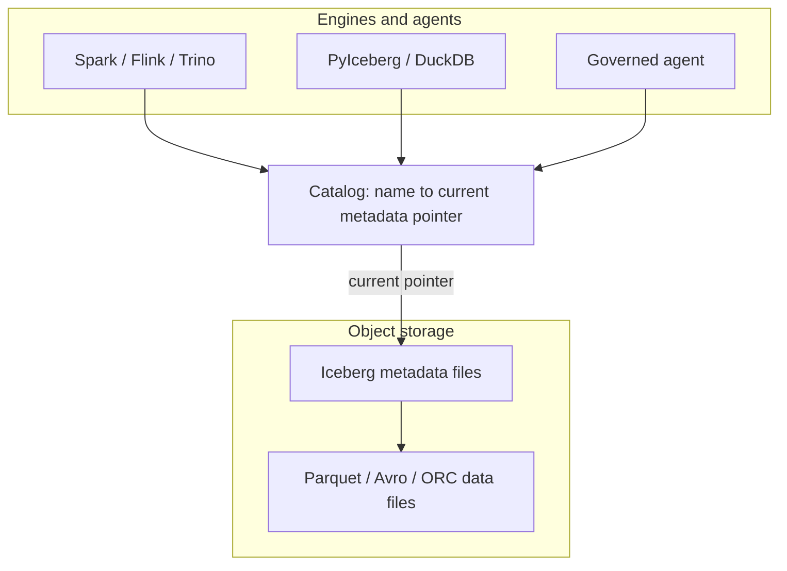
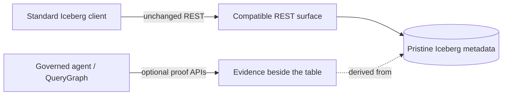
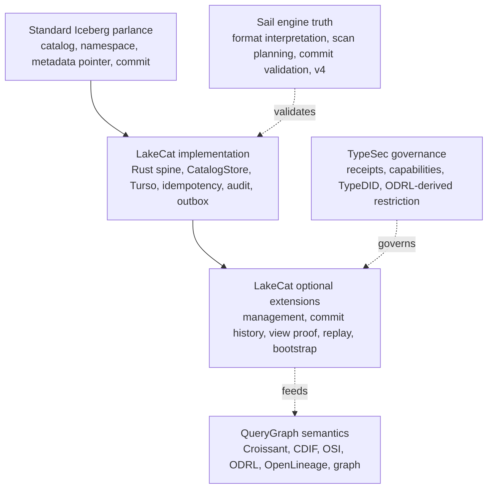
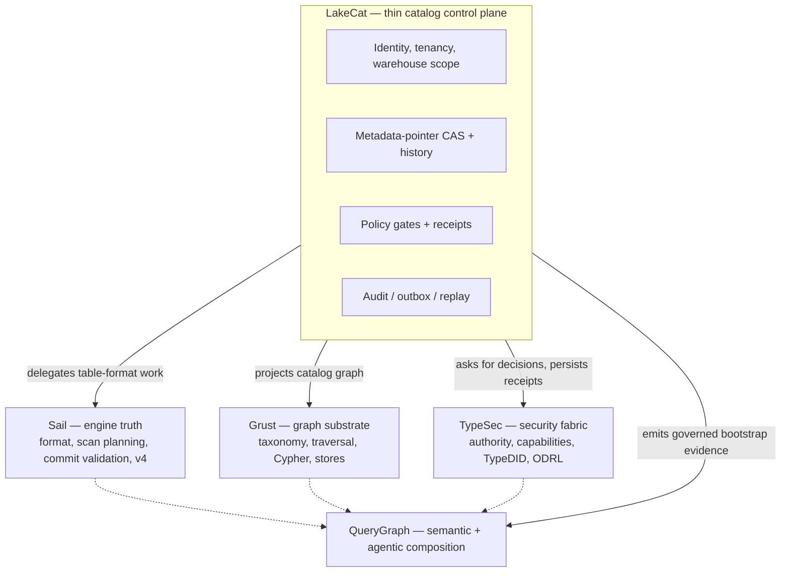
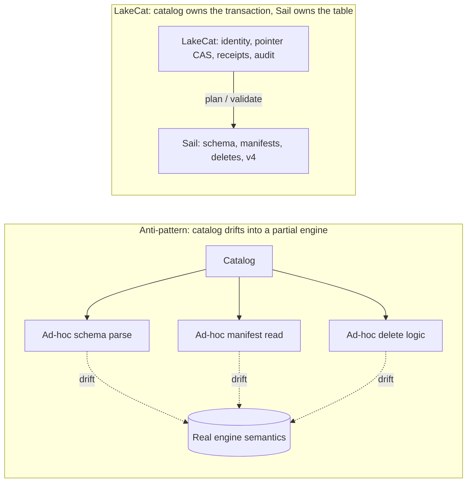
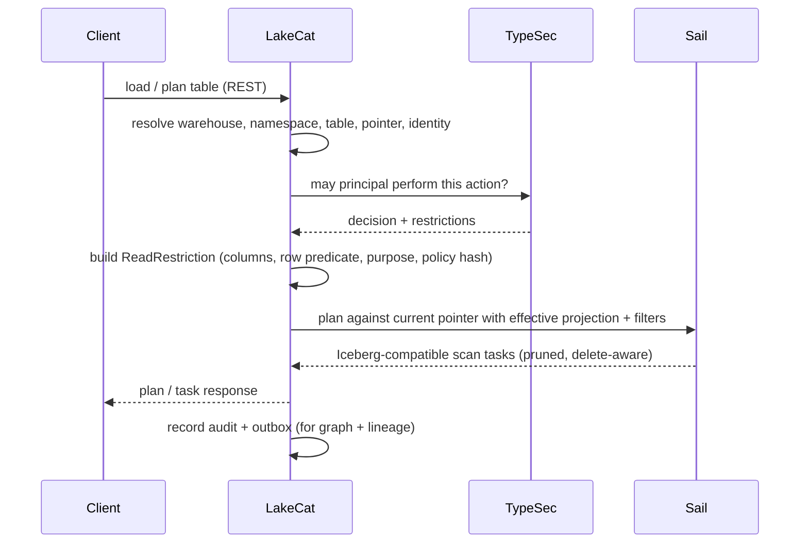
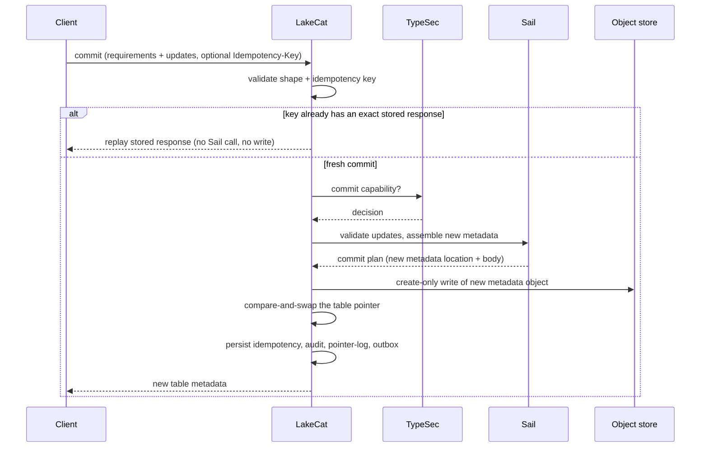
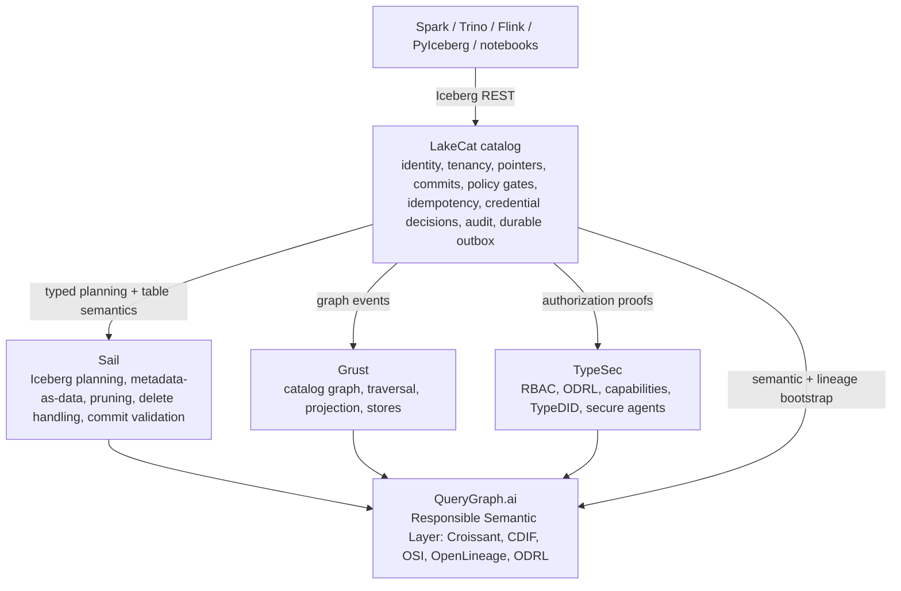

# LakeCat

## Preface

LakeCat is a Rust-native, Iceberg-compatible catalog foundation for QueryGraph.
It begins from one conservative claim and one ambitious one. The conservative
claim: an ordinary Iceberg REST catalog must keep working for ordinary engines —
Spark, Flink, Trino, DuckDB, PyIceberg, Sail — with no new protocol to learn.
The ambitious claim: the *next* catalog also has to be a governed control plane
for Rust-first planning, semantic graph handoff, lineage, and agent access.

LakeCat holds both at once by drawing a sharp line. It keeps Iceberg
compatibility at the boundary and moves the work that needs deep table-format
knowledge to the engine that can reason about it. In this repository the catalog
is **LakeCat** and the engine-side lakehouse implementation is **Sail**. Graph
behavior belongs to **Grust**; governance and capability proof belong to
**TypeSec**; the end-to-end integration target is **QueryGraph**.

This book builds from first principles. Chapter 2 explains what a catalog is,
what Iceberg makes the catalog responsible for, and what LakeCat adds without
changing the table format. Chapter 3 fixes the vocabulary — the single hardest
thing in a layered system — so every later term has an owner. Chapter 4 draws
the boundary model: which repository owns which concept, and which ideas might
someday become neutral, standardizable profiles. The middle chapters walk the
live architecture: the service spine, the read path, the commit path, and the
durable store. The final chapters cover the engine boundary and the v3→v4 path,
the graph/security/lineage handoffs, the QueryGraph/QGLake acceptance flow,
worked examples, and the first-release scope.

Each concept is defined once and then used. Where a later chapter needs a term,
it links back rather than restating it.

## Catalogs, Iceberg, and What LakeCat Adds

### What a catalog is

A data catalog is often described as a place that lists datasets. That is true
but too small. A real catalog is the control plane between names, storage,
metadata, identity, and intent. At minimum it answers four questions:

1. What table does this name mean?
2. Where is its current metadata?
3. Who may read, write, plan, or administer it?
4. What changed, when, and under whose authority?

In a traditional database the catalog is embedded in the engine: one system owns
table definitions, statistics, permissions, and the transaction log. A lakehouse
pulls that apart. Data files live in object storage, metadata files live beside
them, and several engines read and write the same tables. The catalog becomes
the agreement point — it maps a logical table name to the current metadata
pointer and arbitrates updates to that pointer.



That pointer is deceptively important. If the catalog points at metadata version
17, the table *is* version 17. If a writer prepares version 18 and wins the
compare-and-swap, the table becomes 18; if it loses, nothing partially changes.
The catalog is not the table format, but it is where table history becomes
visible and durable. For human analytics this sounds like bookkeeping. For
agentic systems it is a trust boundary: a catalog can know the principal,
warehouse, namespace, table, snapshot, requested columns, row restriction,
storage profile, and policy receipt — and if it captures that before planning
and commits it after state changes, it becomes a governed control plane rather
than a passive address book.

### What Iceberg makes the catalog responsible for

Apache Iceberg is a table format for large analytic tables. Its core idea is to
put the table's truth in explicit metadata files so engines can plan reads and
validate writes without directory listing or fragile storage conventions. A
current metadata file names schemas, partition specs, sort orders, snapshots,
and properties; snapshots point to manifest lists; manifest lists point to
manifests; manifests describe data and delete files.

The catalog's role in Iceberg is intentionally narrow. Standard clients must be
able to load table metadata, create namespaces and tables, commit changes, and
sometimes receive credentials or scan tasks — over a documented REST shape:

```text
GET  /v1/config
GET  /v1/{prefix}/namespaces
POST /v1/{prefix}/namespaces/{ns}/tables
GET  /v1/{prefix}/namespaces/{ns}/tables/{table}
POST /v1/{prefix}/namespaces/{ns}/tables/{table}   # commit: requirements + updates
```

The rule that governs everything else in this book: **a normal client must never
have to call a non-standard endpoint to read an ordinary table.** If it does,
compatibility is already broken.

### What LakeCat adds without changing Iceberg

LakeCat's promise is *compatibility first, evidence second, semantics above the
catalog.* A Spark or PyIceberg client sees an Iceberg REST catalog. A QueryGraph
or governed-agent client may ask for richer proof. Both share the same table
because the portable truth stays in Iceberg metadata and the extra evidence
sits beside it — never inside the table format.



Iceberg metadata stays pristine. Policy, graph, lineage, and agent state are
*derived* control-plane or graph data. The table remains an Iceberg table.

## The Vocabulary

A layered system fails the moment its words blur. The most common mistake is to
call every useful LakeCat feature an "Iceberg extension," which makes the
standard boundary too large. The test is simple: **ask what breaks if a client
knows nothing about LakeCat.** If a PySpark job cannot load, commit, or drop a
table without the concept, it belongs to standard compatibility. If PySpark
keeps working but operators, governed agents, or QueryGraph gain stronger
evidence, the concept is an additive surface.

Every term in this book falls into one of six categories.



**Standard Iceberg parlance** — the words Iceberg already owns: catalog,
namespace, table identifier, current metadata location, snapshot, manifest list,
manifest, data file, delete file, schema and partition evolution, optimistic
commit, REST compatibility. LakeCat must implement these faithfully. Changing
their meaning means losing compatibility.

**LakeCat implementation** — how this Rust catalog satisfies the contract
reliably: the service spine, the `CatalogStore` trait, the Turso-backed durable
store, normalized idempotency rows, pointer logs, audit rows, outbox rows,
redaction rules, and replay validators. These make ordinary Iceberg behavior
atomic, inspectable, and replayable. They are not extensions; they are good
engineering behind a standard surface.

**LakeCat optional extensions** — additive APIs beside the standard path:
management inventory, commit-history inspection, view proof, credential-root
posture, replay verification, OpenLineage projection, and QueryGraph/QGLake
bootstrap bundles. They help operators, agents, and QueryGraph without becoming
hidden requirements for ordinary table access.

**TypeSec governance** — authority and receipt semantics: who may act, capability
proof, TypeDID envelopes, ODRL-derived restrictions, and agent posture. TypeSec
*decides*; LakeCat *carries and records* the decision.

**QueryGraph semantics** — composition above the catalog: Croissant, CDIF, OSI,
ODRL, OpenLineage, and Grust graph projections built from the governed source of
truth.

**Sail engine truth** — table-format interpretation, metadata-as-data, scan
planning, commit validation, and typed v4 behavior. The catalog binds its proof
to engine truth rather than reimplementing the format.

The single reference below replaces the per-claim restatements that earlier
drafts repeated; read each LakeCat claim through its category.

| Claim | Standard reading | Category | Portable idea (if any) |
| --- | --- | --- | --- |
| Rust service / catalog spine | Iceberg needs a catalog authority, not a language | LakeCat implementation | "A catalog can prove what it committed, planned, vended, and emitted" |
| Turso-backed durable store | Iceberg needs durable state + atomic pointer movement, not a named DB | LakeCat implementation | CAS, exact-retry, row/content binding, pointer-history proof |
| REST namespace/table routes + commit CAS | Standard compatibility | Standard Iceberg | — (must stay ordinary) |
| Idempotency, pointer logs, audit/outbox, replay validation | Mostly outside the table contract | LakeCat implementation / extension | Stable catalog-event identity; scoped replay admission |
| Governed scan with policy receipt | Iceberg gives scan inputs, not receipts | TypeSec governance | Engine-proved effective projection + predicate |
| Credential vending posture | Catalog-adjacent, not ordinary table semantics | TypeSec governance | Bounded, redacted, engine-neutral credential profile |
| QueryGraph / QGLake / OpenLineage handoff | Not required for table access | QueryGraph semantics | Redacted, replayable lineage/view/commit evidence |
| Typed Iceberg v4 behavior | Belongs to the format as it evolves | Sail engine truth | Engine-owned v4 interpretation, not catalog JSON parsing |

## The Boundary Model

The vocabulary tells you which category a word lives in. The boundary model says
which *repository* owns the work and why. LakeCat is deliberately thin: it keeps
identity, tenancy, metadata-pointer state, policy gates, idempotent commits, and
integration events — and delegates everything reusable.



The ownership rule, stated once:

| Concern | Owner | LakeCat keeps only |
| --- | --- | --- |
| Iceberg format, manifests, scan planning, pruning, delete handling, v4 | Sail | The call into Sail and the proof binding its result |
| Graph schema, taxonomy, traversal, stores, Cypher | Grust | The catalog-facing sink/projection boundary |
| Authorization, policy composition, capabilities, TypeDID, credential decisions | TypeSec | The request for a decision and the persisted receipt |
| Croissant/CDIF/OSI/ODRL/OpenLineage composition, agent workflows | QueryGraph | The governed bootstrap bundle it emits |
| Identity, tenancy, pointer CAS, idempotency, audit, outbox, replay | LakeCat | All of it — this is the thin catalog |

This is also the answer to the recurring "is it an extension or a standard?"
question. LakeCat is opinionated in code and modest in standardization. "Use
Rust," "use Turso," "use TypeSec," "import QGLake," "project into Grust" are
project choices, not proposals. The portable ideas are narrower and stated
without product names: *reject idempotency drift; record redacted pointer
history; emit transactional catalog-event identity; admit only scoped replay
evidence; prove a governed scan was narrowed by an engine.* A proposal that
forced every Iceberg catalog to understand QueryGraph, TypeSec, Grust, or Turso
would narrow the ecosystem; a proposal that says "a catalog may publish redacted,
replayable commit evidence" leaves room for many implementations. Prove the
stronger shape locally, then extract only the database-neutral, policy-neutral,
engine-neutral part.


## Where LakeCat Stands Today

LakeCat is not only a design. The implementation already has a Rust
service/catalog spine, a Turso-backed durable store, Iceberg REST-compatible
namespace and table paths, hardened commit and replay evidence, governed scan
and credential proof, and QueryGraph/QGLake handoff surfaces. Read each of those
through its category (Chapter 3) rather than flattening them into "Iceberg
extensions": some are ordinary catalog implementation, some are optional LakeCat
APIs, some are TypeSec governance proof, and only a few are plausible future
standardization candidates.

The most important word is **beside**. New capability sits beside the Iceberg
REST path, never in front of it. A standard client never has to present a
TypeDID, parse a QueryGraph bundle, read a Grust edge, or inspect an OpenLineage
receipt to load a normal table. So the same catalog shows a different face to
each caller:

| Caller | What they see |
| --- | --- |
| PySpark / PyIceberg user | Ordinary Iceberg REST. Configure a catalog, create a namespace, write and load tables. Pointer-log, audit, and outbox rows exist but are invisible to table semantics. |
| Platform operator | A hardened catalog transaction log: idempotency outcomes, pointer movement, redacted conflict proof, storage-profile and credential posture, pending outbox, replay-validation failures. |
| Governed agent | A narrowed access path: TypeSec decides the capability, LakeCat binds the receipt to the catalog action, Sail plans the effective scan, the agent gets bounded work instead of broad credentials. |
| QueryGraph importer | A proof-bearing bootstrap: table, view, management, credential, scan, commit-history, OpenLineage, and graph-import anchors that must line up before the semantic layer is accepted. |

That separation also keeps standardization honest. The interesting portable
shapes are never "LakeCat uses Turso" or "QueryGraph imports a bundle"; they are
smaller behaviors — idempotent commit replay, catalog pointer history, governed
credential vending, proof-carrying scan planning, redacted conflict evidence,
lineage receipt binding. The posture, in five rules:

1. Keep base Iceberg REST behavior strict and boring.
2. Keep LakeCat proof surfaces optional for the clients that need them.
3. Keep TypeSec and QueryGraph semantics out of Iceberg metadata.
4. Use Sail for reusable table-format and planning semantics.
5. Promote only small, interoperable proof profiles once real workflows prove
   multiple engines and catalogs need them.

## Why the Catalog Stays Thin

The most dangerous failure mode for a "smart" catalog is becoming a partial
engine. It starts innocently — validate a schema here, expand a manifest list
there, peek at a `format-version` field, check a delete file. Each small parser
looks cheaper than an engine call. Over time the catalog grows a second Iceberg
implementation with weaker tests, fewer real execution users, and quiet drift
from how the planner actually behaves.



LakeCat takes the opposite path: **the catalog owns the transaction; Sail owns
the table semantics.** Sail is the right home because it is Rust-native and
already holds the structures this needs — generated Iceberg REST models, table
providers, manifest pruning, metadata-as-data paths, commit plumbing, and
format-version handling. Anything that needs field-id binding, schema/partition
evolution, manifest metrics, delete association, row lineage, v4 metadata trees,
or snapshot/branch selection moves toward Sail.

This matters because intermediation, left passive, *loses* information. A
pass-through catalog sees only the table name, the pointer, the caller, and
maybe a credential request; the engine sees schema, manifests, statistics,
deletes, and filters; governance sees policy; lineage sees an after-the-fact
event. Each system gets a shard of the truth, and the operational cost is
concrete:

- policy can be checked before access but not carried *into* scan planning;
- credentials can be vended without proving why a raw-credential exception was
  allowed;
- lineage can say something happened but cannot bind to the exact governed plan,
  snapshot, policy, and metadata.

The next generation of callers — agents, notebooks, services, model pipelines —
needs stronger guarantees that live precisely between catalog state and engine
planning: a policy enforced before a scan is planned; column restrictions that
narrow the projection before file tasks exist; policy-derived row predicates
that become mandatory filters; a stateless `fetchScanTasks` that cannot widen a
prior governed plan; short-lived, scoped, audited credentials; idempotent commit
retries; and graph/lineage side effects that reflect committed state rather than
best-effort handler work. A catalog too far from the engine can only check a
policy and hand back a pointer, hoping the client preserves the restriction.
LakeCat keeps the catalog boundary thin and binds its proof to Sail's plan so
the restriction is real.


## The Architecture

Thin does not mean trivial. LakeCat owns the durable catalog state that must be
correct even when external sinks are down, and nothing more. Its
responsibilities are exactly:

- serve the Iceberg REST Catalog API for standard clients;
- model projects, warehouses, namespaces, tables, views, and storage profiles;
- persist metadata pointers and compare-and-swap commit history;
- validate idempotency keys and replay only matching commit bodies;
- resolve request identity from headers, bearer tokens, agents, and TypeDID
  envelopes;
- ask TypeSec for authorization decisions and persist the receipts;
- route scan planning and commit preparation through Sail;
- record audit and outbox events inside the catalog transaction;
- drain committed events to Grust and OpenLineage sinks;
- publish a QueryGraph bootstrap bundle.

Everything else is deliberately excluded — LakeCat does not invent a table
format, fork manifest pruning, own graph traversal, decide security semantics,
or author QueryGraph's business model. Those belong to Sail, Grust, TypeSec, and
QueryGraph respectively (Chapter 4).

### The CatalogStore seam

All durable state sits behind one trait, so the memory store (for tests and
embedded use) and the Turso store (for durable local deployments) are
interchangeable. The interesting methods are the table lifecycle and the
idempotent replay hook:

```rust
#[async_trait]
pub trait CatalogStore: Send + Sync + 'static {
    async fn create_namespace(&self, warehouse: &WarehouseName, namespace: Namespace)
        -> LakeCatResult<()>;
    async fn list_tables(&self, warehouse: &WarehouseName) -> LakeCatResult<Vec<TableRecord>>;
    async fn create_table(&self, table: TableRecord) -> LakeCatResult<TableRecord>;
    async fn load_table(&self, ident: &TableIdent) -> LakeCatResult<TableRecord>;

    // Optimistic pointer advancement: the catalog transaction.
    async fn commit_table(&self, ident: &TableIdent, commit: TableCommit)
        -> LakeCatResult<TableRecord>;

    // Exact idempotent replay: same key + same request hash -> stored response.
    async fn replay_table_commit(
        &self,
        ident: &TableIdent,
        idempotency_key: &str,
        idempotency_request_hash: &str,
    ) -> LakeCatResult<Option<TableRecord>>;

    // Compact pointer-log history for operators and QueryGraph.
    async fn table_commit_records(&self, ident: &TableIdent, start: u64, end: Option<u64>)
        -> LakeCatResult<Vec<TableCommitRecord>>;
}
```

### The read path

A read begins like a standard catalog request and ends with a *governed* Sail
plan. The policy restriction becomes part of planning, not a note beside it.



The governing rule is **narrow, never widen**. An empty client projection under
a column restriction means *the allowed columns*; a client projection may narrow
further but cannot widen. LakeCat records both the requested and the effective
projection (and stats fields) as replay evidence, and recomputes the restriction
on every stateless `fetchScanTasks` so a stale token cannot expand back to all
columns. Outbox admission enforces that the governed scan replay carries the
same `read-restriction` at the top level and inside
`authorization-receipt.context`, a nonblank `purpose`, and a positive
`max-credential-ttl-seconds`, and rejects unknown fields — so graph, lineage,
and QGLake evidence can never inherit a claim the receipt did not capture.

### The commit path

The write path follows the same principle: LakeCat owns the transaction, Sail
owns Iceberg validation and metadata assembly.



Three invariant groups make this safe, each enforced once:

- **Metadata-write safety.** The new object must be a concrete child of the
  table's matched storage-profile prefix — never the current pointer, never the
  profile root, never a path with literal or percent-encoded dot segments, query
  strings, fragments, userinfo, or credential markers. Writes are create-only;
  if the store CAS loses after a write, LakeCat makes a bounded retry to delete
  the orphaned object and otherwise preserves the original conflict.
- **Idempotency.** Keys are 1–128 ASCII chars (`Idempotency-Key` /
  `x-lakecat-idempotency-key`, matching if both present). The same key + same
  body replays the stored response before any Sail call or write; the same key +
  a different body conflicts. Only audit-safe hashes are stored — never raw keys
  or secrets. Ordinary clients may commit without a key; they simply get no
  replay proof.
- **Redaction.** Every commit error — pointer conflict, overwrite, prefix
  mismatch, cleanup failure, backend error — reports `sha256:` hashes of the
  metadata location and failure detail, never raw object paths, storage roots,
  profile ids, or backend text. A conflict still looks like an ordinary Iceberg
  conflict to the client.

Commit records carry compact evidence — Iceberg format version, current snapshot
id, request/response/idempotency/policy hashes, principal — so operators and
QueryGraph can answer audit questions from the pointer log without parsing full
metadata. Operators read it through a governed endpoint:

```sh
curl -s -H 'x-lakecat-principal: operator@example.com' \
  http://127.0.0.1:3000/management/v1/warehouses/local/namespaces/default/tables/events/commits
```

That read itself enters the outbox as `table.commits-listed` and drains as
lineage plus `Commit` graph anchors keyed by table and sequence — an auditable
trail without giving anyone direct database access or turning LakeCat into a
graph query engine.

### The durable spine

The durable local store uses the Rust `turso` crate behind the `turso-local`
feature. Object storage remains the source of Iceberg metadata files; Turso
holds the atomic pointer and the control-plane memory: projects and warehouses,
storage profiles, namespaces and tables, the metadata pointer log, idempotency
records, soft deletes, policy bindings, audit events, and outbox events. This
mirrors the Iceberg contract — metadata files describe the table; catalog state
decides which file is current.

Two disciplines keep the spine trustworthy:

- **Decoded-row binding.** Every read reconciles the decoded JSON against the
  row's own key columns before returning it — a warehouse against its project
  and storage root, a namespace against its path, a policy binding against its
  table and enforced flag, a storage profile against its prefix/provider/mode, a
  table body against its identity. A corrupted row index can therefore never
  point a valid-looking record at the wrong tenant, path, or policy.
- **Strict outbox draining.** LakeCat projects a batch to graph and lineage
  *first*, then acknowledges the whole batch; if projection fails, nothing is
  acknowledged, and an under-count acknowledgement is a hard error rather than a
  quiet partial success. The drain refuses unknown event types (they stay
  pending rather than vanish), rejects event-id/payload-hash drift, and
  validates governed-read and commit evidence — policy-hash arrays must be
  non-empty full digests, top-level and receipt `read-restriction` must match,
  purpose and TTL must be present — before any sink sees the event. Malformed
  source evidence stays available for retry instead of being promoted into a
  QGLake handoff.


## The Siblings and the Engine Path

Chapter 4 named the four sibling repositories. This chapter shows how LakeCat
talks to each — what it hands off, and what it deliberately refuses to own.

### Grust: the graph boundary

Catalog events naturally form a graph: a server contains projects, a project
contains warehouses, a warehouse contains namespaces and credential-rooted
storage profiles, a namespace contains tables, and a table has columns,
snapshots, commits, policies, scan plans, principals, and lineage runs.
QueryGraph wants that graph — but LakeCat must not become a graph database.

LakeCat emits a bounded envelope of stable catalog facts through a
catalog-facing sink; Grust owns the taxonomy, stores, traversal, and Cypher:

```text
Server CONTAINS Project          Warehouse HAS_STORAGE_PROFILE StorageProfile
Project CONTAINS Warehouse       Table GOVERNED_BY Policy
Warehouse CONTAINS Namespace     Principal CAN_PLAN ScanPlan
Namespace CONTAINS Table         Commit DERIVED_FROM Snapshot
Table HAS_COLUMN Column          LineageRun USED_BY QueryGraphModel
```

High-cardinality file and manifest facts stay queryable through Sail's
metadata-as-data rather than being smuggled into the event sink. Storage-profile
and credential-vend events replay with redacted evidence only —
`secret-ref-present`, the provider, never the secret URI — so QueryGraph can see
*that* a principal attempted credential-root access without seeing the
credential. The `grust-turso-local` feature proves the boundary end to end:
LakeCat writes catalog events into a Grust-owned Turso graph store and Grust
Cypher reads them back, with LakeCat never parsing Cypher or executing traversal.

### TypeSec: the authorization boundary

LakeCat is a policy *enforcement* point, not the author of security semantics.
Every externally meaningful action — config reads; namespace and table
lifecycle; scan planning; commit; credential vending; policy management; graph
and lineage reads — passes through TypeSec. LakeCat gathers context (principal
and agent DID, bearer subject, warehouse/namespace/table, columns, snapshot,
requested credential duration, purpose, active bindings), asks TypeSec for a
decision, persists the receipt with audit-safe hashes, and applies the
restriction *before* Sail plans.

This is where ODRL becomes operational. A policy may say a principal reads only
certain columns, only for a purpose, or only under a row predicate. LakeCat
parses the minimal enforceable subset — accepting camel-case, kebab-case, and
JSON-LD operand forms — and **fails closed**: missing or deny-shaped operators,
blank allowed-column lists, blank purposes, or disagreeing purpose sources are
rejected rather than guessed. Composition and reasoning stay in TypeSec; LakeCat
does not grow a parallel security language.

Credential vending is the audited exception, not the default. Governed
Sail-planned reads are the norm. When credentials must issue, TypeSec checks the
`credentials.issue` capability for the exact secret reference and LakeCat returns
only scoped, short-lived configuration — capping TTL to the tightest
`max-credential-ttl-seconds` across all policy locations, replacing any
issuer-supplied `lakecat.*` evidence with catalog-derived values, and recording
only hashed prefixes in audit. The replay-admission rules from Chapter 5 (matching
top-level and receipt restrictions, full digests, closed field sets) apply
identically here, so a credential or raw-exception event cannot drift before it
reaches graph, lineage, or QGLake proof.

### Sail and the v3→v4 path

Sail is a Rust-native engine — Arrow, DataFusion, generated Iceberg REST models,
catalog-provider seams, manifest pruning, metadata-as-data — so LakeCat can *ask*
for typed Iceberg behavior instead of parsing just enough JSON to survive. The
questions LakeCat sends to Sail are the ones that require table-format knowledge:

- which field ids satisfy this projection?
- which filters are enforceable at planning time?
- which manifests and files survive pruning?
- which delete files must accompany the selected data files?
- which scan tasks are children of a governed parent plan?
- which v4 fields are known, preserved as passthrough, or not yet safe to read?

LakeCat evolves under three rules: conform to Iceberg v3 for ordinary clients;
preserve unknown/emerging v4 metadata without claiming settled semantics; prefer
typed Sail support the moment it exists, using JSON passthrough only as a bridge.
Today the v4 bridge is deliberately narrow — when LakeCat sees
`format-version: 4`, `lakecat-sail` extracts the stable envelope (table UUID,
location, schema id, snapshot id, sequence number, manifest-list path, default
spec, field names), can plan a governed manifest-list scan task from it, and
re-validates the signed plan task on `fetchScanTasks` so a stateless fetch can
neither drift to a different manifest list nor widen the governed projection.
Pruning and typed metadata-tree semantics wait for Sail-owned v4 support.

### The semantic handoff: Croissant, CDIF, OSI, OpenLineage

QueryGraph needs a semantic picture, not just physical access. LakeCat publishes
one without pretending to be QueryGraph. The bootstrap bundle carries Semantic
Croissant and CDIF projections (dataset/field discovery), an OSI handoff of
stable anchors, ODRL artifacts and TypeSec policy context, OpenLineage events
for catalog changes and plans, a Grust-ready graph envelope, and a manifest that
hashes every artifact. The boundary is careful: LakeCat publishes stable anchors
and governed source metadata; QueryGraph authors the business model. Because
OpenLineage events drain from the durable outbox in `created_at,event_id` order
*after* the catalog transaction, lineage reflects committed state rather than a
handler's best-effort side effect.

### The full stack

When LakeCat is done, a standard engine still loads and commits tables without
knowing QueryGraph exists, while governed callers get the richer path:



### Implementation shape

The workspace expresses the architecture directly:

```text
crates/
  lakecat-core        stable IDs, errors, time, config, content hashes
  lakecat-api         Iceberg REST request/response adapters
  lakecat-store       catalog state traits + Turso-backed implementation
  lakecat-sail        Sail provider bridge and privileged planning client
  lakecat-graph       catalog-facing Grust sink/adapters
  lakecat-security    TypeSec integration and authorization receipts
  lakecat-lineage     OpenLineage projection and event receipts
  lakecat-querygraph  Croissant/CDIF/OSI/ODRL/OpenLineage bootstrap projection
  lakecat-service     axum service, middleware, auth, routing
  lakecat-cli         admin, local demo, conformance, bootstrap export
```

Feature gates keep integrations honest, and embedded defaults stay safe for
tests so a memory-store test never accidentally depends on a sibling repo:

```text
sail-local         local Sail APIs for planning and provider integration
typesec-local      local TypeSec APIs for governance and TypeDID verification
grust-local        local Grust APIs for catalog graph projection
grust-turso-local  Grust's Turso backend for durable catalog graph projection
turso-local        the Turso-backed durable store
```

The runtime honors the same line: without `sail-local`, the deferred Sail seam
*rejects* scan planning rather than fabricating an empty plan, so any real read
reflects the engine that interprets Iceberg metadata, never a catalog-shaped
placeholder. Standard compatibility lives at `/catalog/v1`; management APIs,
`/querygraph/v1/bootstrap`, and feature-gated Sail planning sit beside it, never
in front of it. (The first-release gate and dependency contract that hold this
together are covered in the release chapter.)


## Workflow Examples

The catalog is easiest to understand by watching it participate in ordinary
work. LakeCat should not ask users to think about graph, lineage, security, and
Sail every time they read a table. Those systems should appear when they matter:
at the boundary where a name is resolved, a policy is enforced, a plan is
created, credentials are withheld or issued, and a durable event is replayed.

The examples below use one table, `local.default.events`, but the pattern is the
same for larger warehouses. The important point is not the exact sample data.
It is the catalog role in each workflow.

### Starting The Catalog

A local operator starts LakeCat as an Iceberg REST catalog plus management
surface:

```sh
cargo run -p lakecat-service --features sail-local,turso-local,typesec-local,grust-local
```

The standard catalog path is still `/catalog/v1`. The management and
QueryGraph surfaces sit beside it:

```text
/catalog/v1
/management/v1
/querygraph/v1/bootstrap
```

A simple health-oriented configuration read shows the split. Standard engines
care about the Iceberg endpoints. Operators and QueryGraph care about the
management and bootstrap endpoints.

```sh
curl -s http://127.0.0.1:3000/catalog/v1/config
```

The defaults intentionally separate compatibility from future capability:

```json
{
  "defaults": [
    {"key": "lakecat.compatibility", "value": "iceberg-rest"},
    {"key": "lakecat.format.baseline", "value": "iceberg-v1-v3"},
    {"key": "lakecat.format.v4", "value": "extension-ready"},
    {"key": "lakecat.format.v4.bridge", "value": "json-passthrough"},
    {"key": "lakecat.format.v4.typed-sail", "value": "unavailable"}
  ]
}
```

That means LakeCat can preserve and replay emerging v4 metadata through the
Sail JSON bridge, but it is not claiming typed Sail v4 semantics yet. The same
defaults are stored in catalog config-read replay evidence, and malformed
replay that omits the v4 bridge posture is rejected before graph or OpenLineage
projection. The replay defaults must also be ordinary string key/value entries
with duplicate-free keys, so a saved outbox event cannot say both
`lakecat.format.v4.typed-sail=unavailable` and
`lakecat.format.v4.typed-sail=available`.
Those key/value entries are closed over just `key` and `value` before replay is
acknowledged. A saved config-read event cannot hide an extra compatibility, v4,
integration, or application claim inside a default or override entry and have
that claim travel into graph, OpenLineage, or QGLake config proof beside the
checked catalog contract.
LakeCat also rejects unsupported extra `lakecat.format.v4*` defaults, such as
preview typed-Sail keys, because those would make the bridge posture sound more
settled than the current Sail-owned typed v4 surface proves. Config overrides
are held to the same honesty rule for v4 posture: until typed Sail v4 support is
available, replay evidence cannot use an override to claim
`lakecat.format.v4.typed-sail=available` or introduce another v4 bridge key.
Catalog config replay now also preserves the advertised endpoint list. That is
not a new protocol requirement for standard clients; it is proof that the
configuration LakeCat projected to graph and OpenLineage still contained the
ordinary Iceberg REST surface. Replay validation requires the config endpoint,
namespace list/create endpoints, table create endpoint, table load endpoint,
and table commit endpoint for both the default and warehouse-prefixed catalog
routes before the config read can become compatibility evidence.
Replay validation also requires LakeCat's governed access endpoints: plan,
fetch-scan-tasks, and credentials. Those routes are not a new table format and
not a QueryGraph dependency for ordinary reads. They are additive catalog APIs
that let governed clients ask LakeCat, TypeSec, and Sail for proof-carrying
plans, task fetches, or audited credential decisions over the same standard
Iceberg tables.
Replay validation also preserves the additive integration surfaces that make
LakeCat useful as the QueryGraph foundation: `/querygraph/v1/bootstrap` and
`/management/v1/lineage/drain`. These are not standard Iceberg REST table
operations and they are not required for PySpark or another ordinary Iceberg
client to load a table. They are LakeCat/QueryGraph/OpenLineage control-plane
endpoints. Their presence in config evidence proves that a QGLake import,
OpenLineage replay, or agentic management workflow saw the same integration
contract that LakeCat later projects into graph and lineage systems.

That proof now survives into saved lineage-drain artifacts and compact QGLake
handoff summaries, not only service admission. A `catalog.config-read` drain
summary carries three compact fields: the advertised config defaults, config
overrides, and endpoint list. The compact handoff summary then promotes the
same evidence into `lakecatReplayVerification.catalogConfigProof`, alongside
the principal, authorization action, graph count, replay hashes, and
OpenLineage hashes for the config-read event. QGLake verification checks those
fields again when reading the saved drain, when reading the compact summary,
and when comparing captured LakeCat replay sidecars. A handoff cannot keep the
`catalog.config-read` event while dropping
`lakecat.format.v4.typed-sail=unavailable`, adding a preview
`lakecat.format.v4*` key, using an override to rewrite v4 posture, omitting the
standard REST, governed access, bootstrap, or lineage-drain endpoints, or
archiving a captured replay file whose config proof differs from the summary.
Raw lineage-drain summary construction now applies the same fail-closed shape
checks before that compact proof is returned: config defaults and overrides
must remain `ConfigEntry` arrays with duplicate-free string keys and string
values, and endpoint evidence must remain a duplicate-free nonblank string
array containing the required standard REST, governed plan/fetch, bootstrap,
and lineage-drain routes LakeCat advertised at service replay.
That makes the config proof replayable outside the service process. QueryGraph
can trust that the compatibility and integration contract it imports is the
same contract LakeCat admitted before graph and OpenLineage projection.
The same rule now applies to raw `querygraph.bootstrap` summaries. Bootstrap
itself is not standard Iceberg parlance: it is LakeCat/QueryGraph handoff
evidence built beside the Iceberg REST path. Its source facts still describe
standard catalog state such as warehouse identity, table count, view count, and
accepted table/view stable ids, but its bundle hash, Grust graph hash,
OpenLineage hash, Croissant/CDIF/OSI/ODRL artifact hashes, standards list,
authorization receipt, and TypeSec-style request-identity hashes are additive
LakeCat/QueryGraph/TypeSec proof. Raw summary construction now runs the same
service replay validator over that bootstrap envelope before compact QGLake
proof can inherit any of it. A saved drain cannot keep a `querygraph.bootstrap`
event while shrinking the standards list, replacing artifact arrays with
objects, drifting table/view counts away from verified manifests, inventing a
malformed principal, or attaching short TypeDID/agent hashes to an otherwise
valid-looking bootstrap proof.
When config evidence carries optional tenant-root records, the same admission
rule applies to sensitive roots: a raw `server-record.endpoint-url` must carry
the matching full `endpoint-url-hash`, and a raw
`warehouse-record.storage-root` must carry the matching full
`storage-root-hash` before config discovery can be projected or archived as
QGLake proof.

The bridge is intentionally conservative, but it should not reject Iceberg
metadata that Sail has already decoded. Manifest expansion now emits null
partition slots as JSON `null` and recursively encodes nested Sail partition
literals into JSON objects, arrays, and explicit key/value map entries. That
keeps standard Iceberg REST fetch responses usable for richer partition tuples
without pretending LakeCat owns a full typed v4 implementation.

At this point the catalog is already doing more than route HTTP. It has a
warehouse identity, a store, a governance engine, a Sail planning seam, a graph
sink, and a lineage sink. Embedded defaults keep the local loop small, but the
same trait boundaries can point to Turso, TypeSec, Grust, and Sail.

### Registering The Warehouse Shape

An operator usually starts with management objects. A server groups projects. A
project groups warehouses. A warehouse owns namespaces, tables, views, storage
profiles, policy bindings, and the metadata pointer state that standard engines
see through Iceberg REST.

```sh
curl -s -X PUT http://127.0.0.1:3000/management/v1/servers/prod \
  -H 'content-type: application/json' \
  -d '{
    "display-name": "Production LakeCat",
    "endpoint-url": "https://lakecat.example.com",
    "properties": {
      "owner": "platform"
    }
  }'

curl -s -X PUT http://127.0.0.1:3000/management/v1/projects/resilience \
  -H 'content-type: application/json' \
  -d '{
    "display-name": "Resilience Desk",
    "server-id": "prod",
    "properties": {
      "environment": "demo"
    }
  }'

curl -s -X PUT http://127.0.0.1:3000/management/v1/projects/resilience/warehouses/local \
  -H 'content-type: application/json' \
  -d '{
    "display-name": "Local QGLake Warehouse",
    "storage-root": "file:///tmp/lakecat/qglake",
    "properties": {
      "querygraph": "enabled"
    }
  }'
```

These writes are not Iceberg table metadata. They are catalog control-plane
state. LakeCat persists them durably, records authorization receipts, and writes
outbox events. When the outbox drains, server, project, warehouse, and
storage-profile and policy-binding changes become catalog graph events; the
same management changes also become OpenLineage receipts. QueryGraph can later
learn the management shape without requiring every Iceberg client to understand
it. Project, server, and warehouse tenant-root replay is checked before
projection: project evidence must carry a matching project id, optional valid
server scope, and string-map public properties; server evidence must carry a
valid server id, optional valid endpoint URL or full `endpoint-url-hash`, and
string-map properties; warehouse evidence must carry a valid warehouse, project
id, optional valid storage root or full `storage-root-hash`, and string-map
properties. Service admission also closes those nested project, server, and
warehouse record objects over their route-produced fields, so unexpected
tenant-root, endpoint, or storage-root claims fail before acknowledgement,
graph projection, OpenLineage projection, or QGLake proof can inherit them.
LakeCat also closes the top-level management upsert payloads for
`project.upserted`, `server.upserted`, and `warehouse.upserted`, so a replay
sidecar cannot append unverified endpoint, storage-root, project-scope,
lineage, graph, QueryGraph, or application claims beside checked route
identity, nested record evidence, optional project scope, and authorization
receipt evidence. The wrapped outbox envelopes for `project.upserted`,
`server.upserted`, and `warehouse.upserted` are closed as well: only the audit
event id, event type, and checked inner payload are accepted, which keeps
tenant-root replay evidence from gaining extra management claims outside the
schema LakeCat actually verifies.
Policy-binding upsert replay is checked before projection too: the
evidence must carry a valid policy id, warehouse, optional namespace/table
scope, an enforcement flag, the captured ODRL material, and an `odrl-hash`
that matches that material. The hash must be a full SHA-256-shaped digest
before LakeCat compares it to the ODRL body. LakeCat does not reason over that
ODRL during replay, but malformed binding shape or drifted ODRL content proof
fails closed before the policy anchor can be delivered to graph or lineage
sinks. Service admission also closes the nested `policy` object over the
route-produced fields, so unexpected ODRL, governance, scope, or enforcement
claims fail before acknowledgement, graph projection, OpenLineage projection,
or QGLake proof can inherit them. It also closes the top-level
`policy-binding.upserted` payload, so a replay sidecar cannot append unverified
ODRL, governance, scope, lineage, graph, QueryGraph, or application claims
beside checked warehouse, policy object, ODRL content hash, enforcement state,
and authorization evidence. The wrapped `policy-binding.upserted` envelope is
closed too, so ODRL or governance claims cannot be smuggled beside an otherwise
valid inner policy-binding replay payload. Raw lineage-drain summaries now use
the same service replay validators for `policy-binding.upserted`,
`project.upserted`, `server.upserted`, and `warehouse.upserted` before compact
QGLake management proof inherits them. That keeps compact replay proof from
becoming a looser path for malformed management ids, endpoint or storage-root
hashes, ODRL hashes, wrapper fields, or authorization receipts. Those
management upserts must also carry a valid authorization receipt principal, so
the catalog graph and OpenLineage stream never accept actorless tenant-root,
storage-profile, or policy mutations.
Namespace lifecycle replay is checked before projection as well: create, load,
and drop events must carry a valid warehouse and either a valid namespace path
or non-empty namespace component array. A malformed namespace lifecycle event
stays pending and reaches neither the Grust-facing graph sink nor OpenLineage.
Service replay closes those namespace lifecycle payloads over `event-type`,
`authorization-receipt`, `warehouse`, and `namespace`, so an archived create,
load, or drop cannot attach unverified namespace, scope, replay, OpenLineage,
or QueryGraph claims beside valid standard catalog evidence. It also closes
the wrapped outbox envelope for namespace lifecycle events, so those claims
cannot be placed beside an otherwise valid checked inner namespace payload. Raw
lineage-drain summaries now reuse those same validators for `namespace.listed`,
`namespace.created`, `namespace.loaded`, and `namespace.dropped`: namespace
inventory counts must match the listed namespace paths and remain
duplicate-free, lifecycle namespaces must be valid paths or component arrays,
receipt actions must match the event type, and closed wrappers cannot carry
unverified QueryGraph or lineage sidecars before compact QGLake standard
catalog proof inherits the evidence.
Catalog read replay has the same fail-closed shape: `catalog.config-read`
events must carry a valid warehouse, and `namespace.listed` events must carry
both a valid warehouse and an unsigned namespace count before the read evidence
can be projected. These standard catalog reads and namespace lifecycle events
must also carry a valid authorization receipt principal before delivery, so
Iceberg-compatible control-plane replay remains attributable.
Management-list replay is checked before delivery too: policy-binding,
project, server, storage-profile, and warehouse list events must carry unsigned
counts, warehouse-scoped lists must carry a valid warehouse, and optional
project scope on warehouse-list replay must be a non-empty, syntactically valid
project identifier before those reads can become replay evidence.
Raw management-list summaries now use that same service replay validator before
compact QGLake proof inherits the inventory. This keeps management proof as a
LakeCat/QueryGraph control-plane extension around catalog state, not a loose
JSON appendix: list events must still carry the event-matching management
action, valid authorization receipt, closed wrapper schema, valid warehouse or
project scope where applicable, required count-aligned ID arrays, and
duplicate-free valid identifiers before QueryGraph can treat server, project,
warehouse, policy-binding, or storage-profile inventory as accepted proof.
Malformed management identifiers are reported with hash evidence rather than
raw tenant-root text.
Raw summaries enforce the same closed payload schema, actor evidence, action
match, and allowed decision before compact proof is built. They also require a
nonblank receipt engine and RFC3339 `checked_at` timestamp, so a `server.listed`
replay cannot be accepted under an unrelated table action, with unverified
QueryGraph or OpenLineage claims, with missing or denied authorization, with an
untraceable decision engine, with malformed decision time, or without a valid
authorization principal.
View replay is checked at the same boundary: view list events must carry valid
warehouse, namespace, and count evidence, and the count must match the listed
view names before graph or OpenLineage projection. View create/load/drop
evidence must carry a valid warehouse, namespace, and non-empty view name before
projection too. View list and lifecycle replay must also carry a valid
authorization receipt principal before delivery, preserving actor evidence for
QueryGraph view proofs. A view list is read-side catalog evidence, so the
service requires its authorization receipt action to be `view-load`; a
`view-manage` receipt is valid for mutations but not for replaying
`view.listed`. Raw lineage-drain summaries enforce the same count binding and
read-side action before compact QGLake proof is built, so an archived view
inventory cannot inflate discovery counts or be accepted under mutation
authority. View lifecycle replay is action-bound too: `view.upserted` requires
`view-manage`, `view.loaded` requires `view-load`, and `view.dropped` requires
`view-drop` before LakeCat emits graph or OpenLineage evidence. The
nested `view` evidence is closed over the catalog route's view shape too:
warehouse, namespace, name, store-assigned `view-version`, SQL, dialect, schema
version, columns, and properties. If a sidecar also carries top-level
warehouse or namespace evidence, it must match the nested view object before
delivery. A replay sidecar cannot drift the view scope, add an extra
QueryGraph, lineage, governance, or application claim inside that view object,
and have it acknowledged as catalog evidence. Raw lineage-drain summaries now
use the same service replay validators for `view.listed`, `view.upserted`,
`view.loaded`, and `view.dropped`, so compact QGLake view proof cannot inherit
a looser view list, action-drifted receipt, malformed version guard, or
sidecar-modified lifecycle payload than full replay would accept. Table
lifecycle replay now follows the same rule:

Active view state is protected before replay as well. A Turso row selected as
warehouse `local`, namespace `default`, and view `active_customers` must decode
to that same view before LakeCat returns it, lists it, updates it, or drops it.
The memory store applies the same check to keyed active-view reads. This is not
an Iceberg view extension; it is LakeCat's durable row/content guard around the
control-plane view state that later produces view receipt chains and QGLake
proof.
create, load, delete, and restore events must carry a valid root table identity,
and any payload warehouse, namespace, table-name, or soft-delete table evidence
must agree with that identity before the event can be acknowledged. Their
authorization receipts must also carry the matching lifecycle action:
`table-create`, `table-load`, `table-drop`, or `table-restore`, along with an
allow decision, engine, and checked-at timestamp. Delete replay preserves the
table-format generation through nested soft-delete `format-version` evidence.
Older sidecars may spell that field as `format_version`, but LakeCat rejects a
soft-delete object that carries both aliases before acknowledgement, graph
projection, or OpenLineage projection. That keeps archived delete proof from
hiding conflicting table-format evidence behind the spelling LakeCat happens
to read first.
Server endpoint URLs are operator-visible management metadata, so LakeCat keeps
them deliberately plain: they must be absolute `http` or `https` URLs, and they
cannot include query strings, fragments, or URI userinfo. Rejected submissions
return `server-endpoint-url-hash=sha256:...` evidence rather than echoing the
submitted endpoint.
Warehouse replay does not forward the raw storage root to graph or lineage
consumers. The drained payload replaces `storage-root` with
`storage-root-hash`, so QueryGraph can bind tenant evidence to a configured
root without receiving the local filesystem path or bucket URI.

### Storage Profiles And Credential Roots

Storage profiles bind a warehouse to physical storage roots and credential
issuance policy. A local profile can return scoped local file configuration. A
remote profile should usually reference a secret store and require TypeSec to
authorize issuance before any resolver sees the secret reference.
Warehouse storage roots are validated before memory or Turso persistence:
query strings, fragments, URI userinfo, and literal or percent-encoded dot path
segments fail with `warehouse-storage-root-hash=sha256:...` evidence rather
than echoing the submitted root.
LakeCat rejects profiles whose declared provider conflicts with the URI scheme
of the location prefix, so a credential root cannot claim to be local while
pointing at an S3 prefix. Those provider/location mismatch errors follow the
same redaction rule as replay: they name provider labels and a
`storage-profile-prefix-hash=sha256:...`, not the raw storage root.
When multiple profiles in the same warehouse could match a table, LakeCat uses
the longest matching location prefix. If two profiles tie on that longest
prefix, LakeCat fails closed rather than guessing which credential root or
metadata-object boundary should apply. The ambiguity error reports the
competing profile ids and `location-prefix-hash=sha256:...` evidence, not the
raw storage root.
The location prefix itself must be plainly addressed: LakeCat rejects literal
and percent-encoded dot path segments, query strings, fragments, and URI
userinfo before the profile can reach memory or Turso persistence.
Traversal-shaped or decorated storage-profile prefixes fail with
`storage-profile-prefix-hash=sha256:...` evidence rather than echoing the raw
prefix, token-like query value, or embedded userinfo. The management route pins
the same operator-facing behavior, so a rejected storage-profile upsert does
not leak the submitted decorated prefix.
It also rejects unsafe issuance-mode combinations: `local-file-no-secret` is
for file storage only, while `short-lived-secret-ref` is for configured remote
providers such as S3, GCS, and Azure. Those mismatches fail with the same
`storage-profile-prefix-hash=sha256:...` anchor and without echoing the raw
storage prefix or submitted `secret-ref`, so operators can correlate the
credential-root error without turning the management API into a credential
leak.
The `public-config` map is only for non-secret routing hints such as region,
endpoint labels, and operational purpose. LakeCat rejects secret-looking
public keys and values, so raw tokens, passwords, access keys, and credential
query parameters must move behind `secret-ref` and the TypeSec-authorized
resolver path. That rule is enforced both when a profile is built from a
management request and when a storage profile is revalidated before memory or
Turso persistence, so deserialized control-plane records cannot bypass the
public-config guard. Public-config validation failures also use
`public-config-key-hash=sha256:...` evidence rather than echoing the submitted
key or value, because even a rejected key name may contain a secret-looking
identifier. LakeCat also reserves credential-evidence keys such as
`lakecat.storage-profile-id`, `lakecat.storage-provider`,
`lakecat.credential-mode`, and `lakecat.max-credential-ttl-seconds`; operators
may still publish non-secret hints such as `lakecat.endpoint`, but they cannot
shadow catalog-owned proof in the eventual credential response. Replay
admission re-checks the same public-config shape for `storage-profile.upserted`
and `credentials.vend-attempted`, so archived storage-profile or credential
sidecars cannot smuggle reserved LakeCat proof keys or secret-like public hints
after the management/store guards have already run. The
`secret-ref` field itself must remain a clean external
secret-store locator: LakeCat rejects query strings, URI fragments, and
userinfo before persisting a storage profile, so token-like material cannot hide
inside a decorated secret URI. It also rejects literal and percent-encoded dot
path segments, so a credential root cannot rely on traversal-like spelling
before a resolver sees it. Unsupported credential-root schemes and malformed
secret-root paths are rejected with `secret-ref-hash=sha256:...` evidence
instead of echoing the submitted secret reference. The same hash-only rule
applies to invalid secret-ref URI syntax, decorated URI forms, and embedded
secret-like material such as password or token assignments.
Management upsert and list responses follow the same redaction rule. They do
not echo the raw `secret-ref`; they return `secret-ref-present`,
`secret-ref-provider`, and `secret-ref-hash` so operators and QueryGraph can
verify that a credential root exists and correlate it without learning the
secret-store path.
When LakeCat selects the storage profile for a table, the location prefix is
also matched on a storage-root boundary. A profile for
`s3://lakecat/events` applies to that exact root and to children such as
`s3://lakecat/events/tenant-a/table`, but it does not apply to a sibling path
such as `s3://lakecat/events-shadow/table`. That keeps credential roots from
accidentally governing more storage than their configured prefix describes; if
no stored profile matches, LakeCat falls back to an inferred governed-read
profile for the table location. The same check runs after the credential
issuer returns: `loadCredentials` rejects any returned prefix broader than the
selected profile before LakeCat attaches canonical response evidence, so a
custom issuer cannot widen catalog-owned storage scope. The rejection exposes
only `credential-prefix-hash` and `storage-profile-prefix-hash` evidence, and
LakeCat records no `credentials.vend-attempted` replay event for that failed
issuer response.
Public configuration on the selected storage profile remains non-secret
evidence. Service replay and raw lineage-drain credential summaries both
re-check that public-config keys are non-secret, values are strings, and
LakeCat-reserved credential-evidence keys do not appear there. Rejections carry
`public-config-key-hash=sha256:...` rather than the raw key or value, so compact
credential proof cannot smuggle token-shaped hints or structured secret blobs
beside an otherwise valid credential-vend event.

```sh
curl -s -X PUT \
  http://127.0.0.1:3000/management/v1/warehouses/local/storage-profiles/local-events \
  -H 'content-type: application/json' \
  -d '{
    "location-prefix": "file:///tmp/lakecat/qglake/events",
    "provider": "file",
    "issuance-mode": "local-file-no-secret",
    "public-config": {
      "lakecat.purpose": "developer-loop"
    }
  }'

curl -s -X PUT \
  http://127.0.0.1:3000/management/v1/warehouses/local/storage-profiles/s3-events \
  -H 'content-type: application/json' \
  -d '{
    "location-prefix": "s3://lakecat/events",
    "provider": "s3",
    "issuance-mode": "short-lived-secret-ref",
    "secret-ref": "vault://kv/lakecat/events",
    "public-config": {
      "lakecat.region": "us-west-2",
      "lakecat.purpose": "production-events"
    }
  }'
```

The catalog row stores the public profile and secret reference, not raw cloud
keys. A later credential request is checked against TypeSec and against the
effective read restriction for the target table. Agents with fine-grained table
restrictions are steered to governed Sail-planned reads instead of raw
credentials. Trusted humans can receive audited standard credentials only when
policy allows the exception.
For production secret managers, LakeCat keeps a provider-dispatch seam rather
than hard-coding credentials into catalog state. `vault://` can resolve through
the built-in Vault HTTP backend when Vault environment configuration is present.
`aws-sm://`, `gcp-sm://`, and `azure-kv://` can dispatch to explicitly
configured provider backends after TypeSec authorizes the exact secret-ref
resource. They can also use LakeCat's built-in file-backed provider roots for
local or single-node deployments:
`LAKECAT_AWS_SECRETS_MANAGER_FILE_DIR`,
`LAKECAT_GCP_SECRET_MANAGER_FILE_DIR`, and
`LAKECAT_AZURE_KEY_VAULT_FILE_DIR`. Each directory contains JSON credential
config files named as the full SHA-256 digest of the exact secret reference,
without the `sha256:` prefix, plus `.json`. For example,
`gcp-sm://lakecat/events` is authorized as that exact TypeSec resource and then
resolved from a hash-named JSON file under the configured GCP root. If no
backend is configured, those providers fail closed with an operator-readable
not-configured error, and denied TypeSec decisions do not call the backend or
read the file at all. Configured provider backends receive the same
policy-derived `max-credential-ttl-seconds` cap that LakeCat records in the
read restriction, and returned credentials must preserve that cap in
`lakecat.max-credential-ttl-seconds`. LakeCat rewrites duplicate TTL config
entries into one effective value before returning credentials, preserving a
stricter issuer TTL when it is valid and otherwise falling back to the policy
cap. It also rewrites LakeCat-owned profile, provider, mode, principal, and
governed-read-required evidence after issuance. For secret-ref-backed profiles
it also derives `lakecat.secret-ref-provider` and `lakecat.secret-ref-hash`
from the selected storage profile, so a cloud secret backend cannot make the
response look like a different catalog decision, secret-provider path, or
secret-reference anchor. Replay admission treats that evidence as structural
too: secret-ref providers and hashes must be nonblank when
`secret-ref-present` is true, and provider/hash fields must be absent when
`secret-ref-present` is false, no matter how a corrupted pending event encodes
them. The service tests for the REST
credential endpoint prove this response shape directly, not just through helper
functions. LakeCat also rejects any credential whose returned
prefix is outside the storage profile's `location-prefix`, so a misconfigured
cloud secret backend cannot widen a table's storage scope after TypeSec has
authorized the secret reference.
That failure remains hash-only and stops before credential-vend replay evidence
is recorded.
The audit event for the credential attempt records redacted
`credential-response-evidence`: the response prefix is hashed, LakeCat-owned
proof fields are kept as canonical values, and issuer-owned config is hashed
rather than copied. That keeps OpenLineage and QueryGraph replay useful without
turning lineage into a credential leak. For secret-ref-backed profiles the
redacted response evidence includes the catalog-derived
`lakecat.secret-ref-provider` and `lakecat.secret-ref-hash`, while the
storage-profile replay evidence includes `secret-ref-provider` and a full
`secret-ref-hash`; outbox admission rejects any credential response whose
provider or hash proof drifts from the selected profile before graph or
OpenLineage projection. The nested storage-profile proof is still checked even
when no credentials are returned: provider and issuance mode must be
compatible, and secret-reference presence must match the mode. That keeps
blocked credential attempts from projecting a weaker credential-root proof than
storage-profile management would accept.
Raw lineage-drain summaries now enforce that same nested storage-profile
posture before returning compact event proof. A summary cannot carry a raw
`secret-ref`, a short `location-prefix-hash`, a short `secret-ref-hash`, a
provider/hash field when `secret-ref-present` is false, a missing provider/hash
when it is true, or a provider/issuance-mode combination that service replay
would reject. That closes the gap between accepted replay and the compact
lineage-drain artifact QueryGraph later imports.
The storage-profile and
credential-vend service tests pin that producer-side `location-prefix-hash`
evidence is already a full SHA-256 digest before QGLake receives the compact
`locationPrefixHash` proof. The trusted-human credential-vending route test
pins that the committed outbox payload contains this redacted proof for the
audited raw-credential exception path. The blocked-agent route pins the other
side of the same contract: when Sail-planned reads are required and no raw
credentials are returned, the outbox records an explicit empty
`credential-response-evidence` array rather than leaving replay to infer why no
credential proof exists.
A not-configured resolver error reports the provider label and a
`secret-ref-hash=sha256:...` value, not the raw secret URI, so the operator can
correlate configuration without leaking the credential root. Resolver validation
errors for malformed Vault and TypeSec
environment references follow the same rule: wrong schemes, missing Vault
mounts or paths, and invalid environment-variable names produce hash evidence
instead of echoing the malformed secret reference. Generic provider detection
and resolver URI parsing follow that rule too, including unsupported provider
schemes, so malformed credential-root strings cannot leak through production
resolver diagnostics. Once a configured
resolver is authorized to run, backend lookup and secret payload parse failures
still stay hash-only: LakeCat returns the secret-reference hash and an
error-detail hash instead of the environment variable name, Vault path, token,
namespace, backend exception text, cloud secret-manager ARN or account path, or
malformed secret fields. That rule applies both to the built-in Vault and
environment resolvers and to explicitly configured AWS Secrets Manager, GCP
Secret Manager, and Azure Key Vault style backend seams, including the
file-backed provider roots. The file-backed roots are not a claim that LakeCat
has cloud SDK support for those providers; they are a redacted built-in backend
that lets the same production-shaped secret-ref dispatch run locally while SDK
resolvers are added later.
Secret payload parsing also rejects malformed credential configuration before
issuance, including blank config keys in either object-shaped secrets,
ConfigEntry-array secrets, or Vault's nested data object. That keeps
secret-manager output from turning into ambiguous Iceberg client credential
configuration.
When storage-profile changes replay into lineage/OpenLineage evidence, LakeCat
does not forward the full secret-store URI or raw storage root. The committed
audit/outbox payload keeps `secret-ref-present` and `secret-ref-provider` so
QueryGraph can verify that a production credential root exists without learning
the Vault, cloud secret manager, or TypeSec environment path. It also records a
full `location-prefix-hash` instead of raw `location-prefix`, so replayed
evidence can bind a credential root to a storage scope without exposing the
bucket, path, or local filesystem root to downstream consumers. Warehouse
replay follows the same shape: `storage-root` becomes `storage-root-hash`
before graph and lineage projection, keeping the tenant root replayable without
exposing the raw root itself.
The drain also rejects unsafe storage-profile upsert evidence before delivery:
`storage-profile.upserted` must carry a full `location-prefix-hash` and must not
carry raw `location-prefix` or raw `secret-ref` values. If secret-reference
presence is true, the replay evidence must carry a provider and full
`secret-ref-hash`; if presence is false, provider and hash evidence must be
absent. The same admission check validates the credential-root identity before
projection: profile id must be non-empty, the nested warehouse must be valid
and match any top-level warehouse field, and provider plus issuance mode must
use LakeCat's supported storage-profile vocabulary. Service admission also
closes the nested `storage-profile` object over the redacted producer schema
for both `storage-profile.upserted` and `credentials.vend-attempted` replay.
Unexpected nested storage-profile fields fail before acknowledgement, graph
projection, OpenLineage projection, or QGLake proof can inherit unverified
credential-root or storage-scope claims.
Provider and issuance-mode compatibility is replay-checked as well:
`local-file-no-secret` is only valid for the file provider, and
`short-lived-secret-ref` is only valid for cloud object providers.
Secret-reference presence must also agree with issuance mode: short-lived
secret-ref profiles must carry redacted secret-reference proof, while governed
and no-secret profiles cannot carry secret-reference proof.
The drain summary lifts the same proof into compact fields alongside the
profile id and provider. QGLake replay verification now checks the provider and
issuance-mode pair in both compact handoff summaries and raw lineage-drain
artifacts, so a saved handoff cannot turn a local file credential root into an
S3 root, or claim a secret-reference mode on a file provider, without being
rejected before import. That means a saved handoff can prove the credential
root was configured without handing the next system a secret path.
Raw storage-profile summaries now use the same service replay validator before
the compact proof is built. That matters because `storage-profile.upserted` is
a LakeCat/TypeSec credential-root management event, not an Iceberg metadata
extension. Standard Iceberg clients do not need it to load a table, but agents
and QueryGraph need it to know which redacted storage root and secret-reference
posture were admitted by the catalog. A raw lineage drain can no longer keep a
storage-profile upsert while dropping the authorization receipt, drifting the
top-level warehouse from the nested profile, using a malformed profile id,
turning a file provider into a secret-ref profile, adding a raw
`location-prefix`, or sneaking LakeCat-reserved public-config keys beside an
otherwise hash-shaped credential-root proof.

### A PySpark User Reads Iceberg

A PySpark user should not need to know about QueryGraph. They configure Spark's
Iceberg REST catalog and point it at LakeCat:

```python
from pyspark.sql import SparkSession

spark = (
    SparkSession.builder
    .appName("lakecat-events")
    .config("spark.sql.catalog.lakecat", "org.apache.iceberg.spark.SparkCatalog")
    .config("spark.sql.catalog.lakecat.type", "rest")
    .config("spark.sql.catalog.lakecat.uri", "http://127.0.0.1:3000/catalog/v1")
    .config("spark.sql.defaultCatalog", "lakecat")
    .getOrCreate()
)

events = spark.table("default.events")
events.select("event_id", "severity").where("severity = 'critical'").show()
```

For an unrestricted principal, the flow looks like a normal Iceberg read:

1. Spark asks LakeCat to resolve `default.events`.
2. LakeCat checks the principal and table capability.
3. LakeCat returns an Iceberg-compatible table response.
4. Spark plans the read using Iceberg metadata.

For a governed principal, the more interesting path is server-side planning.
The user request still looks ordinary, but LakeCat derives the mandatory
restriction before Sail sees the plan. If policy allows only `event_id` and
`severity`, then a wider client projection is narrowed:

```text
client asks:     event_id, severity, raw_payload
policy allows:   event_id, severity
Sail receives:   event_id, severity
```

The catalog does not trust the client to remember that. The restriction is
re-applied when scan tasks are fetched, and the audit payload records the
policy hash, narrowed columns, row predicate, storage location, metadata
location, principal, requested stats fields, and effective stats fields. The
fetch response also carries LakeCat extension evidence for the exact
`required-projection` and `required-filters` derived from the authorized
capability. That makes a stateless `fetchScanTasks` replay prove the restriction
was re-applied, not merely that the original policy object was echoed. The
QGLake fixture verifier checks those fields directly when it fetches scan
tasks, so a local acceptance run fails if the response drops either the narrowed
projection or the mandatory row predicate proof. The same verifier now checks
that the exported policy binding, scan planning extension, and fetch extension
all preserve the server-derived purpose and policy-derived
`max-credential-ttl-seconds` cap before compact replay proof can be accepted.
The scan-planned replay proof also carries
`plannedRequestedStatsFields` and `plannedEffectiveStatsFields`, so QGLake can
prove a broader stats request, the server-derived narrowing, and the final
effective stats fields that match the allowed columns. Saved handoff summaries
and captured replay output are rejected if those fields disappear, widen, or
drift apart. Planned and fetched scan replay also reject non-LakeCat,
decorated, or credential-bearing `plan-task` values before graph, OpenLineage,
or QGLake proof can inherit them.
It also cross-checks the embedded ODRL policy projection against the structured
binding so QueryGraph cannot import a stale copy while LakeCat verifies a
different one.

### A Notebook Requests Credentials

Credential vending is deliberately different from scan planning. Returning
storage credentials gives the client broader power than returning a governed
task list, so LakeCat treats it as an exception path.

```sh
curl -s \
  -H 'x-lakecat-principal: agent:triage' \
  http://127.0.0.1:3000/catalog/v1/local/namespaces/default/tables/events/credentials
```

For an agent bound by a fine-grained restriction, LakeCat should fail closed:

```json
{
  "credentials": [],
  "lakecat:credential-block-reason": "fine-grained read restriction requires Sail-planned reads"
}
```

That empty credential response is not a missing feature. It is the intended
agentic posture. The agent should ask LakeCat to plan the read through Sail, not
receive raw storage reach. The audit event records the decision and the lineage
outbox can replay the credential-vend attempt with the same block reason.

For a trusted human principal, policy can allow an audited raw credential
exception. LakeCat still records the same context:

```text
principal: analyst:maya
principal-kind: human
table: local.default.events
decision: raw credential exception allowed
reason: trusted human principal
restriction: present in receipt
lineage: credential vend attempted
```

The contrast matters for operators. They can prove that agents were kept on
the governed path while a human exception was explicit, policy-backed, and
replayable.

### A View Becomes Part Of The Catalog Story

Views are catalog objects too. LakeCat stores durable view records with SQL,
dialect, schema version, typed columns, properties, creator, and warehouse
scope. They can be managed through the management API or through
warehouse-prefixed catalog routes.

```sh
curl -s -X PUT \
  http://127.0.0.1:3000/management/v1/warehouses/local/namespaces/default/views/events_view \
  -H 'content-type: application/json' \
  -d '{
    "sql": "select event_id, severity from default.events where severity = '\''critical'\''",
    "dialect": "spark-sql",
    "schema-version": 1,
    "columns": [
      {
        "name": "event_id",
        "data-type": {"type": "long"},
        "nullable": false,
        "comment": "Stable event identifier"
      },
      {
        "name": "severity",
        "data-type": {"type": "string"},
        "nullable": false,
        "comment": "Operational severity"
      }
    ],
    "properties": {
      "owner": "resilience-desk"
    }
  }'
```

This is not Iceberg business metadata glued onto a table. It is catalog state
about a view object. LakeCat records `view.listed`, `view.upserted`,
`view.loaded`, and `view.dropped` audit events. Outbox replay projects listing
reads to namespace-scoped graph and OpenLineage evidence, and projects
single-view changes and reads to catalog-facing View graph events plus
LakeCat OpenLineage view dataset receipts. QueryGraph bootstrap can then
include views with OSI hashes, store-assigned view versions, view-aware graph
edges, and OpenLineage view counts. Before any view lifecycle event is
acknowledged from replay, LakeCat closes the top-level lifecycle payload over
the fields current producers emit and checks that the nested `view` object
contains only the catalog's view fields: warehouse, namespace, name,
`view-version`, SQL, dialect, schema version, columns, and properties. That
same replay gate rejects top-level warehouse or namespace evidence that drifts
from the nested view object. That keeps a replay bundle from smuggling
unverified graph, lineage, policy, QueryGraph, or application facts beside or
inside view lifecycle evidence, and it prevents a view event from being
projected under a different catalog scope than the view record itself.
LakeCat applies the same posture one layer lower in the Turso local store:
active-view load, namespace list, guarded mutation, and drop paths decode the
view record and bind it back to the durable `views` row columns. A corrupted
row cannot silently remap an active view into another namespace or name before
that view becomes replay, graph, OpenLineage, or QueryGraph bootstrap
evidence. The
lineage-drain summary also carries compact view replay identity:

```json
{
  "name": "events_view",
  "view-version": 1,
  "schema-version": 1,
  "dialect": "sql"
}
```

That `view-version` is assigned by the durable store on each upsert, not by the
caller. It is the first compatibility bridge toward Iceberg view commit history:
QueryGraph can compare a bootstrap view artifact with the catalog's current
view version today. A caller that wants optimistic commit behavior can include
`expected-view-version` on the next upsert:

```sh
curl -s -X PUT \
  http://127.0.0.1:3000/management/v1/warehouses/local/namespaces/default/views/events_view \
  -H 'content-type: application/json' \
  -d '{
    "sql": "select event_id from default.events where severity = '\''critical'\''",
    "dialect": "spark-sql",
    "schema-version": 2,
    "expected-view-version": 1
  }'
```

If another writer has already advanced the view, LakeCat returns a conflict
before it replaces the current view or appends a receipt. Omitting the field
keeps the compatibility behavior: the store assigns the next version. The guard
must be a positive store-assigned version. `expected-view-version=0` is rejected
as a bad request before LakeCat changes the active view or appends any
view-version receipt. The same guard can protect deletion:

```sh
curl -s -X DELETE \
  'http://127.0.0.1:3000/management/v1/warehouses/local/namespaces/default/views/events_view?expected-view-version=2'
```

If the current view is no longer version 2, LakeCat returns a conflict before
it removes the view or appends a tombstone receipt. Accepted guarded mutations
also carry their `expected-view-version` into the audit/outbox payload. During
lineage drain, LakeCat turns that into compact replay evidence, so QueryGraph
can distinguish "the replacement happened at version 2" from "the replacement
was guarded by version 1 and then produced version 2." Replay admission rejects
view lifecycle evidence that omits the positive store-assigned `view-version`
or carries a non-positive guarded `expected-view-version`, so graph and
OpenLineage sinks never observe a versionless view lifecycle fact. Replay
admission also checks the authorization receipt action: upsert uses
`view-manage`, load uses `view-load`, and drop uses `view-drop`, so a valid
view artifact cannot be replayed under a weaker or unrelated catalog action.

LakeCat also writes a compact view-version receipt in the durable store. The
receipt records the stable view id, assigned version, previous version,
previous receipt hash, content hash, principal, operation, and timestamp. That
makes the compact receipt list a hash chain: version 2 points at the version 1
receipt hash, and a later tombstone points at the last upsert receipt hash.
Fuller version-log semantics remain a Sail-aligned implementation target. When
a view is dropped, LakeCat appends a compact tombstone receipt instead of
inventing a new view version: the receipt keeps `view-version` at the last
durable version, sets `operation` to `drop`, links to the previous receipt, and
preserves the last content hash so QueryGraph or an operator can prove which
catalog view state was removed. If the same view name is later recreated, the
new upsert continues after the latest receipt in that durable chain. A create,
drop, and recreate sequence therefore looks like version 1 upsert, version 1
drop tombstone, version 2 upsert linked to the tombstone receipt, not two
unrelated version-1 chains for the same stable view id.

```json
{
  "event-type": "view.upserted",
  "view-warehouse": "local",
  "view-namespace": ["default"],
  "view-name": "events_view",
  "view-stable-id": "lakecat:view:local:default:events_view",
  "view-version": 2,
  "expected-view-version": 1,
  "graph-events": 2,
  "lineage-events": 1,
  "replay-event-hashes": ["sha256:..."],
  "replay-open-lineage-hashes": ["sha256:..."]
}
```

A `view.listed` replay is intentionally namespace-scoped. It records the
warehouse, namespace, view count, graph and lineage projection counts, and
receipt hashes for the list read without fabricating a single
`view-stable-id`.

QGLake acceptance compares both that `view-stable-id` and `view-version` with
the accepted QueryGraph bootstrap view artifacts. That closes a small but
important gap: the bootstrap bundle may say a view was exported, and the drain
evidence can now prove the corresponding view catalog event was replayed at the
same durable catalog version with graph and lineage receipts. When the event
was guarded, QGLake replay JSON also includes `expectedViewVersion`, preserving
the optimistic version that LakeCat checked before accepting the mutation.
The live QGLake fixture uses that path for deletion: after QueryGraph accepts
the transient view in the bootstrap bundle, the fixture drops it with
`expected-view-version` equal to the accepted durable view version.

When QueryGraph bootstrap is replayed through the outbox, LakeCat includes only
compact receipt hashes:

```json
{
  "event-type": "querygraph.bootstrap",
  "view-artifact-count": 1,
  "view-version-receipt-hashes": ["sha256:..."]
}
```

QGLake acceptance requires one non-empty receipt hash for each accepted view
artifact. That keeps normal Iceberg view access standard, but gives the
QueryGraph handoff a durable proof that the exported view version came from
LakeCat's catalog spine. Compact handoff verification also binds those
bootstrap receipt hashes to `viewReceiptChainProof.views[].acceptedReceiptHash`
exactly, so a saved summary cannot splice a valid-looking QueryGraph bootstrap
receipt array from another accepted view proof. Raw lineage-drain summary
construction now also rejects malformed `table-artifacts` or `view-artifacts`
fields instead of counting them as zero, so a corrupted bootstrap artifact
claim cannot vanish from the handoff evidence before QueryGraph import.
The fixture also exercises the
deletion side of the same workflow: it creates a transient view, accepts a
QueryGraph bootstrap that contains that view, drops the view, reads the receipt
chain through the governed management endpoints by view name and namespace, and
then requires lineage-drain replay to include `view.dropped`,
`view.version-receipts-listed`, and `view.version-receipt-chains-listed`
evidence with non-empty tombstone receipt hashes and namespace chain hashes.
The service route tests pin those produced `receipt-hash`, `view-hash`, and
`chain-hash` fields as full SHA-256 digest evidence before the QGLake verifier
consumes them.
LakeCat also validates the ordered `previous-receipt-hash` links before marking
a namespace chain as `chain-verified`, so QueryGraph can reject a replay that
contains hashes but not a coherent chain.
The lower store layer now applies the same structural guard when view receipts
are read: both memory and Turso-backed receipt reads reject forged
`previous-receipt-hash` links before service replay, OpenLineage projection, or
QGLake handoff can consume the chain.
The mutation path uses that same guard before extending history. A guarded or
unguarded view upsert/drop first validates the existing durable receipt chain,
then computes the latest receipt hash, and only then appends the next receipt.
If a stored receipt has a forged `previous-receipt-hash`, LakeCat rejects the
new mutation before changing the active view record or writing another receipt.
For the Turso-backed store, LakeCat also compares the decoded receipt JSON to
the row/query scope. A receipt row selected for one warehouse, namespace, and
view cannot carry JSON that claims another view and still be returned, grouped
into a namespace chain, or used as the latest receipt for the next mutation.
That comparison now includes the durable receipt row columns themselves:
`view_version_receipts.warehouse`, `namespace_path`, and `view_name` must agree
with the decoded receipt before LakeCat returns receipt history or appends the
next receipt. A valid-looking receipt body cannot ride a corrupted row index
into another namespace or view.

The verifier is fail-closed on version progression too. The first receipt must
be a version-1 upsert with no previous version or receipt hash; zero-version
chains, first-receipt tombstones, and first receipts with forged previous-link
fields fail before the chain can be marked verified. Later upserts must point at
the previous receipt hash and advance exactly one durable view version. Drop
tombstones must point at the previous receipt hash, cite the previous view
version, and keep `view-version` equal to the accepted version that was deleted.
Unsupported operations and forged `previous-receipt-hash` links fail the same
check. That lets QueryGraph reject a chain that is cryptographically linked but
lies about how the catalog view advanced.
Replay admission also binds the chain header back to the receipt body. A
verified chain cannot claim a larger `receipt-count`, a different
`latest-view-version`, a different `latest-operation`, or a tombstone flag that
does not agree with the last receipt. That prevents namespace-level
receipt-chain evidence from shedding receipts or presenting a forged head while
keeping individually plausible receipt links.
The top-level hash arrays are bound to the same structure: `chain-hashes`,
`receipt-hashes`, and `drop-receipt-hashes` must exactly cover the nested
verified chains, receipt bodies, and tombstone receipts. A replay event cannot
declare a convenient hash set that is merely SHA-256-shaped while the embedded
chain tells a different story.

QueryGraph and operators can also read the compact receipt chain directly from
the governed management surface:

```sh
curl -s \
  http://127.0.0.1:3000/management/v1/warehouses/local/namespaces/default/views/events_view/version-receipts \
  -H 'x-lakecat-agent-did: did:example:resilience-agent'
```

```json
{
  "receipts": [
    {
      "stable-id": "lakecat:view:local:default:events_view",
      "view-version": 1,
      "previous-view-version": null,
      "operation": "upsert",
      "view-hash": "sha256:...",
      "receipt-hash": "sha256:..."
    },
    {
      "stable-id": "lakecat:view:local:default:events_view",
      "view-version": 1,
      "previous-view-version": 1,
      "previous-receipt-hash": "sha256:...",
      "operation": "drop",
      "view-hash": "sha256:...",
      "receipt-hash": "sha256:..."
    },
    {
      "stable-id": "lakecat:view:local:default:events_view",
      "view-version": 2,
      "previous-view-version": 1,
      "previous-receipt-hash": "sha256:...",
      "operation": "upsert",
      "view-hash": "sha256:...",
      "receipt-hash": "sha256:..."
    }
  ]
}
```

The response is catalog evidence, not Iceberg table metadata. It lets
QueryGraph verify the version chain, including tombstones after the current
view row is gone, while keeping the richer view history model available for a
future Sail-owned implementation.

When the caller needs discovery rather than a known view name, the management
surface can return all view receipt chains in a namespace, including chains for
views that no longer appear in the active view list:

```sh
curl -s \
  http://127.0.0.1:3000/management/v1/warehouses/local/namespaces/default/view-version-receipt-chains \
  -H 'x-lakecat-agent-did: did:example:resilience-agent'
```

```json
{
  "chains": [
    {
      "stable-id": "lakecat:view:local:default:events_view",
      "chain-hash": "sha256:...",
      "chain-verified": true,
      "latest-view-version": 1,
      "latest-operation": "drop",
      "tombstoned": true,
      "receipt-count": 2,
      "receipts": ["..."]
    }
  ]
}
```

That tombstone read is replayable too. LakeCat projects
`view.version-receipts-listed` and `view.version-receipt-chains-listed` as
lineage evidence, not as graph topology. The graph taxonomy stays in Grust;
LakeCat only proves that the governed read saw the tombstone receipt needed to
explain why a previously accepted view is now deleted. The namespace response
also carries a deterministic `chain-hash` over the chain identity and ordered
receipt hashes, and lineage-drain summaries replay that value as
`view-version-receipt-chain-hashes` together with a verified-chain count. The
QGLake fixture now fails if the namespace-level receipt-chain read, its chain
hash, or its verified-chain evidence is absent from lineage-drain replay, so
QueryGraph acceptance can depend on compact chain evidence without scraping
store internals.

### QueryGraph Bootstrap

QueryGraph should import LakeCat facts through a verified handoff, not by
scraping service internals. The bootstrap endpoint publishes a bundle with
artifact hashes:

The exported graph includes a tenant spine:

```text
Catalog HAS_SERVER Server
Server HAS_PROJECT Project
Project HAS_WAREHOUSE Warehouse
Warehouse HAS_NAMESPACE Namespace
```

When LakeCat has durable management rows, those graph nodes come from the
stored `ServerRecord`, `ProjectRecord`, and `WarehouseRecord`. That means a
QueryGraph import can see the real server id, project id, warehouse id, display
names, and tenant relationships that operators manage through LakeCat's
management API. Replay evidence deliberately redacts storage roots and server
endpoint URLs into hashes, so QueryGraph can prove which management state was
observed without inheriting local paths, bucket roots, query tokens, URI
fragments, or userinfo. In the bootstrap graph, `Server` nodes carry
`endpointUrlHash` and `Warehouse` nodes carry `storageRootHash`; they do not
carry the raw endpoint URL or storage root. The projection code and service
route tests both pin those emitted fields as full SHA-256 digest evidence, so
the producer and verifier agree on the shape before QueryGraph import.
Authorized management responses can still show the configured endpoint URL or
storage root to an operator; graph and lineage replay receive hash-only
evidence. When those records do not exist yet, LakeCat falls back to the old
deterministic default anchors so bootstrap remains compatible with minimal
embedded tests and older import flows.

LakeCat also keeps the older `Catalog HAS_NAMESPACE Namespace` edge in the
bundle so existing QueryGraph importers can keep working while newer flows read
the tenant path. The tenant anchors and warehouse-to-namespace edges are part
of the manifest-covered graph hash, so an importer or handoff verifier can
reject a bundle whose namespace is silently detached from the warehouse or
rebound to a different durable tenant chain.
The local QGLake verifier enforces that shape: an accepted bootstrap must prove
`Catalog -> Server -> Project -> Warehouse -> Namespace -> Table`, not merely
that a table node exists somewhere in the graph. It also rejects bundles whose
tenant graph nodes expose raw `endpointUrl` or `storageRoot` properties, even
if the graph hash and bundle hash have been recomputed around those raw values.
Accepted handoffs must use hash-only `endpointUrlHash` and `storageRootHash`
evidence for those roots. Those fields are not merely labels with a
`sha256:` prefix: the QGLake verifier requires a full 64-hex SHA-256 digest,
so an importer cannot accept a rewritten bundle that replaces raw roots with
placeholder hash text after the fact.
The saved handoff verifier repeats that check against the archived
`lakecat-bootstrap.json` artifact, so a later replay cannot pass with a compact
summary whose bundle file has lost the tenant path or drifted from the summary
hashes.

```sh
curl -s \
  -H 'x-lakecat-principal: agent:querygraph-importer' \
  http://127.0.0.1:3000/querygraph/v1/bootstrap \
  -o target/qglake/lakecat-bootstrap.json
```

The bundle contains catalog tables, views, policy bindings, graph artifacts,
OpenLineage artifacts, Croissant/CDIF/OSI/ODRL projections, and a manifest that
hashes what was emitted. The manifest is the import contract. QueryGraph can
refuse a bundle whose graph hash, OpenLineage hash, table artifact hash, view
artifact hash, or QueryGraph import-compatibility hash does not match. For
view-bearing bundles, the import contract also carries compact receipt evidence
for each exported view version:

```json
{
  "querygraph-import": {
    "schema-version": "lakecat.querygraph.import-compat.v1",
    "view-count": 1,
    "view-receipt-evidence": [
      {
        "stable-id": "lakecat:view:local:default:events_view",
        "view-version": 1,
        "receipt-hash": "sha256:...",
        "receipt-chain-hash": "sha256:..."
      }
    ],
    "view-receipt-evidence-hash": "sha256:..."
  }
}
```

That gives QueryGraph a manifest-covered way to reject a view bootstrap that
lost the accepted catalog receipt or detached the ordered receipt chain before
the richer graph import begins.

LakeCat also enforces the same binding when a `querygraph.bootstrap` outbox
event is replayed. The authorization receipt must carry a valid principal and
the `graph-read` action, table artifact stable IDs must match the
`verified-tables` manifest exactly, view artifact stable IDs must match
`verified-views`, and view-version receipt stable IDs must match
`verified-views`. A saved replay event that keeps valid-looking hashes while
dropping actor proof, drifting to a lineage-read action, swapping in another table
artifact, or borrowing another view's receipt evidence fails before graph or
OpenLineage projection.

The QueryGraph side should verify the same bundle before importing it:

```sh
cd /Users/alexy/src/querygraph/qg-rust

cargo run -- lakecat-verify \
  --bundle /Users/alexy/src/lakecat/target/qglake/lakecat-bootstrap.json

cargo run -- lakecat-import \
  --bundle /Users/alexy/src/lakecat/target/qglake/lakecat-bootstrap.json \
  --output .querygraph/lakecat/import-plan.json
```

The importer checks the outer bundle hash, the manifest hashes, the
QueryGraph-import compatibility hash, the graph hash, and view receipt
evidence, including the accepted receipt hash and receipt-chain hash for each
exported view. The graph envelope must be valid as a graph, not just valid JSON:
for example, a table and a view in the same namespace must share one namespace
node, not emit duplicate vertex ids. That validation belongs on the
QueryGraph/Grust side, while LakeCat is responsible for producing a clean
catalog-facing graph projection.

For the full local handoff, LakeCat carries a script that runs both sides
without writing generated artifacts into the QueryGraph checkout:

```sh
scripts/qglake-handoff-local.sh
```

The script starts LakeCat on `127.0.0.1:18181`, uses a Turso-backed local store
under `target/qglake-handoff/`, generates the paired QGLake bootstrap bundle
and lineage-drain response, runs `qglake-verify-replay`, then runs
QueryGraph's `lakecat-verify` and `lakecat-import` against the same bundle. The
resulting import plan is written to
`target/qglake-handoff/querygraph-import-plan.json`. The same run also writes
`target/qglake-handoff/handoff-summary.json`, a compact machine-readable record
under the `lakecat.qglake.handoff-summary.v1` schema. It records the catalog
URL, principal, table scope, LakeCat replay status from
`lakecat.qglake.replay-verification.v1`, QueryGraph-verified table/view
counts, and semantic bundle/graph/OpenLineage/import hashes plus standards
accepted only after LakeCat replay, `lakecat-verify`, and `lakecat-import`
agree. Before writing that compact summary, the harness also requires the
governed scan replay evidence to include planned requested/effective projection,
planned requested/effective stats fields, fetched required/effective projection,
and fetched filters, with effective projection matching the server-derived read
restriction. The compact verifier requires the catalog URL to be an absolute HTTP(S)
endpoint and requires warehouse, namespace, and table scope to be present before
accepting the summary. It rejects captured QueryGraph verify/import output
whose warehouse no longer matches the summary.
The compact handoff also carries `catalogConfigProof`, so the compatibility
contract advertised by `/catalog/v1/config` remains present beside bootstrap,
scan, management, credential, view, and commit-history proof. That object must
preserve the same v4 bridge defaults, endpoint list, `catalog-config`
authorization action, graph count, replay hashes, and OpenLineage hashes as the
captured LakeCat replay output. A saved handoff therefore cannot pass raw drain
verification and then silently drop or rewrite the config-read contract in the
summary or sidecar. Both the compact `catalogConfigProof` object and the
captured LakeCat replay `catalogConfig` object are closed over those compared
fields, so neither can append an extra unverified v4 bridge, endpoint,
authorization, graph, replay, or OpenLineage claim beside the accepted
config-read proof. The saved LakeCat handoff verifier output repeats that same
object under `lineageDrainArtifactSemantics.catalogConfigProof`, binding the
verifier's statement about the raw drain artifact to the config proof actually
carried by that artifact. Both the compact summary verifier and the saved
lineage-drain verifier reject a config proof that drops required routes,
including the standard Iceberg REST plan endpoint and the QueryGraph bootstrap
endpoint. The same check covers the warehouse-prefixed plan route, so a saved
handoff cannot keep default catalog discovery while silently weakening
warehouse-scoped Iceberg planning. It also covers default and
warehouse-prefixed `fetch-scan-tasks`, preserving the governed task-fetch
surface that follows a Sail-planned scan, and default and warehouse-prefixed
credential endpoints, preserving the audited credential-decision surface.
The lineage-drain replay summaries are bound back to the drain-level
`eventTypes` manifest as well. A saved handoff cannot add a compact replay
summary for `storage-profile.upserted`, `querygraph.bootstrap`, or any other
catalog event type unless the drain itself declared that event type as
delivered. LakeCat checks this as a multiset rather than a simple set: repeated
event types such as credential vending or scan-task fetching must appear in the
same multiplicity in `eventTypes` and in the replay summary array. It also
checks order: `eventTypes[i]` must name the same event type as replay summary
`events[i]`. That makes the manifest a compact replay sequence proof instead
of a loose inventory that could be reordered after the fact.
The service applies the same discipline to replay summary identities before
returning the drain response: every summary event id must be nonblank and
duplicate-free. That keeps later QGLake proof from inheriting an ambiguous
event sequence even when counts and event types still add up.
The standalone QGLake lineage-drain verifier checks the same identity rule for
saved artifacts, so archived handoff bundles cannot bypass the live service
manifest guard by editing only the replay summary event ids.
It also embeds `querygraphVerification.verifiedTables` and `verifiedViews`
directly in the compact summary. `verifiedTables` must include the stable LakeCat
table id derived from that scope, such as `lakecat:table:local:default:events`;
`verifiedViews` must include every accepted stable view id from LakeCat replay,
such as `lakecat:view:local:default:active_customers_view`; and both arrays must
match the QueryGraph table/view counts. LakeCat rejects duplicate entries in
those manifests at outbox admission before graph or OpenLineage projection, and
the compact handoff verifier repeats the check for archived summaries. Captured
QueryGraph verify/import output must match those compact arrays exactly, which
keeps a verified artifact set from being replayed against the wrong catalog
tenant, table, or view. The
`querygraphImportVerification` object is also a compact proof, not only a
boolean: it repeats the QueryGraph import table/view ids, counts, bundle hash,
graph hash, OpenLineage hash, QueryGraph import hash, and standards, and LakeCat
rejects a summary unless those fields are SHA-256-shaped and match both
`querygraphVerification` and the captured `lakecat-import` output. It also
records structured
request-identity, scan, management,
credential, table-commit, and view replay evidence, plus compact
`requestIdentityProof`, `queryGraphBootstrapProof`, `governedScanProof`,
`tableCommitHistoryProof`, `viewReceiptChainProof`,
`managementProof`, `storageProfileUpsertProof`, and `credentialVendingProof`
objects that lift the replay principal proof, QueryGraph bootstrap/import
proof, governed scan counts, pointer-log read proof, view version and
receipt-chain proof, management-list counts, redacted credential-root proof,
and credential-vending decision out of the full replay tree. The identity proof
shows the principal subject and kind used for the
replay, the request-identity source and state, the authorization receipt hash,
and sanitized TypeDID envelope/proof hashes when a TypeDID envelope is present.
The local QGLake fixture currently records the agent-header source with null
TypeDID hash slots; a future TypeDID-envelope run can fill those slots without
changing the handoff schema. The QueryGraph bootstrap proof shows the accepted
bundle, graph, OpenLineage, and QueryGraph import hashes, the table and view
artifact counts, standards, policy-binding count, agent delegation and summary
signature hashes, view-version receipt hashes, and replay/OpenLineage sink
hashes. Those core bootstrap hash anchors must also be SHA-256-shaped before
the verifier compares them with QueryGraph's verify/import proof. In the
compact handoff verifier, the QueryGraph bundle, graph, OpenLineage, import,
bootstrap replay, and bootstrap OpenLineage anchors must be full
`sha256:`-prefixed 64-hex digests, so saved summaries cannot use prefix-shaped
placeholders as QueryGraph acceptance evidence. The scan
proof shows LakeCat planned and fetched scan tasks through the
governed path, including file, delete-file, and child plan-task counts with
replay and OpenLineage hashes. Planned and fetched scan replay admission
validates any carried `plan-task` as LakeCat-issued evidence, not as arbitrary
client text. The
commit-history proof shows the catalog
pointer log was read back with commit count, sequence numbers, commit hashes,
positive graph event evidence, and replay/OpenLineage hashes. The view
receipt-chain proof shows QueryGraph's
accepted view versions together with accepted receipt hashes, accepted
`expectedViewVersion` guard evidence when a mutation was guarded, tombstone
receipt hashes, namespace chain hashes, verified-chain counts, positive graph
event evidence for accepted view replay, and replay/OpenLineage hashes. The
credential proof shows the restricted agent was
blocked onto Sail-planned reads while the trusted human path used the audited
raw-credential exception. The summary also records artifact paths, raw file
hashes, captured LakeCat replay output, captured LakeCat handoff-summary
verification output,
captured QueryGraph verification output, captured QueryGraph import output,
captured-output hashes for the LakeCat replay and QueryGraph verify/import
JSON files, and service log path. The handoff verifier does not stop at byte
hashes: it parses the saved LakeCat replay JSON and QueryGraph verify/import
JSON captures and checks their replay schema/status, table and view counts,
warehouse, verified table ids, bundle hash, graph hash, OpenLineage hash,
QueryGraph import hash, and standards against the compact summary. It compares
those standards across sections and independently requires the full QGLake
standards set, so a compact handoff cannot omit ODRL or another required
contract simply by making every section omit it consistently. It compares
the captured LakeCat
`replay-evidence.requestIdentity` and `replay-evidence.queryGraphBootstrap`
objects with the compact request-identity and bootstrap proofs, including the
principal, authorization hash, TypeDID hash slots, delegation and summary
signature hashes, artifact counts, standards, replay hashes, and the accepted
bundle, graph, OpenLineage, and QueryGraph import hashes. The compact verifier
depends on the bootstrap manifest verifier having already rejected duplicate
stable IDs across table projections, table artifact manifests, view
projections, and view artifact manifests. That duplicate-free rule is not an
Iceberg REST requirement for ordinary table reads; it is LakeCat/QGLake import
proof. It prevents a semantic bundle from satisfying table or view counts by
repeating the same stable ID, then letting QueryGraph believe it verified more
catalog objects than the manifest uniquely proved.
The compact verifier
also requires the bootstrap proof to carry the same request-identity source and
verification state as `requestIdentityProof`. The authorization receipt hashes
are intentionally distinct proof slots: `requestIdentityProof` records the
lineage-drain read receipt, while `queryGraphBootstrapProof` records the
original bootstrap event receipt. The verifier requires both hashes to be
full `sha256:`-prefixed 64-hex digests and requires their actions to keep the
correct meaning: compact `requestIdentityProof` must be `lineage-read`, and
compact `queryGraphBootstrapProof` must be `graph-read`. Those values are then
bound back to their captured replay sections rather than forcing the receipt
hashes to be equal. The same full-digest rule applies to the required agent
delegation and agent summary-signature hashes in the bootstrap proof, so a
saved handoff cannot replace those proof anchors with short readable
placeholders. The compact `requestIdentityProof` object and the captured
LakeCat replay `requestIdentity` object are also closed over their compared
fields. A saved summary or replay sidecar cannot append an extra unverified
actor, identity-source, TypeDID, authorization, or drain-read action claim
beside the accepted request-identity proof.
The compact `queryGraphBootstrapProof` object and captured LakeCat replay
`queryGraphBootstrap` object are closed the same way. A saved summary or
replay sidecar cannot append extra unverified bundle/import, artifact-count,
standards, identity, TypeDID, authorization, delegation, view-receipt, replay,
or OpenLineage claims beside the accepted bootstrap proof.
The compact verifier
also validates the TypeDID hash-slot shape directly: envelope and proof slots
must be null or full `sha256:`-prefixed 64-hex digests, and a TypeDID proof
hash cannot appear without the paired envelope hash. As with authorization
receipts, the request and bootstrap TypeDID hash slots are independently shaped
replay evidence because they may come from different requests in the captured
workflow. That keeps the compact handoff self-describing without moving TypeDID
trust semantics out of TypeSec. Live request parsing now enforces the same
boundary earlier: a caller that sends `x-lakecat-typedid-proof` without
`x-lakecat-typedid-envelope`
receives a hash-only `typedid-proof-hash` rejection, and a caller that sends
agent delegation or agent summary proof headers without an agent-shaped
identity receives only the matching proof hash. Those failures happen before
governance or capability receipt creation, so raw proof material cannot become
either policy context or operator-facing diagnostics. TypeDID verifier failures
follow the same rule: malformed or rejected envelopes report only the envelope
hash and error-detail hash, and a verified-subject mismatch reports only hashes
of the verified and supplied principals before governance dispatch. LakeCat
applies that redaction at the verifier trait boundary, so a custom TypeDID
verifier can choose the error class without leaking raw envelope, DID, gateway,
or payload text into the catalog response. The JSON output from
`lakecat-cli qglake-verify-handoff` also carries
the accepted lineage-drain identity source, identity state, and TypeDID
envelope/proof hash slots in `lineageDrainArtifactSemantics`, so QueryGraph can
index the verified drain boundary without reparsing the raw drain artifact.
Before that boundary is accepted, the verifier reconciles the drain artifact's
top-level delivered count, `eventTypes` list, graph event count, and lineage
event count against the replay summary array. If
a saved `lakecatHandoffVerifyOutput` artifact is named, LakeCat first requires
its full `lakecatHandoffVerifyOutputHash`, then binds those saved drain
identity semantics back to the compact `requestIdentityProof`, so a rehash
cannot disguise drift in principal, authorization receipt, source/state, or
TypeDID hash-slot evidence. The same self-verification pass compares the saved
verifier output's delivered count, `eventTypes`, graph event count, and lineage
event count with the archived lineage-drain artifact, so a rehashed verifier
output cannot rewrite the drain manifest while keeping the artifact
hash set intact. It compares captured
`replay-evidence.scan` with `governedScanProof`, requiring positive plan task,
scan-plan graph event, file task, delete file, and child plan task counts plus
the planned and fetched read-restriction objects and the fetch-side required
projection/filter evidence.
The verifier rejects a summary if the fetched restriction drifts from the
planned restriction, so the compact handoff proves the narrowed allowed
columns, row predicate, and policy hashes alongside the planned/fetched replay
and OpenLineage hashes that prove the Sail-planned read path. The compact Rust
verifier requires both planned and fetched replay/OpenLineage arrays to contain
full `sha256:`-prefixed 64-hex digests, so automation can reject incomplete or
placeholder scan lineage without falling back to the shell harness. The compact
`governedScanProof` object and the captured LakeCat replay
`replay-evidence.scan` object are also closed over the fields LakeCat compares:
counts, principal and authorization receipt evidence, read restrictions,
requested and effective projection, stats-field evidence, fetch filters,
replay hashes, and OpenLineage hashes. A handoff therefore cannot attach an
extra unverified scan claim beside the checked proof and ask QueryGraph to
index it as if it were part of the Sail-planned read. The planned/fetched
read-restriction objects are closed too, as are their row-predicate children,
so an archived proof cannot smuggle an unverified purpose, policy, predicate,
projection, or credential-scope claim inside a restriction object whose core
fields happen to match. The service outbox admission path enforces the same
closed schema before graph or OpenLineage projection, so the handoff verifier is
confirming evidence that was already constrained at the catalog boundary rather
than cleaning it up after delivery. Captured
scan replay-line recomputation also reuses the governed read-restriction guard,
so an archived replay artifact cannot make empty planned or fetched
`allowed-columns` look like a readable operator summary. It also compares the captured
`replay-evidence.tableCommitHistory` object with
`tableCommitHistoryProof`, including the commit count, sequence numbers, commit
hashes, replay principal subject/kind, authorization receipt hash/action, graph
event count, replay hashes, and OpenLineage hashes that prove the pointer-log
commit history was not rewritten between replay and summary and that the
commit-history replay projected catalog graph evidence for the accepted actor.
The compact verifier also requires the commit-history principal subject and
kind to match the accepted QGLake handoff principal, requires the authorization
receipt hash to be a full SHA-256 digest, requires the authorization action to
be the read-side `table-load` action for `table.commits-listed`, requires the
commit count to match the sequence-number and commit-hash arrays, requires
every sequence number to be positive and strictly increasing, requires commit
hashes to be duplicate-free, and requires positive graph event evidence plus
replay and OpenLineage receipt hashes. Captured
raw lineage-drain regressions cover both missing and drifted commit-history
principal subject, principal kind, and authorization action, and raw summaries
also re-check receipt principal, action, allowed decision, engine, and RFC3339
`checked_at` evidence when receipt evidence is present, so actor, action, and
decision provenance must survive before the compact handoff proof exists. The service admission layer now rejects
`table.commits-listed` source replay whose authorization receipt principal is
missing or malformed, whose top-level `principal-subject` or `principal-kind`
is missing, or whose top-level actor summary drifts from the receipt before
acknowledgement, catalog graph projection, or OpenLineage projection, so the
raw lineage-drain summary is never built from an actorless pointer-log read.
It also binds the replayed warehouse, namespace, and table evidence to the
durable outbox table identity before projection, so a source replay cannot
project one table's pointer log as another table's history. Captured
LakeCat replay-line recomputation enforces the same sequence invariant even
when the captured replay JSON and compact summary agree on malformed sequence
evidence, so operator-readable `table-commit-history-replay` text cannot
launder zero, duplicated, or reordered pointer-log proof. It compares the captured
`replay-evidence.views` object with `viewReceiptChainProof`, including accepted
view receipts, accepted-view graph event counts, expected-version guard
evidence, tombstone receipts, namespace receipt-chain hashes, and their
replay/OpenLineage hashes, so durable view history stays tied to the saved
LakeCat replay artifact. It also compares the
tombstone branch's `expectedViewVersion` with the accepted view version, so a
handoff cannot claim a governed deletion unless the saved LakeCat replay proves
that deletion used the catalog's optimistic version guard; the standalone
`qglake-verify-handoff` command enforces this match even when a summary is
checked outside the local shell harness. The same standalone verifier now
requires the compact view proof to keep `viewCount` consistent with the accepted
view list, carry stable warehouse/namespace/name identity, prove
`viewVersion == acceptedViewVersion`, and carry accepted receipt hashes,
accepted receipt-chain hashes, positive accepted-view graph event evidence,
tombstone receipt hashes, positive verified-chain counts, receipt-chain
warehouse/namespace identity, namespace chain hashes, and replay/OpenLineage
hashes. It also derives the expected `lakecat:view:<warehouse>:<namespace>:<name>`
stable ID from each accepted view's warehouse, namespace, and view name, so a
saved handoff cannot keep a verified stable ID while drifting the visible
component fields. Tombstone receipt entries use the same component binding
before their `expectedViewVersion` guard evidence is accepted, so deletion proof
cannot drift from the stable view identity either. The verifier also checks that
each namespace receipt-chain summary's `verifiedChainCount` equals the number
of structural `chains[]` entries and that every chain entry is covered by
`chainHashes`. The compact proof and captured LakeCat replay sidecar are also
closed over their verified view schema: top-level `viewReceiptChainProof`, each
accepted-view entry, each tombstone entry, each receipt-chain group, each
structural chain, and each receipt may carry only the fields LakeCat compares or
uses in the structural digests. A saved handoff therefore cannot append
unverified view lifecycle, tombstone, receipt-chain, principal, replay, or
OpenLineage claims beside the checked view proof. The compact proof carries
`chains[]` entries inside each
namespace receipt-chain summary.
Each chain entry keeps only catalog-facing evidence: stable view identity, the
chain hash, the verified flag, latest view version, latest operation, tombstone
state, receipt count, and per-receipt version, operation, view hash, principal
subject, principal kind, recorded timestamp, receipt hash, and previous-link
fields.
The chain warehouse and namespace must match the enclosing namespace
receipt-chain summary, and every receipt's stable ID, warehouse, namespace, and
view name must match the chain identity. Each structural chain stable ID is
also checked against its own warehouse, namespace, and view-name components, so
compact evidence cannot splice receipts across views or namespaces while
preserving hash-shaped fields. LakeCat now applies the same scope rule at raw
service replay time: a `view.version-receipt-chains-listed` outbox event is
rejected if any nested chain or receipt warehouse/namespace drifts from the
top-level payload, if a chain stable ID does not match its warehouse,
namespace, and view name, or if a receipt stable ID or view name does not match
the chain identity before acknowledgement, graph projection, or OpenLineage
projection. Structural chain bodies cannot repeat a `chainHash`. The enclosing
namespace `chainHashes` and `receiptHashes` arrays are duplicate-free summaries
of those same structural chains, and
`receiptHashes` must match the structural per-receipt hashes exactly, so a
compact proof cannot hide extra receipt hashes or omit receipts from the
ordered chain bodies. Each structural `chainHash` is also recomputed from the
same content-derived digest LakeCat service uses for view receipt chains: stable
view identity, latest version, latest operation, tombstone state, and the
ordered receipt hashes. A compact proof therefore cannot pair an accepted
receipt-chain hash with a different ordered receipt body.
LakeCat enforces the duplicate-free part before compact proof generation as
well: outbox replay rejects duplicate `receipt-hashes`,
`drop-receipt-hashes`, or `chain-hashes` in view receipt-list and receipt-chain
events before graph or OpenLineage projection. For verified receipt chains, raw
service replay also recomputes each structural `chain-hash` from the chain
identity, latest state, tombstone posture, and ordered receipt hashes before
projection, so an archived outbox event cannot simply invent a full SHA and
repeat it in `chain-hashes`.
Each structural `receiptHash` is recomputed too, using the same
content-derived view-version receipt digest LakeCat service emits over stable
view identity, version, previous-link fields, operation, view hash, principal,
and recorded timestamp. That closes the gap between a valid-looking chain over
opaque receipt hashes and a chain whose individual receipt bodies are
themselves durable catalog facts.
`qglake-verify-handoff` rejects a chain whose first receipt is not version 1
`upsert`, whose previous links do not point to the prior receipt, whose upsert
skips a version, whose drop advances the durable version, whose operation is
unsupported, or whose latest receipt does not match the chain head. In the
compact verifier, accepted-view receipt hashes, accepted receipt-chain hashes,
tombstone receipts, namespace receipt/chain hashes, per-receipt hashes, and
view replay/OpenLineage hashes must all be full `sha256:`-prefixed 64-hex
digests, so a saved handoff cannot use readable placeholder strings as view
acceptance evidence. It also requires
`queryGraphBootstrapProof.viewVersionReceiptHashes` to match the accepted view
receipt hashes exactly, so the compact summary cannot combine bootstrap view
receipt evidence from one run with accepted-view proof from another. Accepted
receipt-chain hashes and tombstone receipt hashes must be covered by structural
`chains[]` evidence for the same stable view, not merely by another chain in
the same namespace receipt-chain summary. A tombstoned view therefore carries
both the accepted pre-drop chain and a structural drop chain whose final receipt
is the tombstone. Tombstoned views must also include tombstone receipt evidence
whose `expectedViewVersion` preserves the accepted view version. A consumer can
reject a handoff whose view history claim lacks identity, accepted-version,
count-aligned hash-chain evidence, duplicate-free exact structural receipt-hash
coverage, content-derived chain-hash agreement, same-view accepted-chain
coverage, tombstone guard evidence, same-view tombstone receipt coverage, or
replay evidence before
parsing the full replay tree. It compares captured LakeCat replay
`replay-evidence.management` list counts with compact
`lakecatReplayVerification.managementProof`, requiring positive server,
project, warehouse, and storage-profile counts, positive graph event counts for
server, project, warehouse, policy-binding, and storage-profile list replay,
and a policy-binding count that matches the QueryGraph bootstrap proof. Those
management-list counts are receipt-backed: the compact proof and captured
replay must also agree on replay and OpenLineage hash arrays for
`server.listed`, `project.listed`, `warehouse.listed`, `policy-binding.listed`,
and `storage-profile.listed`.
The same admission rule applies to the outbox event envelope itself. The store
requires the top-level pending outbox payload to name the event type, and the
service projection path now also requires a hash-bound durable row's inner
replay payload to carry the same `event-type` before Grust, OpenLineage,
QGLake, or QueryGraph sees it. A forged row cannot say "this is a table event"
in the outer envelope while projecting an unbound inner payload into the graph
or lineage stream.
It also compares the captured LakeCat replay
`replay-evidence.management.storageProfileUpsert` object with the compact
`lakecatReplayVerification.storageProfileUpsertProof`, including the
profile id, provider, issuance mode, location-prefix hash, secret-reference
presence/provider/hash, replay hashes, and OpenLineage hashes. The compact
verifier also requires those replay and OpenLineage arrays to contain full
`sha256:`-prefixed 64-hex digests. It requires that location-prefix value to be
a full `sha256:`-prefixed 64-hex digest and requires a redacted
secret-reference provider plus full-digest `secretRefHash` whenever the proof
says a secret reference is present. If the proof says no secret reference is
present, the provider and hash may be omitted or null, but any other
provider/hash value is rejected. The saved LakeCat replay must normalize the
same way as the compact summary: omitted absent secret-reference provider/hash
fields are accepted only when both the compact proof and captured replay omit
them under `secretRefPresent=false`. The local QGLake handoff script applies the
same nonblank provider rule to compact credential storage-profile proof, so
credential proof cannot claim secret-reference presence while omitting the
provider anchor. Source replay enforces the same full-digest
secret-reference rule before compact proof generation, so the saved summary
cannot launder short placeholder credential-root hashes through the
lineage-drain artifact. The positive QGLake acceptance fixture covers the
production-shaped case too: when the storage profile uses a secret reference,
the compact handoff accepts the proof only when the storage-profile branch and
both credential branches agree on the redacted provider and full
`secretRefHash`, and the operator replay line carries
`secret_ref_hash=sha256:...` rather than a raw secret URI. Those
operator-facing management and credential replay lines also fail closed when
secret-backed evidence has only a prefix-shaped or placeholder hash, so the
human-readable proof cannot be weaker than the structured verifier. The
storage-profile proof objects themselves are closed over the compared schema:
`storageProfileUpsertProof` and captured
`replay-evidence.management.storageProfileUpsert` may carry only the profile
identity, provider, issuance mode, redacted location and secret-reference
posture, principal and authorization receipt evidence, graph count, replay
hashes, and OpenLineage hashes that LakeCat verifies. QueryGraph should treat
any extra credential-root claim as untrusted until it is promoted into that
closed proof contract and backed by replay evidence. This is a LakeCat/TypeSec
governance extension around Iceberg access, not an Iceberg table-metadata
extension. Raw lineage-drain summaries also apply the same storage-profile
redaction and secret-reference posture before compact proof generation:
nested storage-profile evidence must use the closed producer schema, full
location and secret-reference hashes, coherent secret-ref presence/provider/hash
fields, and a valid provider/issuance-mode pairing. A saved lineage-drain
artifact therefore cannot hide a raw secret reference or launder a malformed
credential root by silently dropping the bad fields. Raw lineage-drain
management summaries now apply the same
inventory posture to control-plane ID arrays: project ids, server ids,
warehouse names, policy ids, and storage-profile ids must be string-shaped,
nonblank, and duplicate-free before QGLake proof can inherit them. It also
compares
the captured `replay-evidence.credentials` restricted-agent and trusted-human
branches with the compact `credentialVendingProof`, so a saved handoff cannot
claim that agents were blocked onto Sail-planned reads or that humans used an
audited exception unless the captured LakeCat replay proves the same decision.
That equality includes `credentialPrefixHashes`, `authorizationReceiptHash`,
and `authorizationReceiptAction`, which closes the gap where a captured replay
artifact could report a different redacted returned-credential set or
authorization action while the compact summary still looked valid.
The credential proof envelope is closed at three levels: the top-level
`credentialVendingProof` object may only contain the restricted-agent and
trusted-human branches; each branch may only contain the principal, credential
count, redacted prefix hashes, raw-exception decision, TTL cap, storage-profile
anchor, authorization receipt, replay hashes, and OpenLineage hashes LakeCat
checks; and each nested storage-profile anchor may only contain the redacted
profile identity, provider, issuance mode, storage-scope hash, secret-reference
posture, and graph count. Extra raw credential or storage-scope claims are not
Iceberg metadata, and QueryGraph should not treat them as catalog truth unless
LakeCat promotes them into this checked proof contract.
The raw-exception decision itself is also closed in raw replay before compact
handoff proof can inherit it: both the top-level and authorization receipt
context `lakecat:raw-credential-exception` objects may carry only the requested
posture, allowed/blocked posture, and reason that LakeCat compares. A captured
replay artifact cannot smuggle an additional raw-credential entitlement beside
an otherwise valid blocked-agent or trusted-human branch.
Both credential branches must carry a full authorization receipt hash, the
`credentials-vend` authorization action, and replay/OpenLineage arrays whose
entries are full `sha256:`-prefixed 64-hex digests, so the compact proof cannot
replace credential receipt evidence with prefix-shaped placeholders or a
different catalog action. They also carry `credentialPrefixHashes`: the
restricted-agent branch must prove the array is empty when zero credentials
were returned, while the trusted-human branch must prove the array length
matches `credentialCount`, every entry is a full SHA-256 digest, and no prefix
hash is repeated.
The verifier also binds the operator-facing replay text back to the same
proof fields. The captured top-level `scan-replay` line is recomputed from
`governedScanProof`, including plan/fetch task counts, the policy-derived
purpose, and the TTL cap. The captured top-level `credential-replay` line is
recomputed from `credentialVendingProof`, including the restricted-agent block,
trusted-human exception, TTL caps, and redacted storage-profile anchors. The
captured `management-replay` line is also recomputed from `managementProof` and
`storageProfileUpsertProof`, while `table-commit-history-replay` is recomputed
from `tableCommitHistoryProof`. A saved artifact therefore cannot keep valid
structured proof while presenting a different terminal transcript or
principal-attribution story to an operator.
Each credential branch carries the same redacted storage-scope anchor as the
storage-profile upsert proof: `locationPrefixHash` binds the credential-vend
attempt to the configured storage root without replaying the raw prefix. That
anchor must be a full `sha256:`-prefixed 64-hex digest in both the
storage-profile proof and each credential branch. LakeCat checks the
storage-scope hash at lineage-drain replay time before the compact handoff
summary is accepted, and the operator-readable credential replay line prints
the same hash so captured terminal output cannot look complete while omitting
the credential-root boundary.
Source replay validates secret-reference shape on the credential branches
themselves: if a credential-root proof says a secret reference is present, it
must carry a non-empty provider and full `sha256:`-prefixed 64-hex
`secretRefHash`; if it says no secret reference is present, provider and hash
evidence must be absent.
LakeCat now applies the same discipline before the outbox event is delivered:
`credentials.vend-attempted` must carry a `credential-count` that matches its
credential-response evidence, full SHA-256 prefix and issuer-config hashes for
each returned credential, a full storage-profile `location-prefix-hash`, and
non-contradictory secret-reference state. The event must also carry a valid
authorization receipt principal before delivery, including blocked
zero-credential attempts where no returned credential entry exists to repeat
actor evidence. The top-level `storage-profile-id`
must match the nested `storage-profile.profile-id`, even when no raw
credentials were returned, and the nested `storage-profile.warehouse` must
match the event table warehouse. The replay payload's `table` hint must also
match the durable outbox table identity before acknowledgement, graph
projection, or OpenLineage projection, so a credential decision for one table
cannot be replayed as another table's credential-root evidence. If the
top-level `secret-ref-present` field is missing, non-boolean, or different
from `storage-profile.secret-ref-present`, the replay event is rejected before
delivery. Raw lineage-drain summaries enforce the same binding before compact
QGLake proof is built. That duplicate field is small, but it keeps compact
credential proof from omitting whether the selected credential root depends on
an external secret reference.
Each returned credential entry must also agree with the catalog-derived
storage-profile id, catalog profile id, storage provider, credential mode,
authorization principal, receipt principal, governed-read marker, and any
policy-derived TTL cap. Returned credential entries must be duplicate-free by
`prefix-hash`, and service replay now rejects unexpected fields inside each
credential-response entry, so a replay event cannot count the same redacted
credential twice or attach an unverified credential-scope claim beside the
catalog-derived proof. The issuer config stays redacted, but its proof is still
internally checked: when `issuer-config-entry-count` is zero,
`issuer-config-hash` must match LakeCat's canonical hash of the empty issuer
config array. Non-zero issuer config remains represented by count plus full
digest evidence, without storing or replaying raw credential config. LakeCat
carries those redacted prefix hashes into the raw lineage-drain summary as
`credentialPrefixHashes`, and the QGLake verifier rejects the drain before
compact proof generation if the prefix hashes are missing, count-drifted, short,
or duplicated. A malformed credential replay event therefore remains pending
instead of becoming graph or OpenLineage evidence. The raw service summary
builder now applies the same fail-closed
posture before the verifier runs: non-array credential response evidence,
missing prefix hashes, malformed prefix hashes, duplicate prefix hashes,
malformed issuer-config hashes, unsigned issuer-config entry counts, or a zero
issuer-config entry count paired with a non-canonical empty issuer hash reject
the raw lineage-drain summary instead of silently omitting redacted
credential proof. It also reuses the service credential-response binding, so a
raw summary cannot drift the returned credential away from the catalog
storage-profile id, storage provider, issuance mode, receipt principal,
governed-read posture, secret-ref posture, or authorized TTL while preserving a
valid-looking redacted prefix hash.
Credential replay also rejects a governed `read-restriction` that is missing
from, or different from, the authorization receipt context, so credential TTL
and blocked-agent evidence cannot drift away from the receipt that authorized
the decision. The credential replay boundary now also treats a governed
restriction without a nonblank purpose or a positive
`max-credential-ttl-seconds` cap as malformed before acknowledgement, graph
projection, or OpenLineage projection. That keeps a blocked zero-credential
agent decision from becoming QGLake evidence unless it still proves the policy
purpose and TTL cap that made raw credential vending inappropriate.
Source replay and compact handoff verification both reserve
`rawCredentialExceptionReason` for the audited trusted-human path; a restricted
agent proof must be blocked with `blockReason` and cannot carry a raw
exception reason. The local handoff harness now preserves the lineage-drain
artifact before replay verification, so if any of these proof checks fail the
operator still has the exact failed drain JSON for diagnosis.
The compact handoff verifier also validates that credential proof directly:
the restricted branch must name the accepted agent principal, carry the
Sail-planned-read block reason, prove zero credentials, carry the
policy-derived `maxCredentialTtlSeconds` cap, explicitly set
`rawCredentialExceptionAllowed` to false, reject any non-null
`rawCredentialExceptionReason`, and include replay/OpenLineage hashes;
the trusted-human branch must name a human principal, prove a positive
credential count, carry the same policy-derived TTL cap, carry the exact
audited raw-credential exception reason, prove `blockReason` is null, and
include replay/OpenLineage hashes. Both branches must also carry
count-aligned, duplicate-free `credentialPrefixHashes`, with an empty array for
the blocked branch and full SHA-256 returned-prefix hashes for any issued
credential.
The compact verifier has direct negative coverage for the credential-branch
secret-reference rules too: blank providers are rejected when a secret ref is
present, and non-null provider/hash evidence is rejected when no secret ref is
present. That way a handoff cannot hide malformed provider or hash evidence
behind an otherwise matching storage-profile upsert proof.
The local handoff harness now preserves those replay fields while building the
compact summary, rather than relying on the nested raw replay blob alone: scan
graph events and fetch-side projection/filter requirements, management graph
events, storage-profile graph events, credential block/exception fields, and
table commit-history graph events all move into the verifier-facing proof
sections before `qglake-verify-handoff` runs.
That makes the handoff repeatable from the LakeCat repo while keeping
QueryGraph responsible for graph validation and import semantics.
The handoff script refuses to write the summary unless LakeCat replay JSON
contains request-identity evidence for the expected agent principal, an
explicit identity source/state, an authorization receipt hash, and explicit
TypeDID envelope/proof hash slots that are either null or full
`sha256:`-prefixed 64-hex digests. A proof hash is valid only when the matching
envelope hash is present. It also
refuses to write the summary unless LakeCat replay JSON
contains redacted `storageProfileUpsert` evidence with replay and OpenLineage
hashes, and the accepted summary repeats that evidence as
`lakecatReplayVerification.storageProfileUpsertProof`. QueryGraph gets proof
that the credential root was configured, including the provider, issuance mode,
the configured location-prefix hash, and a full `sha256:`-prefixed 64-hex
digest of the secret reference, without receiving the underlying secret-store
URI or full storage prefix in the compact proof. That compact proof must also
name the principal subject and kind, carry a full authorization receipt hash,
and prove the receipt action was `storage-profile-manage`. Captured LakeCat
replay and the compact QGLake summary are compared field by field, so a saved
handoff cannot turn an authorized storage-profile management action into an
actorless credential-root fact or replay it under a weaker catalog action. The
operator-readable management replay line now prints the same storage-scope hash
and redacted secret-reference state, so a captured transcript cannot describe
the credential root only by provider while omitting its redacted storage scope or
secret-reference boundary. The saved handoff verifier recomputes that
management line from compact proof fields before accepting captured output. The
script also
refuses to write a summary unless LakeCat
replay proves both sides of credential vending: untrusted agents get no raw
credentials, trusted humans receive only the audited standard exception, and
both branches preserve the `max-credential-ttl-seconds` restriction as
`maxCredentialTtlSeconds` in compact evidence.
For reads, the summary similarly refuses to omit proof that scan planning and
scan-task fetch both replayed with full digest-shaped sink receipt hashes. The
compact scan proof must preserve the server-derived read restriction as a full
restriction, not only as columns and filters: allowed columns, row predicate,
purpose, full `sha256:`-prefixed policy-hash evidence, and
`max-credential-ttl-seconds` must be present, and the planned and fetched
restrictions must agree. Short readable policy anchors such as
`sha256:policy-name` are rejected before QueryGraph receives the compact
handoff proof. The fetched
required filters must also be exactly the mandatory row predicate evidence, not
a prefix with extra unverified filters appended. For catalog state, it refuses to omit proof
that the table commit-history read replayed with sequence-number and
commit-hash evidence. For views, it refuses to omit proof that accepted
view versions line up with their receipt hashes and that the namespace-level
tombstone and receipt-chain reads replayed with chain hashes and verified-chain
counts. The service-side lineage-drain summary preserves the full receipt hash
set from receipt-list reads and nested namespace receipt-chain payloads, so the
QGLake verifier can prove that both upsert and tombstone receipts are covered
by the replayed namespace chain.

This gives the semantic layer a responsible starting point. LakeCat says:

```text
Here are the governed catalog objects.
Here are the policies that shaped planning.
Here are stable dataset and field anchors.
Here is the graph envelope.
Here is the OpenLineage replay evidence.
Here are the hashes that bind the handoff.
```

QueryGraph then owns the richer semantic work: metrics, dimensions, joins,
business names, multi-dataset reasoning, and agent-facing synthesis.

### Draining The Outbox

LakeCat records side effects as durable outbox events. Draining the outbox is
what turns committed catalog facts into graph and lineage receipts:

```sh
curl -s -X POST \
  -H 'x-lakecat-principal: agent:lineage-drainer' \
  http://127.0.0.1:3000/management/v1/lineage/drain \
  -o target/qglake/lineage-drain.json
```

A useful drain response includes delivered event types, graph projection counts,
lineage projection counts, receipt hashes, and the authorization proof for the
drain request itself. That last part is easy to overlook. Reading the replay
stream is also privileged, so LakeCat records that the drainer was allowed to
read lineage evidence. Before LakeCat returns that raw lineage-drain summary or
acknowledges delivery, it also checks the projection receipt arrays produced by
the graph/lineage sink boundary: replay hashes and OpenLineage hashes must be
count-aligned with lineage events, full SHA-256-shaped, and duplicate-free. That
keeps a malformed sink receipt from inflating the proof QGLake later archives.
Standard catalog reads replay too:
`catalog.config-read` records a warehouse-scoped graph/OpenLineage fact for the
Iceberg REST configuration entrypoint; `namespace.listed` records the namespace
listing at the warehouse; and `namespace.loaded` records the specific namespace
resolved through the standard catalog route. For view events, the response
includes the warehouse, namespace, view name, and QueryGraph-compatible stable
id, so downstream acceptance can check replay identity without parsing the full
audit payload. Table restores replay as table graph evidence plus a restore
OpenLineage receipt, so a soft-deleted table returning to service is visible to
QueryGraph without forcing LakeCat to invent restore-specific graph taxonomy.
Management list reads for policy bindings, projects, servers, storage profiles,
and warehouses replay as OpenLineage receipts too. They intentionally do not
create list-specific graph nodes in LakeCat; Grust owns the reusable hierarchy
and traversal model. The durable audit/outbox payload carries only the redacted
stable ID arrays beside the counts: policy ids, project ids, server ids,
storage-profile ids, and warehouse names. Before projection, LakeCat rejects a
management-list event when the required ID array is missing, malformed,
contains an invalid identifier, repeats an identifier, or no longer matches the
recorded count. LakeCat also requires the authorization receipt to carry a
valid principal, the event-matching catalog action, an affirmative allow
decision, a non-empty engine, and an RFC3339 checked-at timestamp before
acknowledging the event, so QueryGraph never has to accept actorless or
action-drifted management inventory replay. Service replay also closes the
top-level payload schema for `namespace.listed`, `view.listed`, and management
list events, so an archived inventory read cannot attach unverified namespace,
view, management, replay, OpenLineage, or QueryGraph claims beside the checked
count and ID/name/path evidence. The drain response lifts their
counts, ID arrays, and management scope into compact fields, so QueryGraph can
verify the control-plane read evidence without opening the raw lineage payload.
It also carries replay and OpenLineage hash arrays for those management-list
reads, so a compact handoff cannot prove only that the right number of
management records existed while losing the identities or receipt evidence for
the reads. The lineage-drain verifier rejects those source replay events when
the ID arrays
are missing, empty, duplicate-inflated, count-drifted, or when the receipt
arrays are empty or not full SHA-256-shaped, or when the event no longer
preserves nonblank principal subject/kind evidence and a full authorization
receipt hash, so the compact `managementProof` starts from verified replay
evidence rather than untrusted text. This is deliberately LakeCat/QGLake/TypeSec
control-plane proof: the underlying namespace, table, warehouse, policy, and
storage-profile inventory remains standard catalog state, while the actor,
authorization, replay, and OpenLineage receipts prove how that state was read
and projected for QueryGraph. The compact handoff
verifier repeats that check with the stricter full `sha256:`-prefixed 64-hex
digest shape for every management replay and OpenLineage array, and it verifies
that `serverIds`, `projectIds`, `warehouseNames`, `policyIds`, and
`storageProfileIds` match their recorded counts and are duplicate-free. When
`warehouseProjectId` is present, it must be a non-empty listed project id.
Saved summaries therefore cannot preserve only prefix-shaped placeholders for
control-plane read receipts, inflate a count with repeated valid identities,
detach a project-filtered warehouse inventory from the project list, or
normalize malformed management identities later. Captured replay agreement
checks the same ID arrays against the saved compact `managementProof`, so a
handoff cannot keep valid artifact hashes while swapping the server, project,
warehouse, policy, or storage-profile identities between source replay and the
summary. When an operator preserves the verifier output as
`lakecat-handoff-verify.json`, LakeCat re-checks the saved
`capturedOutputSemantics.lakecatReplay` proof against the compact summary for
every replay section, including management IDs, governed scans, commit history,
view receipt chains, storage-profile evidence, and credential-vending proof.
That makes the verifier output a replayable audit artifact instead of a second
place where compact proof drift can hide. It also rejects management-list source
replay without catalog graph projection evidence, keeping the durable
server/project/warehouse, policy, and storage-profile facts visible to
QueryGraph through Grust-facing graph events. Compact `managementProof` carries
those graph event counts too, and captured replay agreement checks them, so the
graph evidence cannot disappear between source replay and handoff verification.
Policy binding upserts add a content anchor to that management proof. A policy
list can prove that `agent-columns` was listed; it cannot prove which ODRL
document `agent-columns` meant. LakeCat now carries a compact
`policyUpsertProof` with `policyId`, `odrlHash`, graph event count, replay
hashes, OpenLineage hashes, principal subject/kind, a full authorization
receipt hash, and the `policy-manage` action. The raw lineage-drain verifier
requires a matching `policy-binding.upserted` replay event, requires the policy
id to be present in the policy list, requires the ODRL hash to be a full
SHA-256 digest, and rejects action drift away from `policy-manage`. Captured
replay agreement compares the same object against the saved summary. That keeps
QueryGraph from accepting a management proof that preserved the policy name but
lost or swapped the policy document anchor or the authority under which it was
recorded.
Tenant-root upserts get the same hash-binding treatment. When a server replay
event carries an `endpoint-url`, LakeCat recomputes `endpoint-url-hash` from
that value before projection. When a warehouse replay event carries a
`storage-root`, LakeCat recomputes `storage-root-hash` from that value before
projection. This is not an Iceberg table-access rule; it is LakeCat/QGLake
management proof. It keeps a replay event from pairing one raw endpoint or
storage root with a valid-looking hash for another value, then asking Grust,
OpenLineage, or QueryGraph to trust the mismatched tenant-root evidence. Raw
lineage-drain summaries apply the same redaction-hash check before compact
handoff proof is built, so the archived summary path cannot become weaker than
delivery replay.
The write side also checks ancestry before extending the tenant tree. Project
upserts validate their parent server record, and warehouse upserts validate
their parent project record. In proof terms, the child record does not inherit
authority from a mere key lookup; it inherits from a decoded, scoped, valid
parent management record.
The QGLake acceptance workflow now
establishes its server/project/warehouse tenant spine, performs governed
server, project, warehouse, policy-list, policy-upsert, storage-profile-list,
scan-planning, scan-task-fetch, and table commit-history reads before bootstrap,
and rejects a
drain that does not replay matching `server.listed`, `project.listed`,
`warehouse.listed`, `policy-binding.listed`, `policy-binding.upserted`,
`storage-profile.listed`, `table.scan-planned`, `table.scan-tasks-fetched`, and
`table.commits-listed` evidence. Request-identity and bootstrap replay are
checked before any compact
handoff proof is built: the drain authorization, bootstrap authorization,
QueryGraph bundle/import hashes, agent delegation hash, agent summary signature
hash, and TypeDID envelope/proof hashes must be full `sha256:`-prefixed 64-hex
digests, and a TypeDID proof hash cannot appear without its paired envelope
hash. For scan replay, the typed drain summary carries scan-plan task counts,
scan-plan graph event
evidence, fetched file-scan, delete-file, and child-plan task counts, along with
planned and fetched OpenLineage receipt hashes. Source replay validation now
also requires planned/fetched replay and OpenLineage receipt arrays to be full
SHA-256 digests, and the compact handoff verifier repeats that full-digest
check for the saved `governedScanProof` arrays. The scan read restriction
itself is part of that proof: both source replay and compact
`plannedReadRestriction`/`fetchedReadRestriction` evidence require
`policy-hashes` to be non-empty full `sha256:`-prefixed 64-hex digests, so a
self-consistent handoff cannot smuggle placeholder policy names or empty policy
anchors through a field that later readers treat as integrity evidence. The
outbox drain checks the same digest shape and non-empty requirement before
acknowledging any pending event that carries
`read-restriction.policy-hashes`, including the copy embedded in the
authorization receipt context, so malformed source evidence is stopped before
it becomes delivered replay material. Scan replay also requires the top-level
read restriction to match the authorization receipt context exactly before
delivery, so policy narrowing cannot be asserted in one replay field and absent
from the durable receipt. Scan replay also requires the authorization receipt
itself to be complete before delivery: a valid principal, the event-matching
`table-plan-scan` catalog action, an affirmative allowed decision, a non-empty
receipt engine, and an RFC3339 `checked_at` timestamp. Valid-but-wrong actions
such as table load or commit actions are rejected before governed scan proof
reaches graph or lineage sinks. This is LakeCat replay admission, not Sail
planning logic; Sail remains responsible for producing reusable table-format
and scan-planning behavior, while LakeCat refuses to turn actorless or
action-drifted scan evidence into graph or lineage proof. QGLake preserves the
same actor and action evidence in compact handoff proof: planned and fetched
scan proof carry principal subject/kind, full authorization receipt hashes, and
`table-plan-scan` actions, and captured LakeCat replay must match those fields.
That keeps archived handoffs from retaining only the restriction and task counts
while dropping who was authorized to perform the governed scan. Scan replay now
gets the same
drain-side admission check before Grust or OpenLineage projection:
planned-scan events must carry
matching table identity, unsigned task counts,
requested/effective projection arrays, and requested/effective stats-field
arrays; fetched-task events must carry matching table identity, fetched
file/delete/child-plan counts, required filters, and required/effective
projection arrays. Those scan proof arrays must be non-empty, non-blank, and
duplicate-free; present-but-empty projection or stats evidence is malformed,
not an implicit unrestricted read. Planned and fetched governed
`required-filters` evidence must be present and must exactly preserve the
governed row predicate at service admission, so an event with missing, empty, or
drifted filter proof is rejected before graph or OpenLineage projection. When
there is no read-restriction row predicate, replay must keep
`required-filters` empty; a non-empty array without that governing predicate is
an unsourced filter claim, not evidence. When a governed read restriction is
present, the effective projection and effective stats fields must remain inside
the allowed columns, empty allowed-column arrays fail closed for both planned
and fetched replay, and explicit effective projection or stats evidence cannot
widen beyond the caller-requested or server-required evidence it claims to
preserve.
QueryGraph bootstrap replay is
also checked at the drain boundary before it becomes accepted handoff material:
the event must carry a valid warehouse, table/view counts matching the verified
ids and artifact arrays, full SHA-256 bundle/graph/OpenLineage/import hashes,
full table/view artifact hashes, view receipt and receipt-chain hashes for
accepted views, the expected standards list, and full optional TypeDID or agent
proof hashes when those slots are present. The nested table artifact, view
artifact, and view-version receipt entries are closed over their verified
fields as well: a replay sidecar cannot attach an extra semantic artifact,
standards, graph, lineage, or view receipt claim beside the stable id and hash
evidence that LakeCat actually checked. View receipt replay follows the
same fail-closed rule at the drain boundary. A
`view.version-receipts-listed` event is not acknowledged unless its
warehouse, namespace, view, and authorization receipt principal are valid, its
authorization receipt action is `view-load`, its `receipt-count` matches full
SHA-256 receipt hashes, and every drop receipt hash is included in the listed
receipts. The receipt-list payload is also closed over the fields current
producers emit, so an archived read cannot attach unverified view-history,
lineage, graph, QueryGraph, or application claims beside checked receipt hashes
and authorization evidence. LakeCat also closes the wrapped receipt-read
outbox envelope for `view.version-receipts-listed` and
`view.version-receipt-chains-listed`, so those claims cannot ride beside an
otherwise valid checked receipt-list or receipt-chain payload. A verified
`view.version-receipt-chains-listed` event is not acknowledged unless its
warehouse, namespace, authorization receipt principal, read-side `view-load`
authorization action, chain count, receipt count, and tombstone count are valid
and count-aligned, each verified chain and receipt carries full SHA-256 digest
evidence, the first receipt is a version 1 upsert without previous links, and
every later upsert or drop links to the previous receipt with the expected
view-version transition. The receipt-chain summary payload plus the nested
receipt-chain and receipt objects are closed over the fields LakeCat verifies,
so a replay sidecar cannot attach extra view-history, principal, lifecycle,
graph, lineage, QueryGraph, or application claims beside a valid chain hash or
receipt hash. Raw lineage-drain summary construction also decodes the archived
receipt-chain objects and requires `chain-verified-count` to match the decoded
verified chains, so compact QGLake proof cannot inflate verified view-history
by changing a count beside otherwise valid structural chain evidence. That
keeps malformed or drifted view-history evidence out of both graph projection
and OpenLineage replay before QueryGraph ever sees a compact handoff. The
verifier also requires
table-commit replay to be internally consistent before delivery:
`table.commit` must carry a commit object, unsigned sequence number, stable
table identity, matching nested commit-table identity, a valid commit principal
and a valid authorization receipt principal with matching values, an
authorization receipt whose action is a known LakeCat catalog action matching
the `table.commit` event, whose `allowed` decision is true, whose engine is
non-empty, whose `checked_at` timestamp is RFC3339, an RFC3339 commit
`committed_at` timestamp, and commit hash evidence that is full SHA-256 before
graph or OpenLineage projection can start.
Raw lineage-drain summary construction uses the same table-commit admission
shape: duplicate snake-case/kebab-case aliases for the same pointer or proof
field fail closed, and nested `commit`, top-level payload, and wrapper objects
are closed over the fields LakeCat actually verifies. A compact QGLake commit
summary therefore cannot smuggle an extra graph, lineage, storage, policy, or
application claim beside otherwise valid request/response hashes and pointer
evidence.
The action, decision, engine, and timestamp fields are deliberately small but
important: replay evidence must prove which catalog action was authorized,
prove the catalog acted under an affirmative authorization decision, say which
engine made that decision, preserve when the authorization check happened, and
preserve when the catalog accepted the pointer transition. Local/default
receipts identify the local allow-all
compatibility engine, while real TypeSec-backed receipts identify TypeSec. That
keeps replay evidence from becoming actorful but action-less, decision-less,
engine-less, or timeless proof.
The compact QGLake handoff now preserves the same action proof instead of
collapsing it into a receipt hash. The lineage-drain response carries
`authorizationReceiptAction` for the drain read itself and for each replayed
event summary. The QGLake verifier requires the drain read to prove
`lineage-read`, requires each replayed event summary to carry a non-empty
action, and rejects valid-but-wrong action drift, such as `table-commit`
attached to `table.commits-listed`. Captured replay agreement checks the same
field in saved handoff artifacts, so an archive cannot keep valid hash-shaped
proof while silently changing what catalog action was authorized. The compact
handoff summary now makes the same requirement before captured-output
comparison: request identity proves `lineage-read`, and QueryGraph bootstrap
proves `graph-read`. The saved self-verifier sidecar carries top-level copies
of both compact proof objects, and artifact verification rejects those copies
if either authorization action drifts from the summary.
The saved self-verifier sidecar repeats that binding for
`lineageDrainArtifactSemantics`: its drain-read `authorizationReceiptAction`
must still match the compact request-identity proof, so a rehashed
`lakecat-handoff-verify.json` cannot describe a different lineage-read action.
Commit-history replay has the same shape:
`table.commits-listed` event must carry a `commit-count` that matches both
full SHA-256 commit hashes and unsigned sequence numbers, plus
`principal-subject` and `principal-kind` fields that match the authorization
receipt principal, a known authorization receipt action matching
`table.commits-listed`, specifically the read-side `table-load` action rather
than a mutation action such as `table-commit`, an affirmative authorization
receipt decision, and a non-empty authorization receipt engine with an RFC3339
`checked_at` timestamp; compact QGLake proof also binds that pointer-log replay
to the accepted principal subject/kind, a full authorization receipt hash, and
the `table-load` action. Service replay closes the top-level
`table.commits-listed` payload over the fields LakeCat producers emit, so an
archived commit-history read cannot attach unverified commit, pointer, lineage,
graph, QueryGraph, or application claims beside checked table scope, count,
sequence, commit hash, principal, and authorization evidence. It also closes
the wrapped `table.commits-listed` outbox envelope over the producer fields,
so those unverified commit-history claims cannot be placed beside an otherwise
valid checked inner pointer-log proof. Raw lineage-drain summary construction
now reuses that same service replay validator before returning compact proof,
so a valid-looking table history summary cannot quietly carry an extra
commit-history, lineage, graph, QueryGraph, or application claim that full
delivery replay would have rejected. The compact
`tableCommitHistoryProof` object and the
captured LakeCat replay `tableCommitHistory` object are closed over those
compared fields, so a saved summary or captured replay sidecar cannot append an
extra unverified pointer-log claim beside accepted commit count, sequence,
hash, principal, authorization, graph, replay, and OpenLineage evidence. The
raw QGLake lineage-drain verifier checks the same accepted-principal, agent
kind, receipt hash, and action before compact handoff proof is generated, so
malformed, denied, actor-drifted, action-drifted, action-less, decision-less,
engine-less, or timeless pointer-log summaries cannot become delivered replay
evidence.
Individual `table.commit` replay is held to the same commit envelope before
graph or OpenLineage delivery: it must include a positive sequence number,
non-empty new metadata pointer evidence, non-blank previous pointer evidence
when present, matching commit and authorization principals, the `table-commit`
receipt action, positive Iceberg format-version evidence, non-negative
snapshot-id evidence, and full SHA-256 request, response, and idempotency-key
hashes. The store path now supplies explicit `snapshot_id: 0` proof for
metadata with no current snapshot, keeping empty-table or schema-only commits
compatible with the replay contract. The policy hash is the only optional hash
in that envelope, because some standard commits do not pass through a policy
binding. The nested `commit` object is also closed over the exact fields
LakeCat verifies, so replay cannot smuggle an extra unverified commit, policy,
storage, graph, or QueryGraph claim into the sidecar before QGLake proof is
generated. The wrapped `table.commit` outbox envelope is closed as well, so
those claims cannot be placed beside an otherwise valid checked inner commit
payload.
The verifier also normalizes the legacy alias boundary: snake_case and
kebab-case commit fields are both accepted, but duplicate aliases for the same
semantic value are rejected before acknowledgement or projection.
Credential-vend replay gets the same treatment: `credentials.vend-attempted`
must carry a
matching credential count, full duplicate-free credential-response prefix
hashes, a full redacted storage-profile location hash, a valid authorization
receipt principal, a full authorization receipt hash, the `credentials-vend`
authorization action that matches the outbox event type, internally consistent
secret-reference presence/provider/hash fields, a top-level storage-profile id
that agrees with nested storage-profile evidence, a nested storage-profile
warehouse that agrees with the event table warehouse, required top-level
secret-reference presence evidence that agrees with nested storage-profile
evidence, and
credential-response metadata that agrees with the selected storage profile and
authorization receipt before delivery.
The top-level `credentials.vend-attempted` payload is also closed over the
fields LakeCat actually emits and verifies. A replay record cannot append
unverified credential, storage-scope, issuer, graph, OpenLineage, QueryGraph,
or application claims beside otherwise valid read-restriction,
raw-credential-exception, storage-profile, response-evidence, and authorization
proof.
Storage-profile upsert replay must likewise reject raw secret references and contradictory
secret-reference-state evidence before delivery. Policy-binding upsert replay
must carry valid catalog scope evidence before delivery, including policy id,
warehouse, optional namespace/table scope, enforcement state, captured ODRL
material, and a matching `odrl-hash`. Namespace lifecycle replay must carry a
valid warehouse and namespace path or component array before create/load/drop
events can be delivered.
Catalog config and namespace-list read replay must likewise carry a valid
warehouse, and namespace listing must preserve both an unsigned namespace count
and count-aligned `namespace-paths` evidence. Those paths are parsed as
namespace identities and must be non-empty and duplicate-free before standard
catalog reads become delivered graph/OpenLineage evidence. Catalog config,
namespace list, namespace lifecycle, view list, and view lifecycle replay must
also carry valid authorization receipt principals, so saved replay cannot turn
standard Iceberg control-plane activity into actorless QueryGraph facts.
Management-list read replay applies the same rule to operational discovery:
policy, project, server, storage-profile, and warehouse list events must carry
unsigned counts, valid warehouse scope when warehouse-scoped, and valid optional
project scope before delivery. The warehouse-list project scope is parsed as a
project identifier, not accepted as an arbitrary string, so compact management
proof cannot smuggle malformed project filters into QueryGraph or OpenLineage.
QGLake preserves that scope as `warehouseProjectId` in compact
`managementProof`, and the verifier requires it to match one of the compact
`projectIds`. A saved handoff therefore cannot pair a project-filtered
warehouse inventory with an unrelated or malformed project identity.
View list and lifecycle replay must carry valid warehouse, namespace, view
name, count, and receipt principal evidence before those view events become
graph/OpenLineage material for QueryGraph. View-list replay also carries
count-aligned `view-names` evidence. Each name must parse as a valid catalog
view/table name and the array must be duplicate-free, so an archived
`view.listed` event cannot inflate view discovery by repeating or forging view
identities. The receipt action must be `view-load`, matching the compact
QGLake action contract; `view-manage` remains mutation proof for
`view.upserted`, while `view.loaded` uses `view-load` and `view.dropped` uses
`view-drop`. View lifecycle replay with a drifted action is rejected before
graph or OpenLineage projection, and top-level view lifecycle payloads are
closed over the checked event type, optional interface, warehouse, namespace,
view, expected-version, and authorization evidence. Top-level warehouse and
namespace evidence must also match the nested view object. QueryGraph cannot
accept a view mutation or read under the wrong catalog permission or scope, nor
can a replay sidecar append unverified view lifecycle, lineage, graph, or
application claims beside otherwise valid view evidence. LakeCat also closes
the wrapped outbox envelope for `view.upserted`, `view.loaded`, and
`view.dropped`, so those claims cannot be placed beside an otherwise valid
checked inner view lifecycle payload.
Table lifecycle replay applies the same identity discipline before delivery:
`table.created`, `table.loaded`, `table.deleted`, and `table.restored` must
carry a decodable table identity, optional payload scope hints must match it,
delete replay must carry soft-delete evidence that points at the same table
with a positive unsigned version, and the authorization receipt must carry a
valid principal plus the matching lifecycle action.
Create, load, and restore replay must also carry the unsigned table `version`
emitted by the catalog producer plus positive Iceberg `format-version`
evidence. Delete replay carries the same generation and table-format evidence
inside the required positive soft-delete record, accepting the durable Rust
record spelling `format_version` and the Iceberg-style proof spelling
`format-version`. Full table identity objects are closed over warehouse,
namespace, and name, and soft-delete evidence is closed over the durable
delete-proof fields LakeCat verifies. A replay sidecar cannot attach extra
table-scope, delete-state, principal, storage, or application claims beside the
checked lifecycle identity or soft-delete record.
LakeCat also closes the top-level table lifecycle payload before delivery.
That means an otherwise valid `table.created`, `table.loaded`,
`table.deleted`, or `table.restored` replay cannot append unverified lifecycle,
storage, lineage, graph, QueryGraph, or application claims beside checked table
identity, version, format-version, location, soft-delete, and authorization
evidence. It also closes the wrapped outbox envelope for those table lifecycle
events, including delete-side `soft-delete` wrapper evidence, so those claims
cannot be placed beside an otherwise valid checked inner lifecycle payload. The
nested `metadata-graph` summary used for graph projection is
closed over its current schema and snapshot summary fields as well; richer
graph taxonomy and query behavior still belong in Grust, not in the catalog
validator.
When those lifecycle events carry table `metadata-location`, table `location`,
or soft-delete `metadata-location` evidence, the values must be non-empty before
the event is acknowledged or projected. The Iceberg table operation remains the
standard catalog action; the stricter non-empty replay evidence is LakeCat's
control-plane proof that QueryGraph and OpenLineage did not accept an empty
pointer, table-format, or storage-location claim from a corrupted outbox record.
Project, server, and warehouse upsert replay must carry valid
tenant-root evidence too: project ids, server scopes, endpoint URLs, storage
roots, identifiers, properties, and pre-redacted hash anchors are checked
before delivery. Policy-binding, project, server, storage-profile, and
warehouse upsert replay must also carry a valid authorization receipt
principal, an event-matching catalog action, an affirmative allow decision, a
non-empty receipt engine, and an RFC3339 checked-at timestamp before delivery,
so compact QueryGraph proof can attribute management mutations to the actor and
TypeSec-style action accepted by LakeCat. It also requires
planned and fetched read restrictions to match before compact proof generation,
requires both requested/effective projection and
requested/effective stats-field evidence, requires effective projection to be a
narrowed subset of the requested projection and to match the planned allowed
columns, and requires effective stats fields to be both inside the planned
allowed columns and a narrowed subset of the requested stats fields in source
replay and compact handoff proof. Empty allowed-column evidence is rejected in
planned and fetched replay instead of being interpreted as unrestricted replay.
It also requires the fetched projection and filter requirements to exactly
preserve the fetched allowed columns and row predicate. A fetched
response that omits required-filter proof is rejected just like one that widens
or changes that proof, and the compact handoff summary applies the same
missing-proof check before accepting governed scan evidence. Credential
replay applies the same policy-proof discipline to the two credential branches:
the restricted-agent denial and trusted-human audited raw-credential exception
must both carry a complete read restriction, and those restrictions must match
before credential proof can feed the compact handoff summary. For
commit-history replay, the
typed drain summary carries the commit count,
committed sequence numbers, commit hashes, replay hashes, and OpenLineage
hashes. The handoff verifier rejects compact scan proofs without those
OpenLineage hashes and compact commit-history proofs whose counts, sequences,
or hash arrays do not align. It also requires the compact commit, replay, and
OpenLineage arrays to contain full `sha256:`-prefixed 64-hex digests, not
prefix-shaped placeholders. Source replay validation applies the same
pointer-history discipline before compact proof generation: the table commit
count must match the sequence-number and commit-hash arrays, commit sequences
must be positive and strictly increasing, and commit hashes must be
full SHA-256-shaped before pointer-history evidence can enter the compact handoff
proof. The store-level source of that proof is also row-bound: decoded commit
records must match durable pointer-log table identity and principal evidence
before those records can be summarized. The graph projection helper applies the
same fail-closed posture to the
commit-history summary it consumes: missing, count-drifted, or non-string
`commit-hashes` fail before commit graph nodes are emitted, so graph evidence
cannot silently carry a null commit hash if a future internal path bypasses the
replay validator. A table with no recorded commit entries is still valid pointer-history
evidence: it drains as an explicit zero-count read, emits lineage proof, and
does not fabricate loaded commit graph nodes. The compact QGLake verifier
accepts that zero-count proof only when the sequence-number and commit-hash
arrays are also empty; once entries exist, they must satisfy the normal
positive-sequence, full-hash, duplicate-free invariants. Service route coverage
pins the producer side too: request hashes,
response hashes, idempotency-key hashes, and commit hashes are full SHA-256
digests across the route response, pointer-log outbox payload, lineage-drain
summary, and graph projection. The QGLake fixture verifier also checks the
management commit-history response itself, so short readable placeholders are
rejected before the later lineage-drain and compact handoff checks run.
QueryGraph can therefore verify the governed
Sail-planned read and pointer-history inspection without parsing the full
lineage payload. The
core QueryGraph bundle, graph, OpenLineage, and import anchors must be
SHA-256-shaped in compact verify/import/bootstrap proof before a matching
summary can pass; matching strings are not enough. The bootstrap, scan,
credential, view, receipt-chain, and commit-history receipt arrays must also
carry full SHA-256 digest evidence before compact proof generation can consume
them. The same full-digest check applies to accepted-view receipt evidence:
bootstrap view-version receipt hashes, tombstone receipt hashes, and namespace
receipt-chain hashes must be full SHA-256 digest evidence before accepted-view
proof feeds the compact handoff summary. Raw lineage-drain verification also
rejects short `sha256:` placeholders for credential replay sink receipts and
table commit-history replay/OpenLineage receipts before those arrays can become
compact QueryGraph proof.
The raw request/bootstrap side follows the same rule: lineage-read
authorization, bootstrap authorization, core QueryGraph
bundle/graph/OpenLineage/import hashes, agent delegation and summary signature
hashes, and TypeDID envelope/proof hashes must all be full SHA-256 digest
evidence before request identity or QueryGraph bootstrap proof can feed the
compact handoff.
Raw lineage-drain summary construction now applies the structural shape rule
too: every `view-version-receipt-chains` entry must decode as a
`ViewVersionReceiptChainResponse`, and a present `chain-verified-count` must be
an unsigned count. A malformed chain object can no longer disappear from the raw
summary just because its `chain-hash` looked valid.
Dropped and active accepted-view source replay also compares the bootstrap
view-version receipt hashes with the accepted QueryGraph verification set, so a
valid-looking receipt array cannot be spliced from another bootstrap proof.
The compact handoff verifier repeats the same binding against
`viewReceiptChainProof.views[].acceptedReceiptHash` and
`viewReceiptChainProof.views[].acceptedReceiptChainHash`, including tombstoned
accepted views, catching drift even when an operator validates only the saved
summary.
Dropped accepted-view source replay also binds the namespace receipt-chain read
back to the accepted view warehouse/namespace and rejects verified-chain count
or receipt-hash coverage drift before compact handoff proof is generated. The
lineage-drain summary now carries the nested chain receipts as full receipt
hash coverage before that check runs. Summary construction also fails closed
when top-level or nested view receipt and receipt-chain hashes are malformed,
or when a nested receipt-chain object or verified-count field is malformed,
instead of omitting bad values from the raw replay summary. Raw
lineage-drain summaries now also reuse the full view receipt-list and
receipt-chain replay validators before returning compact proof, so otherwise
valid view-history summaries cannot append extra lineage, graph, QueryGraph, or
application claims that delivery replay would have rejected. Generated replay
evidence also preserves each accepted view's `acceptedReceiptChainHash` inside
the namespace
`receiptChains[].chainHashes` set, even when the namespace read has its own
chain hash, so the compact summary can prove the accepted chain is covered by
the namespace proof it verifies. The same replay now emits catalog-facing
`Commit` graph events for the listed sequences, leaving traversal and query
semantics to Grust.

For handoff testing, LakeCat can verify a saved bootstrap bundle and a saved
drain response together:

```sh
cargo run -p lakecat-cli -- qglake-verify-replay \
  --bundle target/qglake/lakecat-bootstrap.json \
  --drain target/qglake/lineage-drain.json \
  --principal did:example:agent
```

That offline check replays the same boundary assertions used by the live
QGLake fixture: the bundle manifest must verify, the QueryGraph import
compatibility contract must match, and the lineage drain must carry matching
bootstrap hashes, credential-denial receipts, management-list evidence,
scan/fetch task evidence, and table commit-history receipt evidence, plus view
receipt evidence when views are present. On success, the command prints the
accepted bundle and QueryGraph import hashes, table/view counts, and compact
control-plane lines such as:

```text
scan replay plan_tasks=1 plan_graph_events=1 planned_ttl=300 planned_purpose=qglake-agent-demo file_tasks=1 delete_files=1 child_plan_tasks=1 fetched_ttl=300 fetched_purpose=qglake-agent-demo
management replay servers=1 projects=1 warehouses=1 policies=1 storage_profiles=1 storage_profile_upserts=1 credential_root=events-local:file:local-file-no-secret:location_prefix_hash=sha256:2222222222222222222222222222222222222222222222222222222222222222:secret_ref=none
credential replay restricted=blocked:sail-planned-read-required restricted_count=0 restricted_ttl=300 restricted_profile=events-local:file:local-file-no-secret:location_prefix_hash=sha256:2222222222222222222222222222222222222222222222222222222222222222:secret_ref=none:graph_events=2 human=allowed:trusted-human-audited-raw human_count=1 human_ttl=300 human_profile=events-local:file:local-file-no-secret:location_prefix_hash=sha256:2222222222222222222222222222222222222222222222222222222222222222:secret_ref=none:graph_events=2
table commit history commits=1 sequences=1 hashes=sha256:... graph_events=1
```

Those lines are intentionally small enough for QueryGraph handoff scripts and
operator logs, but they still come from the same typed lineage-drain summaries
that the verifier requires before accepting replay. The saved handoff verifier
recomputes each line from compact proof fields, including the management
credential-root anchor and the table commit-history sequence/hash summary,
before accepting captured LakeCat replay output. LakeCat service replay now
requires table commit-history sequence numbers to be positive and strictly
increasing, and commit hashes to be duplicate-free, before graph or OpenLineage
projection. The compact pointer-log summary therefore cannot inherit duplicated
or reordered catalog evidence.

The scan line keeps the planned and fetched credential TTL caps visible beside
the task counts, while JSON mode carries the full read-restriction evidence
tree. Scan planning records both requested and effective projection evidence;
scan-task fetch records the server-derived required projection and mirrors it
as `effective-projection`, so replay can compare both stages with the same
policy-narrowed vocabulary. QGLake acceptance now rejects handoffs where the
fetched effective projection is missing or drifts away from the fetched read
restriction, which means a compact replay summary cannot quietly widen what
the server actually planned. The live handoff harness performs that projection
check before writing `handoff-summary.json`, so the artifact is born with the
same proof shape the verifier later enforces.

After the full local handoff writes `handoff-summary.json`, LakeCat can also
verify the compact summary itself:

```sh
cargo run -p lakecat-cli -- qglake-verify-handoff \
  --summary target/qglake-handoff/handoff-summary.json \
  --json
```

That command validates the `lakecat.qglake.handoff-summary.v1` schema,
QueryGraph verify/import agreement, LakeCat replay agreement, and the compact
proof objects for request identity, QueryGraph bootstrap, governed scan,
pointer history, view receipt chains, storage-profile upsert, and credential
vending. It also recomputes the raw file hashes for the bundle, lineage-drain
response, and QueryGraph import plan named in the summary, rejecting stale or
tampered artifact files before automation consumes them. Those declared
artifact hashes must be full `sha256:`-prefixed 64-hex digests, so a handoff
cannot present readable placeholder hashes as structurally valid integrity
anchors before the byte comparison runs. It parses the saved
bootstrap bundle and reruns the tenant graph and semantic hash verifier. It
also parses the saved QueryGraph import plan and requires its embedded
verification, table/view stable ids, semantic hashes, standards, and graph
node/edge evidence to match the compact QueryGraph import proof. The saved
import-plan artifact is schema-closed before those values become proof: the
root object, nested `verification` object, table import entries, and view import
entries may carry only the fields QueryGraph's current `lakecat-import` plan
emits and LakeCat verifies. Extra import-plan claims are rejected even when the
declared artifact hash matches the bytes on disk. The verifier requires the
compact `verifiedTables` and `verifiedViews` manifests to be duplicate-free as
well as count-aligned, matching service-side outbox admission, so a saved
handoff cannot inflate the number of accepted tables or views by repeating an
already accepted stable id.
Raw lineage-drain replay summaries and compact handoff proof sections both
keep replay, OpenLineage, credential prefix, view receipt, and view
receipt-chain hash arrays duplicate-free, not only `sha256:` shaped. That
covers the bootstrap, governed scan, management, table commit-history, view
tombstone/receipt-chain, storage-profile upsert, and credential-vending proof
sections, so a source replay or archived handoff cannot make an evidence set
look larger by repeating an already accepted digest. The service applies the
first version of that rule before a drain summary is returned at all:
projection receipt hash arrays must match the lineage-event count and must not
contain malformed or repeated replay or OpenLineage hashes. Commit-history
summary construction now applies the same fail-closed posture to
`commit-count`, `sequence-numbers`, and `commit-hashes`, so malformed or
count-drifted commit-history entries cannot disappear from raw QGLake replay
proof or inflate compact pointer-history evidence. Governed scan summary arrays
for required/requested/effective projection and requested/effective stats
fields also reject malformed, blank, or duplicate strings before raw replay
proof is returned, so a malformed Sail-planned read summary cannot hide missing
projection or stats evidence. Planned and fetched scan summary construction
applies the same second-line check to `required-filters`: when row-predicate
evidence is present, the field must remain array-shaped and exactly preserve
that server-derived predicate rather than widening or omitting the mandatory
filter inside raw QGLake proof. The raw summary regression suite covers both
planned and fetched scan replay, so either half of the governed scan can fail
closed before compact proof is returned.
The verifier
also compares those QueryGraph import-plan graph node and edge counts with the
verified bootstrap bundle graph counts, so an import plan cannot keep the
semantic hashes and table/view ids while silently dropping graph material. It
also parses
the saved lineage-drain response, reruns the typed QGLake replay verifier, and
regenerates the LakeCat replay evidence that proves request identity,
QueryGraph bootstrap replay, governed scan replay, pointer history, view
receipt chains, storage-profile replay, and credential-vending decisions. It
then compares that regenerated replay evidence to the compact
`lakecatReplayVerification` proof. The governed scan proof includes both the
requested and effective stats-field arrays from the scan-planned replay, and the
verifier rejects handoffs where the effective fields no longer match the
allowed columns or no longer prove policy narrowing. Credential-vending proof
is not just a count:
each restricted-agent and trusted-human branch carries the redacted
`storageProfile` graph anchor and `maxCredentialTtlSeconds`, including profile
id, provider, issuance mode, secret-reference presence, and the graph event
count emitted by replay. The storage-profile upsert proof also carries its own
positive `graphEvents` count, and captured LakeCat replay must match it. The
verifier also rejects a handoff when the
credential branches do not bind back to the same storage-profile upsert proof:
profile id, provider, issuance mode, location-prefix hash, and secret-reference
state must all match the replayed management event. A saved handoff is rejected
if the archived lineage drain proves lineage receipt hashes but omits that
credential TTL cap or credential-root graph projection. It also recomputes the
captured LakeCat replay and QueryGraph verify/import output hashes, so terminal
captures cannot drift from the compact summary. It compares the legacy string
path aliases for the LakeCat replay, QueryGraph verify, and QueryGraph import
captures with the hashed `capturedOutputs` paths they duplicate. It also hashes
the service log through a full-digest `serviceLogHash`, so archived operational
logs cannot drift behind a stable path or a short placeholder hash. The final
local summary also binds the first LakeCat handoff-verifier capture with a
required full-digest `lakecatHandoffVerifyOutputHash`. A saved handoff that
names `lakecat-handoff-verify.json` but omits that hash, sets it to `null`, or
uses a short placeholder is rejected. Because that output can only exist after
a successful verifier run, the harness performs a second sidecar self-check:
first it writes
`target/qglake-handoff/lakecat-handoff-verify.json`, then it records the file's
hash in the summary, then it verifies the summary again without overwriting the
declared artifact. The verifier checks that saved JSON is a
`lakecat.qglake.handoff-verification.v1` success for the same principal,
catalog URL, warehouse, namespace, and table, and that its table/view counts,
stable ids, standards, request-identity proof, and QueryGraph bootstrap proof
still match the compact handoff summary. It also checks the saved
self-verifier output's bundle, lineage-drain, QueryGraph import-plan,
captured-output, and service-log hashes against the summary's artifact
manifest. The compact summary's own `artifacts.lineageDrain` and
`artifacts.querygraphImportPlan` objects are also closed over a single
full-digest `sha256` field before the saved self-verifier layer is trusted, so
short placeholders and extra unverified hash mirrors fail at the summary
boundary. The saved sidecar must keep the core `artifactFiles.bundle`,
`artifactFiles.lineageDrain`, and `artifactFiles.querygraphImportPlan` hash
objects present, and it must keep the nested
`artifactFiles.capturedOutputs` manifest present before any captured LakeCat or
QueryGraph output hash is trusted. The lineage-drain and QueryGraph import-plan
artifact hashes must still match the compact handoff summary; an archived
sidecar cannot rewrite either nested artifact digest and then recompute only
the outer verifier-output hash. Their saved hash objects are closed over a
single full-digest `sha256` field as well, so short placeholders or extra
unverified fields fail before those artifacts are trusted. The saved sidecar
must also keep the
`artifactFiles.capturedOutputs.lakecatReplay`,
`artifactFiles.capturedOutputs.querygraphVerify`, and
`artifactFiles.capturedOutputs.querygraphImport` hash objects present before
the captured LakeCat replay or QueryGraph transcripts are trusted. Each capture
hash object is closed over a single full-digest `sha256` field; short
placeholder hashes or extra unverified hash fields fail before the saved
QueryGraph verify/import transcripts can be trusted. Those saved QueryGraph
verify/import hashes must also match the compact handoff summary, so an
archived sidecar cannot rewrite the nested transcript digest and then recompute
only the outer verifier-output hash. The regression suite covers the core
bundle, lineage-drain, QueryGraph import-plan, and captured-output hash objects
as required saved-sidecar entries. The saved output cannot keep a valid
verifier-output hash while
rewriting `artifactFiles.serviceLogHash`; that operational log digest must
still be present, non-null, full-length, and match the compact handoff summary.
The regression suite covers each saved-sidecar shape explicitly: missing,
`null`, short placeholder, and drifted service-log hashes all fail before the
archived handoff proof is accepted.
Artifact paths are checked before hashing as well: every path must
resolve under the handoff summary directory, so an archived summary cannot
splice in an absolute path or `..` traversal to matching bytes outside the
bundle. The semantic readers use the same bundle-local resolver, so parsing the
captured outputs, bootstrap bundle, QueryGraph import plan, and lineage drain
cannot bypass the containment rule that hash verification already enforced. It
also checks the saved self-verifier output's own semantic sections: captured
replay semantics must match the compact LakeCat and QueryGraph proof, bundle
artifact semantics must match QueryGraph verification, import-plan semantics
must match QueryGraph import verification, lineage-drain semantics must match
the accepted replay proof, and saved import-plan graph counts must still match
the saved bundle graph counts. Then it parses the archived lineage-drain
artifact and requires the saved
lineage-drain semantics' delivered count, event type list, graph event count,
lineage event count, and drain authorization action to match before accepting
the verifier-output hash.
The archived drain itself must also reconcile those same top-level counts with
its replay summary array, including repeated event-type multiplicity and the
exact `eventTypes` to replay-summary order. Then it parses those captured JSON
files and checks that the replay schema/status,
table/view counts, semantic hashes, standards, request-identity proof,
QueryGraph bootstrap proof, governed scan proof, storage-profile upsert proof,
and credential-vending proof inside the captures still match the summary. It
also rejects malformed TypeDID hash slots in the request-identity and
QueryGraph bootstrap proofs before a consumer has to interpret those slots. The
local handoff harness runs it automatically and writes the captured verifier
output to `target/qglake-handoff/lakecat-handoff-verify.json`. Before the
harness writes compact proof, it checks the replay and OpenLineage hash arrays
it lifts from LakeCat replay evidence as full SHA-256-shaped and
duplicate-free, so malformed compact proof is rejected before the archived
handoff summary is treated as accepted.

The end-to-end result is a chain:

```text
catalog write
  -> audit event
  -> outbox event
  -> graph projection
  -> OpenLineage projection
  -> QueryGraph import evidence
```

If graph or lineage sinks are down, catalog state should not be lost or rolled
back accidentally. The outbox lets LakeCat retry projection from committed
state. A drain acknowledges delivery only after every projection in the batch
succeeds. If OpenLineage fails after a graph event has already been emitted, the
drain fails and the catalog event remains pending, so recovery starts from the
committed outbox rather than from guesswork. If the graph sink fails first,
LakeCat fails the drain before emitting lineage and still leaves the outbox
event pending, so graph and lineage consumers recover from the same committed
catalog fact instead of diverging.

Replay order is part of that contract. LakeCat selects undelivered outbox events
by `created_at,event_id` in both embedded memory tests and the durable Turso
store, so a QGLake replay does not depend on writer interleaving or database
row-return quirks. Delivery acknowledgement is duplicate-safe as well: if a
drainer accidentally reports the same event id twice, LakeCat marks the event
once and the receipt count remains tied to committed catalog facts. Pending
batch validation happens before projection: if a store returns duplicate event
IDs in the same drain batch, LakeCat fails the drain with only the duplicate
event-id hash and does not emit graph, OpenLineage, or acknowledgement side
effects for that batch. The same redaction rule applies to malformed pending
records. If a custom or corrupted store hands the drain an event whose payload
cannot be projected, LakeCat reports only the outbox event-id hash and stops
before graph emission, lineage emission, or delivery acknowledgement. Malformed
table and principal identity JSON decode failures, as well as unsupported event
types, follow that same pattern: they carry event-hash evidence for correlation
without echoing the raw event identifier into diagnostics.

### An Agentic QGLake Flow

The agentic path is the reason LakeCat has to be more than a passive catalog.
Imagine a resilience supervisor agent investigating incidents:

1. The supervisor delegates table triage to a specialist agent.
2. The specialist asks LakeCat to plan a scan over `local.default.events`.
3. LakeCat resolves the agent identity and TypeDID context.
4. TypeSec authorizes the table scan and returns a restricted capability.
5. LakeCat narrows the projection and appends the required row predicate.
6. Sail plans against the current Iceberg metadata and delete manifests.
7. LakeCat returns governed plan and fetch-task responses.
8. The specialist summarizes only the allowed result shape.
9. LakeCat records scan and credential decisions into audit/outbox.
10. QueryGraph imports graph, policy, lineage, and bootstrap evidence.

The key point is the absence of raw storage reach. The specialist agent does
not need broad cloud credentials to do its job. It needs a governed plan, a
bounded task set, and a receipt trail.

The local fixture compresses this story into a short artifact-producing
sequence:

```sh
cargo run -p lakecat-cli --features qglake-fixture -- qglake-fixture \
  --output target/qglake/lakecat-bootstrap.json \
  --drain-output target/qglake/lineage-drain.json \
  --principal did:example:agent
cargo run -p lakecat-cli -- qglake-verify-replay \
  --bundle target/qglake/lakecat-bootstrap.json \
  --drain target/qglake/lineage-drain.json \
  --principal did:example:agent
```

The fixture generator opts into `lakecat-cli`'s `qglake-fixture` feature because
it writes local Iceberg metadata and manifest files through Sail. Verification
commands stay in the default CLI surface, which keeps ordinary catalog
inspection, replay, and handoff checks available without pulling in the local
fixture writer.

The one-command handoff wraps the same evidence in a live local service run and
then asks QueryGraph to verify and import it:

```sh
scripts/qglake-handoff-local.sh
cargo run -p lakecat-cli -- qglake-verify-handoff \
  --summary target/qglake-handoff/handoff-summary.json \
  --json
cat target/qglake-handoff/handoff-summary.json
```

That fixture creates the sample table shape, installs a restricted policy,
verifies governed scan planning, verifies fetch-scan-task reapplication,
checks requested/effective stats-field narrowing in replay and handoff proof,
exercises delete manifest handling, probes credential-vend behavior for agents
and trusted humans, verifies compact table commit-history evidence, exports
QueryGraph bootstrap artifacts, drains the outbox, and proves the resulting
bundle through QueryGraph's Rust verifier/importer. It then asks LakeCat to
verify its own compact handoff summary and recompute the raw artifact file
hashes, making the summary a first-class acceptance artifact rather than an
unchecked convenience file. The compact handoff summary root is closed over its
known fields before any artifact is accepted, so an archived summary cannot add
an unverified top-level proof claim beside a valid LakeCat replay and
QueryGraph import result. The saved self-verifier output is checked too: its
internal `artifactFiles` entries for the bootstrap bundle, lineage drain,
QueryGraph import plan, captured LakeCat and QueryGraph outputs, and service
log must carry full SHA-256 digests before they are compared with the compact
summary. The saved sidecar also has to stay closed over that known manifest:
extra top-level artifact claims and extra nested captured-output claims are
rejected instead of being carried as unverified evidence beside the accepted
hashes. Each nested artifact and captured-output hash object is also closed
over `sha256` only, so an otherwise accepted hash cannot carry an alternate
unverified hash claim beside it. The sidecar root and `capturedOutputSemantics`
object are closed over their known schema keys for the same reason: a saved
verifier output should not append proof sections that no verifier compares. The
individual LakeCat, QueryGraph, bundle, import-plan, and lineage-drain semantic
sections are closed the same way; a saved `querygraphImportPlanSemantics` block
cannot append an extra import-plan proof beside matched graph counts and hashes.
The import-plan artifact itself now follows the same rule: extra root fields,
verification fields, table-entry fields, or view-entry fields fail before the
artifact's semantic hashes, standards, stable ids, and graph counts can be
accepted.
It is small, but it is not decorative. It is
the acceptance story for a catalog that participates in the user workflow from
notebook to agent. The summary file gives automation a single stable place to
find the accepted table/view counts, semantic hashes, bundle, lineage drain,
import plan, captured verifier outputs, and raw artifact hashes without
scraping terminal text.

## Operating The Book's Example System

The local development posture is intentionally small:

```sh
cargo run -p lakecat-cli -- config
cargo run -p lakecat-cli -- storage-profile-list
cargo run -p lakecat-cli -- policy-list
cargo run -p lakecat-cli --features qglake-fixture -- qglake-fixture \
  --output target/qglake/lakecat-bootstrap.json \
  --drain-output target/qglake/lineage-drain.json \
  --principal did:example:agent
cargo run -p lakecat-cli -- qglake-verify-replay \
  --bundle target/qglake/lakecat-bootstrap.json \
  --drain target/qglake/lineage-drain.json \
  --principal did:example:agent
scripts/qglake-handoff-local.sh
cargo run -p lakecat-cli -- qglake-verify-handoff \
  --summary target/qglake-handoff/handoff-summary.json \
  --json
cargo run -p lakecat-cli -- bootstrap-export \
  --output lakecat-bootstrap.json
```

The important thing is what these commands exercise. They are not a separate
product surface. They touch the same catalog, policy, bootstrap, and QueryGraph
export contracts that the service uses.

## Standards And Engine Boundary Decision Record

This chapter is the release decision record for the current catalog concepts.
It answers three questions that come up whenever LakeCat vocabulary gets close
to Iceberg vocabulary:

1. Which terms are standard Iceberg parlance?
2. Which terms are LakeCat, QueryGraph, TypeSec, Grust, or Sail extensions?
3. Which ideas are plausible future Iceberg-adjacent optional profiles?

The distinction matters because LakeCat should be ambitious without making
ordinary Iceberg clients pay for that ambition. A PySpark job should be able to
load and commit a table through normal REST catalog behavior. A governed agent
should be able to receive a TypeSec-backed, Sail-planned, replayable proof of
bounded work. QueryGraph should be able to import QGLake evidence, OpenLineage
anchors, view receipt chains, credential posture, management proof, and commit
proof. Those are three different audiences using one catalog foundation.

The implementation can be pictured as four concentric contracts:

```text
standard Iceberg client contract
  namespace, table, metadata location, optimistic commit

LakeCat catalog-control contract
  identity, tenancy, Turso rows, CAS, idempotency, audit, outbox, replay

TypeSec and Sail governed-work contract
  capability decision, restriction, receipt, projection, predicate, scan plan

QueryGraph semantic contract
  QGLake handoff, OpenLineage, Croissant, CDIF, OSI, ODRL, graph, agents
```

The outer layers are additive. They can observe, prove, and compose catalog
state, but they must not redefine the inner standard table contract.

### Catalog Concepts In Plain Terms

This section names the catalog concepts directly, because the words can sound
similar even when they live at different layers. The simplest way to read the
architecture is this:

- Iceberg defines the portable table contract.
- LakeCat defines the durable catalog-control contract around that table.
- TypeSec defines the policy and capability evidence used by governed work.
- Sail defines the engine-grade interpretation of Iceberg table state.
- QueryGraph defines the semantic workflow built from accepted catalog proof.

The Rust service/catalog spine is a LakeCat implementation choice, not an
Iceberg concept. Iceberg does not care whether a catalog is written in Rust,
Java, Go, or Python. Iceberg cares that a client can ask for catalog config,
list namespaces, load a table, and commit a new metadata pointer under ordinary
REST catalog rules. LakeCat chooses Rust because the proof path should be
short, typed, and close to the engine. In one process, LakeCat can parse the
request, resolve identity, check tenancy, call TypeSec-style authorization,
ask Sail for table interpretation, update the `CatalogStore`, append audit and
outbox rows, and return the standard response. The portable idea is not "Rust
catalogs are standard." The portable idea is that a catalog state transition
can be deterministic, auditable, replayable, and bound to engine facts without
extra indirection.

The Turso-backed local store is also a LakeCat implementation choice, not an
Iceberg term. Iceberg needs durable catalog state and atomic metadata-pointer
movement; it does not name Turso, SQLite, PostgreSQL, FoundationDB, or any
other storage engine. LakeCat uses the Rust `turso` crate for the local durable
spine because it gives the project a fast embeddable store while keeping the
store contract explicit. The important abstraction is `CatalogStore`: tables,
views, namespaces, policies, storage profiles, idempotency records, pointer
logs, audit rows, outbox rows, and replay markers must be read and written in
ways that bind decoded data back to the requested tenant, warehouse, namespace,
and table. Turso is the current local vehicle. The future portable concept is
stronger than a database choice: exact catalog retry, atomic pointer movement,
row-binding checks, transactional event identity, and replayable durable proof.

The Iceberg REST namespace and table paths are the compatibility floor. These
are standard Iceberg parlance: catalog config, namespace, table identifier,
metadata location, table metadata, requirements, optimistic commit, snapshot,
manifest list, manifest, data file, delete file, partition spec, sort order,
and schema. A PySpark client should be able to use LakeCat as an Iceberg REST
catalog without knowing what QGLake, TypeSec, Grust, or QueryGraph are. That is
the line LakeCat must not cross. If normal table load or commit requires a
non-standard QueryGraph endpoint, then LakeCat has stopped being an
Iceberg-compatible catalog and has become a private application protocol. The
LakeCat proof work should happen behind the route or beside the route, not in
place of the route.

Commit CAS straddles standard language and LakeCat hardening. In Iceberg, a
commit is optimistic: the client presents requirements that describe the table
state it believes it is changing, and the catalog accepts the new metadata
location only if the requirements still hold. LakeCat implements that as
metadata-pointer compare-and-swap, which is standard in spirit: move from the
previous metadata location to the new one only if the current state matches
the expected state. LakeCat then adds proof around it: the idempotency record,
metadata-object create-only posture, pointer log, audit row, outbox event,
redacted conflict evidence, and replay admission verdict. CAS itself belongs
to Iceberg-compatible commit correctness. The proof envelope is LakeCat's
catalog reliability layer, and a stripped-down form of it could become a
future optional catalog reliability profile.

Idempotency, pointer logs, audit/outbox, and replay validation are not the
normal vocabulary a PySpark user brings to Iceberg. They are LakeCat's
control-plane vocabulary. Idempotency means a retried commit with the same key
must return the same accepted response or fail if the request drifted. Pointer
logs mean operators and QueryGraph can reconstruct which metadata location was
current after each accepted transition. Audit rows mean the catalog can explain
who did what, under which principal and tenant, without exposing credentials
or raw secrets. Outbox rows mean graph and lineage side effects are durable
catalog facts that can be drained later rather than fragile request-path side
effects. Replay validation means the drained event is checked again against a
closed schema before Grust, OpenLineage, QGLake, or QueryGraph can inherit it.
Those are extensions today. They are also among the best future proposal
candidates because they can be described without adopting LakeCat's product
names: "catalog event admission," "exact retry," "pointer history," and
"transactional lineage outbox" are useful neutral ideas.

Governed scan and credential paths are LakeCat plus TypeSec plus Sail. Iceberg
itself says an engine can use table metadata to plan a scan. It does not say
that a catalog must return a TypeSec receipt, a purpose string, a policy hash,
an allowed-column list, a mandatory predicate, a credential TTL cap, or a
redacted proof of storage scope. LakeCat introduces those as additive governed
surfaces because agents and untrusted principals should not default to broad
object-store credentials. In the governed scan path, TypeSec-style policy
logic decides the capability and restriction; LakeCat binds that receipt to
the current pointer, request identity, tenant, and audit context; Sail turns
the restriction into engine work. In the governed credential path, raw
credential vending is intentionally narrower: it is an audited exception for a
principal that is allowed to read directly, and its response must leave
redacted prefix hashes, storage-profile hashes, TTL evidence, and secret-ref
posture rather than leaking credential material. This is an extension today.
The future proposal candidate is not "TypeSec in Iceberg"; it is a
policy-engine-neutral governed access profile with proof-carrying scan and
credential posture.

QueryGraph and QGLake handoff surfaces are product integration surfaces, not
standard Iceberg semantics. QueryGraph needs bootstrap evidence, management
inventory, table and view manifests, OpenLineage event hashes, graph import
hashes, view receipt chains, credential posture, storage-profile posture,
commit-history proof, replay verdicts, and artifact hashes. LakeCat should
emit those anchors because QueryGraph needs a trustworthy substrate. But
ordinary Iceberg clients should not need to produce or consume them. The
standardization candidate is narrower than the QueryGraph feature set:
event identity, lineage binding, replay-admissible payloads, view lifecycle
proof, and commit proof could be phrased neutrally. Croissant, CDIF, OSI,
ODRL, TypeDID workflow composition, QGLake artifact layout, Grust graph import
shape, and agent workflow reasoning should remain QueryGraph, TypeSec, and
Grust architecture unless and until a narrower neutral profile emerges.

Typed Iceberg v4 support is different again. If Iceberg v4 introduces or
solidifies table-format semantics, those semantics are Iceberg work and engine
work, not LakeCat product invention. LakeCat can preserve unknown JSON fields
as a compatibility bridge, but passthrough is not interpretation. The durable
direction is for Sail to own typed support: metadata structures, manifest and
delete semantics, scan planning, metadata-as-data, commit validation, and
view/table behavior. LakeCat can then advertise an honest state: standard REST
compatibility now, JSON preservation where necessary, and typed Sail-backed
proof as those engine APIs mature.

That is the extension answer. LakeCat has extensions in the product sense,
because it extends what a catalog can prove. Most of those extensions should
not be proposed as mandatory Iceberg behavior. The ones worth considering for
Iceberg-adjacent discussion are the parts that can be stated without proper
nouns: exact retry, pointer history, redacted conflict proof, transactional
catalog events, replay-admissible lineage, governed scan proof, governed
credential posture, and view lifecycle proof. The proper nouns are where the
implementation is being proven. The neutral concepts are what might someday
be shared.

### Decision Matrix

| Concept | Iceberg meaning | LakeCat or QueryGraph meaning | Decision |
| --- | --- | --- | --- |
| Rust service/catalog spine | Iceberg does not specify an implementation language. | LakeCat keeps route handling, identity, tenancy, store transactions, Sail calls, TypeSec receipts, CAS, idempotency, audit, outbox, and replay close together in Rust. | Project implementation. The portable behavior is deterministic and replay-safe catalog state transition proof. |
| Turso-backed local store | Iceberg needs durable catalog state and atomic metadata-pointer movement, not a named database. | LakeCat uses the Rust `turso` crate as the durable local `CatalogStore` spine for tables, views, policies, storage profiles, idempotency, pointer logs, audit, outbox, and replay markers. | Project implementation. Generalize CAS, exact retry, pointer history, row binding, and transactional event identity, not Turso. |
| Iceberg REST namespace and table paths | Standard catalog compatibility: config, namespace operations, table load/create/drop, metadata locations, requirements, and optimistic commit. | LakeCat serves these paths while attaching server-side audit, outbox, and replay evidence. | Standard floor. Do not make normal clients depend on QueryGraph, TypeSec, Grust, QGLake, or LakeCat proof schemas. |
| Commit CAS | Optimistic metadata-pointer movement under commit requirements. | LakeCat binds the accepted transition to idempotency, pointer logs, audit, outbox, redacted conflict proof, and replay admission. | CAS is standard. The proof envelope is a future optional reliability-profile candidate. |
| Idempotency, pointer logs, audit/outbox, replay validation | Not generally standard table semantics, except insofar as they protect commit correctness. | LakeCat makes retries exact, pointer history inspectable, side effects recoverable, and downstream proof admission fail-closed. | LakeCat extension today. Strong candidate for neutral catalog reliability and event-admission profiles. |
| Governed scan receipts | Iceberg provides table metadata that engines can plan; it does not define TypeSec authorization receipts. | TypeSec decides capability and restriction, LakeCat binds the receipt to catalog state, and Sail produces bounded table work. | Extension today. Plausible future proof-carrying scan profile if policy-engine-neutral and engine-neutral. |
| Governed credential receipts | Credential vending is catalog-adjacent, but broad governance proof is outside ordinary table semantics. | Raw credential vending is a deliberate audited exception; governed Sail-planned work is the default for agents. | Extension today. Possible governed credential-posture profile if redacted and policy-neutral. |
| QueryGraph/QGLake/OpenLineage/bootstrap/management/view/commit proof | Not required for standard table access. | QueryGraph consumes catalog anchors, OpenLineage hashes, view receipt chains, credential posture, graph/import hashes, and replay verdicts. | Product integration. Extract only narrow neutral shapes, such as event identity, lineage binding, view lifecycle proof, and commit proof. |
| Typed Iceberg v4 behavior | Belongs to Iceberg table semantics as the format evolves. | LakeCat should preserve compatibility while Sail grows typed support for table and view metadata, deletes, planning, metadata-as-data, and commit validation. | Engine and Iceberg work. JSON passthrough is a bridge, not a final LakeCat-owned semantics layer. |

The standards answer is therefore not a blanket yes or no. LakeCat implements
many extensions in the practical sense, because it extends what a catalog can
prove. Only the parts that survive without LakeCat-specific names should be
considered future Iceberg-adjacent proposals.

### The Proper-Noun Test

The proper-noun test is the simplest review tool:

- If the concept requires the words LakeCat, QueryGraph, QGLake, TypeSec,
  Grust, Sail, or Turso to be meaningful, keep it as project architecture.
- If the concept can be described as behavior any Iceberg-compatible catalog or
  engine could implement, consider it a future optional-profile candidate.
- If the concept changes what a standard client must send or understand for an
  ordinary table load or commit, treat it as suspect until compatibility is
  proven.

That test keeps the proposal set small. Rust and Turso are excellent LakeCat
choices, but they are not standards work. TypeSec receipts and QueryGraph import
plans are essential product interfaces, but they should not become Iceberg
requirements. Exact retry, pointer-history proof, redacted conflict proof,
transactional event identity, replay-admissible evidence, governed scan proof,
credential posture proof, view receipt chains, and lineage receipt binding are
more plausible because they can be expressed without adopting the LakeCat stack.

### Why The Engine Owns The Truth

The strongest technical reason to push work into Sail is that Iceberg table
truth is not a set of easy strings. A governed proof that says "only these
columns" is not reliable until it is mapped through Iceberg field ids, nested
schema evolution, aliases, and projection rules. A proof that says "only these
rows" is not reliable until the predicate has been interpreted by the same
expression system that will plan the scan. A proof that says "these files" is
not reliable until manifest metrics, residual predicates, partition transforms,
delete files, sequence numbers, and snapshot context have been interpreted by
the engine.

LakeCat can prove authority:

```text
principal -> tenant -> warehouse -> namespace -> table
request -> TypeSec receipt -> current pointer -> CAS/idempotency
accepted state -> audit row -> outbox row -> replay admission
```

Sail should prove table work:

```text
metadata -> schema field ids -> projection
metadata -> snapshots/manifests/statistics -> pruning
metadata -> equality/position deletes -> row visibility posture
metadata -> scan tasks / metadata-as-data / commit validation
```

When those two proofs are bound together, QueryGraph gets evidence that is both
authorized and data-close. When LakeCat tries to do both jobs itself, it becomes
a shadow engine: slower, less correct, and less reusable. Manifest metric
decoding, delete planning, metadata-as-data, scan tasks, and typed v4 support
should benefit Sail users, LakeCat governed reads, QueryGraph import, and the
wider Rust lakehouse stack at the same time.

Sail is a particularly good engine boundary because it keeps the proof-heavy
path Rust-to-Rust. LakeCat can receive a REST request, bind identity and
tenancy, call TypeSec-style governance, ask Sail for typed table interpretation
or a plan, commit through the Turso-backed `CatalogStore`, and persist replay
proof without crossing a JVM sidecar, Python shim, or remote plugin boundary in
the hot path. The public compatibility boundary remains Iceberg REST. The
internal correctness boundary stays close to the Rust engine.

### Workflow Consequences

For a PySpark user, the catalog remains ordinary. The user configures an
Iceberg REST catalog, lists namespaces, loads a table, reads metadata, and
commits with optimistic requirements. LakeCat's proof work stays server-side.
The PySpark job does not need to understand TypeSec receipts, QGLake artifacts,
Grust graph imports, or QueryGraph bootstrap.

For an operator, the catalog becomes inspectable. The operator can ask which
principal moved a pointer, whether an idempotent retry drifted, which durable
row was accepted, which outbox event is pending, which replay validator admitted
the evidence, and whether downstream graph or OpenLineage projection came from
accepted catalog state.

For a governed service, the catalog becomes enforceable. TypeSec narrows the
request by purpose, capability, policy hash, allowed columns, mandatory
predicate, TTL cap, and credential posture. LakeCat binds that decision to the
current pointer and request identity. Sail turns the restriction into field-id
projection, predicate binding, manifest/file pruning, delete posture, scan
tasks, and plan evidence.

For an agent, the safest default becomes bounded work. Raw credentials are
still possible for deliberately authorized principals, but they are audited
exceptions. A restricted agent should usually receive Sail-planned tasks or a
proof-backed fetch path whose scope, TTL, projection, predicate, and credential
posture are already bound.

For QueryGraph, the catalog becomes a foundation rather than an application.
LakeCat emits stable anchors: bootstrap hashes, management inventory hashes,
policy-binding hashes, storage-profile hashes, commit-history hashes, view
receipt-chain hashes, credential posture hashes, OpenLineage event hashes,
graph/import hashes, artifact hashes, and replay verdicts. QueryGraph composes
those anchors with Croissant, CDIF, OSI, ODRL, TypeDID, Grust graph state, and
agent workflow state. LakeCat does not import QueryGraph. QueryGraph consumes
LakeCat proof.

That separation is the release discipline. Standard clients get standard
Iceberg behavior. Operators get durable Rust and Turso proof. Governed callers
get TypeSec decisions bound to Sail engine work. QueryGraph gets a semantic
handoff that is broad enough to build on and narrow enough not to fork Iceberg.

## First Release Readiness

The first LakeCat release should not try to finish every idea in this book. It
should release the catalog substrate that can already be proven locally. The
right question is not "does LakeCat contain the whole future QueryGraph stack?"
It is "does LakeCat provide a compatible, durable, governed catalog foundation
that QueryGraph can trust?"

For the first release, the release-blocking behavior is the catalog spine:
standard Iceberg REST config, namespace, table-load, table-create, and
table-commit paths; warehouse-prefixed routing; Rust service identity handling;
the `CatalogStore` seam; the Turso-backed local store; memory-store parity for
embedded tests; metadata-pointer CAS; idempotent commit replay; pointer logs;
audit rows; outbox rows; and replay admission that rejects malformed durable
evidence before graph or OpenLineage projection.

The governed path is also release-blocking because it is the reason LakeCat
exists for agents. A restricted agent should be able to ask for a governed
read, receive a TypeSec-style receipt, get Sail-planned work instead of broad
storage authority, and leave behind replayable scan, fetch, credential,
management, view, and commit-history evidence. Trusted raw credential vending
can exist only as an audited exception with redacted storage-scope proof.
Fetched scan replay treats the returned `plan-task` as evidence rather than
arbitrary text: if it is present, it must be a non-empty LakeCat-issued token
and it must not contain decorated location, query/fragment, or credential
material before graph, OpenLineage, QGLake, or QueryGraph import can inherit
the fetch proof. That keeps governed plan/fetch receipts about Sail-planned
work, not a carrier for raw path or token claims.
The same fetched replay path treats `stats-fields` as checked evidence when it
is present: the array must be non-empty, duplicate-free, and bound to the
effective stats fields before downstream proof can use it. The compact QGLake
handoff proof now preserves that fetched side as its own
`fetchedRequestedStatsFields` and `fetchedEffectiveStatsFields` evidence, so a
handoff cannot prove only the planned stats narrowing while silently dropping
what the fetch path actually returned. The local handoff script applies the
same nonblank, duplicate-free array rule to projection, stats-field, and
read-restriction allowed-column evidence before it writes that compact proof
into the summary.

The QueryGraph handoff is release-blocking as an acceptance proof, not as a
requirement for ordinary Iceberg clients. The local QGLake workflow must keep
creating a bootstrap bundle, draining LakeCat lineage/outbox evidence, verifying
replay, running QueryGraph verification/import, and saving a handoff summary
whose artifact hashes, table/view counts, standards, OpenLineage receipts,
graph hashes, policy anchors, credential proof, view receipt chains, and commit
history agree. If that handoff cannot be reproduced locally, LakeCat may still
serve an Iceberg endpoint, but it has not proven the QueryGraph foundation.
The saved handoff verifier output must also repeat the lineage-drain
`catalogConfigProof`; omission is treated as proof failure, not as an
unspecified optional field. Extra fields inside that repeated proof are also
rejected, so an archived verifier sidecar cannot append a new endpoint or
compatibility claim beside the validated catalog configuration evidence.
Archived handoff file paths are part of that proof. LakeCat resolves artifact
paths under the handoff summary directory before hashing or parsing them, and
the verifier rejects relative traversal outside that bundle for both hash
verification and captured-output semantic reads. A matching hash from another
directory is not accepted as QGLake evidence. The artifact manifest itself is
also closed: the primary `artifacts` object, nested `capturedOutputs` object,
and individual bundle, lineage-drain, QueryGraph import-plan, and captured
output artifact objects may carry only the path and SHA-256 evidence LakeCat
checks. A saved summary cannot add an alternate hash, mirror artifact, or
unverified capture beside an otherwise valid handoff bundle.
The captured files themselves are closed at the root as well. Saved LakeCat
replay output and QueryGraph verify/import output may carry only the fields
LakeCat compares to the compact summary; a matching hash does not make an
extra replay, QueryGraph, import, or application claim part of the proof.
The same release gate treats raw view-lineage proof hashes as real digests,
not placeholders: view replay receipts, tombstone view receipts, namespace
receipt-chain hashes, and receipt-chain replay/OpenLineage hashes must be full
SHA-256-shaped values before QGLake can archive them as accepted view proof.

The first release should explicitly defer work that belongs elsewhere or is not
yet ready to claim. Typed Iceberg v4 semantics belong in Sail; LakeCat should
advertise only the current JSON passthrough bridge with
`typed-sail=unavailable` until Sail exposes stable typed support. Reusable graph
taxonomy, traversal, Cypher, graph stores, and algorithms belong in Grust.
Capability composition, TypeDID envelopes, secure-agent proof, and richer
policy semantics belong in TypeSec. Croissant, CDIF, OSI, ODRL application
composition, and agent-facing reasoning belong in QueryGraph. Cloud SDK secret
managers beyond the current Vault and file-backed provider roots are future
credential backends, not blockers for the catalog substrate.

As a working estimate, the first-release LakeCat catalog substrate is roughly
90 percent complete. That number is not a promise about the whole future
QueryGraph architecture. It means the release-blocking LakeCat pieces are
mostly present and locally proven: standard Iceberg REST namespace and table
paths, the Rust service spine, the Turso-backed local store direction,
metadata-pointer CAS, idempotency, pointer logs, audit and outbox rows, replay
admission, governed scan and fetch proof, credential-vending receipt proof,
management proof, view receipt chains, QueryGraph bootstrap, OpenLineage
replay, and QGLake handoff/import evidence.

The remaining 5-10 percent is concentrated in release engineering and
dependency-boundary cleanup rather than a new conceptual layer. The broad local
gate has already been recorded from the current handoff path, including
QueryGraph verification and import under `--locked`; the release task is to
keep that gate green after each dependency-boundary change and rerun it from
the final release commit. The temporary Sail helper bridge is release-explicit:
LakeCat depends on local Sail paths plus checked-in helper patches until the
required Sail APIs are published. The Grust contract is likewise explicit:
LakeCat and QueryGraph follow the active local Grust 0.10 path checkout, and
LakeCat binds Turso-backed graph projection to the dedicated `grust-turso`
crate. `grust-local` keeps fast memory-backed projection tests, while
`grust-turso-local` proves durable graph projection through a bootstrapped
`grust_turso::TursoGraphStore`. QueryGraph's `qg-rust` checkout uses the same
local Grust path for `lakecat-verify` and `lakecat-import`, keeping the
end-to-end graph import path aligned with the catalog graph sink. LakeCat's
own graph responsibility stops at the catalog-facing envelope: graph sinks
reject blank projection identity, non-object properties, and table-scoped
labels without table identity before handing anything to Grust. Persistence,
traversal, Cypher, and graph mutation semantics stay in Grust. The service
also redacts Grust Turso graph-sink connect/bootstrap failures to
`graph-store-path-hash` and `backend-error-hash` evidence so release logs do not
capture raw graph database paths.

README, status, changelog, book artifacts, and version notes must be refreshed
from the same clean proof commit. The already-published `v0.1.0` tag should not
move; current post-tag hardening stays under `Unreleased` while the workspace
version remains `0.1.0`. For a future version-bump release, tag only after the
broad local gate, QGLake handoff, QueryGraph locked verify/import,
dependency-contract check, and book validation all pass together. Tracked book
artifacts are refreshed deliberately with `docs/book/build.sh`; the
release-candidate gate validates a fresh EPUB/PDF/MOBI build in a temporary
`LAKECAT_BOOK_DIST_DIR` and gives Calibre a temporary
`CALIBRE_CONFIG_DIRECTORY`, so neither binary artifact metadata nor converter
preference state can dirty the candidate commit or operator profile.

Manual GitHub Actions is deliberately narrower than the local release proof.
When an operator triggers it, the workflow runs the local dependency contract,
the workflow-trigger self-test, and the release-version contract before the
Rust matrix. It does not own release-proof freshness. That check belongs to the
clean local release-candidate gate, because ordinary post-proof code hardening
should report "the old proof is stale" locally rather than create a surprising
failing cloud run. In practice: use manual CI as a second environment after the
local gates are green, not as the source of release truth.

That leaves important work after the first release, but it should stay out of
the first-release blocker list unless the scope changes. Typed Iceberg v4
semantics belong in Sail. Cloud SDK-backed secret resolvers belong behind the
existing TypeSec-gated provider seam. Reusable graph taxonomy, traversal,
stores, and Cypher behavior belong in Grust. Full Croissant, CDIF, OSI, ODRL
application composition and agentic workflow semantics belong in QueryGraph
and TypeSec above LakeCat. The first release should prove the catalog
foundation, not absorb every future system.

The release evidence is concrete:

```sh
scripts/check-release-readiness.sh --release-candidate
scripts/qglake-handoff-local.sh
docs/book/build.sh
scripts/check-book-artifact-contract.sh docs/book/dist
scripts/check-local-dependency-contract.sh
```

The current full local release-candidate proof was refreshed on June 24, 2026
from clean head `72df4eed`. It passed with tracked book artifact validation,
the checked-in release-proof contract in clean candidate mode, the strengthened
post-tag release-posture contract for the published `v0.1.0` baseline,
stable `git patch-id` verification for the Sail helper patch bridge, temporary
book build, executable book artifact contract, QueryGraph locked verify/import,
Grust Turso graph projection proof, bundle hash
`sha256:ee1f996eeac976cc07edb468f41039bc24275adbaf11b8113c38b85a9b4d5a66`,
graph hash
`sha256:2c32eaec43a9043c4a764e749afb851f68a59efcb471790ff9126fef5b8010ed`,
OpenLineage hash
`sha256:2b280c4fe4815dbc74c3a43a91c2ec2d7edae0c26b661cc1318f699afe7b778b`,
QueryGraph import hash
`sha256:3f86e0f8b7948b8cc97b7f8dda9af4c26f672c4fc8862541eee2110b45b56333`,
and the final clean-tree check.

LakeCat also carries a smaller proof-freshness contract for the release docs
themselves:

```sh
scripts/check-release-proof-contract.sh
```

That command verifies the active docs agree on the latest full
release-candidate proof commit, that the proof commit is an ancestor of the
current tree, and that any commits after it are limited to documentation and
checked-in book artifact refresh. This avoids an infinite proof-update loop:
the heavy gate proves the candidate, then a narrow documentation commit records
the proof. If Rust code, manifests, workflows, dependency bridges, release
scripts, or other executable behavior changes after the cited proof commit,
the old proof is no longer enough and the full release-candidate gate must run
again.
The quick and ordinary full release-readiness gates surface that distinction
without becoming release proof themselves. They print a non-failing freshness
note when executable changes exist after the recorded proof commit, so a narrow
development slice can still finish while the operator sees that final release
proof requires a new `scripts/check-release-readiness.sh --release-candidate`
run.

The contract requires a clean tree by default. While editing the proof contract
or release docs, maintainers can run:

```sh
LAKECAT_RELEASE_PROOF_ALLOW_DIRTY=1 scripts/check-release-proof-contract.sh
```

That is only a local self-test mode. It still checks unstaged, staged, and
untracked paths against the same post-proof allowlist, so a dirty Rust source
file or manifest does not masquerade as documentation-only release evidence.

The full release-candidate gate runs the same contract in candidate mode:

```sh
LAKECAT_RELEASE_PROOF_CANDIDATE=1 scripts/check-release-proof-contract.sh
```

That mode is intentionally narrow. It still requires a clean tree and coherent
active proof references, but it allows the current clean `HEAD` to become the
next proof commit. After the heavy gate passes, the follow-up documentation and
book artifact refresh records that new proof commit.

The already-published `v0.1.0` tag is a baseline, not something to move. While
the workspace version remains `0.1.0` and `HEAD` is past `v0.1.0`, post-tag
hardening stays under `Unreleased`. The release version contract checks that
shape directly so a follow-up proof commit cannot accidentally look like a
second same-version release. It also requires the release checklist to scope
tagging chores to a future version-bump release, not the already-published
baseline. Finally, it derives the expected versioned changelog heading date
from the existing tag, not the current day, so the published `0.1.0 -
2026-06-23` release heading remains stable while hardening continues under
`Unreleased`.

The quick check is acceptable while landing a narrow slice:

```sh
scripts/check-release-readiness.sh --quick
```

The quick check is not a release claim, but it does validate the tracked
`docs/book/dist` artifact contract so stale EPUB/PDF/MOBI deliverables are
caught before a full release-candidate build regenerates temporary artifacts.
The full gate is the first-release claim. It runs local dependency-contract
checks, workflow-trigger checks, formatting, default workspace tests, feature
matrix tests, Turso rows, Sail/TypeSec/Grust integration rows, all-features
workspace tests, an out-of-tree book build with artifact validators, and the
QGLake handoff proof. Cloud CI remains manual-only until that local proof is
boring. A release should be cut from the state those commands prove, not from a
hope that a remote runner will discover the truth later.

The handoff portion must stay locked in QueryGraph as well as in LakeCat. The
local gate intentionally runs QueryGraph verification and import with Cargo's
`--locked` mode so a stale QueryGraph dependency graph is a local failure, not
a cloud surprise. When Grust or TypeSec publish new crates, the right sequence
is to refresh the QueryGraph lockfile locally, prove `lakecat-verify`,
`lakecat-import`, and QueryGraph tests under `--locked`, then rerun LakeCat's
full release gate. That makes the QueryGraph import contract part of the
release artifact instead of a best-effort downstream hope.

The current gate also proves a subtle QGLake contract that is easy to miss.
The handoff readiness probe reads `GET /catalog/v1/config`, and that read is a
catalog event. It must therefore carry the same QGLake agent identity as the
rest of the handoff, otherwise a harmless-looking readiness curl becomes an
anonymous `catalog.config-read` proof in the drained evidence. The handoff
script binds that config-read proof to the agent, writes a canonical
handoff-verifier output artifact, hashes it into the summary before strict
verification, and keeps management list proof, policy-upsert proof, and
storage-profile upsert proof in the distinct sections the verifier compares.
That is the local substitute for cloud hope: the artifact graph is checked
before the summary is accepted.

For this release, replay admission is part of that local proof rather than a
best-effort projection filter. `catalog.config-read` replay is closed over the
checked warehouse, defaults, overrides, advertised endpoints, and authorization
receipt, with defaults and overrides closed again as `key`/`value` entries and
tenant-root records closed over their known record fields. Optional raw server
endpoint and warehouse storage-root values in those config tenant records are
also bound back to matching full hash evidence before graph, OpenLineage,
QGLake, or QueryGraph import can accept them.
`table.commit` replay is closed over the checked table identity or scope hints,
authorization receipt, and nested commit evidence, and the nested commit object
is closed over the pointer transition, principal, hashes, format, snapshot, and
timestamp fields LakeCat verifies. The new and previous metadata-location
evidence in that commit object must also remain undecorated and free of
credential-like material before graph, OpenLineage, QGLake, or QueryGraph
proof can inherit it.
`querygraph.bootstrap` replay is closed over the checked warehouse, counts,
verified table/view manifests, artifact hashes, view-version receipts,
standards, bundle hash, graph hash, OpenLineage hash, QueryGraph import hash,
and authorization receipt. Its request-identity object is also closed over the
known envelope fields for principal, source, TypeDID hashes, delegation hashes,
token hash, attestation state, and raw-secret posture. That means an old or
corrupted outbox row cannot add
an unverified compatibility claim, endpoint claim, graph claim, standards claim,
OpenLineage claim, QueryGraph claim, or application claim and have it flow into
Grust, OpenLineage, QGLake, or QueryGraph import proof.
The raw lineage-drain summary follows the same posture for bootstrap standards:
if `standards` is present, it must be a string-array-shaped claim without
blank, non-string, duplicate, or unsupported entries. Compact QGLake handoff
verification applies the same exact expected standards set, so an archived
handoff cannot append a future-looking or local-only standards claim beside the
accepted Iceberg, Croissant, CDIF, OSI, Grust, OpenLineage, and ODRL evidence.
Malformed standards evidence now rejects the summary instead of disappearing
from the QGLake proof that QueryGraph later compares. The same summary path
treats `table-artifacts` and `view-artifacts` as evidence arrays: malformed
non-array artifact fields are rejected rather than summarized as zero artifact
counts.

## Future Work

LakeCat is a direction more than a single release. The next stage should keep
the architecture more true without pushing engine, graph, or security semantics
back into the catalog.

1. Replace temporary Sail patch bridges only after their helpers are published
   upstream, then remove the corresponding LakeCat bridge contract.
2. Keep pushing reusable table-status, planning, metadata-as-data, manifest,
   delete, and commit helpers into Sail.
3. Treat typed Iceberg v4 as a Sail project after formal specification adoption.
   The active v4 draft includes relative metadata locations, but LakeCat should
   not turn a moving draft into catalog behavior; its bridge remains explicit
   and JSON-only until Sail can model and plan the adopted semantics.
4. Make the transactional outbox the only path for graph and lineage side
   effects, while keeping graph persistence, traversal, and Cypher in Grust.
5. Expand TypeSec-backed capability checks until every privileged path is
   unbypassable, with raw credentials remaining an explicit audited exception.
6. Keep OSI, Croissant, CDIF, ODRL composition, and agent workflows in
   QueryGraph. Before the next public release, refresh QueryGraph's older
   dependency-guide examples to match its live Grust `0.10.0` and TypeSec
   `0.8.0` runtime manifest; its LakeCat importer already validates the current
   receipt-chain and Grust graph handoff contract.
7. Prove the bootstrap bundle through QueryGraph import on every meaningful
   public-surface change, and keep local release evidence ahead of cloud CI.

The payoff is a catalog foundation that feels ordinary to Iceberg clients and
rich to QueryGraph. Tables remain portable. Policies become enforceable. Graph
and lineage become replayable. Sail plans close to the data. QueryGraph gets a
trustworthy substrate for the next version of its lakehouse intelligence.
