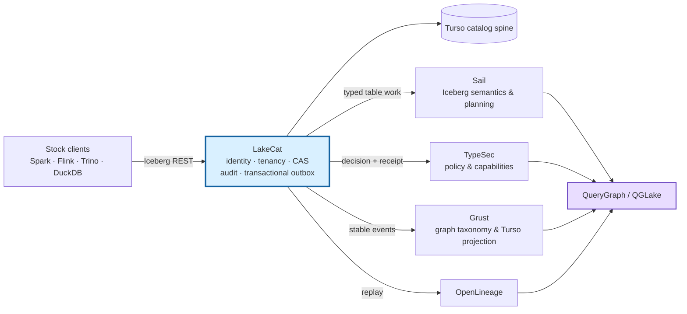
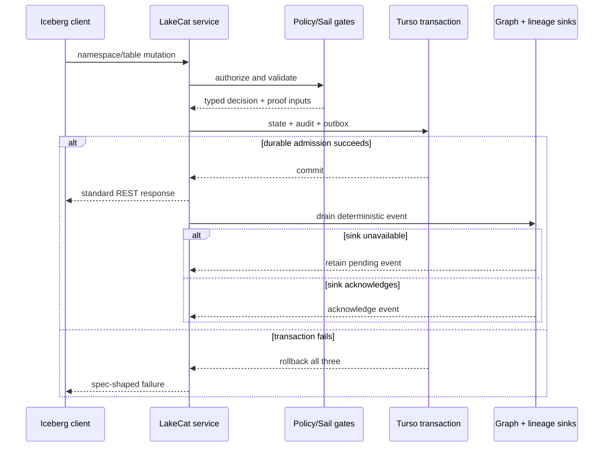
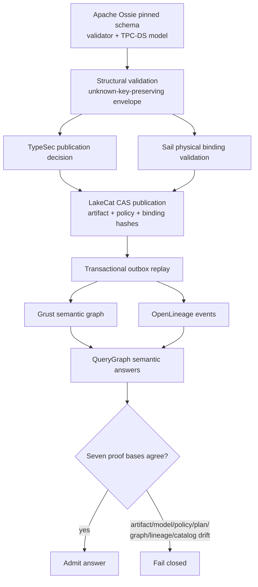
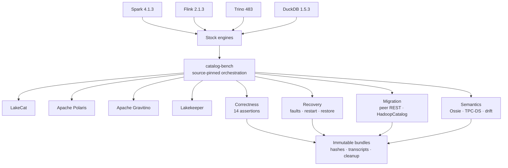

# Introduction

The modern lakehouse rests on a useful separation of concerns. An open table
format describes durable table state in object storage; many compute engines
interpret that state; and a catalog coordinates names and the current metadata
pointer. Apache Iceberg makes the table state explicit and provides optimistic
concurrency, schema and partition evolution, snapshots, branches, and tags.
Its REST Catalog protocol then gives languages and engines a shared catalog API
rather than requiring one client implementation for every catalog backend [1].

That apparently narrow service now sits at a much wider systems boundary. A
catalog receives concurrent mutations from mutually independent engines. It is
asked to authenticate tenants, vend or constrain storage access, survive
ambiguous network outcomes, support migration, emit lineage, feed discovery
graphs, and govern semantic definitions consumed by business intelligence and
AI systems. Expanding the catalog to implement all of these domains locally is
tempting, but it couples protocol compatibility to policy, planning, graph,
and semantic-model evolution. Conversely, treating the catalog as a simple
key-value map leaves no durable place to bind a decision, state transition, and
integration evidence.

LakeCat explores a third design point: a *thin but evidence-bearing catalog
foundation*. The boundary is thin in semantic ownership, not in correctness.
LakeCat owns those facts that only the catalog can authoritatively establish:
tenant-scoped identity, namespace and table state, metadata-pointer
compare-and-swap (CAS), standard REST behavior, idempotency, audit admission,
and durable integration events. Domain implementations remain in reusable
components. Sail owns Iceberg format interpretation and scan planning; TypeSec
owns policy composition and signed decisions; Grust owns graph taxonomy and
projection; QueryGraph owns end-to-end semantic composition.

This work makes four contributions:

1. **A compatibility-preserving decomposition.** LakeCat exposes standard
   Iceberg REST behavior while placing planning, governance, and graph logic
   behind typed traits. Business semantics are derived control-plane data and
   never become required custom Iceberg metadata.
2. **A durable evidence boundary.** Catalog state, redacted audit evidence,
   and deterministic outbox events are admitted transactionally. External
   graph and lineage delivery is replayable and explicitly at least once.
3. **An Apache Ossie semantic supply chain.** A pinned upstream semantic model
   is validated, bound to physical Iceberg state and policy decisions,
   published by CAS, projected, and checked against seven proof bases before
   semantic answers are accepted.
4. **A neutral catalog evaluation method.** catalog-bench compares LakeCat,
   Apache Polaris, Apache Gravitino, and Lakekeeper with stock clients, shared
   assertions, immutable evidence bundles, fault campaigns, migration, and
   semantic drift tests. It intentionally separates correctness observations
   from performance claims.

The implementation and evaluation described here correspond to LakeCat 0.3.0
and the catalog-community evidence published on August 28, 2026. Versions and
commit identities are recorded with each artifact rather than inferred from a
floating container tag.

# Background and Related Work

## From metastores to a common REST boundary

Traditional analytical catalogs grew around engine-specific metastores. The
Hive Metastore's Thrift API became widely shared, but its data model and client
assumptions remain historically coupled to Hive. Iceberg instead places table
history and schema in versioned metadata files and uses the catalog to resolve
names and atomically replace a table's current metadata pointer. The Iceberg
REST protocol addresses the multiplicative integration problem: a client can
implement one protocol and interact with many conforming catalogs [1]. The
protocol also makes server-side conflict handling, retries, metadata upgrades,
credential vending or remote signing, and server-side planning possible.

Project Nessie emphasizes Git-inspired branching, cross-table visibility, and
transactional catalog semantics for Iceberg data [2]. Its design demonstrates
that a catalog can be more than a name service, although LakeCat does not claim
Nessie's Git-like multi-table version graph. LakeCat instead concentrates on a
small embedded/deployable catalog spine and proof-carrying integration seams.

## Contemporary open catalog systems

Apache Polaris describes itself as a fully featured open catalog for Iceberg
and implements the REST API for multiple engines [3]. Its current surface also
includes realms, policies, credential vending, federation, external policy
decision points, and multiple metastore options. Polaris represents a broad,
production-oriented Iceberg control plane.

Apache Gravitino describes a federated “metadata lake” spanning tabular,
file, messaging, and model assets [4]. It abstracts heterogeneous sources and
aims at geo-distributed metadata management and governance. Its scope is
therefore deliberately broader than a single table-format catalog.

Lakekeeper is, like LakeCat, Rust-native and presents a standards-oriented
Iceberg REST catalog [5]. It emphasizes secure multi-warehouse operation,
storage integrations, management APIs, and operational usability.

These systems are not interchangeable products with one scalar notion of
quality. They occupy different scope points: Polaris provides an extensive
Iceberg catalog and management plane; Gravitino federates multiple metadata
classes; Lakekeeper provides an operational Rust catalog; and LakeCat is a
foundation engineered to compose with the QueryGraph stack. The evaluation in
this paper therefore tests shared behaviors and reports scoped differences. It
does not collapse architecture, deployment maturity, feature breadth, or
throughput into a league table.

| System | Primary stated scope | Distinctive comparison dimension | This paper's shared boundary |
|---|---|---|---|
| LakeCat | Thin Iceberg-compatible foundation for QueryGraph | Typed delegation, transactional evidence, governed planning | Iceberg REST, recovery, migration, semantics |
| Apache Polaris | Full-featured open Iceberg catalog | Management plane, policy, federation, credential vending | Same stock client workloads and selected recovery paths |
| Apache Gravitino | Federated metadata lake | Multi-source and multi-asset metadata abstraction | Iceberg catalog profile in the common harness |
| Lakekeeper | Rust Iceberg REST catalog | Operational warehouses, security, storage integrations | Same protocol-native engine and recovery profiles |
| Project Nessie | Transactional catalog with Git-like semantics | Branches, merges, cross-table versioning | Related-work context; not in the reported four-way run |

## Semantics and lineage

Table catalogs answer *which physical table version is current*; semantic
models answer *what a measure, relationship, or business concept means*.
Apache Ossie (formerly Open Semantic Interchange) is an incubating Apache
effort to exchange semantic metadata across analytics, AI, and BI systems with
a vendor-neutral JSON/YAML specification [6]. Its repository includes a
machine-readable schema, validators, converters, and a TPC-DS example. Ossie
addresses semantic portability, but a schema-valid document alone does not
prove that referenced physical fields exist, that a principal may use a
metric, or that the projected graph and runtime lineage correspond to the
published artifact.

OpenLineage defines an extensible event model around datasets, jobs, and runs
[7]. It is complementary to catalog state: lineage records execution and
movement, whereas a catalog admits metadata transitions. LakeCat connects the
two through a transactional outbox rather than making an external lineage
service part of the catalog's commit transaction.

# Design Principles

LakeCat is guided by six principles.

**Protocol fidelity precedes extensions.** Ordinary Iceberg clients must not
need non-standard endpoints for table access. Errors, namespace encoding,
pagination, requirement validation, commits, registration, views, and metadata
pointer behavior remain spec-shaped.

**Iceberg metadata stays pristine.** Policy, graph, lineage, semantic-model,
and agent state are derived control-plane records. A table remains readable by
standard tools that know nothing about QueryGraph.

**The catalog owns admission, not every domain.** LakeCat asks a policy engine
for a decision and persists a receipt; it does not invent a second policy
language. It asks Sail to interpret Iceberg and Grust to project graphs.

**Durable side effects are replayed.** A table mutation must not disappear
because a graph or lineage endpoint is down, and an external sink must not be
allowed to block the authoritative catalog transaction indefinitely.

**Credentials are exceptional evidence.** Governed Sail-planned reads are the
default for agents and untrusted principals. Raw credential vending is a
deliberate audited exception.

**Claims must be reproducible and bounded.** Every comparison binds source
versions, client versions, configuration, assertions, transcripts, hashes,
and cleanup. Passing a behavioral workload is not presented as a throughput or
production-availability result.

# Architecture

*Figure 1. LakeCat keeps the catalog's authoritative state boundary narrow and
composes domain-owned services through typed seams.*

LakeCat is a Rust workspace organized around existing trait seams:
`CatalogStore`, `SailCatalogEngine`, `GovernanceEngine`, `CatalogGraphSink`, and
`LineageSink`. Defaults remain safe for embedded tests; real integrations are
activated by explicit feature gates. The principal components are as follows.

## Catalog spine

The `CatalogStore` maintains tenant-scoped namespaces, tables, views,
metadata pointers, policy bindings, idempotency records, audit entries, and
outbox rows. LakeCat prefers the Rust `turso` crate for its durable local
spine, while an in-memory implementation supports deterministic unit and
integration tests. Namespace identity is component-safe: wire-level multipart
names are preserved, and durable scope uses a versioned length-prefixed key
rather than ambiguous dot joining.

Table commits validate Iceberg requirements and updates before mutation. The
store applies optimistic concurrency to the authoritative pointer and stages
state transitions so a failed validation or transaction cannot partially
mutate memory or durable state. Initial metadata writes are create-only.
Failed commits retry cleanup of an uncommitted metadata object while retaining
the original CAS or store error as authoritative.

## Sail: reusable Iceberg behavior

Sail owns reusable format behavior: metadata models, manifest and metric
interpretation, pruning, scan planning, delete handling, and
metadata-as-data. LakeCat consumes Sail through a catalog engine interface.
This prevents the REST service from developing a second Iceberg
implementation. It also allows a governed scan capability to be carried from
the HTTP admission point into planning and task fetch without silently
reauthorizing reconstructed context.

## TypeSec: decisions and receipts

The governance boundary accepts catalog and read context and returns typed
decisions or signed proofs. TypeSec owns policy composition, capabilities,
ODRL-derived restrictions, TypeDID envelopes, and authorization semantics.
LakeCat records the receipt and the hashes needed to connect the decision to
the admitted state transition. Malformed active restrictions fail before Sail,
credential issuer, graph, or lineage side effects.

## Grust and OpenLineage: derived projections

Grust owns graph schema, taxonomy, stable identity, Turso persistence,
traversal, and Cypher behavior. LakeCat emits catalog-facing events to this
boundary but does not implement a graph database. OpenLineage receives
corresponding replayed events for interoperable execution metadata. Stable
event identifiers and content hashes make retries observable and testable.

## QueryGraph as acceptance boundary

QueryGraph composes the catalog, Sail, TypeSec, Grust, OpenLineage, and semantic
interchange formats. Its QGLake workflow independently verifies handoff hashes,
replays events, imports the graph, and checks proof-chain continuity. This
end-to-end target prevents a component-local “pass” from standing in for a
working stack.

# Transactional Evidence and Recovery

*Figure 2. A catalog mutation admits state, audit, and outbox atomically;
external projections are acknowledged after replay.*

For each governed mutation, LakeCat first authenticates and validates the
request. It evaluates policy and reusable Iceberg semantics before entering the
durable store transaction. The transaction writes three logically coupled
records: catalog state, a value-redacted audit record, and an outbox event. If
any write fails, all three roll back. Only then can a standard REST success
response be returned.

The outbox drain validates the outer event envelope, inner event type,
content-bound identifier, and sensitive location evidence before projection.
An unavailable sink leaves the event pending. Recovery replays identical
input; acknowledgement removes the backlog only after the sink accepts it.
This is an at-least-once contract. LakeCat does not claim distributed exactly
once, and sinks must tolerate deterministic duplicate delivery.

This design addresses a common ambiguous-outcome problem. A disconnected HTTP
client cannot infer whether an operation committed. Idempotency and exact retry
can reconcile requests within the advertised profile; durable audit/outbox
state lets operators and downstream systems reconstruct what the catalog
admitted. The benchmark distinguishes a request lost before upstream object
storage from an upstream success whose response was lost, service restart from
cold state restore, and catalog durability from object-store durability.

# Apache Ossie Integration

*Figure 3. The Ossie path binds a pinned semantic artifact to policy, physical
state, catalog CAS, graph, lineage, and answer evidence.*

LakeCat's Ossie integration treats the semantic document as an immutable
artifact, not custom table metadata. QueryGraph pins upstream commit
`1d9ebcea2932d3381c0840cc8304f0850d366509` and verifies the SHA-256 digests of
the schema, validator, and TPC-DS model before use. The upstream validator
checks the model. QueryGraph's envelope round-trips JSON and YAML without
discarding unknown keys, multiple models, extensions, or dialect expressions;
conversion loss is reported rather than normalized away.

The admission order is deliberately fail closed:

1. Validate document structure and supported Ossie version.
2. Obtain a TypeSec decision for publication or consumption.
3. Ask Sail to validate dataset fields, Iceberg types, nullability, and parsed
   expression inputs against physical tables.
4. CAS-publish an immutable pointer and hashes through LakeCat, binding the
   artifact, physical mapping, policy, publisher, and monotonic version.
5. Transactionally admit audit and outbox state with the publication.
6. Replay the stable semantic taxonomy into Grust and the correlated activity
   into OpenLineage.
7. Admit a semantic answer only when the required proof bases agree.

The TPC-DS evaluation binds seven proof bases: physical data, model, artifact,
policy, plan, graph, and lineage. It then independently perturbs artifact,
model, policy, plan, graph, and lineage identity. All six drift dimensions are
rejected. A stale publication CAS, missing policy reference, schema drift, or
unknown Ossie version produces neither catalog promotion nor downstream
projection.

This separation yields a useful interoperability property. Ossie remains a
portable upstream document; Sail remains the authority for physical Iceberg
compatibility; TypeSec remains the authority for permission; LakeCat remains
the authority for publication order; and Grust/OpenLineage remain derived
views. No one component silently redefines the others' schema.

The evaluation also ran the upstream Apache Polaris Ossie converter on the
live TPC-DS model. That path is labeled `verified-with-loss`, not lossless. A
machine-readable loss report is part of the evidence, motivating a proposed
converter report contract that makes unsupported or transformed constructs
explicit. Converter success without semantic-loss accounting would be an
insufficient interoperability claim.

# catalog-bench Methodology

*Figure 4. catalog-bench separates stock-engine correctness, recovery,
migration, and semantic evidence while retaining one immutable artifact
discipline.*

catalog-bench is maintained outside the LakeCat source tree under the
QueryGraph organization. This separation does not make it automatically
neutral, but it makes shared profiles, expected results, and catalog adapters
reviewable without embedding them in a system under test. Each run records
exact repository revisions, released engine/catalog versions, configuration,
assertions, raw transcripts, sanitization, cleanup, and SHA-256 indexes.

## Systems and clients

The completed stock-engine campaign used:

| Layer | Pinned versions in the accepted runs |
|---|---|
| Catalogs | LakeCat source revisions per fix; Apache Polaris 1.7.0; Apache Gravitino 1.3.0; Lakekeeper 0.13.3 |
| Engines | Spark 4.1.3; Flink 2.1.3; Trino 483; DuckDB 1.5.3 |
| Iceberg runtime | 1.11.0 for Spark, Flink, and Trino |
| Storage | Shared run-isolated MinIO object storage |
| Semantic fixture | Pinned Apache Ossie TPC-DS model and stock Spark physical run |

Stock means that each engine uses its released Iceberg REST integration rather
than a LakeCat-specific client shim. Catalog-specific deployment and
authentication configuration remain necessary and are disclosed. All catalog
instances receive isolated state, and cleanup is asserted.

## Workload and assertions

The common engine workload exercises namespace and table creation, writes,
reads, schema evolution, partition evolution where supported by the path,
independent state inspection, response sanitization, and cleanup. Fourteen
required assertions are evaluated per catalog/engine combination. The harness
does not treat an HTTP 2xx alone as correctness: independent reads and metadata
inspection confirm the resulting table state.

The recovery campaign adds deterministic object/network faults, response loss,
mid-request service restart, transactional outbox outage and replay, and cold
restore from run-owned persistent volumes. Migration campaigns use stock
PyIceberg to register exact metadata pointers in both directions between
LakeCat and Polaris and between LakeCat and Lakekeeper. A separate stock Spark
HadoopCatalog workload evolves snapshots, partition specs, and refs before
registering the exact pointer in LakeCat.

## Claim discipline

The benchmark is an *unranked correctness matrix*. It does not report QPS,
latency percentiles, resource efficiency, or a winner. The TPC-DS fixture is
used to create realistic physical and semantic structure, not to claim an
audited TPC-DS result. The TPC organization requires specific disclosure and
fair-use conditions for compliant results [8]; the present experiment neither
runs nor names itself as such a performance result.

# Results

## Stock-engine interoperability

All four catalogs passed all 14 required assertions under each of the four
accepted stock-engine profiles. Thus the Phase 2 matrix contains 16 successful
catalog-engine cells and 224 passing required assertions. This result supports
the bounded claim that the tested versions interoperated for the exercised
write/read/evolution lifecycle. It does not establish complete REST endpoint
coverage or production equivalence.

The campaign was also diagnostically productive. Spark exposed catalog-owned
field-ID and multipart namespace behavior. Trino exercised default warehouse
location construction and bounded gzip metadata. DuckDB exposed staged table
creation and spec-correct update decoding, including partition-spec updates.
Fixes were made at their ownership boundary—LakeCat for REST/catalog behavior
and Sail for reusable Iceberg update semantics—without adding client-specific
wire shims.

## Recovery and migration

The fault proxy distinguished a signed metadata upload disconnected before
upstream from an upstream 200 whose response was disconnected: the former left
no object, while the latter left the object present. Under the benchmark's
ephemeral deployments, LakeCat, Gravitino, and Lakekeeper preserved the
fixture across a real mid-request restart and accepted exact retry; the
no-volume Polaris topology lost it. The same limitation appeared in cold
restore. This is a finding about the disclosed benchmark configuration, not a
claim about Polaris with a production metastore.

LakeCat's durable test rolled back paired audit/outbox admission on injected
failure. During a real sink outage it retained one pending event, replayed
stable lineage input and graph event identity after recovery, acknowledged it
once, and emptied the backlog.

Bidirectional pointer migration between LakeCat and Polaris and between
LakeCat and Lakekeeper preserved all compared Iceberg semantics, a non-empty
snapshot and ref, the exact metadata pointer, and an exact three-row scan. The
HadoopCatalog cookbook likewise preserved two snapshots, two partition specs,
two refs, and the same three rows after registration. These tests move catalog
identity by pointer registration; they do not prove physical object copying,
dual-writer federation, or arbitrary legacy metastore migration.

## Semantic evaluation

The Phase 5 run created physical fixtures with stock Spark, policy-bound and
CAS-published the pinned Ossie model, drained graph and OpenLineage replay,
evaluated five representative semantic answers, and bound each to the seven
proof bases. The six independent drift injections were all rejected. The run
admitted 26 lineage events and LakeCat and QueryGraph independently computed
the same aggregate OpenLineage hash in the governed QGLake path.

The result demonstrates a stronger property than schema-valid semantic
exchange: a semantic answer can be connected to immutable model content,
physical table state, policy, plan, derived graph, runtime lineage, and catalog
publication. It does not establish that all Ossie constructs or all TPC-DS
queries are implemented. Five answers were selected as representative proof
cases, and the Polaris converter path disclosed conversion loss.

| Evaluation slice | Accepted observation | Explicit non-claim |
|---|---|---|
| Spark/Flink/Trino/DuckDB × four catalogs | Every tested cell passed 14 common assertions | Complete protocol conformance or performance rank |
| Ambiguous object write | Before-upstream loss differs from after-upstream response loss | Universal cloud-storage failure model |
| Restart and cold restore | Persistence followed configured durable volumes | Production disaster-recovery SLA |
| Outbox outage | Pending event survived and replayed with stable identity | Distributed exactly-once delivery |
| Peer and Hadoop migration | Exact pointers and compared scans/semantics preserved | Data copying, federation, every legacy catalog |
| Ossie/TPC-DS proof | Five answers bound seven bases; six drift classes rejected | Full Ossie coverage or compliant TPC-DS result |

# Discussion

## Why a thin catalog can carry strong guarantees

“Thin” can be mistaken for stateless or weak. LakeCat's design suggests a more
useful definition: minimize *domain ownership* while strengthening
*coordination ownership*. The catalog does not need to parse every manifest,
implement a graph engine, or define a policy calculus. It does need to ensure
that the decision, state transition, and integration intent are admitted in a
consistent order. Typed seams and durable hashes make that coordination
auditable without contaminating Iceberg metadata.

## Comparison as multidimensional evidence

A catalog comparison is most useful when it preserves dimensions rather than
manufacturing a total order. Protocol behavior, engine interoperability,
deployment persistence, migration, policy breadth, asset breadth, recovery,
and semantic integration answer different questions. The shared harness makes
common behaviors visible; project-native documentation describes capabilities
outside that intersection. This structure can absorb future catalogs and
profiles without changing historical evidence.

## Catalog tasks beyond CRUD and throughput

The work identifies widely useful catalog evaluation tasks:

- ambiguous-commit reconciliation and idempotent retry;
- exact metadata-pointer import/export and no-copy migration;
- backup/restore and persistence-topology disclosure;
- namespace encoding, pagination, and error-envelope compatibility;
- concurrent CAS conflict and orphan-object cleanup;
- credential and error sanitization;
- transactional audit/outbox durability and replay;
- policy-bound server-side scan planning;
- view and branch/tag lifecycle conformance;
- semantic-model publication, converter loss reporting, and drift rejection;
- OpenLineage correlation and independent evidence hashing;
- stock-client matrices across Java, Python, Rust, and native engine stacks.

These tasks complement microbenchmarks. They are particularly relevant to
catalogs because many costly failures are rare state-transition errors rather
than steady-state throughput limitations.

# Threats to Validity and Limitations

**Selection bias.** The harness and LakeCat are developed in the same broader
community. Public profiles, raw transcripts, immutable hashes, and maintainer
review issues reduce but do not eliminate bias. External reproduction and
correction remain important.

**Version specificity.** Results apply to the recorded releases and source
revisions. Catalog and engine behavior changes quickly. A later run must create
a new bundle rather than rewriting accepted evidence.

**Deployment realism.** The benchmark uses containerized, run-isolated local
deployments and shared MinIO. This gives control and reproducibility but does
not model multi-region latency, managed identity, production databases, or
cloud-provider failure distributions. In particular, the observed Polaris
persistence behavior is explicitly a no-volume topology observation.

**Coverage.** Four engines and four catalogs provide useful diversity but do
not cover every REST client, endpoint, authentication flow, or table feature.
Nessie, vendor-managed catalogs, Hive-compatible systems, and emerging
multi-format catalogs warrant future profiles.

**Semantic scope.** The Ossie experiment evaluates a pinned, evolving upstream
revision and five semantic answers. It proves the composition path and drift
controls, not universal semantic equivalence among BI tools. Converter loss
must continue to be treated as data.

**Performance.** No latency, throughput, cost, or scalability conclusion can
be drawn. A future performance study would require equivalent durable
configurations, resource accounting, warmup, statistical treatment, and
project review independent of the correctness matrix.

# Reproducibility and Community Process

The accepted 2026-Q3 release packet contains a cross-bundle SHA-256 index,
reproduction guide, demonstration guide, known-gaps page, Ossie converter
report-contract proposal, and feedback backlog. Public review opportunities
were opened for LakeCat, Apache Polaris, Apache Gravitino, and Lakekeeper.
Opening an issue is evidence of an opportunity to review, not maintainer
endorsement.

Historical bundles are immutable. Corrections are published as a new feedback
or evidence version with source URLs; they do not silently alter earlier
claims. This is essential for a benchmark whose purpose is not merely to run
software but to make the scope and provenance of a systems claim inspectable.

# Future Work

Several extensions follow naturally. First, catalog-bench should add a
separately pinned stock-engine OpenLineage emitter and prove that its run
identity crosses the same admission and replay boundary. Second, performance
evaluation can be added as a distinct campaign once durable configurations and
resource equivalence are reviewed; it should not reuse correctness outcomes as
performance evidence. Third, Nessie and additional REST catalogs can join the
behavioral matrix, while Gravitino-specific multi-asset and Polaris-specific
federation profiles can expose capabilities outside the common denominator.

Fourth, migration should expand from metadata-pointer registration to
inventory reconciliation, physical copying, and controlled writer cutover.
Fifth, backup and disaster-recovery experiments should use supported
production backends and published recovery objectives. Sixth, Ossie work
should cover more expressions, dialect translations, metrics, relationships,
and converter round trips, with standardized loss reports. Finally, Apache
Iceberg version 4 support should move into typed Sail APIs after formal
specification adoption; JSON passthrough remains an explicit compatibility
bridge rather than the desired endpoint.

# Conclusion

LakeCat demonstrates that an Iceberg catalog can remain protocol-compatible
and architecturally thin while carrying durable evidence for governance,
recovery, graph projection, lineage, and semantic publication. Its central
idea is disciplined ownership: LakeCat coordinates identities and transitions;
Sail interprets Iceberg; TypeSec decides; Grust projects; QueryGraph composes.
The transactional outbox turns external effects into replayable intent, and
the Ossie pipeline connects portable semantics to physical and policy proof
without modifying Iceberg metadata.

The catalog-bench results provide bounded evidence across four stock engines
and four catalogs, then extend comparison into faults, restore, migration, and
semantic drift. Equally important, the method states what it does not prove.
For an ecosystem built from independently evolving open components, explicit
boundaries—of software and of claims—are themselves a systems contribution.

# References {.unnumbered}

[1] Apache Iceberg. “REST Catalog Spec.” Apache Software Foundation, 2026.
<https://iceberg.apache.org/rest-catalog-spec/>.

[2] Project Nessie. “Transactional Catalog for Data Lakes with Git-like
Semantics.” 2026. <https://projectnessie.org/>.

[3] Apache Polaris. “Apache Polaris Documentation,” version 1.7.0. Apache
Software Foundation, 2026. <https://polaris.apache.org/docs/>.

[4] Apache Gravitino. “Overview: A Federated Metadata Lake.” Apache Software
Foundation, 2026. <https://gravitino.apache.org/>.

[5] Lakekeeper. “Apache Iceberg REST Catalog Written in Rust,” version 0.13.3
used in the evaluation. 2026. <https://docs.lakekeeper.io/>.

[6] Apache Ossie (incubating). “Vendor-Neutral Semantic Model
Interchange.” Apache Software Foundation, 2026.
<https://github.com/apache/ossie>.

[7] OpenLineage. “About OpenLineage and the Extensible Job, Run, and Dataset
Event Model.” 2026. <https://openlineage.io/docs/>.

[8] Transaction Processing Performance Council. “TPC Current Specifications:
TPC-DS 4.0.0.” 2026.
<https://tpc.org/TPC_Documents_Current_Versions/current_specifications5.asp>.

[9] Apache Iceberg. “Catalog Properties,” Iceberg 1.11.0 documentation. 2026.
<https://iceberg.apache.org/docs/latest/catalog-properties/>.

[10] QueryGraph Project. “catalog-bench 2026-Q3 Community Evidence Index.”
Commit `285415d`, 2026. <https://github.com/querygraph/catalog-bench>.

[11] QueryGraph Project. “LakeCat: Rust-Native Iceberg-Compatible Catalog
Foundation.” Version 0.3.0, 2026. <https://github.com/querygraph/lakecat>.
