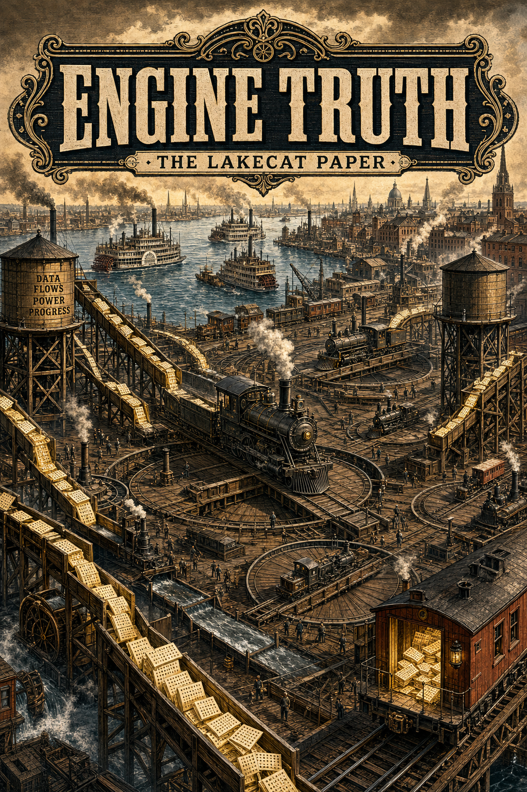

# Getting Out of the Way

## Engine Truth, Typed Governance, and the Thin Catalog

### LakeCat, TypeSec, Grust, and a Responsible Semantic Layer under Adversarial Evaluation

Alexy Khrabrov 
QueryGraph Project 
August 2026
