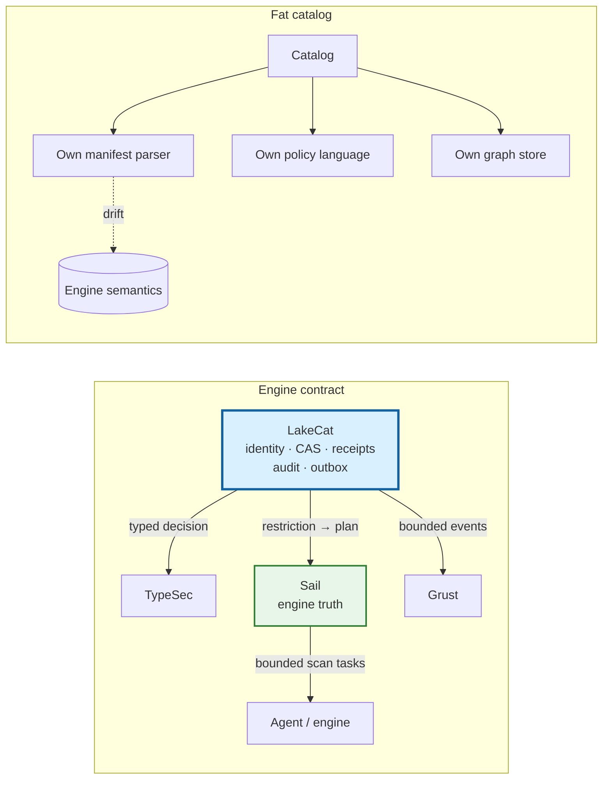
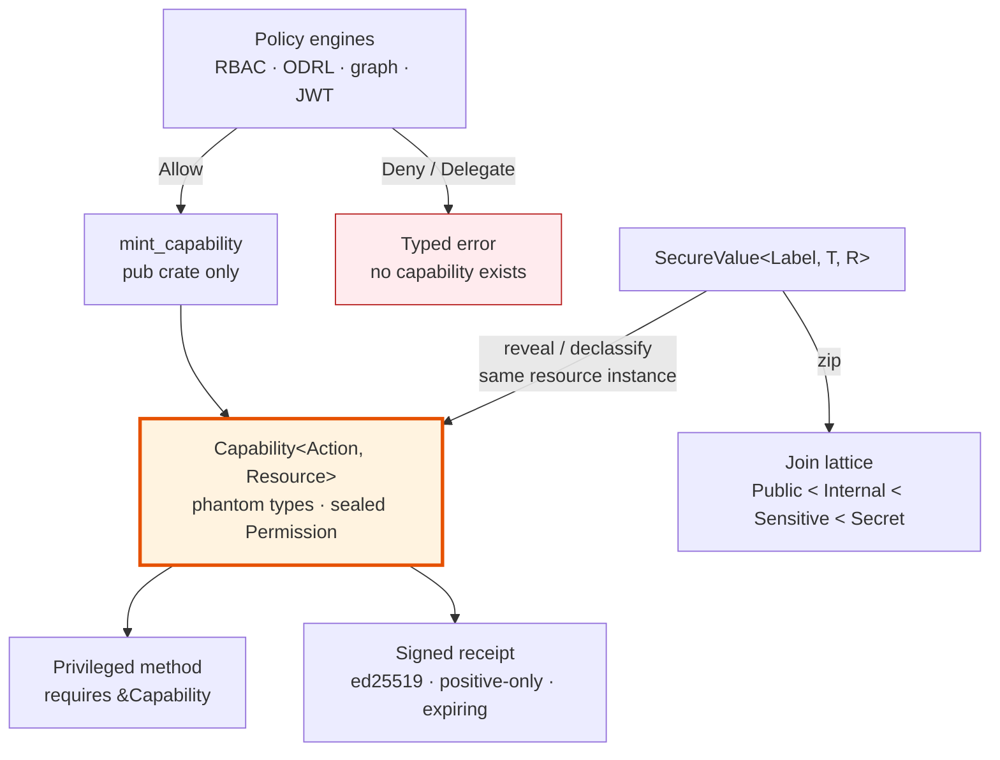
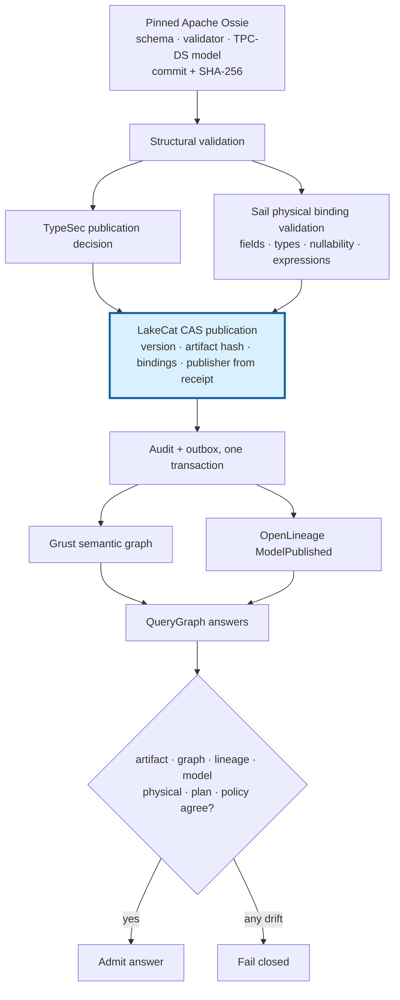
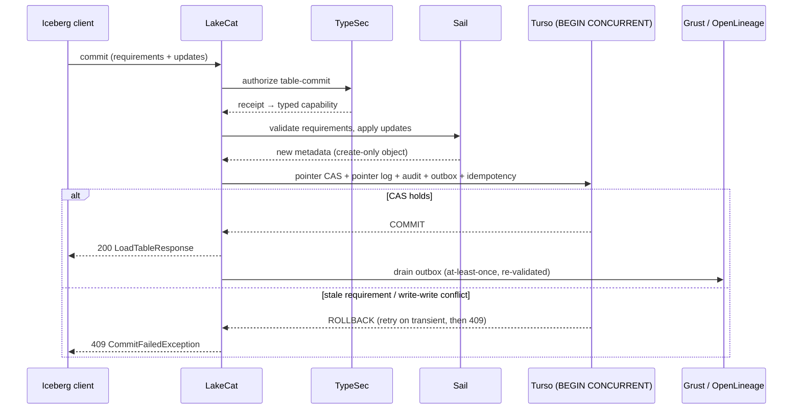
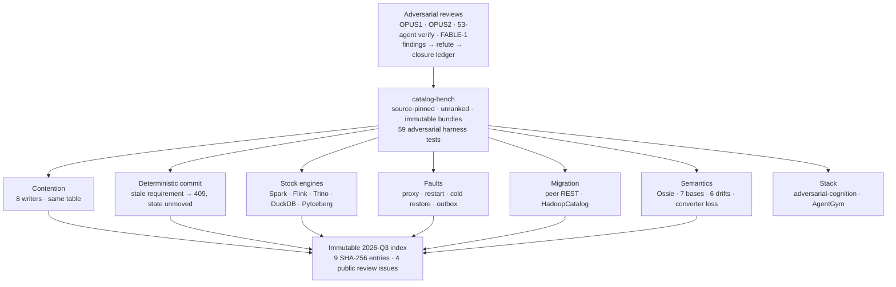

# Introduction

The open lakehouse rests on a separation that has proved durable: a table
format describes state in object storage, many engines interpret that state,
and a catalog resolves names to the current metadata pointer [1, 2]. Apache
Iceberg made the table side of that separation precise—snapshots, manifests,
schema and partition evolution, optimistic commits—and its REST Catalog
protocol made the catalog side portable, so that one client implementation can
speak to many catalogs [3].

The catalog's job description has since expanded faster than its design. It is
now asked to authenticate tenants, decide what a principal may see, vend or
withhold storage credentials, survive ambiguous network outcomes, emit lineage,
feed discovery graphs, and increasingly to govern the business definitions that
BI tools and AI agents consume. Three responses are common, and each is a
failure of boundary rather than of effort.

The first is the *fat catalog*: implement everything locally. The catalog
parses manifests to estimate what a policy permits, evaluates policies in a
language of its own, maintains its own graph store, and interprets semantic
models. Each parser looks cheaper than an engine call; collectively they become
a second Iceberg implementation with weaker tests, fewer execution users, and
quiet drift from the planner that actually reads the data.

The second is the *dumb catalog*: a name-to-pointer map with an access-control
list in front. It is easy to make compatible and impossible to make
trustworthy. It can check a policy before access but cannot carry the
restriction *into* the scan; it can vend credentials but cannot prove why a
broad credential was justified; and it produces lineage as an after-the-fact
side effect that need not correspond to what was committed.

The third is *sidecar governance*: a policy decision point beside the catalog,
consulted by convention. The decision is a boolean returned to code that must
remember to ask. As the TypeSec authors put it, such a system "is only as
strong as its most forgetful call site" [4].

This paper reports a fourth design point and the evidence behind it. LakeCat
[5] is a Rust-native Iceberg REST catalog foundation for QueryGraph [6] built on
one discipline: **the catalog gets out of the way**. It owns exactly the facts
only a catalog can establish—tenant-scoped identity, namespace and table state,
the compare-and-swap (CAS) of the metadata pointer, idempotency, audit
admission, and durable integration events—and binds every proof it records to
truth established elsewhere:

- **Engine truth.** Sail [7], a Rust lakehouse engine, is the only authority on
  what an Iceberg table *means*: field-id projection, manifest pruning, delete
  visibility, scan tasks, commit validation. The catalog never reimplements the
  format; it binds its receipts to the engine's plan.
- **Typed governance.** TypeSec [4] decides. It encodes permissions as
  unforgeable Rust types: a privileged operation takes a `Capability<Action,
  Resource>` that only a policy check can mint, so the "forgotten check" is a
  compile error rather than an incident.
- **A graph substrate.** Grust [8] owns graph taxonomy, stable identity,
  traversal, and Cypher over durable stores; the catalog only emits bounded
  events through a sink.
- **A Responsible Semantic Layer.** QueryGraph composes Croissant, CDIF, ODRL,
  DIDs, OpenLineage, and Apache Ossie semantic models above the catalog; the
  catalog stores only immutable publication pointers, versions, and bindings.

The paper makes four contributions. First, it states *engine truth* and the
*engine contract* as design principles and shows the concrete mechanisms that
honor them (§3, §7). Second, it explains TypeSec, Grust, and the Responsible
Semantic Layer from first principles—information-flow lattices, capability
systems, property-graph query languages, OLAP semantic models—and argues why
composing them *at the catalog* delivers governance that earlier catalog
designs could only promise (§2, §4–§6). Third, it documents an adversarial
development method: successive multi-agent adversarial reviews whose findings
are tracked to closure, and a neutral, source-pinned, unranked benchmark
harness whose fault-injection, contention, restore, migration, and semantic
drift campaigns were run against four peer catalogs with stock engines (§8).
Fourth, it reports what remains open, including governance findings the reviews
confirmed and the current release has not yet closed (§9).

The implementation corresponds to LakeCat 0.3.0 ("Ocelot", July 2026) with the
catalog-community work through August 28, 2026; TypeSec 0.12–0.13; Grust 0.12;
QueryGraph 0.4; and the `querygraph/catalog-bench` evidence bundles cited in
§8. All version and commit identities are recorded with each artifact.

# Prior Work, from First Principles

## The catalog as a coordination boundary

The Hive Metastore gave analytical systems a shared Thrift API for table
metadata, but its data model coupled the catalog to Hive's notion of a table and
made atomic multi-file commits an exercise in convention [9]. Iceberg inverted
the responsibility: table state lives in versioned, immutable metadata files,
and the catalog's sole atomic act is to move a table's *current metadata
pointer* under an optimistic requirement [2, 3]. This is Kung and Robinson's
optimistic concurrency control [10] applied at the granularity of a table: the
committer states the state it planned against, and the catalog accepts the new
pointer only if the requirement still holds. Delta Lake reached a similar
position through an ordered log of JSON actions with a single mutual-exclusion
point [11]; the lakehouse argument generalizes both [1].

Because the pointer is the only thing the catalog must move atomically, the
catalog's *coordination* responsibility is small and precise, while its
*domain* responsibilities—policy, planning, lineage, semantics—are large and
open-ended. The systems that followed took different positions on that ratio.
Project Nessie added Git-like branching and cross-table transactions to the
pointer store [12]. Apache Polaris became a broad Iceberg control plane with
realms, policies, credential vending, and federation [13]. Apache Gravitino
federates tabular, file, messaging, and model metadata into a "metadata lake"
[14]. Lakekeeper, like LakeCat Rust-native, emphasizes multi-warehouse
operation, storage integration, and management APIs [15]. Databricks' Unity
Catalog, open-sourced in 2024, spans tables, models, and functions with its own
governance model [16]. These are not interchangeable products; they occupy
different points on the domain-ownership axis. LakeCat's position is the
minimal one on that axis and, we will argue, the maximal one on the
*evidence* axis.

## Governance: from access-control lists to types

Authorization in data systems descends from two traditions. The first is the
access matrix and its row and column decompositions—ACLs and capabilities—that
Lampson and Dennis and Van Horn articulated in the 1960s and 70s [17, 18]. The
second is information-flow control: Denning's lattice model, in which every
datum carries a label from a partially ordered set and information may flow
only upward in the lattice [19]; Myers and Liskov's decentralized label model,
which let principals own and declassify labels [20]; and language-based
enforcement, surveyed by Sabelfeld and Myers, in which the type checker rather
than a runtime monitor establishes noninterference [21]. Russo, Claessen, and
Hughes showed the discipline could be a *library*: SecLib wraps values in a
`Sec s a` container whose label is a type parameter and whose escape requires
an explicit, typed authority [22]; LIO extended the idea to a monadic, dynamic
variant [23].

Policy engines took a different path. XACML standardized attribute-based
decisions with combining algorithms such as deny-overrides [24]; Open Policy
Agent generalized the decision service [25]; Google's Zanzibar showed
relationship-based authorization at planetary scale [26]; Amazon's Cedar
brought a verified, analyzable policy language [27]. Bearer-token capability
systems—Macaroons [28], Biscuit [29]—made a decision portable and attenuable
across process boundaries. The W3C's ODRL provides a machine-readable rights
vocabulary of permissions, prohibitions, and constraints [30]; Decentralized
Identifiers give principals self-certifying, key-bound identity [31].

What the policy-engine tradition returns to the application is a boolean, or a
token that the application must remember to check. What the information-flow
tradition returns is a *type* that the compiler checks on every path. TypeSec
[4] is, as its authors record, a direct descendant of SecLib by way of
Andrzejewski's 2018 work on privacy-aware data science with type-level
programming [32]: it brings the SecLib move to Rust, where phantom types,
sealed traits, and crate-private constructors make the container unforgeable
[33, 34], and it composes runtime engines (RBAC, ODRL, graph, JWT-claims)
behind a single `PolicyEngine` contract whose only positive output is such a
type. Section 4 develops this from first principles.

## Graphs of metadata and lineage

Catalog facts form a graph: warehouses contain namespaces, namespaces contain
tables, tables have columns, snapshots, commits, policies, and lineage runs.
Enterprise metadata systems have modeled this explicitly—Google's Goods
inferred a dataset graph across the company [35]; Apache Atlas, DataHub, and
Amundsen expose graph-shaped discovery and lineage [36]. The property-graph
data model and its query languages matured in parallel: Cypher [37], the
foundations Angles et al. surveyed [38], and in 2024 the ISO/IEC 39075 GQL
standard [39] with SQL/PGQ as its relational sibling [40]. OpenLineage
standardized the run/job/dataset event model for execution lineage [41].

The design question for a catalog is not whether such a graph is useful but
*who owns it*. A catalog that embeds a graph database inherits a query
language, a storage engine, and a schema-evolution problem. Grust [8] answers
by separating graph *construction* from graph *querying*: a small,
backend-neutral Rust model of labeled nodes, labeled edges, and typed
properties, a traversal expressed as a serializable IR rather than a query
string, an async `GraphStore` trait, and a Cypher/GQL layer implemented once
over that trait. The catalog builds a `Graph`; a backend decides how to persist
or query it (§5).

## Semantic layers

The semantic layer is older than its current name. Codd's OLAP manifesto and
Kimball's dimensional modeling separated *what a measure means* from *how a
table is stored* [42, 43]; MDX and cube servers made the separation
executable. A second generation embedded the layer in BI tools and
transformation frameworks—LookML, dbt's MetricFlow, Cube, AtScale, Malloy—each
with its own dialect. The Open Semantic Interchange initiative, founded in 2025
by Snowflake, Salesforce, dbt Labs, and others, and now incubating at Apache as
Ossie, proposes a vendor-neutral JSON/YAML model with a machine-readable
schema, validators, converters, and a TPC-DS example [44].

A schema-valid semantic document is a portable *claim*: that a metric is
defined by an expression over named fields. It is not evidence that the fields
exist in the physical table, that the principal may use the metric, that the
plan an engine executed corresponds to the expression, or that the graph and
lineage projections downstream correspond to the published version. The gap
between semantic claim and physical, policy, and runtime evidence is the
subject of §6.

## Adversarial evaluation of storage systems

Distributed storage systems fail in rare state transitions rather than in
steady-state throughput, and the community's most consequential evaluation
work has been adversarial: Jepsen's partition-and-history checking [45]; Yuan
et al.'s finding that most catastrophic failures were triggered by unhandled
error paths that simple tests would have caught [46]; Gunawi et al.'s taxonomy
of cloud outages [47]; chaos engineering as a production discipline [48]. On
the benchmarking side, Gray's handbook [49], the TPC's fair-use rules [50], and
Raasveldt et al.'s catalogue of ways to mislead with database benchmarks [51]
argue for pinned configurations, disclosed environments, and separated claims.

The evaluation reported here (§8) follows both lines. Correctness and recovery
campaigns inject faults at exact points and verify state independently of the
client's response; the harness is *unranked*, records `pass`, `fail`,
`unsupported`, and `not-tested` as distinct outcomes, and treats performance
eligibility as a derived view rather than a fifth correctness result. It adds
one method that is newer: the *adversarial review*, in which parallel reviewers
generate findings that a second pass attempts to refute before any are
accepted, and every accepted finding is tracked to closure in later reviews.

# Engine Truth and the Engine Contract

## Definitions

LakeCat's documentation partitions every concept it uses into six categories,
and the test for placing a concept is stated once: *ask what breaks if a client
knows nothing about LakeCat* [5]. If a PySpark job cannot load, commit, or drop
a table without the concept, it belongs to standard compatibility; if PySpark
keeps working but operators, governed agents, or QueryGraph gain stronger
evidence, the concept is an additive surface. One of the six categories is
defined as follows:

> **Sail engine truth** — table-format interpretation, metadata-as-data, scan
> planning, commit validation, and typed v4 behavior. The catalog binds its
> proof to engine truth rather than reimplementing the format.

We restate this as a principle and derive its obligations.

**Engine truth.** Iceberg table state is not a set of easy strings. A claim
that "only these columns" may be read is meaningful only after it has been
mapped through field ids, nested schema evolution, aliases, and projection
rules. A claim that "only these rows" may be read is meaningful only after the
predicate has been bound by the same expression system that will plan the scan.
A claim that "these files" satisfy a scan is meaningful only after manifest
metrics, residual predicates, partition transforms, delete files, sequence
numbers, and snapshot context have been interpreted. The only component that
does all of this *and is exercised by real execution* is the engine. Engine
truth is therefore the principle that the interpretation of table state is
authoritative only in the engine that plans and executes, and that any other
component's statement about table content is a *binding* to that
interpretation, never a substitute for it.

**The engine contract** is the set of obligations a catalog accepts once it
adopts engine truth. We name it here because the components below discharge it
in different ways, and because it is the property the adversarial reviews
tested most directly.

1. *The catalog owns the transaction; the engine owns the table.* The catalog
   proves authority: `principal → tenant → warehouse → namespace → table`,
   `request → decision → current pointer → CAS/idempotency`, `accepted state →
   audit → outbox → replay admission`. The engine proves table work: `metadata
   → field ids → projection`, `metadata → manifests/statistics → pruning`,
   `metadata → deletes → row visibility`, `metadata → scan tasks / commit
   validation`. Neither proof is complete alone; the record binds them.
2. *Restrictions are compiled into the plan, not checked beside it.* A
   governance decision that narrows columns or rows must reach the engine as
   projection and mandatory filters before file tasks exist, and no later
   stateless step may widen it.
3. *Data is brought closer to the engine.* The proof-heavy path stays Rust to
   Rust in one process—no JVM sidecar, Python shim, or remote plugin in the hot
   path—and reusable read-path machinery such as an object-store cache lives in
   the engine, where every engine user benefits, rather than in the catalog.
4. *Fail closed when engine truth is unavailable.* A catalog build without the
   engine must refuse work it cannot interpret rather than accept it and hope.

## Consequences: getting out of the way

The most dangerous failure mode of a "smart" catalog is to become a partial
engine. It begins innocently—validate a schema here, expand a manifest list
there, peek at a `format-version` field—and ends with a shadow implementation
that is slower, less correct, and unreusable. The engine contract forbids the
first step.

The less obvious consequence is that a *passive* intermediary loses
information. A pass-through catalog sees the table name, the pointer, the
caller, and perhaps a credential request; the engine sees schema, manifests,
statistics, deletes, and filters; governance sees policy; lineage sees an
after-the-fact event. Each holds a shard of the truth, and the costs are
concrete: policy is checked before access but not carried into planning;
credentials are vended without a recorded reason for the exception; lineage
says something happened but cannot bind to the governed plan, snapshot, policy,
and metadata that produced it.

"Getting out of the way" therefore does not mean doing less. It means the
catalog stands *beside* the request rather than *in front of* the data. It
admits the request, obtains a typed decision, binds that decision to the
current pointer and identity, asks the engine to turn the restriction into
engine work, records the result, and steps aside. The stock client sees
ordinary Iceberg REST. The governed agent receives bounded work—Sail-planned
tasks with scope, TTL, projection, and predicate already bound—instead of broad
credentials. The operator receives a transaction log. QueryGraph receives
anchors it can accept as proof.



*Figure 1. A fat catalog drifts from engine semantics by reimplementing them; a
catalog under the engine contract binds its authority proof to the engine's
table proof and steps aside.*

## What the catalog keeps

The ownership rule, stated once in the LakeCat design and reproduced here,
fixes the boundary:

| Concern | Owner | LakeCat keeps only |
|---|---|---|
| Iceberg format, manifests, scan planning, pruning, delete handling, v4 | Sail | The call into Sail and the proof binding its result |
| Graph schema, taxonomy, traversal, stores, Cypher | Grust | The catalog-facing sink/projection boundary |
| Authorization, policy composition, capabilities, TypeDID, credential decisions | TypeSec | The request for a decision and the persisted receipt |
| Croissant/CDIF/OSI/ODRL/OpenLineage composition, agent workflows | QueryGraph | The governed bootstrap bundle it emits |
| Identity, tenancy, pointer CAS, idempotency, audit, outbox, replay | LakeCat | All of it — this is the thin catalog |

Two corollaries govern standardization. Iceberg metadata stays pristine:
policy, graph, lineage, semantic-model, and agent state are derived
control-plane records, never required custom metadata, so a table remains
readable by tools that know nothing of QueryGraph. And the *proper-noun test*
separates project choices from portable ideas: "use Rust," "use Turso," "use
TypeSec" are choices; "reject idempotency drift; record redacted pointer
history; emit transactional catalog-event identity; admit only scoped replay
evidence; prove a governed scan was narrowed by an engine" are ideas any
catalog could adopt [5].

# TypeSec: Governance as a Property of Types

## Unforgeable capabilities

TypeSec's thesis fits in one sentence: *policies are encoded in types;
violations are compile errors* [4]. The mechanism is a capability whose
existence is the proof of a permission check:

```rust
pub struct Capability<P: Permission, R: Resource> {
    resource_id: ResourceId,
    expires_at: Option<Instant>,
    _permission: PhantomData<fn() -> P>,
    _resource: PhantomData<fn() -> R>,
}
```

Three properties make it unforgeable. The constructor is `pub(crate)`, so only
the policy engine inside `typesec-core` can create one; the type parameters
are phantom, so `Capability<CanRead, Report>` and `Capability<CanWrite,
Report>` are distinct types that no cast relates; and the `Permission` trait
is *sealed*, so no external crate can invent a permission the engine did not
define. The only production path to a capability runs a policy check and emits
an audit event; a denial is a typed error, never a capability. Rust's
ownership and trait coherence rules are what make the argument sound: the
language guarantees that a value of a private-constructor type can originate
only inside its defining module [33, 34].

The consequence for API design is that a privileged method *does not exist*
for code that lacks the capability:

```rust
impl Report {
    pub fn write(&mut self, cap: &Capability<CanWrite, Report>, body: &str) { … }
}
```

The "forgotten check" of guard-based systems becomes a missing argument, which
the compiler reports. The reviews of TypeSec confirmed the invariant directly:
`Capability<P, R>` has no public constructor, `mint_capability*` is the only
production path, and sealed traits plus compile-fail (`tests/ui`) tests guard
the boundary [52].

## Labeled values and the join lattice

Capabilities govern *actions*; `SecureValue` governs *data*. Adapting SecLib's
`Sec s a` [22], a `SecureValue<L, T, R>` carries a value of type `T`, a
privacy label `L` drawn from the sealed set `Public < Internal < Sensitive <
Secret`, and the resource instance `R` it protects. Sensitive data can be
transformed while it stays inside the container; extracting it requires an
explicit typed capability:

```rust
pub fn reveal(self, cap: &Capability<CanReadSensitive, R>) -> Result<T, SecureAccessError>;
pub fn declassify(self, cap: &Capability<CanDeclassify, R>)
    -> Result<SecureValue<Public, T, R>, SecureAccessError>;
```

Both paths check that the capability was minted for the *same resource
instance*—a capability for `customer/2` cannot reveal data protected under
`customer/1` even though both share the resource type—and both check that the
capability lease is still active. The container deliberately implements
neither `PartialEq` nor `Debug` over the inner value: equality would be an
oracle for guessing protected contents, and `Debug` would print them into logs.

Combining labeled values is Denning's lattice join [19], written as a trait
with an associated type:

```rust
pub trait Join<Rhs: PrivacyLevel>: PrivacyLevel { type Output: PrivacyLevel; }
```

All sixteen edges of the four-point lattice are enumerated; there is no blanket
implementation, so the lattice is closed. The practical effect is the one the
TypeSec memory work states as a rule: *a summary of a Sensitive memory is born
Sensitive; transformation does not launder it* [53]. The authors are explicit
that this is a small, deliberately incomplete information-flow language rather
than a full noninterference proof; what it provides is the property that
matters at the catalog boundary—derived data cannot silently drop below the
label of its sources.

## Decisions, receipts, and composition

Runtime policy still exists. The `PolicyEngine` trait accepts `(subject,
action, resource, context)` and returns a `PolicyResult` that is
`#[non_exhaustive]` and `#[must_use = "policy decisions must be checked; an
ignored result is a silent allow/deny"]`—the lint makes an unchecked decision a
compiler warning:

```text
Allow | Deny(reason) | Delegate(reason)
```

`Delegate` means "this engine cannot decide; defer," which is what allows an
RBAC engine, an ODRL engine, a graph engine, and identity-provider adapters to
be composed by a `ComposedEngine` with `AllowIfAll`, `AllowIfAny`,
`DenyOverrides` (the XACML default [24]), or `PriorityOrder` strategies. ODRL
prohibitions always override permissions, and the ODRL engine's decision
function is pure—it returns the verdict and the audit events together—so the
audit trail is testable [4].

A decision can also be made *portable*. A signed decision receipt is an
ed25519-signed, short-lived token binding `(subject, action, resource, tool,
call_id)` with an expiry; any downstream service holding the verifying key can
check it offline, with no shared policy file and no callback to the issuer.
Receipts are positive-only: only allowed decisions are worth carrying. This
extends the unforgeable-capability invariant across process boundaries in the
manner of Macaroons and Biscuit [28, 29], and it is the shape LakeCat persists.

TypeSec's identity layer, TypeDID, wraps agent messages in signed envelopes
whose `auth_version` fails closed when missing or unknown at every gateway,
and whose signing `did:key` [31]—not a caller-supplied body field—is the policy
subject.



*Figure 2. In TypeSec the positive outcome of a policy check is a value that
only the engine can construct; privileged code takes that value as an argument,
and labeled data cannot leave its container without it.*

## How LakeCat consumes TypeSec

LakeCat is a policy *enforcement* point, not an author of security semantics.
Its governance seam is one method:

```rust
#[async_trait]
pub trait GovernanceEngine: Send + Sync + 'static {
    async fn authorize(&self, request: AuthorizationRequest) -> LakeCatResult<AuthorizationReceipt>;
}
```

The request carries a principal, a closed `CatalogAction` enumeration
(`table-plan-scan`, `table-commit`, `credentials-vend`, `policy-manage`, and
some twenty others), an optional table, and a context document; the receipt
records the decision, the engine label, a policy hash, the context, and the
time. The TypeSec implementation composes an RBAC engine with an optional
fallback under `PriorityOrder`, and maps the verdict fail-closed: only
`PolicyResult::Allow` is allowed; `Deny` and `Delegate` both become a
`Forbidden` error.

The receipt is then lifted into LakeCat's own typed capability:

```rust
pub struct Capability<Action, Resource> {
    receipt: AuthorizationReceipt,
    resource: Resource,
    _action: PhantomData<Action>,
}
```

Its fields are private and it is mintable only through per-action
`from_receipt` constructors that reject a receipt unless `allowed` is true, the
action matches, and the resource scope matches. Every privileged handler takes
the typed capability, not a boolean; as the second adversarial review put it,
"an unauthorized path cannot construct one" [54]. The order of operations in
the request path is fixed: verify TypeDID identity; load table-scoped policy
bindings; derive a read restriction (columns, row predicate, purpose, TTL cap)
for scan and credential-vend actions; build a context that operation-specific
context may extend but not overwrite; call the engine; and fail closed.

This is where ODRL becomes operational. A policy may say a principal reads
only certain columns, only for a purpose, only under a row predicate. LakeCat
parses the minimal enforceable subset and fails closed on missing or
deny-shaped operators, blank column lists, blank purposes, or disagreeing
purpose sources; composition and reasoning stay in TypeSec.

Credential vending is the audited exception. Governed, Sail-planned reads are
the default for agents and untrusted principals. When a raw credential must
issue, TypeSec checks the `credentials.issue` capability for the exact secret
reference, LakeCat caps the TTL to the tightest `max-credential-ttl-seconds`
across all policy locations, replaces issuer-supplied evidence with
catalog-derived values, and records only hashed prefixes.

# Grust: A Typed Graph Substrate for Derived Metadata

Grust's model is intentionally plain: `Graph = nodes + edges`, `Node = id +
label + properties`, `Edge = optional id + from + to + label + properties`
[8]. What distinguishes it from an in-memory algorithm crate such as petgraph is
that the model maps naturally to graph *databases*: stable application ids,
labeled nodes and edges, typed properties, optional schema metadata, a
traversal IR that is data rather than a query string, and an async `GraphStore`
trait for persistence. Application code builds a `grust::Graph`; a backend
crate decides how to write or query it. The Cypher/GQL layer—parser, planner,
and a generic executor over the store trait—realizes the full ISO/IEC 39075
profile, with 69 of the 74 features in the standard's machine-readable
manifest implemented and the remaining five intentional strict-write
rejections [39, 55]. Backends include a Turso store that lowers upserts,
patches, mutations, and traversals to SQL over SQLite-compatible tables.

For the catalog, this separation is what keeps the graph *derived*. LakeCat's
boundary is a single sink:

```rust
#[async_trait]
pub trait CatalogGraphSink: Send + Sync + 'static {
    async fn emit(&self, event: GraphEvent) -> LakeCatResult<()>;
}
```

The Grust implementation validates the event, converts it with Grust's own
`lakecat_catalog_event_graph` projection, and calls `store.put_graph`. The
taxonomy—`Warehouse CONTAINS_NAMESPACE Namespace`, `Namespace CONTAINS_TABLE
Table`, `CatalogEvent AFFECTS_TABLE Table`—and the stable identity scheme
(`lakecat:warehouse:{w}`, `…:namespace:{ns}`, `lakecat:event:{subject}:{action}:{emitted_at}`)
live in Grust, not in the catalog, and a pinned test asserts the exact node and
edge set an event projects to. High-cardinality file and manifest facts are
*not* smuggled into the sink; they remain queryable through Sail's
metadata-as-data, consistent with engine truth. Storage-profile and
credential-vend events replay with redacted evidence only (`secret-ref-present`,
the provider, never the secret URI). The `grust-turso-local` feature proves the
boundary end to end: LakeCat writes catalog events into a Grust-owned Turso
graph and Grust Cypher reads them back, with LakeCat never parsing Cypher or
executing a traversal.

Grust also hosts the semantic-model taxonomy that §6 uses—`SemanticDataset`,
`SemanticField`, `SemanticMetric` (with an expression hash),
`SemanticRelationship`, and a `SemanticModelProjection` bound to a model id,
version, and artifact hash, which rejects empty identity or version zero—and
the governed-memory adapter `querygraph-memory`. Two design choices there
illustrate the same discipline as TypeSec. A `CognitionEngine` is "an engine
producing inert proposals, never direct writes": it consumes a
`GovernedLakeCatSnapshot` and a canonical TypeSec binding "attached without
post-hoc rewriting," and its field mapping "is checked against LakeCat's
narrowed projection." And the vector index makes embedding privacy a type-level
obligation: an `Embedder` declares whether it is local, and records labeled
above `Internal` are routed to it only if so; otherwise the index declines and
the content never egresses. Ranking is never an authorization path—a hybrid
graph re-rank may *reorder* already-authorized candidates but never widen
them.

# The Responsible Semantic Layer

## Two semantic layers

QueryGraph describes itself as "the governed semantic layer for enterprise
agentic AI" [6]. Its architecture separates two semantic layers that BI tooling
often conflates. Layer A is *physical/catalog* semantics: which table version
is current, which fields exist with which Iceberg types, which snapshot a plan
read. Layer B is *business/agent* semantics: what a measure, relationship, or
concept means, expressed in a portable model such as Apache Ossie [44]. The
catalog owns Layer A; QueryGraph authors Layer B; a *bootstrap bundle*—a
projection of live catalog tables into Semantic Croissant [56], CDIF [57],
OSI/Ossie, ODRL [30], OpenLineage [41], and a Grust-ready graph envelope, with
a manifest that hashes every artifact—bridges them. The bundle's wire format
lives in one shared crate, `qglake-bundle`, used by producer and consumer, so
"the bundle cannot mean two slightly different things on the two sides of the
boundary" [6]. QueryGraph verifies the manifest with LakeCat's own verifier
before it builds a Cypher import plan: it "accepts catalog state as *proof*."

What makes the layer *responsible* rather than merely governed is that access
is decided by a dual gate—RBAC *and* ODRL must both allow—by agents whose
identity is a TypeDID envelope signed with a `did:key`, whose lineage events
carry Ed25519 attestations, and whose memory is capability-gated with
clearance-typed recall. The model, in QueryGraph's phrase, "should not see raw
rows until a semantic layer has explained the shape of those rows," and it
should receive "the result of focused computation, not the entire raw
warehouse" [6]. Retrieval is narrowed by policy before it is narrowed by
relevance.

## Publication as a catalog transaction

The engine contract extends to semantics: LakeCat stores no Ossie document
semantics. It stores an immutable *publication record*:

```rust
pub struct ModelPublication {
    pub model_id: String,
    pub warehouse: WarehouseName,
    pub version: u64,
    pub artifact_uri: String,
    pub artifact_hash: String,
    pub physical_bindings: Value,
    pub policy_binding_ids: Vec<String>,
    pub publisher: Principal,
    pub published_at: DateTime<Utc>,
}
```

Publication is a CAS transition on the model's version: inside one write
transaction the store reads the current maximum version, requires that it
equal the caller's expected version and that the new version be exactly its
successor, requires every referenced policy binding to exist (reporting a
missing one only by content hash), inserts the publication, appends a
`model.published` audit event, and stages an outbox event—all or nothing. The
management endpoint requires a `policy-manage` capability and takes the
*publisher from the receipt*, never from the request body. The outbox drain
then projects the publication into a stable QueryGraph-model graph anchor for
Grust and a hash-bound OpenLineage `ModelPublished` event.

The admission order above the catalog is fail-closed by construction:
structural validation against the pinned upstream schema; a TypeSec
publication decision; Sail's physical validation of dataset fields, Iceberg
types, nullability, and parsed expression inputs against real tables; the
catalog CAS; transactional audit and outbox; replay into Grust and
OpenLineage; and only then acceptance of semantic answers. Malformed,
unauthorized, missing-physical, schema- or model-drifted, and unknown-version
publications fail *before* catalog promotion or downstream projection.

## Seven proof bases and drift

A semantic answer in this pipeline is bound to seven independently hashed
bases—the set is literal in code: `{artifact, graph, lineage, model,
physical, plan, policy}`—each a canonical SHA-256, combined into an answer
hash and a proof hash. The evaluation then perturbs six of them independently
(physical, model, policy, graph, lineage, artifact) and requires that every
perturbation invalidate the saved proof; a perturbation that is accepted is an
assertion failure. Section 8.6 reports the run.



*Figure 3. A semantic model becomes usable only after it is validated
structurally and physically, authorized, CAS-published through the catalog,
replayed, and bound to seven proof bases.*

# LakeCat: The Thin Catalog

## Trait seams

The workspace expresses the boundary directly. Five traits—`CatalogStore`,
`SailCatalogEngine`, `GovernanceEngine`, `CatalogGraphSink`, `LineageSink`—are
the only places domain behavior enters, and their defaults are conservative:
an in-memory store, an allow-all engine that labels itself
`lakecat-allow-all-local`, a deferred Sail engine whose `plan_scan` returns
`NotSupported` rather than an empty plan, a no-op graph sink, and a
credential issuer that vends only public configuration. Real integrations are
activated by explicit features (`turso-local`, `sail-local`, `typesec-local`,
`grust-turso-local`). The default build, in particular, honors obligation 4 of
the engine contract: without Sail it *rejects* Iceberg updates it cannot apply
instead of returning success and leaving the table unchanged—a behavior the
first adversarial review found and reported as silent acceptance (§8.1).

## Commit path: CAS, idempotency, outbox

An Iceberg REST commit is an optimistic transition: the client presents
requirements describing the state it planned against and updates producing the
next metadata document. LakeCat validates requirements before updates; asks
Sail to apply the updates and write a *create-only* metadata object; and then
performs one store transaction that (i) conditionally advances the metadata
pointer, guarded on the prior location—`updated_rows == 0 ⇒ Conflict`—(ii)
appends a pointer-log row, (iii) appends a value-redacted audit event, (iv)
stages an outbox event, and (v) records an idempotency entry binding the key to
the request's content hash. If any write fails, all roll back; the standard
REST response is returned only afterward. A stale requirement yields HTTP 409
`CommitFailedException`, and no part of the attempted transition becomes
current. Cleanup of an uncommitted metadata object is attempted only on error
and never overrides the original CAS or store error.

This is Richardson's transactional outbox [58] applied to catalog side
effects: graph and lineage projections are durable catalog facts drained
*after* commit, in `created_at, event_id` order, so lineage reflects committed
state rather than a handler's best-effort side effect. The contract is
explicitly at-least-once; sinks must tolerate deterministic duplicate delivery,
and the drain re-validates each event against a closed schema—requiring, for
instance, that a governed scan replay carry the same read restriction at the
top level and inside the receipt context, a non-blank purpose, and a positive
TTL cap—so downstream evidence can never inherit a claim the receipt did not
capture.



*Figure 4. The catalog transaction binds the pointer transition to its audit,
outbox, and idempotency evidence; external projections are replayed from
committed state.*

## Turso MVCC and `BEGIN CONCURRENT`

The durable spine is the Rust `turso` database [59]. Its first LakeCat
integration serialized all writers behind a per-store mutex—correct, but
coupling unrelated warehouses and the outbox relay to one lock. Replacing it
required an empirical finding: under `PRAGMA journal_mode=mvcc`, the binding's
typed `conn.transaction()` still issues `BEGIN DEFERRED` and remains
single-writer, so a second writer to a *different* row fails with "database is
locked." Concurrency requires issuing `BEGIN CONCURRENT` explicitly. With that,
distinct-row commits run truly concurrently, and a same-row race yields exactly
one winner and a `Write-write conflict` for the loser at `COMMIT`—Bernstein and
Goodman's multiversion scheme [60] surfacing as snapshot-isolation write
conflicts [61].

LakeCat's `write_txn` helper therefore opens a pragma-warmed pooled connection,
issues `BEGIN CONCURRENT`, runs the body, and commits; on `Busy`,
`BusySnapshot`, `Write-write conflict`, or `Commit dependency aborted` it rolls
back and retries with exponential backoff, capped at eight attempts, at the
begin, body, and commit boundaries. Correctness under a same-table race follows
from composition: the loser's retry re-reads the winner's snapshot, the
conditional pointer update mismatches, and the outcome is the terminal
Iceberg 409—bounded retry converges to one winner plus conflicts, with no
livelock. Exhausted transient contention now returns an Iceberg REST 503 rather
than a misleading 500. Regression tests hold eight writers through 100
synchronized same-table CAS rounds and 1,600 concurrent read-before-commit
cycles, requiring that every write be either the sole accepted winner or an
explicit pointer conflict, and that an active table never disappear or surface
an internal error.

## Component-safe identity

Iceberg REST namespaces are ordered component arrays, encoded on the wire with
U+001F separators. A catalog that joins components with `.` for its internal
keys silently aliases `["a.b"]` with `["a", "b"]`. LakeCat's first adversarial
review recorded the seed of this defect (a `.`-permissive name validator);
the community program refused to patch one key family and instead introduced a
versioned, length-prefixed storage key—`v1:3:a.b` versus `v1:1:a:1:b`—applied
to namespace, table, view, receipt, soft-delete, and policy scope, with a
startup migration that validates every legacy row, rewrites all dependent keys
in one transaction, records a schema marker only on success, and rolls back on
any corrupt row. The human-readable dotted path survives as display data and
"must not be reintroduced as a durable key" [62].

## Governed reads: narrow, never widen

The read path is where the engine contract's second obligation is discharged.
After authorization, LakeCat loads *the capability's* table, builds a
`ReadRestriction` (allowed columns, row predicate, purpose, policy hash), and
calls Sail's `plan_authorized_table_scan` with the capability itself, so the
planner reuses "the exact receipt and restriction that LakeCat will record as
scan evidence" and does not re-authorize reconstructed context. Inside, the
restriction becomes `effective_projection(requested)` and
`mandatory_filters()` before any file task exists. The governing rule is
*narrow, never widen*: an empty client projection under a column restriction
means the allowed columns; a client projection may narrow further but cannot
widen. LakeCat records both the requested and the effective projection as
replay evidence, and recomputes the restriction on every stateless
`fetchScanTasks` so a stale token cannot expand back to all columns. When Sail
drives the catalog directly as a `CatalogProvider`, the same gate runs inside
each provider method and mints the same typed capabilities—"the 'policy and
plan fuse in one process' property the design called the architectural prize"
[54].

# Adversarial Evaluation

## Adversarial review as a development method

LakeCat was developed under three successive full-repository adversarial
reviews, each re-verifying the previous one's open findings against the
current tree and recording closure or persistence.

The first (OPUS1) examined an uncommitted scaffold of about 6,100 Rust lines
across nine crates and returned a verdict the project adopted as its bar: "the
seams are right, the Iceberg-spec reuse is genuine, but the catalog is not yet
a catalog." Every endpoint hardcoded an anonymous principal; `commit_table`
bumped an integer in a map with no metadata file, no CAS, no idempotency or
audit; and "push work into Sail" meant reusing Sail's structs in-process rather
than delegating to its planner [63].

The second (OPUS2), roughly eighty commits later at about 15,500 lines, found
"an authenticated, durably-committing, CAS-correct, governance-gated Iceberg
REST catalog with an in-process Sail provider and a CLI," closed nine of the
twelve OPUS1 findings, and moved the frontier to a sharper question: the
governed read path *gated* access but did not yet *mask* data, because
`plan_table_scan` minted a capability and then planned with the
client-supplied projection [54]. The narrow-never-widen path of §7.5 is the
closure of that finding.

The third pass, on June 25, 2026, used twelve parallel reviewers over the book,
project documents, and all ten crates, with two lenses on the service crate;
every gap or bug finding was then handed to an *adversarial verifier* whose
job was to refute it, a synthesis step consolidated survivors, and a
completeness critic looked for what the reviewers had missed—about 53 agents
in all. Findings were graded `confirmed`, `partial`, or `unverified`, and
refuted findings (for example, "createTable breaks first commit under a
non-`/tmp` profile," "Vault client leaks the secret-ref URL") were dropped
rather than reported [64]. Confirmed high-severity findings included two
feature builds that no longer compiled against sibling APIs, map-typed REST
fields serialized as JSON arrays (breaking stock PyIceberg, Spark, and Trino at
the `/config` call), default-build commits that silently dropped updates, and
a bare `x-lakecat-principal` header that defaulted to a trusted human
principal.

FABLE-REVIEW-1, on July 3, 2026, re-verified every open finding in three
parallel passes (security/identity, REST conformance, docs/release state) at
about 124,000 lines across eleven crates [52]. It recorded the closure of the
REST-conformance cluster—object-shaped maps, `listTables`, Iceberg
`ErrorModel` types, and the default build now *rejecting* what it cannot
apply—together with the human-reviewability refactor (no source file above
about 2,400 lines, tests in separate files) and the concurrency work of §7.3.
It also recorded that the security cluster remained open (§10), and it found
two red feature gates during the review itself, which produced a process rule:
per-change gates must include the feature matrix, not only the release gate.

The method's value is not that reviews find bugs; it is that a refutation pass
and a closure ledger make findings *evidence* rather than opinion, and that
the ledger's open rows constrain what the paper may claim.

## catalog-bench: neutral, source-pinned, unranked

The neutral harness lives in a separate repository, `querygraph/catalog-bench`
[65], because "a benchmark repository that compares several catalogs must not
be owned by one of the implementations under test" [62]. Its contract
(`catalog-bench/v1`) defines Rust algebraic data types, JSON Schemas, and
semantic validators for scenarios and results; every result is exactly one of
`pass`, `fail`, `unsupported`, or `not-tested`; the public matrix is generated
from typed records rather than maintained by hand; raw evidence is immutable
and corrections create a superseding bundle; and performance eligibility is a
derived view, never a fifth correctness outcome. Impartiality invariants are
mechanical: every catalog writes its Iceberg `metadata.json` to the same MinIO
bucket on the same Docker network, performs the same unit of work, and has
every request error recorded. Transcripts are recursively sanitized—OAuth
credentials, bearer tokens, vended storage credentials, secret-shaped response
fields, opaque page tokens, raw response bodies—and each bundle carries a
secret scan and per-file SHA-256 indexes. Fifty-nine adversarial tests of the
harness itself (15 commit, 14 config, 13 namespace, 17 table) cover optional
limitations, collisions, metadata drift, pagination defects, response bounds,
OAuth secrecy, and cleanup after failed assertions.



*Figure 5. Adversarial pressure is applied twice: to the design, through
reviews whose findings must survive refutation, and to the running system,
through a neutral harness whose evidence is immutable.*

## Contention and deterministic commit correctness

The commit path is where a catalog earns its keep and where microbenchmarks of
query engines never look. The contention scenario issues `set-properties`
commits with no data files, so each request exercises validation, a fresh
`metadata.json`, CAS, and durable persistence and nothing else: 50 warm-up
commits, 1,000 sequential commits, then eight barrier-synchronized writers on
one table for six seconds, over one conditioning and five measured rounds with
rotated execution order.

In the production sweep of August 27, 2026 (LakeCat at `962f43cb`, Polaris
1.7.0, Gravitino 1.3.0, Lakekeeper 0.13.3, Nessie), LakeCat led the passing
catalogs at **147.5 accepted concurrent commits/s** (range 144.1–153.4), ahead
of Polaris at 58.1/s and Gravitino at 56.8/s; Lakekeeper and Nessie were
unranked `fail` because their measured rounds contained non-conflict server
errors (Lakekeeper: PostgreSQL "deadlock detected" surfacing as 503s; Nessie:
106 HTTP 500s from a `ContextNotActiveException`) [65]. Across the measured
rounds LakeCat recorded 32,408 attempts, 4,474 accepted commits, 27,934
conflicts, and **zero** request errors—a conflict rate of 85.9%, which is the
*expected* result of eight writers racing one pointer (a perfectly synchronized
group of eight yields 7/8 = 87.5%), not a storage-error rate. Every accepted
commit performed the full spine: pointer CAS, pointer log, audit, outbox, and
idempotency, fsynced. Nessie's faster raw value (190.0/s in the historical
August 8 import) remains visible as diagnostic timing rather than being hidden
or misreported as a conflict.

The path to those numbers is itself evidence about the engine contract. The
first honest LakeCat medians were nearly twice the Java catalogs', and the
cause was neither Rust nor catalog logic (well under a millisecond) but two
missing connection-reuse habits: an S3 client rebuilt on every commit
(p50 12.6 → 6.8 ms once cached per bucket) and a Turso connection opened with
pragmas re-applied on every write (6.8 → 4.14 ms once pooled, still one
distinct connection per concurrent writer so MVCC concurrency was unchanged).
Rust did not win the benchmark by itself; on an I/O-bound, fsynced commit loop
against a warm JVM, runtime speed barely registers. What Rust keeps is what a
warm steady-state benchmark hides—no GC pauses, steadier tails, small resident
footprint, instant cold start.

Contention answers how much work survives a race; it does not prove that one
specific stale request is rejected atomically. The deterministic C1-06 runner
does: it creates schema 0, admits a matching property transition, admits
schema 1, submits a request still asserting schema 0, requires the exact
Iceberg 409 `CommitFailedException` envelope, and independently reloads the
table to prove UUID, pointer, schema, last field id, and the complete property
map did not move, resolving all 16 referenced metadata objects in MinIO.
LakeCat, Gravitino, and Polaris passed all ten required assertions; Lakekeeper
and Nessie passed nine—both rejected the request and preserved state, but
Lakekeeper reported `CatalogCommitConflicts` and Nessie left the error type
empty. Lakekeeper alone advertised a standard idempotency lifetime, and its
same-key/different-content retry returned the cached 200 rather than 409 (the
drifted value did not become current): a disclosed content-binding defect.
LakeCat does not advertise `idempotency-key-lifetime`, so the neutral runner
made no idempotency claim for it—internal retry machinery does not become a
cross-client claim until the service advertises the profile and passes its
exact-replay and content-binding branches end to end.

## Stock-engine interoperability

"Stock" means each engine used its released Iceberg REST integration with no
LakeCat-aware shim. The table-lifecycle conformance run (C1-05, Iceberg 1.11
REST OpenAPI) evaluates 15 required assertions—authentication without
persisted credentials, config negotiation, spec-shaped `NoSuchNamespace` on
preflight, distinct UUIDs on create, exact listing, load fidelity, loop-free
pagination, property commits that advance the pointer while preserving
everything unmentioned, 409 `AlreadyExists`, 404 `NoSuchTable`, 404
`NoSuchNamespace`, non-purging drop, reconciled cleanup, and a
credential-free transcript—plus two optional (rename, register). Four catalogs
passed 15/15; Nessie 14/15 (HTTP 200 with an empty page for an absent
namespace). Defects found on the way were fixed at their owner: LakeCat's
no-snapshot rename returned 500 ("snapshot id must be non-negative"), and the
runner had silently omitted a declared table location.

The Phase 1 behavioral bundle over five scenarios and five catalogs produced 25
independently validated result records: 20 pass, 5 fail. A stock PyIceberg
0.11.1 round trip against all five catalogs retained 135 Iceberg objects across
20 distinct metadata locations, all found by direct MinIO inspection.

Phase 2 ran one common engine scenario—namespace and table round trip, an
initial append read back exactly, schema evolution, an evolved append read
back exactly, catalog state correlated with independent REST reads,
shared-object evidence complete, fixture clean, transcript sanitized—14
required assertions per cell—with stock Spark 4.1.3, Flink 2.1.3, Trino 483,
and DuckDB 1.5.3 (Iceberg 1.11.0) against LakeCat, Polaris 1.7.0, Gravitino
1.3.0, and Lakekeeper 0.13.3. All sixteen catalog–engine cells passed all
fourteen assertions (224 assertion evaluations, a derived figure). The
campaign was diagnostically productive in exactly the engine-contract sense:
Spark exposed catalog-owned field-id assignment and multipart-namespace
decoding; Trino exercised default warehouse-location construction and bounded
gzip metadata; DuckDB exposed staged table creation and spec-correct
`add-spec` decoding. The REST and catalog behaviors were fixed in LakeCat; the
reusable Iceberg update semantics were fixed in Sail; no client-specific wire
shim was introduced. The governed Sail-planned QGLake path in the same phase
delivered 26 admitted lineage events, and LakeCat and QueryGraph independently
computed the same aggregate OpenLineage hash. The stock-engine bundles make no
engine-native lineage claim.

## Faults, restart, restore, and migration

Phase 3 built a benchmark-owned HTTP reverse proxy that injects two
deterministic faults: *before-upstream* closes the client connection without
forwarding, and *after-upstream* forwards the request, consumes the full
upstream response, records its status, and closes the client connection before
returning anything; injection counts up to 1,000 defeat client retries. Against
MinIO, before-upstream left the client disconnected with no upstream status and
the object *absent*; after-upstream left the client disconnected, an upstream
HTTP 200, and the object *present*. This is the ambiguous-commit problem made
observable: a disconnected client cannot infer whether an operation committed,
and the two cases must be distinguished by independent state, not by the
response.

The recovery scenario then applied both faults plus a mid-request restart—one
request-body byte transmitted, the remainder paused while the catalog process
restarts—to LakeCat, Polaris, Gravitino, and Lakekeeper, judging accepted state
by direct catalog loads. LakeCat, Gravitino, and Lakekeeper preserved the
fixture and accepted an exact retry with HTTP 200; the benchmark's ephemeral,
no-volume Polaris topology lost the fixture and returned HTTP 500 on retry.
Cold restore—stop every state owner, archive the run-owned Turso, SQLite, and
PostgreSQL volumes, delete and recreate them, restore bytes and ownership,
restart, and compare table UUID and metadata-location hash—preserved identity
for LakeCat/Turso (4,959 B), Gravitino/SQLite (699 B), and
Lakekeeper/PostgreSQL (7,898,765 B); the no-volume Polaris topology again lost
it. These are findings about the *disclosed* configuration, not about Polaris
with a production metastore, and the packet says so.

LakeCat's outbox was tested in its own repository: Turso rolls back the paired
audit/outbox write when durable admission fails; a real sink outage retained
one pending event, replayed identical lineage input and stable graph event ids
after recovery, acknowledged once, and emptied the backlog—an at-least-once
projection contract, not distributed exactly-once.

Migration used stock PyIceberg to register exact metadata pointers in four
directions—LakeCat↔Polaris and LakeCat↔Lakekeeper—preserving all compared
Iceberg semantics, one snapshot, one ref, the exact pointer, and an exact
three-row scan with identical digest at both ends, with zero containers or
volumes left behind. A stock Spark HadoopCatalog workload evolved two
snapshots, two partition specs, and two refs before registering the exact
pointer in LakeCat; both sides scanned the same three rows. These move catalog
*identity* by pointer registration; they do not prove physical copying,
dual-writer federation, or Hive Metastore or Glue migration.

## Semantic drift and converter loss

Phase 5 pinned Apache Ossie at commit `1d9ebcea…` with SHA-256 digests of the
schema, validator, and TPC-DS model; created five physical TPC-DS tables
through stock Spark 4.1.3 (15 rows, 30 fixture columns, five realized schema
hashes, five snapshot ids); installed a governed `tpcds-semantic` policy;
CAS-published version 1 of `tpcds_retail_model` with five physical bindings;
and drained the publication into Grust—which independently projected the
pinned model to 42 stable nodes and 45 stable edges (five datasets, 31 fields,
five metrics, four relationships)—and one OpenLineage event. Five
representative answers (total sales, total profit, sales by brand, store
productivity, customer lifetime value) were bound to the seven bases of §6.3.
All six adversarial mutations—physical, model, policy, graph, lineage,
artifact—were rejected, and answer, basis, and proof-hash tampering also
failed the unit contract. These are integrity checks, not cryptographic
attestation of the Spark runtime.

The upstream Apache Ossie Polaris converter was run live against Polaris 1.7.0
on the same model: all 45 of its Java tests pass, and the round trip preserved
one model, five datasets, and all 31 fields—while omitting all four
relationships, all five metrics, the model's AI context, and both input
extensions, and generating 36 physical-reconstruction extensions of its own.
The published status is `verified-with-loss`, and the machine-readable loss
report motivated a proposal to Ossie for a standard converter report contract
(structural, semantic, extensions, loss; `lossless` / `verified-with-loss` /
`failed`; strict mode exits nonzero on unapproved loss). "Conversion
succeeded" would have hidden every one of those outcomes.

## Stack-level adversarial benchmarks

Two adversarial benchmarks above the catalog test the same invariants at the
agent boundary [6]. `adversarial-cognition` pins an 18-case, 11-category corpus
(digest `d879b8a5…`) and separates nine *hard safety gates*—unauthorized
disclosure, cross-scope leakage, forged or stale proposals, replay and
duplicate mutation, residual recall after forget, nondeterministic receipts,
malformed or injection-shaped input—from quality and latency. TypeSec's
Marciana memory passes 18/18 with all nine gates at zero and a full-case P50
of 36.1 µs; the comparative table records Akka+Fluree at 16/16 with two
unsupported cases, and open-source memory systems between 63% and 78% correct
on supported cases. AgentGym drives fourteen benign/attack pairs and twelve
provider-fault trials through Pydantic AI, LangChain, and CrewAI across eight
authorization profiles—846 case-runs and 24 score records; OPA-mediated,
Cerbos-mediated, and TypeSec profiles each passed 40/40 applicable cases per
framework. Grust's cognition tests add the executor-side invariants: a hostile
backend cannot inject dynamic text into an error, an out-of-source mutation is
rejected without echoing the attacker's target, and over-budget evidence is
rejected without echoing content. QueryGraph labels these regression
instruments "for responsible cognition, not a marketing leaderboard," and this
paper adopts the label.

## Performance, with its asterisks

The catalog-community results are correctness evidence and were never converted
into a performance ranking. The book-level suite reports three additional
figures with the discipline §2.5 requires. Sail's per-worker read-through
object-store page cache (ported from lancedb/ocra with Foyer as the backing
store, opt-in, 1 MiB pages) takes a per-file scan median from about 47.5 ms
cold to 1.81 ms warm on an 87 MB dataset—roughly 26×—and *none of that code
lives in LakeCat*; it is an engine concern, consumed through the same seam as
planning. Sail/DataFusion versus warm Spark 3.5.3 on identical files and query
shows an honest 1.63× engine edge (446 ms vs 729 ms); the 57.5× figure with the
cache warm earns an asterisk, because the cache, not the language, does most of
that work. The stock PyIceberg 0.11.1 round trip—create, append (one genuine
snapshot), scan 1,000 rows, no shim—runs about 150× faster on the read side
with the cache warm than cold. The lesson mirrors the commit benchmark: the
large wins are system-design choices placed under the engine contract, not
Rust.

# Discussion

## Why type-level enforcement changes the catalog landscape

Every catalog in §2.1 can check a policy. The difference the composition
reported here makes is in *what survives the check*.

With a boolean, the application must remember to ask and must trust every
downstream step to honor the answer. With a `Capability<Action, Resource>`
that only the engine can mint, the privileged method cannot be called without
it; the check is not remembered, it is *required by the signature*. With a
receipt bound to the current pointer and persisted in the same transaction as
the transition, the decision becomes part of the catalog's history rather than
an event in a log beside it. With the restriction compiled into the engine's
plan, the client no longer holds the restriction—the scan tasks it receives
already embody it, and a stateless fetch cannot widen them. With a labeled
container whose join is a type, derived data cannot fall below its sources'
label by accident. And with a semantic publication that is a CAS transition
whose publisher comes from the receipt, business definitions acquire the same
optimistic-concurrency and audit discipline as the tables they describe.

None of these mechanisms is novel in isolation: optimistic pointer CAS is
Iceberg's, information-flow types are SecLib's, capability minting is the
object-capability discipline, the outbox is a microservices pattern, and
property graphs and OLAP semantics have decades of literature. The contribution
is the *placement*: each is applied at the catalog, which is the one point
every engine and every agent already passes through, and each is placed in
the component that owns its truth. That placement is what lets a catalog
remain thin and standard-shaped while its evidence becomes strong. "Thin"
means minimal *domain* ownership with maximal *coordination* ownership.

## Comparison as multidimensional evidence

The evaluation deliberately preserves dimensions. Polaris is a broad control
plane; Gravitino federates asset classes; Lakekeeper is an operational Rust
catalog with the only advertised idempotency profile in the matrix; Nessie has
Git-like versioning the others lack. The shared harness makes common behaviors
visible and reports scoped differences—an ephemeral topology that loses state
on restart, an error type that is not the spec's, an idempotency key that is
not content-bound—next to the outcome, and it opened public review issues with
each project so those findings can be corrected. An open issue is an
opportunity for review, not endorsement.

# What Remains Open

Adversarial development is only honest if the paper reports the ledger's open
rows. As of FABLE-REVIEW-1 the following governance findings were confirmed
open, and we have not re-verified their closure for this paper:

- **Context-blind policy invocation.** LakeCat's TypeSec integration calls
  `check`, not `check_with_context`; the rich request context (purpose, read
  restriction, bindings) is hashed into the receipt's `policy_hash` but does
  not reach the engine's decision. Purpose-bound ODRL constraints therefore
  cannot yet bind at the TypeSec layer; today they bind in LakeCat's parsed
  subset.
- **Header-trusted principal.** A bare `x-lakecat-principal` header defaults
  to a human principal, and the raw-credential exception is decided by
  LakeCat's `kind == Human` heuristic rather than re-evaluated by TypeSec as a
  distinct action. Both are contained on the default build and are the
  intended target of a `credentials.vend-raw` action in the engine.
- **Indistinguishable allow-all.** The `typesec-local` feature without a
  policy file wires an allow-all engine that reports `engine="typesec"` with a
  synthetic policy hash; the non-TypeSec path uses a distinct honesty label,
  and the TypeSec path should too.
- **Unsigned plan-task forms.** The plan-task decoder accepts unsigned legacy
  forms alongside signed ones; downstream re-validation bounds the exposure,
  but the decoder should reject them.

Two design tensions are also unresolved. Grust's catalog identities are
deterministic string compositions, not content-addressed; content addressing
would let two catalogs' projections be compared by hash. And content hashing
across the stack is deterministic but not RFC 8785 canonical [66], so
cross-language importers must byte-match `serde_json` today.

# Threats to Validity

**Selection bias.** The harness, LakeCat, TypeSec, Grust, and QueryGraph are
developed in one community and, in part, by the author. Public profiles, raw
sanitized transcripts, immutable hashes, and open review issues reduce but do
not remove this. The adversarial reviews were performed by AI reviewers
instructed to refute; they are not a substitute for independent human review,
and their refuted-findings discipline addresses false positives more than
false negatives.

**Version specificity.** Every result binds to recorded releases and
revisions (Polaris 1.7.0, Gravitino 1.3.0, Lakekeeper 0.13.3, Spark 4.1.3,
Flink 2.1.3, Trino 483, DuckDB 1.5.3, PyIceberg 0.11.1, Iceberg 1.11.0, Ossie
`1d9ebcea`). A later run must produce a new bundle.

**Deployment realism.** Containerized, run-isolated local deployments on one
Docker network with shared MinIO give control and reproducibility, not
multi-region latency, managed identity, or cloud failure distributions. The
Polaris persistence observations are explicitly about a no-volume topology.

**Coverage.** Four peer catalogs, five clients, and one Ossie revision are
useful diversity, not conformance. Nessie was absent from the engine matrix;
Unity Catalog, Hive-compatible systems, and vendor catalogs are future
profiles. The semantic evaluation covers five answers and one converter.

**Performance.** No latency, throughput, cost, or scalability conclusion
beyond the disclosed commit, cache, and engine figures should be drawn, and
those figures are bound to their environments and asterisks.

**Type-level claims.** TypeSec's guarantees are those of Rust's type system
and crate privacy against *safe* code; `unsafe`, build scripts, and
reflection-free but malicious dependencies are outside the model, and the
information-flow lattice is deliberately small.

# Future Work

Close the open governance ledger: route context to `check_with_context`, add a
distinct raw-vend action, label the allow-all path honestly, and reject
unsigned plan tasks. Extend the harness with distinct-table concurrency,
attempted-throughput, and internal-retry telemetry as *separate* scenarios, and
add a separately pinned stock-engine OpenLineage emitter so engine run identity
crosses the same admission and replay boundary. Bring Nessie and further REST
catalogs into the engine matrix, and add Gravitino- and Polaris-specific
profiles for capabilities outside the common denominator. Move migration from
pointer registration to inventory reconciliation and controlled writer
cutover, and backup/restore to supported production backends with published
recovery objectives. Adopt canonical JSON or a shared golden-hash fixture. Push
typed Iceberg v4 into Sail after formal adoption, keeping JSON passthrough an
explicit bridge. Publish the benchmark the semantic-layer thesis implies and
nobody has run for an open, end-to-end governed system: how much a governed
semantic layer improves agent accuracy over the same lakehouse on Spider- and
BIRD-style tasks [67, 68]. And promote only the proper-noun-free ideas—exact
retry, pointer history, redacted conflict proof, transactional catalog-event
identity, replay-admissible evidence, governed scan proof, credential posture
proof—toward optional, engine- and policy-neutral profiles.

# Conclusion

A catalog cannot be both the place where every engine and agent is governed
and a second implementation of everything it governs. LakeCat resolves the
tension by getting out of the way: it keeps the transaction and the evidence,
and it binds that evidence to truth owned elsewhere—the engine's
interpretation of the table, TypeSec's typed decision, Grust's derived graph,
QueryGraph's business semantics. Engine truth and the engine contract are the
principles; unforgeable capabilities, labeled values, receipts persisted in the
commit transaction, restrictions compiled into the plan, and CAS-published
semantic models are the mechanisms. The design was developed under adversarial
review and evaluated under adversarial conditions in a neutral harness, and
both the results and the open rows are reported. For an ecosystem assembled
from independently evolving open components, explicit boundaries—of software
and of claims—are the contribution.

# References {.unnumbered}

[1] M. Armbrust, A. Ghodsi, R. Xin, and M. Zaharia. "Lakehouse: A New
Generation of Open Platforms that Unify Data Warehousing and Advanced
Analytics." *CIDR*, 2021.

[2] Apache Iceberg. "Iceberg Table Spec." Apache Software Foundation.
<https://iceberg.apache.org/spec/>.

[3] Apache Iceberg. "REST Catalog Spec." Apache Software Foundation.
<https://iceberg.apache.org/rest-catalog-spec/>.

[4] QueryGraph Project. "TypeSec: Agentic AI Security Using Rust's Type
System," version 0.13.1 (Arsenale), 2026.
<https://github.com/querygraph/typesec>.

[5] QueryGraph Project. "LakeCat: Rust-Native Iceberg-Compatible Catalog
Foundation," version 0.3.0 (Ocelot), and *The LakeCat Book*, 2026.
<https://github.com/querygraph/lakecat>.

[6] QueryGraph Project. "QueryGraph: The Governed Semantic Layer for
Enterprise Agentic AI," version 0.4, 2026.
<https://github.com/querygraph/querygraph>.

[7] LakeHQ. "Sail: Unifying Stream Processing, Batch Processing, and Compute-
Intensive AI Workloads." <https://github.com/lakehq/sail>; LakeCat branch
<https://github.com/querygraph/sail>.

[8] QueryGraph Project. "Grust: A Modern Property Graph API for Rust," version
0.12 (Lobster/Shrimp), 2026. <https://github.com/querygraph/grust>.

[9] A. Thusoo et al. "Hive – A Petabyte Scale Data Warehouse Using Hadoop."
*ICDE*, 2010.

[10] H. T. Kung and J. T. Robinson. "On Optimistic Methods for Concurrency
Control." *ACM Transactions on Database Systems* 6(2), 1981.

[11] M. Armbrust et al. "Delta Lake: High-Performance ACID Table Storage over
Cloud Object Stores." *PVLDB* 13(12), 2020.

[12] Project Nessie. "Transactional Catalog for Data Lakes with Git-like
Semantics." <https://projectnessie.org/>.

[13] Apache Polaris. "Apache Polaris Documentation," version 1.7.0. Apache
Software Foundation, 2026. <https://polaris.apache.org/docs/>.

[14] Apache Gravitino. "Overview: A Federated Metadata Lake." Apache Software
Foundation, 2026. <https://gravitino.apache.org/>.

[15] Lakekeeper. "Apache Iceberg REST Catalog Written in Rust," version
0.13.3. <https://docs.lakekeeper.io/>.

[16] Databricks. "Unity Catalog: Open, Multimodal Catalog for Data and AI."
<https://www.unitycatalog.io/>.

[17] B. W. Lampson. "Protection." *Proc. 5th Princeton Conf. on Information
Sciences and Systems*, 1971; reprinted *ACM SIGOPS OSR* 8(1), 1974.

[18] J. B. Dennis and E. C. Van Horn. "Programming Semantics for
Multiprogrammed Computations." *CACM* 9(3), 1966.

[19] D. E. Denning. "A Lattice Model of Secure Information Flow." *CACM*
19(5), 1976.

[20] A. C. Myers and B. Liskov. "A Decentralized Model for Information Flow
Control." *SOSP*, 1997.

[21] A. Sabelfeld and A. C. Myers. "Language-Based Information-Flow
Security." *IEEE J. Selected Areas in Communications* 21(1), 2003.

[22] A. Russo, K. Claessen, and J. Hughes. "A Library for Light-Weight
Information-Flow Security in Haskell." *Haskell Symposium*, 2008.

[23] D. Stefan, A. Russo, J. C. Mitchell, and D. Mazières. "Flexible Dynamic
Information Flow Control in Haskell." *Haskell Symposium*, 2011.

[24] OASIS. "eXtensible Access Control Markup Language (XACML) Version 3.0."
OASIS Standard, 2013.

[25] Open Policy Agent. <https://www.openpolicyagent.org/>.

[26] R. Pang et al. "Zanzibar: Google's Consistent, Global Authorization
System." *USENIX ATC*, 2019.

[27] J. Cutler et al. "Cedar: A New Language for Expressive, Fast, Safe, and
Analyzable Authorization." *Proc. ACM Program. Lang.* 8 (OOPSLA1), 2024.

[28] A. Birgisson et al. "Macaroons: Cookies with Contextual Caveats for
Decentralized Authorization in the Cloud." *NDSS*, 2014.

[29] G. Couprie et al. "Biscuit: Authorization Tokens with Attenuation."
<https://www.biscuitsec.org/>.

[30] W3C. "ODRL Information Model 2.2." W3C Recommendation, 2018.

[31] W3C. "Decentralized Identifiers (DIDs) v1.0." W3C Recommendation, 2022.

[32] D. Andrzejewski. "Privacy Aware Data Science in Scala with Monads and
Type Level Programming." *Scale By the Bay*, 2018.

[33] N. D. Matsakis and F. S. Klock II. "The Rust Language." *ACM SIGAda Ada
Letters* 34(3), 2014.

[34] R. Jung, J.-H. Jourdan, R. Krebbers, and D. Dreyer. "RustBelt: Securing
the Foundations of the Rust Programming Language." *POPL*, 2018.

[35] A. Halevy et al. "Goods: Organizing Google's Datasets." *SIGMOD*, 2016.

[36] Apache Atlas, <https://atlas.apache.org/>; DataHub,
<https://datahubproject.io/>; Amundsen, <https://www.amundsen.io/>.

[37] N. Francis et al. "Cypher: An Evolving Query Language for Property
Graphs." *SIGMOD*, 2018.

[38] R. Angles et al. "Foundations of Modern Query Languages for Graph
Databases." *ACM Computing Surveys* 50(5), 2017.

[39] ISO/IEC 39075:2024. "Information Technology — Database Languages — GQL."

[40] A. Deutsch et al. "Graph Pattern Matching in GQL and SQL/PGQ." *SIGMOD*,
2022.

[41] OpenLineage. "About OpenLineage." <https://openlineage.io/docs/>.

[42] E. F. Codd, S. B. Codd, and C. T. Salley. "Providing OLAP to
User-Analysts: An IT Mandate." Codd & Associates, 1993.

[43] R. Kimball and M. Ross. *The Data Warehouse Toolkit*, 3rd ed. Wiley,
2013.

[44] Apache Ossie (incubating), formerly Open Semantic Interchange.
"Vendor-Neutral Semantic Model Interchange." <https://github.com/apache/ossie>.

[45] K. Kingsbury. "Jepsen: Distributed Systems Safety Research."
<https://jepsen.io/>.

[46] D. Yuan et al. "Simple Testing Can Prevent Most Critical Failures: An
Analysis of Production Failures in Distributed Data-Intensive Systems."
*OSDI*, 2014.

[47] H. S. Gunawi et al. "What Bugs Live in the Cloud? A Study of 3000+
Issues in Cloud Systems." *SoCC*, 2014.

[48] A. Basiri et al. "Chaos Engineering." *IEEE Software* 33(3), 2016.

[49] J. Gray (ed.). *The Benchmark Handbook for Database and Transaction
Processing Systems*, 2nd ed. Morgan Kaufmann, 1993.

[50] Transaction Processing Performance Council. "TPC-DS Specification and
Fair Use Policy." <https://www.tpc.org/>.

[51] M. Raasveldt, P. Holanda, T. Gubner, and H. Mühleisen. "Fair
Benchmarking Considerations for Main Memory Database Systems." *DBTest*, 2018.

[52] QueryGraph Project. "FABLE-REVIEW-1: Full-Stack Review of LakeCat and
TypeSec," July 2026. In the LakeCat and TypeSec repositories.

[53] QueryGraph Project. "Announcing TypeSec Memory (Marciana)," 2026. In the
TypeSec repository, `docs/blog/announcing-typesec-memory/`.

[54] QueryGraph Project. "OPUS2: Second Adversarial Review of LakeCat," 2026.
`docs/completed/OPUS2.md` in the LakeCat repository.

[55] QueryGraph Project. "Grust Lobster: The Full ISO/IEC 39075 Profile,"
2026. `docs/blog/grust-lobster/` in the Grust repository.

[56] M. Akhtar et al. "Croissant: A Metadata Format for ML-Ready Datasets."
*NeurIPS Datasets and Benchmarks*, 2024. <https://mlcommons.org/croissant/>.

[57] CODATA. "Cross-Domain Interoperability Framework (CDIF)."
<https://cdif.codata.org/>.

[58] C. Richardson. *Microservices Patterns*. Manning, 2018 (the
Transactional Outbox pattern).

[59] Turso Database. <https://github.com/tursodatabase/turso>.

[60] P. A. Bernstein and N. Goodman. "Multiversion Concurrency Control —
Theory and Algorithms." *ACM Transactions on Database Systems* 8(4), 1983.

[61] H. Berenson et al. "A Critique of ANSI SQL Isolation Levels." *SIGMOD*,
1995.

[62] QueryGraph Project. "LakeCat DESIGN.md and `docs/ICEBERG-NAMESPACES.md`,"
2026. In the LakeCat repository.

[63] QueryGraph Project. "OPUS1: First Adversarial Review of LakeCat," 2026.
`docs/completed/OPUS1.md` in the LakeCat repository.

[64] QueryGraph Project. "LakeCat Multi-Agent Review, 2026-06-25: Findings,
Strengths, and Future Work." `CLAUDE.md` in the LakeCat repository.

[65] QueryGraph Project. "catalog-bench: 2026-Q3 Community Evidence Index and
Reports" (`FAULT-INJECTION.md`, `CAS-CONFLICTS.md`, `TABLE-CONFORMANCE.md`,
`ENGINE-INTEROPERABILITY.md`, `COMMUNITY-REPORT-2026-Q3.md`).
<https://github.com/querygraph/catalog-bench>.

[66] A. Rundgren, B. Jordan, and S. Erdtman. "JSON Canonicalization Scheme
(JCS)." RFC 8785, IETF, 2020.

[67] T. Yu et al. "Spider: A Large-Scale Human-Labeled Dataset for Complex and
Cross-Domain Semantic Parsing and Text-to-SQL Task." *EMNLP*, 2018.

[68] J. Li et al. "Can LLM Already Serve as a Database Interface? A Big Bench
for Large-Scale Database Grounded Text-to-SQLs." *NeurIPS Datasets and
Benchmarks*, 2023.
